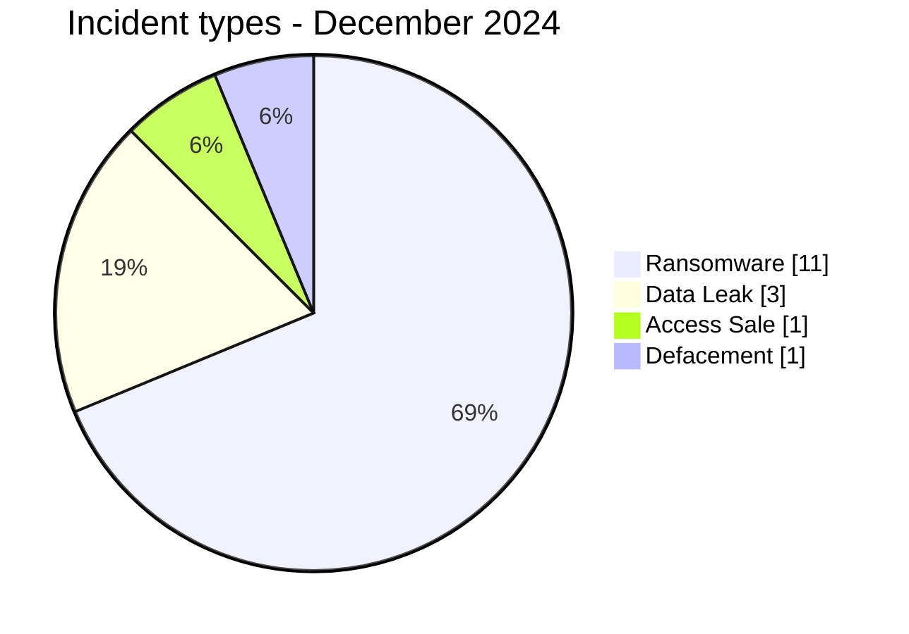

# AFRINTEL CTI Report - Cyber Threats in Africa - December 2024

👉🏾 [Version française](./README_FR.md)

## 1. Executive summary

In December 2024, AFRINTEL retains **16 canonical cyber incidents across 12 countries**. The month is led by **Ransomware (11, 68.8%)** followed by **Data Leak (3, 18.8%)**. Leading countries are **Egypt (3)**, **Nigeria (2)**, **South Africa (2)**. Leading sectors are **Government / Administration (3)**, **Finance / Banking (2)**, **Telecommunications (2)**. Most frequent actor/group labels are `FunkSec` (3), `ransomhub` (2), `killsec` (2). `Unknown` means missing attribution, not an actor.

### 1.1 Month-over-month study

| Indicator | November 2024 | December 2024 | Change |
|---|---|---|---|
| Total | 15 | 16 | +1 (+6.7%) |
| Ransomware | 12 | 11 | -1 (-8.3%) |
| Data Leak | 1 | 3 | +2 (+200.0%) |
| Access Sale | 2 | 1 | -1 (-50.0%) |
| DDoS | 0 | 0 | Stable |
| Defacement | 0 | 1 | +1 (new) |
| Account Takeover | 0 | 0 | Stable |
| System Intrusion | 0 | 0 | Stable |
| Malware | 0 | 0 | Stable |
| Operational Fraud | 0 | 0 | Stable |

### 1.2 Comparative analysis

Monthly volume **increases by 1 incident(s)**. Structural changes are: Data Leak 1->3 (+2), Defacement 0->1 (+1), Ransomware 12->11 (-1), Access Sale 2->1 (-1). This describes the documented corpus and does not necessarily equal the change in real compromises across the continent.

## 2. Methodology

- One canonical incident equals one event retained in the 2024 year.
- Historical discoveries/republications are preserved separately and do not inflate 2024 statistics.
- Incident date or best-supported window takes precedence; AFRINTEL discovery date remains separate.
- Nine AFRINTEL types are used; attempts are represented by status, never by an `Attempted Attack` type.
- Coordinated DDoS is counted by campaign.
- Type, status, confidence, impact, attribution, and source remain separate.

## 3. Incident-type distribution

| Type | Records | Share |
|---|---|---|
| Ransomware | 11 | 68.8% |
| Data Leak | 3 | 18.8% |
| Access Sale | 1 | 6.2% |
| DDoS | 0 | 0.0% |
| Defacement | 1 | 6.2% |
| Account Takeover | 0 | 0.0% |
| System Intrusion | 0 | 0.0% |
| Malware | 0 | 0.0% |
| Operational Fraud | 0 | 0.0% |



## 4. Country x type

| Country | Total | Ransomware | Data Leak | Access Sale | DDoS | Defacement | Account Takeover | System Intrusion | Malware | Operational Fraud |
|---|---|---|---|---|---|---|---|---|---|---|
| Egypt | 3 | 1 | 1 | 1 | 0 | 0 | 0 | 0 | 0 | 0 |
| Nigeria | 2 | 1 | 0 | 0 | 0 | 1 | 0 | 0 | 0 | 0 |
| South Africa | 2 | 2 | 0 | 0 | 0 | 0 | 0 | 0 | 0 | 0 |
| Sudan | 1 | 0 | 1 | 0 | 0 | 0 | 0 | 0 | 0 | 0 |
| Mauritania | 1 | 1 | 0 | 0 | 0 | 0 | 0 | 0 | 0 | 0 |
| Namibia | 1 | 1 | 0 | 0 | 0 | 0 | 0 | 0 | 0 | 0 |
| Zambia | 1 | 1 | 0 | 0 | 0 | 0 | 0 | 0 | 0 | 0 |
| Botswana | 1 | 1 | 0 | 0 | 0 | 0 | 0 | 0 | 0 | 0 |
| Tunisia | 1 | 1 | 0 | 0 | 0 | 0 | 0 | 0 | 0 | 0 |
| Algeria | 1 | 1 | 0 | 0 | 0 | 0 | 0 | 0 | 0 | 0 |
| Tanzania | 1 | 1 | 0 | 0 | 0 | 0 | 0 | 0 | 0 | 0 |
| Kenya | 1 | 0 | 1 | 0 | 0 | 0 | 0 | 0 | 0 | 0 |

## 5. Regional distribution

| Region | Records | Share |
|---|---|---|
| North Africa | 6 | 37.5% |
| Southern Africa | 5 | 31.2% |
| East Africa | 3 | 18.8% |
| West Africa | 2 | 12.5% |

## 6. Sector distribution

| Sector | Records | Share |
|---|---|---|
| Government / Administration | 3 | 18.8% |
| Finance / Banking | 2 | 12.5% |
| Telecommunications | 2 | 12.5% |
| Agriculture / Agribusiness | 1 | 6.2% |
| Retail / E-commerce | 1 | 6.2% |
| Water / Utilities | 1 | 6.2% |
| Manufacturing / Industry | 1 | 6.2% |
| Aviation | 1 | 6.2% |
| Professional / Business Services | 1 | 6.2% |
| Education / University | 1 | 6.2% |
| Transport / Logistics | 1 | 6.2% |
| Healthcare / Medical | 1 | 6.2% |

## 7. Actors / groups

| Actor / Group | Records | Share |
|---|---|---|
| FunkSec | 3 | 18.8% |
| ransomhub | 2 | 12.5% |
| killsec | 2 | 12.5% |
| Unknown | 2 | 12.5% |
| apt73/bashe | 1 | 6.2% |
| hunters | 1 | 6.2% |
| moneymessage | 1 | 6.2% |
| sarcoma | 1 | 6.2% |
| ransomhouse | 1 | 6.2% |
| arcusmedia | 1 | 6.2% |
| Satanic | 1 | 6.2% |

## 8. Evidence maturity

| Evidence position | Records | Share |
|---|---|---|
| Claim - Unverified | 10 | 62.5% |
| Claim - Data Sample Published | 4 | 25.0% |
| Confirmed | 1 | 6.2% |
| Corroborated | 1 | 6.2% |

### Confidence

| Confidence | Records | Share |
|---|---|---|
| Low | 8 | 50.0% |
| Medium | 4 | 25.0% |
| Very High | 3 | 18.8% |
| High | 1 | 6.2% |

## 9. Timeline

```mermaid
timeline
    title AFRINTEL - December 2024
    3 Décembre 2024 : DAL Group
- **Acteur / Groupe -** ransomhub
- **Secteur -** Agriculture / Agribusiness
- **Site web -** [dalgroup.com](https -//www.dalgroup.com)
- **Statut -** Claim - Data Sample Published
- **Niveau de confiance -** Medium
- **Niveau d'impact -** Level 4
- **Type d'incident -** Data Leak
- **Analyse -** AFRINTEL a examiné douze captures d’écran issues de l’ensemble de preuves de RansomHub. Le matériel comprend des clauses financières, des éléments de comptes bancaires et de transactions, des documents liés à des passeports, des dossiers de comptes clients et des documents internes de DAL Group. Les éléments visibles suggèrent une exposition touchant les opérations financières, les documents d’identité et l’administration de l’entreprise, plutôt qu’un fichier isolé. Les impacts possibles comprennent la fraude financière, l’usurpation d’identité, le phishing ciblé, l’imitation de fournisseurs ou de clients et l’espionnage commercial visant un grand conglomérat soudanais. Les captures ne permettent pas de confirmer le vecteur d’accès initial, l’exhaustivité du jeu de données, le nombre exact de personnes concernées ni une interruption opérationnelle. AFRINTEL ne reproduit aucune donnée personnelle, coordonnée bancaire, détail de passeport ni lien de téléchargement.
- **Description victime -** DAL Group est le plus grand conglomérat privé du Soudan, opérant dans les secteurs agroalimentaire, industriel, agricole, de la distribution et des boissons.

----------------------------
    9 Décembre 2024 : Bankily
- **Acteur / Groupe -** apt73/bashe
- **Secteur -** Finance / Banking
- **Site web -** [bankily.mr](https -//www.bankily.mr)
- **Statut -** Claim - Unverified
- **Type d'incident -** Ransomware
- **Niveau de confiance -** Low
- **Niveau d'impact -** Level 3
- **Description victime -** Bankily est une plateforme de mobile banking mauritanienne exploitée par la Banque Populaire de Mauritanie (BPM), fournissant des services financiers numériques et de paiement mobile.

----------------------------
    10 Décembre 2024 : Telecom Namibia
- **Acteur / Groupe -** hunters
- **Secteur -** Telecommunications
- **Site web -** [telecom.na](https -//www.telecom.na)
- **Statut -** Claim - Unverified
- **Type d'incident -** Ransomware
- **Niveau de confiance -** Low
- **Niveau d'impact -** Level 3
- **Description victime -** Telecom Namibia est l'opérateur national historique de télécommunications fournissant des services de voix, de haut débit, de connectivité de données et d'infrastructure en Namibie.

----------------------------
    13 Décembre 2024 : Kazyon
- **Acteur / Groupe -** moneymessage
- **Secteur -** Retail / E-commerce
- **Site web -** [kazyon.com](https -//www.kazyon.com)
- **Statut -** Claim - Unverified
- **Type d'incident -** Ransomware
- **Niveau de confiance -** Low
- **Niveau d'impact -** Level 2
- **Description victime -** Kazyon est une grande chaîne égyptienne de supermarchés hard-discount proposant des produits alimentaires, ménagers et de consommation via un large réseau de magasins.

----------------------------
    15 Décembre 2024 : Tumeny Payments Limited
- **Acteur / Groupe -** killsec
- **Secteur -** Finance / Banking
- **Site web -** [tumenypay.com](https -//www.tumenypay.com)
- **Statut -** Claim - Unverified
- **Type d'incident -** Ransomware
- **Niveau de confiance -** Low
- **Niveau d'impact -** Level 2
- **Description victime -** Tumeny Payments Limited est une fintech zambienne fournissant des services de paiement numérique, transfert d'argent et infrastructures de paiement.

----------------------------
    16 Décembre 2024 : Gouvernement de l'État d'Ekiti
- **Acteur / Groupe -** FunkSec
- **Secteur -** Government / Administration
- **Site web -** [ekitistate.gov.ng](https -//ekitistate.gov.ng)
- **Statut -** Claim - Data Sample Published
- **Type d'incident -** Ransomware
- **Niveau de confiance -** Very High
- **Niveau d'impact -** Level 4
- **Description victime -** Le gouvernement de l'État d'Ekiti est l'administration exécutive de cet État du sud-ouest du Nigeria. Son portail officiel héberge des informations sur les ministères, agences et services publics, y compris des contenus liés au recrutement, à destination des résidents et des agents de l'État.
- **Analyse -** AFRINTEL a examiné une archive locale cohérente avec la revendication du cybercriminel funksec, comprenant un avis de fuite référençant ekitistate.gov.ng et décrivant une base de données de plus de 300 Mo, ainsi qu'une bibliothèque documentaire du site de plus de 17 000 fichiers image individuels (environ 530 Mo) collectée depuis le dépôt de fichiers du portail. L'échantillon examiné inclut des documents d'identification personnelle (scans de type passeport), des curriculum vitae comportant des champs de données personnelles tels que date de naissance, adresse, numéro de téléphone, email et religion, ainsi qu'un tableau de présélection de candidats de la Police Service Commission listant des candidats retenus par nom, zone d'administration locale, village et sexe pour une campagne de recrutement de 2019. Le volume et la structure du matériel examiné, des schémas de nommage de fichiers systématiquement rattachés à des personnes nommées, et la présence d'un modèle de document officiel du gouvernement d'État, soutiennent une évaluation à très haute confiance d'une exposition de données réelle plutôt qu'une simple revendication. Compte tenu du rôle de l'État d'Ekiti en tant qu'administration publique infranationale et de la présence de documents d'identité de citoyens et d'agents publics, cet incident présente un risque significatif d'usurpation d'identité, de phishing ciblé et d'imposture. AFRINTEL ne reproduit aucun nom, numéro de passeport, coordonnée ni autre identifiant personnel issu du matériel examiné.

----------------------------

- **Qualification de la preuve -** L'archive examinée soutient fortement une exposition réelle de données associée au gouvernement de l'État d'Ekiti. Elle n'établit pas indépendamment un chiffrement ransomware, le vecteur d'accès initial ni une perturbation opérationnelle.
    18 Décembre 2024 : National Bureau of Statistics (NBS)
- **Date de l'incident -** 18 décembre 2024
- **Date de publication initiale -** 18 décembre 2024
- **Date de correction AFRINTEL -** 23 août 2026
- **Acteur / Groupe -** Unknown
- **Secteur -** Government / Administration
- **Site web -** [nigerianstat.gov.ng](https -//www.nigerianstat.gov.ng/)
- **Statut -** Victim Confirmed
- **Type d'incident -** Defacement
- **Niveau de confiance -** Very High
- **Niveau d'impact -** Level 3
- **Description victime -** Le National Bureau of Statistics du Nigeria est l'autorité statistique nationale et exploite un important référentiel public de statistiques économiques, démographiques et sociales.
- **Analyse -** Le 18 décembre 2024, le NBS a confirmé via son compte officiel sur les réseaux sociaux que son site web avait été piraté et a demandé au public d'ignorer les informations publiées jusqu'au rétablissement du service. Des publications indépendantes ont documenté un message `Page hacked`. Le site est resté indisponible pendant plusieurs semaines avant sa restauration en janvier 2025, perturbant matériellement l'accès public aux statistiques nationales. Aucun élément public dans les sources examinées n'établit un vol des bases de données backend, l'identité d'un attaquant ou une exfiltration confirmée. AFRINTEL classe donc la fiche en `Defacement`, la perturbation de service étant conservée comme conséquence opérationnelle et non comme type d'incident séparé.
- **Qualification de la preuve -** La compromission du site et le défacement sont confirmés par la victime ; la perturbation de service est documentée. Le vol de données backend et l'attribution de l'attaquant restent non confirmés.
- **Sources publiques -** TheCable et BusinessDay, documentés dans le dataset de correction rétrospective.

----------------------------
    20 Décembre 2024 : Water Utilities Corporation (WUC)
- **Acteur / Groupe -** killsec
- **Secteur -** Water / Utilities
- **Site web -** [wuc.bw](https -//www.wuc.bw)
- **Statut -** Claim - Unverified
- **Type d'incident -** Ransomware
- **Niveau de confiance -** Low
- **Niveau d'impact -** Level 3
- **Description victime -** Water Utilities Corporation (WUC) est l'entreprise publique botswanaise chargée de l'approvisionnement, de la distribution et de la gestion des services d'eau.

----------------------------
    21 Décembre 2024 : Groupe SETCAR
- **Acteur / Groupe -** ransomhub
- **Secteur -** Manufacturing / Industry
- **Site web -** [groupe-setcar.com.tn](https -//www.groupe-setcar.com.tn)
- **Statut -** Claim - Unverified
- **Type d'incident -** Ransomware
- **Niveau de confiance -** Low
- **Niveau d'impact -** Level 2
- **Description victime -** Le Groupe SETCAR est un groupe industriel tunisien spécialisé dans les bus, autocars, véhicules industriels, activités automobiles et solutions de transport associées.

----------------------------
    23 Décembre 2024 - première observation rapportée : EgyptAir
- **Date de l'incident -** 23 Décembre 2024 - première observation rapportée
- **Date de publication initiale / source retenue -** 26 décembre 2024 - date d'indexation de la source d'audit
- **Date de découverte AFRINTEL -** 23 août 2026 - audit rétrospectif
- **Précision chronologique -** Le 23 décembre correspond à la première observation rapportée ; la date d'obtention de l'accès n'est pas établie publiquement.
- **Acteur / Groupe -** FunkSec
- **Secteur -** Aviation
- **Site web -** [egyptair.com](https -//www.egyptair.com/)
- **Statut -** Claim - Unverified
- **Type d'incident -** Access Sale
- **Niveau de confiance -** Medium
- **Niveau d'impact -** Level 4
- **Analyse -** FunkSec a listé EgyptAir fin décembre 2024 avec une offre de vente d'accès. Plusieurs trackers documentent la revendication, mais aucune confirmation publique de la victime n'a été identifiée dans l'audit. Le périmètre, la validité de l'accès, sa persistance, une exploitation ultérieure et une éventuelle exfiltration restent non confirmés. AFRINTEL retient `Access Sale` et ne convertit pas la revendication en ransomware ou Data Leak.
- **Sources publiques -** [Digital Checkmark](https -//digitalchk.com/ransomware-group/funksec/) | [BreachSense](https -//www.breachsense.com/breaches/2024/december/) | [Phillips Consulting](https -//phillipsconsulting.net/articles_post/flying-high-staying-secure-navigating-the-top-two-cybersecurity-challenges-in-aviation/)

----------------------------
    24 Décembre 2024 : Baker Tilly Morrison Murray
- **Acteur / Groupe -** sarcoma
- **Secteur -** Professional / Business Services
- **Site web -** [bakertillymm.co.za](https -//www.bakertillymm.co.za)
- **Statut -** Claim - Data Sample Published
- **Type d'incident -** Ransomware
- **Niveau de confiance -** Medium
- **Niveau d'impact -** Level 3
- **Description victime -** Baker Tilly Morrison Murray est un cabinet sud-africain de services professionnels fournissant des services de comptabilité, audit, fiscalité et conseil.
- **Analyse -** AFRINTEL a examiné des captures conservées dans le répertoire de preuves `bakertillymm.co.za` et y a observé des documents d’identité sud-africains, dont un passeport, ainsi que des documents contractuels et liés à l’emploi. L’échantillon est cohérent avec le type de dossiers sensibles susceptibles d’être traités par un cabinet de comptabilité et de conseil, mais il ne permet pas d’établir l’étendue totale de la divulgation alléguée ni le nombre complet de personnes concernées. L’association de documents d’identité et de pièces contractuelles crée un risque de fraude à l’identité, d’ingénierie sociale ciblée, d’usurpation d’employés et de fraude secondaire visant des clients ou des partenaires. Le matériel examiné justifie une évaluation à confiance moyenne selon laquelle un échantillon de données a été publié dans le cadre de la revendication de Sarcoma ; AFRINTEL ne reproduit aucun nom, numéro de document, date de naissance, adresse ni autre donnée personnelle issue des captures.

----------------------------
    24 Décembre 2024 : ASJP (Algerian Scientific Journal Platform)
- **Acteur / Groupe -** FunkSec
- **Secteur -** Education / University
- **Site web -** [asjp.cerist.dz](https -//asjp.cerist.dz)
- **Statut -** Claim - Data Sample Published
- **Type d'incident -** Ransomware
- **Niveau de confiance -** Very High
- **Niveau d'impact -** Level 4
- **Description victime -** L'ASJP (Algerian Scientific Journal Platform) est une plateforme nationale de publication électronique développée et exploitée par le CERIST (Centre de Recherche sur l'Information Scientifique et Technique), un organisme de recherche public algérien. Elle indexe et héberge le texte intégral de plus de 700 revues scientifiques algériennes couvrant toutes les disciplines académiques.
- **Analyse -** AFRINTEL a examiné une archive locale cohérente avec la revendication du cybercriminel funksec, comprenant une sauvegarde du système de fichiers côté serveur (archive tar, propriété des fichiers attribuée au compte du serveur web www-data) de l'arborescence des avatars utilisateurs de la plateforme, contenant plus de 1 700 dossiers utilisateurs individuels avec des photos de profil liées aux comptes, datées entre 2017 et 2024, ainsi qu'une liste structurée distincte de 499 enregistrements nom/email. Les dossiers utilisateurs sont majoritairement rattachés à des domaines email d'universités algériennes (dont univ-biskra.dz, univ-tlemcen.dz, univ-batna.dz, univ-tiaret.dz, univ-guelma.dz, univ-alger2.dz, univ-alger3.dz, univ-constantine2.dz, univ-constantine3.dz, univ-msila.dz, univ-mosta.dz, lagh-univ.dz et edu.univ-oran1.dz, entre autres), cohérent avec le rôle de l'ASJP en tant que plateforme nationale algérienne de publication de revues académiques, aux côtés d'une part plus réduite de contributeurs académiques internationaux soumettant à des revues hébergées en Algérie. La présence d'une sauvegarde côté serveur authentique, avec une propriété de fichiers du serveur web et des horodatages cohérents sur plusieurs années, corroborée par un export nom/email distinct, soutient une évaluation à très haute confiance d'une compromission réelle au niveau du système de fichiers plutôt qu'une simple revendication. Compte tenu du rôle de l'ASJP en tant qu'infrastructure nationale de publication scientifique exploitée par un organisme d'État (CERIST), de l'ampleur de la base d'utilisateurs exposée et de la nature de l'accès au niveau du système de fichiers, cet incident présente un risque systémique pour l'écosystème algérien de publication académique, incluant du phishing à grande échelle, la prise de contrôle de comptes et l'usurpation d'identité de chercheurs et de personnel de revues. AFRINTEL ne reproduit aucun nom, adresse email ni identifiant de compte utilisateur issu du matériel examiné.

----------------------------

- **Qualification de la preuve -** Le matériel côté serveur examiné soutient fortement une compromission au niveau du système de fichiers associée à ASJP. Il n'établit pas indépendamment un chiffrement ransomware, une interruption de service ni le mécanisme d'accès initial.
    28 Décembre 2024 : Cell C
- **Acteur / Groupe -** ransomhouse
- **Secteur -** Telecommunications
- **Site web -** [cellc.co.za](https -//www.cellc.co.za)
- **Statut -** Claim - Unverified
- **Type d'incident -** Ransomware
- **Niveau de confiance -** Low
- **Niveau d'impact -** Level 3
- **Description victime -** Cell C est un opérateur mobile sud-africain fournissant des services de voix, données, messagerie et télécommunications mobiles.

----------------------------
    29 Décembre 2024 : WOSAC
- **Acteur / Groupe -** arcusmedia
- **Secteur -** Transport / Logistics
- **Site web -** [wosac.co.tz](https -//www.wosac.co.tz)
- **Statut -** Claim - Unverified
- **Type d'incident -** Ransomware
- **Niveau de confiance -** Low
- **Niveau d'impact -** Level 2
- **Description victime -** WOSAC est une entreprise tanzanienne de transport maritime et d'agence maritime fournissant des services de fret, shipping et logistique associée.

----------------------------
    Décembre 2024 - date exacte de l'incident non établie publiquement : Micro and Small Enterprises Authority (MSEA)
- **Date de l'incident -** Décembre 2024 - date exacte non établie publiquement
- **Date de publication initiale -** 3 décembre 2024
- **Date de correction AFRINTEL -** 23 août 2026
- **Acteur / Groupe -** Unknown
- **Secteur -** Government / Administration
- **Site web -** [msea.go.ke](https -//msea.go.ke/)
- **Statut -** Corroborated - No Direct Victim Confirmation Located
- **Type d'incident -** Data Leak
- **Niveau de confiance -** High
- **Niveau d'impact -** Level 4
- **Description victime -** MSEA est une autorité publique kenyane chargée de soutenir et de réguler le secteur des micro et petites entreprises.
- **Analyse -** Des publications de début décembre 2024 ont indiqué que MSEA avait été piratée et que des informations gouvernementales et organisationnelles étaient proposées à la vente sur des forums underground. Les catégories rapportées comprenaient notamment des dossiers d'employés, de la correspondance gouvernementale, des états financiers et des informations d'enregistrement d'entreprises. L'incident a ensuite été référencé dans l'Africa Cyberthreat Assessment d'INTERPOL ainsi que par ENACT, ce qui renforce matériellement l'évaluation selon laquelle une violation a bien eu lieu. Toutefois, aucune notification directe de MSEA n'a été retrouvée dans le jeu de sources utilisé pour l'audit rétrospectif. AFRINTEL classe donc le dossier en `Data Leak` avec une confiance `High` et un statut corroboré, et non `Victim Confirmed`. Le prix de vente revendiqué de 100 000 USD et les affirmations sur la cause technique restent des éléments de sources secondaires et ne sont pas présentés comme des faits établis.
- **Qualification de la preuve -** La violation est fortement corroborée, mais aucune confirmation directe de la victime n'a été retrouvée dans le jeu de sources examiné. Les catégories de données restent des expositions rapportées et non des constatations validées fichier par fichier.
- **Sources publiques -** Techpoint Africa ; Africa Cyberthreat Assessment d'INTERPOL ; références ENACT documentées dans le dataset de correction rétrospective.

----------------------------
    30 Décembre 2024 : Misr Pharmacies
- **Date de compromission -** Inconnue
- **Date de publication initiale observée -** 30 décembre 2024 à 20 -03 - selon la capture conservée
- **Acteur / Groupe -** Satanic
- **Secteur -** Healthcare / Medical
- **Site web -** [misrpharmacies.com](https -//misrpharmacies.com/)
- **Statut -** Claim - Unverified
- **Type d'incident -** Data Leak
- **Niveau de confiance -** Medium
- **Niveau d'impact -** Level 4
- **Description victime -** Misr Pharmacies est une enseigne pharmaceutique égyptienne disposant de services de pharmacie et de commande en ligne.
- **Analyse -** Une publication underground du 30 décembre 2024 attribuée à `Satanic` annonce explicitement une base `Misr Pharmacies Misr Online Database - Leaked, Download!`. Le post décrit des ensembles de données associés aux commandes et aux prescriptions électroniques, avec des champs liés aux clients, contacts, facturation, livraison, statut de commande et informations de prescription. Des liens de téléchargement étaient affichés au moment de la publication. Les fichiers ne sont plus disponibles au moment de la présente réévaluation, de sorte qu'AFRINTEL ne peut pas vérifier indépendamment leur authenticité, leur volume, leur contenu réel ou leur provenance technique. AFRINTEL ne reproduit aucune donnée personnelle issue de la publication.
- **Qualification de la preuve -** Le type `Data Leak` est retenu car la revendication porte explicitement sur une base divulguée et proposée au téléchargement. Le statut reste `Claim - Unverified` car les données annoncées ne sont plus disponibles pour une validation indépendante par AFRINTEL.
- **Source / provenance -** Publication underground originale attribuée à Satanic, observée le 30 décembre 2024 ; capture conservée par AFRINTEL. Aucun lien de téléchargement n'est reproduit.

----------------------------
```

## 10. CTI analysis by type

### Ransomware - 11

**11 record(s) (68.8%).** Leading countries: South Africa (2), Mauritania (1), Namibia (1). Conclusions remain limited to documented evidence; the incident type does not justify inferring an unobserved vector or impact.

### Data Leak - 3

**3 record(s) (18.8%).** Leading countries: Sudan (1), Kenya (1), Egypt (1). Conclusions remain limited to documented evidence; the incident type does not justify inferring an unobserved vector or impact.

### Defacement - 1

**1 record(s) (6.2%).** Leading countries: Nigeria (1). Conclusions remain limited to documented evidence; the incident type does not justify inferring an unobserved vector or impact.

### Access Sale - 1

**1 record(s) (6.2%).** Leading countries: Egypt (1). Conclusions remain limited to documented evidence; the incident type does not justify inferring an unobserved vector or impact.

## 11. Priority incidents for review

| Country | Organization | Type | Status | Impact | Confidence |
|---|---|---|---|---|---|
| Kenya | Micro and Small Enterprises Authority (MSEA)
- **Date de l'incident:** Décembre 2024 - date exacte non établie publiquement
- **Date de publication initiale:** 3 décembre 2024
- **Date de correction AFRINTEL:** 23 août 2026
- **Acteur / Groupe:** Unknown
- **Secteur:** Government / Administration
- **Site web:** [msea.go.ke](https://msea.go.ke/)
- **Statut:** Corroborated - No Direct Victim Confirmation Located
- **Type d'incident:** Data Leak
- **Niveau de confiance:** High
- **Niveau d'impact:** Level 4
- **Description victime:** MSEA est une autorité publique kenyane chargée de soutenir et de réguler le secteur des micro et petites entreprises.
- **Analyse:** Des publications de début décembre 2024 ont indiqué que MSEA avait été piratée et que des informations gouvernementales et organisationnelles étaient proposées à la vente sur des forums underground. Les catégories rapportées comprenaient notamment des dossiers d'employés, de la correspondance gouvernementale, des états financiers et des informations d'enregistrement d'entreprises. L'incident a ensuite été référencé dans l'Africa Cyberthreat Assessment d'INTERPOL ainsi que par ENACT, ce qui renforce matériellement l'évaluation selon laquelle une violation a bien eu lieu. Toutefois, aucune notification directe de MSEA n'a été retrouvée dans le jeu de sources utilisé pour l'audit rétrospectif. AFRINTEL classe donc le dossier en `Data Leak` avec une confiance `High` et un statut corroboré, et non `Victim Confirmed`. Le prix de vente revendiqué de 100 000 USD et les affirmations sur la cause technique restent des éléments de sources secondaires et ne sont pas présentés comme des faits établis.
- **Qualification de la preuve:** La violation est fortement corroborée, mais aucune confirmation directe de la victime n'a été retrouvée dans le jeu de sources examiné. Les catégories de données restent des expositions rapportées et non des constatations validées fichier par fichier.
- **Sources publiques:** Techpoint Africa ; Africa Cyberthreat Assessment d'INTERPOL ; références ENACT documentées dans le dataset de correction rétrospective.

---------------------------- | Data Leak | Corroborated - No Direct Victim Confirmation Located | Level 4 | High |
| Nigeria | Gouvernement de l'État d'Ekiti
- **Acteur / Groupe:** FunkSec
- **Secteur:** Government / Administration
- **Site web:** [ekitistate.gov.ng](https://ekitistate.gov.ng)
- **Statut:** Claim - Data Sample Published
- **Type d'incident:** Ransomware
- **Niveau de confiance:** Very High
- **Niveau d'impact:** Level 4
- **Description victime:** Le gouvernement de l'État d'Ekiti est l'administration exécutive de cet État du sud-ouest du Nigeria. Son portail officiel héberge des informations sur les ministères, agences et services publics, y compris des contenus liés au recrutement, à destination des résidents et des agents de l'État.
- **Analyse:** AFRINTEL a examiné une archive locale cohérente avec la revendication du cybercriminel funksec, comprenant un avis de fuite référençant ekitistate.gov.ng et décrivant une base de données de plus de 300 Mo, ainsi qu'une bibliothèque documentaire du site de plus de 17 000 fichiers image individuels (environ 530 Mo) collectée depuis le dépôt de fichiers du portail. L'échantillon examiné inclut des documents d'identification personnelle (scans de type passeport), des curriculum vitae comportant des champs de données personnelles tels que date de naissance, adresse, numéro de téléphone, email et religion, ainsi qu'un tableau de présélection de candidats de la Police Service Commission listant des candidats retenus par nom, zone d'administration locale, village et sexe pour une campagne de recrutement de 2019. Le volume et la structure du matériel examiné, des schémas de nommage de fichiers systématiquement rattachés à des personnes nommées, et la présence d'un modèle de document officiel du gouvernement d'État, soutiennent une évaluation à très haute confiance d'une exposition de données réelle plutôt qu'une simple revendication. Compte tenu du rôle de l'État d'Ekiti en tant qu'administration publique infranationale et de la présence de documents d'identité de citoyens et d'agents publics, cet incident présente un risque significatif d'usurpation d'identité, de phishing ciblé et d'imposture. AFRINTEL ne reproduit aucun nom, numéro de passeport, coordonnée ni autre identifiant personnel issu du matériel examiné.

----------------------------

- **Qualification de la preuve:** L'archive examinée soutient fortement une exposition réelle de données associée au gouvernement de l'État d'Ekiti. Elle n'établit pas indépendamment un chiffrement ransomware, le vecteur d'accès initial ni une perturbation opérationnelle. | Ransomware | Claim - Data Sample Published | Level 4 | Very High |
| Algeria | ASJP (Algerian Scientific Journal Platform)
- **Acteur / Groupe:** FunkSec
- **Secteur:** Education / University
- **Site web:** [asjp.cerist.dz](https://asjp.cerist.dz)
- **Statut:** Claim - Data Sample Published
- **Type d'incident:** Ransomware
- **Niveau de confiance:** Very High
- **Niveau d'impact:** Level 4
- **Description victime:** L'ASJP (Algerian Scientific Journal Platform) est une plateforme nationale de publication électronique développée et exploitée par le CERIST (Centre de Recherche sur l'Information Scientifique et Technique), un organisme de recherche public algérien. Elle indexe et héberge le texte intégral de plus de 700 revues scientifiques algériennes couvrant toutes les disciplines académiques.
- **Analyse:** AFRINTEL a examiné une archive locale cohérente avec la revendication du cybercriminel funksec, comprenant une sauvegarde du système de fichiers côté serveur (archive tar, propriété des fichiers attribuée au compte du serveur web www-data) de l'arborescence des avatars utilisateurs de la plateforme, contenant plus de 1 700 dossiers utilisateurs individuels avec des photos de profil liées aux comptes, datées entre 2017 et 2024, ainsi qu'une liste structurée distincte de 499 enregistrements nom/email. Les dossiers utilisateurs sont majoritairement rattachés à des domaines email d'universités algériennes (dont univ-biskra.dz, univ-tlemcen.dz, univ-batna.dz, univ-tiaret.dz, univ-guelma.dz, univ-alger2.dz, univ-alger3.dz, univ-constantine2.dz, univ-constantine3.dz, univ-msila.dz, univ-mosta.dz, lagh-univ.dz et edu.univ-oran1.dz, entre autres), cohérent avec le rôle de l'ASJP en tant que plateforme nationale algérienne de publication de revues académiques, aux côtés d'une part plus réduite de contributeurs académiques internationaux soumettant à des revues hébergées en Algérie. La présence d'une sauvegarde côté serveur authentique, avec une propriété de fichiers du serveur web et des horodatages cohérents sur plusieurs années, corroborée par un export nom/email distinct, soutient une évaluation à très haute confiance d'une compromission réelle au niveau du système de fichiers plutôt qu'une simple revendication. Compte tenu du rôle de l'ASJP en tant qu'infrastructure nationale de publication scientifique exploitée par un organisme d'État (CERIST), de l'ampleur de la base d'utilisateurs exposée et de la nature de l'accès au niveau du système de fichiers, cet incident présente un risque systémique pour l'écosystème algérien de publication académique, incluant du phishing à grande échelle, la prise de contrôle de comptes et l'usurpation d'identité de chercheurs et de personnel de revues. AFRINTEL ne reproduit aucun nom, adresse email ni identifiant de compte utilisateur issu du matériel examiné.

----------------------------

- **Qualification de la preuve:** Le matériel côté serveur examiné soutient fortement une compromission au niveau du système de fichiers associée à ASJP. Il n'établit pas indépendamment un chiffrement ransomware, une interruption de service ni le mécanisme d'accès initial. | Ransomware | Claim - Data Sample Published | Level 4 | Very High |
| Sudan | DAL Group
- **Acteur / Groupe:** ransomhub
- **Secteur:** Agriculture / Agribusiness
- **Site web:** [dalgroup.com](https://www.dalgroup.com)
- **Statut:** Claim - Data Sample Published
- **Niveau de confiance:** Medium
- **Niveau d'impact:** Level 4
- **Type d'incident:** Data Leak
- **Analyse:** AFRINTEL a examiné douze captures d’écran issues de l’ensemble de preuves de RansomHub. Le matériel comprend des clauses financières, des éléments de comptes bancaires et de transactions, des documents liés à des passeports, des dossiers de comptes clients et des documents internes de DAL Group. Les éléments visibles suggèrent une exposition touchant les opérations financières, les documents d’identité et l’administration de l’entreprise, plutôt qu’un fichier isolé. Les impacts possibles comprennent la fraude financière, l’usurpation d’identité, le phishing ciblé, l’imitation de fournisseurs ou de clients et l’espionnage commercial visant un grand conglomérat soudanais. Les captures ne permettent pas de confirmer le vecteur d’accès initial, l’exhaustivité du jeu de données, le nombre exact de personnes concernées ni une interruption opérationnelle. AFRINTEL ne reproduit aucune donnée personnelle, coordonnée bancaire, détail de passeport ni lien de téléchargement.
- **Description victime:** DAL Group est le plus grand conglomérat privé du Soudan, opérant dans les secteurs agroalimentaire, industriel, agricole, de la distribution et des boissons.

---------------------------- | Data Leak | Claim - Data Sample Published | Level 4 | Medium |
| Egypt | EgyptAir
- **Date de l'incident:** 23 Décembre 2024 - première observation rapportée
- **Date de publication initiale / source retenue:** 26 décembre 2024 - date d'indexation de la source d'audit
- **Date de découverte AFRINTEL:** 23 août 2026 - audit rétrospectif
- **Précision chronologique:** Le 23 décembre correspond à la première observation rapportée ; la date d'obtention de l'accès n'est pas établie publiquement.
- **Acteur / Groupe:** FunkSec
- **Secteur:** Aviation
- **Site web:** [egyptair.com](https://www.egyptair.com/)
- **Statut:** Claim - Unverified
- **Type d'incident:** Access Sale
- **Niveau de confiance:** Medium
- **Niveau d'impact:** Level 4
- **Analyse:** FunkSec a listé EgyptAir fin décembre 2024 avec une offre de vente d'accès. Plusieurs trackers documentent la revendication, mais aucune confirmation publique de la victime n'a été identifiée dans l'audit. Le périmètre, la validité de l'accès, sa persistance, une exploitation ultérieure et une éventuelle exfiltration restent non confirmés. AFRINTEL retient `Access Sale` et ne convertit pas la revendication en ransomware ou Data Leak.
- **Sources publiques:** [Digital Checkmark](https://digitalchk.com/ransomware-group/funksec/) | [BreachSense](https://www.breachsense.com/breaches/2024/december/) | [Phillips Consulting](https://phillipsconsulting.net/articles_post/flying-high-staying-secure-navigating-the-top-two-cybersecurity-challenges-in-aviation/)

---------------------------- | Access Sale | Claim - Unverified | Level 4 | Medium |

> Structured selection based on impact, status, and confidence; not an absolute severity ranking.

## 12. Intelligence gaps and corrections

**December corrections:** Misr Pharmacies is added as `Data Leak / Claim - Unverified` based on the original 30 December post. The advertised data is no longer available for independent validation. The 24 December ACAO publication is not counted as a second attack because there is no evidence proving a distinct new extraction from the incident already documented in July.

- initial-access vector often unknown;
- technical compromise date may differ from publication date;
- claimed volumes are rarely fully verifiable;
- technical attribution is often limited to the publication account;
- historical republications are tracked separately.

## 13. Recommendations

- phishing-resistant MFA, PAM, and least privilege;
- segmentation, immutable backups, and restoration testing;
- centralized EDR/IAM/VPN/WAF/DNS/cloud/application logging;
- detection of mass exports, unusual archives, and outbound transfers;
- separate preservation of incident, initial-publication, repost, and AFRINTEL discovery dates.

## 14. Conclusion

December 2024 contains **16 canonical incidents**. Month-over-month comparison uses the same taxonomy and chronology rules, except January where December 2023 remains `N/A` because no equivalent re-audit has been completed.

👉🏾 [Canonical victims](./victims.md)

**AFRINTEL** - TLP:CLEAR
