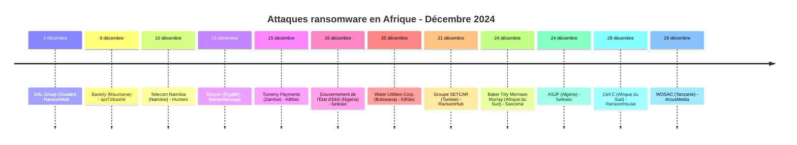
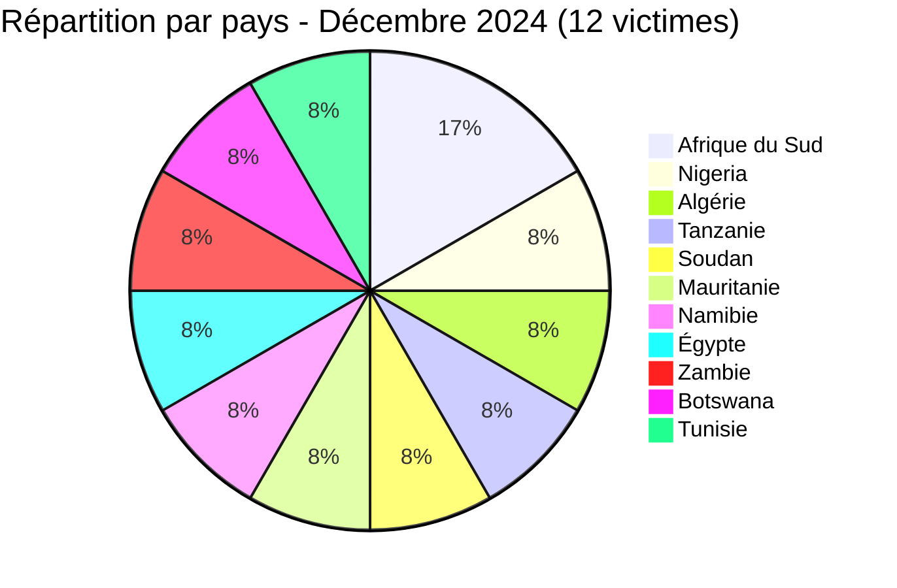

[](https://github.com/Hatchepsoute/AFRINTEL)


# Rapport CTI - Décembre 2024 : 12 victimes dans 11 pays: Cell C et infrastructures critiques ciblées en fin d'année

👉🏾 [English version available here](./README.md)

### 1. Résumé exécutif

Décembre 2024 clôture l'année avec **12 victimes** documentées d'attaques par ransomware dans 11 pays. Le mois enregistre deux attaques contre des infrastructures critiques majeures : **Cell C** (4e opérateur de téléphonie mobile d'Afrique du Sud, 13 millions de clients) revendiqué par RansomHouse, et **Water Utilities Corporation Botswana** (distribution nationale d'eau) frappé par KillSec. Le secteur financier est également touché : Bankily (mobile banking en Mauritanie) et Tumeny Payments (fintech en Zambie) sont toutes deux revendiquées. funksec revendique deux expositions massives dans les secteurs public et académique : le **gouvernement de l'État d'Ekiti** (Nigeria), corroboré par un échantillon examiné de plus de 17 000 fichiers incluant des scans de passeports et des CV, et **ASJP** (plateforme nationale algérienne de revues scientifiques, exploitée par le CERIST), corroborée par une sauvegarde côté serveur examinée couvrant plus de 1 700 comptes utilisateurs ; les deux sont évaluées à très haute confiance. DAL Group (le plus grand conglomérat privé du Soudan) et Telecom Namibia (opérateur national incumbent) complètent un mois de cibles à fort impact.

👉🏾 [Liste des victimes](./victims_FR.md)

**Chiffres clés :**
- 🔹 **12 victimes** identifiées
- 🔹 **9 groupes actifs** : RansomHub (2), KillSec (2), funksec (2), RansomHouse (1), Hunters (1), MoneyMessage (1), apt73/bashe (1), Sarcoma (1), ArcusMedia (1)
- 🔹 **Pays touchés** : Afrique du Sud (2), Nigeria (1), Algérie (1), Tanzanie (1), Soudan (1), Mauritanie (1), Namibie (1), Égypte (1), Zambie (1), Botswana (1), Tunisie (1)
- 🔹 **Secteurs** : Télécommunications (2), Banque mobile / Fintech (2), Administrations publiques, Éducation / Recherche, Agroalimentaire, Eau / Services publics, Distribution, Audit / Conseil, Automobile / Industrie, Maritime

---

### 2. Chronologie des attaques

| Date | Victime | Pays | Groupe ransomware |
|------|---------|------|-------------------|
| 3 décembre | DAL Group | Soudan | RansomHub |
| 9 décembre | Bankily | Mauritanie | apt73/bashe |
| 10 décembre | Telecom Namibia | Namibie | Hunters |
| 13 décembre | Kazyon | Égypte | MoneyMessage |
| 15 décembre | Tumeny Payments Limited | Zambie | KillSec |
| 16 décembre | Gouvernement de l'État d'Ekiti | Nigeria | funksec |
| 20 décembre | Water Utilities Corporation (WUC) | Botswana | KillSec |
| 21 décembre | Groupe SETCAR | Tunisie | RansomHub |
| 24 décembre | Baker Tilly Morrison Murray | Afrique du Sud | Sarcoma |
| 24 décembre | ASJP | Algérie | funksec |
| 28 décembre | Cell C | Afrique du Sud | RansomHouse |
| 29 décembre | WOSAC | Tanzanie | ArcusMedia |



---

### 3. Analyse des victimes

#### 3.1 Par pays

| Pays | Nombre d'attaques |
|------|-----------------|
| Afrique du Sud | 2 |
| Nigeria | 1 |
| Algérie | 1 |
| Tanzanie | 1 |
| Soudan | 1 |
| Mauritanie | 1 |
| Namibie | 1 |
| Égypte | 1 |
| Zambie | 1 |
| Botswana | 1 |
| Tunisie | 1 |



#### 3.2 Par secteur

| Secteur | Nombre |
|---------|--------|
| Télécommunications | 2 |
| Banque mobile / Fintech | 2 |
| Administrations publiques | 1 |
| Éducation / Recherche scientifique | 1 |
| Agroalimentaire / Conglomérat | 1 |
| Eau / Services publics | 1 |
| Distribution / Grande distribution | 1 |
| Audit / Comptabilité / Conseil | 1 |
| Automobile / Véhicules industriels | 1 |
| Transport maritime | 1 |

```mermaid
xychart-beta
    title "Secteurs ciblés - Décembre 2024"
    x-axis ["Télécom", "Banque/Fintech", "Admin. publique", "Éducation/Rech.", "Agroalim.", "Eau/Services", "Distribution", "Audit", "Automobile", "Maritime"]
    y-axis "Nombre d'attaques" 0 to 3
    bar [2, 2, 1, 1, 1, 1, 1, 1, 1, 1]
```

#### 3.3 Groupes ransomware

| Groupe ransomware | Nombre d'attaques |
|-----------------|-----------------|
| RansomHub | 2 |
| KillSec | 2 |
| funksec | 2 |
| RansomHouse | 1 |
| Hunters | 1 |
| MoneyMessage | 1 |
| apt73/bashe | 1 |
| Sarcoma | 1 |
| ArcusMedia | 1 |

---

### 4. Points d'attention

- **Double revendication de funksec (Nigeria, Algérie)** : la revendication contre le gouvernement de l'État d'Ekiti est corroborée par un échantillon examiné de plus de 17 000 fichiers (environ 530 Mo), incluant des scans de type passeport, des CV comportant des champs personnels sensibles et un tableau de recrutement de la Police Service Commission ; la revendication contre ASJP (Algérie) est corroborée par une sauvegarde côté serveur examinée couvrant plus de 1 700 comptes utilisateurs sur la plateforme nationale de revues académiques du CERIST. Les deux sont évaluées à très haute confiance, faisant de funksec l'acteur le plus prolifique et le mieux corroboré de décembre.
- **Cell C (Afrique du Sud)** : la revendication de RansomHouse contre le 4e opérateur du pays, 13 millions de clients, est l'attaque la plus impactante de décembre. Exposition potentielle des données personnelles abonnés, enregistrements d'usage et données de facturation à grande échelle.
- **Water Utilities Corporation Botswana** : KillSec revendique la régie nationale de l'eau, un opérateur d'infrastructure publique. Toute perturbation des systèmes opérationnels pourrait affecter l'approvisionnement en eau des populations urbaines et rurales.
- **Double attaque télécom** : Telecom Namibia et Cell C tous deux revendiqués en décembre, signalant un ciblage coordonné des télécoms africains en fin d'année.
- **Cluster fintech** : Bankily (mobile banking, Mauritanie) et Tumeny Payments (fintech, Zambie) tous deux ciblés. L'infrastructure de paiement numérique est une cible ransomware en forte croissance sur le continent.
- **DAL Group Soudan** : RansomHub revendique le plus grand conglomérat privé du Soudan, actif dans l'alimentaire, l'agroalimentaire et la distribution, dans un contexte de crise humanitaire déjà aiguë.
- **Première revendication notable d'apt73/bashe** : le groupe, suivi comme acteur actif, effectue sa revendication africaine la plus marquante avec Bankily, une plateforme utilisée quotidiennement par des milliers de personnes.
- **Dynamique de fin d'année** : 12 victimes en décembre maintient un niveau élevé, cohérent avec les années précédentes où le relâchement opérationnel de fin d'année élargit la surface d'attaque.

---

```mermaid
xychart-beta
    title "Évolution mensuelle des attaques - Année complète 2024"
    x-axis ["Jan", "Fév", "Mar", "Avr", "Mai", "Juin", "Juil", "Août", "Sep", "Oct", "Nov", "Déc"]
    y-axis "Nombre d'attaques" 0 to 16
    bar [3, 5, 7, 5, 8, 3, 7, 14, 4, 8, 12, 12]
```

**Total décembre : 12 victimes documentées.** *Remarque : les chiffres janvier-novembre ci-dessus n'ont pas été revérifiés depuis leurs fichiers `victims.md` mensuels respectifs lors de cette mise à jour ; le total annuel doit être lu depuis la synthèse annuelle (`CyberAttackAfrica/2024/README_FR.md`), recalculée indépendamment à partir des 12 fichiers sources mensuels.*

### 5. Recommandations

| Domaine | Action recommandée |
|---------|--------------------|
| Télécommunications | Durcir les systèmes de facturation et de gestion abonnés, enforcer le MFA pour les portails d'administration interne, préparer des plans de communication de crise pour les scénarios de violation de données. |
| Administrations publiques | Restreindre et surveiller l'accès aux dépôts de documents/médias contenant des pièces d'identité, appliquer le moindre privilège sur les portails gouvernementaux, prévoir des procédures de notification citoyenne en cas d'exposition massive de données personnelles. |
| Eau / Services publics | Isoler les réseaux OT/SCADA du SI d'entreprise, auditer les TTPs de KillSec, s'assurer que les plans de continuité opérationnelle sont documentés et testés. |
| Banque mobile / Fintech | Chiffrer les bases de données transactionnelles, surveiller les exfiltrations massives de données de comptes, notifier les régulateurs de manière proactive en cas de violation. |
| Conglomérats | Segmenter les réseaux des filiales pour prévenir les mouvements latéraux, conduire des audits d'accès inter-filiales. |
| Toutes organisations | Le personnel réduit en fin d'année = capacité de réponse aux incidents diminuée, s'assurer que les rotations d'astreinte sont actives et que les seuils de détection ne sont pas abaissés. |

---

*Rapport généré à partir des données OSINT AFRINTEL. Diffusion libre (TLP:CLEAR)*
