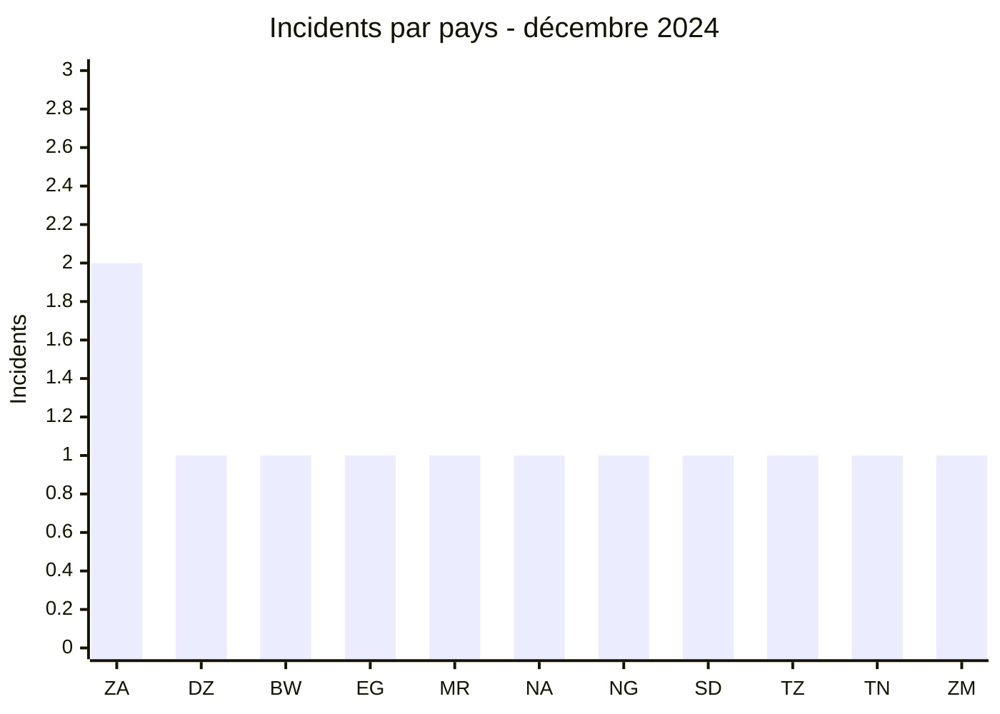
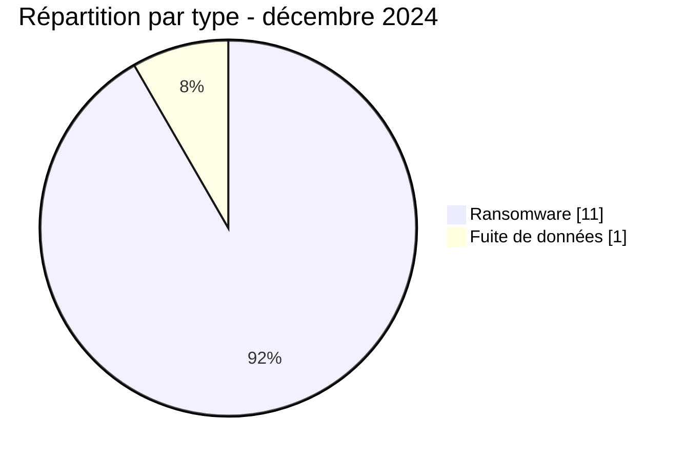

# Rapport CTI AFRINTEL - Décembre 2024

👉🏾 [English version](./README.md)

## 1. Résumé exécutif

Décembre 2024 compte **12 incidents dans 11 pays** : **11 revendications ransomware** et **1 fuite de données**. L’Afrique du Sud est le seul pays à enregistrer deux incidents. L’Afrique australe concentre cinq publications, devant l’Afrique du Nord avec quatre.

La quantité ne résume toutefois pas le mois. Quatre dossiers comportent des échantillons examinés ou publiés : DAL Group au Soudan, le gouvernement de l’État d’Ekiti au Nigeria, Baker Tilly Morrison Murray en Afrique du Sud et l’ASJP en Algérie. Les éléments associés à Ekiti et à l’ASJP apportent une profondeur de preuve nettement supérieure aux simples publications de sites de fuite. À l’inverse, aucune donnée technique publique ne permet d’établir les modalités d’accès ou l’impact opérationnel des revendications visant Cell C, Telecom Namibia ou Water Utilities Corporation.

Voir [victims_FR.md](./victims_FR.md).

## 2. Méthodologie

Le rapport couvre les incidents classés du 1er au 31 décembre 2024. Les publications d’acteurs sont rapprochées, lorsque cela est possible, des échantillons disponibles dans le corpus AFRINTEL. L’authenticité structurelle d’un échantillon, son attribution à une organisation et la méthode d’acquisition restent trois questions distinctes.

Les statistiques dérivent des **12 incidents** de [victims_FR.md](./victims_FR.md), synchronisés avec [victims.md](./victims.md). Les résultats issus des échantillons sont agrégés ; aucune donnée personnelle brute n’est reproduite.

## 3. Vue globale

| Indicateur | Valeur |
|---|---:|
| Incidents / Pays | **12 / 11** |
| Ransomware | **11** |
| Fuites de données | **1** |
| Ventes d’accès / Défacement | **0 / 0** |

### Classement par pays

| Pays | Total | Ransomware | Fuite |
|---|---:|---:|---:|
| 🇿🇦 Afrique du Sud | 2 | 2 | 0 |
| 🇩🇿 Algérie | 1 | 1 | 0 |
| 🇧🇼 Botswana | 1 | 1 | 0 |
| 🇪🇬 Égypte | 1 | 1 | 0 |
| 🇲🇷 Mauritanie | 1 | 1 | 0 |
| 🇳🇦 Namibie | 1 | 1 | 0 |
| 🇳🇬 Nigeria | 1 | 1 | 0 |
| 🇸🇩 Soudan | 1 | 0 | 1 |
| 🇹🇿 Tanzanie | 1 | 1 | 0 |
| 🇹🇳 Tunisie | 1 | 1 | 0 |
| 🇿🇲 Zambie | 1 | 1 | 0 |
| **Total** | **12** | **11** | **1** |

### Répartition régionale

| Région | Total | Ransomware | Fuite |
|---|---:|---:|---:|
| Afrique australe | 5 | 5 | 0 |
| Afrique du Nord | 4 | 4 | 0 |
| Afrique de l’Est | 2 | 1 | 1 |
| Afrique de l’Ouest | 1 | 1 | 0 |
| **Total** | **12** | **11** | **1** |

### Répartition sectorielle normalisée

| Secteur | Incidents | Part |
|---|---:|---:|
| Finance / Banque | 2 | 16,7 % |
| Télécommunications | 2 | 16,7 % |
| Agriculture / Agro-industrie | 1 | 8,3 % |
| Eau / Services essentiels | 1 | 8,3 % |
| Éducation / Université | 1 | 8,3 % |
| Gouvernement / Administration | 1 | 8,3 % |
| Industrie / Fabrication | 1 | 8,3 % |
| Services professionnels / Entreprises | 1 | 8,3 % |
| Commerce / E-commerce | 1 | 8,3 % |
| Transport / Logistique | 1 | 8,3 % |
| **Total** | **12** | **100 %** |

### Acteurs les plus visibles

| Acteur | Incidents | Nature |
|---|---:|---|
| FunkSec | 2 | Ransomware |
| KillSec | 2 | Ransomware |
| RansomHub | 2 | Ransomware et fuite |
| Six autres groupes | 1 chacun | Ransomware |

## 4. Analyse détaillée par type d’incident

### 4.1 Ransomware

Onze victimes sont publiées par huit groupes ransomware. FunkSec, KillSec et RansomHub apparaissent chacun deux fois. Les cas Ekiti et ASJP disposent des éléments les plus solides : les archives examinées sont cohérentes avec les organisations citées et contiennent des ensembles structurés de documents ou de comptes. Cette observation étaye l’exposition des données, sans établir le vecteur initial ni confirmer une interruption des services.

Les publications visant Cell C, Telecom Namibia, Water Utilities Corporation, Bankily ou Tumeny Payments concernent des fonctions importantes, mais leur criticité métier ne doit pas être confondue avec un incident technique confirmé.

### 4.2 Fuite de données

DAL Group constitue l’unique fuite de données classée du mois. Douze captures examinées présentent notamment des documents financiers, bancaires, contractuels et d’identité liés au conglomérat. L’ensemble est plus cohérent avec une exposition documentaire étendue qu’avec un document isolé. Le volume complet, le nombre de personnes concernées et la méthode d’acquisition restent inconnus.

## 5. Impact sectoriel

La finance et les télécommunications comptent deux incidents chacune. Les autres secteurs sont dispersés, mais plusieurs remplissent une fonction essentielle : eau, administration publique, recherche académique et paiements. Pour Ekiti, ASJP, DAL Group et Baker Tilly, les risques découlent de la nature des documents observés. Pour les autres cas, l’analyse d’impact reste prospective.

## 6. Profil des acteurs et évaluation du risque

| Périmètre | Niveau | Justification |
|---|---|---|
| 🇳🇬 Nigeria / 🇩🇿 Algérie | 🔴 Élevé | Échantillons structurés liés à une administration et à une plateforme académique nationale |
| 🇸🇩 Soudan | 🔴 Élevé | Documents financiers et d’identité observés dans l’échantillon DAL Group |
| 🇿🇦 Afrique du Sud | 🔴 Élevé | Deux incidents, dont un échantillon documentaire chez Baker Tilly |
| 🇧🇼 Botswana / 🇳🇦 Namibie | 🟠 Moyen | Opérateurs essentiels cités, sans impact opérationnel établi |
| Autres pays | 🟠 Moyen | Une revendication par pays, principalement sans preuve technique publique |

## 7. Tendances et lacunes de renseignement

- **Observé - confiance élevée :** 11 des 12 incidents sont classés ransomware ; DAL Group est une fuite de données et reste compté séparément.
- **Observé - confiance élevée :** quatre cas comportent des éléments publiés ou examinés, avec une profondeur variable.
- **Observé - confiance élevée :** les ensembles Ekiti et ASJP relient de manière structurée les données observées aux organisations concernées.
- **Lacune majeure :** aucun rapport DFIR public n’a été identifié dans les sources consultées pour expliquer l’accès initial, la persistance, le mouvement latéral ou l’éventuel chiffrement.
- **Lacune :** aucun élément public ne confirme une interruption chez les opérateurs télécoms ou la régie de l’eau cités.
- **Collecte attendue :** suivre les communications des victimes, la disponibilité ultérieure des données et les éventuels recoupements techniques indépendants.

## 8. Cartographie MITRE ATT&CK contextuelle

| Qualification | Technique | Utilisation défensive |
|---|---|---|
| Préventif | T1486 - Data Encrypted for Impact | Cas d’usage ransomware ; chiffrement non établi dans le corpus |
| Préventif | T1490 - Inhibit System Recovery | Détecter la suppression de clichés et l’altération des sauvegardes |
| Hypothèse - confiance moyenne | T1078 - Valid Accounts | Scénario d’accès à vérifier ; aucune télémétrie publiée |
| Préventif | T1567 - Exfiltration Over Web Service | Rechercher les transferts sortants anormaux ; canal non observé |

## 9. Recommandations

- **Télécommunications et eau :** séparer les fonctions d’administration, de facturation et d’exploitation ; tester les procédures de continuité.
- **Administration et recherche :** inventorier les dépôts documentaires, réduire leur exposition et imposer une MFA résistante au phishing.
- **Finance et conseil :** surveiller les exports, limiter les accès tiers et préparer la réponse aux fraudes secondaires.
- **Toutes organisations :** vérifier les sauvegardes hors ligne et restaurer un service prioritaire lors d’un exercice contrôlé.

## 10. Recommandations SOC et tactiques

| Qualification | Action |
|---|---|
| **Observé** | Rechercher en interne les marqueurs propres aux documents et comptes concernés, sans exposer les données personnelles. |
| **Hypothèse** | Examiner authentifications distantes atypiques, comptes de service détournés et accès privilégiés hors horaires. |
| **Préventif** | Détecter dump LSASS, PowerShell obfusqué, suppression de sauvegardes, chiffrement massif et transferts Rclone inhabituels. |

## 11. Recommandations stratégiques

| Priorité | Qualification | Mesure |
|---:|---|---|
| 1 | **Observé** | Traiter les expositions Ekiti, ASJP, DAL Group et Baker Tilly selon la sensibilité des données observées. |
| 2 | **Hypothèse** | Vérifier les scénarios d’accès par identité ou service exposé sans les présenter comme établis. |
| 3 | **Préventif** | Réduire la surface externe, fermer les RDP inutiles et rendre les sauvegardes critiques immuables et isolées. |

## 12. Conclusion

Décembre clôt l’année sur un corpus largement ransomware, mais la valeur de renseignement se concentre dans quatre dossiers étayés. La bonne lecture n’est donc pas « douze attaques confirmées » : elle consiste à distinguer les expositions documentées, les publications crédibles mais incomplètes et les revendications dont l’impact reste à vérifier.

**AFRINTEL - TLP:CLEAR**

[Dépôt AFRINTEL](https://github.com/Hatchepsoute/AFRINTEL)
