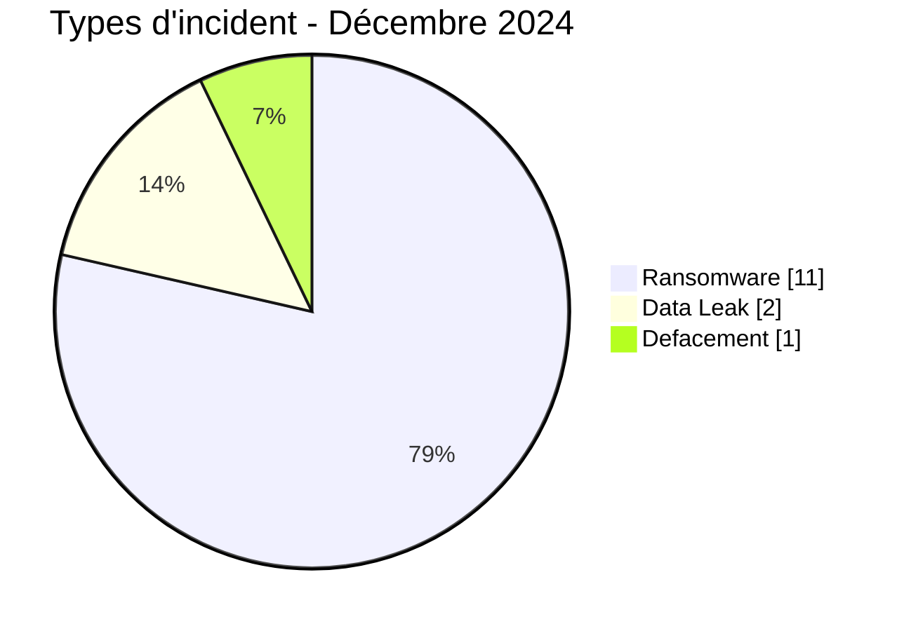
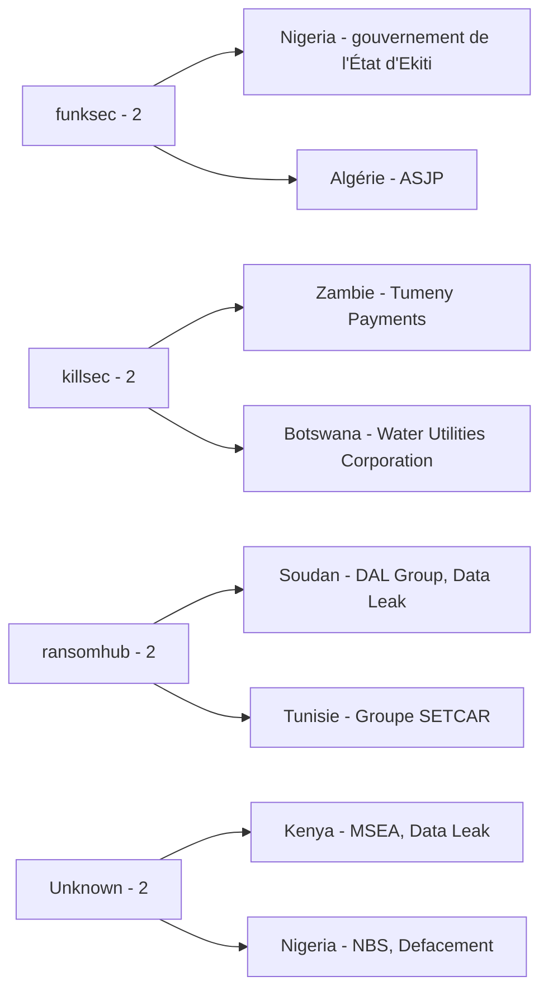
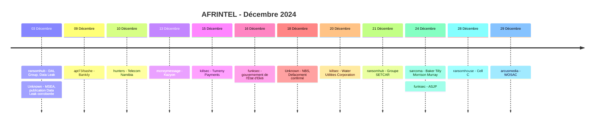

# Rapport CTI AFRINTEL - Décembre 2024

👉🏾 [English version](./README.md)

## 1. Résumé exécutif

Le corpus AFRINTEL corrigé de décembre 2024 contient **14 fiches incident documentées dans 12 pays africains** : **11 Ransomware**, **2 Data Leak** et **1 Defacement**. Aucun Access Sale, DDoS ou Operational Fraud n'est présent.

Deux corrections rétrospectives sont ajoutées. La **Micro and Small Enterprises Authority (MSEA)** au Kenya est enregistrée comme `Data Leak` avec une confiance `High` et le statut `Corroborated - No Direct Victim Confirmation Located`. Le **National Bureau of Statistics (NBS)** au Nigeria est enregistré comme `Defacement` avec le statut `Victim Confirmed`, une confiance `Very High` et une perturbation de service de plusieurs semaines documentée.

Le Nigeria compte désormais deux incidents et rejoint l'Afrique du Sud, seul autre pays à deux fiches. Le Kenya devient le douzième pays représenté en décembre.

Quatre dossiers d'origine restent particulièrement riches en preuves : DAL Group, gouvernement de l'État d'Ekiti, Baker Tilly Morrison Murray et ASJP. Les deux ajouts rétrospectifs introduisent deux profils de preuve différents : forte corroboration externe pour MSEA et confirmation directe de la victime pour NBS.

👉🏾 [Voir la liste complète des victimes](./victims_FR.md)

### 1.1 Comparaison avec le mois précédent

| Indicateur | Novembre 2024 | Décembre 2024 | Évolution |
|---|---:|---:|---:|
| Total incidents | 16 | **14** | **-2 (-12,5 %)** |
| Ransomware | 12 | **11** | **-1 (-8,3 %)** |
| Data Leak | 2 | **2** | Stable |
| Access Sale | 2 | **0** | **-2 (-100,0 %)** |
| DDoS | 0 | **0** | Stable |
| Defacement | 0 | **1** | **+1 (nouveau)** |
| Operational Fraud | 0 | **0** | Stable |

Décembre est légèrement moins volumineux que novembre corrigé, mais la diversité des preuves augmente : le corpus combine publications ransomware, deux Data Leak de maturité différente et un Defacement directement confirmé par la victime.

## 2. Méthodologie

- **Période :** 1er au 31 décembre 2024.
- **Source de vérité :** couple harmonisé `victims_FR.md` / `victims.md`.
- **Comptage :** une fiche harmonisée correspond à un incident documenté.
- **Taxonomie :** Ransomware, Data Leak, Access Sale, DDoS, Defacement, Operational Fraud.
- **Corrections rétrospectives :** MSEA et NBS sont les deux derniers incidents manquants du registre de correction 2024.
- **Règle MSEA :** les références autoritatives ultérieures renforcent matériellement l'évaluation de violation, mais aucune notification directe de MSEA n'a été retrouvée dans le jeu de sources rétrospectives examiné ; le statut reste donc corroboré plutôt que confirmé par la victime.
- **Règle NBS :** la compromission et le défacement du site sont confirmés ; aucun vol des bases backend n'est déduit.
- Authenticité de l'échantillon, attribution à la victime, mécanismes de l'incident et périmètre complet restent des questions analytiques séparées.

## 3. Vue globale

### 3.1 Répartition par type d'incident

| Type d'incident | Fiches | Part |
|---|---:|---:|
| Ransomware | **11** | **78,6 %** |
| Data Leak | **2** | **14,3 %** |
| Defacement | **1** | **7,1 %** |
| Access Sale | 0 | 0,0 % |
| DDoS | 0 | 0,0 % |
| Operational Fraud | 0 | 0,0 % |
| **Total** | **14** | **100 %** |

### 3.2 Répartition par pays

| Pays | Ransomware | Data Leak | Defacement | Total |
|---|---:|---:|---:|---:|
| 🇿🇦 Afrique du Sud | 2 | 0 | 0 | **2** |
| 🇳🇬 Nigeria | 1 | 0 | 1 | **2** |
| 🇩🇿 Algérie | 1 | 0 | 0 | 1 |
| 🇧🇼 Botswana | 1 | 0 | 0 | 1 |
| 🇪🇬 Égypte | 1 | 0 | 0 | 1 |
| 🇰🇪 Kenya | 0 | 1 | 0 | 1 |
| 🇲🇷 Mauritanie | 1 | 0 | 0 | 1 |
| 🇳🇦 Namibie | 1 | 0 | 0 | 1 |
| 🇸🇩 Soudan | 0 | 1 | 0 | 1 |
| 🇹🇿 Tanzanie | 1 | 0 | 0 | 1 |
| 🇹🇳 Tunisie | 1 | 0 | 0 | 1 |
| 🇿🇲 Zambie | 1 | 0 | 0 | 1 |
| **Total** | **11** | **2** | **1** | **14** |

### 3.3 Répartition régionale

| Région | Ransomware | Data Leak | Defacement | Total |
|---|---:|---:|---:|---:|
| Afrique australe | 5 | 0 | 0 | **5** |
| Afrique du Nord | 4 | 0 | 0 | **4** |
| Afrique de l'Est | 1 | 2 | 0 | **3** |
| Afrique de l'Ouest | 1 | 0 | 1 | **2** |
| **Total** | **11** | **2** | **1** | **14** |

### 3.4 Répartition sectorielle harmonisée

| Secteur | Fiches | Part |
|---|---:|---:|
| Government / Administration | **3** | **21,4 %** |
| Finance / Banking | 2 | 14,3 % |
| Telecommunications | 2 | 14,3 % |
| Agriculture / Agribusiness | 1 | 7,1 % |
| Retail / E-commerce | 1 | 7,1 % |
| Water / Utilities | 1 | 7,1 % |
| Manufacturing / Industry | 1 | 7,1 % |
| Professional / Business Services | 1 | 7,1 % |
| Education / University | 1 | 7,1 % |
| Transport / Logistics | 1 | 7,1 % |
| **Total** | **14** | **100 %** |

### 3.5 Acteurs / groupes

| Acteur / Groupe | Fiches |
|---|---:|
| ransomhub | 2 |
| killsec | 2 |
| funksec | 2 |
| Unknown | 2 |
| apt73/bashe | 1 |
| hunters | 1 |
| moneymessage | 1 |
| sarcoma | 1 |
| ransomhouse | 1 |
| arcusmedia | 1 |
| **Total** | **14** |

Les deux fiches `Unknown` sont MSEA et NBS. Aucun acteur d'intrusion confirmé n'est établi pour MSEA dans le jeu de sources examiné. NBS a confirmé la compromission du site, mais aucun attaquant nommé n'est établi.

## 4. Analyse détaillée

### 4.1 Ransomware - 11 fiches

Les onze dossiers ransomware restent les publications d'origine de décembre. Pour la majorité, les mécanismes techniques ne sont pas indépendamment établis.

Le **gouvernement de l'État d'Ekiti** et **ASJP** disposent des éléments techniques locaux les plus solides. L'archive Ekiti contient un important dépôt documentaire du site et des dossiers liés à l'identité qui soutiennent fortement une exposition réelle associée au portail de l'État. ASJP comprend du matériel côté serveur, plus de 1 700 dossiers utilisateurs et une liste distincte de 499 enregistrements nom/email cohérente avec la plateforme. Les deux cas disposent d'une confiance `Very High` sur l'exposition.

Ces échantillons établissent toutefois plus fortement la compromission des données que les mécanismes ransomware. Aucun des deux ne démontre indépendamment le chiffrement, l'interruption de service ou le vecteur d'accès initial.

**Baker Tilly Morrison Murray** dispose d'un échantillon plus limité comportant des documents d'identité, contractuels et liés à l'emploi, ce qui soutient une confiance `Medium` sur un échantillon publié associé à la revendication ransomware.

Les autres listings ransomware nécessitent des confirmations victimes ou des éléments techniques publics avant de considérer comme établis un chiffrement, une perturbation opérationnelle ou l'étendue d'une exfiltration.

### 4.2 Data Leak - 2 fiches

**DAL Group** reste un Data Leak étayé par échantillon. Douze captures examinées comprennent du matériel financier, bancaire, contractuel, lié aux comptes clients et à l'identité. L'ensemble soutient une exposition documentaire large, mais le volume complet, le nombre de personnes concernées et la méthode d'acquisition restent inconnus.

**MSEA** constitue l'ajout rétrospectif Data Leak. Des publications ont décrit des dossiers d'employés, de la correspondance gouvernementale, des états financiers et des données d'enregistrement d'entreprises proposés à la vente. Des références ultérieures dans l'Africa Cyberthreat Assessment d'INTERPOL et chez ENACT renforcent l'évaluation de violation. Toutefois, le jeu de sources rétrospectives examiné ne contient aucune notification directe de MSEA. AFRINTEL conserve donc une confiance `High` avec un statut corroboré et non `Victim Confirmed`. Le prix revendiqué de 100 000 USD reste un élément secondaire.

### 4.3 Defacement - NBS

Le **18 décembre 2024**, le National Bureau of Statistics du Nigeria a confirmé que son site avait été piraté et a demandé au public d'ignorer les informations publiées jusqu'au rétablissement. Des publications indépendantes ont documenté un message `Page hacked`.

Le site est resté indisponible pendant plusieurs semaines avant sa restauration en janvier 2025. Ces éléments soutiennent `Victim Confirmed`, une confiance `Very High` et un impact `Level 3` pour un Defacement avec perturbation significative du service.

Aucun élément public examiné n'établit un vol des bases statistiques backend ni l'identité d'un attaquant. AFRINTEL ne classe donc pas l'événement en Data Leak et ne déduit aucune exfiltration du seul défacement.

## 5. Principaux constats et lacunes

- Le corpus corrigé de décembre passe de **12 à 14 fiches** après l'ajout de MSEA et NBS.
- Le registre de correction annuel est désormais entièrement appliqué : **10 corrections sur 10 intégrées**.
- Government / Administration devient le premier secteur de décembre avec **3 fiches**.
- L'Afrique du Sud et le Nigeria comptent chacun **2 incidents**.
- Ekiti et ASJP fournissent des preuves très fortes par échantillons de compromission de données, sans démontrer indépendamment le chiffrement ransomware.
- MSEA est fortement corroboré mais non directement confirmé par la victime dans le jeu de sources examiné.
- NBS est confirmé par la victime comme compromission/défacement du site, sans vol confirmé des données backend.
- Les Ransomware restent dominants numériquement, mais les preuves les plus fortes du mois couvrent plusieurs formes d'incident.

## 6. Cartographie MITRE ATT&CK contextuelle

| Qualification | Technique | Utilisation défensive |
|---|---|---|
| Préventif | T1486 - Data Encrypted for Impact | Pertinent pour la surveillance ransomware ; chiffrement non établi indépendamment pour les listings de décembre. |
| Contextuel | T1213 - Data from Information Repositories | Pertinent pour les dépôts documentaires et comptes observés dans les échantillons Ekiti, ASJP et DAL Group. |
| Préventif | T1567 - Exfiltration Over Web Service | Surveiller les transferts sortants inhabituels ; les canaux d'acquisition et d'exfiltration restent non établis. |
| Non attribué | Accès initial NBS | Le défacement est confirmé, mais le mécanisme technique d'accès n'est pas établi. |

## 7. Recommandations

- Les administrations doivent surveiller les modifications de sites, protéger les comptes CMS et registrar avec une MFA résistante au phishing et conserver les logs web/applicatifs.
- MSEA doit être traité comme un dossier prioritaire de validation car la corroboration est forte même si aucune confirmation directe n'a été retrouvée dans les sources d'audit examinées.
- Pour les incidents comparables à NBS, séparer pendant l'investigation l'intégrité du site, la disponibilité du service et la confidentialité des données backend.
- Pour Ekiti et ASJP, prioriser la protection des identités, la revue des comptes et la surveillance du phishing à partir des données réellement observées, sans extrapoler les mécanismes ransomware.
- Pour les télécommunications, paiements et services d'eau, valider continuité, accès privilégiés et capacité de restauration depuis des sauvegardes isolées autour des dates de revendication.

## 8. Chronologie

## 9. Conclusion

Décembre 2024 clôt la séquence mensuelle corrigée avec **14 fiches incident documentées dans 12 pays africains** : **11 Ransomware, 2 Data Leak et 1 Defacement**. Par rapport à novembre corrigé, le corpus passe de 16 à 14 fiches, soit une baisse de **12,5 %**. Les Ransomware reculent légèrement de 12 à 11, les Data Leak restent stables à deux, les Access Sale disparaissent du corpus mensuel et le Defacement apparaît avec le dossier NBS confirmé.

Les deux corrections rétrospectives améliorent fortement la valeur de renseignement du mois parce qu'elles ajoutent des états de preuve différents des simples revendications criminelles. MSEA ne repose pas uniquement sur une publication de forum : des références autoritatives ultérieures renforcent l'évaluation selon laquelle une violation s'est produite. Pourtant, l'absence de notification directe de MSEA dans les sources d'audit examinées empêche AFRINTEL de passer le dossier en `Victim Confirmed`. Cette distinction entre forte corroboration et confirmation institutionnelle directe doit être conservée. Les catégories d'employés, de correspondance, de données financières et d'enregistrement d'entreprises peuvent être maintenues comme exposition rapportée, mais le prix revendiqué et la cause technique ne doivent pas être présentés comme indépendamment établis.

NBS représente une catégorie de preuve différente et plus claire. L'institution elle-même a confirmé que son site avait été piraté, des publications indépendantes ont documenté un message de défacement et l'indisponibilité prolongée démontre un impact réel sur le service. En revanche, aucune preuve ne permet d'établir un vol du backend statistique. La conclusion la plus solide reste donc un **Defacement confirmé avec perturbation de service**, et non un Data Leak. Cela évite de transformer automatiquement un impact d'intégrité et de disponibilité en atteinte à la confidentialité.

Le corpus d'origine de décembre contenait déjà plusieurs expositions fortement étayées. Le gouvernement de l'État d'Ekiti et ASJP fournissent des éléments `Very High` reliant des données internes structurées aux organisations concernées. DAL Group et Baker Tilly ajoutent d'autres signaux d'exposition basés sur des échantillons. Ces cas montrent que la valeur principale du mois ne réside pas uniquement dans le nombre d'étiquettes ransomware, mais dans la profondeur et la nature des éléments disponibles. Une publication associée à un ransomware peut prouver de manière convaincante une compromission de données sans démontrer indépendamment le chiffrement, tandis qu'un piratage de site confirmé peut affecter l'intégrité et la disponibilité sans démontrer une exfiltration.

La lecture sectorielle corrigée évolue également. **Government / Administration devient le premier secteur avec trois fiches**, représentant Ekiti, MSEA et NBS. Cette concentration mérite une attention particulière, mais les trois incidents ne sont pas techniquement équivalents : Ekiti est associé à une revendication ransomware avec exposition fortement étayée, MSEA est un Data Leak corroboré et NBS un Defacement confirmé. Les transformer en un seul schéma homogène d'attaque contre l'administration dépasserait ce que les preuves permettent d'affirmer.

La lecture CTI la plus défendable de décembre est donc celle d'un mois combinant **visibilité ransomware persistante, plusieurs expositions de données fortement étayées, une violation du secteur public kenyan fortement corroborée et un défacement de site nigérian directement confirmé**. La baisse par rapport à novembre ne doit pas être assimilée à une baisse proportionnelle du risque cyber continental. Décembre démontre au contraire pourquoi la valeur d'AFRINTEL dépend de la séparation constante entre type d'incident, statut, confiance, impact, chronologie et provenance des preuves.

Avec MSEA et NBS intégrés, le registre de corrections rétrospectives est désormais **entièrement appliqué : 10 cas sur 10**. La prochaine étape analytique du corpus 2024 doit être le recalcul complet des totaux annuels, pays, secteurs, acteurs, régions et de la comparaison 2024-2025 à partir des mois corrigés, et non à partir de l'ancien total annuel de 118.

**AFRINTEL** - TLP:CLEAR
