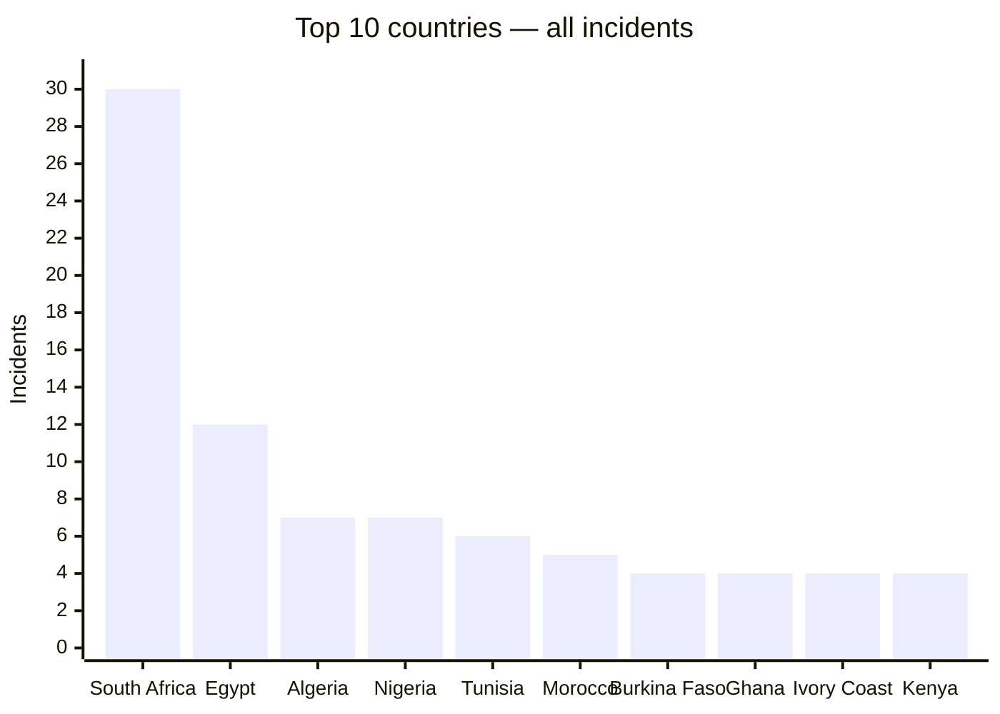
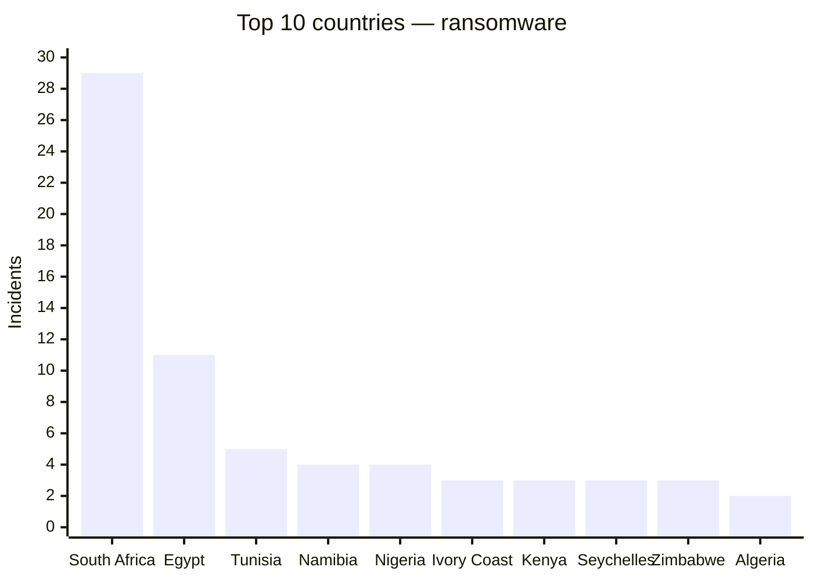
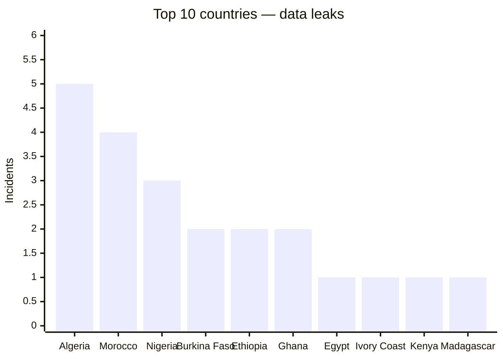

# AFRINTEL global annual CTI report — 2024

This report tracks the public visibility of cyberattacks against African organisations in 2024. Figures are recalculated from the monthly victim cards, claims counted as they appear in those sources, nothing more.

👉🏾 [French version](./README_FR.md)

## 1. Global overview

**115 records** in total: **86 ransomware**, **26 data leaks**, **3 access sales**, **0 defacements**, and 0 left without an explicit incident classification.

This ranking measures public visibility in AFRINTEL's sources, not the true scale of every attack that happened.

## Methodology

The figures come from the annual victim cards, compiled from the monthly files. A record is a documented publication or claim, not necessarily a unique victim. Forum and leak-site posts stay claims when nothing independently confirms them. This edition was fully recomputed from the 12 monthly AFRINTEL 2024 victim files (`CyberAttackAfrica/2024/*/victims.md`), the project's source of truth, and comes out at **115 records**, up from 114 in the previous edition after a newly documented claim against the University of Antananarivo (Madagascar) was added.

## 2. Overall ranking by country

| Country | Incidents |
|---|---:|
| 🇿🇦 South Africa | 30 |
| 🇪🇬 Egypt | 12 |
| 🇩🇿 Algeria | 7 |
| 🇳🇬 Nigeria | 7 |
| 🇹🇳 Tunisia | 6 |
| 🇲🇦 Morocco | 5 |
| 🇧🇫 Burkina Faso | 4 |
| 🇬🇭 Ghana | 4 |
| 🇨🇮 Ivory Coast | 4 |
| 🇰🇪 Kenya | 4 |
| 🇳🇦 Namibia | 4 |
| 🇨🇲 Cameroon | 3 |
| 🇪🇹 Ethiopia | 3 |
| 🇸🇨 Seychelles | 3 |
| 🇿🇼 Zimbabwe | 3 |
| 🇱🇾 Libya | 2 |
| 🇸🇳 Senegal | 2 |
| 🇸🇩 Sudan | 2 |
| 🇹🇿 Tanzania | 2 |
| 🇧🇼 Botswana | 1 |
| 🇨🇬 Congo | 1 |
| 🇩🇯 Djibouti | 1 |
| 🇲🇬 Madagascar | 1 |
| 🇲🇷 Mauritania | 1 |
| 🇲🇺 Mauritius | 1 |
| 🇷🇼 Rwanda | 1 |
| 🇿🇲 Zambia | 1 |

## 2.1 Country breakdown: ransomware and data leaks

This table covers every country recorded during the year. The combined total adds ransomware and data leaks. Access sales are shown separately so the incident categories remain distinct.

| Country | Ransomware | Data leaks | Total ransomware + leaks | Access sales | Defacements | Total incidents |
|---|---:|---:|---:|---:|---:|---:|
| 🇿🇦 South Africa | 29 | 1 | 30 | 0 | 0 | 30 |
| 🇪🇬 Egypt | 11 | 1 | 12 | 0 | 0 | 12 |
| 🇩🇿 Algeria | 2 | 5 | 7 | 0 | 0 | 7 |
| 🇳🇬 Nigeria | 4 | 3 | 7 | 0 | 0 | 7 |
| 🇹🇳 Tunisia | 5 | 1 | 6 | 0 | 0 | 6 |
| 🇲🇦 Morocco | 1 | 4 | 5 | 0 | 0 | 5 |
| 🇧🇫 Burkina Faso | 0 | 2 | 2 | 2 | 0 | 4 |
| 🇬🇭 Ghana | 2 | 2 | 4 | 0 | 0 | 4 |
| 🇨🇮 Ivory Coast | 3 | 1 | 4 | 0 | 0 | 4 |
| 🇰🇪 Kenya | 3 | 1 | 4 | 0 | 0 | 4 |
| 🇳🇦 Namibia | 4 | 0 | 4 | 0 | 0 | 4 |
| 🇨🇲 Cameroon | 2 | 0 | 2 | 1 | 0 | 3 |
| 🇪🇹 Ethiopia | 1 | 2 | 3 | 0 | 0 | 3 |
| 🇸🇨 Seychelles | 3 | 0 | 3 | 0 | 0 | 3 |
| 🇿🇼 Zimbabwe | 3 | 0 | 3 | 0 | 0 | 3 |
| 🇱🇾 Libya | 2 | 0 | 2 | 0 | 0 | 2 |
| 🇸🇳 Senegal | 2 | 0 | 2 | 0 | 0 | 2 |
| 🇸🇩 Sudan | 1 | 1 | 2 | 0 | 0 | 2 |
| 🇹🇿 Tanzania | 2 | 0 | 2 | 0 | 0 | 2 |
| 🇧🇼 Botswana | 1 | 0 | 1 | 0 | 0 | 1 |
| 🇨🇬 Congo | 1 | 0 | 1 | 0 | 0 | 1 |
| 🇩🇯 Djibouti | 1 | 0 | 1 | 0 | 0 | 1 |
| 🇲🇬 Madagascar | 0 | 1 | 1 | 0 | 0 | 1 |
| 🇲🇷 Mauritania | 1 | 0 | 1 | 0 | 0 | 1 |
| 🇲🇺 Mauritius | 1 | 0 | 1 | 0 | 0 | 1 |
| 🇷🇼 Rwanda | 0 | 1 | 1 | 0 | 0 | 1 |
| 🇿🇲 Zambia | 1 | 0 | 1 | 0 | 0 | 1 |

## 3. Ransomware ranking by country

| Country | Ransomware incidents |
|---|---:|
| 🇿🇦 South Africa | 29 |
| 🇪🇬 Egypt | 11 |
| 🇹🇳 Tunisia | 5 |
| 🇳🇦 Namibia | 4 |
| 🇳🇬 Nigeria | 4 |
| 🇨🇮 Ivory Coast | 3 |
| 🇰🇪 Kenya | 3 |
| 🇸🇨 Seychelles | 3 |
| 🇿🇼 Zimbabwe | 3 |
| 🇩🇿 Algeria | 2 |
| 🇨🇲 Cameroon | 2 |
| 🇬🇭 Ghana | 2 |
| 🇱🇾 Libya | 2 |
| 🇸🇳 Senegal | 2 |
| 🇹🇿 Tanzania | 2 |
| 🇧🇼 Botswana | 1 |
| 🇨🇬 Congo | 1 |
| 🇩🇯 Djibouti | 1 |
| 🇪🇹 Ethiopia | 1 |
| 🇲🇷 Mauritania | 1 |
| 🇲🇺 Mauritius | 1 |
| 🇲🇦 Morocco | 1 |
| 🇸🇩 Sudan | 1 |
| 🇿🇲 Zambia | 1 |

### Top 10 ransomware

| Country | Ransomware incidents |
|---|---:|
| 🇿🇦 South Africa | 29 |
| 🇪🇬 Egypt | 11 |
| 🇹🇳 Tunisia | 5 |
| 🇳🇦 Namibia | 4 |
| 🇳🇬 Nigeria | 4 |
| 🇨🇮 Ivory Coast | 3 |
| 🇰🇪 Kenya | 3 |
| 🇸🇨 Seychelles | 3 |
| 🇿🇼 Zimbabwe | 3 |
| 🇩🇿 Algeria | 2 |

## 4. Most visible ransomware groups

| Group | Incidents |
|---|---:|
| lockbit3 | 16 |
| ransomhub | 10 |
| killsec | 10 |
| hunters | 8 |
| spacebears | 5 |
| arcusmedia | 4 |
| blacksuit | 3 |
| darkvault | 3 |
| sarcoma | 3 |
| incransom | 2 |
| madliberator | 2 |
| ransomhouse | 2 |
| meow | 2 |
| raworld | 2 |
| moneymessage | 2 |
| funksec | 2 |
| medusa | 1 |
| dragonforce | 1 |
| eldorado | 1 |
| cactus | 1 |
| BrainCipher | 1 |
| orca | 1 |
| hellcat | 1 |
| akira | 1 |
| fog | 1 |
| apt73/bashe | 1 |

## 5. Data-leak ranking by country

| Country | Data leaks |
|---|---:|
| 🇩🇿 Algeria | 5 |
| 🇲🇦 Morocco | 4 |
| 🇳🇬 Nigeria | 3 |
| 🇧🇫 Burkina Faso | 2 |
| 🇪🇹 Ethiopia | 2 |
| 🇬🇭 Ghana | 2 |
| 🇪🇬 Egypt | 1 |
| 🇨🇮 Ivory Coast | 1 |
| 🇰🇪 Kenya | 1 |
| 🇲🇬 Madagascar | 1 |
| 🇷🇼 Rwanda | 1 |
| 🇿🇦 South Africa | 1 |
| 🇸🇩 Sudan | 1 |
| 🇹🇳 Tunisia | 1 |

### Top 10 data leaks

| Country | Data leaks |
|---|---:|
| 🇩🇿 Algeria | 5 |
| 🇲🇦 Morocco | 4 |
| 🇳🇬 Nigeria | 3 |
| 🇧🇫 Burkina Faso | 2 |
| 🇪🇹 Ethiopia | 2 |
| 🇬🇭 Ghana | 2 |
| 🇪🇬 Egypt | 1 |
| 🇨🇮 Ivory Coast | 1 |
| 🇰🇪 Kenya | 1 |
| 🇲🇬 Madagascar | 1 |

## Sector distribution

Sectors here are normalised into a common vocabulary, a keyword-based classifier applied the same way to every monthly `Sector` value. Where a victim card didn't give enough to work with, the sector is recorded as not specified.

| Normalized sector | Incidents |
|---|---:|
| Technology / IT | 17 |
| Finance / Banking | 15 |
| Education / University | 12 |
| Government / Administration | 12 |
| Retail / E-commerce | 11 |
| Manufacturing / Industry | 9 |
| Healthcare / Medical | 9 |
| Professional / Business Services | 8 |
| Energy / Utilities | 5 |
| Media / Entertainment | 3 |
| Construction / Real Estate | 3 |
| Agriculture / Agribusiness | 3 |
| Transport / Logistics | 3 |
| Legal / Justice | 2 |
| Civil Society / NGO | 1 |
| Defense / Security | 1 |
| Mining | 1 |

## 6. Actors or sources associated with data leaks

| Actor / source | Leaks |
|---|---:|
| Tanaka | 6 |
| Addka72424, repost of an original post attributed to FriendlyChemist, published on a cybercriminal forum | 3 |
| ransomhub | 2 |
| Bambi, post published on a cybercriminal forum | 1 |
| DataHoes, post published on a cybercriminal forum | 1 |
| Milad, post published on a cybercriminal forum (account subsequently shown as banned) | 1 |
| Moroccan Empire; reposted by AmeliaBeaumont on a cybercriminal forum | 1 |
| NizaarFarah (source account) | 1 |
| Pedi | 1 |
| RainbowBF | 1 |
| TheColorYellow, post published on RaidForums | 1 |
| ThreatSec, publication by Tanaka on an underground forum | 1 |
| Unattributed; publication by UnknownMember | 1 |
| Unattributed; reposted by Hxp7 | 1 |
| X0Frankenstein, post published on a cybercriminal forum | 1 |
| bxxxx1 | 1 |
| r57 | 1 |
| zebi, repost published on a cybercriminal forum | 1 |

## Visualisations

The charts show the ten leading countries; the preceding tables retain the complete rankings.

## 7. CTI reading

Ransomware dominates on sheer volume, but data leaks tell a different story, usually a forum post with a SQL dump or a document sample attached rather than a leak-site listing. Claimed volumes, whether an archive is authentic, and whether repeated claims are actually linked: none of that can be settled here, it has to be checked card by card.

## 8. Cautions

Leak sites and underground forums are treated as claim sources, nothing more. Where a card has no independent confirmation, this report doesn't present the intrusion as established fact. No raw personal data is reproduced anywhere in it.

**AFRINTEL** — TLP:CLEAR
