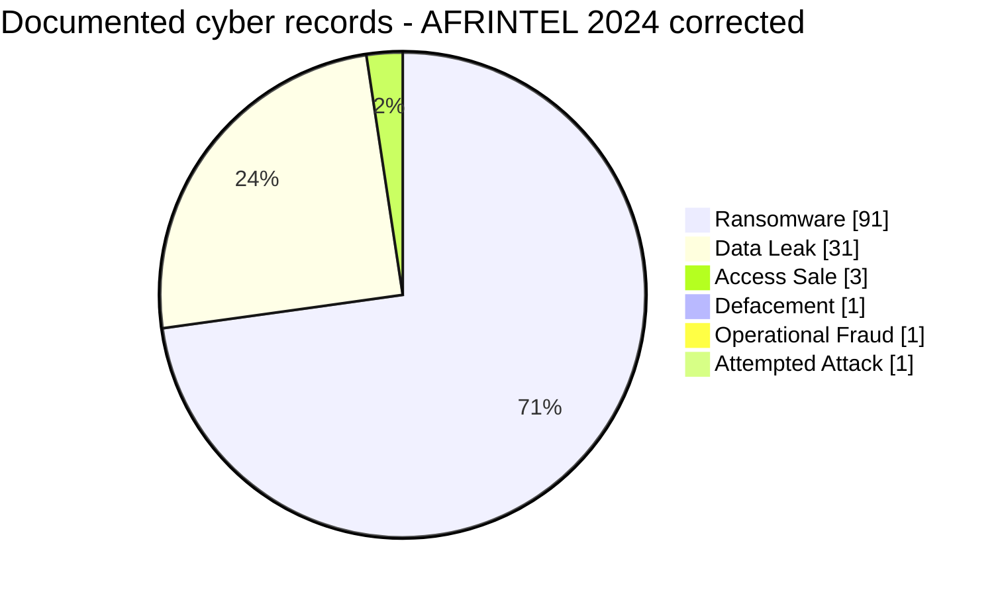
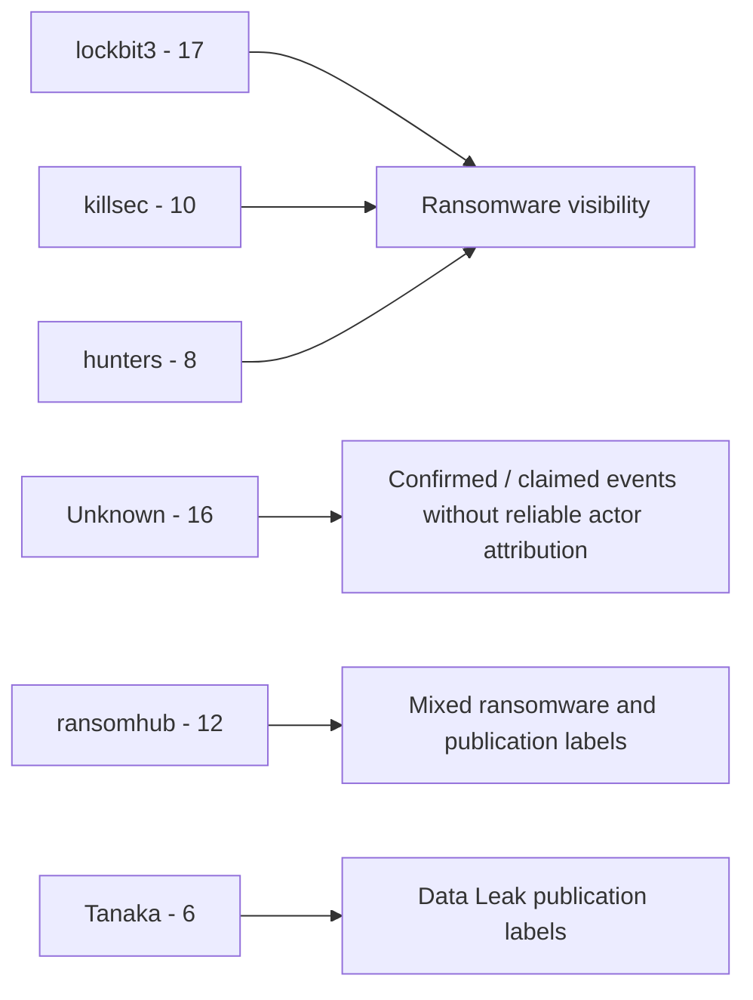

# AFRINTEL Annual CTI Report - 2024 - Corrected Edition

👉🏾 [Version française](./README_FR.md)

## 1. Executive summary

The corrected AFRINTEL 2024 corpus contains **128 documented cyber records across 28 African countries**.

Of these, **127 fall inside the six-type AFRINTEL core taxonomy**: **91 Ransomware**, **31 Data Leak**, **3 Access Sale**, **1 Defacement** and **1 Operational Fraud**. A further record, **GTBank in Nigeria**, is retained separately as a victim-confirmed **Attempted Attack** because the evidence does not support assigning it to a core incident type.

The annual correction increases the README total from 118 to 128 records and incorporates all 10 validated retrospective cases. South Africa remains the most represented country with **35 records**, followed by Egypt with 14 and Nigeria with 9. The corrected annual corpus now covers **28 countries**, with Malawi added through the retrospective passport-system incident.

The annual source files supplied for reconciliation were internally inconsistent: the uploaded README stated 118 incidents, while the uploaded annual victim file stated 115 records. This corrected edition therefore rebuilds the annual statistics and annual victim corpus directly from the twelve harmonized monthly source files rather than patching either stale annual aggregate.

The year remains ransomware-dominant, but evidential maturity varies sharply. **85 of 128 records remain `Claim - Unverified`**, while other records range from published samples to direct victim or government confirmation. Raw publication counts therefore must not be interpreted as 128 equally confirmed compromises.

👉🏾 [View the corrected annual victim corpus](./victims.md)

## 2. Annual correction impact

| Indicator | Uploaded annual README | Corrected 2024 | Difference |
|---|---:|---:|---:|
| Documented cyber records | 118 | **128** | **+10 (+8.5%)** |
| Countries | 27 | **28** | **+1 (+3.7%)** |
| Ransomware | 86 | **91** | **+5 (+5.8%)** |
| Data Leak | 29 | **31** | **+2 (+6.9%)** |
| Access Sale | 3 | **3** | Stable |
| Defacement | 0 | **1** | New |
| Operational Fraud | 0 | **1** | New |
| Attempted Attack - tracked separately | 0 | **1** | New |

The ten additions are ITAC, Eneo Cameroon, GPAA/GEPF, CIPC, Malawi Passport Issuance System, DPWI, GTBank, SABS, MSEA and NBS. Their contribution is **5 Ransomware + 2 Data Leak + 1 Defacement + 1 Operational Fraud + 1 Attempted Attack tracked separately**.

## 3. Methodology

- **Source of truth:** twelve harmonized monthly `victims.md` / `victims_FR.md` pairs.
- **Counting:** one monthly victim card equals one documented cyber record.
- **Core taxonomy:** Ransomware, Data Leak, Access Sale, DDoS, Defacement, Operational Fraud.
- **Taxonomy exception:** GTBank is kept outside the six-type taxonomy because the bank confirmed an unsuccessful website-domain compromise attempt, not a successful breach matching a core category.
- **Evidence hierarchy:** claim, sample publication, full publication, corroboration, victim confirmation and government confirmation remain distinct.
- **Reposts:** historical or recirculated data is not silently converted into a newly dated intrusion.
- **Country and sector statistics:** recomputed from the corrected monthly cards.
- **Regional scheme:** the six-region convention used in the 2024 annual report is retained, including a separate Indian Ocean category.
- **Limits:** the corpus measures AFRINTEL visibility, not the full incidence of cyber compromise across Africa.

## 4. Global overview

| Indicator | Corrected value |
|---|---:|
| Documented cyber records | **128** |
| Core six-type incidents | **127** |
| Countries | **28** |
| Ransomware | **91 (71.1% of all records)** |
| Data Leak | **31 (24.2%)** |
| Access Sale | **3 (2.3%)** |
| Defacement | **1 (0.8%)** |
| Operational Fraud | **1 (0.8%)** |
| Attempted Attack - tracked separately | **1 (0.8%)** |
| Peak months | **August and November - 16 each** |
| Lowest month | **June - 3** |

### 4.1 Corrected monthly activity

| Month | Total | Ransomware | Data Leak | Access Sale | Defacement | Operational Fraud | Attempted Attack |
|---|---:|---:|---:|---:|---:|---:|---:|
| January | 14 | 5 | 8 | 1 | 0 | 0 | 0 |
| February | 12 | 7 | 5 | 0 | 0 | 0 | 0 |
| March | 9 | 7 | 2 | 0 | 0 | 0 | 0 |
| April | 7 | 5 | 2 | 0 | 0 | 0 | 0 |
| May | 9 | 8 | 0 | 0 | 0 | 1 | 0 |
| June | 3 | 3 | 0 | 0 | 0 | 0 | 0 |
| July | 11 | 7 | 4 | 0 | 0 | 0 | 0 |
| August | 16 | 14 | 1 | 0 | 0 | 0 | 1 |
| September | 5 | 4 | 1 | 0 | 0 | 0 | 0 |
| October | 12 | 8 | 4 | 0 | 0 | 0 | 0 |
| November | 16 | 12 | 2 | 2 | 0 | 0 | 0 |
| December | 14 | 11 | 2 | 0 | 1 | 0 | 0 |
| **Total** | **128** | **91** | **31** | **3** | **1** | **1** | **1** |

**Monthly volume**

| Month | Records | Visual |
|---|---:|:---|
| January | 14 | ██████████████ |
| February | 12 | ████████████ |
| March | 9 | █████████ |
| April | 7 | ███████ |
| May | 9 | █████████ |
| June | 3 | ███ |
| July | 11 | ███████████ |
| August | 16 | ████████████████ |
| September | 5 | █████ |
| October | 12 | ████████████ |
| November | 16 | ████████████████ |
| December | 14 | ██████████████ |

## 5. Geographic distribution

### 5.1 Country ranking

| Country | Total | Ransomware | Data Leak | Access Sale | Defacement | Operational Fraud | Attempted Attack |
|---|---:|---:|---:|---:|---:|---:|---:|
| 🇿🇦 South Africa | 35 | 32 | 2 | 0 | 0 | 1 | 0 |
| 🇪🇬 Egypt | 14 | 11 | 3 | 0 | 0 | 0 | 0 |
| 🇳🇬 Nigeria | 9 | 4 | 3 | 0 | 1 | 0 | 1 |
| 🇩🇿 Algeria | 7 | 2 | 5 | 0 | 0 | 0 | 0 |
| 🇹🇳 Tunisia | 6 | 5 | 1 | 0 | 0 | 0 | 0 |
| 🇰🇪 Kenya | 5 | 3 | 2 | 0 | 0 | 0 | 0 |
| 🇲🇦 Morocco | 5 | 1 | 4 | 0 | 0 | 0 | 0 |
| 🇧🇫 Burkina Faso | 4 | 0 | 2 | 2 | 0 | 0 | 0 |
| 🇨🇲 Cameroon | 4 | 3 | 0 | 1 | 0 | 0 | 0 |
| 🇪🇹 Ethiopia | 4 | 1 | 3 | 0 | 0 | 0 | 0 |
| 🇬🇭 Ghana | 4 | 2 | 2 | 0 | 0 | 0 | 0 |
| 🇨🇮 Ivory Coast | 4 | 3 | 1 | 0 | 0 | 0 | 0 |
| 🇳🇦 Namibia | 4 | 4 | 0 | 0 | 0 | 0 | 0 |
| 🇸🇨 Seychelles | 3 | 3 | 0 | 0 | 0 | 0 | 0 |
| 🇿🇼 Zimbabwe | 3 | 3 | 0 | 0 | 0 | 0 | 0 |
| 🇱🇾 Libya | 2 | 2 | 0 | 0 | 0 | 0 | 0 |
| 🇸🇳 Senegal | 2 | 2 | 0 | 0 | 0 | 0 | 0 |
| 🇸🇩 Sudan | 2 | 1 | 1 | 0 | 0 | 0 | 0 |
| 🇹🇿 Tanzania | 2 | 2 | 0 | 0 | 0 | 0 | 0 |
| 🇧🇼 Botswana | 1 | 1 | 0 | 0 | 0 | 0 | 0 |
| 🇨🇬 Congo | 1 | 1 | 0 | 0 | 0 | 0 | 0 |
| 🇩🇯 Djibouti | 1 | 1 | 0 | 0 | 0 | 0 | 0 |
| 🇲🇬 Madagascar | 1 | 0 | 1 | 0 | 0 | 0 | 0 |
| 🇲🇼 Malawi | 1 | 1 | 0 | 0 | 0 | 0 | 0 |
| 🇲🇷 Mauritania | 1 | 1 | 0 | 0 | 0 | 0 | 0 |
| 🇲🇺 Mauritius | 1 | 1 | 0 | 0 | 0 | 0 | 0 |
| 🇷🇼 Rwanda | 1 | 0 | 1 | 0 | 0 | 0 | 0 |
| 🇿🇲 Zambia | 1 | 1 | 0 | 0 | 0 | 0 | 0 |
| **Total** | **128** | **91** | **31** | **3** | **1** | **1** | **1** |

South Africa accounts for **35 records (27.3%)** and **32 ransomware records**, but its corrected annual profile also includes two Data Leak records and one Operational Fraud case. Egypt remains second with 14 records. Nigeria rises to 9 after the GTBank and NBS corrections and now spans Ransomware, Data Leak, Defacement and the separate Attempted Attack category.

### 5.2 Regional distribution

| Region | Total | Ransomware | Data Leak | Access Sale | Defacement | Operational Fraud | Attempted Attack |
|---|---:|---:|---:|---:|---:|---:|---:|
| Southern Africa | 45 | 42 | 2 | 0 | 0 | 1 | 0 |
| North Africa | 35 | 22 | 13 | 0 | 0 | 0 | 0 |
| West Africa | 23 | 11 | 8 | 2 | 1 | 0 | 1 |
| East Africa | 15 | 8 | 7 | 0 | 0 | 0 | 0 |
| Indian Ocean | 5 | 4 | 1 | 0 | 0 | 0 | 0 |
| Central Africa | 5 | 4 | 0 | 1 | 0 | 0 | 0 |
| **Total** | **128** | **91** | **31** | **3** | **1** | **1** | **1** |

Southern Africa remains the largest regional block with **45 records**, including 42 Ransomware. North Africa follows with 35. West Africa records 23 and is the only region containing both Access Sale, the GTBank Attempted Attack and the NBS Defacement in this annual scheme.

## 6. Sector distribution

| Sector | Records | Share |
|---|---:|---:|
| Government / Administration | 21 | 16.4% |
| Finance / Banking | 16 | 12.5% |
| Manufacturing / Industry | 11 | 8.6% |
| Professional / Business Services | 11 | 8.6% |
| Technology / IT | 11 | 8.6% |
| Education / University | 10 | 7.8% |
| Healthcare / Medical | 10 | 7.8% |
| Retail / E-commerce | 9 | 7.0% |
| Telecommunications | 5 | 3.9% |
| Energy / Utilities | 4 | 3.1% |
| Media / Entertainment | 4 | 3.1% |
| Agriculture / Agribusiness | 3 | 2.3% |
| Transport / Logistics | 3 | 2.3% |
| Defense / Security | 2 | 1.6% |
| Legal / Justice | 2 | 1.6% |
| Water / Utilities | 2 | 1.6% |
| Aviation | 1 | 0.8% |
| Civil Society / NGO | 1 | 0.8% |
| Construction / Real Estate | 1 | 0.8% |
| Mining / Extractive Industries | 1 | 0.8% |
| **Total** | **128** | **100%** |

**Government / Administration** is the leading harmonized sector with **21 records (16.4%)**, followed by Finance / Banking with 16. Technology / IT, Manufacturing / Industry and Professional / Business Services each record 11.

The government total spans multiple incident types and evidence states. It therefore signals broad public-sector visibility, not one homogeneous technical campaign.

## 7. Actors and groups

### 7.1 Most visible structured labels

| Actor / Group | Records | Share |
|---|---:|---:|
| lockbit3 | 17 | 13.3% |
| Unknown | 16 | 12.5% |
| ransomhub | 12 | 9.4% |
| killsec | 10 | 7.8% |
| hunters | 8 | 6.2% |
| Tanaka | 6 | 4.7% |
| spacebears | 5 | 3.9% |
| arcusmedia | 4 | 3.1% |
| blacksuit | 3 | 2.3% |
| darkvault | 3 | 2.3% |
| sarcoma | 3 | 2.3% |
| funksec | 2 | 1.6% |
| incransom | 2 | 1.6% |
| madliberator | 2 | 1.6% |
| meow | 2 | 1.6% |

`lockbit3` is the most visible structured actor/group label with **17 records**. `Unknown` is second with 16, reflecting cases where the source or victim evidence supports an incident but not a defensible intrusion attribution. `ransomhub`, `killsec` and `hunters` follow.

These figures should be interpreted as structured labels in the harmonized cards, not as proof of shared infrastructure, affiliates or intrusion chains across every record carrying the same name.

## 8. Evidence maturity

The corrected annual corpus is not equivalent to 128 confirmed compromises.

| Evidence/status group | Records | Share |
|---|---:|---:|
| Claim - Unverified | **85** | **66.4%** |
| Claim - Data Sample Published | **32** | **25.0%** |
| Data Fully Published | **1** | **0.8%** |
| Victim/government confirmed or corroborated statuses | **10** | **7.8%** |
| **Total** | **128** | **100%** |

Confidence levels:

| Confidence | Records | Share |
|---|---:|---:|
| Low | **86** | **67.2%** |
| Medium | **21** | **16.4%** |
| High | **11** | **8.6%** |
| Very High | **10** | **7.8%** |
| **Total** | **128** | **100%** |

The 10 retrospective corrections increase annual completeness while also improving the number of records supported by victim, government or later authoritative corroboration. They do not eliminate uncertainty: Eneo and Malawi preserve ransomware-classification caveats, MSEA remains corroborated without direct victim confirmation, and GTBank remains an unsuccessful attempted attack.

## 9. H1 vs H2 comparison

| Indicator | H1 2024 | H2 2024 | Absolute change | Change |
|---|---:|---:|---:|---:|
| Documented cyber records | 54 | **74** | +20 | **+37.0%** |
| Core six-type incidents | 54 | **73** | +19 | **+35.2%** |
| Ransomware | 35 | **56** | +21 | **+60.0%** |
| Data Leak | 17 | **14** | -3 | **-17.6%** |
| Access Sale | 1 | **2** | +1 | **+100.0%** |
| Defacement | 0 | **1** | +1 | New |
| Operational Fraud | 1 | **0** | -1 | **-100.0%** |
| Attempted Attack - tracked separately | 0 | **1** | +1 | New |
| Monthly average - all records | 9.0 | **12.3** | +3.3 | **+37.0%** |

The second half is larger because ransomware publication visibility rises sharply, from 35 to 56 records. Data Leak moves in the opposite direction, from 17 to 14. The H2 increase therefore should not be described as a uniform rise across all cyber incident types.

## 10. Retrospective corrections integrated

| Month | Victim | Classification | Evidence position |
|---|---|---|---|
| January | ITAC - South Africa | Ransomware | Victim Confirmed |
| January | Eneo Cameroon | Ransomware | Victim Confirmed; ransomware classification unverified |
| February | GPAA / GEPF - South Africa | Ransomware | Victim Confirmed + Threat Actor Claim |
| February | CIPC - South Africa | Data Leak | Victim Confirmed; secondary defacement/extortion effects retained |
| February | Malawi Passport System | Ransomware | Government Confirmed; technical details contested |
| May | DPWI - South Africa | Operational Fraud | Government Confirmed - Forensic Investigation |
| August | GTBank - Nigeria | Attempted Attack | Victim Confirmed; unsuccessful attempt, tracked outside core taxonomy |
| November | SABS - South Africa | Ransomware | Government Confirmed; encryption and major disruption |
| December | MSEA - Kenya | Data Leak | Corroborated; no direct victim confirmation located |
| December | NBS - Nigeria | Defacement | Victim Confirmed; no confirmed backend dataset theft |

## 11. Detailed CTI interpretation

### 11.1 Ransomware

Ransomware accounts for **91 of 128 documented records (71.1%)** and remains the dominant annual category. South Africa alone records 32 ransomware entries, while `lockbit3` is the most visible ransomware label.

However, the evidence spectrum ranges from leak-site claims to government-confirmed operational incidents. SABS confirms real system encryption and prolonged disruption, while many other ransomware records remain low-confidence listings without public DFIR evidence. Ransomware visibility and confirmed ransomware impact therefore cannot be treated as the same metric.

### 11.2 Data Leak

The corrected year contains **31 Data Leak records**. Their maturity varies from visible samples to full publication and later corroboration. Several July records also involve recirculated historical datasets, demonstrating that discovery/publication date does not necessarily equal compromise date.

The Data Leak corpus supports risk analysis around identity exposure, phishing, fraud and secondary exploitation, but record counts do not establish a common acquisition method.

### 11.3 Access Sale

Three Access Sale records remain: one Cameroon case and two Burkina Faso public-health offers. An advertised access does not establish that the access was still valid, purchased or used. The two Burkina Faso records remain separate because the supplied evidence does not establish that they concern the same underlying system.

### 11.4 Operational Fraud

DPWI remains the only Operational Fraud record. It captures a government-confirmed cyber-enabled financial theft investigation without inventing ransomware or malware where the technical mechanism was unresolved.

### 11.5 Defacement

NBS introduces Defacement into the corrected annual taxonomy. The website hack and service disruption were confirmed, but backend statistical-data theft was not. This makes it a useful example of separating integrity/availability impact from confidentiality impact.

### 11.6 Attempted Attack tracked separately

GTBank is intentionally excluded from the six-type core taxonomy. The bank confirmed an unsuccessful attempt to compromise its website domain and stated that customer data was not compromised. Counting it as a successful breach would reduce rather than improve the accuracy of the annual corpus.

## 12. Contextual MITRE ATT&CK mapping

| Qualification | Technique | Defensive use |
|---|---|---|
| Observed in specific confirmed case | T1486 - Data Encrypted for Impact | System encryption is officially confirmed for SABS; not for every ransomware record. |
| Preventive | T1490 - Inhibit System Recovery | Monitor tampering with recovery mechanisms around ransomware incidents. |
| Conditional | T1078 - Valid Accounts | Investigate identity abuse where access or account exposure is supported; do not generalize it to all records. |
| Contextual | T1213 - Data from Information Repositories | Relevant to structured database and document-repository exposures. |
| Preventive | T1567 - Exfiltration Over Web Service | Monitor unusual outbound transfer; exfiltration channel is usually not established. |

## 13. Strategic and SOC recommendations

- Preserve a strict distinction between criminal publication, data sample, victim confirmation, government confirmation and later corroboration.
- Prioritize ransomware resilience in Southern Africa while avoiding the assumption that every listing corresponds to confirmed encryption.
- For Government / Administration, combine identity hardening, web integrity monitoring, fraud controls and continuity planning because the annual sector exposure spans several incident types.
- For Finance / Banking, prioritize phishing-resistant MFA, transaction-fraud detection, privileged-access review and monitoring of exposed account material.
- For historical or recirculated datasets, preserve original leak dates and verify credential validity before treating resurfacing as a new intrusion.
- For Access Sale records, validate access internally before concluding that a compromise was consumed or exploited.
- Keep victim and government confirmation tracking as a primary enrichment workflow for 2025 comparisons.

## 14. Annual timeline

## 15. Conclusion

The corrected AFRINTEL 2024 corpus contains **128 documented cyber records across 28 African countries**, replacing the stale annual aggregate of 118 records and the inconsistent 115-record annual victim compilation. This correction is not a cosmetic adjustment. It changes annual volume, taxonomy, geography, sector exposure, evidence maturity and the balance between the first and second halves of the year.

Ransomware remains the dominant category with **91 records**, but the corrected year is analytically broader than a ransomware-only narrative. The addition of CIPC and MSEA increases Data Leak to 31, DPWI introduces Operational Fraud, NBS introduces Defacement, and GTBank is retained as an unsuccessful Attempted Attack outside the core six-type taxonomy. These distinctions preserve incident reality more accurately than forcing every cyber event into a breach or malware category.

The geographic concentration remains pronounced. South Africa accounts for **35 records, or 27.3% of the annual corpus**, including 32 Ransomware, two Data Leak and one Operational Fraud. Egypt remains second with 14, while Nigeria rises to nine and now presents four distinct analytical profiles: Ransomware, Data Leak, Defacement and an attempted website-domain compromise. This diversity shows why country totals alone are insufficient for defensive prioritization.

The corrected sector picture places **Government / Administration first with 21 records**, followed by Finance / Banking with 16. The public-sector concentration is real within the AFRINTEL corpus, but it spans ransomware publications, data exposures, operational fraud and confirmed website compromise. It therefore does not support a single technical campaign hypothesis. Its defensive implication is broader: public institutions need simultaneous maturity in identity, web security, continuity, data protection and fraud detection.

The strongest annual conclusion concerns **evidence maturity**. Two thirds of the records remain `Claim - Unverified`. A further quarter have a published sample, while only a smaller subset is supported by victim confirmation, government confirmation, full publication or later authoritative corroboration. The 2024 corpus therefore measures **documented cyber visibility with graded evidence**, not 128 equally confirmed intrusions. This distinction must remain visible in every downstream statistic.

The retrospective corrections demonstrate the practical value of this model. SABS adds a government-confirmed ransomware event with actual encryption and operational disruption. NBS adds a confirmed defacement without evidence of backend data theft. MSEA adds a strongly corroborated breach without direct victim notification in the reviewed source set. GTBank adds a confirmed but unsuccessful attempted attack. Eneo and Malawi retain technical classification caveats instead of presenting contested ransomware mechanics as fact. Each correction improves completeness precisely because it preserves what remains unknown.

The H1/H2 comparison also becomes clearer. The second half contains **74 documented records versus 54 in H1**, a rise of 37.0%, driven mainly by Ransomware increasing from 35 to 56. Data Leak falls from 17 to 14. The annual trajectory therefore reflects changing composition as well as changing volume. It should not be translated into a claim that successful cyber intrusions across Africa rose by 37%.

The most defensible reading of AFRINTEL 2024 is consequently that the year shows **high ransomware publication visibility, strong South African concentration, sustained circulation of exposed data, growing public-sector visibility and highly uneven evidence maturity**. The operational value of the corrected annual dataset lies in separating those dimensions instead of collapsing them into a single attack count.

This corrected 2024 edition is now the appropriate baseline for a rigorous **2024 vs 2025 comparison**. Any year-on-year analysis should use the **128-record corrected corpus**, while preserving the GTBank taxonomy exception and explicitly remapping regional or sector conventions before claiming strict comparative deltas.

**AFRINTEL** - TLP:CLEAR
