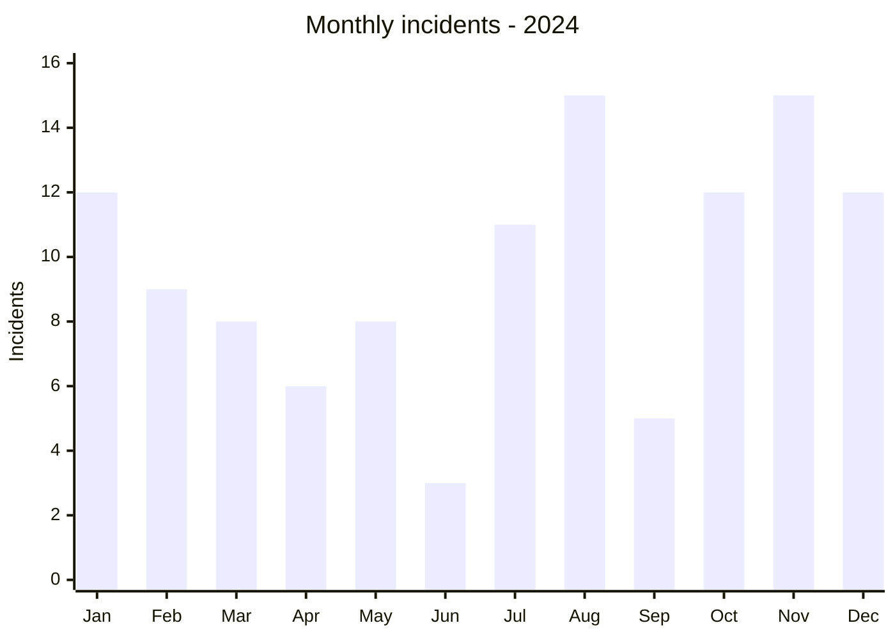
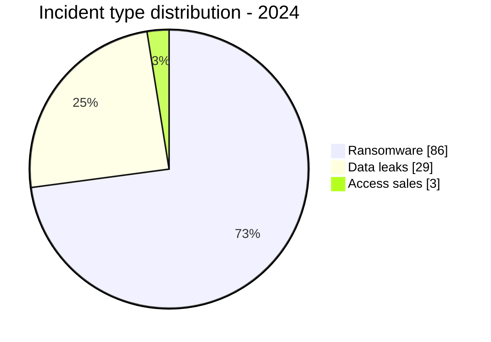
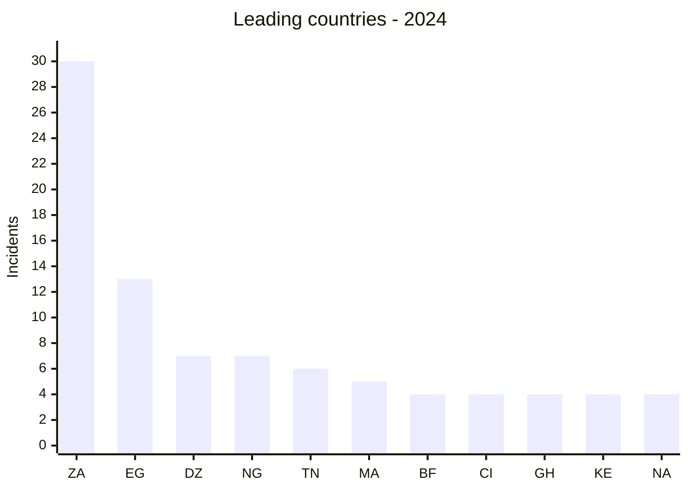

# AFRINTEL Annual CTI Report - 2024

👉🏾 [Version française](./README_FR.md)

## 1. Executive summary

AFRINTEL documented **118 incidents across 27 African countries** in 2024: **86 ransomware claims (72.9%)**, **29 data leaks (24.6%)**, and **3 access sales (2.5%)**. No defacement is present in the annual dataset.

South Africa accounts for **30 incidents**, 29 of which are ransomware. It stands well ahead of Egypt with 14 incidents, followed by Algeria and Nigeria with seven each. This concentration measures visibility in the sources monitored by AFRINTEL; it is not an exhaustive ranking of cybercrime across the continent.

The second half of the year totals **70 incidents**, compared with 47 in the first half. August and November each reach 15 publications. The increase is real within the dataset, but its causes cannot be reduced to greater attack intensity: group activity, source availability, reposts, and collection delays also influence observed volume.

The most useful defensive finding is the difference among incident categories. Ransomware is especially concentrated in Southern Africa, while leaks and access sales are distributed more broadly across North, West, and East Africa. The priorities are therefore not interchangeable: continuity and recovery for ransomware; identity, export control, and secondary fraud for exposed data and access.

See [victims.md](./victims.md).

## 2. Methodology

This report aggregates the twelve monthly `victims.md` files, synchronised with their French counterparts. Each incident is a publication tracked and classified by AFRINTEL. A claim, a repost, a published sample, and an official confirmation do not carry the same evidential weight; the assessment preserves that distinction.

Sources include ransomware leak sites, criminal forums, messaging channels, and public OSINT. Personal data is neither reproduced nor republished. Volumes announced by actors are treated as facts only when they can be checked; otherwise, they remain attributed claims.

The dataset has a visibility bias: organisations that do not communicate, unclaimed incidents, and compromises handled outside public view may escape collection. No publication therefore does not mean no incident.

## 3. Global overview

| Indicator | Value |
|---|---:|
| Incidents / Countries | **118 / 27** |
| Ransomware | **86 (74.1%)** |
| Data leaks | **29 (24.6%)** |
| Access sales | **3 (2.6%)** |
| Defacement | **0** |

### Monthly activity

| Month | Total | Ransomware | Leak | Access sale |
|---|---:|---:|---:|---:|
| January | 12 | 3 | 8 | 1 |
| February | 9 | 5 | 4 | 0 |
| March | 9 | 7 | 2 | 0 |
| April | 7 | 5 | 2 | 0 |
| May | 8 | 8 | 0 | 0 |
| June | 3 | 3 | 0 | 0 |
| July | 11 | 7 | 4 | 0 |
| August | 15 | 14 | 1 | 0 |
| September | 5 | 4 | 1 | 0 |
| October | 12 | 8 | 4 | 0 |
| November | 15 | 11 | 2 | 2 |
| December | 12 | 11 | 1 | 0 |
| **Total** | **118** | **86** | **29** | **3** |

### Country ranking

| Country | Total | Ransomware | Leak | Access sale | Bar |
|---|---:|---:|---:|---:|---|
| 🇿🇦 South Africa | 30 | 29 | 1 | 0 | ██████████████████████████████ |
| 🇪🇬 Egypt | 14 | 11 | 3 | 0 | █████████████ |
| 🇩🇿 Algeria | 7 | 2 | 5 | 0 | ███████ |
| 🇳🇬 Nigeria | 7 | 4 | 3 | 0 | ███████ |
| 🇹🇳 Tunisia | 6 | 5 | 1 | 0 | ██████ |
| 🇲🇦 Morocco | 5 | 1 | 4 | 0 | █████ |
| 🇧🇫 Burkina Faso | 4 | 0 | 2 | 2 | ████ |
| 🇨🇮 Côte d’Ivoire | 4 | 3 | 1 | 0 | ████ |
| 🇬🇭 Ghana | 4 | 2 | 2 | 0 | ████ |
| 🇰🇪 Kenya | 4 | 3 | 1 | 0 | ████ |
| 🇳🇦 Namibia | 4 | 4 | 0 | 0 | ████ |
| 🇨🇲 Cameroon | 3 | 2 | 0 | 1 | ███ |
| 🇪🇹 Ethiopia | 4 | 1 | 3 | 0 | ████ |
| 🇸🇨 Seychelles | 3 | 3 | 0 | 0 | ███ |
| 🇿🇼 Zimbabwe | 3 | 3 | 0 | 0 | ███ |
| 🇱🇾 Libya | 2 | 2 | 0 | 0 | ██ |
| 🇸🇳 Senegal | 2 | 2 | 0 | 0 | ██ |
| 🇸🇩 Sudan | 2 | 1 | 1 | 0 | ██ |
| 🇹🇿 Tanzania | 2 | 2 | 0 | 0 | ██ |
| 🇧🇼 Botswana | 1 | 1 | 0 | 0 | █ |
| 🇨🇬 Congo | 1 | 1 | 0 | 0 | █ |
| 🇩🇯 Djibouti | 1 | 1 | 0 | 0 | █ |
| 🇲🇬 Madagascar | 1 | 0 | 1 | 0 | █ |
| 🇲🇷 Mauritania | 1 | 1 | 0 | 0 | █ |
| 🇲🇺 Mauritius | 1 | 1 | 0 | 0 | █ |
| 🇷🇼 Rwanda | 1 | 0 | 1 | 0 | █ |
| 🇿🇲 Zambia | 1 | 1 | 0 | 0 | █ |
| **Total** | **118** | **86** | **29** | **3** | |

### Regional distribution

| Region | Total | Ransomware | Leak | Access sale |
|---|---:|---:|---:|---:|
| Southern Africa | 39 | 38 | 1 | 0 |
| North Africa | 35 | 22 | 13 | 0 |
| West Africa | 21 | 11 | 8 | 2 |
| East Africa | 14 | 8 | 6 | 0 |
| Indian Ocean | 5 | 4 | 1 | 0 |
| Central Africa | 4 | 3 | 0 | 1 |
| **Total** | **118** | **86** | **29** | **3** |

### Normalised sector distribution

| Sector | Incidents | Share |
|---|---:|---:|
| Finance / Banking | 15 | 12.9% |
| Government / Administration | 12 | 10.3% |
| Manufacturing / Industry | 11 | 9.5% |
| Professional / Business Services | 11 | 9.5% |
| Technology / IT | 11 | 9.5% |
| Education / University | 11 | 9.4% |
| Healthcare / Medical | 10 | 8.5% |
| Retail / E-commerce | 9 | 7.8% |
| Telecommunications | 5 | 4.3% |
| Media / Entertainment | 4 | 3.4% |
| Agriculture / Agribusiness | 3 | 2.6% |
| Oil & Energy | 3 | 2.6% |
| Transport / Logistics | 3 | 2.6% |
| Defence / Security | 2 | 1.7% |
| Legal / Justice | 2 | 1.7% |
| Water / Utilities | 2 | 1.7% |
| Aviation | 1 | 0.9% |
| Construction / Real Estate | 1 | 0.9% |
| Mining / Extractive Industries | 1 | 0.9% |
| Civil Society / NGO | 1 | 0.9% |
| **Total** | **118** | **100%** |

### Most visible actors

| Actor or source label | Incidents | Dataset share |
|---|---:|---:|
| LockBit3 | 16 | 13.7% |
| RansomHub | 12 | 10.3% |
| KillSec | 10 | 8.5% |
| Hunters | 8 | 6.8% |
| SpaceBears | 5 | 4.3% |
| ArcusMedia | 4 | 3.4% |
| Tanaka - underground-forum publication | 3 | 2.6% |
| BlackSuit | 3 | 2.6% |
| Addka72424 - repost attributed to FriendlyChemist | 3 | 2.6% |
| DarkVault | 3 | 2.6% |

## 4. Detailed analysis by incident type

### 4.1 Ransomware

Ransomware accounts for **73.5%** of the dataset. Concentration is pronounced: South Africa has 29 of the 86 publications, and the four most visible groups total 46 incidents. That visibility does not establish a shared attack chain. Source data mostly documents organisations appearing on leak sites; it rarely contains the logs or analysis needed to confirm encryption, persistence, or lateral movement.

### 4.2 Data leaks and access sales

The 29 leaks and three access sales form a more distributed set. Algeria and Morocco have a majority of leaks, while the three access sales are split between Burkina Faso and Cameroon. Several publications include structured samples; others are compilations or reposts of uncertain age. An access sale signals possible exposure, not a completed compromise.

## 5. Sectoral impact

Finance leads with 15 incidents, followed by government with 12. Manufacturing, professional services, and technology each account for 11. These volumes require different responses: transaction and identity protection in finance, service continuity in government, industrial segmentation, and control over supplier access. Sector ranking does not replace an organisation-specific sensitivity assessment.

## 6. Threat actor profile and risk assessment

| Scope | Level | Rationale |
|---|---|---|
| 🇿🇦 South Africa | 🔴 High | 30 incidents, including 29 ransomware publications |
| 🇪🇬 Egypt | 🔴 High | 14 incidents involving public and financial functions |
| 🇩🇿 Algeria / 🇳🇬 Nigeria | 🔴 High | Seven incidents each, including several data leaks |
| 🇹🇳 Tunisia / 🇲🇦 Morocco | 🟠 Medium | Five to six incidents, with different ransomware and leak profiles |
| Other countries | 🟡 Low to medium | Fewer than five incidents; case-by-case assessment required |

LockBit3, RansomHub, KillSec, and Hunters are the most frequent names. Frequency should direct monitoring, not create a presumption about tools, affiliates, or tradecraft in each incident.

## 7. Key trends and intelligence gaps

- **Observed - high confidence:** 86 of 118 incidents are classified as ransomware.
- **Observed - high confidence:** South Africa accounts for 25.6% of the annual dataset and 33.7% of ransomware publications.
- **Observed - high confidence:** the second half has 70 incidents, 22 more than the first half.
- **Observed - high confidence:** leaks and access sales are proportionally more visible in North and West Africa than in Southern Africa.
- **Major intelligence gap:** the consulted sources contain very few public African DFIR reports. Initial access vectors, dwell time, exfiltration paths, and operational impact therefore remain unknown in most cases.
- **Priority assumptions - medium confidence at the general level, low for an individual incident:** credential reuse, initial access brokers, and exploitation of exposed edge services or VPNs. The dataset does not support automatic attribution of these scenarios to the listed victims.
- **Gap:** reposts, duplicate claims, and old data can distort the perceived timing of activity.
- **Collection requirement:** strengthen data dating, victim-confirmation tracking, and the search for independent technical corroboration.

## 8. Objective comparative analysis: first and second half

| Indicator | January-June | July-December | Absolute change | Change |
|---|---:|---:|---:|---:|
| Incidents | 48 | 70 | +22 | +45.8% |
| Ransomware | 31 | 55 | +24 | +77.4% |
| Data leaks | 16 | 13 | -3 | -18.8% |
| Access sales | 1 | 2 | +1 | +100.0% |
| Defacement | 0 | 0 | 0 | Stable |
| Monthly average | 8.0 | 11.7 | +3.7 | +45.8% |

The second half contains 22 more incidents than the first. This difference is entirely explained by the increase in ransomware: 55 publications in the second half versus 31 in the first. Leaks remain close in volume (13 versus 16), while access sales rise from one to two. August and November each reach 15 publications, while June records only three.

This comparison describes the collected corpus, not a direct measure of the real frequency of intrusions. Changes may reflect actor activity, source visibility, reposts, collection delays, or classification differences. The half-year increase is therefore a robust signal within AFRINTEL’s data, but its causal attribution and operational impact remain unknown without independent confirmations and DFIR reports.

**Comparative conclusion:** the first half is more mixed, with a higher relative share of leaks (33.3% versus 18.6% in the second half), while the second half is clearly dominated by ransomware claims (78.6% versus 64.6%). Defensive priorities should therefore combine ransomware resilience and recovery with identity, export-control, and exposed-data controls.

## 9. Contextual MITRE ATT&CK mapping

| Qualification | Technique | Defensive use |
|---|---|---|
| Assumption - medium confidence | T1078 - Valid Accounts | Initial access or persistence scenario to verify |
| Assumption - medium confidence | T1190 - Exploit Public-Facing Application | Scenario for edge services; not established in the dataset |
| Preventive | T1486 - Data Encrypted for Impact | Detect mass encryption; not confirmed for every ransomware publication |
| Preventive | T1490 - Inhibit System Recovery | Alert on tampering with backups and recovery mechanisms |
| Preventive | T1567 - Exfiltration Over Web Service | Detect unusual outbound transfers; channel rarely documented |

## 10. Recommendations

- **Government and essential operators:** identify priority services, segment management planes, and test offline continuity procedures.
- **Finance and telecommunications:** require phishing-resistant MFA, monitor exports, and govern third-party access.
- **Manufacturing:** separate IT, production, and maintenance; remove shared accounts.
- **Education and healthcare:** reduce portal exposure, inventory document repositories, and prepare data-subject notification.
- **All organisations:** regularly assess Internet exposure and close unnecessary remote access.

## 11. SOC and tactical recommendations

| Qualification | Action |
|---|---|
| **Observed** | Use organisations, domains, dates, and actors in the dataset to prioritise correlation across IAM, EDR, VPN, WAF, DNS, proxy, and mail telemetry. |
| **Assumption** | Hunt for access from unusual infrastructure, credential reuse, account creation, privilege escalation, and bulk exports. |
| **Preventive** | Deploy Sigma or equivalent detections for LSASS dumping, obfuscated PowerShell, backup deletion, and mass encryption. |
| **Preventive** | Use proxy, DNS, EDR, or Suricata telemetry to monitor unusual outbound transfers and unexpected use of tools such as Rclone. |

## 12. Strategic recommendations

| Priority | Qualification | Measure |
|---:|---|---|
| 1 | **Observed** | Prioritise ransomware resilience in Southern Africa and data-exposure risk in North and West Africa. |
| 2 | **Assumption** | Audit access scenarios involving identities, suppliers, and edge devices without presenting them as historical fact. |
| 3 | **Preventive** | Reduce the external attack surface, close unnecessary RDP exposure, and promptly patch Edge/VPN appliances. |
| 4 | **Preventive** | Maintain critical backups that are immutable, isolated, and recovery-tested. |
| 5 | **Preventive** | Following credential exposure, revoke sessions, rotate secrets, and hunt for reuse. |

## 13. Conclusion

The 2024 dataset shows strong and visible ransomware pressure alongside persistent circulation of data and access with a different geographic profile. Its purpose is not to produce a definitive league table. It provides a working base to verify exposure, prioritise collection, and turn dark-web, darknet, and OSINT signals into measured defensive decisions.

The main limitation remains the shortage of public DFIR reporting. While that gap persists, AFRINTEL must continue to document precisely what was observed, isolate assumptions, and leave unknowns visible.

**AFRINTEL - TLP:CLEAR**

[AFRINTEL repository](https://github.com/Hatchepsoute/AFRINTEL)
