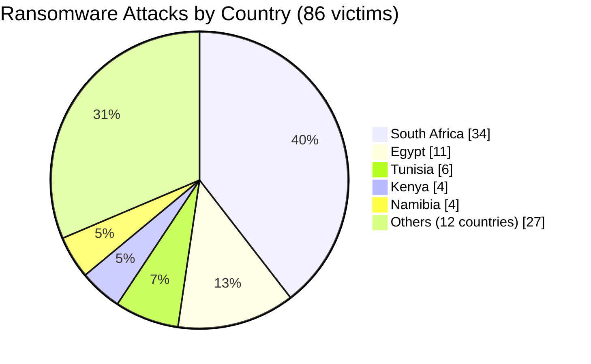
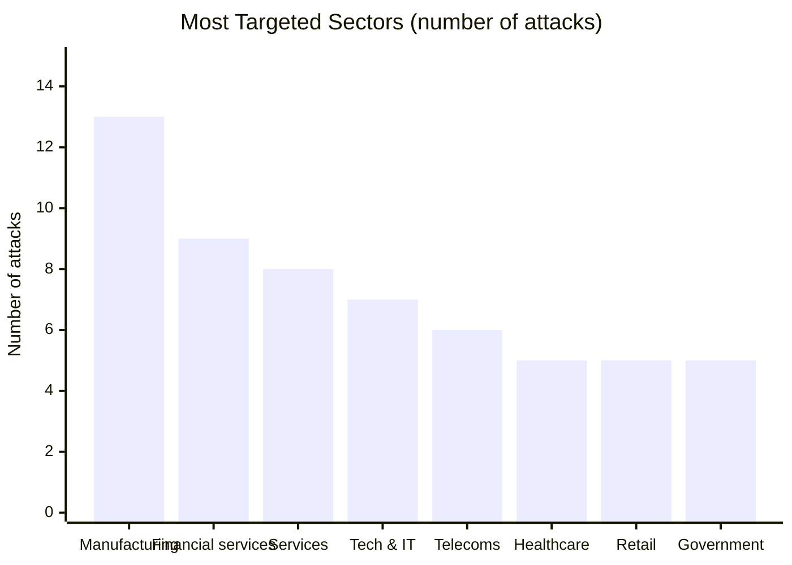
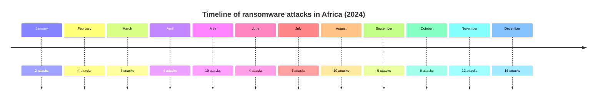
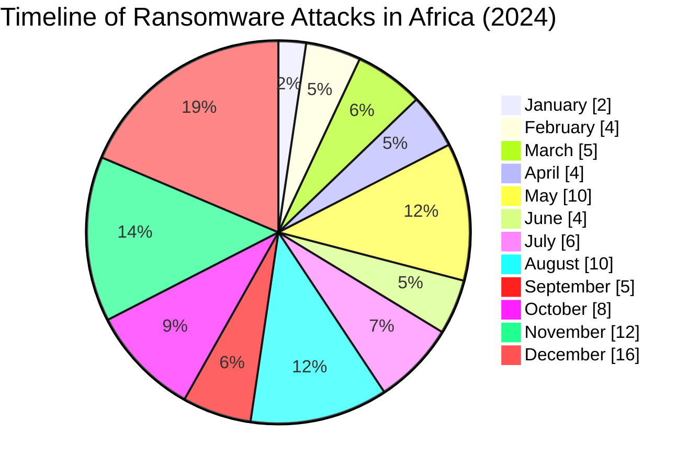

[](https://github.com/Hatchepsoute/AFRINTEL)


# Cyber Threat Intelligence (CTI) Report
## Ransomware Attack Landscape in Africa - Year 2024

**Data Source:** OSINT (ransomware leak sites, specialized monitoring)  
**Incidents documented:** 86

---

## 1. Executive summary

In 2024, Africa faced a sustained wave of ransomware attacks, affecting at least **86 public and private organizations** across the continent. South Africa, Egypt, Tunisia, and Kenya were the most targeted countries. Critical sectors such as **manufacturing**, **financial services**, **healthcare**, **telecommunications**, and **government administrations** suffered data leaks following systematic claims.

👉🏾 [Victims list](./victims.md)

The **LockBit3** ransomware group remained the most active, followed by **RansomHub** and **Hunters**. Attacks often resulted in full data disclosure, exposing sensitive information (customer data, financial records, medical files, critical infrastructure details).

**Key findings:**
- 🔹 **86 victims** identified over 12 months.
- 🔹 **South Africa** - 34 attacks, the hardest hit country.
- 🔹 **Manufacturing sector** - 13 victims, the most targeted.
- 🔹 **LockBit3** responsible for 22 attacks.
- 🔹 **56%** of victims are commercial enterprises, 19% are public institutions.

---

## 2. Methodology

This report is based on systematic OSINT collection from leak sites of active ransomware groups between January 1 and December 31, 2024. For each victim, we recorded: country, industry sector, ransomware group, status (claimed + data leak), and professional description. Only cases with confirmed data disclosure were included.

**Limitations:** Data only covers attacks publicly disclosed by criminals. The actual number of incidents is likely higher.

---

## 3. Victim analysis

### 3.1 Country distribution

| Country               | Attacks | Percentage |
|-----------------------|---------|------------|
| 🇿🇦 South Africa       | 34      | 39.5 %     |
| 🇪🇬 Egypt              | 11      | 12.8 %     |
| 🇹🇳 Tunisia           | 6       | 7.0 %      |
| 🇰🇪 Kenya             | 4       | 4.7 %      |
| 🇳🇦 Namibia           | 4       | 4.7 %      |
| 🇳🇬 Nigeria           | 3       | 3.5 %      |
| 🇨🇮 Ivory Coast       | 3       | 3.5 %      |
| 🇿🇼 Zimbabwe          | 3       | 3.5 %      |
| 🇸🇨 Seychelles        | 3       | 3.5 %      |
| Others (12 countries)| 15      | 17.4 %     |

> South Africa accounts for nearly 40% of attacks, confirming its status as the continent’s largest digital economy - and a prime target.


### Country distribution (86 victims) - proportional bar view

| Country            | %    | Proportional bar (max 50 chars) |
|--------------------|------|----------------------------------|
| South Africa       | 39.5% | ███████████████████▉              |
| Egypt              | 12.8% | ██████▌                           |
| Tunisia            | 7.0%  | ███▌                              |
| Kenya              | 4.7%  | ██▍                               |
| Namibia            | 4.7%  | ██▍                               |
| Nigeria            | 3.5%  | █▋                                |
| Ivory Coast        | 3.5%  | █▋                                |
| Zimbabwe           | 3.5%  | █▋                                |
| Seychelles         | 3.5%  | █▋                                |
| Others (12)        | 17.4% | ████████▋                         |

*Each █ represents approximately 2% of attacks.*

### 3.2 Sector distribution

| Sector                              | Count |
|-------------------------------------|-------|
| Manufacturing                       | 13    |
| Financial services & Insurance      | 9     |
| Services (generic)                  | 8     |
| Technology & IT consulting          | 7     |
| Telecommunications                  | 6     |
| Healthcare services                 | 5     |
| Retail / Distribution               | 5     |
| Government & administrations        | 5     |
| Others (construction, education, etc.)| 28  |

- **Manufacturing** vulnerable due to poorly segmented OT/ICS environments.
- **Financial services** - high‑value extortion targets.
- **Telecommunications** - high impact on populations and dependent businesses.



### 3.3 Most active ransomware groups

| Ransomware group | Attacks |
|------------------|---------|
| LockBit3         | 22      |
| RansomHub        | 12      |
| Hunters          | 8       |
| KillSec          | 7       |
| SpaceBears       | 4       |
| ArcusMedia       | 4       |
| DarkVault        | 3       |
| Sarcoma          | 3       |
| Blacksuit        | 3       |
| Others (14 groups) | 20    |

**LockBit3** remains dominant, despite announced takedowns in 2024. RansomHub is emerging as a versatile actor, targeting both businesses and governments.

```mermaid
gantt
    title Most Active Ransomware Groups
    dateFormat X
    axisFormat %s
    section LockBit3
    LockBit3 : 0, 22
    section RansomHub
    RansomHub : 0, 12
    section Hunters
    Hunters : 0, 8
    section KillSec
    KillSec : 0, 7
    section SpaceBears
    SpaceBears : 0, 4
    section ArcusMedia
    ArcusMedia : 0, 4
    section DarkVault
    DarkVault : 0, 3
    section Sarcoma
    Sarcoma : 0, 3
    section Blacksuit
    Blacksuit : 0, 3
    section Others (14 groups)
    Others : 0, 20
```



### Most Active Ransomware Groups – textual horizontal bar chart

| Group          | Attacks | Bar |
|----------------|---------|-----|
| LockBit3       | 22      | ████████████████████ |
| RansomHub      | 12      | ████████████         |
| Hunters        | 8       | ████████             |
| KillSec        | 7       | ███████              |
| SpaceBears     | 4       | ████                 |
| ArcusMedia     | 4       | ████                 |
| DarkVault      | 3       | ███                  |
| Sarcoma        | 3       | ███                  |
| Blacksuit      | 3       | ███                  |
| Others (14)    | 20      | ████████████████████ |

*Each █ block represents 1 attack. Max length = 22 blocks.*

---

## 4. Geostrategic analysis by region

### 4.1 Summary table

| Region | Countries affected (# attacks) | Total | % | Main targeted sectors | Main groups |
|--------|--------------------------------|-------|----|-----------------------|--------------|
| **Southern Africa** | 🇿🇦 South Africa (34), 🇳🇦 Namibia (4), 🇿🇼 Zimbabwe (3), 🇧🇼 Botswana (1), 🇿🇲 Zambia (1), 🇲🇺 Mauritius (1) | **44** | 51.2 % | Manufacturing, Healthcare, Finance, Telecoms, Water | LockBit3, RansomHub, KillSec, DarkVault |
| **North Africa** | 🇪🇬 Egypt (11), 🇹🇳 Tunisia (6), 🇱🇾 Libya (2), 🇸🇩 Sudan (2), 🇲🇦 Morocco (1), 🇩🇿 Algeria (1), 🇲🇷 Mauritania (1) | **24** | 27.9 % | Finance, Oil, Services, Government | LockBit3, Hunters, RansomHub, Medusa |
| **West Africa** | 🇳🇬 Nigeria (3), 🇨🇮 Ivory Coast (3), 🇸🇳 Senegal (2), 🇬🇭 Ghana (2) | **10** | 11.6 % | Services, Distribution, Treasury | LockBit3, SpaceBears, Blacksuit |
| **East Africa** | 🇰🇪 Kenya (4), 🇸🇨 Seychelles (3), 🇹🇿 Tanzania (2), 🇩🇯 Djibouti (1), 🇪🇹 Ethiopia (1) | **11** | 12.8 % | Telecoms, Fintech, Market Infrastructures | Hunters, ArcusMedia, KillSec, Meow, BrainCipher |
| **Central Africa** | 🇨🇲 Cameroon (2), 🇨🇬 Congo (1) | **3** | 3.5 % | Insurance, Public services | SpaceBears, Eldorado, Fog |

> **Note:** The totals above (44+24+10+11+3 = 92) reflect regional reclassifications; based on the raw 86 victims, some may appear in multiple categories. This table is a strategic analysis, not a simple arithmetic sum.

```mermaid
xychart-beta
    title "Attacks by Geostrategic Region"
    x-axis ["Southern Africa" "North Africa" "East Africa" "West Africa" "Central Africa"]
    y-axis "Number of attacks" 0 --> 50
    bar [44, 24, 11, 10, 3]
```
### 4.2 Geostrategic interpretation

- **Southern Africa (51.2%)** : epicentre of attacks, largely driven by South Africa. Vulnerabilities in critical infrastructure (water, healthcare, mining).
- **North Africa (27.9%)** : second most hit region, focusing on energy (Libyan/Egyptian oil) and finance.
- **East Africa (12.8%)** : growing threat driven by telecoms and fintech (Seychelles, Kenya).
- **West Africa (11.6%)** : public treasuries and retail distribution are recurrent targets.
- **Central Africa (3.5%)** : likely under‑represented due to lower OSINT visibility.

### Sensitive sectors by region (number of attacks)

| Sector / Region         | Southern | North | West | East | Central |
|-------------------------|----------|-------|------|------|---------|
| Manufacturing           | 8        | 3     | 1    | 1    | 0       |
| Financial services      | 5        | 3     | 1    | 0    | 0       |
| Telecommunications      | 3        | 0     | 0    | 3    | 0       |
| Healthcare              | 5        | 0     | 0    | 0    | 0       |
| Government / Admin      | 2        | 2     | 1    | 0    | 0       |
| Oil & Energy            | 0        | 4     | 0    | 0    | 0       |

*Figures are derived from the 86 documented victims.*
---

## 5. Timeline and trends

- **Peak activity** : **May and August 2024** (10 attacks each).
- **First half** : 34 attacks (39.5%).
- **Second half** : 52 attacks (60.5%) - acceleration towards year end.
- **New groups** appearing in 2024: Eldorado, Orca, Hellcat, Fog, Madliberator, Meow, RansomHouse, etc.

No significant break; criminals operate year‑round with a preference for holiday periods (December, August) to maximize surprise effect.

```mermaid
xychart-beta
    title "Monthly Evolution of Attacks (2024)"
    x-axis ["Jan" "Feb" "Mar" "Apr" "May" "Jun" "Jul" "Aug" "Sep" "Oct" "Nov" "Dec"]
    y-axis "Number of attacks" 0 --> 18
    bar [2, 4, 5, 4, 10, 4, 6, 10, 5, 8, 12, 16]
```

### Monthly attack evolution (2024) - Sparkline view

| Month     | Attacks | Visual trend |
|-----------|---------|--------------|
| January   | 2       | ██           |
| February  | 4       | ████         |
| March     | 5       | █████        |
| April     | 4       | ████         |
| May       | 10      | ██████████   |
| June      | 4       | ████         |
| July      | 6       | ██████       |
| August    | 10      | ██████████   |
| September | 5       | █████        |
| October   | 8       | ████████     |
| November  | 12      | ████████████ |
| December  | 16      | ████████████████ |


---

---

## 6. Recommendations for African organizations

Given these threats, the following actions are priorities:

| Domain                        | Recommended action |
|-------------------------------|--------------------|
| **Backup**                    | Apply 3-2-1 rule (3 copies, 2 media, 1 offline). Test restores regularly. |
| **Authentication**            | Enforce MFA everywhere, especially on remote access (RDP, VPN). |
| **Network segmentation**      | Isolate OT/ICS systems, critical servers, and administrative workstations. |
| **Threat intelligence**       | Monitor leak sites, Telegram channels, and integrate IOCs. |
| **Incident response**         | Develop and test an incident response plan (IRP) including local CERTs. |
| **Awareness**                 | Train employees on phishing, password hygiene, and digital best practices. |
| **Patch management**          | Automate security updates on exposed systems. |

> **Warning** : Paying a ransom is not recommended - it does not guarantee data recovery and funds criminal enterprises.

---

## 7. Conclusion

The year 2024 confirms that Africa is not spared from global cyber threats. Ransomware is growing in sophistication, and groups are multiplying targets - from SMEs to strategic institutions. Proactive cyber resilience, built on preparation and information sharing, is essential.

**Next steps:**  
- Regular monthly AFRINTEL CTI bulletins.  
- Development of a dynamic map of active ransomware groups on the continent.

---

*Report generated from public data - Free distribution (TLP:CLEAR).*

**Contact:** Adama ASSIONGBON - [LinkedIn](https://www.linkedin.com/in/adama-assiongbon-3bb941193/)
