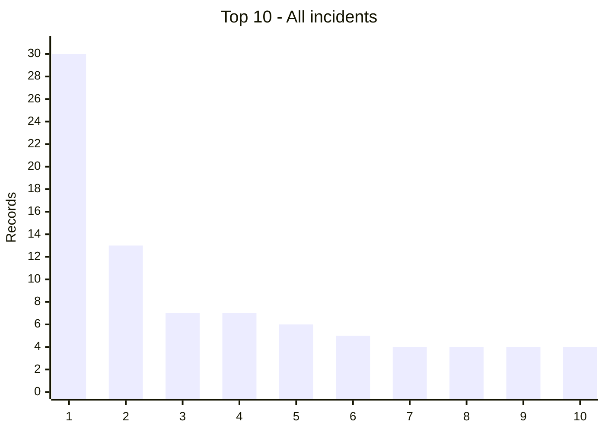
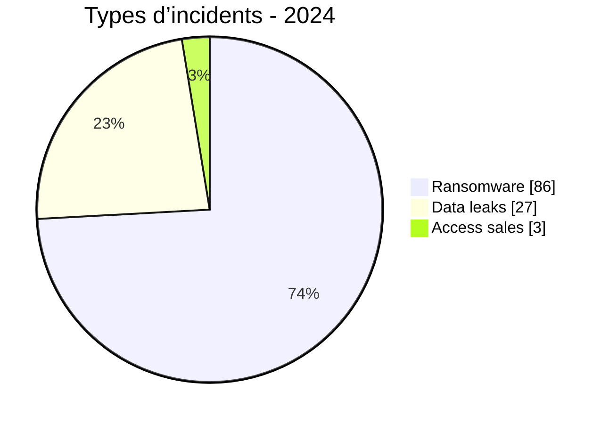
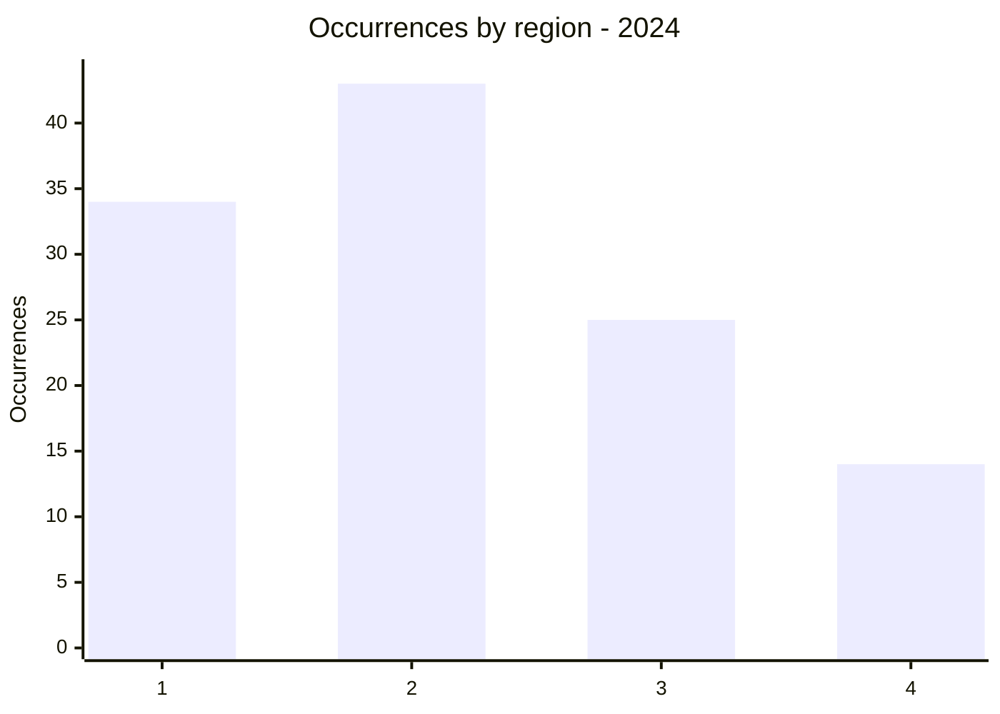
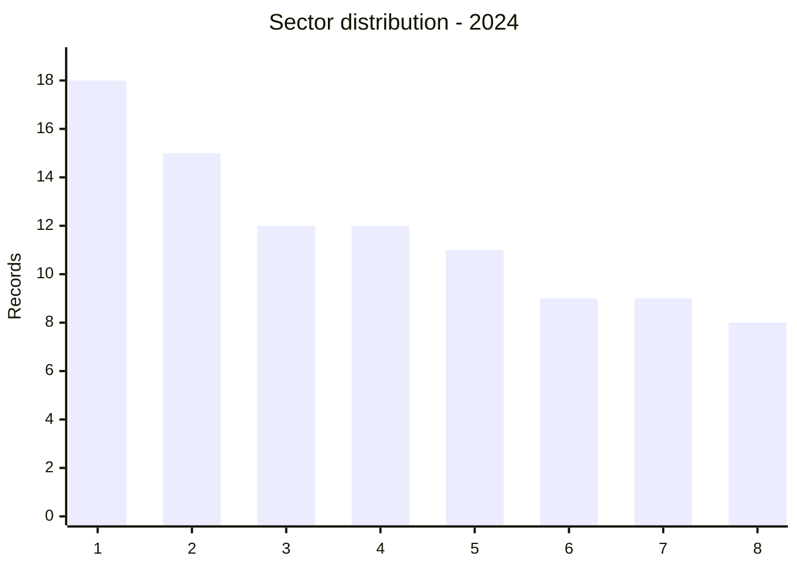
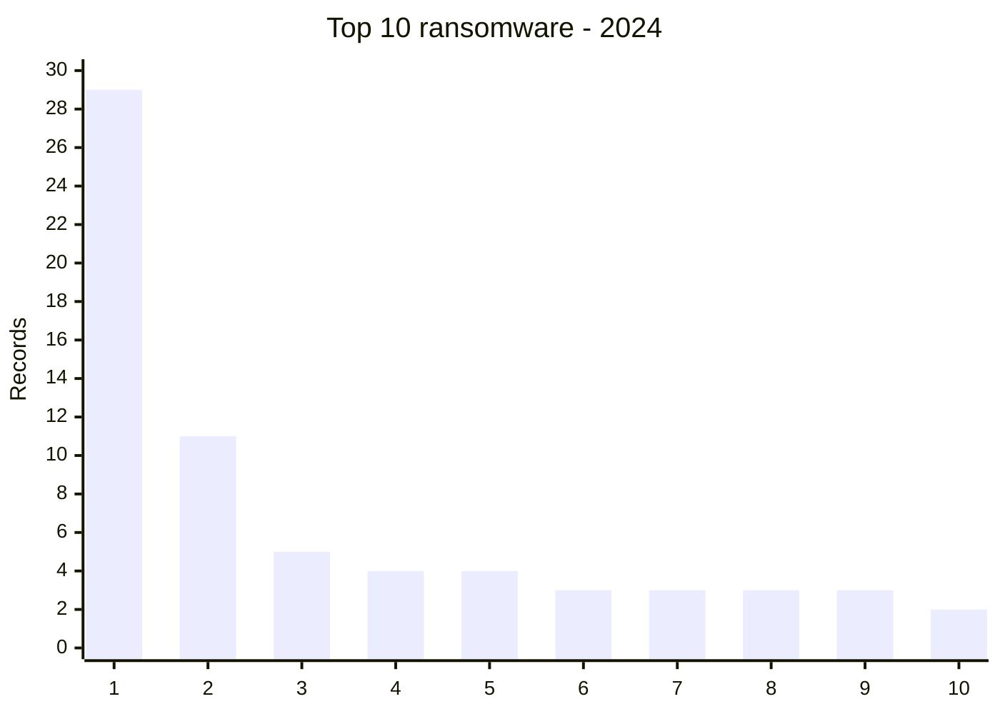
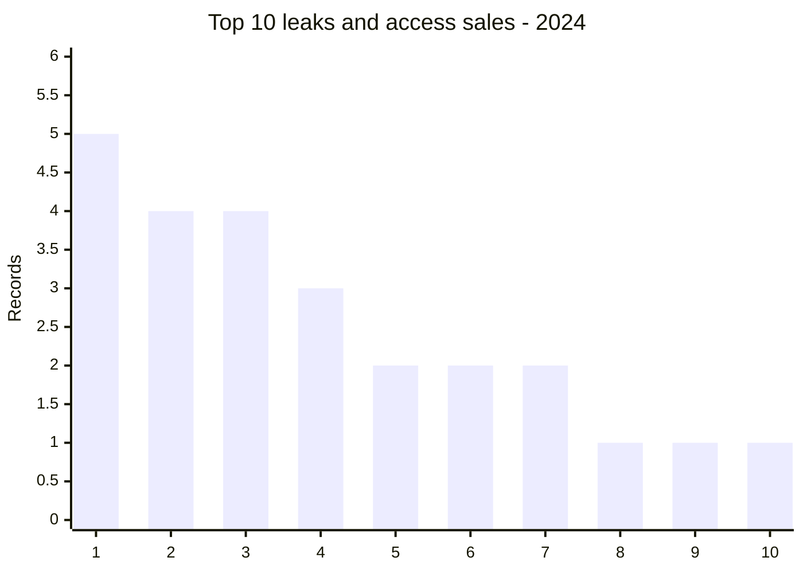
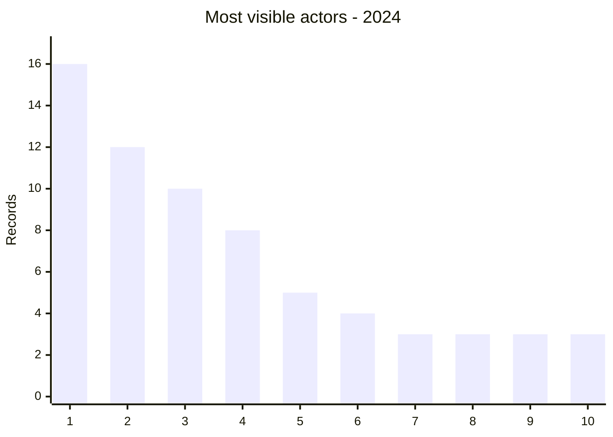

# AFRINTEL global annual CTI report - 2024

👉🏾 [French version](./README_FR.md)

  

---
## 1. Executive summary

AFRINTEL recorded **116 records**: **86 ransomware**, **27 data leaks**, **3 access sales** and **0 defacements**.

## 2. Methodology

The twelve monthly files are the source of truth. A record is a documented publication or claim. Unconfirmed publications remain claims.

## 3. Global overview

| Indicator | Value |
| :--- | ---: |
| Records | **116** |
| Ransomware | **86 (74,1%)** |
| Data leaks | **27 (23,3%)** |
| Access sales | **3 (2,6%)** |

### Country ranking

| Rank | Country | Records | Chart |
| :--- | ---: | ---: | ---: |
| 1 | 🇿🇦 South Africa | 30 | ██████████████████████████████ |
| 2 | 🇪🇬 Egypt | 13 | █████████████ |
| 3 | 🇩🇿 Algeria | 7 | ███████ |
| 4 | 🇳🇬 Nigeria | 7 | ███████ |
| 5 | 🇹🇳 Tunisia | 6 | ██████ |
| 6 | 🇲🇦 Morocco | 5 | █████ |
| 7 | 🇧🇫 Burkina Faso | 4 | ████ |
| 8 | 🇬🇭 Ghana | 4 | ████ |
| 9 | 🇨🇮 Ivory Coast | 4 | ████ |
| 10 | 🇰🇪 Kenya | 4 | ████ |
| 11 | 🇳🇦 Namibia | 4 | ████ |
| 12 | 🇨🇲 Cameroon | 3 | ███ |
| 13 | 🇪🇹 Ethiopia | 3 | ███ |
| 14 | 🇸🇨 Seychelles | 3 | ███ |
| 15 | 🇿🇼 Zimbabwe | 3 | ███ |
| 16 | 🇱🇾 Libya | 2 | ██ |
| 17 | 🇸🇳 Senegal | 2 | ██ |
| 18 | 🇸🇩 Sudan | 2 | ██ |
| 19 | 🇹🇿 Tanzania | 2 | ██ |
| 20 | 🇧🇼 Botswana | 1 | █ |
| 21 | 🇨🇬 Congo | 1 | █ |
| 22 | 🇩🇯 Djibouti | 1 | █ |
| 23 | 🇲🇬 Madagascar | 1 | █ |
| 24 | 🇲🇷 Mauritania | 1 | █ |
| 25 | 🇲🇺 Mauritius | 1 | █ |
| 26 | 🇷🇼 Rwanda | 1 | █ |
| 27 | 🇿🇲 Zambia | 1 | █ |

### Incident type distribution

| Type | Records | Share |
| :--- | ---: | ---: |
| Ransomware | 86 | 74,1% |
| Data leak | 27 | 23,3% |
| Access sale | 3 | 2,6% |
| **Total** | **116** | **100%** |

### Ransomware, leaks and access sales by country

| Country | Ransomware | Data leaks | Access sales | Total | Barre | Distribution |
| :--- | ---: | ---: | ---: | ---: | ---: | ---: |
| 🇿🇦 South Africa | 29 | 1 | 0 | 30 | ██████████████████████████████ | 🟧🟧🟧🟧🟧🟧🟧🟧🟧🟧🟧🟧🟧🟧🟧🟧🟧🟧🟧🟧🟧🟧🟧🟧🟧🟧🟧🟧🟧 🟦 |
| 🇪🇬 Egypt | 11 | 2 | 0 | 13 | █████████████ | 🟧🟧🟧🟧🟧🟧🟧🟧🟧🟧🟧 🟦🟦 |
| 🇩🇿 Algeria | 2 | 5 | 0 | 7 | ███████ | 🟧🟧 🟦🟦🟦🟦🟦 |
| 🇳🇬 Nigeria | 4 | 3 | 0 | 7 | ███████ | 🟧🟧🟧🟧 🟦🟦🟦 |
| 🇹🇳 Tunisia | 5 | 1 | 0 | 6 | ██████ | 🟧🟧🟧🟧🟧 🟦 |
| 🇲🇦 Morocco | 1 | 4 | 0 | 5 | █████ | 🟧 🟦🟦🟦🟦 |
| 🇧🇫 Burkina Faso | 0 | 2 | 2 | 4 | ████ | 🟦🟦🟦🟦 |
| 🇬🇭 Ghana | 2 | 2 | 0 | 4 | ████ | 🟧🟧 🟦🟦 |
| 🇨🇮 Ivory Coast | 3 | 1 | 0 | 4 | ████ | 🟧🟧🟧 🟦 |
| 🇰🇪 Kenya | 3 | 1 | 0 | 4 | ████ | 🟧🟧🟧 🟦 |
| 🇳🇦 Namibia | 4 | 0 | 0 | 4 | ████ | 🟧🟧🟧🟧 |
| 🇨🇲 Cameroon | 2 | 0 | 1 | 3 | ███ | 🟧🟧 🟦 |
| 🇪🇹 Ethiopia | 1 | 2 | 0 | 3 | ███ | 🟧 🟦🟦 |
| 🇸🇨 Seychelles | 3 | 0 | 0 | 3 | ███ | 🟧🟧🟧 |
| 🇿🇼 Zimbabwe | 3 | 0 | 0 | 3 | ███ | 🟧🟧🟧 |
| 🇱🇾 Libya | 2 | 0 | 0 | 2 | ██ | 🟧🟧 |
| 🇸🇳 Senegal | 2 | 0 | 0 | 2 | ██ | 🟧🟧 |
| 🇸🇩 Sudan | 1 | 1 | 0 | 2 | ██ | 🟧 🟦 |
| 🇹🇿 Tanzania | 2 | 0 | 0 | 2 | ██ | 🟧🟧 |
| 🇧🇼 Botswana | 1 | 0 | 0 | 1 | █ | 🟧 |
| 🇨🇬 Congo | 1 | 0 | 0 | 1 | █ | 🟧 |
| 🇩🇯 Djibouti | 1 | 0 | 0 | 1 | █ | 🟧 |
| 🇲🇬 Madagascar | 0 | 1 | 0 | 1 | █ | 🟦 |
| 🇲🇷 Mauritania | 1 | 0 | 0 | 1 | █ | 🟧 |
| 🇲🇺 Mauritius | 1 | 0 | 0 | 1 | █ | 🟧 |
| 🇷🇼 Rwanda | 0 | 1 | 0 | 1 | █ | 🟦 |
| 🇿🇲 Zambia | 1 | 0 | 0 | 1 | █ | 🟧 |

### Geographic distribution by region

| Region | Occurrences | Ransomware | Leaks / access | Chart | Distribution |
| :--- | ---: | ---: | ---: | ---: |
| North Africa | 34 | 22 | 12 | ████████ | 🟧🟧🟧🟧🟧🟧🟧🟧🟧🟧🟧🟧🟧🟧🟧🟧🟧🟧🟧🟧🟧🟧 🟦🟦🟦🟦🟦🟦🟦🟦🟦🟦🟦🟦 |
| Southern Africa | 43 | 42 | 1 | ██████████ | 🟧🟧🟧🟧🟧🟧🟧🟧🟧🟧🟧🟧🟧🟧🟧🟧🟧🟧🟧🟧🟧🟧🟧🟧🟧🟧🟧🟧🟧🟧🟧🟧🟧🟧🟧🟧🟧🟧🟧🟧🟧🟧 🟦 |
| West and Central Africa | 25 | 14 | 11 | ██████ | 🟧🟧🟧🟧🟧🟧🟧🟧🟧🟧🟧🟧🟧🟧 🟦🟦🟦🟦🟦🟦🟦🟦🟦🟦🟦 |
| East Africa | 14 | 8 | 6 | ███ | 🟧🟧🟧🟧🟧🟧🟧🟧 🟦🟦🟦🟦🟦🟦 |

Legend: 1 = North Africa; 2 = Southern Africa; 3 = West and Central Africa; 4 = East Africa

### Sector distribution

| Normalized sector | Records | Share | Chart |
| :--- | ---: | ---: | ---: |
| Technology / IT | 18 | 15,5% | ██████████ |
| Finance / Banking | 15 | 12,9% | ████████ |
| Education / University | 12 | 10,3% | ███████ |
| Government / Administration | 12 | 10,3% | ███████ |
| Retail / E-commerce | 11 | 9,5% | ██████ |
| Healthcare / Medical | 9 | 7,8% | █████ |
| Manufacturing / Industry | 9 | 7,8% | █████ |
| Professional / Business Services | 8 | 6,9% | ████ |
| Energy / Utilities | 5 | 4,3% | ███ |
| Agriculture / Agribusiness | 3 | 2,6% | ██ |
| Construction / Real Estate | 3 | 2,6% | ██ |
| Media / Entertainment | 3 | 2,6% | ██ |
| Transport / Logistics | 3 | 2,6% | ██ |
| Legal / Justice | 2 | 1,7% | █ |
| Civil Society / NGO | 1 | 0,9% | █ |
| Defense / Security | 1 | 0,9% | █ |
| Mining | 1 | 0,9% | █ |

Legend: 1 = Technology; 2 = Finance; 3 = Education; 4 = Government; 5 = Retail; 6 = Healthcare; 7 = Manufacturing; 8 = Professional services

### Incident-type charts

Legend: 1 = South Africa; 2 = Egypt; 3 = Tunisia; 4 = Namibia; 5 = Nigeria; 6 = Ivory Coast; 7 = Kenya; 8 = Seychelles; 9 = Zimbabwe; 10 = Algeria

Legend: 1 = Algeria; 2 = Burkina Faso; 3 = Morocco; 4 = Nigeria; 5 = Egypt; 6 = Ethiopia; 7 = Ghana; 8 = Cameroon; 9 = Ivory Coast; 10 = Kenya

## 4. Detailed analysis by incident type

Ransomware claims represent 86 records. Leaks and access sales represent 30 records and include administrative, financial, healthcare, education and business data.

## 5. Sectoral impact

Government, finance, technology and education account for a substantial share of the records.

## 6. Threat actor profile and risk assessment

| Actor / source | Records |
| :--- | ---: |
| lockbit3 | 16 |
| ransomhub | 12 |
| killsec | 10 |
| hunters | 8 |
| spacebears | 5 |
| arcusmedia | 4 |
| Tanaka, publication on an underground forum | 3 |
| blacksuit | 3 |
| Addka72424, repost of an original post attributed to FriendlyChemist, published on a cybercriminal forum | 3 |
| darkvault | 3 |

| Country | Level |
| :--- | ---: |
| 🇿🇦 South Africa | 🔴 High |
| 🇪🇬 Egypt | 🔴 High |
| 🇩🇿 Algeria | 🔴 High |
| 🇳🇬 Nigeria | 🔴 High |
| 🇹🇳 Tunisia | 🔴 High |

### Most visible actors chart

Legend: 1 = lockbit3; 2 = ransomhub; 3 = killsec; 4 = hunters; 5 = spacebears; 6 = arcusmedia; 7 = Tanaka, publication on an underground forum; 8 = blacksuit; 9 = Addka72424, repost of an original post attributed to FriendlyChemist, published on a cybercriminal forum; 10 = darkvault

## 7. Key trends and intelligence gaps

Main gaps are independent confirmation, actual dataset size and the relationship between repeated claims.

## 8. Contextual MITRE ATT&CK mapping

| Phase | Technique | Context |
| :--- | ---: | ---: |
| Impact | T1486 - Data Encrypted for Impact | Ransomware |
| Exfiltration | T1567 - Exfiltration Over Web Service | Leaks and extortion |
| Credential access | T1078 - Valid Accounts | Access claims |

## 9. Recommendations

- Validate claims with logs, EDR, IAM and backups.
- Enforce MFA, segmentation, offline backups and secret rotation.

## 10. SOC and tactical recommendations

- Correlate EDR, VPN, IAM, DNS, proxy, WAF and application logs.

## 11. Strategic recommendations

- Maintain an asset inventory and test response and restoration plans.

## 12. Conclusion

These figures describe publications observed by AFRINTEL and support monitoring and defensive prioritisation.

**AFRINTEL** - TLP:CLEAR
