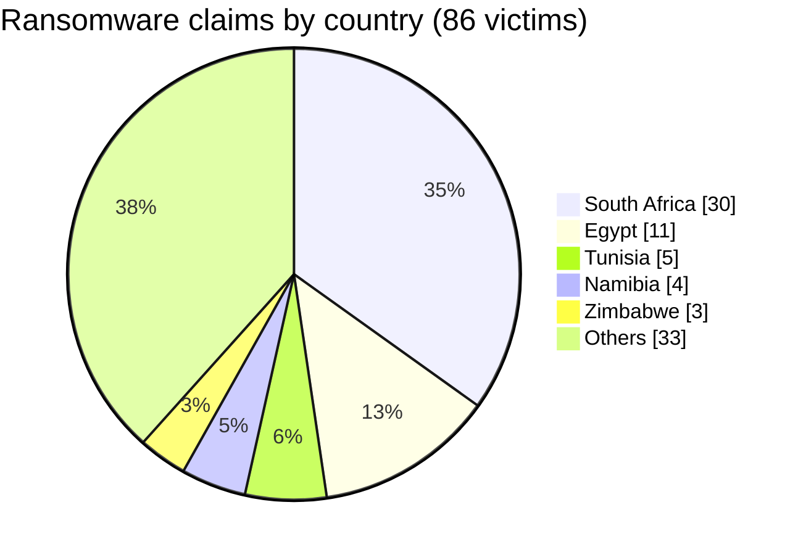
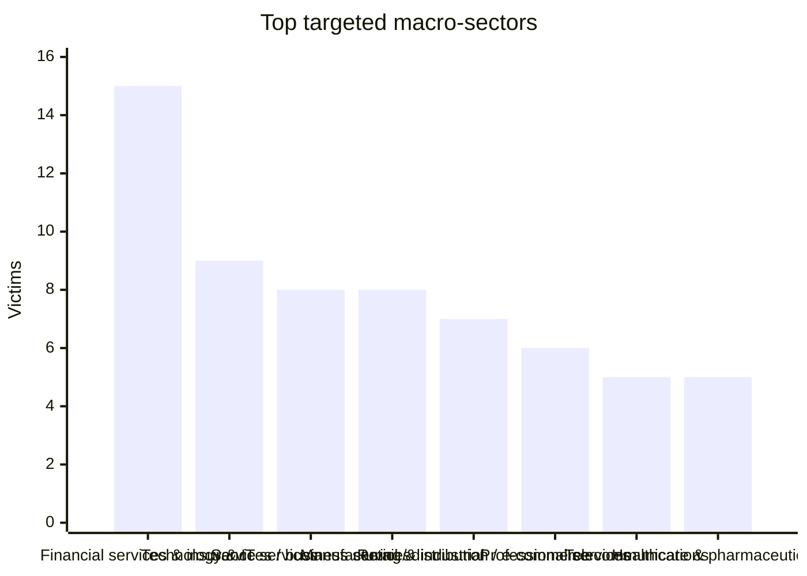
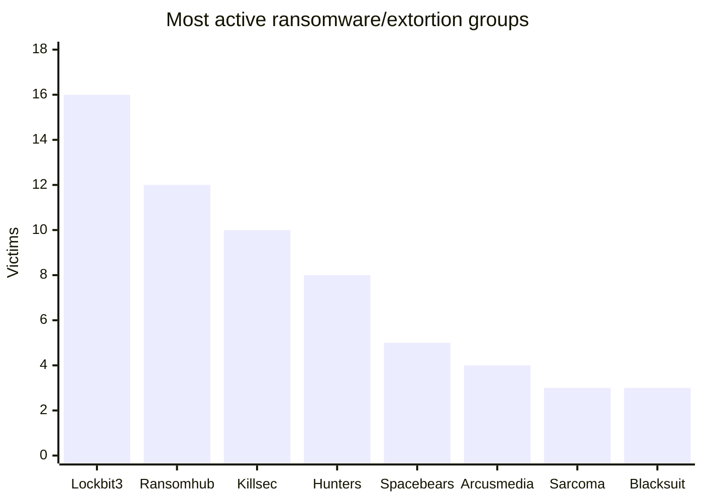
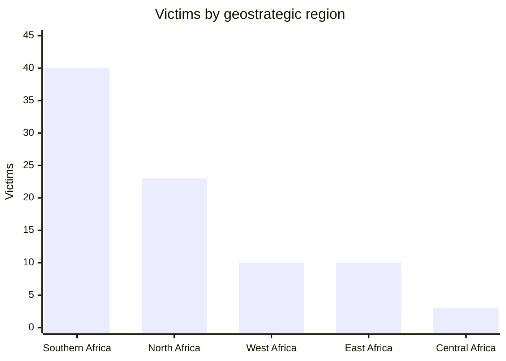
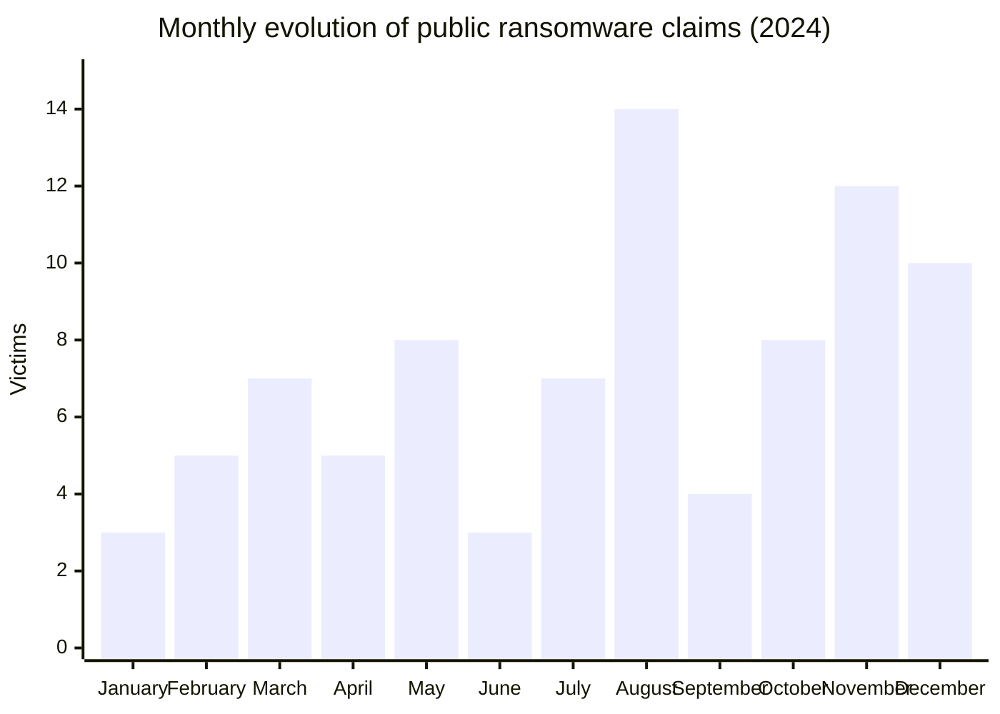

# Cyber Threat Intelligence (CTI) Report
## Ransomware and data extortion landscape in Africa - 2024

👉🏾 [French version](./README_FR.md)

**Data source:** AFRINTEL OSINT dataset built from public ransomware/extortion leak-site listings and specialized monitoring  
**Coverage period:** January 1 to December 31, 2024  
**Documented victims:** 86  
**Classification:** TLP:CLEAR  

👉🏾 [Victims list](./victims.md)

---

## Reliability note

This report treats ransomware leak-site publications as **public claims** unless independently confirmed by a victim or trusted authority. The dataset reflects organizations publicly listed by threat actors or monitored leak sources. It should therefore be used as an OSINT/CTI visibility baseline, not as a complete measure of all ransomware incidents in Africa.

---

## 1. Executive summary

In 2024, AFRINTEL documented **86 African victims** publicly associated with ransomware or data-extortion activity. The activity affected **24 countries**, with a strong concentration in **South Africa**, followed by **Egypt**, **Tunisia**, **Namibia**, and several West/East African economies.

The dataset shows a clear acceleration during the second half of the year: **55 victims** were recorded from July to December, compared with **31 victims** from January to June. **August** was the highest month with **14 victims**, followed by **November** with **12 victims** and **December** with **10 victims**.

**Key findings**

- **86 victims** documented across 12 months.
- **24 African countries** represented in the dataset.
- **South Africa** is the most targeted country with **30 victims** (34.9%).
- **Financial services & insurance** is the most represented macro-sector with **15 victims** (17.4%).
- **LockBit3** is the most active group in the dataset with **16 victims** (18.6%), followed by **RansomHub** with **12** and **KillSec** with **10**.
- **Southern Africa** concentrates **40 victims** (46.5%), driven mainly by South Africa.

---

## 2. Methodology

The report was rebuilt from the verified AFRINTEL 2024 victim list containing exactly **86 entries**. Each entry was normalized across:

- country and region;
- ransomware/extortion group;
- month of public listing;
- victim sector;
- public domain/website;
- public victim description.

Sector statistics are grouped into macro-sectors to avoid misleading fragmentation between similar categories such as banking, finance, insurance and market infrastructure.

**Limitations**

- The data covers public claims and public leak-site visibility only.
- Some victim descriptions remain limited when public business context is scarce.
- Attribution is based on the actor name associated with the public listing and should not be interpreted as forensic confirmation.

---

## 3. Country Distribution

| Country | Victims | Share | Side-by-Side Distribution |
|---|---:|---:|:---|
| 🇿🇦 South Africa | 30 | 34.9 % | ██████████████████████████████ |
| 🇪🇬 Egypt | 11 | 12.8 % | ███████████ |
| 🇹🇳 Tunisia | 5 | 5.8 % | █████ |
| 🇳🇦 Namibia | 4 | 4.7 % | ████ |
| 🇿🇼 Zimbabwe | 3 | 3.5 % | ███ |
| 🇸🇨 Seychelles | 3 | 3.5 % | ███ |
| 🇰🇪 Kenya | 3 | 3.5 % | ███ |
| 🇳🇬 Nigeria | 3 | 3.5 % | ███ |
| 🇨🇮 Ivory Coast | 3 | 3.5 % | ███ |
| 🇸🇳 Senegal | 2 | 2.3 % | ██ |
| 🇨🇲 Cameroon | 2 | 2.3 % | ██ |
| 🇹🇿 Tanzania | 2 | 2.3 % | ██ |
| 🇱🇾 Libya | 2 | 2.3 % | ██ |
| 🇬🇭 Ghana | 2 | 2.3 % | ██ |
| 🇸🇩 Sudan | 2 | 2.3 % | ██ |
| 🇧🇼 Botswana | 1 | 1.2 % | █ |
| 🇲🇷 Mauritania | 1 | 1.2 % | █ |
| 🇿🇲 Zambia | 1 | 1.2 % | █ |
| 🇩🇿 Algeria | 1 | 1.2 % | █ |
| 🇪🇹 Ethiopia | 1 | 1.2 % | █ |
| 🇩🇯 Djibouti | 1 | 1.2 % | █ |
| 🇲🇺 Mauritius | 1 | 1.2 % | █ |
| 🇨🇬 Congo | 1 | 1.2 % | █ |
| 🇲🇦 Morocco | 1 | 1.2 % | █ |

### Analytical reading

South Africa alone represents almost one third of the 2024 dataset. This is consistent with its large digital economy, dense enterprise ecosystem, mature financial sector and high public visibility of ransomware claims. Egypt remains the second-largest hotspot, with repeated exposure across services, healthcare, government, energy and retail-linked sectors.

---

## 4. Sector distribution

| Sector | Victims | Share |
|---|---:|---:|
| Financial services & insurance | 15 | 17.4% |
| Technology & IT services | 9 | 10.5% |
| Services / business services | 8 | 9.3% |
| Manufacturing & industrial | 8 | 9.3% |
| Retail / distribution / e-commerce | 7 | 8.1% |
| Professional services | 6 | 7.0% |
| Telecommunications | 5 | 5.8% |
| Healthcare & pharmaceuticals | 5 | 5.8% |
| Government & public sector | 4 | 4.7% |
| Logistics / transport | 3 | 3.5% |
| Agriculture, agribusiness & food | 3 | 3.5% |
| Media / sports / audiovisual | 2 | 2.3% |
| Education | 2 | 2.3% |
| Water / public utilities | 2 | 2.3% |
| Unknown / limited public context | 2 | 2.3% |
| Energy / oil & gas | 2 | 2.3% |
| Automotive / transport industry | 1 | 1.2% |
| Mining & natural resources | 1 | 1.2% |
| Construction / engineering | 1 | 1.2% |

### Sector intelligence assessment

Financial services, insurance, banking and fintech-related entities form the most exposed macro-sector. This reflects both the value of financial data and the pressure ransomware actors can apply against institutions that depend on trust, uptime and regulatory compliance.

Technology and IT services are also highly represented. This creates a potential supply-chain risk because compromise of IT providers, telecom integrators, software firms or managed service providers can indirectly affect downstream customers.

Manufacturing and industrial organizations remain attractive because disruption can have immediate operational and financial impact, especially where segmentation between business IT and operational environments is weak.

---

## 5. Threat actor activity

| Group | Victims | Share |
|---|---:|---:|
| lockbit3 | 16 | 18.6% |
| ransomhub | 12 | 14.0% |
| killsec | 10 | 11.6% |
| hunters | 8 | 9.3% |
| spacebears | 5 | 5.8% |
| arcusmedia | 4 | 4.7% |
| sarcoma | 3 | 3.5% |
| blacksuit | 3 | 3.5% |
| darkvault | 3 | 3.5% |
| madliberator | 2 | 2.3% |
| moneymessage | 2 | 2.3% |
| ransomhouse | 2 | 2.3% |
| raworld | 2 | 2.3% |
| meow | 2 | 2.3% |
| incransom | 2 | 2.3% |
| apt73/bashe | 1 | 1.2% |
| fog | 1 | 1.2% |
| braincipher | 1 | 1.2% |
| orca | 1 | 1.2% |
| hellcat | 1 | 1.2% |
| akira | 1 | 1.2% |
| cactus | 1 | 1.2% |
| eldorado | 1 | 1.2% |
| dragonforce | 1 | 1.2% |
| medusa | 1 | 1.2% |

### Actor-level interpretation

**LockBit3** remains the most visible actor in the AFRINTEL 2024 dataset, despite global disruption efforts against the group ecosystem. **RansomHub** appears as a major extortion actor with broad targeting across regions and sectors. **KillSec** shows strong activity in the second half of the year, especially against public-facing organizations, fintech, utilities and digital services.

The long tail of smaller or emerging groups confirms the fragmentation of the ransomware/extortion ecosystem. For African defenders, this means detection should not depend only on a few named groups, but on behavior: initial access abuse, credential theft, lateral movement, data staging, exfiltration and extortion preparation.

---

## 6. Geostrategic regional analysis

| Region | Countries represented | Victims | Share |
|---|---|---:|---:|
| Southern Africa | 🇿🇦 South Africa (30), 🇳🇦 Namibia (4), 🇿🇼 Zimbabwe (3), 🇧🇼 Botswana (1), 🇿🇲 Zambia (1), 🇲🇺 Mauritius (1) | 40 | 46.5% |
| North Africa | 🇪🇬 Egypt (11), 🇹🇳 Tunisia (5), 🇸🇩 Sudan (2), 🇱🇾 Libya (2), 🇲🇷 Mauritania (1), 🇩🇿 Algeria (1), 🇲🇦 Morocco (1) | 23 | 26.7% |
| West Africa | 🇳🇬 Nigeria (3), 🇨🇮 Ivory Coast (3), 🇬🇭 Ghana (2), 🇸🇳 Senegal (2) | 10 | 11.6% |
| East Africa | 🇰🇪 Kenya (3), 🇸🇨 Seychelles (3), 🇹🇿 Tanzania (2), 🇪🇹 Ethiopia (1), 🇩🇯 Djibouti (1) | 10 | 11.6% |
| Central Africa | 🇨🇲 Cameroon (2), 🇨🇬 Congo (1) | 3 | 3.5% |

### Regional interpretation

- **Southern Africa** is the main ransomware/extortion exposure zone in 2024, driven by South Africa and reinforced by incidents in Namibia, Zimbabwe, Botswana, Zambia and Mauritius.
- **North Africa** is the second-largest region, with Egypt as the main driver and additional exposure in Tunisia, Libya, Sudan, Morocco, Algeria and Mauritania.
- **West Africa** shows recurring targeting of financial, public-sector, distribution and insurance-linked organizations.
- **East Africa** combines fintech, telecoms, logistics, public infrastructure and crypto/financial platforms.
- **Central Africa** remains underrepresented in open-source ransomware visibility, which may reflect lower public disclosure rather than lower real-world exposure.

---

## 7. Monthly timeline and trend analysis

| Month | Victims | Visual |
|---|---:|---|
| January | 3 | ███ |
| February | 5 | █████ |
| March | 7 | ███████ |
| April | 5 | █████ |
| May | 8 | ████████ |
| June | 3 | ███ |
| July | 7 | ███████ |
| August | 14 | ██████████████ |
| September | 4 | ████ |
| October | 8 | ████████ |
| November | 12 | ████████████ |
| December | 10 | ██████████ |

### Trend assessment

The second half of 2024 shows a clear increase in public ransomware/extortion visibility. The strongest month was **August**, with 14 victims, followed by **November** and **December**. This pattern suggests that African organizations should strengthen monitoring before holiday periods and month-end/quarter-end business cycles, when operational staffing and response capacity may be reduced.

---

## 8. SOC and detection priorities

| Priority | Detection focus | Recommended telemetry |
|---|---|---|
| Initial access | VPN/RDP abuse, exposed services, suspicious authentication | VPN, IAM, Windows Security, EDR, firewall |
| Credential access | LSASS access, credential dumping, unusual admin logons | EDR, Sysmon, Windows Event Logs |
| Discovery | Network share enumeration, AD discovery, host inventory commands | EDR, Sysmon, PowerShell, command-line telemetry |
| Lateral movement | Remote service creation, SMB/RDP/WinRM anomalies | Windows Security, EDR, network flow, firewall |
| Collection & staging | Archive creation, large file staging, unusual compression tools | EDR, file integrity, endpoint telemetry |
| Exfiltration | Large outbound transfers, unusual cloud uploads, rare destinations | Proxy, firewall, DNS, CASB, NetFlow |
| Impact | Ransomware execution, mass file rename/encryption patterns | EDR, file events, backup platform logs |

### MITRE ATT&CK mapping

| Phase | Technique |
|---|---|
| Initial Access | T1566 Phishing, T1190 Exploit Public-Facing Application, T1133 External Remote Services |
| Credential Access | T1003 OS Credential Dumping, T1555 Credentials from Password Stores |
| Discovery | T1087 Account Discovery, T1018 Remote System Discovery, T1083 File and Directory Discovery |
| Lateral Movement | T1021 Remote Services, T1570 Lateral Tool Transfer |
| Collection | T1560 Archive Collected Data, T1119 Automated Collection |
| Exfiltration | T1041 Exfiltration Over C2 Channel, T1567 Exfiltration Over Web Service |
| Impact | T1486 Data Encrypted for Impact, T1490 Inhibit System Recovery |

---

## 9. Strategic recommendations

| Domain | Recommended action |
|---|---|
| Backup resilience | Apply the 3-2-1 rule, keep offline/immutable backups, and test restoration regularly. |
| Identity security | Enforce MFA on VPN, RDP, cloud admin portals, email and privileged accounts. |
| Exposure management | Continuously audit exposed services, internet-facing appliances and vulnerable applications. |
| Network segmentation | Separate critical servers, OT/ICS networks, backup infrastructure and admin workstations. |
| SOC correlation | Correlate authentication anomalies, endpoint discovery, archive creation and outbound data transfer. |
| Incident response | Maintain a ransomware playbook with legal, communications, technical and executive decision paths. |
| CTI monitoring | Track actor claims, but avoid overreliance on IoCs; prioritize TTP-based detection and sector exposure. |

> Paying a ransom is not recommended. It does not guarantee data recovery or non-disclosure and can fund further criminal activity.

---

## 10. Conclusion

The 2024 AFRINTEL dataset confirms that ransomware and data-extortion actors are consistently targeting African organizations across public, private and critical sectors. The threat is not limited to a single region or industry: financial services, technology providers, industrial organizations, government entities and telecom operators all appear in the dataset.

For 2025 and beyond, African SOC teams should prioritize identity hardening, exposed-service reduction, backup resilience, data-exfiltration detection and regional CTI sharing.

---

*Free distribution - TLP:CLEAR.*

**Contact:** Adama ASSIONGBON - [LinkedIn](https://www.linkedin.com/in/adama-assiongbon-3bb941193/)
