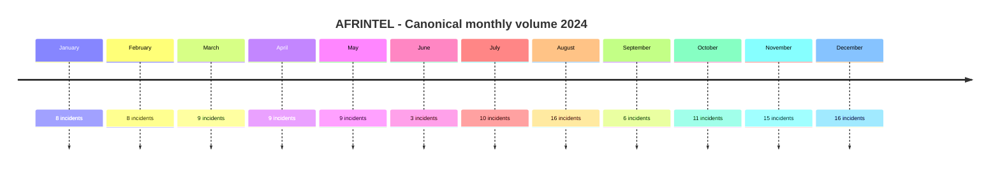
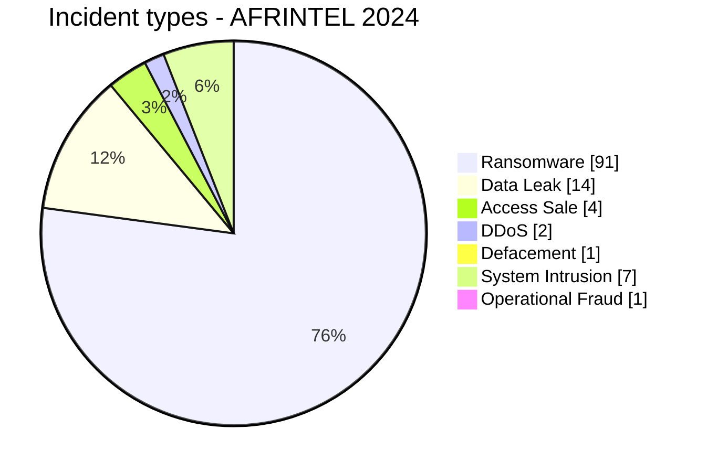

# AFRINTEL Annual CTI Report - Cyber Threats in Africa - 2024

👉🏾 [Version française](./README_FR.md)

## 1. Executive summary

In 2024, AFRINTEL documents **120 canonical cyber incidents across 30 African countries**.

The landscape is dominated by **Ransomware: 91 (75.8%)**, followed by **Data Leak: 14 (11.7%)**, **System Intrusion: 7**, **Access Sale: 4**, **DDoS: 2**, **Defacement: 1**, and **Operational Fraud: 1**. `Account Takeover` and `Malware` remain at 0.

The most represented countries are **South Africa with 36 incidents**, **Egypt with 14**, **Nigeria with 7**, and **Tunisia with 6**. The leading sectors are **Finance / Banking (18)**, **Government / Administration (17)**, and **Professional / Business Services (12)**.

Regionally, **Southern Africa accounts for 50 incidents (41.7%)**, followed by **North Africa with 31 (25.8%)** and **West Africa with 18 (15.0%)**.

Evidence maturity remains heterogeneous: **86 Claim - Unverified**, **16 Claim - Data Sample Published**, **15 Confirmed**, **2 Corroborated**, and **1 Attempted**. These evidence positions remain separate from the technical incident type.

H1 contains **46 incidents**, compared with **74 in H2**. Ransomware remains the most frequently observed threat across the year, while Data Leak, Access Sale, System Intrusion, DDoS and other categories show a threat landscape that cannot be reduced to ransomware alone.

> **Reading note:** AFRINTEL figures measure incidents documented in the observable corpus. They are not an exhaustive measurement of every compromise that actually occurred across Africa.

## 2. Methodology

Nine canonical types; strict separation between incident, initial publication, repost, discovery, and confirmation; historical reposts excluded from annual incident counts; DDoS counted by campaign; claims remain claims unless corroborated or confirmed.

## 2. Monthly evolution

| Month | Total | Ransomware | Data Leak | Access Sale | DDoS | Defacement | Account Takeover | System Intrusion | Malware | Operational Fraud |
|---|---|---|---|---|---|---|---|---|---|---|
| January | 8 | 4 | 1 | 1 | 0 | 0 | 0 | 2 | 0 | 0 |
| February | 8 | 6 | 1 | 0 | 0 | 0 | 0 | 1 | 0 | 0 |
| March | 9 | 8 | 1 | 0 | 0 | 0 | 0 | 0 | 0 | 0 |
| April | 9 | 5 | 2 | 0 | 2 | 0 | 0 | 0 | 0 | 0 |
| May | 9 | 8 | 0 | 0 | 0 | 0 | 0 | 0 | 0 | 1 |
| June | 3 | 3 | 0 | 0 | 0 | 0 | 0 | 0 | 0 | 0 |
| July | 10 | 7 | 2 | 0 | 0 | 0 | 0 | 1 | 0 | 0 |
| August | 16 | 14 | 1 | 0 | 0 | 0 | 0 | 1 | 0 | 0 |
| September | 6 | 5 | 0 | 0 | 0 | 0 | 0 | 1 | 0 | 0 |
| October | 11 | 8 | 2 | 0 | 0 | 0 | 0 | 1 | 0 | 0 |
| November | 15 | 12 | 1 | 2 | 0 | 0 | 0 | 0 | 0 | 0 |
| December | 16 | 11 | 3 | 1 | 0 | 1 | 0 | 0 | 0 | 0 |

## 2. Incident types

| Type | Records | Share |
|---|---|---|
| Ransomware | 91 | 75.8% |
| Data Leak | 14 | 11.7% |
| Access Sale | 4 | 3.3% |
| DDoS | 2 | 1.7% |
| Defacement | 1 | 0.8% |
| Account Takeover | 0 | 0.0% |
| System Intrusion | 7 | 5.8% |
| Malware | 0 | 0.0% |
| Operational Fraud | 1 | 0.8% |

## 2. Country x type

| Country | Total | Ransomware | Data Leak | Access Sale | DDoS | Defacement | Account Takeover | System Intrusion | Malware | Operational Fraud |
|---|---|---|---|---|---|---|---|---|---|---|
| South Africa | 36 | 32 | 2 | 0 | 1 | 0 | 0 | 0 | 0 | 1 |
| Egypt | 14 | 11 | 2 | 1 | 0 | 0 | 0 | 0 | 0 | 0 |
| Nigeria | 7 | 4 | 1 | 0 | 0 | 1 | 0 | 1 | 0 | 0 |
| Tunisia | 6 | 5 | 1 | 0 | 0 | 0 | 0 | 0 | 0 | 0 |
| Cameroon | 4 | 2 | 0 | 1 | 0 | 0 | 0 | 1 | 0 | 0 |
| Namibia | 4 | 4 | 0 | 0 | 0 | 0 | 0 | 0 | 0 | 0 |
| Morocco | 4 | 1 | 3 | 0 | 0 | 0 | 0 | 0 | 0 | 0 |
| Kenya | 4 | 3 | 1 | 0 | 0 | 0 | 0 | 0 | 0 | 0 |
| Ivory Coast | 3 | 3 | 0 | 0 | 0 | 0 | 0 | 0 | 0 | 0 |
| Libya | 3 | 2 | 0 | 0 | 1 | 0 | 0 | 0 | 0 | 0 |
| Seychelles | 3 | 3 | 0 | 0 | 0 | 0 | 0 | 0 | 0 | 0 |
| Burkina Faso | 3 | 0 | 1 | 2 | 0 | 0 | 0 | 0 | 0 | 0 |
| Algeria | 3 | 2 | 0 | 0 | 0 | 0 | 0 | 1 | 0 | 0 |
| Zimbabwe | 3 | 3 | 0 | 0 | 0 | 0 | 0 | 0 | 0 | 0 |
| Angola | 2 | 1 | 0 | 0 | 0 | 0 | 0 | 1 | 0 | 0 |
| Senegal | 2 | 2 | 0 | 0 | 0 | 0 | 0 | 0 | 0 | 0 |
| Ethiopia | 2 | 1 | 1 | 0 | 0 | 0 | 0 | 0 | 0 | 0 |
| Ghana | 2 | 2 | 0 | 0 | 0 | 0 | 0 | 0 | 0 | 0 |
| Tanzania | 2 | 2 | 0 | 0 | 0 | 0 | 0 | 0 | 0 | 0 |
| Sudan | 2 | 1 | 1 | 0 | 0 | 0 | 0 | 0 | 0 | 0 |
| Malawi | 2 | 0 | 1 | 0 | 0 | 0 | 0 | 1 | 0 | 0 |
| Cabo Verde | 1 | 1 | 0 | 0 | 0 | 0 | 0 | 0 | 0 | 0 |
| Congo | 1 | 1 | 0 | 0 | 0 | 0 | 0 | 0 | 0 | 0 |
| Djibouti | 1 | 1 | 0 | 0 | 0 | 0 | 0 | 0 | 0 | 0 |
| Mauritius | 1 | 1 | 0 | 0 | 0 | 0 | 0 | 0 | 0 | 0 |
| Mozambique | 1 | 0 | 0 | 0 | 0 | 0 | 0 | 1 | 0 | 0 |
| Madagascar | 1 | 0 | 0 | 0 | 0 | 0 | 0 | 1 | 0 | 0 |
| Mauritania | 1 | 1 | 0 | 0 | 0 | 0 | 0 | 0 | 0 | 0 |
| Zambia | 1 | 1 | 0 | 0 | 0 | 0 | 0 | 0 | 0 | 0 |
| Botswana | 1 | 1 | 0 | 0 | 0 | 0 | 0 | 0 | 0 | 0 |

## 2. Regional distribution

| Region | Records | Share |
|---|---|---|
| Southern Africa | 50 | 41.7% |
| North Africa | 31 | 25.8% |
| West Africa | 18 | 15.0% |
| East Africa | 11 | 9.2% |
| Central Africa | 5 | 4.2% |
| Indian Ocean | 5 | 4.2% |

## 2. Sector distribution

| Sector | Records | Share |
|---|---|---|
| Finance / Banking | 18 | 15.0% |
| Government / Administration | 17 | 14.2% |
| Professional / Business Services | 12 | 10.0% |
| Manufacturing / Industry | 11 | 9.2% |
| Healthcare / Medical | 10 | 8.3% |
| Technology / IT | 9 | 7.5% |
| Education / University | 8 | 6.7% |
| Retail / E-commerce | 7 | 5.8% |
| Telecommunications | 5 | 4.2% |
| Energy / Utilities | 4 | 3.3% |
| Media / Entertainment | 3 | 2.5% |
| Agriculture / Agribusiness | 3 | 2.5% |
| Transport / Logistics | 3 | 2.5% |
| Aviation | 3 | 2.5% |
| Water / Utilities | 2 | 1.7% |
| Legal / Justice | 2 | 1.7% |
| Construction / Real Estate | 1 | 0.8% |
| Defense / Security | 1 | 0.8% |
| Mining / Extractive Industries | 1 | 0.8% |

## 2. Actors / groups

| Actor / Group | Records | Share |
|---|---|---|
| Unknown | 18 | 15.0% |
| lockbit3 | 17 | 14.2% |
| ransomhub | 12 | 10.0% |
| killsec | 10 | 8.3% |
| hunters | 8 | 6.7% |
| spacebears | 5 | 4.2% |
| arcusmedia | 4 | 3.3% |
| blacksuit | 3 | 2.5% |
| darkvault | 3 | 2.5% |
| sarcoma | 3 | 2.5% |
| FunkSec | 3 | 2.5% |
| incransom | 2 | 1.7% |
| madliberator | 2 | 1.7% |
| ransomhouse | 2 | 1.7% |
| meow | 2 | 1.7% |
| raworld | 2 | 1.7% |
| moneymessage | 2 | 1.7% |
| Sentap | 2 | 1.7% |
| cnHunter | 1 | 0.8% |
| X0Frankenstein | 1 | 0.8% |
| medusa | 1 | 0.8% |
| dragonforce | 1 | 0.8% |
| EgyptLeaks | 1 | 0.8% |
| Pedi | 1 | 0.8% |
| eldorado | 1 | 0.8% |
| cactus | 1 | 0.8% |

## 2. Evidence maturity

| Evidence position | Records | Share |
|---|---|---|
| Claim - Unverified | 86 | 71.7% |
| Confirmed | 15 | 12.5% |
| Claim - Data Sample Published | 16 | 13.3% |
| Corroborated | 2 | 1.7% |
| Attempted | 1 | 0.8% |

## 2. H1 vs H2 comparative study

| Indicator | H1 2024 | H2 2024 | Change |
|---|---|---|---|
| Total | 46 | 74 | +28 (+60.9%) |
| Ransomware | 34 | 57 | +23 (+67.6%) |
| Data Leak | 5 | 9 | +4 (+80.0%) |
| Access Sale | 1 | 3 | +2 (+200.0%) |
| DDoS | 2 | 0 | -2 (-100.0%) |
| Defacement | 0 | 1 | +1 (new) |
| Account Takeover | 0 | 0 | Stable |
| System Intrusion | 3 | 4 | +1 (+33.3%) |
| Malware | 0 | 0 | Stable |
| Operational Fraud | 1 | 0 | -1 (-100.0%) |

H1 contains **46 incidents** and H2 **74**, a **+28 (+60.9%)** increase in the documented corpus. The main driver of the difference is ransomware, while Data Leak rises from **5 in H1 to 9 in H2**. This comparison measures corpus visibility and should not be interpreted as an equivalent increase in real-world compromises.

## 2. CTI analysis by type

Ransomware remains dominant. The 14 Data Leak records present varying levels of evidence. Observed samples remain distinct from aggregate claimed volumes, and unverified claims are not treated as confirmed compromises. System Intrusion is used where generic intrusion/access is better supported than ransomware or data exposure. Access Sale remains a claim category unless validity is verified.

## 2. Historical republications and duplicates

Seventeen historical/cross-year discoveries remain archived outside statistics. The March eTrade/eRIS duplicate remains excluded. ACAO is no longer pending.

## 2. Intelligence gaps

Initial vectors, exact technical compromise dates, complete claimed volumes, distinction between repost and re-exploitation, and public DFIR conclusions remain incomplete.

## 2. Recommendations

Use phishing-resistant MFA, PAM, segmentation, immutable backups, centralized telemetry, and strict CTI chronology.

## 2. Conclusion

The AFRINTEL 2024 corpus contains **120 canonical incidents across 30 African countries**. It highlights strong ransomware dominance, significant exposure of financial and government organizations, and uneven evidence maturity across documented incidents.

**AFRINTEL** - TLP:CLEAR
