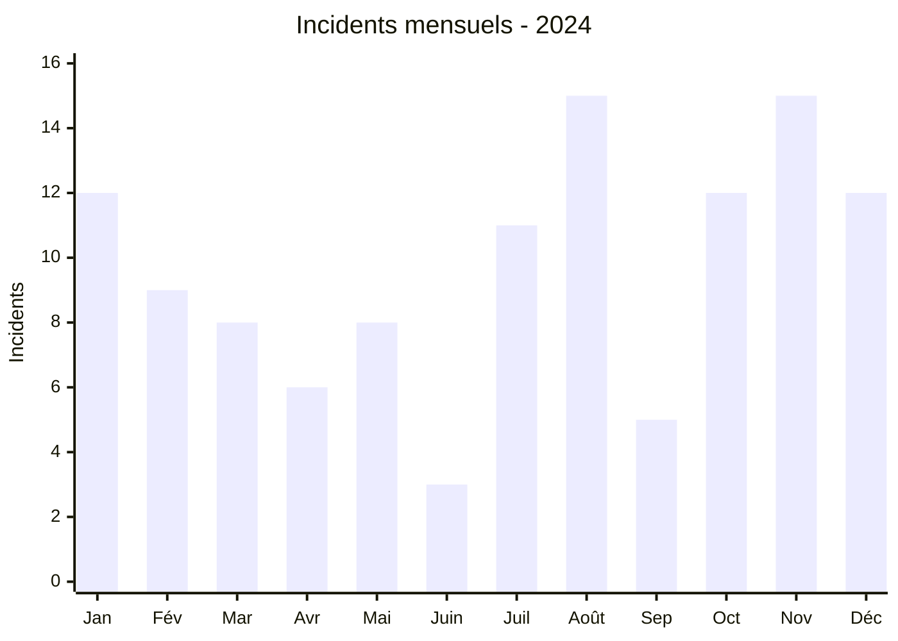
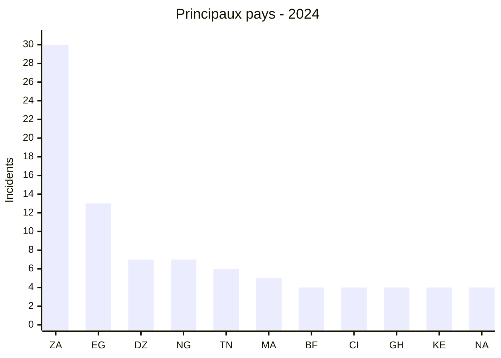

# Rapport CTI annuel AFRINTEL - 2024

👉🏾 [English version](./README.md)

## 1. Résumé exécutif

AFRINTEL a documenté **117 incidents dans 27 pays africains** en 2024 : **86 revendications ransomware (73,5 %)**, **28 fuites de données (23,9 %)** et **3 ventes d’accès (2,6 %)**. Aucun défacement n’est présent dans le corpus annuel.

L’Afrique du Sud concentre **30 incidents**, dont 29 ransomware. Elle devance nettement l’Égypte avec 13 incidents, puis l’Algérie et le Nigeria avec sept chacun. Cette concentration mesure la visibilité dans les sources suivies par AFRINTEL ; elle ne constitue pas un classement exhaustif de la cybercriminalité sur le continent.

Le second semestre totalise **70 incidents**, contre 47 au premier. Août et novembre atteignent chacun 15 publications. Cette hausse est réelle dans le corpus, mais ses causes ne peuvent pas être réduites à une intensification des attaques : activité des groupes, ouverture ou fermeture des sources, republications et délais de collecte influencent également le volume observé.

La donnée la plus utile pour la défense est la différence de profil entre les catégories. Le ransomware est particulièrement concentré en Afrique australe, alors que les fuites et ventes d’accès sont davantage réparties entre l’Afrique du Nord, l’Ouest et l’Est. Les priorités ne sont donc pas interchangeables : continuité et restauration pour le ransomware ; identité, contrôle des exports et fraude secondaire pour les expositions de données et d’accès.

Voir [victims_FR.md](./victims_FR.md).

## 2. Méthodologie

Le rapport agrège les douze fichiers `victims_FR.md` mensuels, synchronisés avec leurs versions anglaises. Chaque incident correspond à une publication suivie et classée par AFRINTEL. Une revendication, une republication, un échantillon publié et une confirmation officielle n’ont pas la même valeur probante ; le rapport conserve cette distinction.

Les sources comprennent des sites de divulgation ransomware, des forums criminels, des canaux de messagerie et des sources OSINT publiques. Les données personnelles ne sont ni reproduites ni republiées. Les volumes annoncés par les acteurs ne sont retenus comme faits que lorsqu’ils ont pu être contrôlés ; sinon, ils restent attribués à la source.

Ce corpus présente un biais de visibilité : les organisations qui ne communiquent pas, les incidents non revendiqués et les compromissions traitées hors de l’espace public peuvent échapper à la collecte. L’absence de publication ne signifie donc pas absence d’incident.

## 3. Vue globale

| Indicateur | Valeur |
|---|---:|
| Incidents / Pays | **117 / 27** |
| Ransomware | **86 (74,1 %)** |
| Fuites de données | **28 (23,9 %)** |
| Ventes d’accès | **3 (2,6 %)** |
| Défacement | **0** |

### Évolution mensuelle

| Mois | Total | Ransomware | Fuite | Vente d’accès |
|---|---:|---:|---:|---:|
| Janvier | 12 | 3 | 8 | 1 |
| Février | 9 | 5 | 4 | 0 |
| Mars | 9 | 7 | 2 | 0 |
| Avril | 6 | 5 | 1 | 0 |
| Mai | 8 | 8 | 0 | 0 |
| Juin | 3 | 3 | 0 | 0 |
| Juillet | 11 | 7 | 4 | 0 |
| Août | 15 | 14 | 1 | 0 |
| Septembre | 5 | 4 | 1 | 0 |
| Octobre | 12 | 8 | 4 | 0 |
| Novembre | 15 | 11 | 2 | 2 |
| Décembre | 12 | 11 | 1 | 0 |
| **Total** | **117** | **86** | **28** | **3** |

### Classement par pays

| Pays | Total | Ransomware | Fuite | Vente d’accès | Barre |
|---|---:|---:|---:|---:|---|
| 🇿🇦 Afrique du Sud | 30 | 29 | 1 | 0 | ██████████████████████████████ |
| 🇪🇬 Égypte | 13 | 11 | 2 | 0 | █████████████ |
| 🇩🇿 Algérie | 7 | 2 | 5 | 0 | ███████ |
| 🇳🇬 Nigeria | 7 | 4 | 3 | 0 | ███████ |
| 🇹🇳 Tunisie | 6 | 5 | 1 | 0 | ██████ |
| 🇲🇦 Maroc | 5 | 1 | 4 | 0 | █████ |
| 🇧🇫 Burkina Faso | 4 | 0 | 2 | 2 | ████ |
| 🇨🇮 Côte d’Ivoire | 4 | 3 | 1 | 0 | ████ |
| 🇬🇭 Ghana | 4 | 2 | 2 | 0 | ████ |
| 🇰🇪 Kenya | 4 | 3 | 1 | 0 | ████ |
| 🇳🇦 Namibie | 4 | 4 | 0 | 0 | ████ |
| 🇨🇲 Cameroun | 3 | 2 | 0 | 1 | ███ |
| 🇪🇹 Éthiopie | 4 | 1 | 3 | 0 | ████ |
| 🇸🇨 Seychelles | 3 | 3 | 0 | 0 | ███ |
| 🇿🇼 Zimbabwe | 3 | 3 | 0 | 0 | ███ |
| 🇱🇾 Libye | 2 | 2 | 0 | 0 | ██ |
| 🇸🇳 Sénégal | 2 | 2 | 0 | 0 | ██ |
| 🇸🇩 Soudan | 2 | 1 | 1 | 0 | ██ |
| 🇹🇿 Tanzanie | 2 | 2 | 0 | 0 | ██ |
| 🇧🇼 Botswana | 1 | 1 | 0 | 0 | █ |
| 🇨🇬 Congo | 1 | 1 | 0 | 0 | █ |
| 🇩🇯 Djibouti | 1 | 1 | 0 | 0 | █ |
| 🇲🇬 Madagascar | 1 | 0 | 1 | 0 | █ |
| 🇲🇷 Mauritanie | 1 | 1 | 0 | 0 | █ |
| 🇲🇺 Maurice | 1 | 1 | 0 | 0 | █ |
| 🇷🇼 Rwanda | 1 | 0 | 1 | 0 | █ |
| 🇿🇲 Zambie | 1 | 1 | 0 | 0 | █ |
| **Total** | **117** | **86** | **28** | **3** | |

### Répartition régionale

| Région | Total | Ransomware | Fuite | Vente d’accès |
|---|---:|---:|---:|---:|
| Afrique australe | 39 | 38 | 1 | 0 |
| Afrique du Nord | 34 | 22 | 12 | 0 |
| Afrique de l’Ouest | 21 | 11 | 8 | 2 |
| Afrique de l’Est | 14 | 8 | 6 | 0 |
| Océan Indien | 5 | 4 | 1 | 0 |
| Afrique centrale | 4 | 3 | 0 | 1 |
| **Total** | **117** | **86** | **28** | **3** |

### Répartition sectorielle normalisée

| Secteur | Incidents | Part |
|---|---:|---:|
| Finance / Banque | 15 | 12,9 % |
| Gouvernement / Administration | 12 | 10,3 % |
| Industrie / Fabrication | 11 | 9,5 % |
| Services professionnels / Entreprises | 11 | 9,5 % |
| Technologies / Informatique | 11 | 9,5 % |
| Éducation / Université | 11 | 9,4 % |
| Santé / Médical | 9 | 7,8 % |
| Commerce / E-commerce | 9 | 7,8 % |
| Télécommunications | 5 | 4,3 % |
| Médias / Divertissement | 4 | 3,4 % |
| Agriculture / Agro-industrie | 3 | 2,6 % |
| Pétrole / Énergie | 3 | 2,6 % |
| Transport / Logistique | 3 | 2,6 % |
| Défense / Sécurité | 2 | 1,7 % |
| Juridique / Justice | 2 | 1,7 % |
| Eau / Services essentiels | 2 | 1,7 % |
| Aviation | 1 | 0,9 % |
| Construction / Immobilier | 1 | 0,9 % |
| Mines / Industries extractives | 1 | 0,9 % |
| Société civile / ONG | 1 | 0,9 % |
| **Total** | **117** | **100 %** |

### Acteurs les plus visibles

| Acteur ou libellé source | Incidents | Part du corpus |
|---|---:|---:|
| LockBit3 | 16 | 13,7 % |
| RansomHub | 12 | 10,3 % |
| KillSec | 10 | 8,5 % |
| Hunters | 8 | 6,8 % |
| SpaceBears | 5 | 4,3 % |
| ArcusMedia | 4 | 3,4 % |
| Tanaka - publication sur un forum clandestin | 3 | 2,6 % |
| BlackSuit | 3 | 2,6 % |
| Addka72424 - republication attribuée à FriendlyChemist | 3 | 2,6 % |
| DarkVault | 3 | 2,6 % |

## 4. Analyse détaillée par type d’incident

### 4.1 Ransomware

Le ransomware représente **73,5 %** du corpus. La concentration est forte : l’Afrique du Sud compte 29 des 86 publications, et les quatre groupes les plus visibles totalisent 46 incidents. Cette visibilité ne démontre pas une chaîne d’attaque commune. Les données sources documentent surtout la présence d’organisations sur des sites de fuite ; elles contiennent rarement les journaux ou analyses nécessaires pour confirmer chiffrement, persistance et déplacement latéral.

### 4.2 Fuites de données et ventes d’accès

Les 28 fuites et trois ventes d’accès forment un ensemble plus diffus. L’Algérie et le Maroc présentent une majorité de fuites, tandis que les trois ventes d’accès se répartissent entre le Burkina Faso et le Cameroun. Plusieurs publications comportent des échantillons structurés ; d’autres sont des compilations ou republications dont l’ancienneté demeure incertaine. Une vente d’accès signale une exposition possible, pas une compromission consommée.

## 5. Impact sectoriel

La finance arrive en tête avec 15 incidents, devant le gouvernement avec 12. L’industrie, les services professionnels et les technologies en comptent chacun 11. Ces volumes appellent des réponses différentes : protection des transactions et des identités dans la finance, continuité des services publics, segmentation industrielle et maîtrise des accès prestataires. Le classement sectoriel ne remplace pas l’analyse de sensibilité propre à chaque organisation.

## 6. Profil des acteurs et évaluation du risque

| Périmètre | Niveau | Justification |
|---|---|---|
| 🇿🇦 Afrique du Sud | 🔴 Élevé | 30 incidents, dont 29 ransomware |
| 🇪🇬 Égypte | 🔴 Élevé | 13 incidents et exposition de fonctions publiques et financières |
| 🇩🇿 Algérie / 🇳🇬 Nigeria | 🔴 Élevé | Sept incidents chacun, avec plusieurs fuites de données |
| 🇹🇳 Tunisie / 🇲🇦 Maroc | 🟠 Moyen | Cinq à six incidents, profils ransomware et fuite différents |
| Autres pays | 🟡 Faible à moyen | Moins de cinq incidents ; appréciation au cas par cas |

LockBit3, RansomHub, KillSec et Hunters sont les noms les plus fréquents. Cette fréquence sert à orienter la veille, pas à présumer leurs outils, leurs affiliés ou leur mode opératoire sur chaque incident.

## 7. Tendances et lacunes de renseignement

- **Observé - confiance élevée :** 86 incidents sur 117 sont classés ransomware.
- **Observé - confiance élevée :** l’Afrique du Sud concentre 25,6 % du corpus annuel et 33,7 % des publications ransomware.
- **Observé - confiance élevée :** le second semestre compte 70 incidents, soit 23 de plus que le premier.
- **Observé - confiance élevée :** les fuites et ventes d’accès sont proportionnellement plus présentes en Afrique du Nord et de l’Ouest qu’en Afrique australe.
- **Lacune majeure :** les sources consultées contiennent très peu de rapports DFIR publics africains. Les vecteurs d’accès, durées de présence, chemins d’exfiltration et impacts opérationnels restent donc inconnus dans la majorité des cas.
- **Hypothèses privilégiées - confiance moyenne au niveau général, faible pour un incident individuel :** réutilisation d’identifiants, recours à des courtiers d’accès initial et exploitation de services périmétriques ou VPN exposés. Le corpus ne permet pas de les attribuer automatiquement aux victimes recensées.
- **Lacune :** republications, doubles revendications et données anciennes peuvent modifier la perception temporelle de l’activité.
- **Collecte attendue :** renforcer la datation des données, le suivi des confirmations de victimes et la recherche de recoupements techniques indépendants.

## 8. Analyse comparative objective : premier et second semestres

| Indicateur | Janvier-juin | Juillet-décembre | Écart absolu | Évolution |
|---|---:|---:|---:|---:|
| Incidents | 47 | 70 | +23 | +48,9 % |
| Ransomware | 31 | 55 | +24 | +77,4 % |
| Fuites de données | 15 | 13 | -2 | -13,3 % |
| Ventes d’accès | 1 | 2 | +1 | +100,0 % |
| Défacement | 0 | 0 | 0 | Stable |
| Moyenne mensuelle | 7,8 | 11,7 | +3,9 | +48,9 % |

Le second semestre compte 23 incidents de plus que le premier. Cette différence provient entièrement de l’augmentation du ransomware : 55 publications au second semestre contre 31 au premier. Les fuites restent proches en volume (13 contre 15), tandis que les ventes d’accès passent de une à deux. Août et novembre atteignent chacun 15 publications, alors que juin n’en compte que trois.

Cette comparaison décrit le corpus collecté, et non une mesure directe de la fréquence réelle des intrusions. Les variations peuvent refléter l’activité des acteurs, la visibilité des sources, les republications, les délais de collecte ou des différences de qualification. La hausse semestrielle est donc un signal robuste dans les données AFRINTEL, mais son attribution causale et son impact opérationnel restent inconnus sans confirmations indépendantes et rapports DFIR.

**Conclusion comparative :** le premier semestre est plus mixte, avec une part relative de fuites plus élevée (31,9 % contre 18,6 % au second semestre), tandis que le second semestre est nettement dominé par les revendications ransomware (78,6 % contre 66,0 %). Les priorités défensives doivent donc combiner résilience et restauration contre le ransomware avec contrôle des identités, des exports et des données exposées.

## 9. Cartographie MITRE ATT&CK contextuelle

| Qualification | Technique | Utilisation défensive |
|---|---|---|
| Hypothèse - confiance moyenne | T1078 - Valid Accounts | Scénario d’accès initial ou de persistance à vérifier |
| Hypothèse - confiance moyenne | T1190 - Exploit Public-Facing Application | Scénario pour services périmétriques ; non établi dans le corpus |
| Préventif | T1486 - Data Encrypted for Impact | Détecter le chiffrement massif ; non confirmé pour chaque publication ransomware |
| Préventif | T1490 - Inhibit System Recovery | Alerter sur l’altération des sauvegardes et mécanismes de restauration |
| Préventif | T1567 - Exfiltration Over Web Service | Détecter les transferts sortants atypiques ; canal rarement documenté |

## 10. Recommandations

- **Administrations et opérateurs essentiels :** identifier les services prioritaires, segmenter les plans de gestion et tester la continuité hors ligne.
- **Finance et télécommunications :** imposer une MFA résistante au phishing, surveiller les exports et encadrer les accès des tiers.
- **Industrie :** séparer IT, production et maintenance ; limiter les comptes partagés.
- **Éducation et santé :** réduire l’exposition des portails, inventorier les dépôts documentaires et préparer la notification des personnes concernées.
- **Toutes organisations :** contrôler régulièrement l’exposition Internet et fermer les accès distants inutiles.

## 11. Recommandations SOC et tactiques

| Qualification | Action |
|---|---|
| **Observé** | Utiliser les organisations, domaines, dates et acteurs du corpus pour prioriser la corrélation IAM, EDR, VPN, WAF, DNS, proxy et messagerie. |
| **Hypothèse** | Rechercher connexions depuis des infrastructures inhabituelles, réutilisation d’identifiants, création de comptes, élévation de privilèges et exports massifs. |
| **Préventif** | Déployer des détections Sigma ou équivalentes pour dump LSASS, PowerShell obfusqué, suppression de sauvegardes et chiffrement massif. |
| **Préventif** | Surveiller avec le proxy, le DNS, l’EDR ou Suricata les transferts sortants anormaux et l’usage inattendu d’outils tels que Rclone. |

## 12. Recommandations stratégiques

| Priorité | Qualification | Mesure |
|---:|---|---|
| 1 | **Observé** | Prioriser la résilience ransomware en Afrique australe et les risques d’exposition de données en Afrique du Nord et de l’Ouest. |
| 2 | **Hypothèse** | Auditer les scénarios d’accès par identité, prestataire et équipement périmétrique sans les présenter comme des faits historiques. |
| 3 | **Préventif** | Réduire la surface d’attaque externe, fermer les RDP inutiles et corriger rapidement les équipements Edge/VPN. |
| 4 | **Préventif** | Maintenir des sauvegardes critiques immuables, isolées et testées par restauration. |
| 5 | **Préventif** | Après une fuite d’identifiants, révoquer les sessions, imposer la rotation des secrets et rechercher leur réutilisation. |

## 13. Conclusion

Le corpus 2024 montre une pression ransomware forte et visible, mais aussi une circulation persistante de données et d’accès qui ne suit pas la même géographie. Son intérêt n’est pas de produire un palmarès définitif. Il fournit une base de travail pour vérifier les expositions, hiérarchiser la collecte et transformer des signaux issus du dark web, du darknet et de l’OSINT en décisions défensives mesurées.

La limite principale reste le manque de retours DFIR publics. Tant que cette lacune persiste, AFRINTEL doit continuer à documenter précisément ce qui est observé, à isoler les hypothèses et à laisser les inconnues visibles.

**AFRINTEL - TLP:CLEAR**

[Dépôt AFRINTEL](https://github.com/Hatchepsoute/AFRINTEL)
