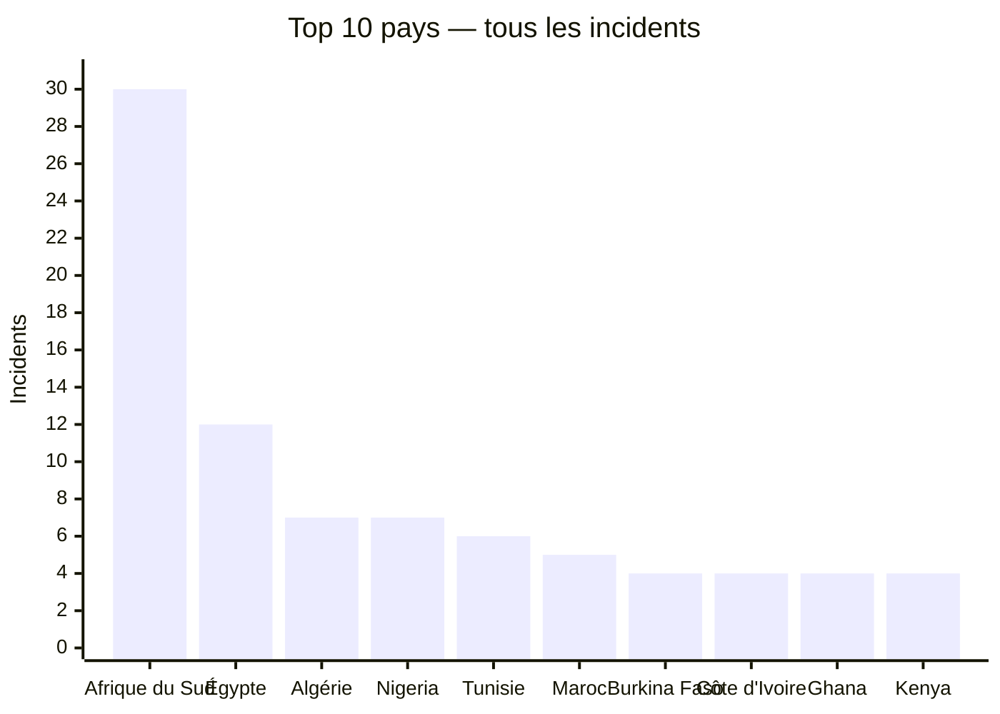
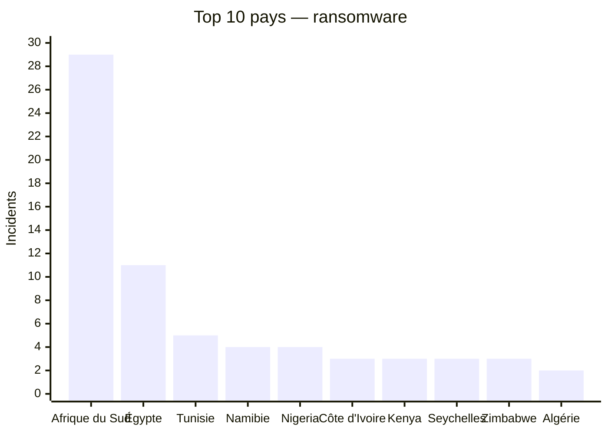
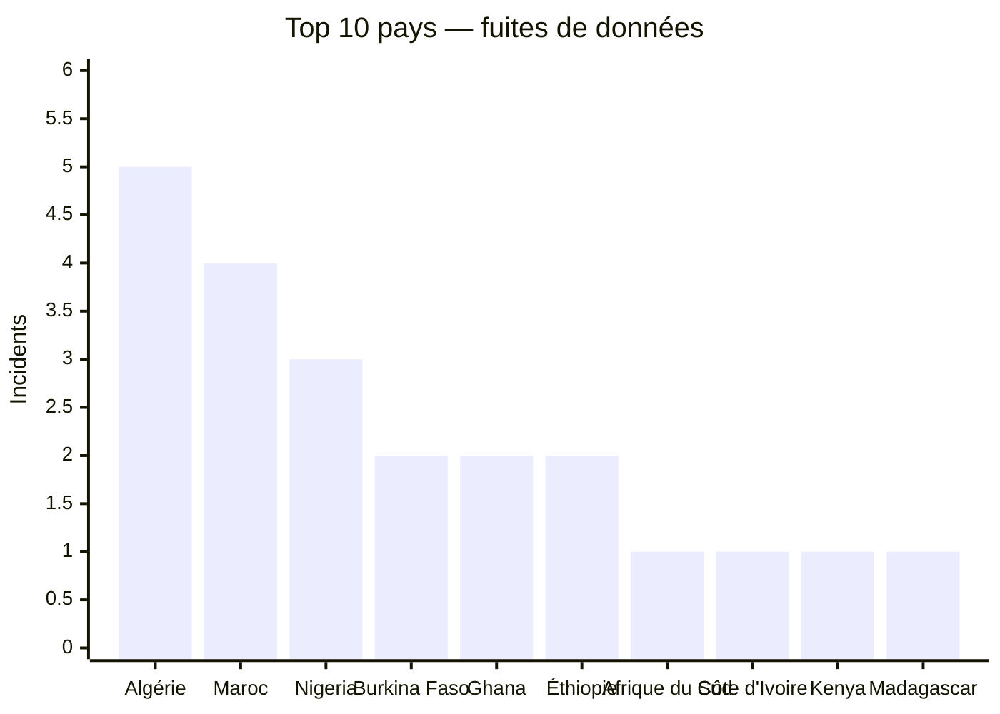

# Rapport CTI annuel global AFRINTEL — 2024

Ce rapport suit la visibilité publique des cyberattaques contre des organisations africaines en 2024. Les chiffres sont recalculés à partir des fiches victimes mensuelles, les revendications comptées telles qu'elles apparaissent dans ces sources, rien de plus.

👉🏾 [Version anglaise](./README.md)

## 1. Vue d'ensemble

**115 fiches** au total : **86 ransomware**, **26 fuites de données**, **3 ventes d'accès**, **0 défacement**, et 0 laissées sans classification d'incident explicite.

Ce classement mesure la présence publique dans les sources AFRINTEL, pas l'ampleur réelle de chaque attaque survenue.

## Méthodologie

Les chiffres viennent des fiches victimes annuelles, compilées à partir des fichiers mensuels. Une fiche correspond à une publication ou revendication documentée, pas forcément à une victime unique. Les publications de forums et de sites de fuite restent des revendications tant que rien ne les confirme de manière indépendante. Cette édition a été entièrement recalculée à partir des 12 fichiers victimes mensuels AFRINTEL 2024 (`CyberAttackAfrica/2024/*/victims_FR.md`), la source de vérité du projet, et ressort à **115 fiches**, contre 114 dans l'édition précédente après l'ajout d'une revendication nouvellement documentée contre l'Université d'Antananarivo (Madagascar).

## 2. Classement général par pays

| Pays | Incidents |
|---|---:|
| 🇿🇦 Afrique du Sud | 30 |
| 🇪🇬 Égypte | 12 |
| 🇩🇿 Algérie | 7 |
| 🇳🇬 Nigeria | 7 |
| 🇹🇳 Tunisie | 6 |
| 🇲🇦 Maroc | 5 |
| 🇧🇫 Burkina Faso | 4 |
| 🇨🇮 Côte d'Ivoire | 4 |
| 🇬🇭 Ghana | 4 |
| 🇰🇪 Kenya | 4 |
| 🇳🇦 Namibie | 4 |
| 🇨🇲 Cameroun | 3 |
| 🇸🇨 Seychelles | 3 |
| 🇿🇼 Zimbabwe | 3 |
| 🇪🇹 Éthiopie | 3 |
| 🇱🇾 Libye | 2 |
| 🇸🇩 Soudan | 2 |
| 🇸🇳 Sénégal | 2 |
| 🇹🇿 Tanzanie | 2 |
| 🇧🇼 Botswana | 1 |
| 🇨🇬 Congo | 1 |
| 🇩🇯 Djibouti | 1 |
| 🇲🇬 Madagascar | 1 |
| 🇲🇺 Maurice | 1 |
| 🇲🇷 Mauritanie | 1 |
| 🇷🇼 Rwanda | 1 |
| 🇿🇲 Zambie | 1 |

## 2.1 Répartition par pays : ransomware et fuites de données

Ce tableau couvre tous les pays recensés. Le total combiné additionne les ransomware et les fuites de données. Les ventes d'accès et les défacements sont indiqués séparément afin de préserver la lecture des catégories.

| Pays | Ransomware | Fuites de données | Total ransomware + fuites | Ventes d'accès | Défacements | Total incidents |
|---|---:|---:|---:|---:|---:|---:|
| 🇿🇦 Afrique du Sud | 29 | 1 | 30 | 0 | 0 | 30 |
| 🇪🇬 Égypte | 11 | 1 | 12 | 0 | 0 | 12 |
| 🇩🇿 Algérie | 2 | 5 | 7 | 0 | 0 | 7 |
| 🇳🇬 Nigeria | 4 | 3 | 7 | 0 | 0 | 7 |
| 🇹🇳 Tunisie | 5 | 1 | 6 | 0 | 0 | 6 |
| 🇲🇦 Maroc | 1 | 4 | 5 | 0 | 0 | 5 |
| 🇧🇫 Burkina Faso | 0 | 2 | 2 | 2 | 0 | 4 |
| 🇨🇮 Côte d'Ivoire | 3 | 1 | 4 | 0 | 0 | 4 |
| 🇬🇭 Ghana | 2 | 2 | 4 | 0 | 0 | 4 |
| 🇰🇪 Kenya | 3 | 1 | 4 | 0 | 0 | 4 |
| 🇳🇦 Namibie | 4 | 0 | 4 | 0 | 0 | 4 |
| 🇨🇲 Cameroun | 2 | 0 | 2 | 1 | 0 | 3 |
| 🇸🇨 Seychelles | 3 | 0 | 3 | 0 | 0 | 3 |
| 🇿🇼 Zimbabwe | 3 | 0 | 3 | 0 | 0 | 3 |
| 🇪🇹 Éthiopie | 1 | 2 | 3 | 0 | 0 | 3 |
| 🇱🇾 Libye | 2 | 0 | 2 | 0 | 0 | 2 |
| 🇸🇩 Soudan | 1 | 1 | 2 | 0 | 0 | 2 |
| 🇸🇳 Sénégal | 2 | 0 | 2 | 0 | 0 | 2 |
| 🇹🇿 Tanzanie | 2 | 0 | 2 | 0 | 0 | 2 |
| 🇧🇼 Botswana | 1 | 0 | 1 | 0 | 0 | 1 |
| 🇨🇬 Congo | 1 | 0 | 1 | 0 | 0 | 1 |
| 🇩🇯 Djibouti | 1 | 0 | 1 | 0 | 0 | 1 |
| 🇲🇬 Madagascar | 0 | 1 | 1 | 0 | 0 | 1 |
| 🇲🇺 Maurice | 1 | 0 | 1 | 0 | 0 | 1 |
| 🇲🇷 Mauritanie | 1 | 0 | 1 | 0 | 0 | 1 |
| 🇷🇼 Rwanda | 0 | 1 | 1 | 0 | 0 | 1 |
| 🇿🇲 Zambie | 1 | 0 | 1 | 0 | 0 | 1 |

## 3. Classement ransomware par pays

| Pays | Incidents ransomware |
|---|---:|
| 🇿🇦 Afrique du Sud | 29 |
| 🇪🇬 Égypte | 11 |
| 🇹🇳 Tunisie | 5 |
| 🇳🇦 Namibie | 4 |
| 🇳🇬 Nigeria | 4 |
| 🇨🇮 Côte d'Ivoire | 3 |
| 🇰🇪 Kenya | 3 |
| 🇸🇨 Seychelles | 3 |
| 🇿🇼 Zimbabwe | 3 |
| 🇩🇿 Algérie | 2 |
| 🇨🇲 Cameroun | 2 |
| 🇬🇭 Ghana | 2 |
| 🇱🇾 Libye | 2 |
| 🇸🇳 Sénégal | 2 |
| 🇹🇿 Tanzanie | 2 |
| 🇧🇼 Botswana | 1 |
| 🇨🇬 Congo | 1 |
| 🇩🇯 Djibouti | 1 |
| 🇲🇦 Maroc | 1 |
| 🇲🇺 Maurice | 1 |
| 🇲🇷 Mauritanie | 1 |
| 🇸🇩 Soudan | 1 |
| 🇿🇲 Zambie | 1 |
| 🇪🇹 Éthiopie | 1 |

### Top 10 ransomware

| Pays | Incidents ransomware |
|---|---:|
| 🇿🇦 Afrique du Sud | 29 |
| 🇪🇬 Égypte | 11 |
| 🇹🇳 Tunisie | 5 |
| 🇳🇦 Namibie | 4 |
| 🇳🇬 Nigeria | 4 |
| 🇨🇮 Côte d'Ivoire | 3 |
| 🇰🇪 Kenya | 3 |
| 🇸🇨 Seychelles | 3 |
| 🇿🇼 Zimbabwe | 3 |
| 🇩🇿 Algérie | 2 |

## 4. Groupes ransomware les plus présents

| Groupe | Incidents |
|---|---:|
| lockbit3 | 16 |
| ransomhub | 10 |
| killsec | 10 |
| hunters | 8 |
| spacebears | 5 |
| arcusmedia | 4 |
| blacksuit | 3 |
| darkvault | 3 |
| sarcoma | 3 |
| incransom | 2 |
| madliberator | 2 |
| ransomhouse | 2 |
| meow | 2 |
| raworld | 2 |
| moneymessage | 2 |
| funksec | 2 |
| medusa | 1 |
| dragonforce | 1 |
| eldorado | 1 |
| cactus | 1 |
| BrainCipher | 1 |
| orca | 1 |
| hellcat | 1 |
| akira | 1 |
| fog | 1 |
| apt73/bashe | 1 |

## 5. Classement des fuites de données par pays

| Pays | Fuites de données |
|---|---:|
| 🇩🇿 Algérie | 5 |
| 🇲🇦 Maroc | 4 |
| 🇳🇬 Nigeria | 3 |
| 🇧🇫 Burkina Faso | 2 |
| 🇬🇭 Ghana | 2 |
| 🇪🇹 Éthiopie | 2 |
| 🇿🇦 Afrique du Sud | 1 |
| 🇨🇮 Côte d'Ivoire | 1 |
| 🇰🇪 Kenya | 1 |
| 🇲🇬 Madagascar | 1 |
| 🇷🇼 Rwanda | 1 |
| 🇸🇩 Soudan | 1 |
| 🇹🇳 Tunisie | 1 |
| 🇪🇬 Égypte | 1 |

### Top 10 fuites de données

| Pays | Fuites de données |
|---|---:|
| 🇩🇿 Algérie | 5 |
| 🇲🇦 Maroc | 4 |
| 🇳🇬 Nigeria | 3 |
| 🇧🇫 Burkina Faso | 2 |
| 🇬🇭 Ghana | 2 |
| 🇪🇹 Éthiopie | 2 |
| 🇿🇦 Afrique du Sud | 1 |
| 🇨🇮 Côte d'Ivoire | 1 |
| 🇰🇪 Kenya | 1 |
| 🇲🇬 Madagascar | 1 |

## Répartition sectorielle

Les secteurs sont ici regroupés selon une nomenclature commune, un classificateur à mots-clés appliqué de la même façon à chaque valeur `Secteur` mensuelle. Là où une fiche ne donnait pas de quoi trancher, le secteur est indiqué comme non précisé.

| Secteur normalisé | Incidents |
|---|---:|
| Technologie / informatique | 17 |
| Finance / banque | 15 |
| Éducation / université | 12 |
| Administration / gouvernement | 12 |
| Commerce de détail / e-commerce | 11 |
| Industrie / fabrication | 9 |
| Santé / médical | 9 |
| Services professionnels / aux entreprises | 8 |
| Énergie / services publics | 5 |
| Médias / divertissement | 3 |
| Construction / immobilier | 3 |
| Agriculture / agro-industrie | 3 |
| Transport / logistique | 3 |
| Droit / justice | 2 |
| Société civile / ONG | 1 |
| Défense / sécurité | 1 |
| Mines | 1 |

## 6. Acteurs ou sources associés aux fuites

| Acteur / source | Fuites |
|---|---:|
| Tanaka | 6 |
| Addka72424, republication d'un post initial attribué à FriendlyChemist, sur un forum cybercriminel | 3 |
| ransomhub | 2 |
| Bambi, publication sur un forum cybercriminel | 1 |
| DataHoes, publication sur un forum cybercriminel | 1 |
| Milad, publication sur un forum cybercriminel (compte depuis affiché comme banni) | 1 |
| Moroccan Empire ; republié par AmeliaBeaumont sur un forum cybercriminel | 1 |
| NizaarFarah (compte source) | 1 |
| Non attribue ; publication par UnknownMember | 1 |
| Non attribué ; republié par Hxp7 | 1 |
| Pedi | 1 |
| RainbowBF | 1 |
| TheColorYellow, publication postée sur RaidForums | 1 |
| ThreatSec, publication de Tanaka sur un forum clandestin | 1 |
| X0Frankenstein, publication sur un forum cybercriminel | 1 |
| bxxxx1 | 1 |
| r57 | 1 |
| zebi, republication sur un forum cybercriminel | 1 |

## Visualisations

Les graphiques montrent les dix premiers pays ; les tableaux précédents conservent le classement complet.

## 7. Lecture CTI

Le ransomware domine en volume brut, mais les fuites de données racontent autre chose, le plus souvent un post de forum avec un dump SQL ou un échantillon de document attaché plutôt qu'une inscription sur un site de fuite. Volumes annoncés, authenticité des archives, liens réels entre des revendications répétées : rien de tout ça ne se tranche ici, il faut vérifier fiche par fiche.

## 8. Précautions

Sites de fuite et forums clandestins sont traités comme des sources de revendication, rien de plus. Aucune donnée personnelle brute n'est reproduite dans ce rapport.

**AFRINTEL** — TLP:CLEAR
