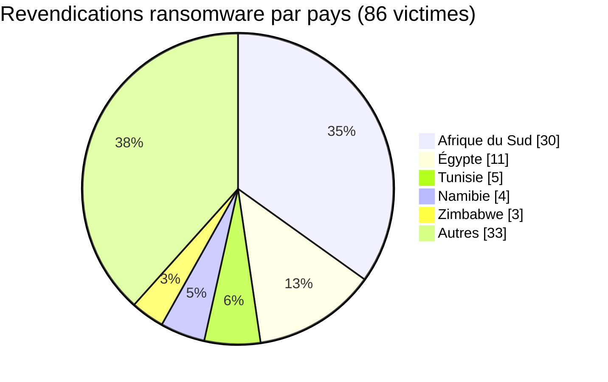
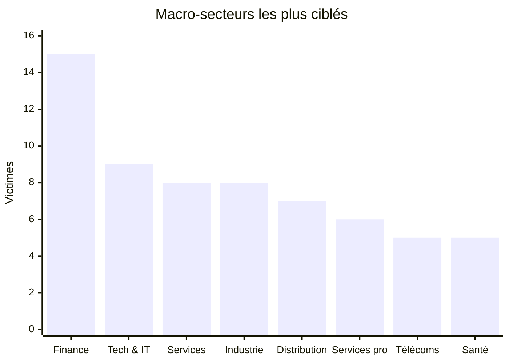
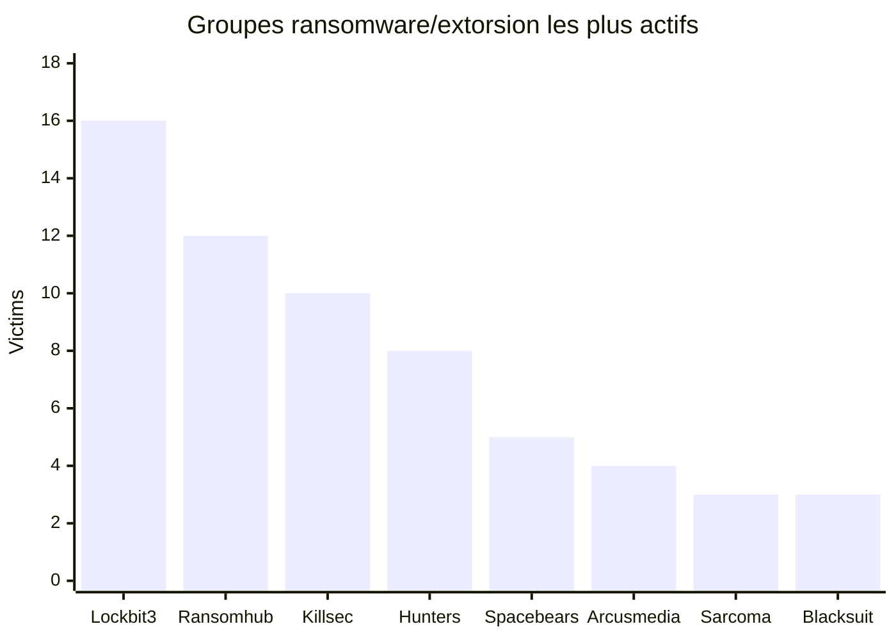
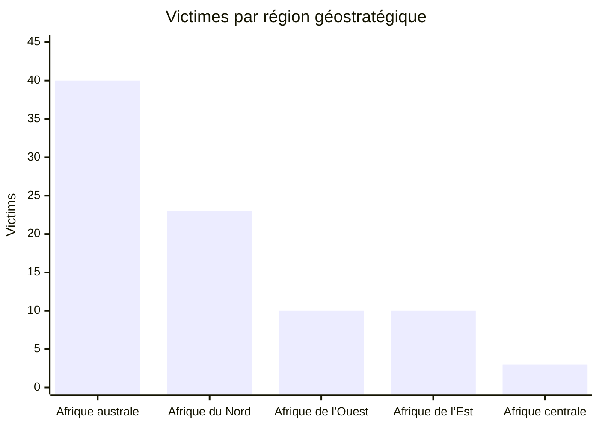
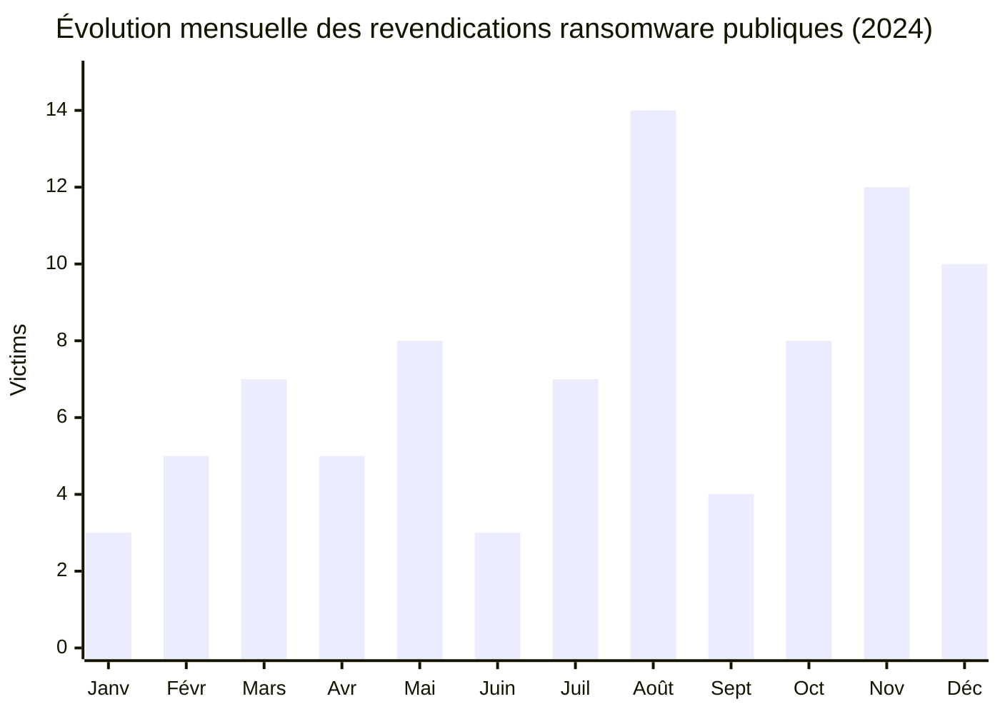

# Rapport de Cyber Threat Intelligence (CTI)
## Paysage ransomware et extorsion de données en Afrique - 2024

👉🏾 [English version](./README.md)

**Source des données :** dataset OSINT AFRINTEL basé sur les publications publiques de sites de fuite ransomware/extorsion et la veille spécialisée  
**Période couverte :** 1er janvier au 31 décembre 2024  
**Victimes documentées :** 86  
**Classification :** TLP:CLEAR  

👉🏾 [Liste des victimes](./victims_FR.md)

---

## Note de fiabilité

Ce rapport traite les publications de sites de fuite ransomware comme des **revendications publiques** sauf confirmation indépendante par la victime ou une autorité de confiance. Le dataset reflète les organisations publiquement listées par des groupes cybercriminels ou observées via des sources de veille. Il doit donc être utilisé comme une base de visibilité OSINT/CTI, et non comme une mesure exhaustive de tous les incidents ransomware en Afrique.

---

## 1. Résumé exécutif

En 2024, AFRINTEL a documenté **86 victimes africaines** associées publiquement à des activités ransomware ou d’extorsion de données. L’activité touche **24 pays**, avec une forte concentration en **Afrique du Sud**, suivie de **l’Égypte**, de **la Tunisie**, de **la Namibie** et de plusieurs économies d’Afrique de l’Ouest et de l’Est.

Le dataset montre une accélération nette au second semestre : **55 victimes** ont été recensées de juillet à décembre, contre **31 victimes** de janvier à juin. **Août** est le mois le plus élevé avec **14 victimes**, suivi de **novembre** avec **12 victimes** et **décembre** avec **10 victimes**.

**Constats clés**

- **86 victimes** documentées sur 12 mois.
- **24 pays africains** représentés dans le dataset.
- **L’Afrique du Sud** est le pays le plus ciblé avec **30 victimes** (34,9 %).
- **Les services financiers & assurances** constituent le macro-secteur le plus représenté avec **15 victimes** (17,4 %).
- **LockBit3** est le groupe le plus visible avec **16 victimes** (18,6 %), suivi de **RansomHub** avec **12** et **KillSec** avec **10**.
- **L’Afrique australe** concentre **40 victimes** (46,5 %), principalement à cause du poids de l’Afrique du Sud.

---

## 2. Méthodologie

Le rapport a été reconstruit à partir de la liste AFRINTEL 2024 vérifiée contenant exactement **86 entrées**. Chaque entrée a été normalisée selon :

- le pays et la région ;
- le groupe ransomware/extorsion ;
- le mois de publication publique ;
- le secteur de la victime ;
- le domaine/site web public ;
- la description publique de la victime.

Les statistiques sectorielles sont regroupées en macro-secteurs afin d’éviter une fragmentation trompeuse entre des catégories proches comme banque, finance, assurance et infrastructures de marché.

**Limites**

- Les données couvrent uniquement les revendications publiques et la visibilité issue des sites de fuite.
- Certaines descriptions de victimes restent limitées lorsque le contexte métier public est faible.
- L’attribution repose sur le nom d’acteur associé à la publication publique et ne doit pas être interprétée comme une confirmation forensique.

---

## 3. Répartition par pays

| Pays | Victimes | Part | Impact visuel |
|---|---:|---:|:---|
| 🇿🇦 Afrique du Sud | 30 | 34,9 % | ██████████████████████████████ |
| 🇪🇬 Égypte | 11 | 12,8 % | ███████████ |
| 🇹🇳 Tunisie | 5 | 5,8 % | █████ |
| 🇳🇦 Namibie | 4 | 4,7 % | ████ |
| 🇿🇼 Zimbabwe | 3 | 3,5 % | ███ |
| 🇸🇨 Seychelles | 3 | 3,5 % | ███ |
| 🇰🇪 Kenya | 3 | 3,5 % | ███ |
| 🇳🇬 Nigéria | 3 | 3,5 % | ███ |
| 🇨🇮 Côte d’Ivoire | 3 | 3,5 % | ███ |
| 🇸🇳 Sénégal | 2 | 2,3 % | ██ |
| 🇨🇲 Cameroun | 2 | 2,3 % | ██ |
| 🇹🇿 Tanzanie | 2 | 2,3 % | ██ |
| 🇱🇾 Libye | 2 | 2,3 % | ██ |
| 🇬🇭 Ghana | 2 | 2,3 % | ██ |
| 🇸🇩 Soudan | 2 | 2,3 % | ██ |
| 🇧🇼 Botswana | 1 | 1,2 % | █ |
| 🇲🇷 Mauritanie | 1 | 1,2 % | █ |
| 🇿🇲 Zambie | 1 | 1,2 % | █ |
| 🇩🇿 Algérie | 1 | 1,2 % | █ |
| 🇪🇹 Éthiopie | 1 | 1,2 % | █ |
| 🇩🇯 Djibouti | 1 | 1,2 % | █ |
| 🇲🇺 Maurice | 1 | 1,2 % | █ |
| 🇨🇬 Congo | 1 | 1,2 % | █ |
| 🇲🇦 Maroc | 1 | 1,2 % | █ |

### Lecture analytique

L’Afrique du Sud représente à elle seule près d’un tiers du dataset 2024. Cette exposition est cohérente avec son poids économique numérique, la densité de son tissu d’entreprises, la maturité de son secteur financier et la forte visibilité publique des revendications ransomware. L’Égypte reste le deuxième point chaud, avec des expositions répétées dans les services, la santé, le gouvernement, l’énergie et la distribution.

---

## 4. Répartition par secteur

| Secteur | Victimes | Part | Impact visuel |
|---|---:|---:|:---|
| Services financiers & assurances | 15 | 17,4 % | ███████████████ |
| Technologies & services IT | 9 | 10,5 % | █████████ |
| Services / services aux entreprises | 8 | 9,3 % | ████████ |
| Industrie manufacturière & industrielle | 8 | 9,3 % | ████████ |
| Distribution / retail / e-commerce | 7 | 8,1 % | ███████ |
| Services professionnels | 6 | 7,0 % | ██████ |
| Télécommunications | 5 | 5,8 % | █████ |
| Santé & pharmacie | 5 | 5,8 % | █████ |
| Gouvernement & secteur public | 4 | 4,7 % | ████ |
| Logistique / transport | 3 | 3,5 % | ███ |
| Agriculture, agroalimentaire & boissons | 3 | 3,5 % | ███ |
| Médias / sport / audiovisuel | 2 | 2,3 % | ██ |
| Éducation | 2 | 2,3 % | ██ |
| Eau / services publics | 2 | 2,3 % | ██ |
| Contexte public limité / inconnu | 2 | 2,3 % | ██ |
| Énergie / pétrole & gaz | 2 | 2,3 % | ██ |
| Automobile / transport industriel | 1 | 1,2 % | █ |
| Mines & ressources naturelles | 1 | 1,2 % | █ |
| Construction / ingénierie | 1 | 1,2 % | █ |

### Lecture sectorielle

Les services financiers, assurances, banques et fintechs forment le macro-secteur le plus exposé. Cela reflète à la fois la valeur des données financières et la pression que les groupes ransomware peuvent exercer sur des organisations dépendantes de la confiance, de la disponibilité et de la conformité réglementaire.

Les technologies et services IT sont également fortement représentés. Cette exposition crée un risque de chaîne d’approvisionnement, car la compromission d’un fournisseur IT, d’un intégrateur télécom, d’un éditeur logiciel ou d’un prestataire managé peut affecter indirectement des clients en aval.

Les organisations industrielles restent attractives, car l’interruption opérationnelle peut rapidement générer des impacts financiers, logistiques et réputationnels, surtout lorsque la segmentation entre IT métier et environnements critiques reste insuffisante.

---

## 5. Activité des groupes ransomware

| Groupe | Victimes | Part | Impact visuel |
|---|---:|---:|:---|
| lockbit3 | 16 | 18,6 % | ████████████████ |
| ransomhub | 12 | 14,0 % | ████████████ |
| killsec | 10 | 11,6 % | ██████████ |
| hunters | 8 | 9,3 % | ████████ |
| spacebears | 5 | 5,8 % | █████ |
| arcusmedia | 4 | 4,7 % | ████ |
| sarcoma | 3 | 3,5 % | ███ |
| blacksuit | 3 | 3,5 % | ███ |
| darkvault | 3 | 3,5 % | ███ |
| madliberator | 2 | 2,3 % | ██ |
| moneymessage | 2 | 2,3 % | ██ |
| ransomhouse | 2 | 2,3 % | ██ |
| raworld | 2 | 2,3 % | ██ |
| meow | 2 | 2,3 % | ██ |
| incransom | 2 | 2,3 % | ██ |
| apt73/bashe | 1 | 1,2 % | █ |
| fog | 1 | 1,2 % | █ |
| braincipher | 1 | 1,2 % | █ |
| orca | 1 | 1,2 % | █ |
| hellcat | 1 | 1,2 % | █ |
| akira | 1 | 1,2 % | █ |
| cactus | 1 | 1,2 % | █ |
| eldorado | 1 | 1,2 % | █ |
| dragonforce | 1 | 1,2 % | █ |
| medusa | 1 | 1,2 % | █ |

### Lecture acteur

**LockBit3** reste l’acteur le plus visible dans le dataset AFRINTEL 2024, malgré les opérations internationales de perturbation de son écosystème. **RansomHub** apparaît comme un acteur d’extorsion majeur avec un ciblage large par régions et secteurs. **KillSec** montre une activité forte au second semestre, notamment contre des organisations exposées publiquement, des fintechs, des services publics et des plateformes numériques.

La longue traîne de groupes plus petits ou émergents confirme la fragmentation de l’écosystème ransomware/extorsion. Pour les défenseurs africains, cela signifie que la détection ne doit pas dépendre uniquement de quelques noms d’acteurs, mais d’abord des comportements : abus d’accès initial, vol d’identifiants, mouvement latéral, staging de données, exfiltration et préparation de l’extorsion.

---

## 6. Analyse géostratégique régionale

| Région | Pays représentés | Victimes | Part |
|---|---|---:|---:|
| Afrique australe | 🇿🇦 Afrique du Sud (30), 🇳🇦 Namibie (4), 🇿🇼 Zimbabwe (3), 🇧🇼 Botswana (1), 🇿🇲 Zambie (1), 🇲🇺 Maurice (1) | 40 | 46,5 % |
| Afrique du Nord | 🇪🇬 Égypte (11), 🇹🇳 Tunisie (5), 🇸🇩 Soudan (2), 🇱🇾 Libye (2), 🇲🇷 Mauritanie (1), 🇩🇿 Algérie (1), 🇲🇦 Maroc (1) | 23 | 26,7 % |
| Afrique de l’Ouest | 🇳🇬 Nigéria (3), 🇨🇮 Côte d’Ivoire (3), 🇬🇭 Ghana (2), 🇸🇳 Sénégal (2) | 10 | 11,6 % |
| Afrique de l’Est | 🇰🇪 Kenya (3), 🇸🇨 Seychelles (3), 🇹🇿 Tanzanie (2), 🇪🇹 Éthiopie (1), 🇩🇯 Djibouti (1) | 10 | 11,6 % |
| Afrique centrale | 🇨🇲 Cameroun (2), 🇨🇬 Congo (1) | 3 | 3,5 % |

### Interprétation régionale

- **Afrique australe** : principale zone d’exposition ransomware/extorsion en 2024, tirée par l’Afrique du Sud et renforcée par des incidents en Namibie, Zimbabwe, Botswana, Zambie et Maurice.
- **Afrique du Nord** : deuxième région la plus représentée, avec l’Égypte comme moteur principal et des expositions en Tunisie, Libye, Soudan, Maroc, Algérie et Mauritanie.
- **Afrique de l’Ouest** : ciblage récurrent d’organisations financières, publiques, de distribution et d’assurance.
- **Afrique de l’Est** : exposition combinant fintech, télécoms, logistique, infrastructures publiques et plateformes crypto/financières.
- **Afrique centrale** : sous-représentation dans la visibilité OSINT, qui peut refléter une moindre divulgation publique plutôt qu’une exposition réelle plus faible.

---

## 7. Chronologie mensuelle et tendances

| Mois | Victimes | Vue visuelle |
|---|---:|---|
| Janvier | 3 | ███ |
| Février | 5 | █████ |
| Mars | 7 | ███████ |
| Avril | 5 | █████ |
| Mai | 8 | ████████ |
| Juin | 3 | ███ |
| Juillet | 7 | ███████ |
| Août | 14 | ██████████████ |
| Septembre | 4 | ████ |
| Octobre | 8 | ████████ |
| Novembre | 12 | ████████████ |
| Décembre | 10 | ██████████ |

### Analyse des tendances

Le second semestre 2024 montre une hausse claire de la visibilité publique ransomware/extorsion. Le mois le plus fort est **août**, avec 14 victimes, suivi de **novembre** et **décembre**. Cette dynamique suggère que les organisations africaines devraient renforcer la supervision avant les périodes de congés, fins de mois et fins de trimestre, lorsque la capacité de réponse opérationnelle peut être réduite.

---

## 8. Priorités SOC et détection

| Priorité | Axe de détection | Télémétrie recommandée |
|---|---|---|
| Accès initial | Abus VPN/RDP, services exposés, authentifications suspectes | VPN, IAM, Windows Security, EDR, firewall |
| Vol d’identifiants | Accès LSASS, credential dumping, connexions admin anormales | EDR, Sysmon, journaux Windows |
| Discovery | Énumération de partages, découverte AD, inventaire hôte | EDR, Sysmon, PowerShell, lignes de commande |
| Mouvement latéral | Création de services distants, anomalies SMB/RDP/WinRM | Windows Security, EDR, flux réseau, firewall |
| Collecte & staging | Création d’archives, staging massif, outils de compression inhabituels | EDR, événements fichiers, télémétrie endpoint |
| Exfiltration | Gros transferts sortants, uploads cloud inhabituels, destinations rares | Proxy, firewall, DNS, CASB, NetFlow |
| Impact | Exécution ransomware, renommage/chiffrement massif | EDR, événements fichiers, logs de sauvegarde |

### Mapping MITRE ATT&CK

| Phase | Technique |
|---|---|
| Initial Access | T1566 Phishing, T1190 Exploit Public-Facing Application, T1133 External Remote Services |
| Credential Access | T1003 OS Credential Dumping, T1555 Credentials from Password Stores |
| Discovery | T1087 Account Discovery, T1018 Remote System Discovery, T1083 File and Directory Discovery |
| Lateral Movement | T1021 Remote Services, T1570 Lateral Tool Transfer |
| Collection | T1560 Archive Collected Data, T1119 Automated Collection |
| Exfiltration | T1041 Exfiltration Over C2 Channel, T1567 Exfiltration Over Web Service |
| Impact | T1486 Data Encrypted for Impact, T1490 Inhibit System Recovery |

---

## 9. Recommandations stratégiques

| Domaine | Action recommandée |
|---|---|
| Résilience sauvegarde | Appliquer la règle 3-2-1, conserver des sauvegardes hors ligne/immutables et tester régulièrement la restauration. |
| Sécurité des identités | Imposer le MFA sur VPN, RDP, portails cloud admin, messagerie et comptes privilégiés. |
| Gestion de l’exposition | Auditer en continu les services exposés, appliances internet-facing et applications vulnérables. |
| Segmentation réseau | Séparer serveurs critiques, réseaux OT/ICS, infrastructure de sauvegarde et postes d’administration. |
| Corrélation SOC | Corréler anomalies d’authentification, discovery endpoint, création d’archives et transferts sortants. |
| Réponse à incident | Maintenir un playbook ransomware incluant aspects juridiques, communication, technique et décision exécutive. |
| Veille CTI | Suivre les revendications d’acteurs, mais éviter une dépendance excessive aux IoC ; prioriser la détection par TTP et exposition sectorielle. |

> Le paiement d’une rançon n’est pas recommandé. Il ne garantit ni la récupération ni la non-divulgation des données et peut financer de nouvelles activités criminelles.

---

## 10. Conclusion

Le dataset AFRINTEL 2024 confirme que les groupes ransomware et d’extorsion ciblent de manière régulière les organisations africaines, dans les secteurs publics, privés et critiques. La menace ne se limite ni à une région ni à une industrie : services financiers, fournisseurs technologiques, organisations industrielles, entités gouvernementales et opérateurs télécoms apparaissent tous dans le dataset.

Pour 2025 et au-delà, les SOC africains devraient prioriser le durcissement des identités, la réduction de l’exposition externe, la résilience des sauvegardes, la détection de l’exfiltration et le partage CTI régional.

---

*Libre diffusion - TLP:CLEAR.*

**Contact :** Adama ASSIONGBON - [LinkedIn](https://www.linkedin.com/in/adama-assiongbon-3bb941193/)
