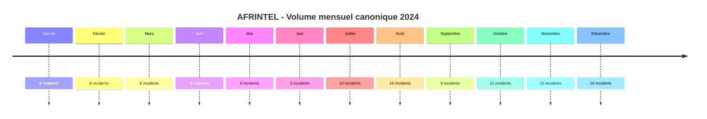
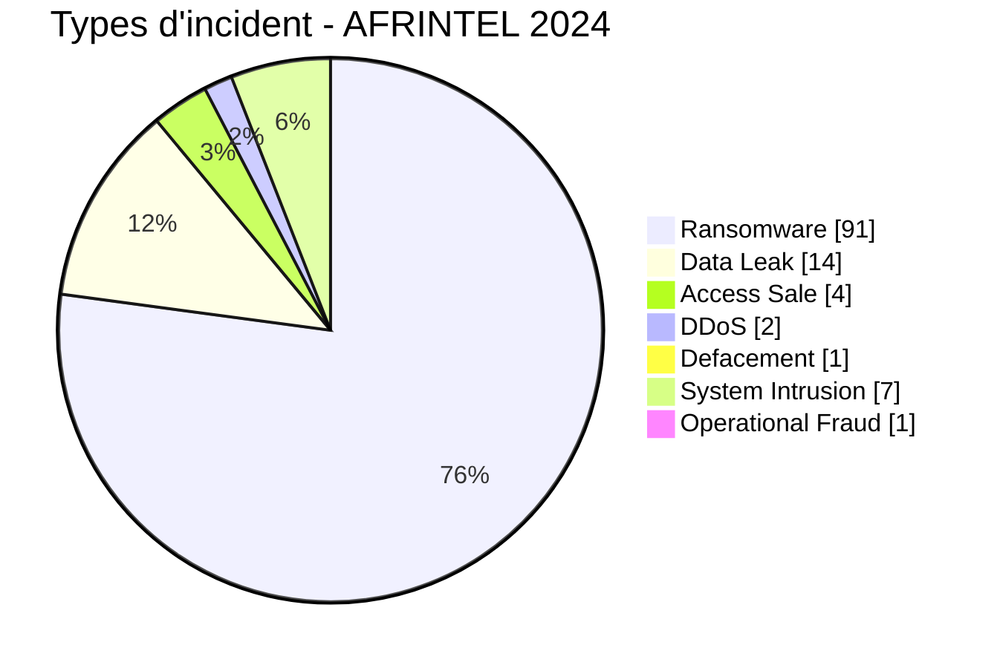

# Rapport CTI annuel AFRINTEL - Cybermenaces en Afrique - 2024

👉🏾 [English version](./README.md)

## 1. Synthèse exécutive

En 2024, AFRINTEL documente **120 cyberincidents canoniques dans 30 pays africains**.

Le paysage est dominé par **Ransomware : 91 (75,8 %)**, suivi de **Data Leak : 14 (11,7 %)**, **System Intrusion : 7**, **Access Sale : 4**, **DDoS : 2**, **Defacement : 1** et **Operational Fraud : 1**. `Account Takeover` et `Malware` restent à 0.

Les pays les plus représentés sont **l'Afrique du Sud avec 36 incidents**, **l'Égypte avec 14**, **le Nigeria avec 7** et **la Tunisie avec 6**. Les principaux secteurs sont **Finance / Banque (18)**, **Gouvernement / Administration (17)** et **Services professionnels / Business (12)**.

La répartition régionale montre une forte visibilité de **l'Afrique australe avec 50 incidents (41,7 %)**, suivie de **l'Afrique du Nord avec 31 (25,8 %)** et de **l'Afrique de l'Ouest avec 18 (15,0 %)**.

La maturité des preuves reste hétérogène : **86 Claim - Unverified**, **16 Claim - Data Sample Published**, **15 Confirmed**, **2 Corroborated** et **1 Attempted**. Ces positions de preuve restent distinctes du type technique de l'incident.

Le premier semestre compte **46 incidents**, contre **74 au second semestre**. Le ransomware reste la menace la plus fréquemment observée sur l'ensemble de l'année, tandis que les Data Leak, ventes d'accès, intrusions système, DDoS et autres catégories montrent un paysage de menace plus diversifié qu'une lecture centrée uniquement sur le ransomware.

> **Note de lecture :** les chiffres AFRINTEL mesurent les incidents documentés dans le corpus à partir de sources observables. Ils ne constituent pas une mesure exhaustive de toutes les compromissions ayant réellement eu lieu en Afrique.

## 2. Méthodologie

- 9 types canoniques AFRINTEL.
- Incident date / meilleure fenêtre temporelle soutenue prioritaire.
- Date de publication, repost et découverte AFRINTEL séparées.
- Historical reposts exclus du comptage annuel mais archivés.
- DDoS compté par campagne.
- Tentatives gérées par statut.
- Aucun claim n'est converti en confirmation sans preuve.

## 2. Évolution mensuelle

| Mois | Total | Ransomware | Data Leak | Access Sale | DDoS | Defacement | Account Takeover | System Intrusion | Malware | Operational Fraud |
|---|---|---|---|---|---|---|---|---|---|---|
| Janvier | 8 | 4 | 1 | 1 | 0 | 0 | 0 | 2 | 0 | 0 |
| Février | 8 | 6 | 1 | 0 | 0 | 0 | 0 | 1 | 0 | 0 |
| Mars | 9 | 8 | 1 | 0 | 0 | 0 | 0 | 0 | 0 | 0 |
| Avril | 9 | 5 | 2 | 0 | 2 | 0 | 0 | 0 | 0 | 0 |
| Mai | 9 | 8 | 0 | 0 | 0 | 0 | 0 | 0 | 0 | 1 |
| Juin | 3 | 3 | 0 | 0 | 0 | 0 | 0 | 0 | 0 | 0 |
| Juillet | 10 | 7 | 2 | 0 | 0 | 0 | 0 | 1 | 0 | 0 |
| Août | 16 | 14 | 1 | 0 | 0 | 0 | 0 | 1 | 0 | 0 |
| Septembre | 6 | 5 | 0 | 0 | 0 | 0 | 0 | 1 | 0 | 0 |
| Octobre | 11 | 8 | 2 | 0 | 0 | 0 | 0 | 1 | 0 | 0 |
| Novembre | 15 | 12 | 1 | 2 | 0 | 0 | 0 | 0 | 0 | 0 |
| Décembre | 16 | 11 | 3 | 1 | 0 | 1 | 0 | 0 | 0 | 0 |

## 2. Types d'incident

| Type | Fiches | Part |
|---|---|---|
| Ransomware | 91 | 75,8 % |
| Data Leak | 14 | 11,7 % |
| Access Sale | 4 | 3,3 % |
| DDoS | 2 | 1,7 % |
| Defacement | 1 | 0,8 % |
| Account Takeover | 0 | 0,0 % |
| System Intrusion | 7 | 5,8 % |
| Malware | 0 | 0,0 % |
| Operational Fraud | 1 | 0,8 % |

## 2. Pays x type

| Pays | Total | Ransomware | Data Leak | Access Sale | DDoS | Defacement | Account Takeover | System Intrusion | Malware | Operational Fraud |
|---|---|---|---|---|---|---|---|---|---|---|
| Afrique du Sud | 36 | 32 | 2 | 0 | 1 | 0 | 0 | 0 | 0 | 1 |
| Égypte | 14 | 11 | 2 | 1 | 0 | 0 | 0 | 0 | 0 | 0 |
| Nigeria | 7 | 4 | 1 | 0 | 0 | 1 | 0 | 1 | 0 | 0 |
| Tunisie | 6 | 5 | 1 | 0 | 0 | 0 | 0 | 0 | 0 | 0 |
| Cameroun | 4 | 2 | 0 | 1 | 0 | 0 | 0 | 1 | 0 | 0 |
| Namibie | 4 | 4 | 0 | 0 | 0 | 0 | 0 | 0 | 0 | 0 |
| Maroc | 4 | 1 | 3 | 0 | 0 | 0 | 0 | 0 | 0 | 0 |
| Kenya | 4 | 3 | 1 | 0 | 0 | 0 | 0 | 0 | 0 | 0 |
| Côte d'Ivoire | 3 | 3 | 0 | 0 | 0 | 0 | 0 | 0 | 0 | 0 |
| Libye | 3 | 2 | 0 | 0 | 1 | 0 | 0 | 0 | 0 | 0 |
| Seychelles | 3 | 3 | 0 | 0 | 0 | 0 | 0 | 0 | 0 | 0 |
| Burkina Faso | 3 | 0 | 1 | 2 | 0 | 0 | 0 | 0 | 0 | 0 |
| Algérie | 3 | 2 | 0 | 0 | 0 | 0 | 0 | 1 | 0 | 0 |
| Zimbabwe | 3 | 3 | 0 | 0 | 0 | 0 | 0 | 0 | 0 | 0 |
| Angola | 2 | 1 | 0 | 0 | 0 | 0 | 0 | 1 | 0 | 0 |
| Sénégal | 2 | 2 | 0 | 0 | 0 | 0 | 0 | 0 | 0 | 0 |
| Éthiopie | 2 | 1 | 1 | 0 | 0 | 0 | 0 | 0 | 0 | 0 |
| Ghana | 2 | 2 | 0 | 0 | 0 | 0 | 0 | 0 | 0 | 0 |
| Tanzanie | 2 | 2 | 0 | 0 | 0 | 0 | 0 | 0 | 0 | 0 |
| Soudan | 2 | 1 | 1 | 0 | 0 | 0 | 0 | 0 | 0 | 0 |
| Malawi | 2 | 0 | 1 | 0 | 0 | 0 | 0 | 1 | 0 | 0 |
| Cabo Verde | 1 | 1 | 0 | 0 | 0 | 0 | 0 | 0 | 0 | 0 |
| Congo | 1 | 1 | 0 | 0 | 0 | 0 | 0 | 0 | 0 | 0 |
| Djibouti | 1 | 1 | 0 | 0 | 0 | 0 | 0 | 0 | 0 | 0 |
| Maurice | 1 | 1 | 0 | 0 | 0 | 0 | 0 | 0 | 0 | 0 |
| Mozambique | 1 | 0 | 0 | 0 | 0 | 0 | 0 | 1 | 0 | 0 |
| Madagascar | 1 | 0 | 0 | 0 | 0 | 0 | 0 | 1 | 0 | 0 |
| Mauritanie | 1 | 1 | 0 | 0 | 0 | 0 | 0 | 0 | 0 | 0 |
| Zambie | 1 | 1 | 0 | 0 | 0 | 0 | 0 | 0 | 0 | 0 |
| Botswana | 1 | 1 | 0 | 0 | 0 | 0 | 0 | 0 | 0 | 0 |

## 2. Répartition régionale

| Région | Fiches | Part |
|---|---|---|
| Afrique australe | 50 | 41,7 % |
| Afrique du Nord | 31 | 25,8 % |
| Afrique de l'Ouest | 18 | 15,0 % |
| Afrique de l'Est | 11 | 9,2 % |
| Afrique centrale | 5 | 4,2 % |
| Océan Indien | 5 | 4,2 % |

## 2. Répartition sectorielle

| Secteur | Fiches | Part |
|---|---|---|
| Finance / Banque | 18 | 15,0 % |
| Gouvernement / Administration | 17 | 14,2 % |
| Services professionnels / Business | 12 | 10,0 % |
| Industrie / Fabrication | 11 | 9,2 % |
| Santé / Médical | 10 | 8,3 % |
| Technologie / IT | 9 | 7,5 % |
| Éducation / Université | 8 | 6,7 % |
| Commerce / E-commerce | 7 | 5,8 % |
| Télécommunications | 5 | 4,2 % |
| Énergie / Services publics | 4 | 3,3 % |
| Médias / Divertissement | 3 | 2,5 % |
| Agriculture / Agro-industrie | 3 | 2,5 % |
| Transport / Logistique | 3 | 2,5 % |
| Aviation | 3 | 2,5 % |
| Eau / Services publics | 2 | 1,7 % |
| Juridique / Justice | 2 | 1,7 % |
| Construction / Immobilier | 1 | 0,8 % |
| Défense / Sécurité | 1 | 0,8 % |
| Mines / Industries extractives | 1 | 0,8 % |

## 2. Acteurs / groupes

| Acteur / Groupe | Fiches | Part |
|---|---|---|
| Unknown | 18 | 15,0 % |
| lockbit3 | 17 | 14,2 % |
| ransomhub | 12 | 10,0 % |
| killsec | 10 | 8,3 % |
| hunters | 8 | 6,7 % |
| spacebears | 5 | 4,2 % |
| arcusmedia | 4 | 3,3 % |
| blacksuit | 3 | 2,5 % |
| darkvault | 3 | 2,5 % |
| sarcoma | 3 | 2,5 % |
| FunkSec | 3 | 2,5 % |
| incransom | 2 | 1,7 % |
| madliberator | 2 | 1,7 % |
| ransomhouse | 2 | 1,7 % |
| meow | 2 | 1,7 % |
| raworld | 2 | 1,7 % |
| moneymessage | 2 | 1,7 % |
| Sentap | 2 | 1,7 % |
| cnHunter | 1 | 0,8 % |
| X0Frankenstein | 1 | 0,8 % |
| medusa | 1 | 0,8 % |
| dragonforce | 1 | 0,8 % |
| EgyptLeaks | 1 | 0,8 % |
| Pedi | 1 | 0,8 % |
| eldorado | 1 | 0,8 % |
| cactus | 1 | 0,8 % |

`Unknown` correspond à une absence d'attribution publique ou suffisamment établie dans le corpus.

## 2. Maturité des preuves

| Position de preuve | Fiches | Part |
|---|---|---|
| Claim - Unverified | 86 | 71,7 % |
| Confirmed | 15 | 12,5 % |
| Claim - Data Sample Published | 16 | 13,3 % |
| Corroborated | 2 | 1,7 % |
| Attempted | 1 | 0,8 % |

### Confiance

| Confiance | Fiches | Part |
|---|---|---|
| Low | 84 | 70,0 % |
| Very High | 16 | 13,3 % |
| Medium | 13 | 10,8 % |
| High | 7 | 5,8 % |

### Impact

| Impact | Fiches | Part |
|---|---|---|
| Level 3 | 54 | 45,0 % |
| Level 2 | 47 | 39,2 % |
| Level 4 | 19 | 15,8 % |

## 2. Étude comparative S1 vs S2

| Indicateur | S1 2024 | S2 2024 | Évolution |
|---|---|---|---|
| Total | 46 | 74 | +28 (+60,9 %) |
| Ransomware | 34 | 57 | +23 (+67,6 %) |
| Data Leak | 5 | 9 | +4 (+80,0 %) |
| Access Sale | 1 | 3 | +2 (+200,0 %) |
| DDoS | 2 | 0 | -2 (-100,0 %) |
| Defacement | 0 | 1 | +1 (nouveau) |
| Account Takeover | 0 | 0 | Stable |
| System Intrusion | 3 | 4 | +1 (+33,3 %) |
| Malware | 0 | 0 | Stable |
| Operational Fraud | 1 | 0 | -1 (-100,0 %) |

Le **S1 compte 46 incidents** et le **S2 74**, soit **+28 (+60,9 %)** dans le corpus documenté. Le principal moteur de l'écart est le ransomware, tandis que les Data Leak passent de **5 au S1 à 9 au S2**. Cette comparaison mesure la visibilité du corpus et ne doit pas être interprétée comme une hausse équivalente du nombre réel de compromissions.

## 2. Analyse CTI par type

### Ransomware - 91
La majorité des fiches ransomware provient de publications d'acteurs. Les confirmations publiques fortes restent une minorité ; la présence sur un leak site n'établit pas systématiquement le chiffrement.

### Data Leak - 14
Les 14 fiches Data Leak présentent des niveaux de preuve variables. Les échantillons effectivement observés sont distingués des volumes globaux revendiqués, et les claims non vérifiés ne sont pas assimilés à des compromissions confirmées.

### System Intrusion - 7
Cette catégorie évite de forcer Eneo, Malawi Passport, GTBank, EmploiPartner, CNE Mozambique et d'autres dossiers dans ransomware/data leak lorsque la preuve ne le permet pas.

### Access Sale - 4
Une offre d'accès ne prouve ni validité, ni utilisation, ni exfiltration.

### DDoS - 2
Central Bank of Libya et Moneyweb sont comptés comme campagnes confirmées.

### Defacement - 1 / Operational Fraud - 1
NBS Nigeria et DPWI restent les seuls cas de leurs catégories.

## 2. Republications historiques et doublons

**17 découvertes historiques/cross-year** restent archivées hors statistiques. Le doublon eTrade/eRIS de mars reste exclu. ACAO ne figure plus dans les pending : sa chronologie 2024 est suffisamment établie pour le rattacher à juillet.

## 2. Intelligence gaps

- vecteurs d'accès initial souvent inconnus ;
- date technique exacte de compromission non publique pour plusieurs claims ;
- volumes revendiqués rarement vérifiables intégralement ;
- distinction entre republication, réexploitation et seconde intrusion parfois impossible sans comparaison forensique ;
- conclusions DFIR publiques limitées.

## 2. Recommandations

### Organisations
MFA résistante au phishing, PAM, segmentation, sauvegardes immuables, durcissement des interfaces publiques et plans de réponse à incident.

### SOC
Centraliser EDR, IAM, VPN, WAF, DNS, proxy, cloud et logs applicatifs ; détecter exports massifs, archives inhabituelles, changements privilégiés et transferts sortants.

### CTI
Préserver distinctement incident, publication initiale, repost, découverte et confirmation ; suivre les datasets historiques comme risque d'exposition sans les recompter comme nouvelles attaques.

## 2. Conclusion

Le corpus AFRINTEL 2024 contient **120 incidents canoniques dans 30 pays africains**. Il met en évidence une forte domination du ransomware, une exposition importante des secteurs financier et gouvernemental, ainsi qu'une maturité de preuve encore très variable selon les incidents.

**AFRINTEL** - TLP:CLEAR
