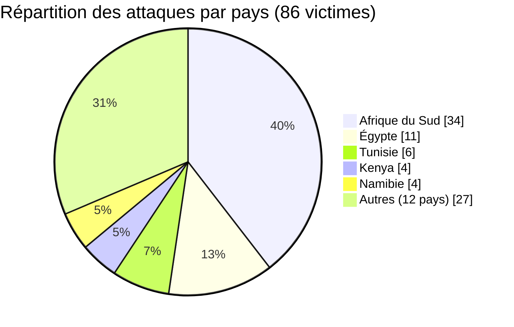
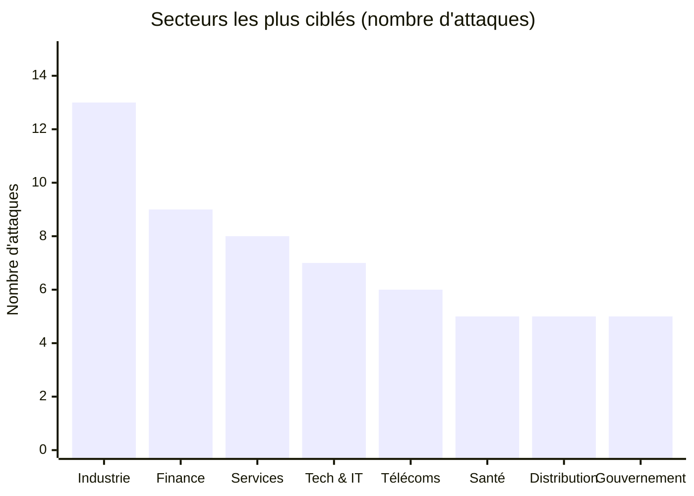
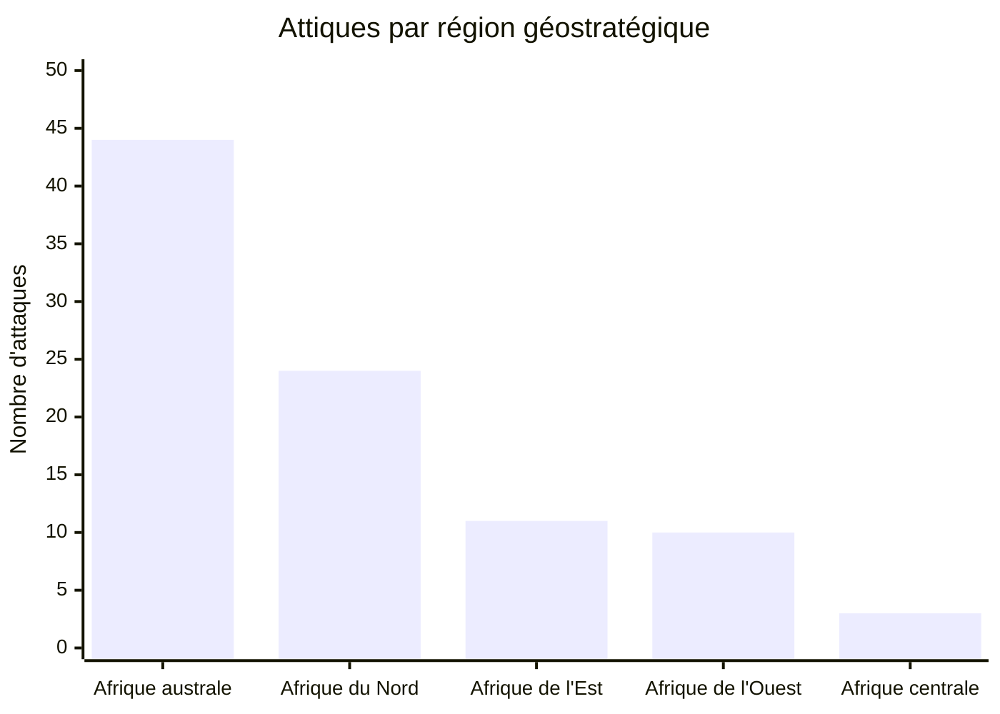
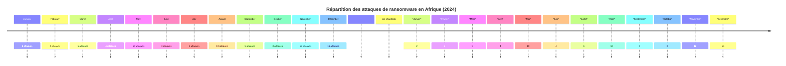

[](https://github.com/Hatchepsoute/AFRINTEL)


# Rapport de Cyber Threat Intelligence (CTI)
## Cartographie des attaques ransomware en Afrique - année 2024

**Source des données :** OSINT (sites de fuite de groupes ransomware, veille spécialisée)  
**Nombre d’incidents documentés :** 86

---

## 1. Résumé exécutif

En 2024, l’Afrique a été confrontée à une vague soutenue de cyberattaques de type ransomware, affectant au moins **86 organisations** publiques et privées à travers le continent. L’Afrique du Sud, l’Égypte, la Tunisie et le Kenya ont été les pays les plus ciblés. Les secteurs critiques tels que la **manufacture**, les **services financiers**, la **santé**, les **télécommunications** et les **administrations publiques** ont subi des fuites de données après des revendications systématiques.

👉🏾 [Liste des victimes](./victims_FR.md)

Le groupe de ransomware **LockBit3** reste le plus actif, suivi de **RansomHub** et **Hunters**. Les attaques ont souvent entraîné la divulgation complète des données exfiltrées, exposant des informations sensibles (clientèles, finances, dossiers médicaux, infrastructures critiques).

**Principales conclusions :**
- 🔹 **86 victimes** identifiées sur 12 mois.
- 🔹 **Afrique du Sud** : 34 attaques - pays le plus touché.
- 🔹 **Secteur manufacturier** : 13 victimes - le plus représenté.
- 🔹 **LockBit3** responsable de 22 attaques.
- 🔹 **56% des victimes** sont des entreprises commerciales, 19% des institutions publiques.

---

## 2. Méthodologie

Ce rapport est issu d’une collecte OSINT systématique sur les blogs de fuite (leak sites) de groupes ransomware actifs entre le 1er janvier et le 31 décembre 2024. Pour chaque victime, ont été relevés : pays, secteur d’activité, groupe ransomware, statut (revendication + fuite), et description professionnelle. Seuls les cas avec divulgation de données confirmée ont été inclus.

**Limites :** Les données ne couvrent que les attaques rendues publiques par les cybercriminels. Le nombre réel d’incidents est probablement plus élevé.

---

## 3. Analyse des victimes

### 3.1 Répartition par pays

| Pays               | Nombre d’attaques | Pourcentage |
|--------------------|------------------|-------------|
| 🇿🇦 Afrique du Sud  | 34               | 39,5 %      |
| 🇪🇬 Égypte          | 11               | 12,8 %      |
| 🇹🇳 Tunisie         | 6                | 7,0 %       |
| 🇰🇪 Kenya           | 4                | 4,7 %       |
| 🇳🇦 Namibie         | 4                | 4,7 %       |
| 🇳🇬 Nigéria         | 3                | 3,5 %       |
| 🇨🇮 Côte d’Ivoire   | 3                | 3,5 %       |
| 🇿🇼 Zimbabwe        | 3                | 3,5 %       |
| 🇸🇨 Seychelles      | 3                | 3,5 %       |
| Autres (12 pays)   | 15               | 17,4 %      |

> L’Afrique du Sud concentre près de 40 % des attaques, confirmant son statut de première économie numérique du continent mais aussi de cible privilégiée.


### Répartition par pays (86 victimes) - vue proportionnelle

| Pays                | %   | Barre proportionnelle (50 caractères max) |
|---------------------|-----|--------------------------------------------|
| Afrique du Sud      | 39.5% | ███████████████████▉                        |
| Égypte              | 12.8% | ██████▌                                     |
| Tunisie             | 7.0%  | ███▌                                        |
| Kenya               | 4.7%  | ██▍                                         |
| Namibie             | 4.7%  | ██▍                                         |
| Nigéria             | 3.5%  | █▋                                          |
| Côte d'Ivoire       | 3.5%  | █▋                                          |
| Zimbabwe            | 3.5%  | █▋                                          |
| Seychelles          | 3.5%  | █▋                                          |
| Autres (12 pays)    | 17.4% | ████████▋                                   |

*Chaque █ représente environ 2% des attaques.*

### 3.2 Répartition par secteur

| Secteur                              | Nombre |
|--------------------------------------|--------|
| Industrie manufacturière             | 13     |
| Services financiers & assurances     | 9      |
| Services (générique)                 | 8      |
| Technologies & IT consulting         | 7      |
| Télécommunications                   | 6      |
| Healthcare (services de santé)       | 5      |
| Retail / Distribution                | 5      |
| Gouvernement & administrations       | 5      |
| Autres (construction, éducation, etc.)| 28    |

- **Secteur manufacturier** vulnérable en raison de systèmes industriels (OT) souvent peu segmentés.
- **Services financiers** : cibles à forte valeur pour l’extorsion.
- **Télécommunications** : impact élevé sur les populations et les entreprises dépendantes.




### 3.3 Groupes ransomware les plus actifs

| Groupe ransomware | Nombre d’attaques |
|------------------|------------------|
| LockBit3         | 22               |
| RansomHub        | 12               |
| Hunters          | 8                |
| KillSec          | 7                |
| SpaceBears       | 4                |
| ArcusMedia       | 4                |
| DarkVault        | 3                |
| Sarcoma          | 3                |
| Blacksuit        | 3                |
| Autres (14 groupes) | 20             |

*LockBit3* domine largement, malgré les démantèlements annoncés en 2024. RansomHub émerge comme un acteur polyvalent ciblant aussi bien les entreprises que les gouvernements.

```mermaid
gantt
    title Groupes ransomware les plus actifs
    dateFormat X
    axisFormat %s
    section LockBit3
    LockBit3 : 0, 22
    section RansomHub
    RansomHub : 0, 12
    section Hunters
    Hunters : 0, 8
    section KillSec
    KillSec : 0, 7
    section SpaceBears
    SpaceBears : 0, 4
    section ArcusMedia
    ArcusMedia : 0, 4
    section DarkVault
    DarkVault : 0, 3
    section Sarcoma
    Sarcoma : 0, 3
    section Blacksuit
    Blacksuit : 0, 3
    section Autres (14 groupes)
    Autres : 0, 20
```


### Groupes ransomware les plus actifs – vue horizontale textuelle

| Groupe         | Attaques | Barre |
|----------------|----------|-------|
| LockBit3       | 22       | ████████████████████ |
| RansomHub      | 12       | ████████████         |
| Hunters        | 8        | ████████             |
| KillSec        | 7        | ███████              |
| SpaceBears     | 4        | ████                 |
| ArcusMedia     | 4        | ████                 |
| DarkVault      | 3        | ███                  |
| Sarcoma        | 3        | ███                  |
| Blacksuit      | 3        | ███                  |
| Autres (14)    | 20       | ████████████████████ |

*Chaque bloc █ représente 1 attaque. Longueur max = 22 blocs.*
---

## 4. Analyse géostratégique par région

### 4.1 Tableau récapitulatif

| Région | Pays concernés (nombre d’attaques) | Total | % | Principaux secteurs ciblés | Groupes principaux |
|--------|--------------------------------------|-------|----|----------------------------|--------------------|
| **Afrique australe** | 🇿🇦 Afrique du Sud (34), 🇳🇦 Namibie (4), 🇿🇼 Zimbabwe (3), 🇧🇼 Botswana (1), 🇿🇲 Zambie (1), 🇲🇺 Maurice (1) | **44** | 51,2 % | Manufacturing, Santé, Finance, Télécoms, Eau | LockBit3, RansomHub, KillSec, DarkVault |
| **Afrique du Nord** | 🇪🇬 Égypte (11), 🇹🇳 Tunisie (6), 🇱🇾 Libye (2), 🇸🇩 Soudan (2), 🇲🇦 Maroc (1), 🇩🇿 Algérie (1), 🇲🇷 Mauritanie (1) | **24** | 27,9 % | Finance, Pétrole, Services, Administration | LockBit3, Hunters, RansomHub, Medusa |
| **Afrique de l’Ouest** | 🇳🇬 Nigéria (3), 🇨🇮 Côte d’Ivoire (3), 🇸🇳 Sénégal (2), 🇬🇭 Ghana (2) | **10** | 11,6 % | Services, Distribution, Trésor public | LockBit3, SpaceBears, Blacksuit |
| **Afrique de l’Est** | 🇰🇪 Kenya (4), 🇸🇨 Seychelles (3), 🇹🇿 Tanzanie (2), 🇩🇯 Djibouti (1), 🇪🇹 Éthiopie (1) | **11** | 12,8 % | Télécoms, Fintech, Infrastructures de marché | Hunters, ArcusMedia, KillSec, Meow, BrainCipher |
| **Afrique centrale** | 🇨🇲 Cameroun (2), 🇨🇬 Congo (1) | **3** | 3,5 % | Assurances, Services publics | SpaceBears, Eldorado, Fog |

> **Note :** Les totaux ci-dessus (44+24+10+11+3 = 92) tiennent compte des redécoupages régionaux ; sur la base des 86 victimes brutes, certaines peuvent chevaucher plusieurs classements. Le présent tableau est une analyse stratégique, non une simple somme arithmétique des lignes pays.



### 4.2 Interprétation géostratégique

- **Afrique australe (51,2 %)** : épicentre des attaques, largement dominé par l’Afrique du Sud. Vulnérabilité des infrastructures critiques (eau, santé, mines).
- **Afrique du Nord (27,9 %)** : deuxième région la plus touchée, avec une concentration sur l’énergie (pétrole/libyen, égyptien) et la finance.
- **Afrique de l’Est (12,8 %)** : menace en croissance, portée par les télécoms et les fintechs (Seychelles, Kenya).
- **Afrique de l’Ouest (11,6 %)** : les trésors publics et la grande distribution sont des cibles récurrentes.
- **Afrique centrale (3,5 %)** : sous-représentation probable due à un déficit de visibilité OSINT.

### Matrice secteurs sensibles par région (nombre d'attaques)

| Secteur / Région        | Australe | Nord | Ouest | Est | Centrale |
|-------------------------|----------|------|-------|-----|----------|
| Manufacturing           | 8        | 3    | 1     | 1   | 0        |
| Services financiers     | 5        | 3    | 1     | 0   | 0        |
| Télécommunications      | 3        | 0    | 0     | 3   | 0        |
| Santé                   | 5        | 0    | 0     | 0   | 0        |
| Gouvernement / Admin    | 2        | 2    | 1     | 0   | 0        |
| Pétrole / Énergie       | 0        | 4    | 0     | 0   | 0        |

*Les chiffres sont indicatifs à partir des 86 victimes.*
---

## 5. Chronologie et tendances

- **Pic d’activité** : mois de **mai et août 2024** (10 attaques chacun).
- **Premier semestre** : 34 attaques (39,5 %).
- **Second semestre** : 52 attaques (60,5 %) - accélération en fin d’année.
- **Nouveaux groupes** apparus en 2024 : Eldorado, Orca, Hellcat, Fog, Madliberator, Meow, RansomHouse, etc.

Aucune trêve significative ; les cybercriminels opèrent toute l’année avec une préférence pour les périodes de vacances (décembre, août) pour maximiser l’effet de surprise.

```mermaid
xychart-beta
    title "Évolution mensuelle des attaques (2024)"
    x-axis ["Janv" "Févr" "Mars" "Avril" "Mai" "Juin" "Juil" "Août" "Sept" "Oct" "Nov" "Déc"]
    y-axis "Nombre d'attaques" 0 --> 18
    bar [2, 4, 5, 4, 10, 4, 6, 10, 5, 8, 12, 16]
```
### Évolution mensuelle des attaques (2024) - vue sparkline

| Mois     | Attaques | Tendance visuelle |
|----------|----------|-------------------|
| Janvier  | 2        | ██                |
| Février  | 4        | ████              |
| Mars     | 5        | █████             |
| Avril    | 4        | ████              |
| Mai      | 10       | ██████████        |
| Juin     | 4        | ████              |
| Juillet  | 6        | ██████            |
| Août     | 10       | ██████████        |
| Septembre| 5        | █████             |
| Octobre  | 8        | ████████          |
| Novembre | 12       | ████████████      |
| Décembre | 16       | ████████████████  |



---

## 6. Recommandations pour les organisations africaines

Face à ces menaces, les mesures suivantes sont prioritaires :

| Domaine                        | Action recommandée |
|--------------------------------|--------------------|
| **Sauvegarde**                 | Appliquer la règle 3-2-1 (3 copies, 2 supports, 1 hors ligne). Tester régulièrement les restaurations. |
| **Authentification**           | Activer le MFA partout, surtout sur les accès distants (RDP, VPN). |
| **Segmentation réseau**        | Isoler les systèmes OT/ICS, les serveurs critiques et les postes administratifs. |
| **Veille CTI**                 | Surveiller les sites de leak, les groupes Telegram, et intégrer des indicateurs de compromission (IoC). |
| **Réponse à incident**         | Élaborer et tester un plan de réponse (PIR) incluant les autorités locales (CERT). |
| **Sensibilisation**            | Former les employés au phishing, aux mots de passe et à l’hygiène numérique. |
| **Gestion des correctifs**     | Automatiser les mises à jour de sécurité sur les systèmes exposés. |

> **Attention** : Le paiement de rançon n’est pas recommandé - il ne garantit pas la restitution des données et alimente le crime organisé.

---

## 7. Conclusion

L’année 2024 confirme que l’Afrique n’est pas épargnée par les cybermenaces mondiales. Les ransomwares évoluent en sophistication et les groupes multiplient les cibles, des PME aux institutions stratégiques. Une cyber-résilience proactive, fondée sur la préparation et le partage d’information, est indispensable.

**Prochaines étapes :**  
- Publication régulière d’un bulletin CTI mensuel AFRINTEL.  
- Développement d’une cartographie dynamique des groupes actifs sur le continent.  

---

*Rapport généré à partir des données publiques - Libre de diffusion (TLP:CLEAR).*

**Contact :** Adama ASSIONGBON - [LinkedIn](https://www.linkedin.com/in/adama-assiongbon-3bb941193/)
