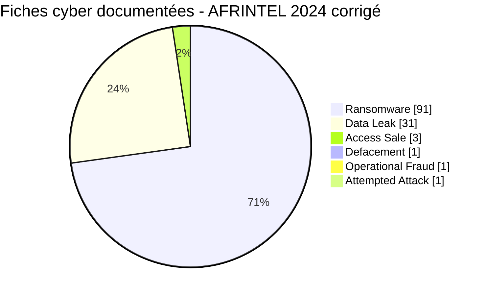
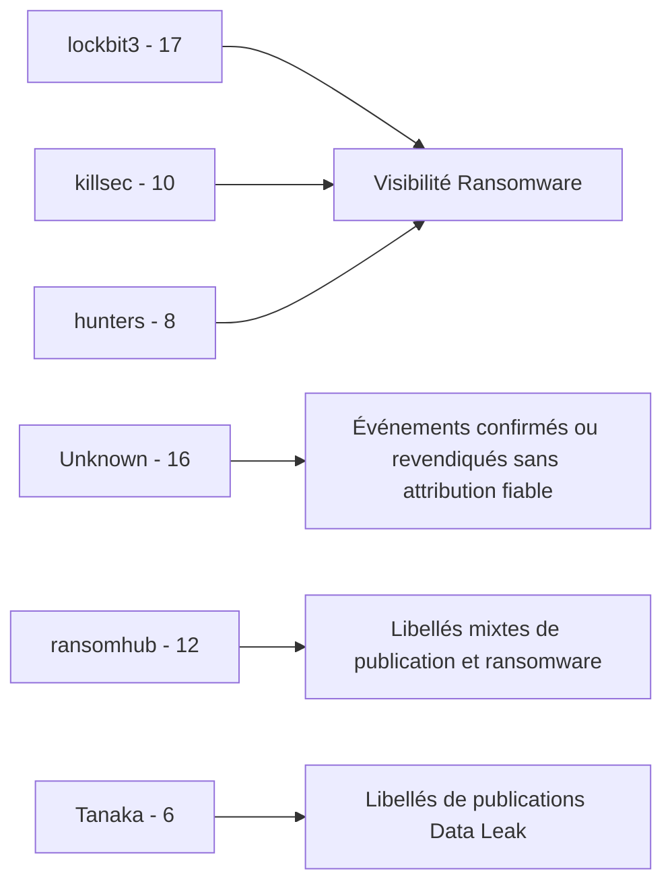
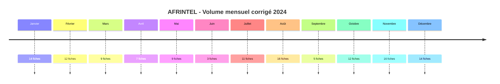

# Rapport CTI annuel AFRINTEL - 2024 - Édition corrigée

👉🏾 [English version](./README.md)

## 1. Résumé exécutif

Le corpus AFRINTEL corrigé de 2024 contient **128 fiches cyber documentées dans 28 pays africains**.

Parmi elles, **127 relèvent de la taxonomie AFRINTEL principale à six types** : **91 Ransomware**, **31 Data Leak**, **3 Access Sale**, **1 Defacement** et **1 Operational Fraud**. Une fiche supplémentaire, **GTBank au Nigeria**, est conservée séparément comme **Attempted Attack confirmée par la victime**, car les éléments disponibles ne permettent pas de la classer dans un type principal sans forcer la preuve.

La correction annuelle fait passer le total du README de 118 à 128 fiches et intègre les 10 dossiers rétrospectifs validés. L'Afrique du Sud reste le pays le plus représenté avec **35 fiches**, devant l'Égypte avec 14 et le Nigeria avec 9. Le corpus annuel corrigé couvre désormais **28 pays**, le Malawi étant ajouté via le dossier rétrospectif du système de passeports.

Les fichiers annuels fournis pour réconciliation étaient eux-mêmes incohérents : le README annonçait 118 incidents alors que le fichier annuel des victimes indiquait 115 fiches. Cette édition corrigée reconstruit donc les statistiques et le corpus annuel directement depuis les douze fichiers mensuels harmonisés au lieu de corriger superficiellement l'un de ces agrégats obsolètes.

L'année reste dominée par le ransomware, mais la maturité des preuves est très inégale. **85 fiches sur 128 restent `Claim - Unverified`**, tandis que les autres vont de l'échantillon publié à la confirmation directe d'une victime ou d'une autorité. Les volumes de publication ne doivent donc pas être interprétés comme 128 compromissions également confirmées.

👉🏾 [Voir le corpus annuel corrigé des victimes](./victims_FR.md)

## 2. Impact de la correction annuelle

| Indicateur | README annuel fourni | 2024 corrigé | Différence |
|---|---:|---:|---:|
| Fiches cyber documentées | 118 | **128** | **+10 (+8,5 %)** |
| Pays | 27 | **28** | **+1 (+3,7 %)** |
| Ransomware | 86 | **91** | **+5 (+5,8 %)** |
| Data Leak | 29 | **31** | **+2 (+6,9 %)** |
| Access Sale | 3 | **3** | Stable |
| Defacement | 0 | **1** | Nouveau |
| Operational Fraud | 0 | **1** | Nouveau |
| Attempted Attack - suivi séparé | 0 | **1** | Nouveau |

Les dix ajouts sont ITAC, Eneo Cameroon, GPAA/GEPF, CIPC, Malawi Passport Issuance System, DPWI, GTBank, SABS, MSEA et NBS. Leur contribution est de **5 Ransomware + 2 Data Leak + 1 Defacement + 1 Operational Fraud + 1 Attempted Attack suivie séparément**.

## 3. Méthodologie

- **Source de vérité :** les douze couples mensuels harmonisés `victims.md` / `victims_FR.md`.
- **Comptage :** une fiche victime mensuelle correspond à une fiche cyber documentée.
- **Taxonomie principale :** Ransomware, Data Leak, Access Sale, DDoS, Defacement, Operational Fraud.
- **Exception de taxonomie :** GTBank reste hors des six types car la banque a confirmé une tentative infructueuse de compromission de son domaine web, et non une violation réussie correspondant à une catégorie principale.
- **Hiérarchie de preuve :** revendication, échantillon publié, publication complète, corroboration, confirmation victime et confirmation gouvernementale restent distinctes.
- **Republications :** les données historiques ou remises en circulation ne sont pas automatiquement converties en nouvelle intrusion.
- **Statistiques pays et secteurs :** recalculées depuis les fiches mensuelles corrigées.
- **Schéma régional :** la convention à six régions du rapport annuel 2024 est conservée, avec une catégorie Océan Indien séparée.
- **Limites :** le corpus mesure la visibilité AFRINTEL et non l'incidence exhaustive des compromissions cyber en Afrique.

## 4. Vue globale

| Indicateur | Valeur corrigée |
|---|---:|
| Fiches cyber documentées | **128** |
| Incidents de la taxonomie principale | **127** |
| Pays | **28** |
| Ransomware | **91 (71,1 % de toutes les fiches)** |
| Data Leak | **31 (24,2 %)** |
| Access Sale | **3 (2,3 %)** |
| Defacement | **1 (0,8 %)** |
| Operational Fraud | **1 (0,8 %)** |
| Attempted Attack - suivi séparé | **1 (0,8 %)** |
| Mois les plus volumineux | **Août et novembre - 16 chacun** |
| Mois le moins volumineux | **Juin - 3** |

### 4.1 Activité mensuelle corrigée

| Mois | Total | Ransomware | Data Leak | Access Sale | Defacement | Operational Fraud | Attempted Attack |
|---|---:|---:|---:|---:|---:|---:|---:|
| Janvier | 14 | 5 | 8 | 1 | 0 | 0 | 0 |
| Février | 12 | 7 | 5 | 0 | 0 | 0 | 0 |
| Mars | 9 | 7 | 2 | 0 | 0 | 0 | 0 |
| Avril | 7 | 5 | 2 | 0 | 0 | 0 | 0 |
| Mai | 9 | 8 | 0 | 0 | 0 | 1 | 0 |
| Juin | 3 | 3 | 0 | 0 | 0 | 0 | 0 |
| Juillet | 11 | 7 | 4 | 0 | 0 | 0 | 0 |
| Août | 16 | 14 | 1 | 0 | 0 | 0 | 1 |
| Septembre | 5 | 4 | 1 | 0 | 0 | 0 | 0 |
| Octobre | 12 | 8 | 4 | 0 | 0 | 0 | 0 |
| Novembre | 16 | 12 | 2 | 2 | 0 | 0 | 0 |
| Décembre | 14 | 11 | 2 | 0 | 1 | 0 | 0 |
| **Total** | **128** | **91** | **31** | **3** | **1** | **1** | **1** |

**Volume mensuel**

| Mois | Fiches | Visuel |
|---|---:|:---|
| Janvier | 14 | ██████████████ |
| Février | 12 | ████████████ |
| Mars | 9 | █████████ |
| Avril | 7 | ███████ |
| Mai | 9 | █████████ |
| Juin | 3 | ███ |
| Juillet | 11 | ███████████ |
| Août | 16 | ████████████████ |
| Septembre | 5 | █████ |
| Octobre | 12 | ████████████ |
| Novembre | 16 | ████████████████ |
| Décembre | 14 | ██████████████ |

## 5. Répartition géographique

### 5.1 Classement par pays

| Pays | Total | Ransomware | Data Leak | Access Sale | Defacement | Operational Fraud | Attempted Attack |
|---|---:|---:|---:|---:|---:|---:|---:|
| 🇿🇦 Afrique du Sud | 35 | 32 | 2 | 0 | 0 | 1 | 0 |
| 🇪🇬 Égypte | 14 | 11 | 3 | 0 | 0 | 0 | 0 |
| 🇳🇬 Nigeria | 9 | 4 | 3 | 0 | 1 | 0 | 1 |
| 🇩🇿 Algérie | 7 | 2 | 5 | 0 | 0 | 0 | 0 |
| 🇹🇳 Tunisie | 6 | 5 | 1 | 0 | 0 | 0 | 0 |
| 🇰🇪 Kenya | 5 | 3 | 2 | 0 | 0 | 0 | 0 |
| 🇲🇦 Maroc | 5 | 1 | 4 | 0 | 0 | 0 | 0 |
| 🇧🇫 Burkina Faso | 4 | 0 | 2 | 2 | 0 | 0 | 0 |
| 🇨🇲 Cameroun | 4 | 3 | 0 | 1 | 0 | 0 | 0 |
| 🇪🇹 Éthiopie | 4 | 1 | 3 | 0 | 0 | 0 | 0 |
| 🇬🇭 Ghana | 4 | 2 | 2 | 0 | 0 | 0 | 0 |
| 🇨🇮 Côte d'Ivoire | 4 | 3 | 1 | 0 | 0 | 0 | 0 |
| 🇳🇦 Namibie | 4 | 4 | 0 | 0 | 0 | 0 | 0 |
| 🇸🇨 Seychelles | 3 | 3 | 0 | 0 | 0 | 0 | 0 |
| 🇿🇼 Zimbabwe | 3 | 3 | 0 | 0 | 0 | 0 | 0 |
| 🇱🇾 Libye | 2 | 2 | 0 | 0 | 0 | 0 | 0 |
| 🇸🇳 Sénégal | 2 | 2 | 0 | 0 | 0 | 0 | 0 |
| 🇸🇩 Soudan | 2 | 1 | 1 | 0 | 0 | 0 | 0 |
| 🇹🇿 Tanzanie | 2 | 2 | 0 | 0 | 0 | 0 | 0 |
| 🇧🇼 Botswana | 1 | 1 | 0 | 0 | 0 | 0 | 0 |
| 🇨🇬 Congo | 1 | 1 | 0 | 0 | 0 | 0 | 0 |
| 🇩🇯 Djibouti | 1 | 1 | 0 | 0 | 0 | 0 | 0 |
| 🇲🇬 Madagascar | 1 | 0 | 1 | 0 | 0 | 0 | 0 |
| 🇲🇼 Malawi | 1 | 1 | 0 | 0 | 0 | 0 | 0 |
| 🇲🇷 Mauritanie | 1 | 1 | 0 | 0 | 0 | 0 | 0 |
| 🇲🇺 Maurice | 1 | 1 | 0 | 0 | 0 | 0 | 0 |
| 🇷🇼 Rwanda | 1 | 0 | 1 | 0 | 0 | 0 | 0 |
| 🇿🇲 Zambie | 1 | 1 | 0 | 0 | 0 | 0 | 0 |
| **Total** | **128** | **91** | **31** | **3** | **1** | **1** | **1** |

L'Afrique du Sud représente **35 fiches (27,3 %)** et **32 Ransomware**, mais son profil annuel corrigé comprend aussi deux Data Leak et un Operational Fraud. L'Égypte reste deuxième avec 14. Le Nigeria passe à 9 après les corrections GTBank et NBS et couvre désormais Ransomware, Data Leak, Defacement et la catégorie Attempted Attack suivie séparément.

### 5.2 Répartition régionale

| Région | Total | Ransomware | Data Leak | Access Sale | Defacement | Operational Fraud | Attempted Attack |
|---|---:|---:|---:|---:|---:|---:|---:|
| Afrique australe | 45 | 42 | 2 | 0 | 0 | 1 | 0 |
| Afrique du Nord | 35 | 22 | 13 | 0 | 0 | 0 | 0 |
| Afrique de l'Ouest | 23 | 11 | 8 | 2 | 1 | 0 | 1 |
| Afrique de l'Est | 15 | 8 | 7 | 0 | 0 | 0 | 0 |
| Océan Indien | 5 | 4 | 1 | 0 | 0 | 0 | 0 |
| Afrique centrale | 5 | 4 | 0 | 1 | 0 | 0 | 0 |
| **Total** | **128** | **91** | **31** | **3** | **1** | **1** | **1** |

L'Afrique australe reste le premier bloc régional avec **45 fiches**, dont 42 Ransomware. L'Afrique du Nord suit avec 35. L'Afrique de l'Ouest compte 23 fiches et constitue, dans ce schéma annuel, la seule région réunissant les deux Access Sale, l'Attempted Attack GTBank et le Defacement NBS.

## 6. Répartition sectorielle

| Secteur | Fiches | Part |
|---|---:|---:|
| Government / Administration | 21 | 16,4 % |
| Finance / Banking | 16 | 12,5 % |
| Manufacturing / Industry | 11 | 8,6 % |
| Professional / Business Services | 11 | 8,6 % |
| Technology / IT | 11 | 8,6 % |
| Education / University | 10 | 7,8 % |
| Healthcare / Medical | 10 | 7,8 % |
| Retail / E-commerce | 9 | 7,0 % |
| Telecommunications | 5 | 3,9 % |
| Energy / Utilities | 4 | 3,1 % |
| Media / Entertainment | 4 | 3,1 % |
| Agriculture / Agribusiness | 3 | 2,3 % |
| Transport / Logistics | 3 | 2,3 % |
| Defense / Security | 2 | 1,6 % |
| Legal / Justice | 2 | 1,6 % |
| Water / Utilities | 2 | 1,6 % |
| Aviation | 1 | 0,8 % |
| Civil Society / NGO | 1 | 0,8 % |
| Construction / Real Estate | 1 | 0,8 % |
| Mining / Extractive Industries | 1 | 0,8 % |
| **Total** | **128** | **100 %** |

**Government / Administration** est le premier secteur harmonisé avec **21 fiches (16,4 %)**, devant Finance / Banking avec 16. Technology / IT, Manufacturing / Industry et Professional / Business Services en comptent chacun 11.

Le total gouvernemental couvre plusieurs types d'incident et plusieurs niveaux de preuve. Il signale donc une forte visibilité du secteur public, et non une campagne technique homogène.

## 7. Acteurs et groupes

### 7.1 Libellés structurés les plus visibles

| Acteur / Groupe | Fiches | Part |
|---|---:|---:|
| lockbit3 | 17 | 13,3 % |
| Unknown | 16 | 12,5 % |
| ransomhub | 12 | 9,4 % |
| killsec | 10 | 7,8 % |
| hunters | 8 | 6,2 % |
| Tanaka | 6 | 4,7 % |
| spacebears | 5 | 3,9 % |
| arcusmedia | 4 | 3,1 % |
| blacksuit | 3 | 2,3 % |
| darkvault | 3 | 2,3 % |
| sarcoma | 3 | 2,3 % |
| funksec | 2 | 1,6 % |
| incransom | 2 | 1,6 % |
| madliberator | 2 | 1,6 % |
| meow | 2 | 1,6 % |

`lockbit3` est le libellé Acteur / Groupe le plus visible avec **17 fiches**. `Unknown` arrive deuxième avec 16, ce qui reflète des dossiers où les preuves de l'incident sont suffisantes mais où aucune attribution d'intrusion défendable n'est disponible. `ransomhub`, `killsec` et `hunters` suivent.

Ces volumes doivent être compris comme les libellés structurés des fiches harmonisées et non comme la preuve d'une infrastructure, d'affiliés ou de chaînes d'intrusion communes à tous les dossiers portant un même nom.

## 8. Maturité des preuves

Le corpus annuel corrigé ne correspond pas à 128 compromissions confirmées.

| Groupe de statuts | Fiches | Part |
|---|---:|---:|
| Claim - Unverified | **85** | **66,4 %** |
| Claim - Data Sample Published | **32** | **25,0 %** |
| Data Fully Published | **1** | **0,8 %** |
| Statuts confirmés par victime/gouvernement ou corroborés | **10** | **7,8 %** |
| **Total** | **128** | **100 %** |

Niveaux de confiance :

| Confiance | Fiches | Part |
|---|---:|---:|
| Low | **86** | **67,2 %** |
| Medium | **21** | **16,4 %** |
| High | **11** | **8,6 %** |
| Very High | **10** | **7,8 %** |
| **Total** | **128** | **100 %** |

Les 10 corrections rétrospectives améliorent la complétude annuelle tout en augmentant le nombre de dossiers soutenus par des confirmations victimes, gouvernementales ou des corroborations autoritatives. Elles ne suppriment pas l'incertitude : Eneo et Malawi conservent des réserves sur la classification ransomware, MSEA reste corroboré sans confirmation directe de la victime et GTBank reste une tentative infructueuse.

## 9. Comparaison H1 / H2

| Indicateur | H1 2024 | H2 2024 | Écart absolu | Évolution |
|---|---:|---:|---:|---:|
| Fiches cyber documentées | 54 | **74** | +20 | **+37,0 %** |
| Incidents de la taxonomie principale | 54 | **73** | +19 | **+35,2 %** |
| Ransomware | 35 | **56** | +21 | **+60,0 %** |
| Data Leak | 17 | **14** | -3 | **-17,6 %** |
| Access Sale | 1 | **2** | +1 | **+100,0 %** |
| Defacement | 0 | **1** | +1 | Nouveau |
| Operational Fraud | 1 | **0** | -1 | **-100,0 %** |
| Attempted Attack - suivi séparé | 0 | **1** | +1 | Nouveau |
| Moyenne mensuelle - toutes fiches | 9,0 | **12,3** | +3,3 | **+37,0 %** |

Le second semestre est plus volumineux principalement parce que la visibilité des publications Ransomware augmente fortement, de 35 à 56 fiches. Les Data Leak évoluent dans le sens inverse, de 17 à 14. La hausse du H2 ne doit donc pas être décrite comme une progression uniforme de tous les types d'incident.

## 10. Corrections rétrospectives intégrées

| Mois | Victime | Classification | Position de preuve |
|---|---|---|---|
| Janvier | ITAC - Afrique du Sud | Ransomware | Victim Confirmed |
| Janvier | Eneo Cameroon | Ransomware | Victim Confirmed ; classification ransomware non vérifiée |
| Février | GPAA / GEPF - Afrique du Sud | Ransomware | Victim Confirmed + Threat Actor Claim |
| Février | CIPC - Afrique du Sud | Data Leak | Victim Confirmed ; effets secondaires défacement/extorsion conservés |
| Février | Malawi Passport System | Ransomware | Government Confirmed ; détails techniques contestés |
| Mai | DPWI - Afrique du Sud | Operational Fraud | Government Confirmed - Forensic Investigation |
| Août | GTBank - Nigeria | Attempted Attack | Victim Confirmed ; tentative infructueuse, suivie hors taxonomie principale |
| Novembre | SABS - Afrique du Sud | Ransomware | Government Confirmed ; chiffrement et perturbation majeure |
| Décembre | MSEA - Kenya | Data Leak | Corroborated ; aucune confirmation directe de la victime retrouvée |
| Décembre | NBS - Nigeria | Defacement | Victim Confirmed ; aucun vol confirmé des données backend |

## 11. Interprétation CTI détaillée

### 11.1 Ransomware

Le Ransomware représente **91 fiches sur 128 (71,1 %)** et reste la catégorie annuelle dominante. L'Afrique du Sud concentre à elle seule 32 fiches ransomware, tandis que `lockbit3` est le libellé ransomware le plus visible.

La maturité des preuves s'étend toutefois de simples listings de leak sites à des incidents opérationnels confirmés par des autorités. SABS confirme un chiffrement réel des systèmes et une perturbation prolongée, alors que de nombreuses autres fiches restent des listings à faible confiance sans DFIR public. Visibilité ransomware et impact ransomware confirmé ne sont donc pas le même indicateur.

### 11.2 Data Leak

L'année corrigée contient **31 Data Leak**. Leur maturité va d'échantillons visibles à la publication complète ou à des corroborations ultérieures. Plusieurs dossiers de juillet correspondent aussi à la remise en circulation de datasets historiques, ce qui démontre que la date de découverte ou de republication n'est pas nécessairement la date de compromission.

Le corpus Data Leak soutient des analyses de risque autour de l'exposition d'identités, du phishing, de la fraude et de l'exploitation secondaire, mais les volumes ne démontrent pas une méthode d'acquisition commune.

### 11.3 Access Sale

Trois Access Sale restent présents : un dossier camerounais et deux offres concernant des systèmes publics de santé au Burkina Faso. Un accès proposé à la vente ne prouve ni qu'il est encore valide, ni qu'il a été acheté, ni qu'il a été exploité. Les deux dossiers burkinabè restent séparés car les éléments fournis ne démontrent pas qu'ils concernent le même système sous-jacent.

### 11.4 Operational Fraud

DPWI reste l'unique Operational Fraud. Cette classification permet de conserver une enquête gouvernementale confirmée sur un vol financier facilité par des moyens cyber sans inventer un ransomware ou un malware lorsque le mécanisme technique n'était pas résolu.

### 11.5 Defacement

NBS introduit le Defacement dans la taxonomie annuelle corrigée. Le piratage du site et la perturbation du service sont confirmés, mais aucun vol des données statistiques backend n'est établi. Ce cas illustre l'importance de séparer les impacts sur l'intégrité et la disponibilité d'une atteinte à la confidentialité.

### 11.6 Attempted Attack suivie séparément

GTBank est volontairement exclu de la taxonomie principale à six types. La banque a confirmé une tentative infructueuse de compromission de son domaine web et a indiqué qu'aucune donnée client n'avait été compromise. Le compter comme une violation réussie réduirait la précision du corpus au lieu de l'améliorer.

## 12. Cartographie MITRE ATT&CK contextuelle

| Qualification | Technique | Utilisation défensive |
|---|---|---|
| Observé dans un cas confirmé spécifique | T1486 - Data Encrypted for Impact | Le chiffrement est officiellement confirmé pour SABS, pas pour chaque fiche ransomware. |
| Préventif | T1490 - Inhibit System Recovery | Surveiller l'altération des mécanismes de reprise autour des incidents ransomware. |
| Conditionnel | T1078 - Valid Accounts | Examiner l'abus d'identité lorsque l'exposition de comptes ou d'accès est étayée, sans le généraliser. |
| Contextuel | T1213 - Data from Information Repositories | Pertinent pour les expositions de bases structurées et de dépôts documentaires. |
| Préventif | T1567 - Exfiltration Over Web Service | Surveiller les transferts sortants inhabituels ; le canal d'exfiltration n'est généralement pas établi. |

## 13. Recommandations stratégiques et SOC

- Maintenir une distinction stricte entre publication criminelle, échantillon, confirmation victime, confirmation gouvernementale et corroboration ultérieure.
- Prioriser la résilience ransomware en Afrique australe sans supposer que chaque listing correspond à un chiffrement confirmé.
- Pour Government / Administration, combiner durcissement des identités, surveillance de l'intégrité web, contrôles de fraude et continuité, car l'exposition annuelle couvre plusieurs types d'incident.
- Pour Finance / Banking, prioriser MFA résistante au phishing, détection de fraude transactionnelle, revue des accès privilégiés et surveillance des éléments de comptes exposés.
- Pour les datasets historiques ou remis en circulation, préserver les dates de fuite d'origine et vérifier la validité actuelle des identifiants avant de parler de nouvelle intrusion.
- Pour les Access Sale, valider l'accès en interne avant de conclure qu'une compromission a été consommée ou exploitée.
- Conserver le suivi des confirmations victimes et gouvernementales comme workflow d'enrichissement prioritaire pour les comparaisons avec 2025.

## 14. Chronologie annuelle

## 15. Conclusion

Le corpus AFRINTEL 2024 corrigé contient **128 fiches cyber documentées dans 28 pays africains**, remplaçant l'agrégat annuel obsolète de 118 fiches ainsi que la compilation annuelle incohérente de 115 fiches. Cette correction ne constitue pas un simple ajustement statistique. Elle modifie le volume annuel, la taxonomie, la géographie, l'exposition sectorielle, la maturité des preuves et l'équilibre entre les deux semestres.

Le Ransomware reste la catégorie dominante avec **91 fiches**, mais l'année corrigée est analytiquement plus large qu'un récit centré uniquement sur le ransomware. L'ajout de CIPC et MSEA porte les Data Leak à 31, DPWI introduit Operational Fraud, NBS introduit Defacement et GTBank reste une tentative infructueuse suivie hors taxonomie principale. Ces distinctions décrivent plus fidèlement la réalité des événements que le fait de forcer chaque incident cyber dans une catégorie de violation réussie ou de malware.

La concentration géographique reste forte. L'Afrique du Sud représente **35 fiches, soit 27,3 % du corpus annuel**, dont 32 Ransomware, deux Data Leak et un Operational Fraud. L'Égypte reste deuxième avec 14 fiches, tandis que le Nigeria passe à neuf et présente désormais quatre profils analytiques différents : Ransomware, Data Leak, Defacement et tentative de compromission du domaine web. Cette diversité montre pourquoi le simple total par pays ne suffit pas pour déterminer les priorités défensives.

La lecture sectorielle corrigée place **Government / Administration en première position avec 21 fiches**, devant Finance / Banking avec 16. La concentration du secteur public est réelle dans le corpus AFRINTEL, mais elle couvre des publications ransomware, des expositions de données, une fraude opérationnelle et une compromission confirmée de site web. Elle ne soutient donc pas l'hypothèse d'une campagne technique unique. Son implication défensive est plus large : les institutions publiques doivent simultanément renforcer identité, sécurité web, continuité, protection des données et détection de fraude.

La conclusion annuelle la plus importante concerne la **maturité des preuves**. Deux tiers des fiches restent `Claim - Unverified`. Un quart supplémentaire dispose d'un échantillon publié, alors qu'une proportion plus réduite repose sur une confirmation victime, une confirmation gouvernementale, une publication complète ou une corroboration autoritative ultérieure. Le corpus 2024 mesure donc une **visibilité cyber documentée avec des preuves graduées**, et non 128 intrusions également confirmées. Cette distinction doit rester visible dans toute statistique dérivée.

Les corrections rétrospectives démontrent concrètement la valeur de ce modèle. SABS ajoute un événement ransomware confirmé par le gouvernement avec chiffrement réel et perturbation opérationnelle. NBS ajoute un défacement confirmé sans preuve de vol des données backend. MSEA ajoute une violation fortement corroborée sans notification directe de la victime dans le jeu de sources examiné. GTBank ajoute une tentative confirmée mais infructueuse. Eneo et Malawi conservent des réserves techniques sur leur classification ransomware au lieu de présenter comme certitude des mécanismes contestés. Chaque correction améliore la complétude précisément parce qu'elle conserve ce qui demeure inconnu.

La comparaison H1/H2 devient également plus claire. Le second semestre contient **74 fiches contre 54 au H1**, soit une hausse de 37,0 %, principalement portée par le Ransomware qui passe de 35 à 56. Les Data Leak évoluent en sens inverse, de 17 à 14. La trajectoire annuelle reflète donc une évolution de la composition autant qu'une évolution du volume. Elle ne doit pas être transformée en affirmation selon laquelle les intrusions cyber réussies en Afrique auraient augmenté de 37 %.

La lecture la plus défendable d'AFRINTEL 2024 est donc celle d'une année marquée par **une forte visibilité des publications ransomware, une concentration sud-africaine importante, une circulation persistante de données exposées, une visibilité croissante du secteur public et une maturité de preuve très inégale**. La valeur opérationnelle du corpus annuel corrigé réside précisément dans la séparation de ces dimensions au lieu de les réduire à un nombre unique d'attaques.

Cette édition corrigée 2024 constitue désormais la base appropriée pour une comparaison rigoureuse **2024 vs 2025**. Toute analyse annuelle comparative devra utiliser le **corpus corrigé de 128 fiches**, conserver l'exception taxonomique GTBank et procéder à un remappage explicite des conventions régionales ou sectorielles avant de présenter des écarts stricts.

**AFRINTEL** - TLP:CLEAR
