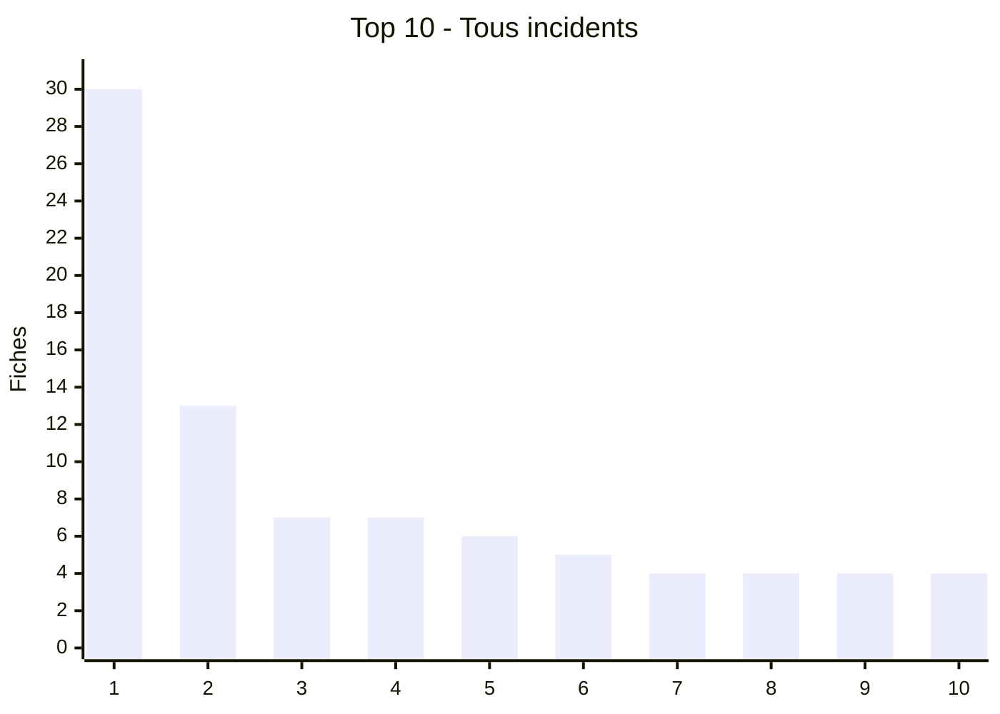
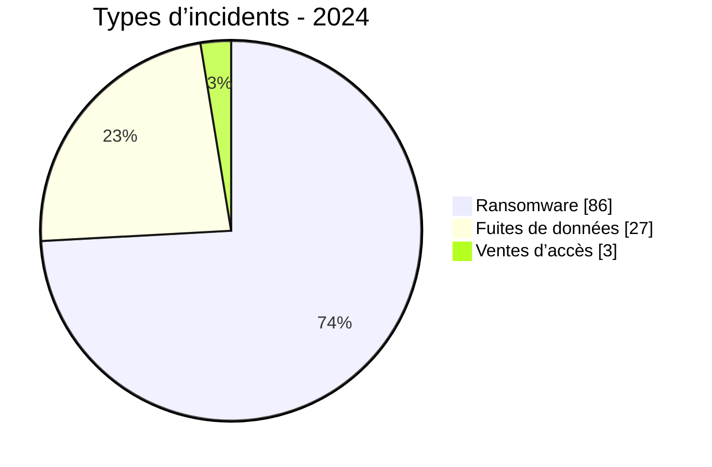
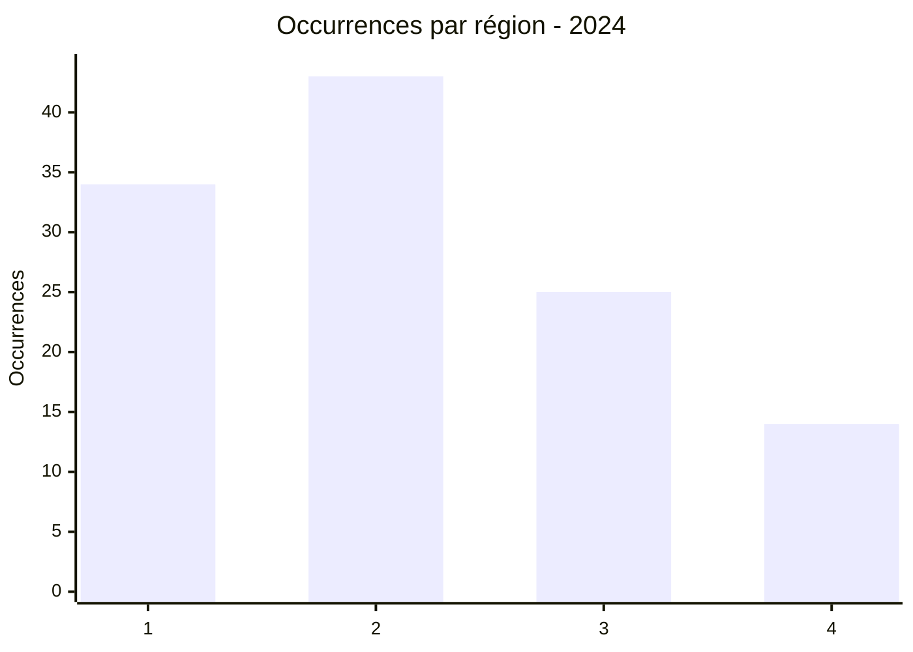
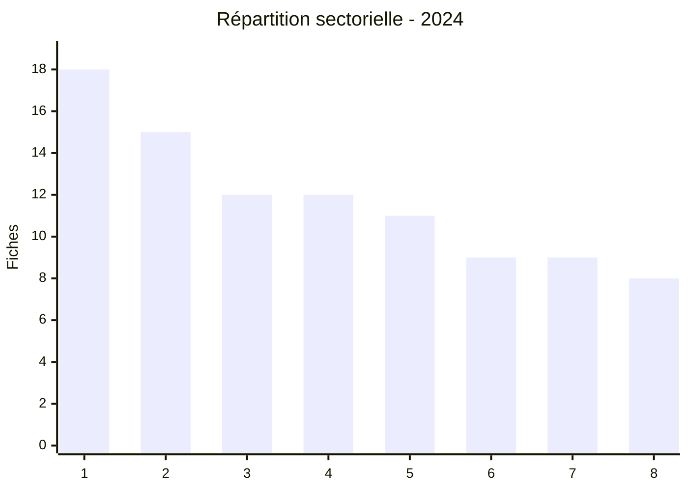
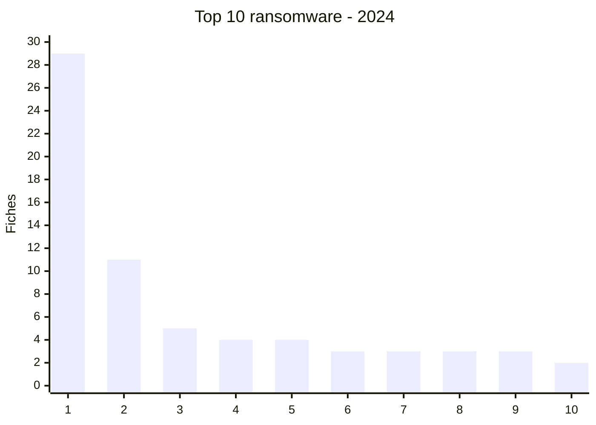
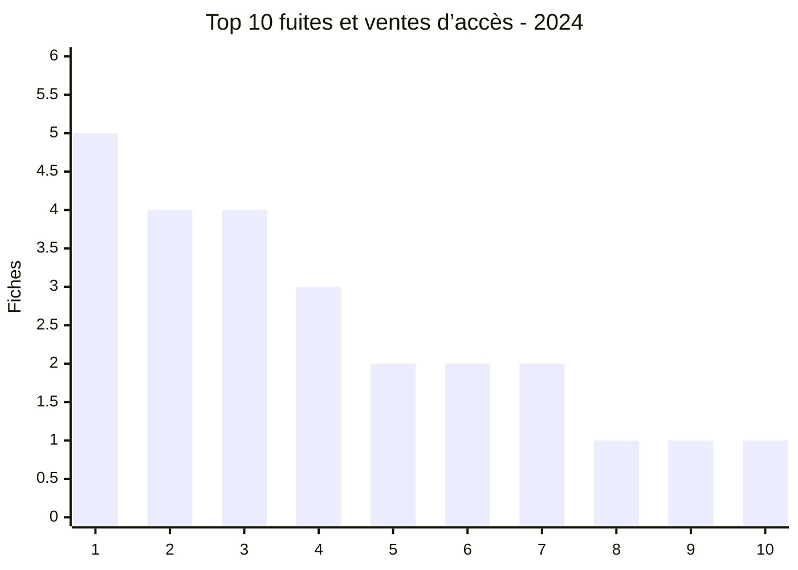
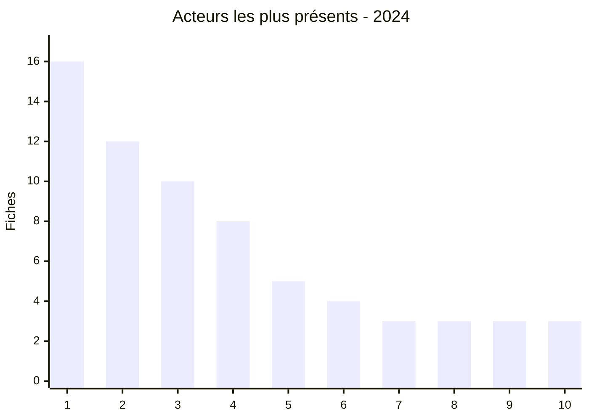

# Rapport CTI annuel AFRINTEL - 2024

👉🏾 [Version anglaise](./README.md)

  

---
## 1. Résumé exécutif

AFRINTEL a recensé **116 fiches** en 2024 : **86 revendications ransomware (74,1 %)**, **27 fuites de données (23,3 %)**, **3 ventes d’accès (2,6 %)** et **aucun défacement**.

Le signal le plus fort de l’année est la domination du ransomware, avec près de trois fiches sur quatre. L’**Afrique du Sud concentre 30 fiches**, dont **29 liées au ransomware**, très loin devant l’Égypte (**13**), l’Algérie et le Nigeria (**7 chacun**). Cette concentration doit être lue comme une tendance des publications observées par AFRINTEL, et non comme une mesure exhaustive de toutes les compromissions sur le continent.

Les fuites de données et les ventes d’accès présentent un profil différent. Elles sont davantage réparties entre l’Algérie, le Burkina Faso, le Maroc, le Nigeria, l’Égypte et plusieurs autres pays. Les publications concernent notamment des environnements administratifs, financiers, éducatifs, médicaux et commerciaux. Elles exposent un risque qui dépasse la seule indisponibilité des systèmes : fraude, hameçonnage ciblé, réutilisation d’identifiants et pression sur les organisations concernées.

Sur le plan sectoriel, les technologies et l’informatique (**18 fiches**), la finance et la banque (**15**), l’éducation (**12**) et le gouvernement (**12**) arrivent en tête. Les acteurs les plus visibles sont **lockbit3 (16 fiches)**, **ransomhub (12)**, **killsec (10)** et **hunters (8)**. Leur présence répétée justifie une veille renforcée, mais ne suffit pas à démontrer une campagne commune ni une attribution opérationnelle.

L’enjeu central pour les équipes CTI et SOC en 2024 est donc double : réduire l’impact des attaques ransomware, tout en traitant les fuites et ventes d’accès comme des signaux précurseurs ou des vecteurs de compromission à part entière. La qualification des revendications, la détection des republications et la mesure réelle des volumes annoncés restent indispensables avant toute conclusion.

## 2. Méthodologie

Les douze fichiers mensuels sont la source de vérité. Une fiche correspond à une publication ou une revendication documentée. Les publications non confirmées restent présentées comme des revendications.

## 3. Vue globale

| Indicateur | Valeur |
| :--- | ---: |
| Fiches | **116** |
| Ransomware | **86 (74,1%)** |
| Fuites de données | **27 (23,3%)** |
| Ventes d’accès | **3 (2,6%)** |

### Classement par pays

| Rang | Pays | Fiches | Barre |
| :--- | ---: | ---: | ---: |
| 1 | 🇿🇦 Afrique du Sud | 30 | ██████████████████████████████ |
| 2 | 🇪🇬 Égypte | 13 | █████████████ |
| 3 | 🇩🇿 Algérie | 7 | ███████ |
| 4 | 🇳🇬 Nigeria | 7 | ███████ |
| 5 | 🇹🇳 Tunisie | 6 | ██████ |
| 6 | 🇲🇦 Maroc | 5 | █████ |
| 7 | 🇧🇫 Burkina Faso | 4 | ████ |
| 8 | 🇬🇭 Ghana | 4 | ████ |
| 9 | 🇨🇮 Côte d’Ivoire | 4 | ████ |
| 10 | 🇰🇪 Kenya | 4 | ████ |
| 11 | 🇳🇦 Namibie | 4 | ████ |
| 12 | 🇨🇲 Cameroun | 3 | ███ |
| 13 | 🇪🇹 Éthiopie | 3 | ███ |
| 14 | 🇸🇨 Seychelles | 3 | ███ |
| 15 | 🇿🇼 Zimbabwe | 3 | ███ |
| 16 | 🇱🇾 Libye | 2 | ██ |
| 17 | 🇸🇳 Sénégal | 2 | ██ |
| 18 | 🇸🇩 Soudan | 2 | ██ |
| 19 | 🇹🇿 Tanzanie | 2 | ██ |
| 20 | 🇧🇼 Botswana | 1 | █ |
| 21 | 🇨🇬 Congo | 1 | █ |
| 22 | 🇩🇯 Djibouti | 1 | █ |
| 23 | 🇲🇬 Madagascar | 1 | █ |
| 24 | 🇲🇷 Mauritanie | 1 | █ |
| 25 | 🇲🇺 Maurice | 1 | █ |
| 26 | 🇷🇼 Rwanda | 1 | █ |
| 27 | 🇿🇲 Zambie | 1 | █ |

### Répartition par type d’incident

| Type | Fiches | Part |
| :--- | ---: | ---: |
| Ransomware | 86 | 74,1% |
| Fuite de données | 27 | 23,3% |
| Vente d’accès | 3 | 2,6% |
| **Total** | **116** | **100%** |

### Comparaison ransomware, fuites et ventes d’accès par pays

| Pays | Ransomware | Fuites / accès | Total | Distribution |
| :--- | ---: | ---: | ---: | ---: |
| 🇿🇦 Afrique du Sud | 29 | 1 | 30 | 🟧🟧🟧🟧🟧🟧🟧🟧🟧🟧🟧🟧🟧🟧🟧🟧🟧🟧🟧🟧🟧🟧🟧🟧🟧🟧🟧🟧🟧 🟦 |
| 🇪🇬 Égypte | 11 | 2 | 13 | 🟧🟧🟧🟧🟧🟧🟧🟧🟧🟧🟧 🟦🟦 |
| 🇩🇿 Algérie | 2 | 5 | 7 | 🟧🟧 🟦🟦🟦🟦🟦 |
| 🇳🇬 Nigeria | 4 | 3 | 7 | 🟧🟧🟧🟧 🟦🟦🟦 |
| 🇹🇳 Tunisie | 5 | 1 | 6 | 🟧🟧🟧🟧🟧 🟦 |
| 🇲🇦 Maroc | 1 | 4 | 5 | 🟧 🟦🟦🟦🟦 |
| 🇧🇫 Burkina Faso | 0 | 4 | 4 |  🟦🟦🟦🟦 |
| 🇬🇭 Ghana | 2 | 2 | 4 | 🟧🟧 🟦🟦 |
| 🇨🇮 Côte d’Ivoire | 3 | 1 | 4 | 🟧🟧🟧 🟦 |
| 🇰🇪 Kenya | 3 | 1 | 4 | 🟧🟧🟧 🟦 |
| 🇳🇦 Namibie | 4 | 0 | 4 | 🟧🟧🟧🟧 |
| 🇨🇲 Cameroun | 2 | 1 | 3 | 🟧🟧 🟦 |
| 🇪🇹 Éthiopie | 1 | 2 | 3 | 🟧 🟦🟦 |
| 🇸🇨 Seychelles | 3 | 0 | 3 | 🟧🟧🟧 |
| 🇿🇼 Zimbabwe | 3 | 0 | 3 | 🟧🟧🟧 |
| 🇱🇾 Libye | 2 | 0 | 2 | 🟧🟧 |
| 🇸🇳 Sénégal | 2 | 0 | 2 | 🟧🟧 |
| 🇸🇩 Soudan | 1 | 1 | 2 | 🟧 🟦 |
| 🇹🇿 Tanzanie | 2 | 0 | 2 | 🟧🟧 |
| 🇧🇼 Botswana | 1 | 0 | 1 | 🟧 |
| 🇨🇬 Congo | 1 | 0 | 1 | 🟧 |
| 🇩🇯 Djibouti | 1 | 0 | 1 | 🟧 |
| 🇲🇬 Madagascar | 0 | 1 | 1 |  🟦 |
| 🇲🇷 Mauritanie | 1 | 0 | 1 | 🟧 |
| 🇲🇺 Maurice | 1 | 0 | 1 | 🟧 |
| 🇷🇼 Rwanda | 0 | 1 | 1 |  🟦 |
| 🇿🇲 Zambie | 1 | 0 | 1 | 🟧 |

### Répartition géographique par région

| Région | Occurrences | Ransomware | Fuites / accès | Distribution |
| :--- | ---: | ---: | ---: | ---: |
| Afrique du Nord | 34 | 22 | 12 | 🟧🟧🟧🟧🟧 🟦🟦🟦 |
| Afrique australe | 43 | 42 | 1 | 🟧🟧🟧🟧🟧🟧🟧🟧🟧🟧 🟦 |
| Afrique de l’Ouest et centrale | 25 | 14 | 11 | 🟧🟧🟧 🟦🟦🟦 |
| Afrique de l’Est | 14 | 8 | 6 | 🟧🟧 🟦🟦 |

Légende : 1 = Afrique du Nord; 2 = Afrique australe; 3 = Afrique de l’Ouest et centrale; 4 = Afrique de l’Est

### Répartition sectorielle

| Secteur | Fiches | Part | Barre |
| :--- | ---: | ---: | ---: |
| Technologies / informatique | 18 | 15,5% | ██████████ |
| Finance / banque | 15 | 12,9% | ████████ |
| Éducation / universités | 12 | 10,3% | ███████ |
| Gouvernement / administration | 12 | 10,3% | ███████ |
| Commerce / e-commerce | 11 | 9,5% | ██████ |
| Santé / médical | 9 | 7,8% | █████ |
| Industrie / fabrication | 9 | 7,8% | █████ |
| Services professionnels | 8 | 6,9% | ████ |
| Énergie / services publics | 5 | 4,3% | ███ |
| Agriculture / agro-industrie | 3 | 2,6% | ██ |
| Construction / immobilier | 3 | 2,6% | ██ |
| Médias / divertissement | 3 | 2,6% | ██ |
| Transport / logistique | 3 | 2,6% | ██ |
| Juridique / justice | 2 | 1,7% | █ |
| Société civile / ONG | 1 | 0,9% | █ |
| Défense / sécurité | 1 | 0,9% | █ |
| Mines | 1 | 0,9% | █ |

Légende : 1 = Technologies; 2 = Finance; 3 = Éducation; 4 = Gouvernement; 5 = Commerce; 6 = Santé; 7 = Industrie; 8 = Services professionnels

### Graphiques par type d’incident

Légende: 1 = Afrique du Sud; 2 = Égypte; 3 = Tunisie; 4 = Namibie; 5 = Nigeria; 6 = Côte d’Ivoire; 7 = Kenya; 8 = Seychelles; 9 = Zimbabwe; 10 = Algérie

Légende: 1 = Algérie; 2 = Burkina Faso; 3 = Maroc; 4 = Nigeria; 5 = Égypte; 6 = Éthiopie; 7 = Ghana; 8 = Cameroun; 9 = Côte d’Ivoire; 10 = Kenya

## 4. Analyse détaillée par type d’incident

Les revendications ransomware représentent **86 fiches**, soit **74,1 %** du corpus. Elles sont fortement concentrées en Afrique du Sud, qui compte **29 fiches ransomware**, tandis que l’Égypte arrive ensuite avec **11**. Les fuites de données et ventes d’accès représentent **30 fiches** au total. Elles sont moins concentrées géographiquement et couvrent notamment des données administratives, financières, médicales, éducatives et commerciales. Cette différence de répartition impose de distinguer les mesures de résilience contre le chiffrement des actions de prévention de l’exfiltration, de la fraude et de la réutilisation des accès.

## 5. Impact sectoriel

Les secteurs technologique et informatique (**18 fiches**), financier et bancaire (**15**), éducatif (**12**) et gouvernemental (**12**) regroupent les volumes les plus élevés. Cette répartition montre que le risque ne se limite pas aux administrations : les prestataires technologiques, les établissements financiers et les acteurs de l’éducation constituent également des surfaces d’exposition importantes. Les données publiées ou revendiquées peuvent combiner informations professionnelles, données personnelles, documents administratifs et éléments utiles à des campagnes de fraude.

## 6. Profil des acteurs et évaluation du risque

| Acteur / Groupe | Fiches | Activité |
| :--- | ---: | ---: |
| lockbit3 | 16 | ██████████ |
| ransomhub | 12 | ████████ |
| killsec | 10 | ██████ |
| hunters | 8 | █████ |
| spacebears | 5 | ███ |
| arcusmedia | 4 | ██ |
| Tanaka, publication on an underground forum | 3 | ██ |
| blacksuit | 3 | ██ |
| Addka72424, repost of an original post attributed to FriendlyChemist, published on a cybercriminal forum | 3 | ██ |
| darkvault | 3 | ██ |

| Pays | Niveau |
| :--- | ---: |
| 🇿🇦 Afrique du Sud | 🔴 Élevé |
| 🇪🇬 Égypte | 🔴 Élevé |
| 🇩🇿 Algérie | 🔴 Élevé |
| 🇳🇬 Nigeria | 🔴 Élevé |
| 🇹🇳 Tunisie | 🔴 Élevé |

### Graphique des acteurs les plus présents

Légende: 1 = lockbit3; 2 = ransomhub; 3 = killsec; 4 = hunters; 5 = spacebears; 6 = arcusmedia; 7 = Tanaka, publication on an underground forum; 8 = blacksuit; 9 = Addka72424, repost of an original post attributed to FriendlyChemist, published on a cybercriminal forum; 10 = darkvault

## 7. Tendances et lacunes de renseignement

Les tendances sont suffisamment nettes pour prioriser la défense, mais plusieurs limites doivent rester visibles. Les publications étudiées ne permettent pas toujours de confirmer l’intrusion, la taille réelle des données ou la date exacte de compromission. Les doubles revendications et les republications peuvent aussi gonfler artificiellement la perception d’une campagne. La priorité CTI consiste donc à relier les revendications aux journaux EDR, IAM, VPN, messagerie, proxy et sauvegardes, puis à comparer les échantillons sans diffuser de données personnelles.

## 8. Cartographie MITRE ATT&CK contextuelle

| Phase | Technique | Contexte |
| :--- | ---: | ---: |
| Impact | T1486 - Data Encrypted for Impact | Ransomware |
| Exfiltration | T1567 - Exfiltration Over Web Service | Leaks and extortion |
| Credential access | T1078 - Valid Accounts | Access claims |

## 9. Recommandations

- Vérifier les revendications avec les journaux, EDR, IAM et sauvegardes.
- Renforcer MFA, segmentation, sauvegardes hors ligne et rotation des secrets.

## 10. Recommandations SOC et tactiques

- Corréler EDR, VPN, IAM, DNS, proxy, WAF et journaux applicatifs.

## 11. Recommandations stratégiques

- Maintenir l’inventaire des actifs et tester les plans de réponse et de restauration.

## 12. Conclusion

L’année 2024 confirme que le paysage cyber africain combine une pression ransomware très visible et une circulation plus diffuse de données et d’accès exposés. Les chiffres présentés décrivent les publications observées par AFRINTEL ; ils servent à orienter la veille, la validation technique et les priorités de défense, sans transformer une revendication en compromission confirmée.

**AFRINTEL** - TLP:CLEAR
