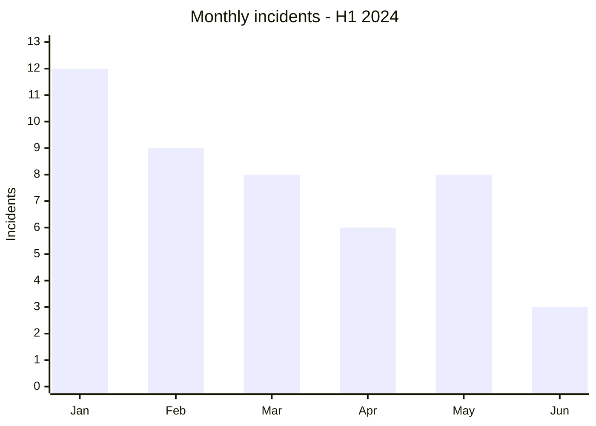
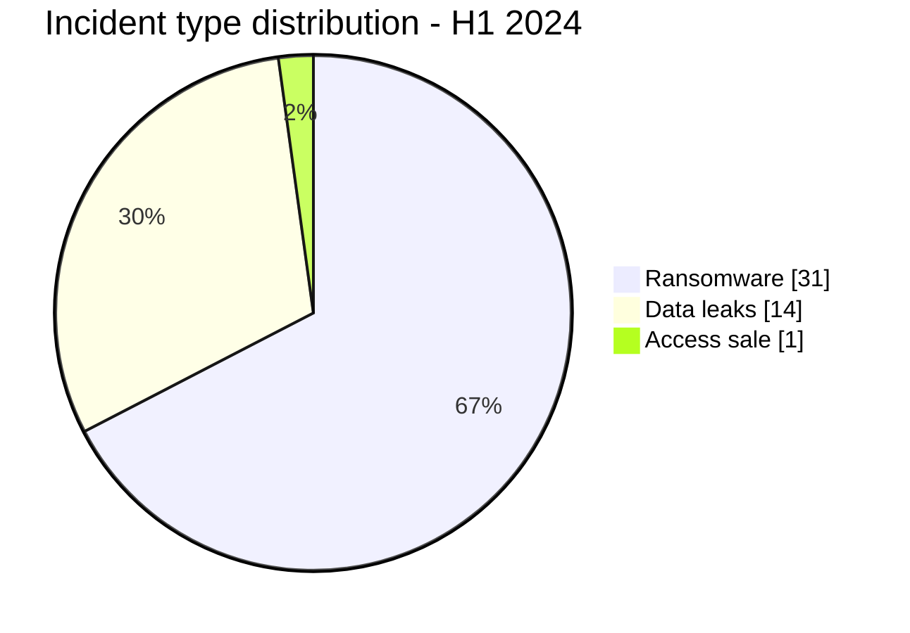

# AFRINTEL CTI Report - First Half of 2024

👉🏾 [Version française](./README_H1_FR.md)

## 1. Executive summary

AFRINTEL documented **46 incidents across 18 countries** from January through June 2024: **31 ransomware claims**, **14 data leaks**, and **1 access sale**. South Africa accounts for 13 incidents, all classified as ransomware. Egypt follows with eight incidents, then Côte d’Ivoire and Morocco with three each.

The semester does not follow a linear path. January reaches 12 incidents, whereas June has only three. This decline in observed volume does not demonstrate an equivalent reduction in risk: it may reflect source activity, publication delays, and collection limits. The strongest signal remains the concentration of ransomware publications in Southern Africa and the broader distribution of leaks across North and West Africa.

## 2. Methodology

This assessment aggregates the monthly [victims.md](./01-january/victims.md) files from January through June and their synchronised French versions. Ransomware, leaks, access sales, and defacement are counted separately. A repost remains a collection event; it is not treated as a newly dated intrusion unless evidence supports that conclusion.

The dataset describes publications observed by AFRINTEL, not all cyberattacks on the continent. Technical conclusions remain limited in the absence of public DFIR reporting or victim telemetry.

## 3. Global overview

| Indicator | Value |
|---|---:|
| Incidents / Countries | **46 / 18** |
| Ransomware | **31 (67.4%)** |
| Data leaks | **14 (30.4%)** |
| Access sales / Defacement | **1 (2.2%) / 0** |

### Monthly activity

| Month | Total | Ransomware | Leak | Access sale |
|---|---:|---:|---:|---:|
| January | 12 | 3 | 8 | 1 |
| February | 9 | 5 | 4 | 0 |
| March | 8 | 7 | 1 | 0 |
| April | 6 | 5 | 1 | 0 |
| May | 8 | 8 | 0 | 0 |
| June | 3 | 3 | 0 | 0 |
| **Total** | **46** | **31** | **14** | **1** |

### Country ranking

| Country | Incidents | Bar |
|---|---:|---|
| 🇿🇦 South Africa | 13 | █████████████ |
| 🇪🇬 Egypt | 8 | ████████ |
| 🇨🇮 Côte d’Ivoire | 3 | ███ |
| 🇲🇦 Morocco | 3 | ███ |
| 🇧🇫 Burkina Faso | 2 | ██ |
| 🇬🇭 Ghana | 2 | ██ |
| 🇳🇦 Namibia | 2 | ██ |
| 🇳🇬 Nigeria | 2 | ██ |
| 🇹🇳 Tunisia | 2 | ██ |
| 🇩🇿 Algeria | 1 | █ |
| 🇨🇲 Cameroon | 1 | █ |
| 🇨🇬 Congo | 1 | █ |
| 🇪🇹 Ethiopia | 1 | █ |
| 🇰🇪 Kenya | 1 | █ |
| 🇱🇾 Libya | 1 | █ |
| 🇷🇼 Rwanda | 1 | █ |
| 🇸🇳 Senegal | 1 | █ |
| 🇸🇨 Seychelles | 1 | █ |
| **Total** | **46** | |

### Regional distribution

| Region | Total | Ransomware | Leak | Access sale |
|---|---:|---:|---:|---:|
| Southern Africa | 15 | 15 | 0 | 0 |
| North Africa | 15 | 10 | 5 | 0 |
| West Africa | 10 | 4 | 6 | 0 |
| East Africa | 3 | 0 | 3 | 0 |
| Central Africa | 2 | 1 | 0 | 1 |
| Indian Ocean | 1 | 1 | 0 | 0 |
| **Total** | **46** | **31** | **14** | **1** |

### Normalised sector distribution

| Sector | Incidents | Share |
|---|---:|---:|
| Government / Administration | 7 | 15.2% |
| Finance / Banking | 6 | 13.0% |
| Technology / IT | 5 | 10.9% |
| Manufacturing / Industry | 4 | 8.7% |
| Professional / Business Services | 4 | 8.7% |
| Retail / E-commerce | 4 | 8.7% |
| Education / University | 3 | 6.5% |
| Healthcare / Medical | 3 | 6.5% |
| Media / Entertainment | 3 | 6.5% |
| Oil & Energy | 2 | 4.3% |
| Agriculture / Agribusiness | 1 | 2.2% |
| Construction / Real Estate | 1 | 2.2% |
| Water / Utilities | 1 | 2.2% |
| Legal / Justice | 1 | 2.2% |
| Civil Society / NGO | 1 | 2.2% |
| **Total** | **46** | **100%** |

### Most visible actors

| Actor or source label | Incidents |
|---|---:|
| LockBit3 | 13 |
| Hunters | 4 |
| RansomHub | 4 |
| Tanaka - underground-forum publication | 3 |
| ArcusMedia | 2 |
| SpaceBears | 2 |

## 4. Detailed analysis by incident type

### 4.1 Ransomware

The 31 ransomware publications account for 67.4% of the dataset. South Africa accounts for 13, and LockBit3 also accounts for 13 across the semester. The matching totals do not mean that every South African case is attributed to LockBit3 or that the incidents form one campaign. Public sources mainly document victim listings, with little evidence concerning initial access or internal operations.

### 4.2 Data leaks and access sale

The 14 leaks are more widely distributed across North, West, and East Africa. The sole access sale involves Cameroon in January. These publications may expose recent, old, or reposted data; publication date alone cannot date a compromise.

## 5. Sectoral impact

Government leads with seven incidents, followed by finance with six. Technology, manufacturing, professional services, and retail form a second recurring group. Risks range from disruption to fraud and targeted phishing, but must be assessed case by case against the available evidence.

## 6. Threat actor profile and risk assessment

| Scope | Level | Rationale |
|---|---|---|
| 🇿🇦 South Africa | 🔴 High | 13 ransomware publications, or 28.3% of the semester |
| 🇪🇬 Egypt | 🔴 High | Eight incidents of mixed nature |
| 🇨🇮 Côte d’Ivoire / 🇲🇦 Morocco | 🟠 Medium | Three incidents each, with different profiles |
| Other countries | 🟡 Low to medium | One or two observed incidents; limited statistical signal |

## 7. Key trends and intelligence gaps

- **Observed - high confidence:** ransomware accounts for 31 of 46 incidents.
- **Observed - high confidence:** Southern Africa contains only ransomware publications in this semester’s dataset.
- **Observed - high confidence:** leaks are geographically more distributed than ransomware claims.
- **Major intelligence gap:** the consulted sources contain no public DFIR reports establishing attack chains.
- **Gap:** the age, completeness, and origin of several published datasets remain undetermined.
- **Collection requirement:** consolidate victim confirmations, first-observed dates, and links among reposts.

## 8. Contextual MITRE ATT&CK mapping

| Qualification | Technique | Defensive use |
|---|---|---|
| Preventive | T1486 - Data Encrypted for Impact | Ransomware use case; encryption not confirmed for every victim |
| Preventive | T1490 - Inhibit System Recovery | Monitor tampering with recovery mechanisms |
| Assumption - medium confidence | T1078 - Valid Accounts | Scenario to examine for sold or reused access |
| Preventive | T1567 - Exfiltration Over Web Service | Detect unusual outbound transfers |

## 9. Recommendations

- **Government and finance:** require phishing-resistant MFA and review privileged accounts.
- **Manufacturing:** segment office, server, and production environments.
- **Exposed organisations:** qualify published data before notification and without reproducing personal information.
- **All organisations:** test recovery from isolated backups.

## 10. SOC and tactical recommendations

| Qualification | Action |
|---|---|
| **Observed** | Correlate published organisations with available internal IAM, EDR, VPN, mail, and proxy alerts. |
| **Assumption** | Hunt for credential reuse, unusual remote access, and bulk exports. |
| **Preventive** | Detect LSASS dumping, obfuscated PowerShell, backup deletion, mass encryption, and unusual Rclone transfers. |

## 11. Strategic recommendations

| Priority | Qualification | Measure |
|---:|---|---|
| 1 | **Observed** | Focus ransomware exercises on the sectors and countries most visible in the dataset. |
| 2 | **Assumption** | Test identity and edge-device access scenarios without presenting them as observed. |
| 3 | **Preventive** | Reduce the external attack surface and make critical backups immutable and isolated. |

## 12. Conclusion

The first half of 2024 shows concentrated ransomware pressure and more diffuse data circulation. It does not measure the continent’s true incidence. Its operational value lies in prioritisation: verify publications, compare clues against internal telemetry, and adapt defence to the evidence level of each case.

**AFRINTEL - TLP:CLEAR**

[AFRINTEL repository](https://github.com/Hatchepsoute/AFRINTEL)
