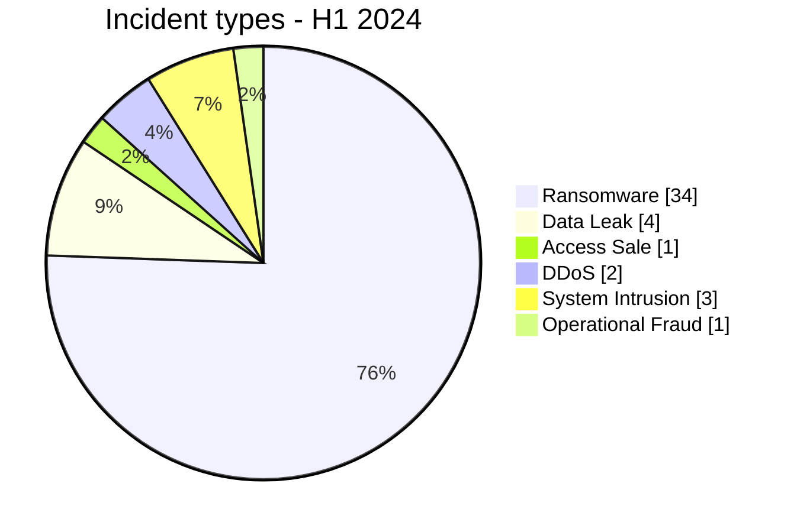

# AFRINTEL Semiannual CTI Report - Cyber Threats in Africa - H1 2024

## 1. Executive summary

Across January-June 2024, AFRINTEL retains **45 canonical incidents across 16 countries**. Ransomware accounts for **34 records (75.6%)**, followed by Data Leak **4 (8.9%)**.

### 1.1 H1 vs H2 2024 comparison

H1 is the first half of the corrected 2024 baseline; H1/H2 comparison appears in the H2 and annual reports.

## 2. Methodology

The same taxonomy, date policy, and evidence rules used in monthly reports apply. Historical reposts and duplicates are excluded from canonical statistics but retained separately.

## 3. Monthly evolution

| Month | Total | Ransomware | Data Leak | Access Sale | DDoS | Defacement | Account Takeover | System Intrusion | Malware | Operational Fraud |
|---|---|---|---|---|---|---|---|---|---|---|
| January | 7 | 4 | 0 | 1 | 0 | 0 | 0 | 2 | 0 | 0 |
| February | 8 | 6 | 1 | 0 | 0 | 0 | 0 | 1 | 0 | 0 |
| March | 9 | 8 | 1 | 0 | 0 | 0 | 0 | 0 | 0 | 0 |
| April | 9 | 5 | 2 | 0 | 2 | 0 | 0 | 0 | 0 | 0 |
| May | 9 | 8 | 0 | 0 | 0 | 0 | 0 | 0 | 0 | 1 |
| June | 3 | 3 | 0 | 0 | 0 | 0 | 0 | 0 | 0 | 0 |

## 4. Incident types

| Type | Records | Share |
|---|---|---|
| Ransomware | 34 | 75.6% |
| Data Leak | 4 | 8.9% |
| Access Sale | 1 | 2.2% |
| DDoS | 2 | 4.4% |
| Defacement | 0 | 0.0% |
| Account Takeover | 0 | 0.0% |
| System Intrusion | 3 | 6.7% |
| Malware | 0 | 0.0% |
| Operational Fraud | 1 | 2.2% |

## 5. Geographic distribution

| Country | Records | Share |
|---|---|---|
| South Africa | 18 | 40.0% |
| Egypt | 7 | 15.6% |
| Cameroon | 2 | 4.4% |
| Tunisia | 2 | 4.4% |
| Ivory Coast | 2 | 4.4% |
| Namibia | 2 | 4.4% |
| Morocco | 2 | 4.4% |
| Libya | 2 | 4.4% |
| Angola | 1 | 2.2% |
| Malawi | 1 | 2.2% |
| Cabo Verde | 1 | 2.2% |
| Seychelles | 1 | 2.2% |
| Burkina Faso | 1 | 2.2% |
| Nigeria | 1 | 2.2% |
| Senegal | 1 | 2.2% |
| Congo | 1 | 2.2% |

## 6. Regions

| Region | Records | Share |
|---|---|---|
| Southern Africa | 22 | 48.9% |
| North Africa | 13 | 28.9% |
| West Africa | 6 | 13.3% |
| Central Africa | 3 | 6.7% |
| Indian Ocean | 1 | 2.2% |

## 7. Sectors

| Sector | Records | Share |
|---|---|---|
| Government / Administration | 8 | 17.8% |
| Finance / Banking | 8 | 17.8% |
| Professional / Business Services | 4 | 8.9% |
| Manufacturing / Industry | 4 | 8.9% |
| Healthcare / Medical | 4 | 8.9% |
| Energy / Utilities | 3 | 6.7% |
| Technology / IT | 3 | 6.7% |
| Media / Entertainment | 3 | 6.7% |
| Education / University | 2 | 4.4% |
| Retail / E-commerce | 2 | 4.4% |
| Water / Utilities | 1 | 2.2% |
| Construction / Real Estate | 1 | 2.2% |
| Agriculture / Agribusiness | 1 | 2.2% |
| Legal / Justice | 1 | 2.2% |

## 8. Actors / groups

| Actor / Group | Records |
|---|---|
| lockbit3 | 14 |
| Unknown | 10 |
| hunters | 4 |
| ransomhub | 4 |
| spacebears | 2 |
| arcusmedia | 2 |
| cnHunter | 1 |
| medusa | 1 |

## 9. Evidence maturity

| Evidence | Records | Share |
|---|---|---|
| Claim - Unverified | 32 | 71.1% |
| Confirmed | 10 | 22.2% |
| Claim - Data Sample Published | 3 | 6.7% |

## 10. CTI analysis

- **Ransomware: 34**. Leak-site presence does not always prove encryption.
- **Data Leak: 4**. Historical reposts are excluded from the year; samples remain distinct from aggregate claims.
- **System Intrusion: 3**. Used where intrusion/access is better supported than ransomware or data exposure.
- **Access Sale: 1**, **DDoS: 2**, **Defacement: 0**, **Operational Fraud: 1**.

## 11. Key findings

Evidence maturity and incident type remain separate analytical dimensions.

## 12. Intelligence gaps

Initial vectors, technical dates, exact volumes, exfiltration, and public DFIR conclusions remain incomplete for part of the corpus.

## 13. Recommendations

Phishing-resistant MFA, PAM, segmentation, immutable backups, centralized logging, and separate tracking of historical reposts.

## 14. Conclusion

H1 2024 retains **45 canonical incidents**.

**AFRINTEL** - TLP:CLEAR
