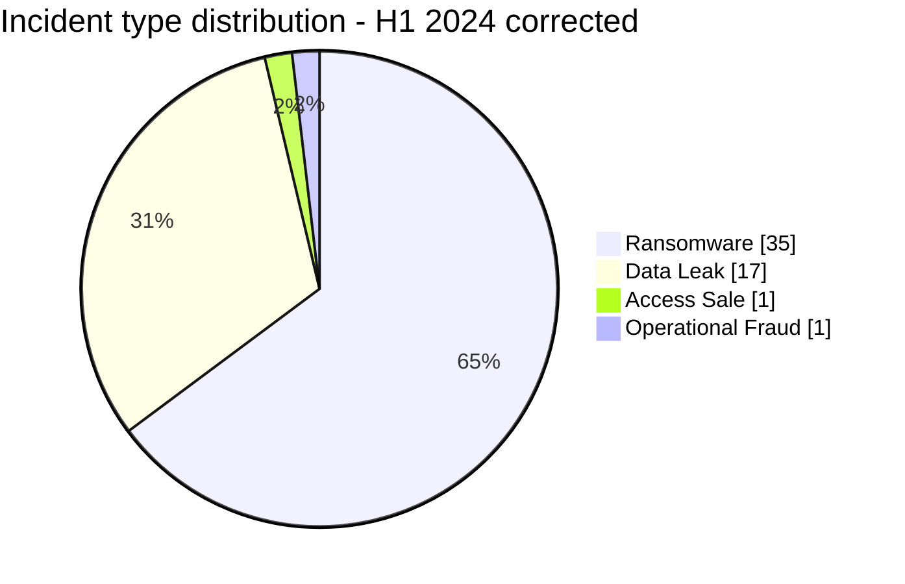
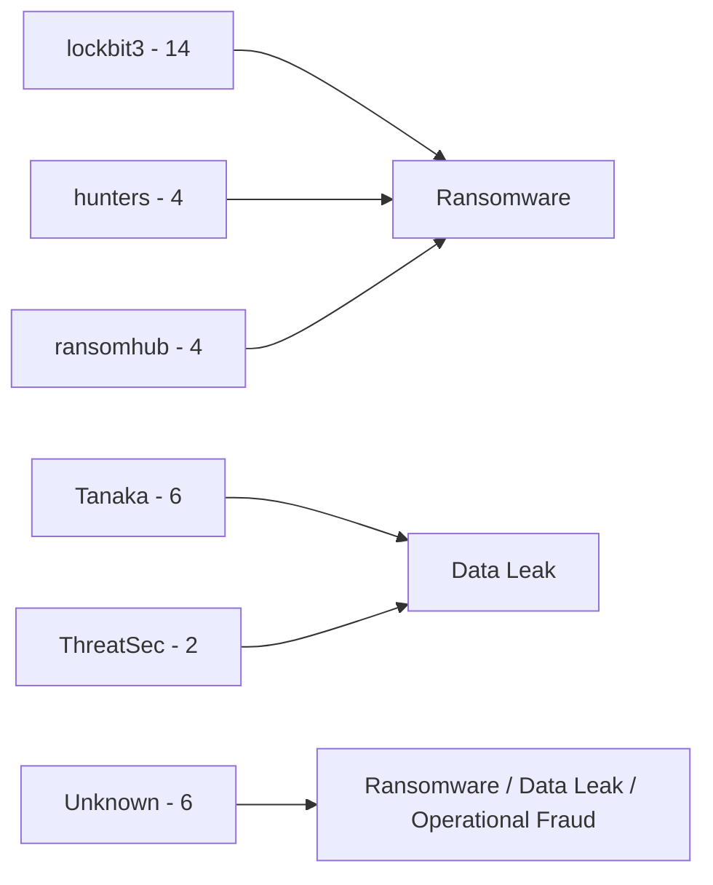
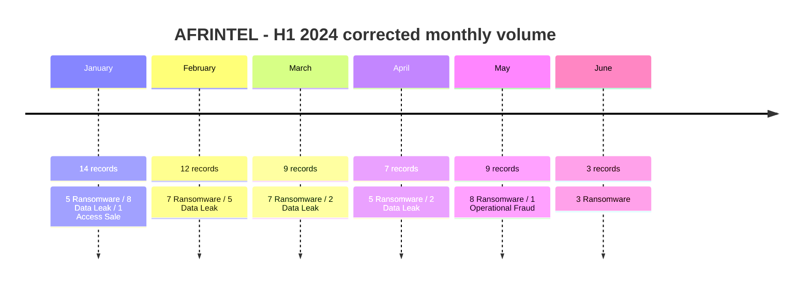

# AFRINTEL CTI Report - First Half of 2024

👉🏾 [Version française](./README_H1_FR.md)

## 1. Executive summary

The corrected AFRINTEL H1 2024 corpus contains **54 documented incident records across 19 African countries** from January through June 2024: **35 Ransomware**, **17 Data Leak**, **1 Access Sale** and **1 Operational Fraud**.

Ransomware remains the dominant category with **64.8%** of the semester, followed by Data Leak at **31.5%**. South Africa is the most represented country with **17 records (31.5%)**, but the corrected corpus is no longer ransomware-only for South Africa: it contains **15 Ransomware, 1 Data Leak and 1 Operational Fraud**. Egypt follows with **9 records**, while Côte d'Ivoire and Morocco record three each.

The corrected sequence is uneven rather than linear: January records 14 incidents, February 12, March 9, April 7, May 9 and June 3. The decline toward June measures the AFRINTEL corpus observed during the period and must not be interpreted as an equivalent fall in continental cyber risk.

The corrections also strengthen the evidence profile of the semester. Six H1 retrospective records are now incorporated: ITAC, Eneo Cameroon, GPAA/GEPF, CIPC, Malawi's passport system and South Africa's DPWI. Their statuses range from victim/government confirmation to technically contested classification, which prevents them from being treated as equivalent events.

### 1.1 Impact of the H1 correction

| Indicator | Uploaded H1 version | Corrected H1 | Difference |
|---|---:|---:|---:|
| Total records | 46 | **54** | **+8 (+17.4%)** |
| Countries | 18 | **19** | **+1 (+5.6%)** |
| Ransomware | 31 | **35** | **+4 (+12.9%)** |
| Data Leak | 14 | **17** | **+3 (+21.4%)** |
| Access Sale | 1 | **1** | Stable |
| Operational Fraud | 0 | **1** | New |

The increase of eight records has two causes. Six come from the validated H1 retrospective correction set. Two additional records arise from reconciling the H1 summary with the already validated March and April monthly victim files, which contain **9** and **7** records respectively rather than the stale **8** and **6** values in the uploaded semester summary.

## 2. Methodology

- **Period:** 1 January to 30 June 2024.
- **Source of truth:** the six harmonized monthly `victims.md` files for January through June and their synchronized French versions.
- **Counting:** one harmonized victim card equals one documented incident record.
- **Strict taxonomy:** Ransomware, Data Leak, Access Sale, DDoS, Defacement and Operational Fraud.
- **H1 retrospective additions:** ITAC, Eneo Cameroon, GPAA/GEPF, CIPC, Malawi Passport Issuance System and DPWI.
- **Evidence hierarchy:** criminal claim, published sample, full publication, victim confirmation and government confirmation remain distinct states.
- **Reposts and historical data:** publication date does not automatically become intrusion date.
- **Technical caution:** ransomware branding does not by itself confirm encryption, exfiltration, initial access or operational disruption.

## 3. Semester overview

| Indicator | Corrected value |
|---|---:|
| Documented incident records | **54** |
| Countries | **19** |
| Ransomware | **35 (64.8%)** |
| Data Leak | **17 (31.5%)** |
| Access Sale | **1 (1.9%)** |
| Operational Fraud | **1 (1.9%)** |
| DDoS | **0** |
| Defacement | **0** |
| Highest-volume month | **January - 14** |
| Lowest-volume month | **June - 3** |

### 3.1 Corrected monthly activity

| Month | Total | Ransomware | Data Leak | Access Sale | Operational Fraud |
|---|---:|---:|---:|---:|---:|
| January | **14** | 5 | 8 | 1 | 0 |
| February | **12** | 7 | 5 | 0 | 0 |
| March | **9** | 7 | 2 | 0 | 0 |
| April | **7** | 5 | 2 | 0 | 0 |
| May | **9** | 8 | 0 | 0 | 1 |
| June | **3** | 3 | 0 | 0 | 0 |
| **Total** | **54** | **35** | **17** | **1** | **1** |

**Monthly volume**

| Month | Records | Visual |
|---|---:|:---|
| January | 14 | ██████████████ |
| February | 12 | ████████████ |
| March | 9 | █████████ |
| April | 7 | ███████ |
| May | 9 | █████████ |
| June | 3 | ███ |

## 4. Geographic distribution

### 4.1 Countries

| Country | Total | Ransomware | Data Leak | Access Sale | Operational Fraud |
|---|---:|---:|---:|---:|---:|
| 🇿🇦 South Africa | 17 | 15 | 1 | 0 | 1 |
| 🇪🇬 Egypt | 9 | 6 | 3 | 0 | 0 |
| 🇨🇮 Ivory Coast | 3 | 2 | 1 | 0 | 0 |
| 🇲🇦 Morocco | 3 | 1 | 2 | 0 | 0 |
| 🇧🇫 Burkina Faso | 2 | 0 | 2 | 0 | 0 |
| 🇨🇲 Cameroon | 2 | 1 | 0 | 1 | 0 |
| 🇪🇹 Ethiopia | 2 | 0 | 2 | 0 | 0 |
| 🇬🇭 Ghana | 2 | 0 | 2 | 0 | 0 |
| 🇳🇦 Namibia | 2 | 2 | 0 | 0 | 0 |
| 🇳🇬 Nigeria | 2 | 1 | 1 | 0 | 0 |
| 🇹🇳 Tunisia | 2 | 2 | 0 | 0 | 0 |
| 🇩🇿 Algeria | 1 | 0 | 1 | 0 | 0 |
| 🇨🇬 Congo | 1 | 1 | 0 | 0 | 0 |
| 🇰🇪 Kenya | 1 | 0 | 1 | 0 | 0 |
| 🇱🇾 Libya | 1 | 1 | 0 | 0 | 0 |
| 🇲🇼 Malawi | 1 | 1 | 0 | 0 | 0 |
| 🇷🇼 Rwanda | 1 | 0 | 1 | 0 | 0 |
| 🇸🇳 Senegal | 1 | 1 | 0 | 0 | 0 |
| 🇸🇨 Seychelles | 1 | 1 | 0 | 0 | 0 |
| **Total** | **54** | **35** | **17** | **1** | **1** |

South Africa accounts for **17 of 54 records (31.5%)**, followed by Egypt with **9 (16.7%)**. Together they represent 26 records, or **48.1%** of the H1 corpus. This concentration describes AFRINTEL's observed dataset and is not a population-adjusted measure of national cyber risk.

### 4.2 Regions

| Region | Total | Ransomware | Data Leak | Access Sale | Operational Fraud |
|---|---:|---:|---:|---:|---:|
| Southern Africa | **20** | 18 | 1 | 0 | 1 |
| North Africa | **16** | 10 | 6 | 0 | 0 |
| West Africa | **10** | 4 | 6 | 0 | 0 |
| East Africa | **4** | 0 | 4 | 0 | 0 |
| Central Africa | **3** | 2 | 0 | 1 | 0 |
| Indian Ocean | **1** | 1 | 0 | 0 | 0 |
| **Total** | **54** | **35** | **17** | **1** | **1** |

Southern Africa is the largest regional block with **20 records**, driven mainly by ransomware. North Africa follows with 16. Data Leak is more geographically distributed: all four East African records are leaks in this corrected H1 corpus, while West Africa contains six leaks and four ransomware records.

## 5. Sector distribution

| Sector | Records | Share |
|---|---:|---:|
| Government / Administration | 13 | 24.1% |
| Finance / Banking | 6 | 11.1% |
| Technology / IT | 5 | 9.3% |
| Healthcare / Medical | 4 | 7.4% |
| Manufacturing / Industry | 4 | 7.4% |
| Professional / Business Services | 4 | 7.4% |
| Retail / E-commerce | 4 | 7.4% |
| Education / University | 3 | 5.6% |
| Energy / Utilities | 3 | 5.6% |
| Media / Entertainment | 3 | 5.6% |
| Agriculture / Agribusiness | 1 | 1.9% |
| Civil Society / NGO | 1 | 1.9% |
| Construction / Real Estate | 1 | 1.9% |
| Legal / Justice | 1 | 1.9% |
| Water / Utilities | 1 | 1.9% |
| **Total** | **54** | **100%** |

**Government / Administration** is the largest sector with **13 records (24.1%)**, substantially above Finance / Banking with six. The government total contains multiple incident types: eight Data Leak, four Ransomware and the DPWI Operational Fraud case. This diversity is important because a single sector count does not imply a common technical attack pattern.

## 6. Actors and groups

| Actor / Group | Records | Share |
|---|---:|---:|
| lockbit3 | 14 | 25.9% |
| Tanaka | 6 | 11.1% |
| Unknown | 6 | 11.1% |
| hunters | 4 | 7.4% |
| ransomhub | 4 | 7.4% |
| arcusmedia | 2 | 3.7% |
| spacebears | 2 | 3.7% |
| ThreatSec | 2 | 3.7% |
| blacksuit | 1 | 1.9% |
| cactus | 1 | 1.9% |
| cnHunter | 1 | 1.9% |
| DataHoes | 1 | 1.9% |
| dragonforce | 1 | 1.9% |
| EgyptLeaks | 1 | 1.9% |
| eldorado | 1 | 1.9% |
| incransom | 1 | 1.9% |
| medusa | 1 | 1.9% |
| Milad | 1 | 1.9% |
| Pedi | 1 | 1.9% |
| r57 | 1 | 1.9% |
| X0Frankenstein | 1 | 1.9% |
| zebi | 1 | 1.9% |
| **Total** | **54** | **100%** |

`lockbit3` is the most visible ransomware group with **14 records**. `Tanaka` appears as the structured actor/group attribution in six Data Leak cards, while `Unknown` also appears six times across ransomware, Data Leak and Operational Fraud. These counts represent attribution labels in the harmonized cards, not proof that all records sharing a label belong to one technical campaign.

## 7. Evidence maturity

The corrected H1 corpus should not be read as 54 equally confirmed compromises.

| Evidence/status group | Records | Share |
|---|---:|---:|
| Claim - Unverified | **32** | **59.3%** |
| Claim - Data Sample Published | **15** | **27.8%** |
| Data Fully Published | **1** | **1.9%** |
| Victim/government confirmed labels, including caveated cases | **6** | **11.1%** |
| **Total** | **54** | **100%** |

Confidence levels show the same asymmetry:

| Confidence | Records | Share |
|---|---:|---:|
| Low | **32** | **59.3%** |
| Medium | **11** | **20.4%** |
| High | **7** | **13.0%** |
| Very High | **4** | **7.4%** |
| **Total** | **54** | **100%** |

The evidence hierarchy therefore matters more than raw volume. A leak-site publication, an accessible sample, a victim-confirmed breach and a government-confirmed operational incident do not provide the same level or type of intelligence.

## 8. Retrospective corrections affecting H1

| Month | Victim | AFRINTEL classification | Evidence position |
|---|---|---|---|
| January | ITAC - South Africa | Ransomware | Victim Confirmed; possible exfiltration not confirmed |
| January | Eneo Cameroon | Ransomware | Victim Confirmed; ransomware classification remains unverified |
| February | GPAA / GEPF - South Africa | Ransomware | Victim Confirmed + Threat Actor Claim |
| February | CIPC - South Africa | Data Leak | Victim Confirmed; defacement/extortion retained as secondary effects |
| February | Malawi Passport Issuance System | Ransomware | Government Confirmed; exact technical root cause contested |
| May | DPWI - South Africa | Operational Fraud | Government Confirmed - Forensic Investigation |

These six additions increase H1 coverage without erasing uncertainty. Eneo and Malawi remain provisionally mapped to Ransomware because the six-type AFRINTEL taxonomy requires a controlled primary type, while the reports explicitly preserve the unresolved technical classification.

## 9. Detailed CTI interpretation

### 9.1 Ransomware

Ransomware remains the largest category with **35 records**, but only part of that volume is supported beyond criminal publication. `lockbit3` dominates the structured actor counts with 14 records. South Africa records 15 of the 35 ransomware entries, but the corrected country profile also contains a Data Leak and an Operational Fraud case.

The ransomware total therefore measures publication and documented incident visibility rather than 35 independently verified encryption events. Where victim or government evidence is stronger, the report preserves that status. Where only actor publication exists, the record remains a claim.

### 9.2 Data Leak

The corrected H1 contains **17 Data Leak records**, three more than the uploaded semester report. Data Leak is less geographically concentrated than ransomware and spans North, West and East Africa in particular.

Fifteen records carry `Claim - Data Sample Published`, while one record reaches `Data Fully Published`. Sample availability increases confidence in exposure, but it does not automatically establish the initial compromise date, acquisition method, completeness or actor attribution.

### 9.3 Access Sale

The only Access Sale remains the January Cameroon case. An advertised access is treated as an access-sale claim, not as proof that the access was purchased, used or converted into a later compromise.

### 9.4 Operational Fraud

DPWI introduces **Operational Fraud** into the H1 taxonomy. The South African government confirmed a May loss of approximately R24 million and a broader investigation into cyber-enabled financial theft. The technical intrusion path was not resolved in the correction dataset, so AFRINTEL does not invent malware or ransomware where the evidence does not establish it.

## 10. Contextual MITRE ATT&CK mapping

| Qualification | Technique | Defensive use |
|---|---|---|
| Preventive | T1486 - Data Encrypted for Impact | Relevant to ransomware monitoring; encryption is not confirmed for every ransomware-labelled record. |
| Preventive | T1490 - Inhibit System Recovery | Monitor backup and recovery tampering around ransomware events. |
| Conditional | T1078 - Valid Accounts | Investigate identity abuse where access, account material or administrative compromise is supported; do not assume it universally. |
| Contextual | T1213 - Data from Information Repositories | Relevant to structured data and document exposures observed in Data Leak cases. |
| Preventive | T1567 - Exfiltration Over Web Service | Monitor unusual outbound transfers; exfiltration channels are not established for most H1 records. |

## 11. Recommendations

- **Evidence first:** preserve distinct statuses for criminal claims, samples, victim confirmation and government confirmation.
- **Government / Administration:** strengthen identity controls, privileged-account monitoring, public-web hardening and financial-fraud detection.
- **Ransomware resilience:** test isolated restore procedures, administrative segmentation and recovery priorities instead of assuming backups are usable.
- **Data exposure:** verify dataset provenance and age before notification, and avoid reproducing personal data in CTI reporting.
- **Repeated actor labels:** correlate infrastructure, timestamps, samples and victim telemetry before describing a coordinated campaign.
- **Fraud cases:** separate financial loss, insider hypotheses, external compromise and malware evidence until forensic work resolves the mechanism.

## 12. Semester timeline

## 13. Conclusion

The corrected first half of 2024 contains **54 documented incident records across 19 African countries**, not 46. The revision increases the semester corpus by **17.4%** and changes both its scale and its analytical structure: Ransomware rises from 31 to 35 records, Data Leak from 14 to 17, and Operational Fraud appears as a separate category through the DPWI case.

Ransomware remains dominant, but its share falls from 67.4% in the uploaded H1 report to **64.8%** after correction. This is important: the absolute number of ransomware records increases while the semester becomes more diverse in incident type. Data Leak accounts for **31.5%**, and the introduction of Operational Fraud prevents a confirmed financial-theft case from being incorrectly forced into a malware category.

South Africa remains the strongest geographic concentration with **17 records**, or nearly one third of H1. The corrected composition, however, is more nuanced than the original statement that all South African records were ransomware: the country now contains **15 Ransomware, 1 Data Leak and 1 Operational Fraud**. Egypt follows with nine records. Together, the two countries account for almost half the semester corpus, but that concentration should be interpreted as observed AFRINTEL visibility rather than a normalized national-risk ranking.

The sector view also changes materially. **Government / Administration leads with 13 records**, including eight Data Leak, four Ransomware and one Operational Fraud. This diversity argues against treating public-sector exposure as a single campaign or a single technical problem. Identity compromise, data publication, ransomware claims and cyber-enabled theft require different defensive responses even when they affect the same broad sector.

The most important analytical result is the evidence hierarchy. **32 of 54 records remain `Claim - Unverified`**, while 15 have published samples, one is fully published and six carry victim or government confirmation labels, some with explicit technical caveats. The corpus therefore cannot defensibly be summarized as "54 confirmed attacks." Its value comes from distinguishing what is claimed, what is sampled, what is directly confirmed and what remains technically unresolved.

The six retrospective H1 additions demonstrate why this distinction matters. ITAC and GPAA/GEPF add strong victim-confirmed ransomware evidence; CIPC adds a confirmed Data Leak with secondary defacement and extortion effects; Eneo and Malawi preserve uncertainty around the ransomware classification; and DPWI introduces a confirmed cyber-enabled financial-theft case without inventing a malware mechanism. These records improve historical completeness precisely because uncertainty is retained rather than removed.

The corrected H1 trend also requires caution. Monthly volume falls from 14 records in January to three in June, but this does not demonstrate a corresponding reduction in the real cyber threat affecting Africa. Publication behavior, source coverage, delayed disclosure, data recirculation and evidence availability can all change the observed corpus. The defensible conclusion is therefore not that the threat declined, but that **AFRINTEL observed a ransomware-dominant semester with strong geographic concentration, broader data-leak circulation, a significant public-sector footprint and highly uneven evidence maturity**.

For operational use, the priority is to keep the corrected monthly victim files as the statistical source of truth, preserve evidence-state distinctions and avoid converting criminal visibility into confirmed intrusion counts. This corrected H1 dataset now provides a reliable base for rebuilding the full 2024 annual report and, only after that annual reconciliation, recalculating the 2024-to-2025 comparison.

**AFRINTEL** - TLP:CLEAR
