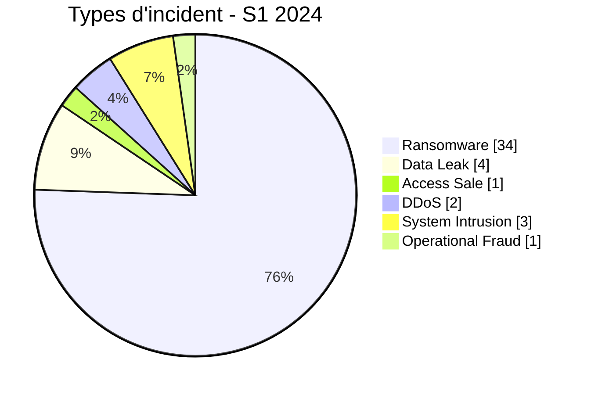

# Rapport CTI semestriel AFRINTEL - Cybermenaces en Afrique - S1 2024

## 1. Synthèse exécutive

Sur janvier-juin 2024, AFRINTEL retient **45 incidents canoniques dans 16 pays**. Le ransomware représente **34 fiches (75,6 %)**, devant Data Leak **4 (8,9 %)**. Les pays les plus représentés sont **Afrique du Sud (18)**, **Égypte (7)**, **Cameroun (2)**.

### 1.1 Comparaison S1 vs S2 2024

Le S1 constitue la première moitié de la baseline 2024 corrigée ; la comparaison S1/S2 est présentée dans le rapport S2 et dans le rapport annuel.

## 2. Méthodologie

Même taxonomie, même politique de dates et mêmes règles de preuve que les rapports mensuels. Les reposts historiques et doublons sont exclus des statistiques canoniques mais conservés dans des registres séparés.

## 3. Évolution mensuelle

| Mois | Total | Ransomware | Data Leak | Access Sale | DDoS | Defacement | Account Takeover | System Intrusion | Malware | Operational Fraud |
|---|---|---|---|---|---|---|---|---|---|---|
| Janvier | 7 | 4 | 0 | 1 | 0 | 0 | 0 | 2 | 0 | 0 |
| Février | 8 | 6 | 1 | 0 | 0 | 0 | 0 | 1 | 0 | 0 |
| Mars | 9 | 8 | 1 | 0 | 0 | 0 | 0 | 0 | 0 | 0 |
| Avril | 9 | 5 | 2 | 0 | 2 | 0 | 0 | 0 | 0 | 0 |
| Mai | 9 | 8 | 0 | 0 | 0 | 0 | 0 | 0 | 0 | 1 |
| Juin | 3 | 3 | 0 | 0 | 0 | 0 | 0 | 0 | 0 | 0 |

## 4. Types d'incident

| Type | Fiches | Part |
|---|---|---|
| Ransomware | 34 | 75,6 % |
| Data Leak | 4 | 8,9 % |
| Access Sale | 1 | 2,2 % |
| DDoS | 2 | 4,4 % |
| Defacement | 0 | 0,0 % |
| Account Takeover | 0 | 0,0 % |
| System Intrusion | 3 | 6,7 % |
| Malware | 0 | 0,0 % |
| Operational Fraud | 1 | 2,2 % |

## 5. Répartition géographique

| Pays | Fiches | Part |
|---|---|---|
| Afrique du Sud | 18 | 40,0 % |
| Égypte | 7 | 15,6 % |
| Cameroun | 2 | 4,4 % |
| Tunisie | 2 | 4,4 % |
| Côte d'Ivoire | 2 | 4,4 % |
| Namibie | 2 | 4,4 % |
| Maroc | 2 | 4,4 % |
| Libye | 2 | 4,4 % |
| Angola | 1 | 2,2 % |
| Malawi | 1 | 2,2 % |
| Cabo Verde | 1 | 2,2 % |
| Seychelles | 1 | 2,2 % |
| Burkina Faso | 1 | 2,2 % |
| Nigeria | 1 | 2,2 % |
| Sénégal | 1 | 2,2 % |
| Congo | 1 | 2,2 % |

## 6. Régions

| Région | Fiches | Part |
|---|---|---|
| Afrique australe | 22 | 48,9 % |
| Afrique du Nord | 13 | 28,9 % |
| Afrique de l'Ouest | 6 | 13,3 % |
| Afrique centrale | 3 | 6,7 % |
| Océan Indien | 1 | 2,2 % |

## 7. Secteurs

| Secteur | Fiches | Part |
|---|---|---|
| Gouvernement / Administration | 8 | 17,8 % |
| Finance / Banque | 8 | 17,8 % |
| Services professionnels / Business | 4 | 8,9 % |
| Industrie / Fabrication | 4 | 8,9 % |
| Santé / Médical | 4 | 8,9 % |
| Énergie / Services publics | 3 | 6,7 % |
| Technologie / IT | 3 | 6,7 % |
| Médias / Divertissement | 3 | 6,7 % |
| Éducation / Université | 2 | 4,4 % |
| Commerce / E-commerce | 2 | 4,4 % |
| Eau / Services publics | 1 | 2,2 % |
| Construction / Immobilier | 1 | 2,2 % |
| Agriculture / Agro-industrie | 1 | 2,2 % |
| Juridique / Justice | 1 | 2,2 % |

## 8. Acteurs / groupes

| Acteur / Groupe | Fiches |
|---|---|
| lockbit3 | 14 |
| Unknown | 10 |
| hunters | 4 |
| ransomhub | 4 |
| spacebears | 2 |
| arcusmedia | 2 |
| cnHunter | 1 |
| medusa | 1 |

## 9. Maturité des preuves

| Preuve | Fiches | Part |
|---|---|---|
| Claim - Unverified | 32 | 71,1 % |
| Confirmed | 10 | 22,2 % |
| Claim - Data Sample Published | 3 | 6,7 % |

## 10. Analyse CTI

- **Ransomware : 34**. Une présence sur leak site ne prouve pas toujours le chiffrement.
- **Data Leak : 4**. Les republications historiques sont sorties des statistiques, les échantillons restant séparés des volumes revendiqués.
- **System Intrusion : 3**. Utilisé lorsque l'accès/intrusion est mieux soutenu qu'un ransomware ou une fuite.
- **Access Sale : 1**, **DDoS : 2**, **Defacement : 0**, **Operational Fraud : 1**.

## 11. Principaux constats

- top secteurs : Gouvernement / Administration (8), Finance / Banque (8), Services professionnels / Business (4);
- top acteurs/labels : lockbit3 (14), Unknown (10), hunters (4), ransomhub (4), spacebears (2);
- `Unknown` reste une absence d'attribution ;
- la maturité de preuve doit être lue séparément du type technique.

## 12. Intelligence gaps

Vecteurs initiaux, dates techniques, volumes exacts, exfiltration et conclusions DFIR restent incomplets pour une partie du corpus.

## 13. Recommandations

MFA résistante au phishing, PAM, segmentation, sauvegardes immuables, centralisation des journaux et suivi séparé des reposts historiques.

## 14. Conclusion

Le S1 2024 retient **45 incidents canoniques**.

**AFRINTEL** - TLP:CLEAR
