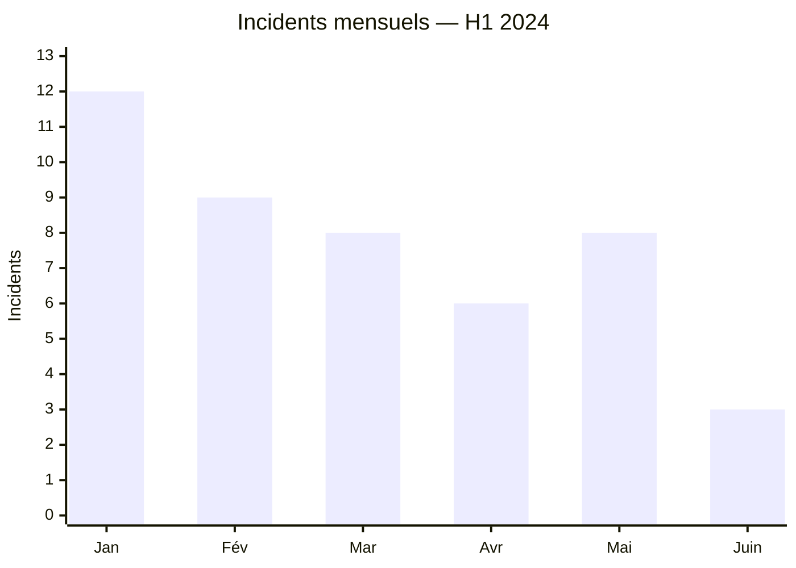
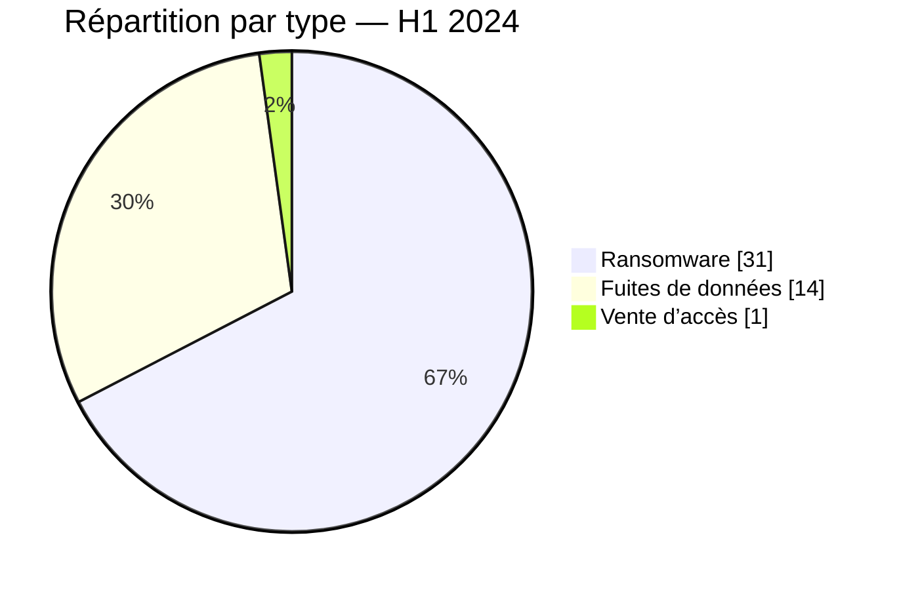

# Rapport CTI AFRINTEL — Premier semestre 2024

👉🏾 [English version](./README_H1.md)

## 1. Résumé exécutif

AFRINTEL a documenté **46 incidents dans 18 pays** entre janvier et juin 2024 : **31 revendications ransomware**, **14 fuites de données** et **1 vente d’accès**. L’Afrique du Sud représente 13 incidents, tous classés ransomware. L’Égypte suit avec huit incidents, puis la Côte d’Ivoire et le Maroc avec trois chacun.

Le semestre n’évolue pas de façon linéaire. Janvier atteint 12 incidents, alors que juin n’en compte que trois. Cette baisse du volume observé ne démontre pas une diminution équivalente du risque : elle peut refléter l’activité des sources surveillées, les délais de publication et les limites de collecte. Le signal le plus robuste reste la concentration des publications ransomware en Afrique australe et la plus grande diversité des fuites en Afrique du Nord et de l’Ouest.

## 2. Méthodologie

Cette synthèse agrège les fichiers mensuels [victims_FR.md](./01-january/victims_FR.md) de janvier à juin et leurs versions anglaises synchronisées. Les catégories ransomware, fuite, vente d’accès et défacement sont comptées séparément. Une republication reste un incident de collecte ; elle n’est pas assimilée à une nouvelle intrusion lorsqu’aucun élément ne l’établit.

Le corpus décrit les publications observées par AFRINTEL, pas l’ensemble des cyberattaques sur le continent. Les conclusions techniques restent limitées en l’absence de rapports DFIR ou de télémétrie des victimes.

## 3. Vue globale

| Indicateur | Valeur |
|---|---:|
| Incidents / Pays | **46 / 18** |
| Ransomware | **31 (67,4 %)** |
| Fuites de données | **14 (30,4 %)** |
| Ventes d’accès / Défacement | **1 (2,2 %) / 0** |

### Évolution mensuelle

| Mois | Total | Ransomware | Fuite | Vente d’accès |
|---|---:|---:|---:|---:|
| Janvier | 12 | 3 | 8 | 1 |
| Février | 9 | 5 | 4 | 0 |
| Mars | 8 | 7 | 1 | 0 |
| Avril | 6 | 5 | 1 | 0 |
| Mai | 8 | 8 | 0 | 0 |
| Juin | 3 | 3 | 0 | 0 |
| **Total** | **46** | **31** | **14** | **1** |

### Classement par pays

| Pays | Incidents | Barre |
|---|---:|---|
| 🇿🇦 Afrique du Sud | 13 | █████████████ |
| 🇪🇬 Égypte | 8 | ████████ |
| 🇨🇮 Côte d’Ivoire | 3 | ███ |
| 🇲🇦 Maroc | 3 | ███ |
| 🇧🇫 Burkina Faso | 2 | ██ |
| 🇬🇭 Ghana | 2 | ██ |
| 🇳🇦 Namibie | 2 | ██ |
| 🇳🇬 Nigeria | 2 | ██ |
| 🇹🇳 Tunisie | 2 | ██ |
| 🇩🇿 Algérie | 1 | █ |
| 🇨🇲 Cameroun | 1 | █ |
| 🇨🇬 Congo | 1 | █ |
| 🇪🇹 Éthiopie | 1 | █ |
| 🇰🇪 Kenya | 1 | █ |
| 🇱🇾 Libye | 1 | █ |
| 🇷🇼 Rwanda | 1 | █ |
| 🇸🇳 Sénégal | 1 | █ |
| 🇸🇨 Seychelles | 1 | █ |
| **Total** | **46** | |

### Répartition régionale

| Région | Total | Ransomware | Fuite | Vente d’accès |
|---|---:|---:|---:|---:|
| Afrique australe | 15 | 15 | 0 | 0 |
| Afrique du Nord | 15 | 10 | 5 | 0 |
| Afrique de l’Ouest | 10 | 4 | 6 | 0 |
| Afrique de l’Est | 3 | 0 | 3 | 0 |
| Afrique centrale | 2 | 1 | 0 | 1 |
| Océan Indien | 1 | 1 | 0 | 0 |
| **Total** | **46** | **31** | **14** | **1** |

### Répartition sectorielle normalisée

| Secteur | Incidents | Part |
|---|---:|---:|
| Gouvernement / Administration | 7 | 15,2 % |
| Finance / Banque | 6 | 13,0 % |
| Technologies / Informatique | 5 | 10,9 % |
| Industrie / Fabrication | 4 | 8,7 % |
| Services professionnels / Entreprises | 4 | 8,7 % |
| Commerce / E-commerce | 4 | 8,7 % |
| Éducation / Université | 3 | 6,5 % |
| Santé / Médical | 3 | 6,5 % |
| Médias / Divertissement | 3 | 6,5 % |
| Pétrole / Énergie | 2 | 4,3 % |
| Agriculture / Agro-industrie | 1 | 2,2 % |
| Construction / Immobilier | 1 | 2,2 % |
| Eau / Services essentiels | 1 | 2,2 % |
| Juridique / Justice | 1 | 2,2 % |
| Société civile / ONG | 1 | 2,2 % |
| **Total** | **46** | **100 %** |

### Acteurs les plus visibles

| Acteur ou libellé source | Incidents |
|---|---:|
| LockBit3 | 13 |
| Hunters | 4 |
| RansomHub | 4 |
| Tanaka — publication sur un forum clandestin | 3 |
| ArcusMedia | 2 |
| SpaceBears | 2 |

## 4. Analyse détaillée par type d’incident

### 4.1 Ransomware

Les 31 publications ransomware représentent 67,4 % du corpus. L’Afrique du Sud en concentre 13 ; LockBit3 en signe 13 à l’échelle du semestre. Cette coïncidence de volumes ne signifie pas que tous les cas sud-africains sont attribués à LockBit3, ni qu’ils relèvent d’une même campagne. Les sources publiques décrivent principalement des publications de victimes, avec peu d’éléments sur l’accès initial ou les opérations internes.

### 4.2 Fuites de données et vente d’accès

Les 14 fuites sont davantage réparties entre l’Afrique du Nord, l’Ouest et l’Est. L’unique vente d’accès concerne le Cameroun en janvier. Ces publications peuvent exposer des données récentes, anciennes ou republiées ; la date de publication ne suffit donc pas à dater une compromission.

## 5. Impact sectoriel

Le gouvernement arrive en tête avec sept incidents, devant la finance avec six. La technologie, l’industrie, les services professionnels et le commerce forment un second ensemble récurrent. Les risques vont de l’indisponibilité à la fraude et au hameçonnage ciblé, mais doivent être évalués incident par incident selon les preuves disponibles.

## 6. Profil des acteurs et évaluation du risque

| Périmètre | Niveau | Justification |
|---|---|---|
| 🇿🇦 Afrique du Sud | 🔴 Élevé | 13 publications ransomware, soit 28,3 % du semestre |
| 🇪🇬 Égypte | 🔴 Élevé | Huit incidents de nature mixte |
| 🇨🇮 Côte d’Ivoire / 🇲🇦 Maroc | 🟠 Moyen | Trois incidents chacun, avec profils différents |
| Autres pays | 🟡 Faible à moyen | Un ou deux incidents observés ; signal statistique limité |

## 7. Tendances et lacunes de renseignement

- **Observé — confiance élevée :** le ransomware représente 31 incidents sur 46.
- **Observé — confiance élevée :** l’Afrique australe ne compte que des publications ransomware dans ce corpus semestriel.
- **Observé — confiance élevée :** les fuites sont géographiquement plus réparties que les revendications ransomware.
- **Lacune majeure :** les sources consultées ne contiennent pas de rapports DFIR publics permettant d’établir les chaînes d’attaque.
- **Lacune :** l’âge, l’exhaustivité et l’origine de plusieurs jeux de données publiés ne sont pas déterminés.
- **Collecte attendue :** consolider les confirmations de victimes, les dates de première observation et les liens entre republications.

## 8. Cartographie MITRE ATT&CK contextuelle

| Qualification | Technique | Utilisation défensive |
|---|---|---|
| Préventif | T1486 — Data Encrypted for Impact | Cas d’usage ransomware ; chiffrement non confirmé pour chaque victime |
| Préventif | T1490 — Inhibit System Recovery | Surveiller l’altération des mécanismes de restauration |
| Hypothèse — confiance moyenne | T1078 — Valid Accounts | Scénario à examiner pour les accès vendus ou réutilisés |
| Préventif | T1567 — Exfiltration Over Web Service | Détecter les transferts sortants inhabituels |

## 9. Recommandations

- **Administrations et finance :** imposer une MFA résistante au phishing et revoir les comptes privilégiés.
- **Industrie :** segmenter les zones bureautiques, serveurs et environnements de production.
- **Organisations exposées :** qualifier les données publiées avant notification et sans reproduire d’informations personnelles.
- **Toutes organisations :** tester la restauration depuis des sauvegardes isolées.

## 10. Recommandations SOC et tactiques

| Qualification | Action |
|---|---|
| **Observé** | Corréler les organisations publiées avec les alertes IAM, EDR, VPN, messagerie et proxy disponibles en interne. |
| **Hypothèse** | Rechercher réutilisation d’identifiants, accès distants atypiques et exports massifs. |
| **Préventif** | Détecter dump LSASS, PowerShell obfusqué, suppression de sauvegardes, chiffrement massif et transferts Rclone inhabituels. |

## 11. Recommandations stratégiques

| Priorité | Qualification | Mesure |
|---:|---|---|
| 1 | **Observé** | Concentrer les exercices ransomware sur les secteurs et pays les plus présents dans le corpus. |
| 2 | **Hypothèse** | Vérifier les scénarios d’accès par identité et équipement périmétrique sans les déclarer observés. |
| 3 | **Préventif** | Réduire la surface externe et rendre les sauvegardes critiques immuables et isolées. |

## 12. Conclusion

Le premier semestre 2024 montre une pression ransomware concentrée et une circulation de données plus diffuse. Il ne mesure pas l’incidence réelle sur le continent. Sa valeur opérationnelle tient à la priorisation : vérifier les publications, rapprocher les indices de la télémétrie interne et adapter la défense au niveau de preuve de chaque cas.

**AFRINTEL — TLP:CLEAR**

[Dépôt AFRINTEL](https://github.com/Hatchepsoute/AFRINTEL)
