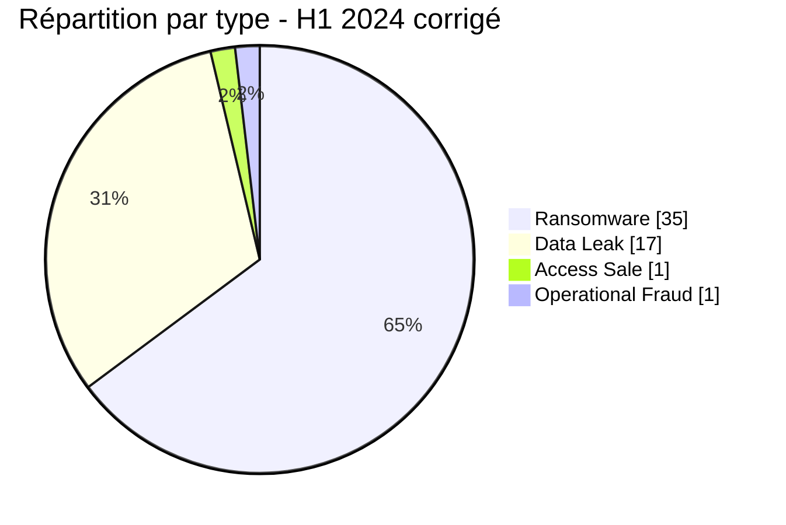
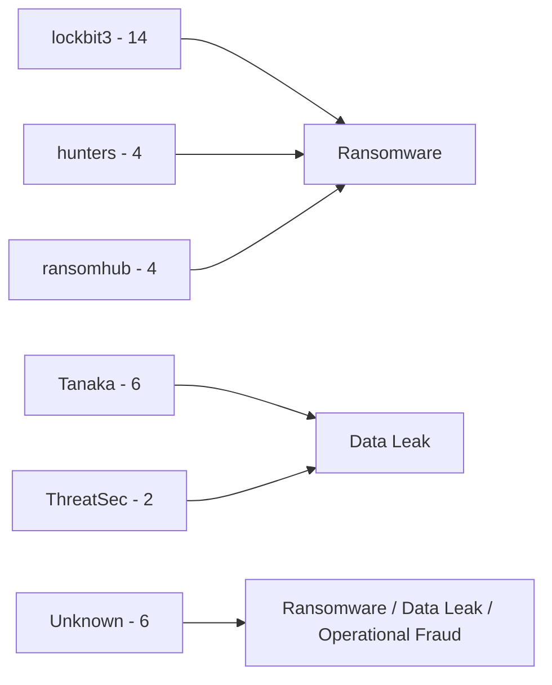
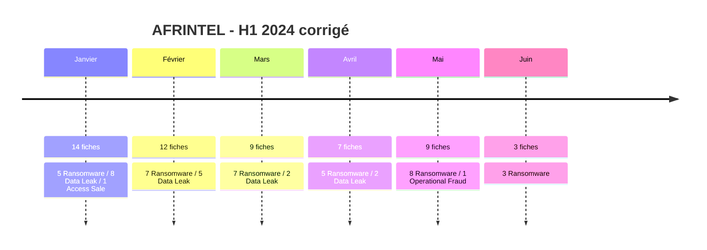

# Rapport CTI AFRINTEL - Premier semestre 2024

👉🏾 [English version](./README_H1.md)

## 1. Résumé exécutif

Le corpus AFRINTEL corrigé du premier semestre 2024 contient **54 fiches incident documentées dans 19 pays africains** entre janvier et juin 2024 : **35 Ransomware**, **17 Data Leak**, **1 Access Sale** et **1 Operational Fraud**.

Le Ransomware reste la catégorie dominante avec **64,8 %** du semestre, devant les Data Leak à **31,5 %**. L'Afrique du Sud est le pays le plus représenté avec **17 fiches (31,5 %)**, mais le corpus corrigé n'est plus exclusivement ransomware pour ce pays : il comprend **15 Ransomware, 1 Data Leak et 1 Operational Fraud**. L'Égypte suit avec **9 fiches**, puis la Côte d'Ivoire et le Maroc avec trois chacune.

La séquence corrigée n'est pas linéaire : janvier compte 14 incidents, février 12, mars 9, avril 7, mai 9 et juin 3. La baisse observée vers juin mesure le corpus AFRINTEL collecté pendant la période et ne doit pas être interprétée comme une baisse équivalente du risque cyber continental.

Les corrections renforcent également le profil de preuve du semestre. Six dossiers rétrospectifs H1 sont désormais intégrés : ITAC, Eneo Cameroon, GPAA/GEPF, CIPC, le système de passeports du Malawi et DPWI en Afrique du Sud. Leurs statuts vont de la confirmation victime ou gouvernementale à des classifications techniques explicitement contestées, ce qui interdit de les traiter comme des événements équivalents.

### 1.1 Impact de la correction H1

| Indicateur | Version H1 fournie | H1 corrigé | Différence |
|---|---:|---:|---:|
| Total fiches | 46 | **54** | **+8 (+17,4 %)** |
| Pays | 18 | **19** | **+1 (+5,6 %)** |
| Ransomware | 31 | **35** | **+4 (+12,9 %)** |
| Data Leak | 14 | **17** | **+3 (+21,4 %)** |
| Access Sale | 1 | **1** | Stable |
| Operational Fraud | 0 | **1** | Nouveau |

L'augmentation de huit fiches a deux origines. Six proviennent du jeu validé de corrections rétrospectives du premier semestre. Deux autres proviennent de la réconciliation du rapport H1 avec les fichiers mensuels déjà validés de mars et avril, qui contiennent respectivement **9** et **7** fiches, au lieu des valeurs obsolètes **8** et **6** présentes dans la synthèse semestrielle fournie.

## 2. Méthodologie

- **Période :** 1er janvier au 30 juin 2024.
- **Source de vérité :** les six fichiers mensuels `victims_FR.md` harmonisés de janvier à juin et leurs versions anglaises synchronisées.
- **Comptage :** une fiche victime harmonisée correspond à un incident documenté.
- **Taxonomie stricte :** Ransomware, Data Leak, Access Sale, DDoS, Defacement et Operational Fraud.
- **Ajouts rétrospectifs H1 :** ITAC, Eneo Cameroon, GPAA/GEPF, CIPC, Malawi Passport Issuance System et DPWI.
- **Hiérarchie de preuve :** revendication criminelle, échantillon publié, publication complète, confirmation victime et confirmation gouvernementale restent des états distincts.
- **Republications et données anciennes :** la date de publication ne devient pas automatiquement la date d'intrusion.
- **Prudence technique :** l'étiquette ransomware ne confirme pas à elle seule chiffrement, exfiltration, accès initial ou perturbation opérationnelle.

## 3. Vue globale du semestre

| Indicateur | Valeur corrigée |
|---|---:|
| Fiches incident documentées | **54** |
| Pays | **19** |
| Ransomware | **35 (64,8 %)** |
| Data Leak | **17 (31,5 %)** |
| Access Sale | **1 (1,9 %)** |
| Operational Fraud | **1 (1,9 %)** |
| DDoS | **0** |
| Defacement | **0** |
| Mois le plus volumineux | **Janvier - 14** |
| Mois le moins volumineux | **Juin - 3** |

### 3.1 Activité mensuelle corrigée

| Mois | Total | Ransomware | Data Leak | Access Sale | Operational Fraud |
|---|---:|---:|---:|---:|---:|
| Janvier | **14** | 5 | 8 | 1 | 0 |
| Février | **12** | 7 | 5 | 0 | 0 |
| Mars | **9** | 7 | 2 | 0 | 0 |
| Avril | **7** | 5 | 2 | 0 | 0 |
| Mai | **9** | 8 | 0 | 0 | 1 |
| Juin | **3** | 3 | 0 | 0 | 0 |
| **Total** | **54** | **35** | **17** | **1** | **1** |

**Volume mensuel**

| Mois | Fiches | Visuel |
|---|---:|:---|
| Janvier | 14 | ██████████████ |
| Février | 12 | ████████████ |
| Mars | 9 | █████████ |
| Avril | 7 | ███████ |
| Mai | 9 | █████████ |
| Juin | 3 | ███ |

## 4. Répartition géographique

### 4.1 Pays

| Pays | Total | Ransomware | Data Leak | Access Sale | Operational Fraud |
|---|---:|---:|---:|---:|---:|
| 🇿🇦 Afrique du Sud | 17 | 15 | 1 | 0 | 1 |
| 🇪🇬 Égypte | 9 | 6 | 3 | 0 | 0 |
| 🇨🇮 Côte d'Ivoire | 3 | 2 | 1 | 0 | 0 |
| 🇲🇦 Maroc | 3 | 1 | 2 | 0 | 0 |
| 🇧🇫 Burkina Faso | 2 | 0 | 2 | 0 | 0 |
| 🇨🇲 Cameroun | 2 | 1 | 0 | 1 | 0 |
| 🇪🇹 Éthiopie | 2 | 0 | 2 | 0 | 0 |
| 🇬🇭 Ghana | 2 | 0 | 2 | 0 | 0 |
| 🇳🇦 Namibie | 2 | 2 | 0 | 0 | 0 |
| 🇳🇬 Nigeria | 2 | 1 | 1 | 0 | 0 |
| 🇹🇳 Tunisie | 2 | 2 | 0 | 0 | 0 |
| 🇩🇿 Algérie | 1 | 0 | 1 | 0 | 0 |
| 🇨🇬 Congo | 1 | 1 | 0 | 0 | 0 |
| 🇰🇪 Kenya | 1 | 0 | 1 | 0 | 0 |
| 🇱🇾 Libye | 1 | 1 | 0 | 0 | 0 |
| 🇲🇼 Malawi | 1 | 1 | 0 | 0 | 0 |
| 🇷🇼 Rwanda | 1 | 0 | 1 | 0 | 0 |
| 🇸🇳 Sénégal | 1 | 1 | 0 | 0 | 0 |
| 🇸🇨 Seychelles | 1 | 1 | 0 | 0 | 0 |
| **Total** | **54** | **35** | **17** | **1** | **1** |

L'Afrique du Sud représente **17 fiches sur 54 (31,5 %)**, suivie de l'Égypte avec **9 (16,7 %)**. À eux deux, ces pays représentent 26 fiches, soit **48,1 %** du corpus H1. Cette concentration décrit la visibilité observée par AFRINTEL et ne constitue pas un classement de risque national normalisé.

### 4.2 Régions

| Région | Total | Ransomware | Data Leak | Access Sale | Operational Fraud |
|---|---:|---:|---:|---:|---:|
| Afrique australe | **20** | 18 | 1 | 0 | 1 |
| Afrique du Nord | **16** | 10 | 6 | 0 | 0 |
| Afrique de l'Ouest | **10** | 4 | 6 | 0 | 0 |
| Afrique de l'Est | **4** | 0 | 4 | 0 | 0 |
| Afrique centrale | **3** | 2 | 0 | 1 | 0 |
| Océan Indien | **1** | 1 | 0 | 0 | 0 |
| **Total** | **54** | **35** | **17** | **1** | **1** |

L'Afrique australe constitue le premier bloc régional avec **20 fiches**, principalement porté par le ransomware. L'Afrique du Nord suit avec 16. Les Data Leak sont davantage dispersés géographiquement : les quatre fiches d'Afrique de l'Est sont des fuites dans ce corpus corrigé, tandis que l'Afrique de l'Ouest compte six Data Leak et quatre Ransomware.

## 5. Répartition sectorielle

| Secteur | Fiches | Part |
|---|---:|---:|
| Government / Administration | 13 | 24,1 % |
| Finance / Banking | 6 | 11,1 % |
| Technology / IT | 5 | 9,3 % |
| Healthcare / Medical | 4 | 7,4 % |
| Manufacturing / Industry | 4 | 7,4 % |
| Professional / Business Services | 4 | 7,4 % |
| Retail / E-commerce | 4 | 7,4 % |
| Education / University | 3 | 5,6 % |
| Energy / Utilities | 3 | 5,6 % |
| Media / Entertainment | 3 | 5,6 % |
| Agriculture / Agribusiness | 1 | 1,9 % |
| Civil Society / NGO | 1 | 1,9 % |
| Construction / Real Estate | 1 | 1,9 % |
| Legal / Justice | 1 | 1,9 % |
| Water / Utilities | 1 | 1,9 % |
| **Total** | **54** | **100 %** |

**Government / Administration** est le premier secteur avec **13 fiches (24,1 %)**, nettement devant Finance / Banking avec six. Le total gouvernemental comprend plusieurs types : huit Data Leak, quatre Ransomware et le dossier Operational Fraud de DPWI. Cette diversité est importante, car un même volume sectoriel ne démontre pas un schéma technique commun.

## 6. Acteurs et groupes

| Acteur / Groupe | Fiches | Part |
|---|---:|---:|
| lockbit3 | 14 | 25.9 % |
| Tanaka | 6 | 11.1 % |
| Unknown | 6 | 11.1 % |
| hunters | 4 | 7.4 % |
| ransomhub | 4 | 7.4 % |
| arcusmedia | 2 | 3.7 % |
| spacebears | 2 | 3.7 % |
| ThreatSec | 2 | 3.7 % |
| blacksuit | 1 | 1.9 % |
| cactus | 1 | 1.9 % |
| cnHunter | 1 | 1.9 % |
| DataHoes | 1 | 1.9 % |
| dragonforce | 1 | 1.9 % |
| EgyptLeaks | 1 | 1.9 % |
| eldorado | 1 | 1.9 % |
| incransom | 1 | 1.9 % |
| medusa | 1 | 1.9 % |
| Milad | 1 | 1.9 % |
| Pedi | 1 | 1.9 % |
| r57 | 1 | 1.9 % |
| X0Frankenstein | 1 | 1.9 % |
| zebi | 1 | 1.9 % |
| **Total** | **54** | **100 %** |

`lockbit3` est le groupe ransomware le plus visible avec **14 fiches**. `Tanaka` apparaît comme attribution structurée Acteur / Groupe dans six fiches Data Leak, tandis que `Unknown` apparaît également six fois dans des dossiers Ransomware, Data Leak et Operational Fraud. Ces volumes représentent les attributions conservées dans les fiches harmonisées et ne prouvent pas que toutes les fiches partageant un même libellé appartiennent à une campagne technique commune.

## 7. Maturité des preuves

Le corpus H1 corrigé ne doit pas être lu comme 54 compromissions également confirmées.

| Groupe de statuts | Fiches | Part |
|---|---:|---:|
| Claim - Unverified | **32** | **59,3 %** |
| Claim - Data Sample Published | **15** | **27,8 %** |
| Data Fully Published | **1** | **1,9 %** |
| Statuts de confirmation victime/gouvernementale, y compris dossiers avec réserves | **6** | **11,1 %** |
| **Total** | **54** | **100 %** |

La distribution des niveaux de confiance confirme cette asymétrie :

| Confiance | Fiches | Part |
|---|---:|---:|
| Low | **32** | **59,3 %** |
| Medium | **11** | **20,4 %** |
| High | **7** | **13,0 %** |
| Very High | **4** | **7,4 %** |
| **Total** | **54** | **100 %** |

La hiérarchie de preuve compte donc davantage que le seul volume. Une publication de leak site, un échantillon accessible, une violation confirmée par une victime et un incident confirmé par un gouvernement n'apportent ni le même niveau ni le même type de renseignement.

## 8. Corrections rétrospectives affectant le H1

| Mois | Victime | Classification AFRINTEL | Position de preuve |
|---|---|---|---|
| Janvier | ITAC - Afrique du Sud | Ransomware | Victim Confirmed ; exfiltration possible non confirmée |
| Janvier | Eneo Cameroon | Ransomware | Victim Confirmed ; classification ransomware non vérifiée |
| Février | GPAA / GEPF - Afrique du Sud | Ransomware | Victim Confirmed + Threat Actor Claim |
| Février | CIPC - Afrique du Sud | Data Leak | Victim Confirmed ; défacement/extorsion conservés comme effets secondaires |
| Février | Système de passeports du Malawi | Ransomware | Government Confirmed ; cause technique exacte contestée |
| Mai | DPWI - Afrique du Sud | Operational Fraud | Government Confirmed - Forensic Investigation |

Ces six ajouts améliorent la couverture H1 sans supprimer les incertitudes. Eneo et Malawi restent provisoirement classés Ransomware parce que la taxonomie AFRINTEL impose un type primaire contrôlé, tandis que les rapports conservent explicitement l'incertitude technique.

## 9. Interprétation CTI détaillée

### 9.1 Ransomware

Le Ransomware reste la première catégorie avec **35 fiches**, mais seule une partie de ce volume dispose d'éléments allant au-delà d'une publication criminelle. `lockbit3` domine les attributions structurées avec 14 fiches. L'Afrique du Sud concentre 15 des 35 fiches ransomware, mais son profil corrigé comprend aussi un Data Leak et un Operational Fraud.

Le total ransomware mesure donc la visibilité des publications et incidents documentés et non 35 événements de chiffrement indépendamment confirmés. Lorsque les preuves victime ou gouvernementales sont plus solides, le rapport conserve ce statut. Lorsqu'une publication d'acteur est la seule preuve, la fiche reste une revendication.

### 9.2 Data Leak

Le H1 corrigé contient **17 Data Leak**, soit trois de plus que le rapport semestriel fourni. Les Data Leak sont moins concentrés géographiquement que les Ransomware et couvrent particulièrement l'Afrique du Nord, de l'Ouest et de l'Est.

Quinze fiches portent le statut `Claim - Data Sample Published`, tandis qu'une atteint `Data Fully Published`. La présence d'un échantillon augmente la maturité de preuve d'une exposition, mais n'établit pas automatiquement la date de compromission, la méthode d'acquisition, l'exhaustivité ou l'attribution de l'acteur.

### 9.3 Access Sale

L'unique Access Sale reste le cas camerounais de janvier. Un accès proposé à la vente est conservé comme revendication de vente d'accès et non comme preuve que cet accès a été acheté, exploité ou transformé en compromission ultérieure.

### 9.4 Operational Fraud

DPWI introduit **Operational Fraud** dans la taxonomie H1. Le gouvernement sud-africain a confirmé une perte d'environ R24 millions en mai ainsi qu'une enquête plus large sur un vol financier facilité par des moyens cyber. Le chemin technique de compromission n'était pas résolu dans le dataset de correction ; AFRINTEL n'invente donc ni malware ni ransomware en l'absence de preuve.

## 10. Cartographie MITRE ATT&CK contextuelle

| Qualification | Technique | Utilisation défensive |
|---|---|---|
| Préventif | T1486 - Data Encrypted for Impact | Pertinent pour la surveillance ransomware ; le chiffrement n'est pas confirmé pour chaque fiche labellisée ransomware. |
| Préventif | T1490 - Inhibit System Recovery | Surveiller les altérations des sauvegardes et mécanismes de reprise autour des incidents ransomware. |
| Conditionnel | T1078 - Valid Accounts | Examiner l'abus d'identité lorsque des accès, comptes ou compromissions administratives sont étayés ; ne pas le généraliser. |
| Contextuel | T1213 - Data from Information Repositories | Pertinent pour les expositions de données structurées et dépôts documentaires observés dans les Data Leak. |
| Préventif | T1567 - Exfiltration Over Web Service | Surveiller les transferts sortants inhabituels ; les canaux d'exfiltration ne sont pas établis pour la majorité des fiches H1. |

## 11. Recommandations

- **Preuve d'abord :** maintenir des statuts distincts pour revendication criminelle, échantillon, confirmation victime et confirmation gouvernementale.
- **Government / Administration :** renforcer les contrôles d'identité, la surveillance des comptes privilégiés, la sécurité web publique et la détection de fraude financière.
- **Résilience ransomware :** tester la restauration isolée, la segmentation administrative et les priorités de reprise au lieu de supposer les sauvegardes exploitables.
- **Exposition de données :** vérifier provenance et ancienneté des datasets avant notification, sans reproduire de données personnelles dans les rapports CTI.
- **Acteurs récurrents :** corréler infrastructure, horodatages, échantillons et télémétrie victime avant de conclure à une campagne coordonnée.
- **Fraude :** distinguer perte financière, hypothèse d'initié, compromission externe et preuve malware jusqu'à résolution forensique.

## 12. Chronologie semestrielle

## 13. Conclusion

Le premier semestre 2024 corrigé contient **54 fiches incident documentées dans 19 pays africains**, et non 46. La révision augmente le corpus semestriel de **17,4 %** et modifie à la fois son volume et sa structure analytique : les Ransomware passent de 31 à 35 fiches, les Data Leak de 14 à 17 et Operational Fraud apparaît comme catégorie distincte grâce au dossier DPWI.

Le Ransomware reste dominant, mais sa part recule de 67,4 % dans le rapport H1 fourni à **64,8 %** après correction. Ce point est important : le nombre absolu de fiches ransomware augmente alors que le semestre devient plus diversifié en types d'incident. Les Data Leak représentent **31,5 %**, et l'introduction d'Operational Fraud évite de forcer un dossier de vol financier confirmé dans une catégorie malware non démontrée.

L'Afrique du Sud demeure la principale concentration géographique avec **17 fiches**, soit près d'un tiers du H1. Sa composition corrigée est cependant plus nuancée que l'affirmation initiale selon laquelle tous les dossiers sud-africains étaient ransomware : le pays comprend désormais **15 Ransomware, 1 Data Leak et 1 Operational Fraud**. L'Égypte suit avec neuf fiches. Ensemble, les deux pays représentent presque la moitié du corpus semestriel, mais cette concentration doit être comprise comme une visibilité AFRINTEL observée et non comme un classement national de risque normalisé.

La lecture sectorielle évolue également de manière importante. **Government / Administration arrive en tête avec 13 fiches**, dont huit Data Leak, quatre Ransomware et un Operational Fraud. Cette diversité empêche de considérer l'exposition du secteur public comme une seule campagne ou un seul problème technique. Compromission d'identité, publication de données, revendication ransomware et vol financier facilité par le cyber exigent des réponses défensives différentes même lorsqu'ils touchent un même grand secteur.

Le résultat analytique le plus important reste la hiérarchie des preuves. **32 fiches sur 54 restent `Claim - Unverified`**, tandis que 15 disposent d'échantillons publiés, une est entièrement publiée et six portent des statuts de confirmation victime ou gouvernementale, parfois avec des réserves techniques explicites. Le corpus ne peut donc pas être résumé de manière défendable comme "54 attaques confirmées". Sa valeur réside précisément dans la distinction entre ce qui est revendiqué, ce qui est échantillonné, ce qui est directement confirmé et ce qui reste techniquement non résolu.

Les six ajouts rétrospectifs du H1 illustrent cette nécessité. ITAC et GPAA/GEPF apportent des preuves fortes de dossiers ransomware confirmés par les victimes ; CIPC ajoute un Data Leak confirmé avec des effets secondaires de défacement et d'extorsion ; Eneo et Malawi conservent une incertitude sur la classification ransomware ; DPWI introduit un dossier de vol financier facilité par le cyber sans inventer de mécanisme malware. Ces corrections améliorent la complétude historique précisément parce qu'elles conservent l'incertitude au lieu de la supprimer.

La tendance mensuelle corrigée exige enfin de la prudence. Le volume passe de 14 fiches en janvier à trois en juin, mais cela ne démontre pas une réduction équivalente de la menace cyber réelle en Afrique. Comportement des sources, couverture de collecte, divulgations tardives, recirculation des données et disponibilité des preuves peuvent tous modifier le corpus observé. La conclusion la plus défendable est donc qu'**AFRINTEL observe un semestre dominé par le ransomware, marqué par une forte concentration géographique, une circulation plus diffuse des Data Leak, un poids important du secteur public et une maturité de preuve très inégale**.

Pour l'utilisation opérationnelle, la priorité est désormais de conserver les fichiers victimes mensuels corrigés comme source statistique de vérité, de maintenir les distinctions de preuve et d'éviter de transformer la visibilité criminelle en nombre de compromissions confirmées. Ce H1 corrigé fournit maintenant une base fiable pour reconstruire le bilan annuel 2024 puis, seulement après cette réconciliation annuelle, recalculer proprement la comparaison 2024-2025.

**AFRINTEL** - TLP:CLEAR
