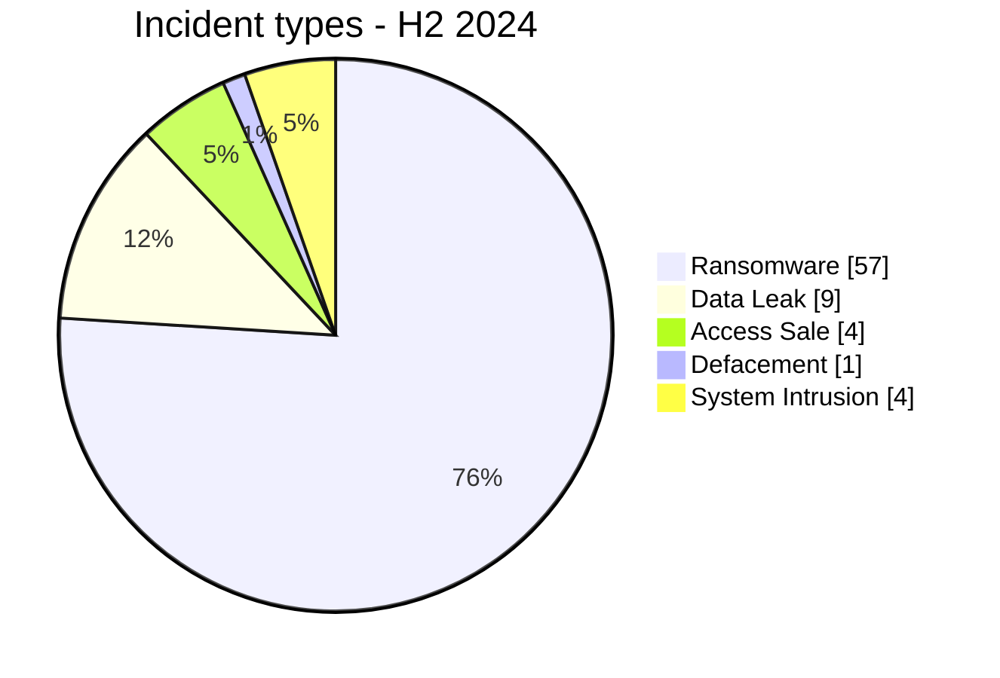

# AFRINTEL Semiannual CTI Report - Cyber Threats in Africa - H2 2024

## 1. Executive summary

Across July-December 2024, AFRINTEL retains **75 canonical incidents across 28 countries**. Ransomware accounts for **57 records (76.0%)**, followed by Data Leak **9 (12.0%)**.

### 1.1 H1 vs H2 2024 comparison

| Indicator | H1 2024 | H2 2024 | Change |
|---|---|---|---|
| Total | 45 | 75 | +30 (+66.7%) |
| Ransomware | 34 | 57 | +23 (+67.6%) |
| Data Leak | 4 | 9 | +5 (+125.0%) |
| Access Sale | 1 | 4 | +3 (+300.0%) |
| DDoS | 2 | 0 | -2 (-100.0%) |
| Defacement | 0 | 1 | +1 (new) |
| Account Takeover | 0 | 0 | Stable |
| System Intrusion | 3 | 4 | +1 (+33.3%) |
| Malware | 0 | 0 | Stable |
| Operational Fraud | 1 | 0 | -1 (-100.0%) |

H2 contains **75 incidents versus 45 in H1**, an increase of 30 records. This is corpus visibility, not a claim of an equivalent increase in real compromises.

## 2. Methodology

The same taxonomy, date policy, and evidence rules used in monthly reports apply. Historical reposts and duplicates are excluded from canonical statistics but retained separately.

## 3. Monthly evolution

| Month | Total | Ransomware | Data Leak | Access Sale | DDoS | Defacement | Account Takeover | System Intrusion | Malware | Operational Fraud |
|---|---|---|---|---|---|---|---|---|---|---|
| July | 11 | 7 | 2 | 1 | 0 | 0 | 0 | 1 | 0 | 0 |
| August | 16 | 14 | 1 | 0 | 0 | 0 | 0 | 1 | 0 | 0 |
| September | 6 | 5 | 0 | 0 | 0 | 0 | 0 | 1 | 0 | 0 |
| October | 11 | 8 | 2 | 0 | 0 | 0 | 0 | 1 | 0 | 0 |
| November | 15 | 12 | 1 | 2 | 0 | 0 | 0 | 0 | 0 | 0 |
| December | 16 | 11 | 3 | 1 | 0 | 1 | 0 | 0 | 0 | 0 |

## 4. Incident types

| Type | Records | Share |
|---|---|---|
| Ransomware | 57 | 76.0% |
| Data Leak | 9 | 12.0% |
| Access Sale | 4 | 5.3% |
| DDoS | 0 | 0.0% |
| Defacement | 1 | 1.3% |
| Account Takeover | 0 | 0.0% |
| System Intrusion | 4 | 5.3% |
| Malware | 0 | 0.0% |
| Operational Fraud | 0 | 0.0% |

```mermaid
pie showData
    title Incident types - H2 2024
    "Ransomware" : 57
    "Data Leak" : 9
    "Access Sale" : 4
    "Defacement" : 1
    "System Intrusion" : 4
```

## 5. Geographic distribution

| Country | Records | Share |
|---|---|---|
| South Africa | 18 | 24.0% |
| Egypt | 7 | 9.3% |
| Nigeria | 6 | 8.0% |
| Tunisia | 4 | 5.3% |
| Kenya | 4 | 5.3% |
| Algeria | 3 | 4.0% |
| Uganda | 1 | 1.3% |
| Zimbabwe | 3 | 4.0% |
| Ethiopia | 2 | 2.7% |
| Morocco | 2 | 2.7% |
| Seychelles | 2 | 2.7% |
| Ghana | 2 | 2.7% |
| Cameroon | 2 | 2.7% |
| Tanzania | 2 | 2.7% |
| Sudan | 2 | 2.7% |
| Burkina Faso | 2 | 2.7% |
| Namibia | 2 | 2.7% |
| Ivory Coast | 1 | 1.3% |
| Djibouti | 1 | 1.3% |
| Senegal | 1 | 1.3% |
| Mauritius | 1 | 1.3% |
| Angola | 1 | 1.3% |
| Mozambique | 1 | 1.3% |
| Madagascar | 1 | 1.3% |
| Libya | 1 | 1.3% |
| Mauritania | 1 | 1.3% |
| Zambia | 1 | 1.3% |
| Botswana | 1 | 1.3% |

## 6. Regions

| Region | Records | Share |
|---|---|---|
| Southern Africa | 27 | 36.0% |
| North Africa | 18 | 24.0% |
| West Africa | 12 | 16.0% |
| East Africa | 12 | 16.0% |
| Indian Ocean | 4 | 5.3% |
| Central Africa | 2 | 2.7% |

## 7. Sectors

| Sector | Records | Share |
|---|---|---|
| Finance / Banking | 10 | 13.3% |
| Government / Administration | 10 | 13.3% |
| Professional / Business Services | 8 | 10.7% |
| Manufacturing / Industry | 7 | 9.3% |
| Healthcare / Medical | 6 | 8.0% |
| Technology / IT | 6 | 8.0% |
| Retail / E-commerce | 5 | 6.7% |
| Telecommunications | 5 | 6.7% |
| Education / University | 5 | 6.7% |
| Transport / Logistics | 3 | 4.0% |
| Aviation | 3 | 4.0% |
| Agriculture / Agribusiness | 2 | 2.7% |
| Defense / Security | 1 | 1.3% |
| Mining / Extractive Industries | 1 | 1.3% |
| Energy / Utilities | 1 | 1.3% |
| Legal / Justice | 1 | 1.3% |
| Water / Utilities | 1 | 1.3% |

## 8. Actors / groups

| Actor / Group | Records |
|---|---|
| killsec | 10 |
| Unknown | 8 |
| ransomhub | 8 |
| hunters | 4 |
| lockbit3 | 3 |
| darkvault | 3 |
| spacebears | 3 |
| sarcoma | 3 |
| 303 | 1 |

## 9. Evidence maturity

| Evidence | Records | Share |
|---|---|---|
| Claim - Unverified | 55 | 73.3% |
| Claim - Data Sample Published | 12 | 16.0% |
| Confirmed | 5 | 6.7% |
| Corroborated | 2 | 2.7% |
| Attempted | 1 | 1.3% |

## 10. CTI analysis

- **Ransomware: 57**. Leak-site presence does not always prove encryption.
- **Data Leak: 9**. Historical reposts are excluded from the year; samples remain distinct from aggregate claims.
- **System Intrusion: 4**. Used where intrusion/access is better supported than ransomware or data exposure.
- **Access Sale: 4**, **DDoS: 0**, **Defacement: 1**, **Operational Fraud: 0**.

## 11. Key findings

Evidence maturity and incident type remain separate analytical dimensions.

## 12. Intelligence gaps

Initial vectors, technical dates, exact volumes, exfiltration, and public DFIR conclusions remain incomplete for part of the corpus.

## 13. Recommendations

Phishing-resistant MFA, PAM, segmentation, immutable backups, centralized logging, and separate tracking of historical reposts.

## 14. Conclusion

H2 2024 retains **75 canonical incidents**.

**AFRINTEL** - TLP:CLEAR
