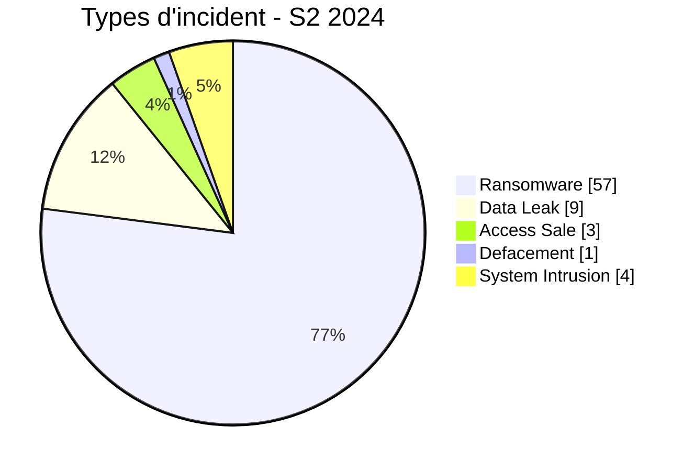

# Rapport CTI semestriel AFRINTEL - Cybermenaces en Afrique - S2 2024

## 1. Synthèse exécutive

Sur juillet-décembre 2024, AFRINTEL retient **74 incidents canoniques dans 27 pays**. Le ransomware représente **57 fiches (77,0 %)**, devant Data Leak **9 (12,2 %)**. Les pays les plus représentés sont **Afrique du Sud (18)**, **Égypte (7)**, **Nigeria (6)**.

### 1.1 Comparaison S1 vs S2 2024

| Indicateur | S1 2024 | S2 2024 | Évolution |
|---|---|---|---|
| Total | 45 | 74 | +29 (+64,4 %) |
| Ransomware | 34 | 57 | +23 (+67,6 %) |
| Data Leak | 4 | 9 | +5 (+125,0 %) |
| Access Sale | 1 | 3 | +2 (+200,0 %) |
| DDoS | 2 | 0 | -2 (-100,0 %) |
| Defacement | 0 | 1 | +1 (nouveau) |
| Account Takeover | 0 | 0 | Stable |
| System Intrusion | 3 | 4 | +1 (+33,3 %) |
| Malware | 0 | 0 | Stable |
| Operational Fraud | 1 | 0 | -1 (-100,0 %) |

Le S2 contient **74 incidents contre 45 au S1**, soit +29. Cette hausse est dominée par le ransomware et reflète la visibilité du corpus ; elle n'est pas présentée comme une hausse équivalente des compromissions réelles.

## 2. Méthodologie

Même taxonomie, même politique de dates et mêmes règles de preuve que les rapports mensuels. Les reposts historiques et doublons sont exclus des statistiques canoniques mais conservés dans des registres séparés.

## 3. Évolution mensuelle

| Mois | Total | Ransomware | Data Leak | Access Sale | DDoS | Defacement | Account Takeover | System Intrusion | Malware | Operational Fraud |
|---|---|---|---|---|---|---|---|---|---|---|
| Juillet | 10 | 7 | 2 | 0 | 0 | 0 | 0 | 1 | 0 | 0 |
| Août | 16 | 14 | 1 | 0 | 0 | 0 | 0 | 1 | 0 | 0 |
| Septembre | 6 | 5 | 0 | 0 | 0 | 0 | 0 | 1 | 0 | 0 |
| Octobre | 11 | 8 | 2 | 0 | 0 | 0 | 0 | 1 | 0 | 0 |
| Novembre | 15 | 12 | 1 | 2 | 0 | 0 | 0 | 0 | 0 | 0 |
| Décembre | 16 | 11 | 3 | 1 | 0 | 1 | 0 | 0 | 0 | 0 |

## 4. Types d'incident

| Type | Fiches | Part |
|---|---|---|
| Ransomware | 57 | 77,0 % |
| Data Leak | 9 | 12,2 % |
| Access Sale | 3 | 4,1 % |
| DDoS | 0 | 0,0 % |
| Defacement | 1 | 1,4 % |
| Account Takeover | 0 | 0,0 % |
| System Intrusion | 4 | 5,4 % |
| Malware | 0 | 0,0 % |
| Operational Fraud | 0 | 0,0 % |

## 5. Répartition géographique

| Pays | Fiches | Part |
|---|---|---|
| Afrique du Sud | 18 | 24,3 % |
| Égypte | 7 | 9,5 % |
| Nigeria | 6 | 8,1 % |
| Tunisie | 4 | 5,4 % |
| Kenya | 4 | 5,4 % |
| Algérie | 3 | 4,1 % |
| Zimbabwe | 3 | 4,1 % |
| Éthiopie | 2 | 2,7 % |
| Maroc | 2 | 2,7 % |
| Seychelles | 2 | 2,7 % |
| Ghana | 2 | 2,7 % |
| Cameroun | 2 | 2,7 % |
| Tanzanie | 2 | 2,7 % |
| Soudan | 2 | 2,7 % |
| Burkina Faso | 2 | 2,7 % |
| Namibie | 2 | 2,7 % |
| Côte d'Ivoire | 1 | 1,4 % |
| Djibouti | 1 | 1,4 % |
| Sénégal | 1 | 1,4 % |
| Maurice | 1 | 1,4 % |
| Angola | 1 | 1,4 % |
| Mozambique | 1 | 1,4 % |
| Madagascar | 1 | 1,4 % |
| Libye | 1 | 1,4 % |
| Mauritanie | 1 | 1,4 % |
| Zambie | 1 | 1,4 % |
| Botswana | 1 | 1,4 % |

## 6. Régions

| Région | Fiches | Part |
|---|---|---|
| Afrique australe | 27 | 36,5 % |
| Afrique du Nord | 18 | 24,3 % |
| Afrique de l'Ouest | 12 | 16,2 % |
| Afrique de l'Est | 11 | 14,9 % |
| Océan Indien | 4 | 5,4 % |
| Afrique centrale | 2 | 2,7 % |

## 7. Secteurs

| Secteur | Fiches | Part |
|---|---|---|
| Finance / Banque | 10 | 13,5 % |
| Gouvernement / Administration | 9 | 12,2 % |
| Services professionnels / Business | 8 | 10,8 % |
| Industrie / Fabrication | 7 | 9,5 % |
| Santé / Médical | 6 | 8,1 % |
| Technologie / IT | 6 | 8,1 % |
| Commerce / E-commerce | 5 | 6,8 % |
| Télécommunications | 5 | 6,8 % |
| Éducation / Université | 5 | 6,8 % |
| Transport / Logistique | 3 | 4,1 % |
| Aviation | 3 | 4,1 % |
| Agriculture / Agro-industrie | 2 | 2,7 % |
| Défense / Sécurité | 1 | 1,4 % |
| Mines / Industries extractives | 1 | 1,4 % |
| Énergie / Services publics | 1 | 1,4 % |
| Juridique / Justice | 1 | 1,4 % |
| Eau / Services publics | 1 | 1,4 % |

## 8. Acteurs / groupes

| Acteur / Groupe | Fiches |
|---|---|
| killsec | 10 |
| Unknown | 8 |
| ransomhub | 8 |
| hunters | 4 |
| lockbit3 | 3 |
| darkvault | 3 |
| spacebears | 3 |
| sarcoma | 3 |

## 9. Maturité des preuves

| Preuve | Fiches | Part |
|---|---|---|
| Claim - Unverified | 54 | 73,0 % |
| Claim - Data Sample Published | 12 | 16,2 % |
| Confirmed | 5 | 6,8 % |
| Corroborated | 2 | 2,7 % |
| Attempted | 1 | 1,4 % |

## 10. Analyse CTI

- **Ransomware : 57**. Une présence sur leak site ne prouve pas toujours le chiffrement.
- **Data Leak : 9**. Les republications historiques sont sorties des statistiques, les échantillons restant séparés des volumes revendiqués.
- **System Intrusion : 4**. Utilisé lorsque l'accès/intrusion est mieux soutenu qu'un ransomware ou une fuite.
- **Access Sale : 3**, **DDoS : 0**, **Defacement : 1**, **Operational Fraud : 0**.

## 11. Principaux constats

- top secteurs : Finance / Banque (10), Gouvernement / Administration (9), Services professionnels / Business (8);
- top acteurs/labels : killsec (10), Unknown (8), ransomhub (8), hunters (4), lockbit3 (3);
- `Unknown` reste une absence d'attribution ;
- la maturité de preuve doit être lue séparément du type technique.

## 12. Intelligence gaps

Vecteurs initiaux, dates techniques, volumes exacts, exfiltration et conclusions DFIR restent incomplets pour une partie du corpus.

## 13. Recommandations

MFA résistante au phishing, PAM, segmentation, sauvegardes immuables, centralisation des journaux et suivi séparé des reposts historiques.

## 14. Conclusion

Le S2 2024 retient **74 incidents canoniques**.

**AFRINTEL** - TLP:CLEAR
