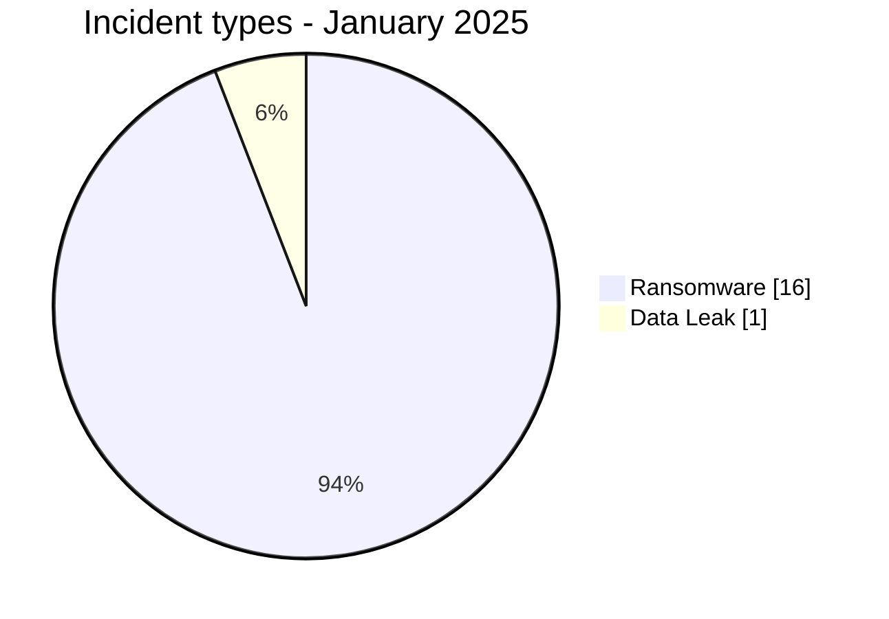
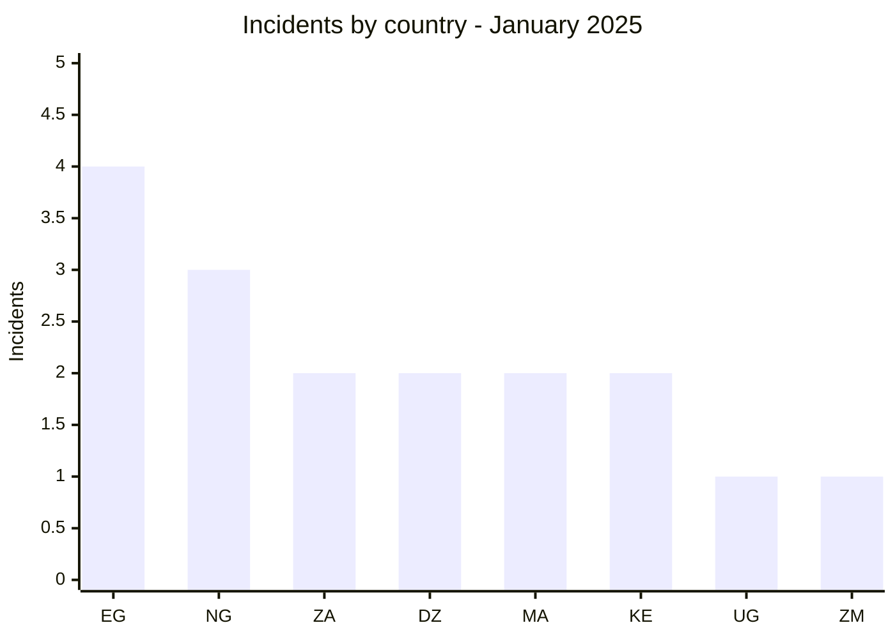
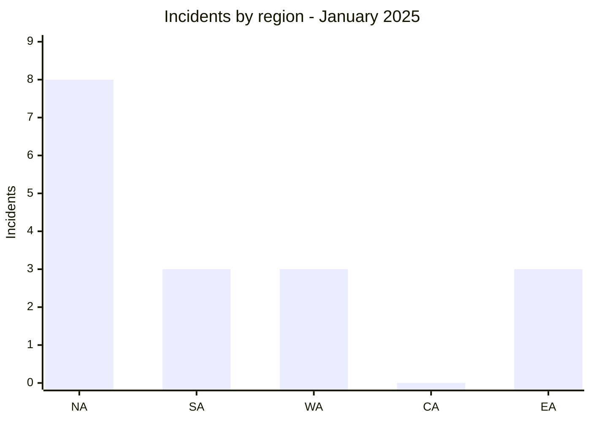
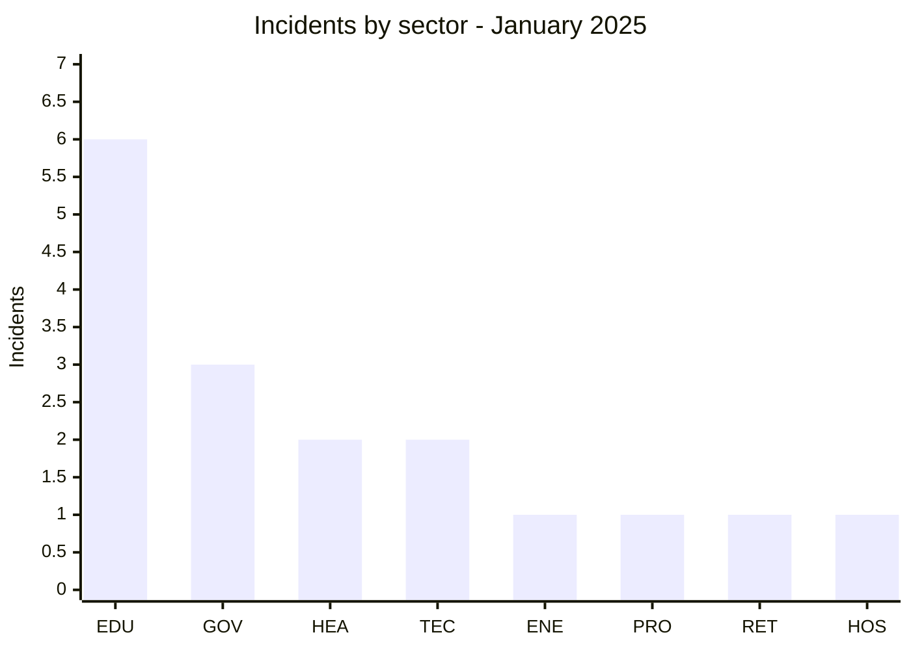
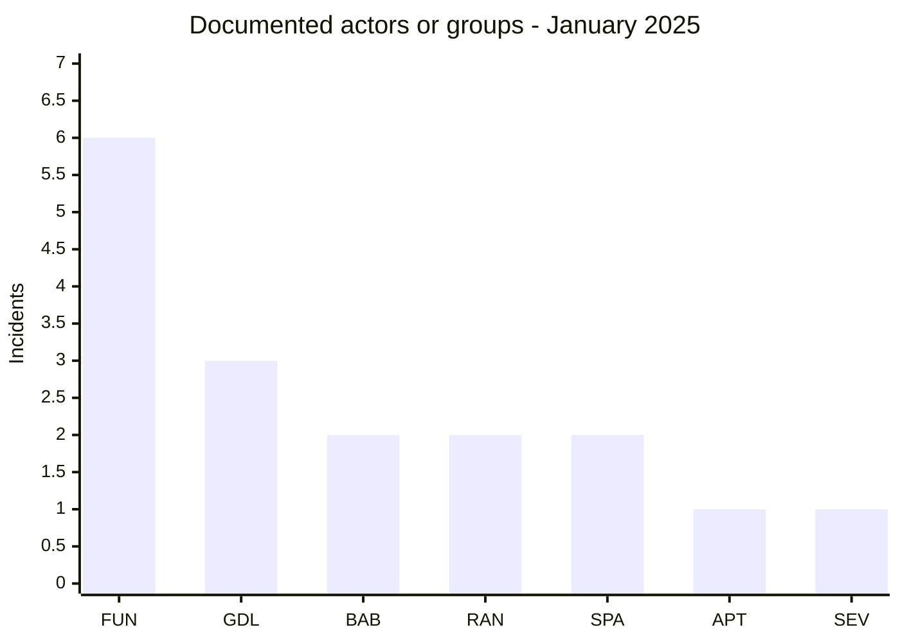
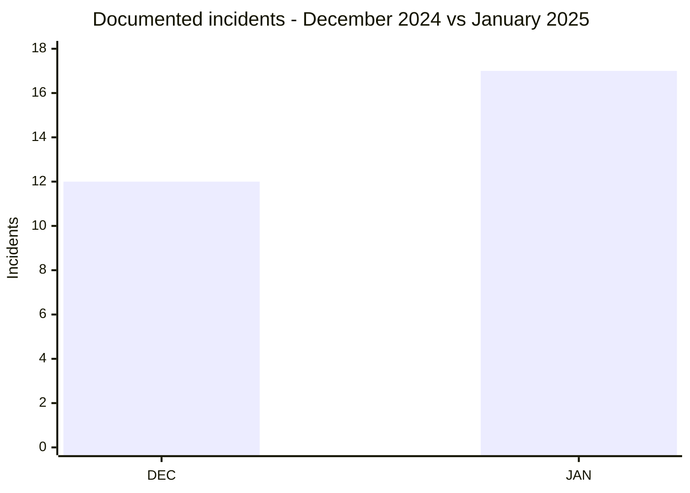

# CTI Report - Cyberattacks in Africa - January 2025

👉🏾 [**French version available here**](./README_FR.md)

## 1. Executive summary

January 2025 contains **17 documented incidents across 8 African countries**. The corpus includes **16 Ransomware** and **1 Data Leak**, with the new Data Leak record concerning **North-West University (NWU)** in South Africa. A publication attributed to SevenZeroDay404 advertises approximately 29,000 student records, but analysis of the sample does not establish that the dataset originated from NWU systems or validate the claimed overall volume.

- **17 incidents**: 16 Ransomware, 1 Data Leak.
- **8 countries**: Egypt (4), Nigeria (3), South Africa (2), Algeria (2), Morocco (2), Kenya (2), Uganda (1), Zambia (1).
- **7 documented actor/group labels**: funksec (6), GDLockerSec (3), babuk2 (2), ransomhub (2), spacebears (2), apt73 (1), SevenZeroDay404 (1).
- **Most represented sector**: Education / University with 6 incidents.
- **Notable claimed volumes**: approximately 1.5 TB for INTELS Nigeria, 19 GB for Molars Dental and 29,000 records for NWU. These claims remain distinct from quantities actually observed.

### 📋 Victim list

👉🏾 [View the full victim list](./victims.md)

### 1.1 Month-over-month comparison

> The comparison covers publications documented by AFRINTEL. The supplied December 2024 report supports a total of 12 incidents, but does not provide a comparable structured breakdown across the six AFRINTEL incident types.

| Indicator | December 2024 | January 2025 | Observed change |
|---|---:|---:|---:|
| Total incidents | 12 | 17 | **+5 (+41.7%)** |
| Ransomware | N/A | 16 | **N/A** |
| Data Leak | N/A | 1 | **N/A** |
| Access Sale | N/A | 0 | **N/A** |
| DDoS | N/A | 0 | **N/A** |
| Defacement | N/A | 0 | **N/A** |
| Operational Fraud | N/A | 0 | **N/A** |

> Previous-month categories are not reconstructed by inference. The total rises from 12 to 17, or **+5 (+41.7%)**.

## 2. Methodology

- **Scope**: 54 African countries.
- **Period**: 1-31 January 2025, using the publication or detection date recorded in the incident cards.
- **Sources**: OSINT, leak sites, underground forums, actor publications and supplied samples when available.
- **Source of truth**: the validated bilingual pair [`victims_FR.md`](./victims_FR.md) / [`victims.md`](./victims.md), with editorial review performed first in French.
- **Qualification**: an actor claim, a published sample and independent confirmation are treated as distinct evidence levels.
- **Counting**: each incident card counts once in the monthly total.

## 3. Global overview

### 3.1 Incident-type distribution

| Incident type | Count | Share |
|---|---:|---:|
| Ransomware | 16 | 94.1% |
| Data Leak | 1 | 5.9% |
| Access Sale | 0 | 0.0% |
| DDoS | 0 | 0.0% |
| Defacement | 0 | 0.0% |
| Operational Fraud | 0 | 0.0% |
| **Total** | **17** | **100%** |

**Color convention:** 🟧 Ransomware | 🟦 Data Leak | 🟪 Access Sale | 🟥 DDoS | 🟨 Defacement | 🟩 Operational Fraud.

### 3.2 Country distribution

| Country | Ransomware | Data Leak | Total | Distribution |
|---|---:|---:|---:|---|
| Egypt | 4 | 0 | 4 | 🟧🟧🟧🟧 |
| Nigeria | 3 | 0 | 3 | 🟧🟧🟧 |
| South Africa | 1 | 1 | 2 | 🟧🟦 |
| Algeria | 2 | 0 | 2 | 🟧🟧 |
| Morocco | 2 | 0 | 2 | 🟧🟧 |
| Kenya | 2 | 0 | 2 | 🟧🟧 |
| Uganda | 1 | 0 | 1 | 🟧 |
| Zambia | 1 | 0 | 1 | 🟧 |
| **Total** | **16** | **1** | **17** | |

**Legend:** `EG` = Egypt | `NG` = Nigeria | `ZA` = South Africa | `DZ` = Algeria | `MA` = Morocco | `KE` = Kenya | `UG` = Uganda | `ZM` = Zambia

### 3.3 Ransomware versus Data Leak by country

```mermaid
xychart-beta
    title "Ransomware vs Data Leak by country - January 2025"
    x-axis ["EG", "NG", "ZA", "DZ", "MA", "KE", "UG", "ZM"]
    y-axis "Incidents" 0 --> 5
    bar [4, 3, 1, 2, 2, 2, 1, 1]
    bar [0, 0, 1, 0, 0, 0, 0, 0]
```

**Series legend:** first series = 🟧 Ransomware | second series = 🟦 Data Leak.  
**Countries:** `EG` = Egypt | `NG` = Nigeria | `ZA` = South Africa | `DZ` = Algeria | `MA` = Morocco | `KE` = Kenya | `UG` = Uganda | `ZM` = Zambia

### 3.4 Geographic distribution by region

| Region | Incidents | Share |
|---|---:|---:|
| North Africa | 8 | 47.1% |
| Southern Africa | 3 | 17.6% |
| West Africa | 3 | 17.6% |
| Central Africa | 0 | 0.0% |
| East Africa | 3 | 17.6% |
| **Total** | **17** | **100%** |

**Legend:** `NA` = North Africa | `SA` = Southern Africa | `WA` = West Africa | `CA` = Central Africa | `EA` = East Africa

### 3.5 Sector distribution

| Sector | Incidents | Share | Activity |
|---|---:|---:|---|
| Education / University | 6 | 35.3% | ██████████ |
| Government / Administration | 3 | 17.6% | █████ |
| Healthcare / Medical | 2 | 11.8% | ███ |
| Technology / IT | 2 | 11.8% | ███ |
| Energy / Utilities | 1 | 5.9% | ██ |
| Professional / Business Services | 1 | 5.9% | ██ |
| Retail / E-commerce | 1 | 5.9% | ██ |
| Hospitality / Tourism | 1 | 5.9% | ██ |
| **Total** | **17** | **100%** | |

**Legend:** `EDU` = Education / University | `GOV` = Government / Administration | `HEA` = Healthcare / Medical | `TEC` = Technology / IT | `ENE` = Energy / Utilities | `PRO` = Professional / Business Services | `RET` = Retail / E-commerce | `HOS` = Hospitality / Tourism

### 3.6 Documented actors / groups

| Actor / Group | Incidents | Activity |
|---|---:|---|
| funksec | 6 | ██████████ |
| GDLockerSec | 3 | █████ |
| babuk2 | 2 | ███ |
| ransomhub | 2 | ███ |
| spacebears | 2 | ███ |
| apt73 | 1 | ██ |
| SevenZeroDay404 | 1 | ██ |
| **Total** | **17** | |

**Legend:** `FUN` = funksec | `GDL` = GDLockerSec | `BAB` = babuk2 | `RAN` = ransomhub | `SPA` = spacebears | `APT` = apt73 | `SEV` = SevenZeroDay404

## 4. Detailed analysis by incident type

### 4.1 Ransomware - 16 incidents

The 16 Ransomware records involve six groups or labels: funksec (6), GDLockerSec (3), babuk2 (2), ransomhub (2), spacebears (2) and apt73 (1). The Ransomware classification describes the publication or extortion context recorded in the victim cards and does not imply that encryption occurred in every case.

Several records contain reviewed material beyond a simple listing: GAGS, MTS, LNRBDA, USMBA, Achievers Journal, QED, Workers and Molars include samples or technical evidence described in the victim cards. Evidence levels remain incident-specific.

### 4.2 Data Leak - 1 incident

**🇿🇦 North-West University (NWU)** is the only January record classified as Data Leak. SevenZeroDay404 presents a database titled **"29K NWU Student Database"** with a sample containing names, GPA values, academic programmes and study years. Review identifies 2,893 occurrences of structured GPA values, but no explicit marker directly linking the data to `nwu.ac.za` was identified in the sample. NWU is therefore the claimed victim, while the dataset origin and the 29,000-record volume remain independently unconfirmed.

## 5. Sectoral impact

**Education / University** becomes the most represented sector with **6 of 17 incidents (35.3%)** after the addition of NWU. **Government / Administration** follows with 3 incidents. Healthcare and Technology each account for 2 incidents.

This concentration describes the January 2025 AFRINTEL corpus and is not sufficient to establish a coordinated campaign against the education sector.

## 6. Threat actor profile

### 6.1 Profile

funksec remains the most visible label with **6 records**, followed by GDLockerSec with 3. SevenZeroDay404 appears once, associated with the NWU Data Leak publication.

Publication frequency does not demonstrate actor coordination or superior technical capability.

### 6.2 Risk assessment

| Country | Risk signal in the corpus |
|---|---|
| Egypt | 4 incidents, including multiple public-sector and education organizations |
| Nigeria | 3 incidents, including a federal agency and oil-sector services |
| South Africa | 2 incidents across retail and higher education |
| Uganda | 1 incident, but with large-scale contact exposure and administrator access described in the QED card |
| Algeria, Morocco, Kenya | 2 incidents each across education, healthcare or technology |
| Zambia | 1 incident with a structured backend database described in the Workers card |

This table supports validation and monitoring priorities. It is not a measure of nationwide compromise.

## 7. Key trends and intelligence gaps

### 7.1 Observed trends

1. **Education leads the corpus**: 6 of 17 records concern education, universities or research.
2. **Funksec remains the most frequent label**: 6 records, or 35.3% of the corpus.
3. **Incident-type diversification**: the NWU addition introduces the first Data Leak record into January, which is no longer an all-ransomware corpus.
4. **Geographic concentration**: Egypt, Nigeria, South Africa, Algeria, Morocco and Kenya account for 15 of 17 records.

### 7.2 Intelligence gaps

- The technical origin of the sample attributed to NWU is not confirmed by a direct marker in the reviewed data.
- Actor-claimed volumes cannot always be verified from the available samples.
- Initial access vectors and operational impact remain unknown for several cases.
- A structured incident-type breakdown for December 2024 is not available in the supplied files, preventing a reliable category-level comparison.

### 7.3 Monthly evolution

**Legend:** `DEC` = December 2024 | `JAN` = January 2025.

The documented total increases from **12 to 17**, or **+5 (+41.7%)**. This describes AFRINTEL's monitored public corpus and does not by itself establish an equivalent rise in the real number of compromises.

## 8. MITRE ATT&CK mapping - contextual

| Phase | Technique | Analytical scope |
|---|---|---|
| Initial access | T1190 - Exploit Public-Facing Application | Relevant to the GAGS case where an SQL injection pattern is visible; the full exploitation chain is not established. |
| Collection | T1005 - Data from Local System | Defensive context for cases containing internal exports or data; does not prove each actor's collection method. |
| Collection | T1213 - Data from Information Repositories | Relevant where reviewed material corresponds to structured databases or repositories. |

> These techniques are used as defensive mappings. No ATT&CK mapping is assigned to the NWU case because the available material does not establish the access or collection method.

## 9. Recommendations

- **Education and research**: require phishing-resistant MFA for administrative accounts, segment student and research systems, control bulk exports and monitor privileged accounts.
- **Public administrations**: strengthen exposed-application security, code review and administrative-access logging.
- **Organizations processing personal data**: apply data minimization, encryption, access governance and monitoring for large exports.
- **CTI validation**: keep actor-claimed volumes, actually reviewed data and independent confirmations as separate evidence dimensions.

## 10. SOC and tactical recommendations

### Observed

The cards document data publications, structured exports, visible administrator access and, for GAGS, an SQL injection pattern in reviewed material.

### Assumptions

The initial vector remains unknown for several incidents. Do not automatically attribute these cases to phishing, vulnerability exploitation or credential theft without incident-specific evidence.

### Preventive

Monitor administrative authentication, account creation, database exports, large outbound transfers, unusual access to student systems, public-facing applications and messaging platforms. Maintain MFA, least privilege, segmentation, tested backups and rapid revocation of suspicious access.

## 11. Strategic recommendations

1. Prioritize resilience in the education sector, which accounts for more than one-third of the month's records.
2. Strengthen regional information sharing between universities, CERTs and public administrations.
3. Record evidence levels systematically to distinguish actor publication, reviewed sample and victim confirmation.
4. Keep AFRINTEL statistics tied to the observed corpus rather than presenting them as an exhaustive measure of real cyber activity in Africa.

## 12. Conclusion

January 2025 now contains **17 documented incidents** across **8 countries**, split into **16 Ransomware** and **1 Data Leak**. The addition of North-West University raises South Africa to **2 incidents** and Education / University to **6 incidents**.

funksec remains the most frequent label with 6 records. The new NWU publication is attributed to SevenZeroDay404, but the supplied sample does not independently establish that it originated from the university's systems or validate the claimed 29,000 records.

**AFRINTEL** - Open African CTI Monitoring Initiative
