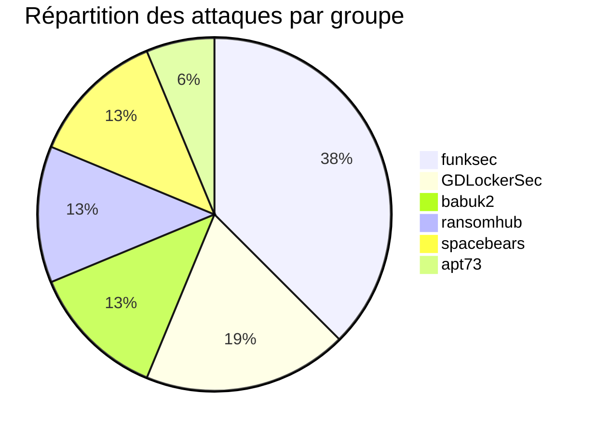
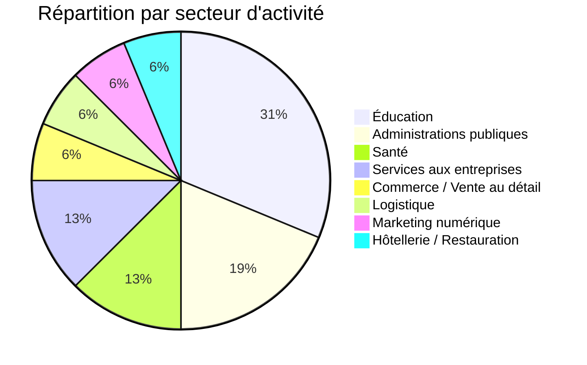
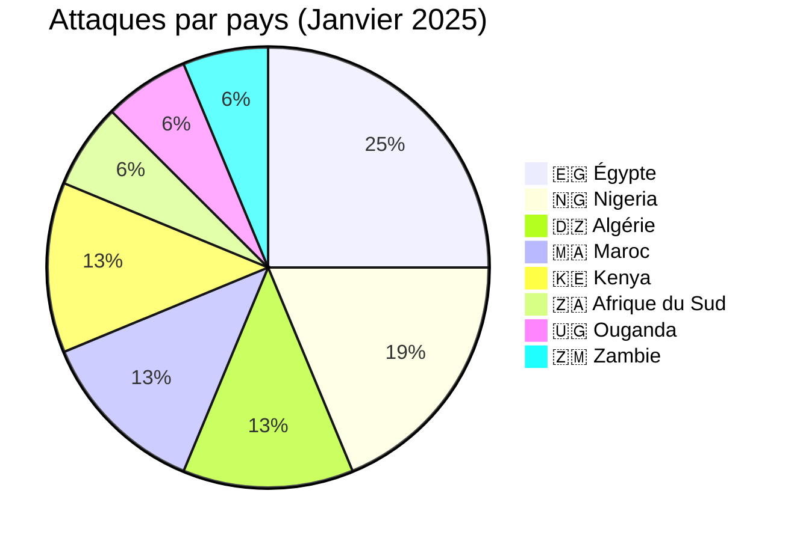
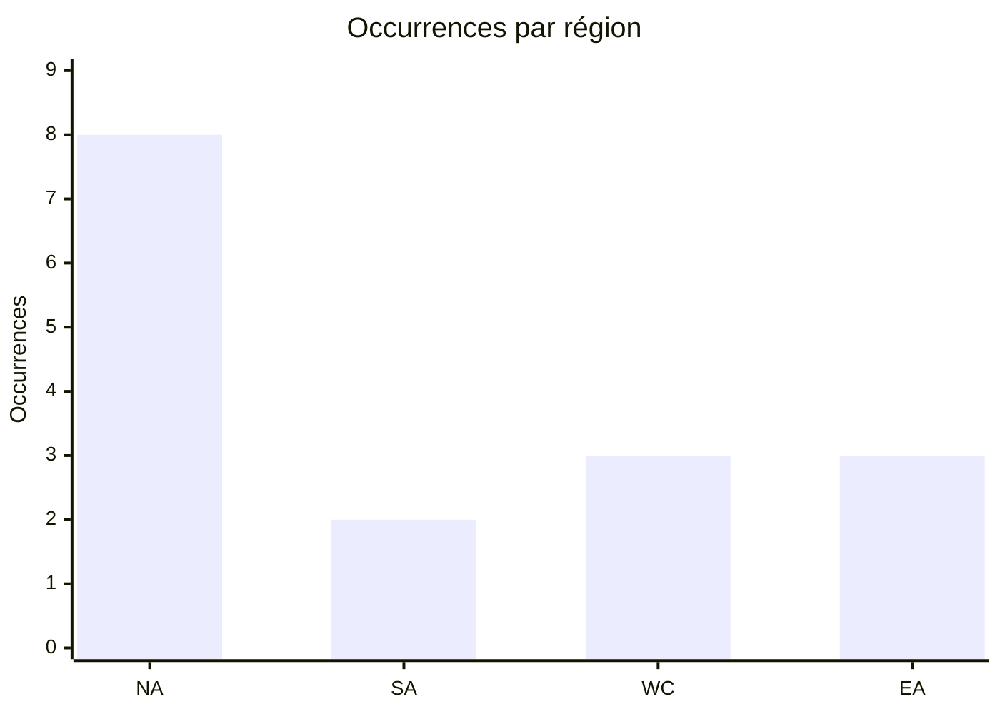
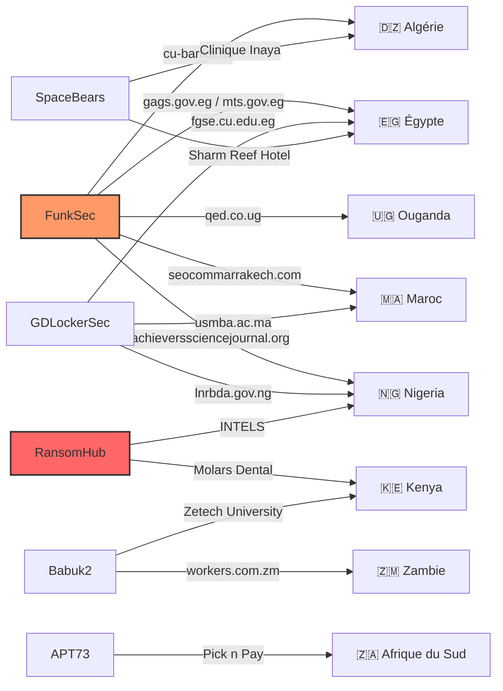
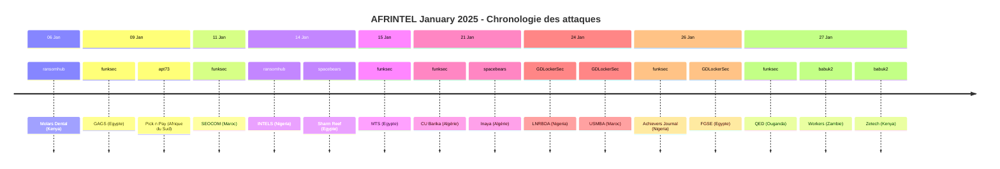

[](https://github.com/Hatchepsoute/AFRINTEL)


 

# Rapport CTI : Cyberattaques en Afrique - Janvier 2025
👉🏾 [**English version available here** ](./README.md)
## 1. Introduction
Ce rapport de Cyber Threat Intelligence (CTI) présente une analyse détaillée des cyberattaques survenues en Afrique durant le mois de janvier 2025. Les informations sont issues de sources OSINT et de sites de fuites de groupes ransomware, compilées dans le cadre du projet AFRINTEL. L'objectif est de fournir une vision claire des tendances, des acteurs menaçants, des secteurs ciblés et des indicateurs de compromission associés.

## 2. Résumé exécutif
- **Nombre total d'attaques recensées** : 16
- **Groupes ransomware les plus actifs** : funksec (6 attaques), GDLockerSec (3), babuk2 (2), ransomhub (2), spacebears (2), apt73 (1).
- **Secteurs les plus ciblés** : Éducation (5), Administrations publiques (3), Santé (2), Services aux entreprises (2), Commerce de détail (1), Logistique (1), Marketing (1), Hôtellerie (1).
- **Pays les plus touchés** : Égypte (4), Nigeria (3), Algérie (2), Maroc (2), Kenya (2), Afrique du Sud (1), Ouganda (1), Zambie (1).
- **Volume de données exfiltrées** : Au moins 1,5 To pour INTELS Nigeria, 19 Go pour molars.co.ke. Les autres volumes ne sont pas précisés.

## 3. Statistiques clés

### 3.1 Répartition par groupe ransomware
| Groupe ransomware | Nombre d'attaques |
|-------------------|-------------------|
| funksec           | 6                 |
| GDLockerSec       | 3                 |
| babuk2            | 2                 |
| ransomhub         | 2                 |
| spacebears        | 2                 |
| apt73             | 1                 |
| **Total**         | **16**            |


### 3.2 Répartition par secteur d'activité
| Secteur | Nombre d'attaques |
|---------|-------------------|
| Éducation | 5 |
| Administrations publiques | 3 |
| Santé | 2 |
| Services aux entreprises | 2 |
| Commerce de détail | 1 |
| Logistique | 1 |
| Marketing digital | 1 |
| Hôtellerie | 1 |
| **Total** | **16** |


### 3.3 Répartition par pays
| Pays | Nombre d'attaques |
|------|-------------------|
|🇪🇬 Égypte | 4 |
|🇳🇬 Nigeria | 3 |
|🇩🇿  Algérie | 2 |
|🇲🇦  Maroc | 2 |
|🇰🇪 Kenya | 2 |
|🇿🇦  Afrique du Sud | 1 |
|🇺🇬 Ouganda | 1 |
|🇿🇲 Zambie | 1 |
| **Total** | **16** |


### 3.4 Carte CTI Afrique
Une carte des attaques.
- 🇪🇬 Egypte          	    ████   4
- 🇳🇬 Nigeria             	     ███      3
- 🇲🇦 Maroc      	             ██         2
- 🇰🇪 Kenya              	     ██         2
- 🇩🇿Algerie         	       ██         2
- 🇿🇦 South Africa 	    █            1
- 🇺🇬 Uganda   		       █            1
- 🇿🇲 Zambie      	         █            1


<!-- AFRINTEL_CURRENT_MODEL_START -->
### 3.4 Vue globale standardisée

| Pays | Ransomware | Exposition des données (fuites + accès) | Total | Distribution |
| :--- | ---: | ---: | ---: | :--- |
| 🇪🇬 Égypte | 4 | 0 | 4 | 🟧🟧🟧🟧 |
| 🇳🇬 Nigeria | 3 | 0 | 3 | 🟧🟧🟧 |
| 🇩🇿 Algérie | 2 | 0 | 2 | 🟧🟧 |
| 🇰🇪 Kenya | 2 | 0 | 2 | 🟧🟧 |
| 🇲🇦 Maroc | 2 | 0 | 2 | 🟧🟧 |
| 🇿🇦 Afrique du Sud | 1 | 0 | 1 | 🟧 |
| 🇺🇬 Ouganda | 1 | 0 | 1 | 🟧 |
| 🇿🇲 Zambie | 1 | 0 | 1 | 🟧 |

```pie
    title Types d’incidents
    "Ransomware" : 16
    "Fuites de données + ventes d’accès" : 0
```

### Vue agrégée mensuelle de l’exposition

La vue CTI mensuelle regroupe les fuites de données et les ventes d’accès sous **exposition des données** : **0 fiches** (0,0% du corpus mensuel). Les fiches sources restent la référence ; une vente d’accès ne prouve pas à elle seule l’exfiltration de données.


### Répartition géographique par région

| Région | Occurrences | Ransomware | Exposition des données (fuites + accès) | Distribution |
| :--- | ---: | ---: | ---: | :--- |
| Afrique du Nord | 8 | 8 | 0 | 🟧🟧🟧🟧🟧🟧🟧🟧 |
| Afrique australe | 2 | 2 | 0 | 🟧🟧 |
| Afrique de l’Ouest et centrale | 3 | 3 | 0 | 🟧🟧🟧 |
| Afrique de l’Est | 3 | 3 | 0 | 🟧🟧🟧 |


Légende : NA = Afrique du Nord ; SA = Afrique australe ; WC = Afrique de l’Ouest et centrale ; EA = Afrique de l’Est

### Répartition sectorielle

| Secteur | Fiches | Part | Activité |
| :--- | ---: | ---: | :--- |
| Éducation / universités | 5 | 31,2% | ██████████ |
| Gouvernement / administration | 3 | 18,8% | ██████ |
| Santé / médical | 3 | 18,8% | ██████ |
| Technologies / informatique | 2 | 12,5% | ████ |
| Énergie / services publics | 1 | 6,2% | ██ |
| Services professionnels | 1 | 6,2% | ██ |
| Commerce / e-commerce | 1 | 6,2% | ██ |

### Acteurs / groupes les plus présents

| Acteur / Groupe | Fiches | Activité |
| :--- | ---: | :--- |
| funksec | 6 | ██████████ |
| GDLockerSec | 3 | █████ |
| babuk2 | 2 | ███ |
| ransomhub | 2 | ███ |
| spacebears | 2 | ███ |
| apt73 | 1 | ██ |
<!-- AFRINTEL_CURRENT_MODEL_END -->
## 4. Détail des attaques par groupe ransomware

### 4.1 FunkSec (6 attaques)
- **09/01/2025** : gags.gov.eg (Égypte, administrations) - Claim - Data Sample Published, confiance élevée : accès authentifié au panneau d'administration observé, incluant un payload d'injection SQL.
- **11/01/2025** : seocommarrakech.com (Maroc, marketing)
- **15/01/2025** : mts.gov.eg (Égypte, administrations) - Claim - Data Sample Published, confiance élevée : rapports système internes (permis, trafic portuaire, recouvrement) examinés, datés de manière cohérente avec la revendication.
- **21/01/2025** : cu-barika.dz (Algérie, éducation)
- **26/01/2025** : achieverssciencejournal.org (Nigeria, éducation) - Claim - Data Sample Published, confiance élevée.
- **27/01/2025** : qed.co.ug (Ouganda, services aux entreprises/messagerie) - Claim - Data Sample Published, confiance très élevée : plus de 1,8 million d'enregistrements de contacts observés et compte administrateur « Funksec » auto-créé laissé dans l'application de la victime.

*Remarque* : funksec a ciblé principalement les administrations et l'éducation, avec une répartition géographique variée. Trois des six revendications (GAGS, MTS, QED) sont désormais corroborées par du matériel examiné plutôt que de reposer uniquement sur la publication du leak site.

### 4.2 GDLockerSec (3 attaques)
- **24/01/2025** : lnrbda.gov.ng (Nigeria, administrations)
- **24/01/2025** : usmba.ac.ma (Maroc, éducation)
- **26/01/2025** : fgse.cu.edu.eg (Égypte, éducation)

*Remarque* : GDLockerSec a frappé des institutions éducatives et gouvernementales, avec des volumes de données apparemment faibles (quelques Mo).

### 4.3 Babuk2 (2 attaques)
- **27/01/2025** : workers.com.zm (Zambie, services RH) - Claim - Data Sample Published, confiance élevée : un export complet de base de données WordPress/WooCommerce/GiveWP a été examiné ; le fichier examiné ne portait aucune marque propre à un acteur, l'attribution à babuk2 est donc conservée mais signalée pour vérification manuelle.
- **27/01/2025** : zetech.ac.ke (Kenya, éducation)

*Remarque* : babuk2 a ciblé une entreprise de services et une université.

### 4.4 Ransomhub (2 attaques)
- **06/01/2025** : molars.co.ke (Kenya, santé) - 19 Go exfiltrés
- **14/01/2025** : INTELS Nigeria (Nigeria, logistique) - 1,5 To exfiltrés

*Remarque* : ransomhub a réalisé deux attaques significatives avec des volumes de données importants, notamment sur une infrastructure critique nigériane.

### 4.5 Space Bears (2 attaques)
- **14/01/2025** : Sharm Reef Hotel (Égypte, hôtellerie)
- **21/01/2025** : Inaya Clinique (Algérie, santé)

*Remarque* : spacebears a ciblé le tourisme et la santé.

### 4.6 apt73 (1 attaque)
- **09/01/2025** : pnp.co.za (Afrique du Sud, commerce de détail) - Pick n Pay, un grand détaillant.

## 5. Analyse sectorielle
- **Éducation** : 5 attaques (universités, écoles, journaux académiques). Les groupes funksec, GDLockerSec et babuk2 sont particulièrement actifs dans ce secteur.
- **Administrations publiques** : 3 attaques (sites gouvernementaux, agences). funksec et GDLockerSec sont les principaux acteurs.
- **Santé** : 2 attaques (clinique dentaire, hôpital). Ransomhub et Spacebears.
- **Services aux entreprises** : 2 attaques (cabinet de conseil en Ouganda et services RH en Zambie). funksec et babuk2.
- **Commerce de détail** : 1 attaque (Pick n Pay) par apt73.
- **Logistique** : 1 attaque majeure (INTELS Nigeria) par Ransomhub.
- **Marketing** : 1 attaque (agence SEO) par Funksec.
- **Hôtellerie** : 1 attaque (hôtel) par Spacebears.

## 6. Analyse géographique
- **Égypte** : 4 attaques, principalement des administrations et éducation.
- **Nigeria** : 3 attaques, dont une critique sur le secteur pétrolier.
- **Algérie** : 2 attaques (éducation et santé).
- **Maroc** : 2 attaques (marketing et éducation).
- **Kenya** : 2 attaques (santé et éducation).
- **Afrique du Sud** : 1 attaque sur un grand distributeur.
- **Ouganda** : 1 attaque (conseil).
- **Zambie** : 1 attaque (services RH).

L'Afrique de l'Est et du Nord sont les plus touchées, avec une présence notable en Afrique de l'Ouest (Nigeria).

### 6.1. Graphe acteur → victime → pays

### 6.2. Timeline des attaques


## 7. TTPs observées
D'après les descriptions limitées, on peut noter :
- **Exfiltration de données** : Les groupes revendiquent des volumes importants (1,5 To pour INTELS, 19 Go pour molars).
- **Ciblage de secteurs spécifiques** : Les administrations et l'éducation sont privilégiées.
- **Utilisation de sites de fuite** : Les groupes publient des échantillons de données pour faire pression.
- **Diversité des groupes** : 6 groupes différents actifs en janvier 2025.

## 8. Recommandations
- **Secteur public** : Renforcer la sécurité des sites gouvernementaux et des établissements éducatifs, souvent vulnérables.
- **Secteur privé** : Les entreprises de logistique et de santé doivent prioriser la protection des données sensibles.
- **Surveillance des groupes** : Suivre les activités de funksec, GDLockerSec et ransomhub, qui semblent les plus prolifiques.
- **Sensibilisation** : Former les employés aux risques de phishing et d'ingénierie sociale, vecteurs d'accès initiaux probables.

## 9. Conclusion
Janvier 2025 a été marqué par une activité soutenue de plusieurs groupes ransomware en Afrique, avec un focus sur les institutions publiques et éducatives. Le groupe funksec se distingue par sa fréquence, tandis que ransomhub a réalisé l'attaque la plus volumineuse. La diversité des acteurs et des secteurs touchés souligne la nécessité d'une vigilance accrue et d'une coopération régionale en matière de cybersécurité.

## ✍🏿 Auteur
*Adama ASSIONGBON*  
*Consultant SOC & Cyber Threat Intelligence*  
[LinkedIn profile](https://www.linkedin.com/in/adama-assiongbon-9029893a/)

---
*AFRINTEL - Initiative ouverte de veille CTI sur l’Afrique*
