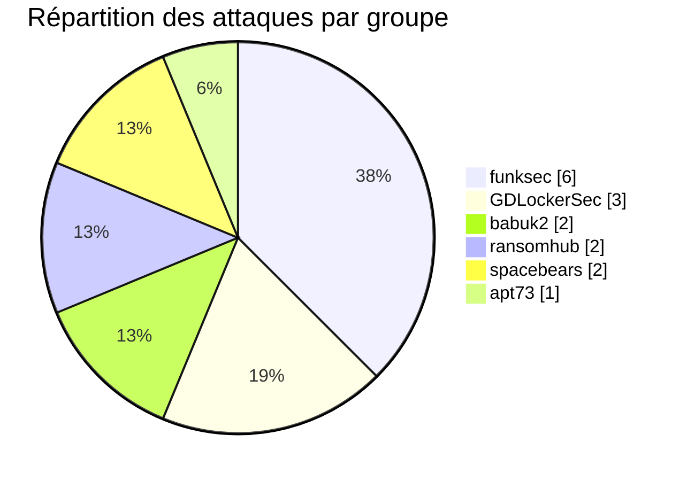
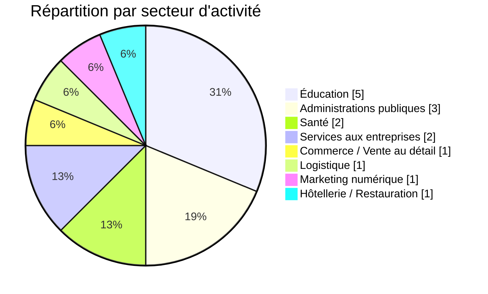
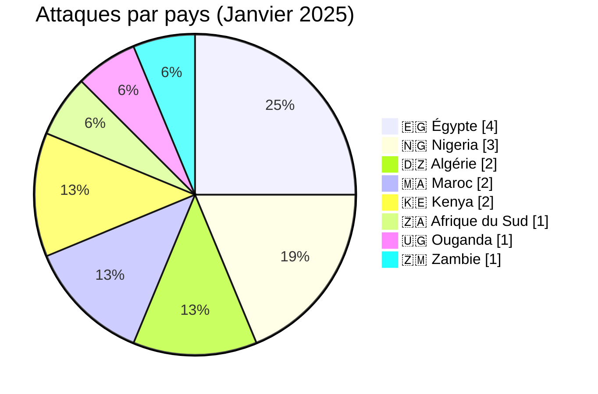
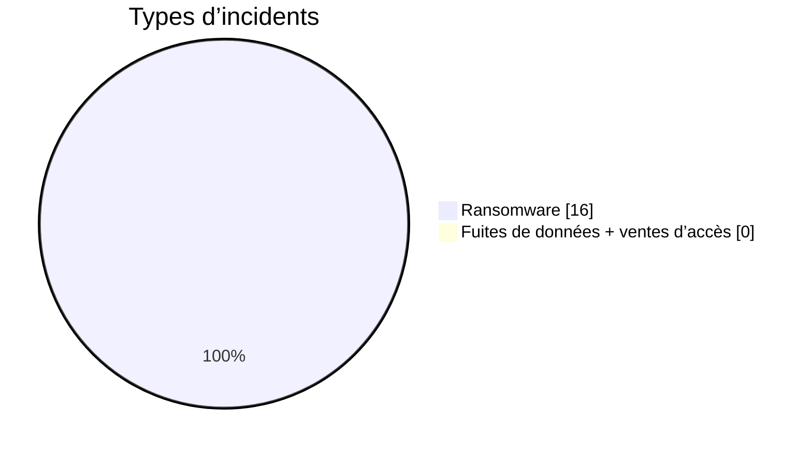
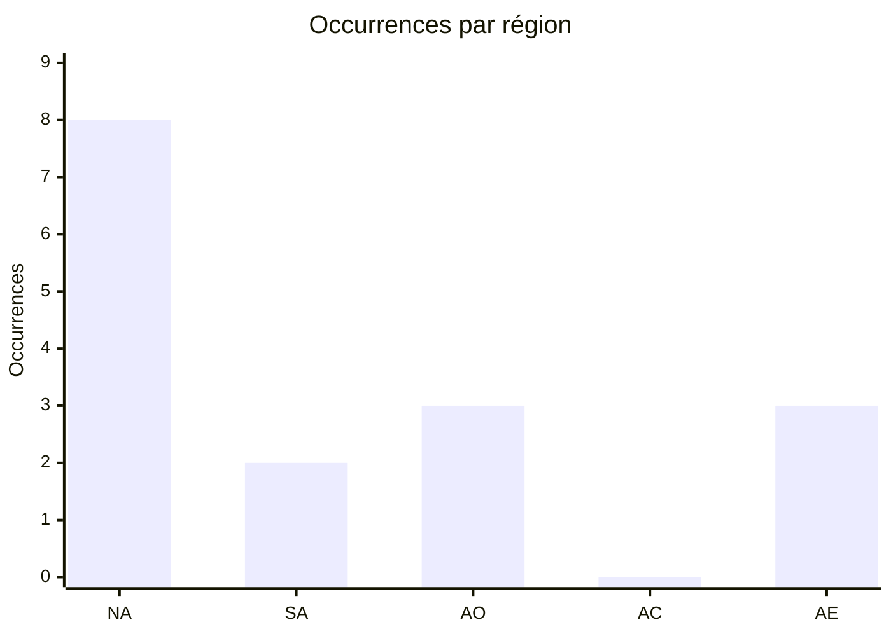
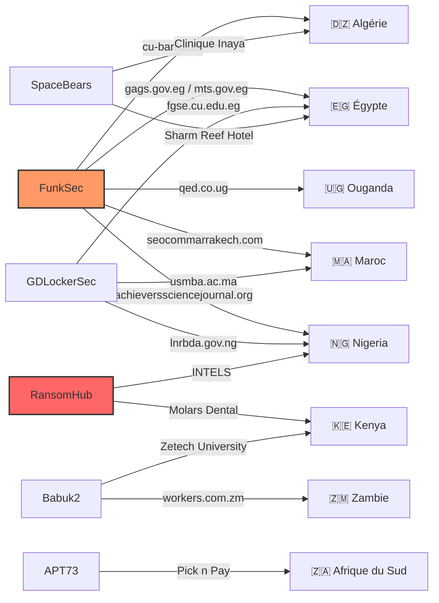
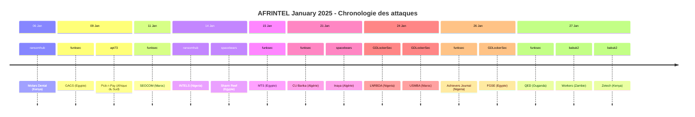

 

# Rapport CTI : Cyberattaques en Afrique - Janvier 2025
👉🏾 [**English version available here** ](./README.md)

## 1. Résumé exécutif
- **Nombre total d'attaques recensées** : 16
- **Groupes ransomware les plus actifs** : funksec (6 attaques), GDLockerSec (3), babuk2 (2), ransomhub (2), spacebears (2), apt73 (1).
- **Secteurs les plus ciblés** : Éducation (5), Administrations publiques (3), Santé (2), Services aux entreprises (2), Commerce de détail (1), Logistique (1), Marketing (1), Hôtellerie (1).
- **Pays les plus touchés** : Égypte (4), Nigeria (3), Algérie (2), Maroc (2), Kenya (2), Afrique du Sud (1), Ouganda (1), Zambie (1).
- **Volume de données exfiltrées** : Au moins 1,5 To pour INTELS Nigeria, 19 Go pour molars.co.ke. Les autres volumes ne sont pas précisés.

## 2. Méthodologie
Ce rapport de Cyber Threat Intelligence (CTI) présente une analyse détaillée des cyberattaques survenues en Afrique durant le mois de janvier 2025. Les informations sont issues de sources OSINT et de sites de fuites de groupes ransomware, compilées dans le cadre du projet AFRINTEL. L'objectif est de fournir une vision claire des tendances, des acteurs menaçants, des secteurs ciblés et des indicateurs de compromission associés.

## 3. Vue d'ensemble

### 3.1 Répartition par groupe ransomware
| Groupe ransomware | Nombre d'attaques |
|-------------------|-------------------|
| funksec           | 6                 |
| GDLockerSec       | 3                 |
| babuk2            | 2                 |
| ransomhub         | 2                 |
| spacebears        | 2                 |
| apt73             | 1                 |
| **Total**         | **16**            |

### 3.2 Répartition par secteur d'activité
| Secteur | Nombre d'attaques |
|---------|-------------------|
| Éducation | 5 |
| Administrations publiques | 3 |
| Santé | 2 |
| Services aux entreprises | 2 |
| Commerce de détail | 1 |
| Logistique | 1 |
| Marketing digital | 1 |
| Hôtellerie | 1 |
| **Total** | **16** |

### 3.3 Répartition par pays
| Pays | Nombre d'attaques |
|------|-------------------|
|🇪🇬 Égypte | 4 |
|🇳🇬 Nigeria | 3 |
|🇩🇿  Algérie | 2 |
|🇲🇦  Maroc | 2 |
|🇰🇪 Kenya | 2 |
|🇿🇦  Afrique du Sud | 1 |
|🇺🇬 Ouganda | 1 |
|🇿🇲 Zambie | 1 |
| **Total** | **16** |

### 3.4 Carte CTI Afrique
Une carte des attaques.
- 🇪🇬 Egypte          	    ████   4
- 🇳🇬 Nigeria             	     ███      3
- 🇲🇦 Maroc      	             ██         2
- 🇰🇪 Kenya              	     ██         2
- 🇩🇿Algerie         	       ██         2
- 🇿🇦 South Africa 	    █            1
- 🇺🇬 Uganda   		       █            1
- 🇿🇲 Zambie      	         █            1

<!-- AFRINTEL_CURRENT_MODEL_START -->
### 3.4 Vue globale standardisée

| Pays | Ransomware | Exposition des données (fuites + accès) | Total | Distribution |
| :--- | ---: | ---: | ---: | :--- |
| 🇪🇬 Égypte | 4 | 0 | 4 | 🟧🟧🟧🟧 |
| 🇳🇬 Nigeria | 3 | 0 | 3 | 🟧🟧🟧 |
| 🇩🇿 Algérie | 2 | 0 | 2 | 🟧🟧 |
| 🇰🇪 Kenya | 2 | 0 | 2 | 🟧🟧 |
| 🇲🇦 Maroc | 2 | 0 | 2 | 🟧🟧 |
| 🇿🇦 Afrique du Sud | 1 | 0 | 1 | 🟧 |
| 🇺🇬 Ouganda | 1 | 0 | 1 | 🟧 |
| 🇿🇲 Zambie | 1 | 0 | 1 | 🟧 |

### Vue agrégée mensuelle de l’exposition

La vue CTI mensuelle regroupe les fuites de données et les ventes d’accès sous **exposition des données** : **0 fiches** (0,0% du corpus mensuel). Les fiches sources restent la référence ; une vente d’accès ne prouve pas à elle seule l’exfiltration de données.

### Répartition géographique par région

| Région | Occurrences | Ransomware | Exposition des données (fuites + accès) | Distribution |
| :--- | ---: | ---: | ---: | :--- |
| Afrique du Nord | 8 | 8 | 0 | 🟧🟧🟧🟧🟧🟧🟧🟧 |
| Afrique australe | 2 | 2 | 0 | 🟧🟧 |
| Afrique de l’Ouest | 3 | 3 | 0 | 🟧🟧🟧 |
| Afrique centrale | 0 | 0 | 0 |  |
| Afrique de l’Est | 3 | 3 | 0 | 🟧🟧🟧 |

Légende : NA = Afrique du Nord ; SA = Afrique australe ; AO = Afrique de l’Ouest ; AC = Afrique centrale ; AE = Afrique de l’Est

### Répartition sectorielle

| Secteur | Fiches | Part | Activité |
| :--- | ---: | ---: | :--- |
| Éducation / universités | 5 | 31,2% | ██████████ |
| Gouvernement / administration | 3 | 18,8% | ██████ |
| Santé / médical | 3 | 18,8% | ██████ |
| Technologies / informatique | 2 | 12,5% | ████ |
| Énergie / services publics | 1 | 6,2% | ██ |
| Services professionnels | 1 | 6,2% | ██ |
| Commerce / e-commerce | 1 | 6,2% | ██ |

### Acteurs / groupes les plus présents

| Acteur / Groupe | Fiches | Activité |
| :--- | ---: | :--- |
| funksec | 6 | ██████████ |
| GDLockerSec | 3 | █████ |
| babuk2 | 2 | ███ |
| ransomhub | 2 | ███ |
| spacebears | 2 | ███ |
| apt73 | 1 | ██ |
<!-- AFRINTEL_CURRENT_MODEL_END -->

### Comparaison avec le mois précédent

À partir des fiches incidents validées comme source de comptage, janvier 2025 compte **16** incidents contre **12** le mois précédent (une hausse de **+4** ; **+33.3%**). Cette comparaison décrit les publications enregistrées par AFRINTEL et ne prouve pas à elle seule une évolution de l'activité des attaquants ni un impact confirmé sur les victimes.

| Indicateur | Mois précédent | Mois en cours | Variation |
|---|---:|---:|---:|
| Fiches incidents enregistrées | 12 | 16 | +4 (+33.3%) |

## 4. Analyse détaillée par type d'incident

## 5. Impact sectoriel
- **Éducation** : 5 attaques (universités, écoles, journaux académiques). Les groupes funksec, GDLockerSec et babuk2 sont particulièrement actifs dans ce secteur.
- **Administrations publiques** : 3 attaques (sites gouvernementaux, agences). funksec et GDLockerSec sont les principaux acteurs.
- **Santé** : 2 attaques (clinique dentaire, hôpital). Ransomhub et Spacebears.
- **Services aux entreprises** : 2 attaques (cabinet de conseil en Ouganda et services RH en Zambie). funksec et babuk2.
- **Commerce de détail** : 1 attaque (Pick n Pay) par apt73.
- **Logistique** : 1 attaque majeure (INTELS Nigeria) par Ransomhub.
- **Marketing** : 1 attaque (agence SEO) par Funksec.
- **Hôtellerie** : 1 attaque (hôtel) par Spacebears.

## 6. Profil des acteurs
### 6.1 Profil des acteurs

Les comptages d'acteurs et de sources restent ceux documentés en section 3 et dans les fiches victimes sources. L'attribution est conservée uniquement au niveau étayé par les éléments publics.

### 6.2 Évaluation du risque

Les pays et secteurs présentant plusieurs fiches ou des fonctions publiques, éducatives, sanitaires, financières ou critiques doivent faire l'objet d'une validation prioritaire. Il s'agit d'un signal de priorisation OSINT, et non d'une confirmation de compromission ou d'impact.

- **Égypte** : 4 attaques, principalement des administrations et éducation.
- **Nigeria** : 3 attaques, dont une critique sur le secteur pétrolier.
- **Algérie** : 2 attaques (éducation et santé).
- **Maroc** : 2 attaques (marketing et éducation).
- **Kenya** : 2 attaques (santé et éducation).
- **Afrique du Sud** : 1 attaque sur un grand distributeur.
- **Ouganda** : 1 attaque (conseil).
- **Zambie** : 1 attaque (services RH).

L'Afrique de l'Est et du Nord sont les plus touchées, avec une présence notable en Afrique de l'Ouest (Nigeria).

### 6.1. Graphe acteur → victime → pays

### 6.2. Timeline des attaques

## 7. Tendances et lacunes de renseignement
### 7.1 Tendances observées

Les répartitions par pays, secteur, acteur et type d'incident présentées ci-dessus constituent les tendances traçables du mois. Elles décrivent le corpus surveillé et n'établissent pas une campagne plus large sans éléments indépendants.

### 7.2 Lacunes de renseignement

Les rapports disponibles ne permettent pas d'établir pour chaque revendication le vecteur d'accès initial, l'exfiltration complète, la confirmation par la victime, la chronologie de remédiation ou l'impact opérationnel. Aucun détail DFIR public n'est inclus dans le corpus consulté pour cette fiche mensuelle ; cette absence est limitée aux sources examinées.

## 8. Cartographie MITRE ATT&CK (contextuelle)
| Phase | ID technique | Nom | Association à l'incident |
|---|---|---|---|
| Collecte | T1005 | Data from Local System | Correspondance contextuelle pour une collecte ou exposition revendiquée ; la méthode n'est pas confirmée. |
| Collecte | T1213 | Data from Information Repositories | Correspondance contextuelle pour les dossiers ou référentiels décrits publiquement ; la méthode n'est pas confirmée. |

Ces correspondances ATT&CK sont contextuelles et défensives. Elles ne prouvent pas qu'un acteur donné a utilisé la technique.

### Contextual observations
D'après les descriptions limitées, on peut noter :
- **Exfiltration de données** : Les groupes revendiquent des volumes importants (1,5 To pour INTELS, 19 Go pour molars).
- **Ciblage de secteurs spécifiques** : Les administrations et l'éducation sont privilégiées.
- **Utilisation de sites de fuite** : Les groupes publient des échantillons de données pour faire pression.
- **Diversité des groupes** : 6 groupes différents actifs en janvier 2025.

## 9. Recommandations
- **Secteur public** : Renforcer la sécurité des sites gouvernementaux et des établissements éducatifs, souvent vulnérables.
- **Secteur privé** : Les entreprises de logistique et de santé doivent prioriser la protection des données sensibles.
- **Surveillance des groupes** : Suivre les activités de funksec, GDLockerSec et ransomhub, qui semblent les plus prolifiques.
- **Sensibilisation** : Former les employés aux risques de phishing et d'ingénierie sociale, vecteurs d'accès initiaux probables.

## 10. Recommandations SOC et tactiques
### Observé

Les sources publiques documentent des revendications, des publications ou du matériel exposé. Elles ne fournissent pas à elles seules une télémétrie prouvant une technique ou une compromission active.

### Hypothèses

L'abus d'identifiants, un stockage exposé, des contrôles d'accès faibles ou des privilèges d'export excessifs peuvent expliquer certaines expositions, mais chaque hypothèse doit être vérifiée par l'organisation concernée.

### Préventif

Surveiller les journaux d'identité, VPN, cloud, bases de données, messagerie et transferts sortants. Imposer une MFA résistante au phishing, le moindre privilège, la segmentation, des sauvegardes testées et la révocation rapide des jetons ou identifiants.

## 11. Recommandations stratégiques
1. **Risques observés :** prioriser la validation des organisations, secteurs et types de données documentés dans le corpus mensuel.
2. **Hypothèses :** tester les chemins possibles liés aux identifiants, au stockage cloud et aux exports excessifs sans les présenter comme des faits établis.
3. **Socle préventif :** maintenir l'inventaire des actifs, la classification des données, les exercices de réponse, les plans de reprise et les procédures coordonnées de sécurité, de droit et de protection des données.

## 12. Conclusion
Janvier 2025 a été marqué par une activité soutenue de plusieurs groupes ransomware en Afrique, avec un focus sur les institutions publiques et éducatives. Le groupe funksec se distingue par sa fréquence, tandis que ransomhub a réalisé l'attaque la plus volumineuse. La diversité des acteurs et des secteurs touchés souligne la nécessité d'une vigilance accrue et d'une coopération régionale en matière de cybersécurité.

### Auteur
*Adama ASSIONGBON*  
*Consultant SOC & Cyber Threat Intelligence*  
[LinkedIn profile](https://www.linkedin.com/in/adama-assiongbon-9029893a/)

---
*AFRINTEL - Initiative ouverte de veille CTI sur l’Afrique*
