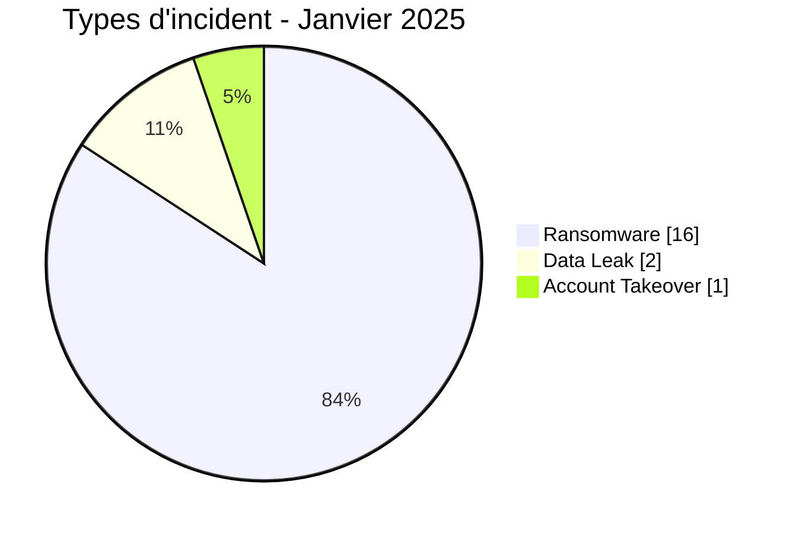
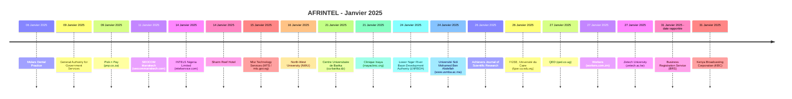

# Rapport CTI AFRINTEL - Cybermenaces en Afrique - Janvier 2025

👉🏾 [English version](./README.md)

   

## 1. Synthèse exécutive

En Janvier 2025, AFRINTEL documente **19 cyberincidents** affectant des organisations et services numériques dans **8 pays africains**.

Le paysage est dominé par **Ransomware avec 16 fiches (84,2 %)**, suivi de **Data Leak avec 2 (10,5 %)**. Les autres types observés sont Account Takeover 1.

La concentration géographique est marquée : **Kenya (4)**, **Égypte (4)**, **Nigeria (3)** représentent ensemble **11 fiches, soit 57,9 % du mois**. Cette concentration doit être interprétée comme la visibilité du corpus AFRINTEL et non comme un taux national exhaustif de compromission.

Sur le plan sectoriel, les catégories les plus représentées sont **Éducation / Université (6)**, **Gouvernement / Administration (4)**, **Santé / Médical (2)**. Les labels d'acteurs les plus fréquents sont `funksec` (6), `GDLockerSec` (3), `ransomhub` (2). `Unknown`, lorsqu'il apparaît, désigne une absence d'attribution et non un groupe cybercriminel.

La maturité des preuves reste variable : **17 fiches** relèvent de claims non vérifiés ou accompagnés d'échantillons. AFRINTEL conserve une séparation stricte entre **faits observés, revendications, corroborations, confirmations officielles et inconnues techniques**.

Par rapport à décembre 2024 corrigé, le volume mensuel **augmente de 5 fiches**. Les variations les plus visibles concernent Ransomware 11->16 (+5), Defacement 1->0 (-1).

> **Note de lecture :** les chiffres AFRINTEL décrivent les incidents documentés et la visibilité des menaces observées. Ils ne constituent pas une mesure exhaustive de toutes les cyberattaques réellement survenues en Afrique.

### 1.1 Comparaison avec le mois précédent

| Indicateur | Décembre 2024 corrigé | Janvier 2025 | Évolution |
|---|---:|---:|---:|
| Total incidents | 14 | 19 | **+5 (+35,7 %)** |
| Ransomware | 11 | 16 | **+5 (+45,5 %)** |
| Data Leak | 2 | 2 | **Stable** |
| Access Sale | 0 | 0 | **Stable** |
| DDoS | 0 | 0 | **Stable** |
| Defacement | 1 | 0 | **-1 (-100,0 %)** |
| Account Takeover | N/A | 1 | **N/A** |
| System Intrusion | N/A | 0 | **N/A** |
| Malware | N/A | 0 | **N/A** |
| Operational Fraud | 0 | 0 | **Stable** |

 > **Limite de comparaison :** Account Takeover, System Intrusion et Malware sont `N/A` pour décembre 2024 car le corpus 2024 n'a pas encore été rétro-classifié intégralement selon la classification actuelle.

## 2. Méthodologie

- **Périmètre :** 54 pays africains ; période de référence : Janvier 2025.
- **Source de vérité :** couple validé `victims_FR.md` / `victims.md`.
- **Classification :** Ransomware, Data Leak, Access Sale, DDoS, Defacement, Account Takeover, System Intrusion, Malware et Operational Fraud.
- **Comptage :** une fiche canonique correspond à un cyberincident documenté ; les dossiers en investigation restent hors statistiques.
- **Chronologie :** `Date de l'incident` et `Date de publication initiale` sont séparées. Une publication ultérieure ne déplace pas artificiellement un incident vers un autre mois lorsque la chronologie est suffisamment établie.
- **Dates incertaines :** lorsqu'un jour exact n'est pas connu, le mois ou la fenêtre soutenue par les preuves est conservé.
- **Sources :** les liens publics sont conservés pour les incidents complémentaires identifiés par recherche OSINT/web ; ils ne sont pas imposés rétroactivement aux observations historiques ou Dark Web directes.
- **Preuve :** type d'incident, statut, confiance, impact et provenance restent des dimensions distinctes.
- **Secteurs :** normalisation calculée une seule fois à partir du corpus structuré, puis utilisée à l'identique en FR et EN.
- **Limite :** les fréquences reflètent la visibilité AFRINTEL et non l'ensemble des compromissions réelles sur le continent.

## 3. Vue d'ensemble et types d'incident

| Indicateur | Valeur |
|---|---:|
| Incidents documentés | **19** |
| Pays représentés | **8** |
| Régions représentées | **4** |
| Premier pays | **Kenya (4)** |
| Premier secteur | **Éducation / Université (6)** |
| Premier label acteur | **funksec (6)** |

| Type d'incident | Fiches | Part |
|---|---:|---:|
| Ransomware | 16 | 84,2 % |
| Data Leak | 2 | 10,5 % |
| Access Sale | 0 | 0,0 % |
| DDoS | 0 | 0,0 % |
| Defacement | 0 | 0,0 % |
| Account Takeover | 1 | 5,3 % |
| System Intrusion | 0 | 0,0 % |
| Malware | 0 | 0,0 % |
| Operational Fraud | 0 | 0,0 % |
| **Total** | **19** | **100 %** |

## 4. Répartition géographique

| Pays | Total | Ransomware | Data Leak | Access Sale | DDoS | Defacement | Account Takeover | System Intrusion | Malware |
|---|---:|---:|---:|---:|---:|---:|---:|---:|---:|
| Kenya | **4** | 2 | 1 | 0 | 0 | 0 | 1 | 0 | 0 |
| Égypte | **4** | 4 | 0 | 0 | 0 | 0 | 0 | 0 | 0 |
| Nigeria | **3** | 3 | 0 | 0 | 0 | 0 | 0 | 0 | 0 |
| Afrique du Sud | **2** | 1 | 1 | 0 | 0 | 0 | 0 | 0 | 0 |
| Maroc | **2** | 2 | 0 | 0 | 0 | 0 | 0 | 0 | 0 |
| Algérie | **2** | 2 | 0 | 0 | 0 | 0 | 0 | 0 | 0 |
| Ouganda | **1** | 1 | 0 | 0 | 0 | 0 | 0 | 0 | 0 |
| Zambie | **1** | 1 | 0 | 0 | 0 | 0 | 0 | 0 | 0 |
| **Total** | **19** | **16** | **2** | **0** | **0** | **0** | **1** | **0** | **0** |

> `Operational Fraud = 0` ce mois-ci ; la colonne est omise pour préserver la lisibilité.

## 5. Répartition régionale

| Région | Fiches | Part |
|---|---:|---:|
| Afrique du Nord | 8 | 42,1 % |
| Afrique de l'Est | 5 | 26,3 % |
| Afrique australe | 3 | 15,8 % |
| Afrique de l'Ouest | 3 | 15,8 % |
| **Total** | **19** | **100 %** |

La région la plus représentée est **Afrique du Nord avec 8 fiches (42,1 %)**.

## 6. Impact sectoriel

| Secteur | Fiches | Part | Activité |
|---|---:|---:|---|
| Éducation / Université | 6 | 31,6 % | ██████ |
| Gouvernement / Administration | 4 | 21,1 % | ████ |
| Santé / Médical | 2 | 10,5 % | ██ |
| Médias / Divertissement | 2 | 10,5 % | ██ |
| Commerce / E-commerce | 1 | 5,3 % | █ |
| Technologie / IT | 1 | 5,3 % | █ |
| Transport / Logistique | 1 | 5,3 % | █ |
| Hôtellerie / Tourisme | 1 | 5,3 % | █ |
| Services professionnels / Business | 1 | 5,3 % | █ |
| **Total** | **19** | **100 %** | |

## 7. Acteurs / groupes

`Unknown` correspond à une absence d'attribution, pas à un acteur.

| Acteur / Groupe | Fiches | Activité |
|---|---:|---|
| funksec | 6 | ██████ |
| GDLockerSec | 3 | ███ |
| ransomhub | 2 | ██ |
| spacebears | 2 | ██ |
| babuk2 | 2 | ██ |
| Unknown | 2 | ██ |
| apt73 | 1 | █ |
| SevenZeroDay404 | 1 | █ |

## 8. Maturité des preuves

| Maturité de preuve | Fiches | Part |
|---|---:|---:|
| Claim - Unverified | 8 | 42,1 % |
| Claim - Data Sample Published | 9 | 47,4 % |
| Confirmation victime / gouvernement / autorité | 2 | 10,5 % |
| **Total** | **19** | **100 %** |

Les statuts de preuve décrivent le niveau de validation disponible ; ils ne changent pas le type technique de l'incident.

## 9. Chronologie

## 10. Analyse CTI mensuelle

### Ransomware

**16 fiches** sont classées Ransomware. Principaux pays : Égypte (4), Nigeria (3), Kenya (2). Une publication sur un leak site ne prouve pas, à elle seule, le chiffrement ou l'exfiltration complète.

### Data Leak

**2 fiches** sont classées Data Leak. Principaux pays : Afrique du Sud (1), Kenya (1). AFRINTEL distingue les données effectivement observées des volumes globaux revendiqués.

### Account Takeover

**1 Account Takeover** sont documentés. Répartition : Kenya (1). Cette catégorie conserve séparément les compromissions de comptes institutionnels.

## 11. Incidents notables

| Pays | Organisation | Type | Statut | Impact | Confiance |
|---|---|---|---|---|---|
| Kenya | Business Registration Service (BRS) | Data Leak | Government Confirmed | Level 4 | Very High |
| Nigeria | Lower Niger River Basin Development Authority (LNRBDA) | Ransomware | Claim - Data Sample Published | Level 4 | Very High |
| Ouganda | QED (qed.co.ug) | Ransomware | Claim - Data Sample Published | Level 4 | Very High |
| Kenya | Kenya Broadcasting Corporation (KBC) | Account Takeover | Victim Confirmed | Level 3 | High |
| Kenya | Molars Dental Practice | Ransomware | Claim - Data Sample Published | Level 3 | High |

> Ce tableau met en avant jusqu'à cinq fiches selon le niveau d'impact, la confirmation et la confiance structurés. Il ne constitue pas un classement absolu de gravité.

## 12. Principaux enseignements et lacunes de renseignement

- **Concentration géographique :** Kenya représente 4 fiches (21,1 %), devant Égypte (4) et Nigeria (3).
- **Structure de menace :** Ransomware est le premier type avec 16 fiches, suivi de Data Leak (2).
- **Secteurs :** Éducation / Université (6) et Gouvernement / Administration (4) concentrent la plus forte visibilité.
- **Acteurs :** les labels les plus fréquents sont funksec (6), GDLockerSec (3) et ransomhub (2).
- **Preuve :** 17 fiches reposent sur des claims non vérifiés ou accompagnés d'un échantillon ; ces statuts ne valent pas confirmation technique complète.

### Intelligence gaps

- vecteur d'accès initial souvent non public ;
- date technique exacte de compromission parfois inconnue ;
- volumes revendiqués rarement vérifiables intégralement ;
- attribution technique souvent limitée au pseudonyme ou label de publication ;
- informations publiques sur remédiation, cause racine et conclusions DFIR encore limitées.

Ces lacunes doivent guider la collecte sans être remplacées par des hypothèses.

## 13. Recommandations

### Organisations

- imposer MFA résistante au phishing sur les comptes privilégiés, VPN, messagerie, réseaux sociaux et consoles d'administration ;
- appliquer PAM, moindre privilège, segmentation et rotation des secrets ;
- maintenir des sauvegardes immuables et tester la restauration ;
- renforcer les applications publiques, API et interfaces administratives ;
- formaliser réponse à incident et notification des violations de données.

### SOC et détection

- surveiller les authentifications anormales, changements MFA, créations de comptes privilégiés et élévations de rôles ;
- détecter lectures massives de bases, exports inhabituels, créations d'archives et transferts sortants volumineux ;
- corréler EDR, IAM, VPN, WAF, proxy, DNS, cloud et journaux applicatifs ;
- distinguer DDoS, intrusion interne, compromission de compte et fuite de données pour éviter les conclusions non étayées.

### CTI

- conserver séparément date d'incident, publication initiale, première observation, échantillon, divulgation et confirmation ;
- suivre republications et reventes sans les compter automatiquement comme nouvelles compromissions ;
- maintenir la hiérarchie de preuve entre claim, corroboration et confirmation ;
- valider la parité FR/EN avant toute génération de statistiques.

## 14. Conclusion

Le mois de **Janvier 2025** compte **19 cyberincidents documentés** dans **8 pays africains**. La lecture mensuelle montre que la valeur CTI ne réside pas seulement dans le volume, mais dans la distinction entre **type d'incident, chronologie, niveau de preuve, géographie, secteur et acteur**.

Le rapport conserve ainsi une photographie structurée de la menace observable tout en maintenant les revendications, corroborations, confirmations et inconnues à leur niveau de preuve réel.

👉🏾 [Voir les victimes du mois](./victims_FR.md)

**AFRINTEL** - TLP:CLEAR
