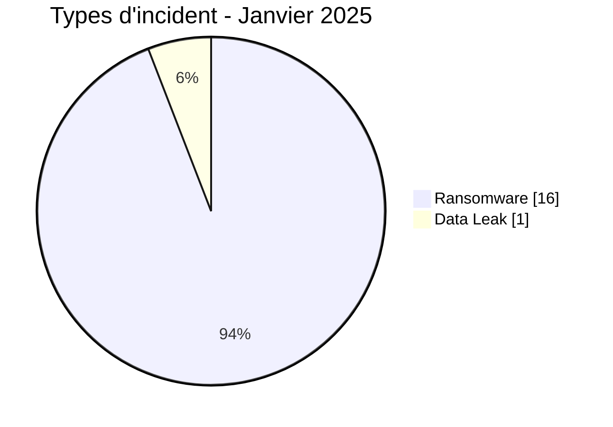
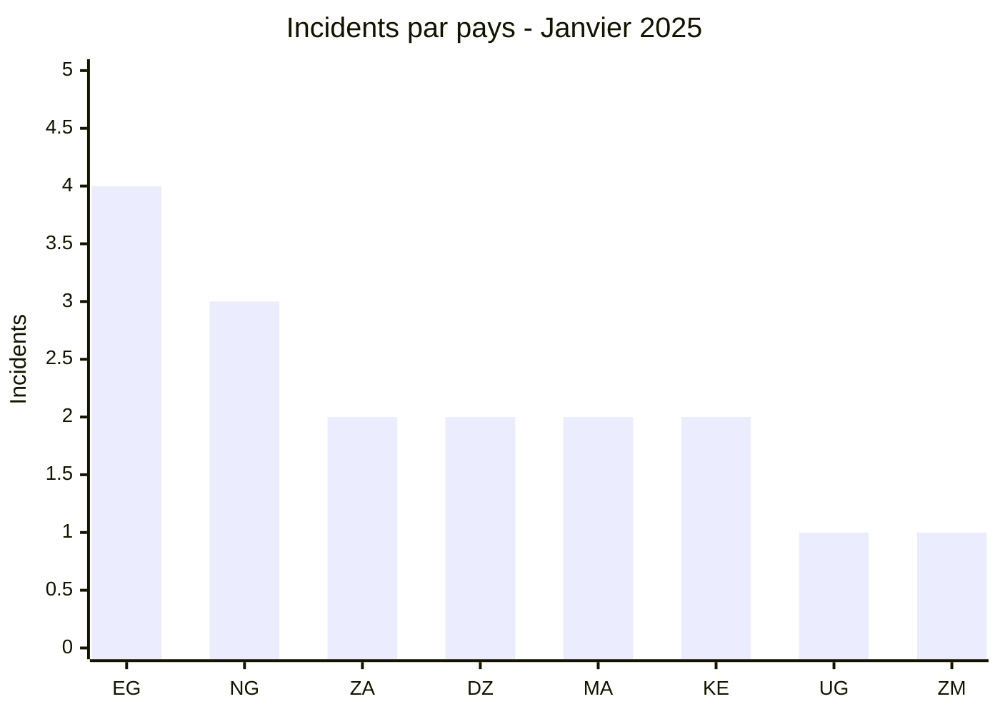
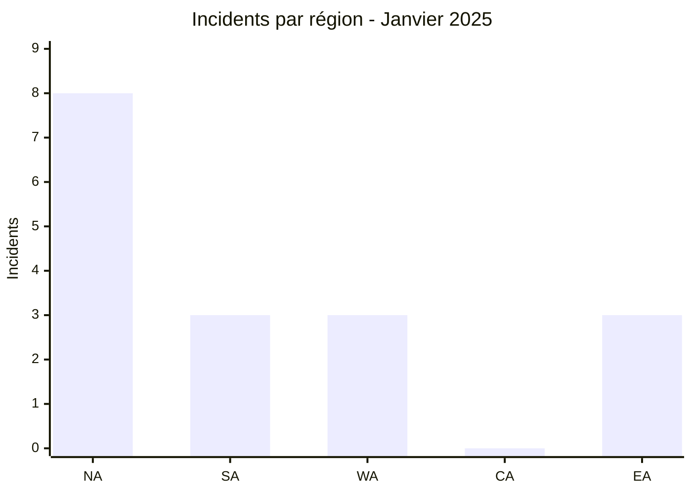
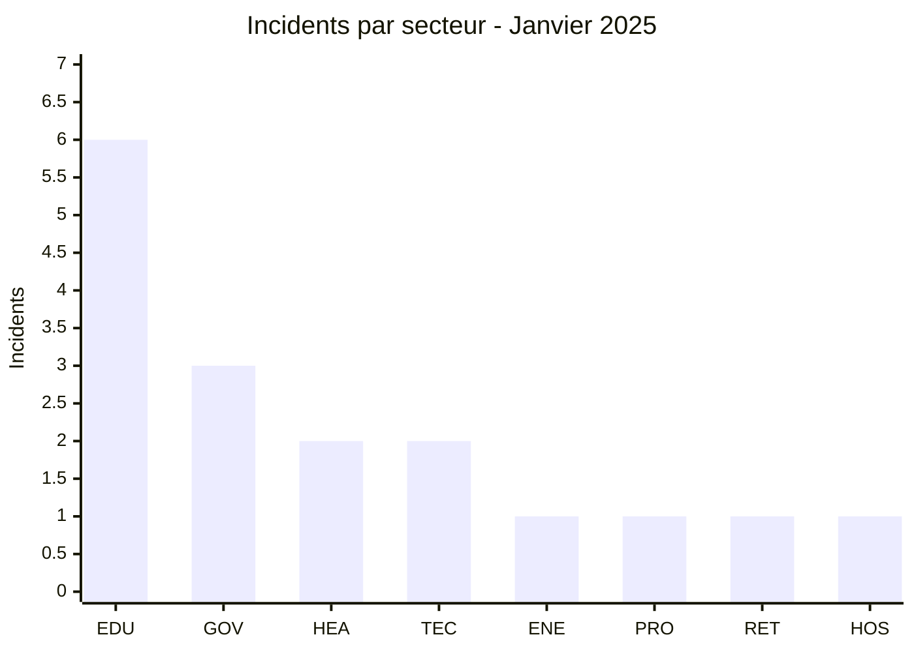
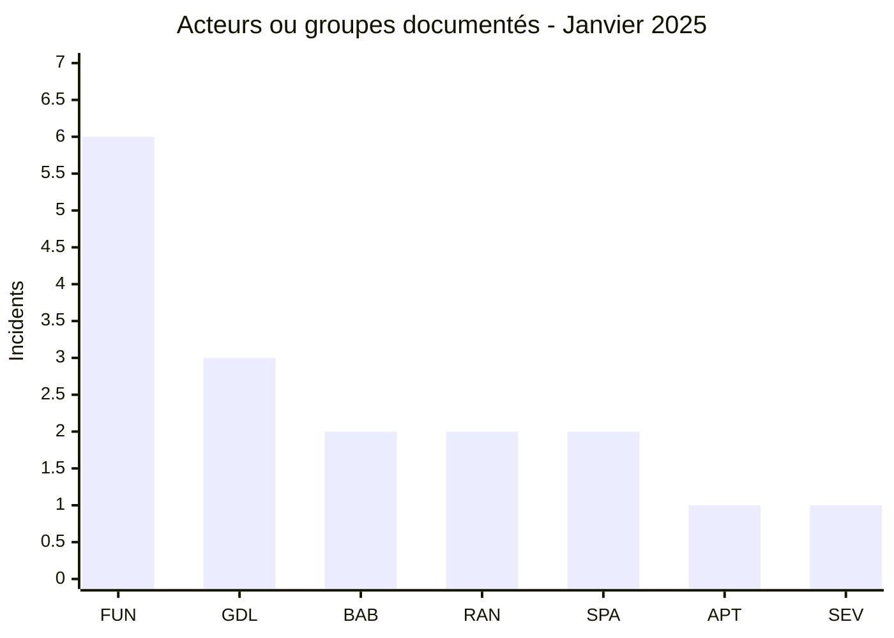
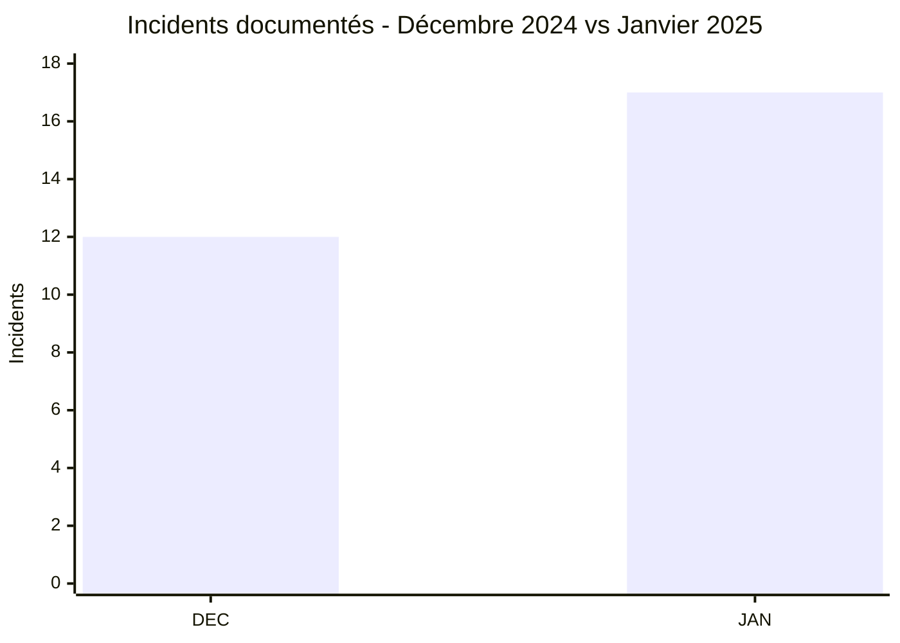

# Rapport CTI - Cyberattaques en Afrique - Janvier 2025

👉🏾 [**English version available here**](./README.md)

## 1. Synthèse exécutive

Janvier 2025 compte **17 incidents documentés dans 8 pays africains**. Le corpus comprend **16 Ransomware** et **1 Data Leak**, la nouvelle fiche Data Leak concernant **North-West University (NWU)** en Afrique du Sud. La publication attribuée à SevenZeroDay404 annonce environ 29 000 enregistrements étudiants, mais l'analyse de l'échantillon ne permet pas de confirmer son origine dans les systèmes de NWU ni le volume global revendiqué.

- **17 incidents** : 16 Ransomware, 1 Data Leak.
- **8 pays** : Égypte (4), Nigeria (3), Afrique du Sud (2), Algérie (2), Maroc (2), Kenya (2), Ouganda (1), Zambie (1).
- **7 acteurs / groupes documentés** : funksec (6), GDLockerSec (3), babuk2 (2), ransomhub (2), spacebears (2), apt73 (1), SevenZeroDay404 (1).
- **Secteur le plus représenté** : Éducation / Université avec 6 incidents.
- **Volumes revendiqués notables** : environ 1,5 To pour INTELS Nigeria, 19 Go pour Molars Dental et 29 000 enregistrements pour NWU. Ces chiffres restent distingués des volumes effectivement observés.

### 📋 Liste des victimes

👉🏾 [Voir la liste complète des victimes](./victims_FR.md)

### 1.1 Comparaison avec le mois précédent

> La comparaison porte sur les publications documentées par AFRINTEL. Le rapport fourni pour décembre 2024 permet d'établir un total de 12 incidents, mais ne fournit pas une ventilation structurée comparable pour les six types AFRINTEL.

| Indicateur | Décembre 2024 | Janvier 2025 | Évolution observée |
|---|---:|---:|---:|
| Total incidents | 12 | 17 | **+5 (+41,7 %)** |
| Ransomware | N/A | 16 | **N/A** |
| Data Leak | N/A | 1 | **N/A** |
| Access Sale | N/A | 0 | **N/A** |
| DDoS | N/A | 0 | **N/A** |
| Defacement | N/A | 0 | **N/A** |
| Operational Fraud | N/A | 0 | **N/A** |

> Les catégories du mois précédent ne sont pas reconstruites par déduction. Le total passe de 12 à 17, soit **+5 (+41,7 %)**.

## 2. Méthodologie

- **Périmètre** : 54 pays africains.
- **Période** : 1er au 31 janvier 2025, selon la date de publication ou de détection utilisée dans les fiches.
- **Sources** : OSINT, sites de fuite, forums underground, publications d'acteurs et échantillons fournis lorsqu'ils sont disponibles.
- **Source de vérité** : le couple bilingue validé [`victims_FR.md`](./victims_FR.md) / [`victims.md`](./victims.md), avec contrôle éditorial d'abord dans la version française.
- **Qualification** : une revendication, un échantillon publié et une confirmation indépendante sont traités comme des niveaux de preuve distincts.
- **Comptage** : chaque fiche incident compte une fois dans le total mensuel.

## 3. Vue d'ensemble

### 3.1 Répartition par type d'incident

| Type d'incident | Nombre | Part |
|---|---:|---:|
| Ransomware | 16 | 94,1 % |
| Data Leak | 1 | 5,9 % |
| Access Sale | 0 | 0,0 % |
| DDoS | 0 | 0,0 % |
| Defacement | 0 | 0,0 % |
| Operational Fraud | 0 | 0,0 % |
| **Total** | **17** | **100 %** |

**Convention couleur :** 🟧 Ransomware | 🟦 Data Leak | 🟪 Access Sale | 🟥 DDoS | 🟨 Defacement | 🟩 Operational Fraud.

### 3.2 Répartition par pays

| Pays | Ransomware | Data Leak | Total | Distribution |
|---|---:|---:|---:|---|
| Égypte | 4 | 0 | 4 | 🟧🟧🟧🟧 |
| Nigeria | 3 | 0 | 3 | 🟧🟧🟧 |
| Afrique du Sud | 1 | 1 | 2 | 🟧🟦 |
| Algérie | 2 | 0 | 2 | 🟧🟧 |
| Maroc | 2 | 0 | 2 | 🟧🟧 |
| Kenya | 2 | 0 | 2 | 🟧🟧 |
| Ouganda | 1 | 0 | 1 | 🟧 |
| Zambie | 1 | 0 | 1 | 🟧 |
| **Total** | **16** | **1** | **17** | |

**Légende :** `EG` = Égypte | `NG` = Nigeria | `ZA` = Afrique du Sud | `DZ` = Algérie | `MA` = Maroc | `KE` = Kenya | `UG` = Ouganda | `ZM` = Zambie

### 3.3 Comparaison Ransomware et Data Leak par pays

```mermaid
xychart-beta
    title "Ransomware vs Data Leak par pays - Janvier 2025"
    x-axis ["EG", "NG", "ZA", "DZ", "MA", "KE", "UG", "ZM"]
    y-axis "Incidents" 0 --> 5
    bar [4, 3, 1, 2, 2, 2, 1, 1]
    bar [0, 0, 1, 0, 0, 0, 0, 0]
```

**Légende des séries :** première série = 🟧 Ransomware | deuxième série = 🟦 Data Leak.  
**Pays :** `EG` = Égypte | `NG` = Nigeria | `ZA` = Afrique du Sud | `DZ` = Algérie | `MA` = Maroc | `KE` = Kenya | `UG` = Ouganda | `ZM` = Zambie

### 3.4 Répartition géographique par région

| Région | Incidents | Part |
|---|---:|---:|
| Afrique du Nord | 8 | 47,1 % |
| Afrique australe | 3 | 17,6 % |
| Afrique de l'Ouest | 3 | 17,6 % |
| Afrique centrale | 0 | 0,0 % |
| Afrique de l'Est | 3 | 17,6 % |
| **Total** | **17** | **100 %** |

**Légende :** `NA` = Afrique du Nord | `SA` = Afrique australe | `WA` = Afrique de l'Ouest | `CA` = Afrique centrale | `EA` = Afrique de l'Est

### 3.5 Répartition sectorielle

| Secteur | Incidents | Part | Activité |
|---|---:|---:|---|
| Éducation / Université | 6 | 35,3 % | ██████████ |
| Gouvernement / Administration | 3 | 17,6 % | █████ |
| Santé / Médical | 2 | 11,8 % | ███ |
| Technologie / Informatique | 2 | 11,8 % | ███ |
| Énergie / Services publics | 1 | 5,9 % | ██ |
| Services professionnels | 1 | 5,9 % | ██ |
| Commerce / E-commerce | 1 | 5,9 % | ██ |
| Hôtellerie / Tourisme | 1 | 5,9 % | ██ |
| **Total** | **17** | **100 %** | |

**Légende :** `EDU` = Éducation / Université | `GOV` = Gouvernement / Administration | `HEA` = Santé / Médical | `TEC` = Technologie / Informatique | `ENE` = Énergie / Services publics | `PRO` = Services professionnels | `RET` = Commerce / E-commerce | `HOS` = Hôtellerie / Tourisme

### 3.6 Acteurs / groupes documentés

| Acteur / Groupe | Incidents | Activité |
|---|---:|---|
| funksec | 6 | ██████████ |
| GDLockerSec | 3 | █████ |
| babuk2 | 2 | ███ |
| ransomhub | 2 | ███ |
| spacebears | 2 | ███ |
| apt73 | 1 | ██ |
| SevenZeroDay404 | 1 | ██ |
| **Total** | **17** | |

**Légende :** `FUN` = funksec | `GDL` = GDLockerSec | `BAB` = babuk2 | `RAN` = ransomhub | `SPA` = spacebears | `APT` = apt73 | `SEV` = SevenZeroDay404

## 4. Analyse détaillée par type d'incident

### 4.1 Ransomware - 16 incidents

Les 16 fiches Ransomware concernent six groupes ou labels : funksec (6), GDLockerSec (3), babuk2 (2), ransomhub (2), spacebears (2) et apt73 (1). Le classement Ransomware décrit le contexte de publication ou d'extorsion enregistré dans les fiches ; il ne présume pas que chaque cas a entraîné un chiffrement.

Plusieurs fiches disposent d'éléments examinés plus riches que la simple publication : GAGS, MTS, LNRBDA, USMBA, Achievers Journal, QED, Workers et Molars contiennent des échantillons ou éléments techniques décrits dans les fiches. Les niveaux de preuve restent spécifiques à chaque incident.

### 4.2 Data Leak - 1 incident

**🇿🇦 North-West University (NWU)** est la seule fiche classée Data Leak en janvier. SevenZeroDay404 présente une base intitulée **« 29K NWU Student Database »** avec un échantillon contenant notamment des noms, GPA, cursus et années d'études. L'examen identifie 2 893 occurrences de GPA structurées, mais aucun marqueur explicite reliant directement les données à `nwu.ac.za` n'a été identifié dans l'échantillon. La victime revendiquée est donc NWU, tandis que l'origine du jeu de données et le volume de 29 000 enregistrements restent non confirmés indépendamment.

## 5. Impact sectoriel

L'**Éducation / Université** devient le secteur le plus représenté avec **6 incidents sur 17 (35,3 %)**, après l'ajout de NWU. Le **Gouvernement / Administration** suit avec 3 incidents. La santé et les technologies comptent 2 incidents chacune.

La concentration sectorielle décrit le corpus AFRINTEL de janvier 2025. Elle ne suffit pas à établir une campagne coordonnée contre le secteur éducatif.

## 6. Profil des acteurs de menace

### 6.1 Profil

funksec reste le label le plus présent avec **6 fiches**, devant GDLockerSec avec 3. SevenZeroDay404 apparaît avec une seule fiche, la publication Data Leak attribuée à NWU.

La fréquence de publication ne démontre pas une coordination entre acteurs ni un niveau technique supérieur.

### 6.2 Évaluation du risque

| Pays | Signal de risque dans le corpus |
|---|---|
| Égypte | 4 incidents, dont plusieurs organisations publiques et éducatives |
| Nigeria | 3 incidents, dont une agence fédérale et des services liés au secteur pétrolier |
| Afrique du Sud | 2 incidents, commerce de détail et enseignement supérieur |
| Ouganda | 1 incident, mais avec exposition à grande échelle de contacts et accès administrateur décrit dans la fiche QED |
| Algérie, Maroc, Kenya | 2 incidents chacun dans des secteurs éducatifs, santé ou technologiques |
| Zambie | 1 incident avec base backend structurée décrite dans la fiche Workers |

Ce classement sert à prioriser la validation et la surveillance. Il ne constitue pas une mesure de compromission nationale.

## 7. Tendances et lacunes de renseignement

### 7.1 Tendances observées

1. **Éducation en tête** : 6 des 17 fiches concernent l'enseignement, l'université ou la recherche.
2. **Funksec reste le label le plus fréquent** : 6 fiches, soit 35,3 % du corpus.
3. **Diversification du type d'incident** : l'ajout de NWU introduit une première fiche Data Leak dans le corpus de janvier, qui n'est plus composé exclusivement de ransomware.
4. **Concentration géographique** : Égypte, Nigeria, Afrique du Sud, Algérie, Maroc et Kenya regroupent 15 des 17 fiches.

### 7.2 Lacunes de renseignement

- L'origine technique de l'échantillon attribué à NWU n'est pas confirmée par un marqueur direct dans les données examinées.
- Les volumes revendiqués par les acteurs ne sont pas tous vérifiables à partir des échantillons disponibles.
- Le vecteur d'accès initial et l'impact opérationnel restent inconnus pour plusieurs cas.
- Le détail par type d'incident de décembre 2024 n'est pas disponible dans les fichiers fournis, ce qui empêche une comparaison catégorielle fiable.

### 7.3 Évolution mensuelle

**Légende :** `DEC` = Décembre 2024 | `JAN` = Janvier 2025.

Le total documenté augmente de **12 à 17**, soit **+5 (+41,7 %)**. Cette évolution concerne le corpus public suivi par AFRINTEL et ne démontre pas à elle seule une hausse équivalente du nombre réel de compromissions.

## 8. Cartographie MITRE ATT&CK contextuelle

| Phase | Technique | Portée analytique |
|---|---|---|
| Accès initial | T1190 - Exploit Public-Facing Application | Pertinent pour le cas GAGS où un motif d'injection SQL est visible ; le détail complet de l'exploitation n'est pas établi. |
| Collecte | T1005 - Data from Local System | Contexte défensif pour plusieurs cas avec exports ou données internes ; ne prouve pas la méthode de collecte de chaque acteur. |
| Collecte | T1213 - Data from Information Repositories | Pertinent lorsque les éléments examinés correspondent à des bases ou référentiels structurés. |

> Les techniques sont utilisées comme cartographie défensive. Aucun mapping n'est ajouté au cas NWU en l'absence d'élément technique permettant d'établir la méthode d'accès ou de collecte.

## 9. Recommandations

- **Éducation et recherche** : MFA résistante au phishing pour les comptes administratifs, segmentation des systèmes étudiants et de recherche, contrôle des exports massifs et surveillance des comptes à privilèges.
- **Administrations publiques** : renforcer la sécurité des applications exposées, les revues de code et la journalisation des accès administrateurs.
- **Organisations manipulant des données personnelles** : appliquer la minimisation, le chiffrement, la gestion des accès et une surveillance des extractions volumineuses.
- **Validation CTI** : conserver séparément les volumes revendiqués, les données réellement examinées et les confirmations indépendantes.

## 10. Recommandations SOC et tactiques

### Observé

Les fiches documentent notamment des publications de données, des exports structurés, des accès administrateurs visibles et, pour GAGS, un motif d'injection SQL dans le matériel examiné.

### Hypothèses

Le vecteur initial de plusieurs incidents reste inconnu. Ne pas attribuer automatiquement ces cas au phishing, à l'exploitation d'une vulnérabilité ou à un vol d'identifiants sans preuve spécifique.

### Préventif

Surveiller les authentifications administratives, créations de comptes, exports de bases, transferts sortants volumineux, accès anormaux aux systèmes étudiants, applications publiques et plateformes de messagerie. Maintenir MFA, moindre privilège, segmentation, sauvegardes testées et révocation rapide des accès suspects.

## 11. Recommandations stratégiques

1. Prioriser la résilience du secteur éducatif, qui concentre plus d'un tiers des fiches du mois.
2. Renforcer les mécanismes régionaux de partage d'information entre universités, CERT et administrations.
3. Documenter systématiquement les niveaux de preuve afin de distinguer publication d'acteur, échantillon examiné et confirmation par la victime.
4. Conserver les statistiques AFRINTEL liées au corpus observé sans les présenter comme une mesure exhaustive de l'activité cyber réelle en Afrique.

## 12. Conclusion

Janvier 2025 compte désormais **17 incidents documentés** dans **8 pays**, répartis entre **16 Ransomware** et **1 Data Leak**. L'ajout de North-West University porte l'Afrique du Sud à **2 incidents** et le secteur Éducation / Université à **6 incidents**.

funksec reste le label le plus fréquent avec 6 fiches. La nouvelle publication NWU est attribuée à SevenZeroDay404, mais l'échantillon fourni ne permet pas de confirmer indépendamment son origine dans les systèmes de l'université ni les 29 000 enregistrements annoncés.

**AFRINTEL** - Initiative ouverte de veille CTI sur l'Afrique
