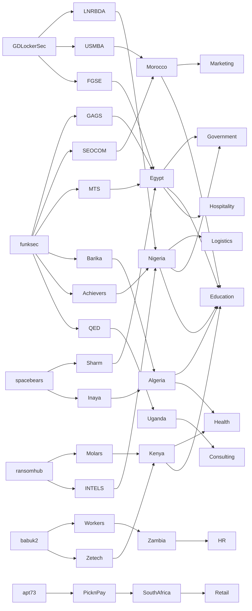

Graphe CTI AFRINTEL — Actors → Victims → Countries → Sectors

```mermaid
graph LR

%% ACTORS
funksec
GDLockerSec
babuk2
ransomhub
spacebears
apt73

%% VICTIMS
GAGS
SEOCOM
MTS
Barika
Achievers
QED
LNRBDA
USMBA
FGSE
Workers
Zetech
Molars
INTELS
Sharm
Inaya
PicknPay

%% COUNTRIES
Egypt
Morocco
Algeria
Nigeria
Kenya
SouthAfrica
Uganda
Zambia

%% SECTORS
Government
Education
Health
Retail
Logistics
Marketing
Consulting
Hospitality
HR

%% ACTOR -> VICTIMS

funksec --> GAGS
funksec --> SEOCOM
funksec --> MTS
funksec --> Barika
funksec --> Achievers
funksec --> QED

GDLockerSec --> LNRBDA
GDLockerSec --> USMBA
GDLockerSec --> FGSE

babuk2 --> Workers
babuk2 --> Zetech

ransomhub --> Molars
ransomhub --> INTELS

spacebears --> Sharm
spacebears --> Inaya

apt73 --> PicknPay

%% VICTIMS -> COUNTRIES

GAGS --> Egypt
MTS --> Egypt
FGSE --> Egypt
Sharm --> Egypt

SEOCOM --> Morocco
USMBA --> Morocco

Barika --> Algeria
Inaya --> Algeria

INTELS --> Nigeria
Achievers --> Nigeria
LNRBDA --> Nigeria

Molars --> Kenya
Zetech --> Kenya

PicknPay --> SouthAfrica

QED --> Uganda

Workers --> Zambia

%% COUNTRIES -> SECTORS

Egypt --> Government
Egypt --> Education
Egypt --> Hospitality

Morocco --> Marketing
Morocco --> Education

Algeria --> Education
Algeria --> Health

Nigeria --> Logistics
Nigeria --> Government
Nigeria --> Education

Kenya --> Health
Kenya --> Education

SouthAfrica --> Retail

Uganda --> Consulting

Zambia --> HR
```
