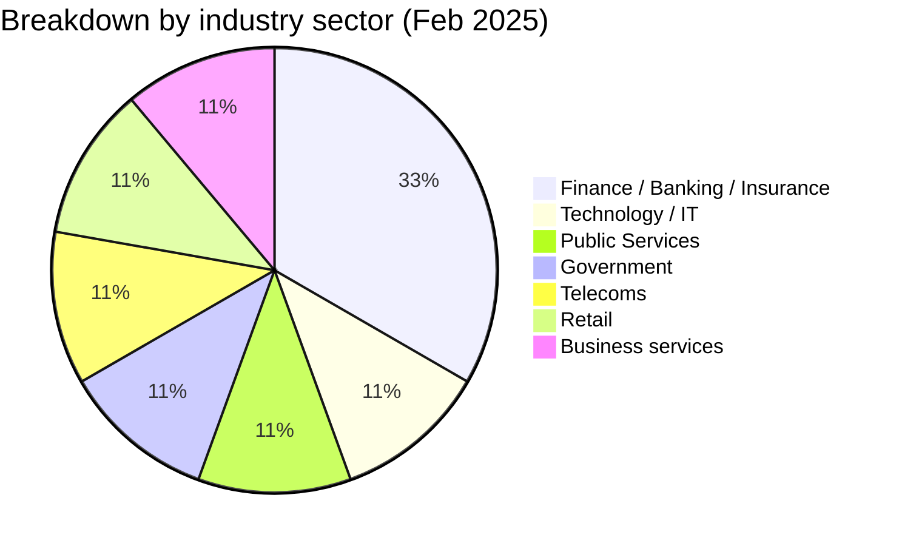
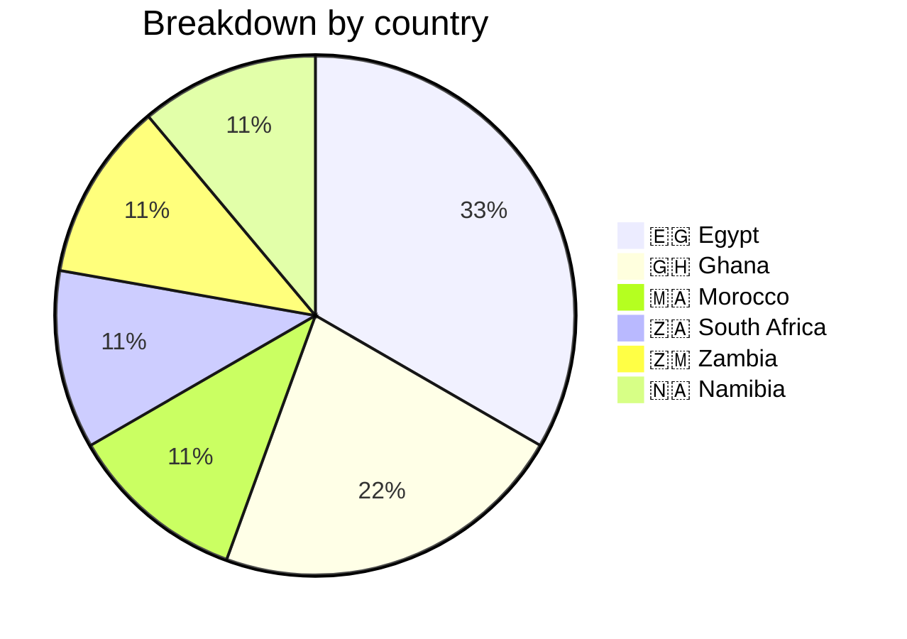
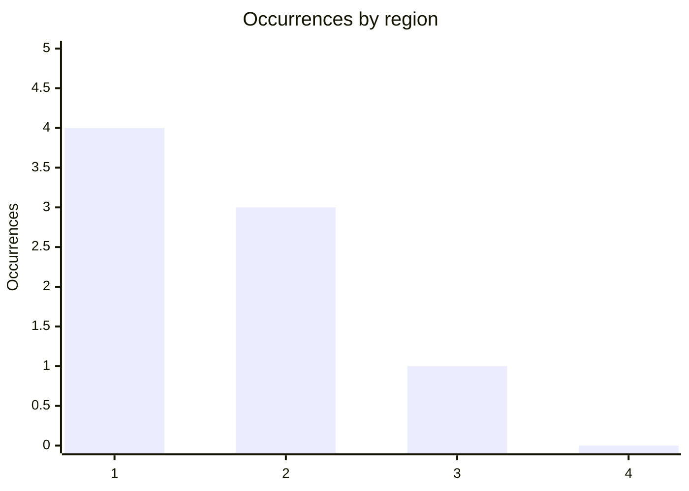
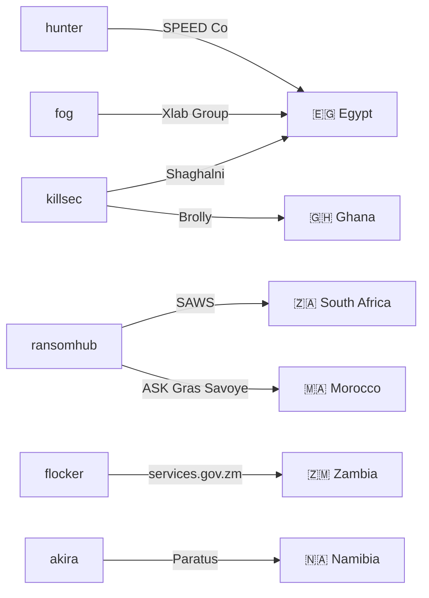
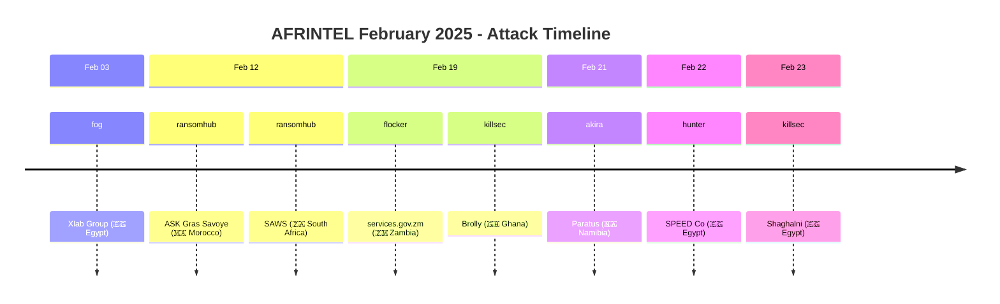

[](https://github.com/Hatchepsoute/AFRINTEL)


 
# CTI report: Cyber attacks in Africa - February 2025
👉🏾 [**French version available here** ](./README_FR.md)
## 1. Introduction
This Cyber Threat Intelligence (CTI) report provides a detailed analysis of cyber attacks that occurred in Africa during February 2025. The information is derived from OSINT sources and ransomware group leak sites, compiled as part of the AFRINTEL project. The objective is to provide a clear overview of trends, threat actors, targeted sectors, and associated indicators of compromise.

## 2. Executive summary
- **Total number of recorded attacks:** 08
- **Most active actors:** ransomhub (2 attacks), killsec (2), fog (1), 0x0day (1), flocker (1), akira (1), hunter (1).
- **Most targeted sectors:** Finance / Banking / Insurance (3), Technology / IT services (1), Public Services (1), Government / Public administrations (1), Telecommunications (1), Retail / Distribution (1), Business services / HR (1).
- **Most affected countries:** Egypt (3), Ghana (2), Morocco (1), South Africa (1), Zambia (1), Namibia (1).
- **Exfiltrated data volume:** 444.8 GB for SPEED Co (Egypt), 1.2 GB for the Zambian government portal. Other volumes are not specified.

## 3. Key statistics

### 3.1 Breakdown by actor
| Actor / Group | Number of attacks |
|-------------------|-------------------|
| ransomhub         | 2                 |
| killsec           | 2                 |
| fog               | 1                 |
| 0x0day *(data leak, under investigation, non-ransomware)* | 1 |
| flocker           | 1                 |
| akira             | 1                 |
| hunter            | 1                 |
| **Total**         | **09**             |

### 3.2 Breakdown by sector
| Sector | Number of Attacks |
|---------|-------------------|
| Finance / Banking / Insurance | 3 |
| Technology / IT services | 1 |
| Public Services (Meteorology) | 1 |
| Government / Public administrations (Portal) | 1 |
| Telecommunications | 1 |
| Retail / Distribution | 1 |
| Business services / HR | 1 |
| **Total** | **09** |



### 3.3 Breakdown by Country
| Country | Number of attacks |
|------|-------------------|
|🇪🇬 Egypt | 3 |
|🇬🇭 Ghana | 2 |
|🇲🇦 Morocco | 1 |
|🇿🇦 South Africa | 1 |
|🇿🇲  Zambia | 1 |
|🇳🇦 Namibia | 1 |
| **Total** | **09** |




<!-- AFRINTEL_CURRENT_MODEL_START -->
### 3.4 Standard global overview

| Country | Ransomware | Leaks / access | Total | Distribution |
| :--- | ---: | ---: | ---: | :--- |
| 🇪🇬 Egypt | 3 | 0 | 3 | 🟧🟧🟧 |
| 🇬🇭 Ghana | 1 | 0 | 1 | 🟧 |
| 🇲🇦 Morocco | 1 | 0 | 1 | 🟧 |
| 🇳🇦 Namibia | 1 | 0 | 1 | 🟧 |
| 🇿🇦 South Africa | 1 | 0 | 1 | 🟧 |
| 🇿🇲 Zambia | 1 | 0 | 1 | 🟧 |

```pie showData
    title Incident types
    "Ransomware" : 8
    "Leaks and access" : 0
```

### Geographic distribution by region

| Region | Occurrences | Ransomware | Leaks / access | Distribution |
| :--- | ---: | ---: | ---: | :--- |
| North Africa | 4 | 4 | 0 | 🟧🟧🟧🟧 |
| Southern Africa | 3 | 3 | 0 | 🟧🟧🟧 |
| West and Central Africa | 1 | 1 | 0 | 🟧 |
| East Africa | 0 | 0 | 0 |  |


Legend: 1 = North Africa; 2 = Southern Africa; 3 = West and Central Africa; 4 = East Africa

### Sector distribution

| Sector | Records | Share | Activity |
| :--- | ---: | ---: | :--- |
| Technology / IT | 3 | 37.5% | ██████████ |
| Finance / Banking | 2 | 25.0% | ███████ |
| Government / Administration | 2 | 25.0% | ███████ |
| Transport / Logistics | 1 | 12.5% | ███ |

### Most visible actors

| Actor / Group | Records | Activity |
| :--- | ---: | :--- |
| killsec | 2 | ██████████ |
| ransomhub | 2 | ██████████ |
| akira | 1 | █████ |
| flocker | 1 | █████ |
| fog | 1 | █████ |
| hunter | 1 | █████ |
<!-- AFRINTEL_CURRENT_MODEL_END -->
## 4. Detailed attacks by ransomware group

### 4.1 ransomhub (2 attacks)
- **12/02/2025:** ASK Gras Savoye (Morocco, insurance)
- **12/02/2025:** South African Weather Service (South Africa, public services)

*Note:* Ransomhub targeted two entities in the service sector, in Morocco and South Africa, on the same day.

### 4.2 killsec (2 attacks)
- **19/02/2025:** Brolly (Ghana, insurtech)
- **23/02/2025:** Shaghalni (Egypt, recruitment)

*Note:* killsec struck a tech startup and a recruitment platform, showing interest in innovative sectors.

### 4.3 fog (1 attack)
- **03/02/2025:** Xlab Group (Egypt, IT services)

### 4.4 flocker (1 attack)
- **19/02/2025:** Government Services Portal (Zambia, government) – 1.2 GB exfiltrated

### 4.5 akira (1 attack)
- **21/02/2025:** Paratus (Namibia, telecommunications) - pan-African operator

### 4.6 hunter (1 attack)
- **22/02/2025:** SPEED Co (Egypt, logistics) - 444.8 GB exfiltrated (285,891 files)

## 5. Sectoral analysis
- **Business services:** 2 attacks (Xlab Group, Shaghalni). Groups fog and killsec are involved, targeting digital service and HR providers.
- **Insurance / Insurtech:** 2 attacks (ASK Gras Savoye, Brolly). ransomhub and killsec show interest in the financial sector and startups.
- **Telecommunications:** 1 attack (Paratus) by akira, targeting a major operator in Namibia.
- **Logistics:** 1 major attack (SPEED Co) by hunter, with a very large data volume (444.8 GB).
- **Public services:** 1 attack (SAWS) by ransomhub, affecting the South African national weather service.
- **Government:** 1 attack (Zambian portal) by flocker, exposing sensitive citizen data.

## 6. Geographic analysis
- **Egypt:** 3 attacks (Xlab Group, SPEED Co, Shaghalni) - varied sectors (IT, logistics, recruitment). Egypt confirms its position as the most targeted country of the month.
- **South Africa:** 1 attack (SAWS) - national weather service, data potentially used for strategic operations.
- **Morocco:** 1 attack (ASK Gras Savoye) - insurance sector, sensitive customer data.
- **Zambia:** 1 attack (government portal) - 1.2 GB of citizen data exfiltrated.
- **Ghana:** 1 attack (Brolly) - insurtech, personal and financial data.
- **Namibia:** 1 attack (Paratus) - telecommunications, critical infrastructure.

Egypt is the most affected country, with attacks on critical infrastructure (logistics) and digital services.

### 6.1. Actor → victim → country graph

### 6.2. Attack timeline

## 7. Observed TTPs
Based on the available descriptions, we note:
- **Massive exfiltration:** SPEED Co (444.8 GB) and Zambian portal (1.2 GB) show a willingness to collect as much data as possible before encryption.
- **Targeting of critical infrastructures:** logistics (SPEED Co), telecoms (Paratus), public services (SAWS).
- **Emerging sectors:** insurtech (Brolly) and recruitment platforms (Shaghalni) are also targeted, indicating attackers' adaptation to new niches.
- **Use of leak sites:** groups publish samples to prove their compromises and pressure victims.
- **Double extortion:** likely in all cases, with disclosure of sensitive data.

## 8. Recommendations
- **Egypt:** strengthen cybersecurity in the logistics and digital services sectors, which are highly targeted. Implement proactive threat monitoring.
- **Insurance sector:** raise awareness among brokers and insurtechs about ransomware risks, and implement isolated backups.
- **Telecoms:** pan-African operators like Paratus must protect their critical infrastructures and segment their networks.
- **Governments:** public service portals (Zambia) must be prioritized for security, with multi-factor authentication and regular audits.
- **All sectors:** train employees to detect phishing, a likely initial access vector.

## 9. Conclusion
February 2025 saw concentrated activity in Egypt, with large-scale attacks (SPEED Co) and sectoral diversification. The groups ransomhub and killsec stand out for their versatility, striking both traditional insurance companies and innovative startups. The diversity of targets (insurance, telecoms, logistics, government) shows that attackers are adapting to local specificities and promising sectors. Increased vigilance is necessary, particularly for critical infrastructures and emerging digital services.

## ✍🏿 Author
*Adama ASSIONGBON*  
*SOC & Cyber Threat Intelligence Consultant*  
[LinkedIn Profile](https://www.linkedin.com/in/adama-assiongbon-9029893a/)

---
*AFRINTEL - Open CTI Monitoring Initiative on Africa*
