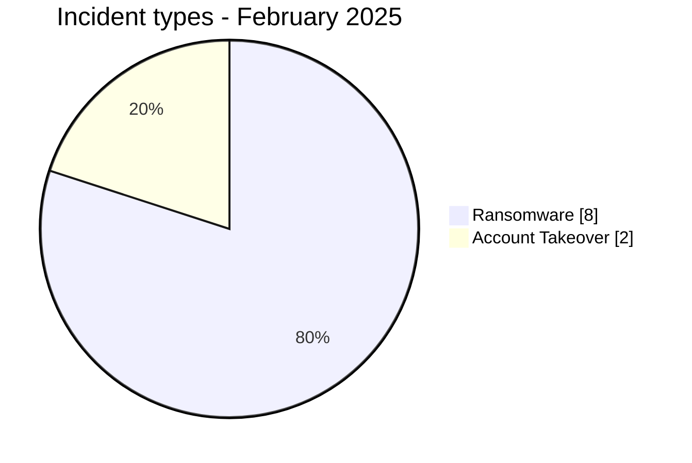
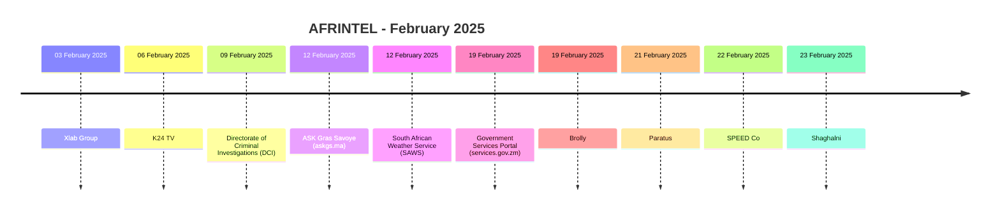

# AFRINTEL CTI Report - Cyber Threats in Africa - February 2025

👉🏾 [Version française](./README_FR.md)

   

## 1. Executive summary

In February 2025, AFRINTEL documents **10 cyber incidents** affecting organizations and digital services across **7 African countries**.

The landscape is dominated by **Ransomware with 8 records (80.0%)**, followed by **Account Takeover with 2 (20.0%)**.

Geographic concentration is significant: **Egypt (3)**, **Kenya (2)**, **Morocco (1)** together account for **6 records, or 60.0% of the month**. This concentration reflects AFRINTEL corpus visibility rather than an exhaustive national compromise rate.

At sector level, the most represented categories are **Government / Administration (2)**, **Finance / Banking (2)**, **Technology / IT (1)**. The most frequent actor labels are `Unknown` (2), `ransomhub` (2), `killsec` (2). `Unknown`, when present, denotes missing attribution rather than a threat actor.

Evidence maturity remains variable: **8 records** are unverified claims or claims accompanied by samples. AFRINTEL maintains a strict separation between **observed facts, claims, corroboration, official confirmation, and technical unknowns**.

Compared with January, monthly volume **decreases by 9 records**. The most visible changes are Ransomware 16->8 (-8), Data Leak 2->0 (-2), Account Takeover 1->2 (+1).

> **Reading note:** AFRINTEL figures describe documented incidents and the visibility of observed threats. They are not an exhaustive measurement of every cyberattack that actually occurred across Africa.

### 1.1 Month-over-month comparison

| Indicator | January 2025 | February 2025 | Change |
|---|---:|---:|---:|
| Total incidents | 19 | 10 | **-9 (-47.4%)** |
| Ransomware | 16 | 8 | **-8 (-50.0%)** |
| Data Leak | 2 | 0 | **-2 (-100.0%)** |
| Access Sale | 0 | 0 | **Stable** |
| DDoS | 0 | 0 | **Stable** |
| Defacement | 0 | 0 | **Stable** |
| Account Takeover | 1 | 2 | **+1 (+100.0%)** |
| System Intrusion | 0 | 0 | **Stable** |
| Malware | 0 | 0 | **Stable** |
| Operational Fraud | 0 | 0 | **Stable** |

## 2. Methodology

- **Scope:** 54 African countries; reference period: February 2025.
- **Source of truth:** validated `victims_FR.md` / `victims.md` pair.
- **Classification:** Ransomware, Data Leak, Access Sale, DDoS, Defacement, Account Takeover, System Intrusion, Malware, and Operational Fraud.
- **Counting:** one canonical record equals one documented cyber incident; cases under investigation remain outside statistics.
- **Timeline:** `Incident date` and `Initial publication date` remain separate. A later disclosure does not artificially move an incident into another month when chronology is sufficiently supported.
- **Uncertain dates:** when no exact day is known, the evidence-supported month or time window is retained.
- **Sources:** public links are retained for supplementary incidents found through OSINT/web research; they are not retroactively imposed on historical or direct Dark Web observations.
- **Evidence:** incident type, status, confidence, impact, and provenance remain separate dimensions.
- **Sectors:** normalization is calculated once from the structured corpus and used identically in FR and EN.
- **Limitation:** frequencies reflect AFRINTEL visibility rather than every real compromise on the continent.

## 3. Overview and incident types

| Indicator | Value |
|---|---:|
| Documented incidents | **10** |
| Countries represented | **7** |
| Regions represented | **4** |
| Leading country | **Egypt (3)** |
| Leading sector | **Government / Administration (2)** |
| Leading actor label | **Unknown (2)** |

| Incident type | Records | Share |
|---|---:|---:|
| Ransomware | 8 | 80.0% |
| Data Leak | 0 | 0.0% |
| Access Sale | 0 | 0.0% |
| DDoS | 0 | 0.0% |
| Defacement | 0 | 0.0% |
| Account Takeover | 2 | 20.0% |
| System Intrusion | 0 | 0.0% |
| Malware | 0 | 0.0% |
| Operational Fraud | 0 | 0.0% |
| **Total** | **10** | **100%** |

## 4. Geographic distribution

| Country | Total | Ransomware | Data Leak | Access Sale | DDoS | Defacement | Account Takeover | System Intrusion | Malware |
|---|---:|---:|---:|---:|---:|---:|---:|---:|---:|
| Egypt | **3** | 3 | 0 | 0 | 0 | 0 | 0 | 0 | 0 |
| Kenya | **2** | 0 | 0 | 0 | 0 | 0 | 2 | 0 | 0 |
| Morocco | **1** | 1 | 0 | 0 | 0 | 0 | 0 | 0 | 0 |
| South Africa | **1** | 1 | 0 | 0 | 0 | 0 | 0 | 0 | 0 |
| Zambia | **1** | 1 | 0 | 0 | 0 | 0 | 0 | 0 | 0 |
| Ghana | **1** | 1 | 0 | 0 | 0 | 0 | 0 | 0 | 0 |
| Namibia | **1** | 1 | 0 | 0 | 0 | 0 | 0 | 0 | 0 |
| **Total** | **10** | **8** | **0** | **0** | **0** | **0** | **2** | **0** | **0** |

> `Operational Fraud = 0` this month; the column is omitted for readability.

## 5. Regional distribution

| Region | Records | Share |
|---|---:|---:|
| North Africa | 4 | 40.0% |
| Southern Africa | 3 | 30.0% |
| East Africa | 2 | 20.0% |
| West Africa | 1 | 10.0% |
| **Total** | **10** | **100%** |

The leading region is **North Africa with 4 records (40.0%)**.

## 6. Sector impact

| Sector | Records | Share | Activity |
|---|---:|---:|---|
| Government / Administration | 2 | 20.0% | ██ |
| Finance / Banking | 2 | 20.0% | ██ |
| Technology / IT | 1 | 10.0% | █ |
| Media / Entertainment | 1 | 10.0% | █ |
| Not specified | 1 | 10.0% | █ |
| Telecommunications | 1 | 10.0% | █ |
| Transport / Logistics | 1 | 10.0% | █ |
| Professional / Business Services | 1 | 10.0% | █ |
| **Total** | **10** | **100%** | |

## 7. Actors / groups

`Unknown` denotes missing attribution, not a threat actor.

| Actor / Group | Records | Activity |
|---|---:|---|
| Unknown | 2 | ██ |
| ransomhub | 2 | ██ |
| killsec | 2 | ██ |
| fog | 1 | █ |
| flocker | 1 | █ |
| akira | 1 | █ |
| hunter | 1 | █ |

## 8. Evidence maturity

| Evidence maturity | Records | Share |
|---|---:|---:|
| Claim - Unverified | 5 | 50.0% |
| Claim - Data Sample Published | 3 | 30.0% |
| Victim/Government/Authority Confirmed | 2 | 20.0% |
| **Total** | **10** | **100%** |

Evidence statuses describe the available validation level; they do not change the technical incident type.

## 9. Timeline

## 10. Monthly CTI analysis

### Ransomware

**8 records** are classified as Ransomware. Leading countries: Egypt (3), Morocco (1), South Africa (1). A leak-site listing does not itself prove encryption or complete exfiltration.

### Account Takeover

**2 Account Takeover records** are documented. Distribution: Kenya (2). This category keeps institutional-account compromise distinct.

## 11. Notable incidents

| Country | Organization | Type | Status | Impact | Confidence |
|---|---|---|---|---|---|
| Kenya | Directorate of Criminal Investigations (DCI) | Account Takeover | Victim Confirmed | Level 4 | Very High |
| Kenya | K24 TV | Account Takeover | Victim Confirmed | Level 3 | High |
| Egypt | Shaghalni | Ransomware | Claim - Data Sample Published | Level 3 | High |
| Egypt | Xlab Group | Ransomware | Claim - Unverified | N/A | N/A |
| Morocco | ASK Gras Savoye (askgs.ma) | Ransomware | Claim - Unverified | N/A | N/A |

> This table highlights up to five records using structured impact, confirmation, and confidence fields. It is not an absolute severity ranking.

## 12. Key findings and intelligence gaps

- **Geographic concentration:** Egypt accounts for 3 records (30.0%), followed by Kenya (2) and Morocco (1).
- **Threat structure:** Ransomware is the leading type with 8 records, followed by Account Takeover (2).
- **Sectors:** Government / Administration (2) and Finance / Banking (2) have the highest visibility.
- **Actors:** the most frequent labels are Unknown (2), ransomhub (2), and killsec (2).
- **Evidence:** 8 records rely on unverified claims or claims with a published sample; these statuses do not equal complete technical confirmation.

### Intelligence gaps

- initial-access vector often not public;
- exact technical compromise date sometimes unknown;
- claimed volumes rarely fully verifiable;
- technical attribution often limited to a publication handle or label;
- public remediation, root-cause, and DFIR conclusions remain limited.

These gaps should guide collection rather than be replaced with assumptions.

## 13. Recommendations

### Organizations

- enforce phishing-resistant MFA on privileged accounts, VPN, email, social media, and administration consoles;
- apply PAM, least privilege, segmentation, and secret rotation;
- maintain immutable backups and test restoration;
- strengthen public applications, APIs, and administration interfaces;
- formalize incident response and data-breach notification.

### SOC and detection

- monitor abnormal authentication, MFA changes, privileged-account creation, and role elevation;
- detect mass database reads, unusual exports, archive creation, and large outbound transfers;
- correlate EDR, IAM, VPN, WAF, proxy, DNS, cloud, and application logs;
- distinguish DDoS, internal intrusion, account compromise, and data exposure to avoid unsupported conclusions.

### CTI

- keep incident date, initial publication, first observation, sample, disclosure, and confirmation separate;
- track republication and resale without automatically counting them as new compromise;
- preserve the evidence hierarchy between claim, corroboration, and confirmation;
- validate FR/EN parity before generating statistics.

## 14. Conclusion

**February 2025** contains **10 documented cyber incidents** across **7 African countries**. The monthly CTI value lies not only in volume but in separating **incident type, timeline, evidence level, geography, sector, and actor**.

The report therefore preserves a structured picture of the observable threat environment while keeping claims, corroboration, confirmations, and unknowns at their actual evidence level.

👉🏾 [See monthly victims](./victims.md)

**AFRINTEL** - TLP:CLEAR
