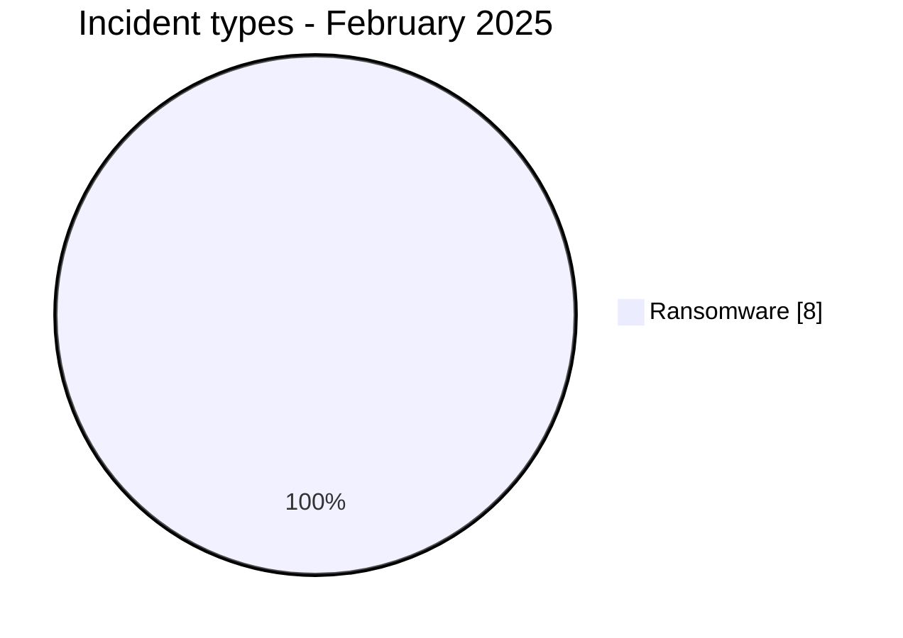
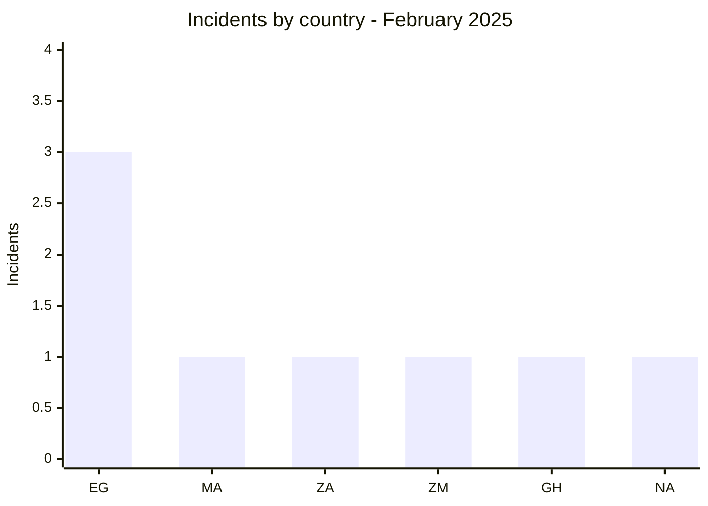
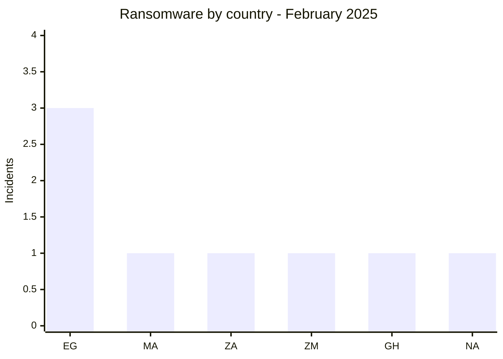
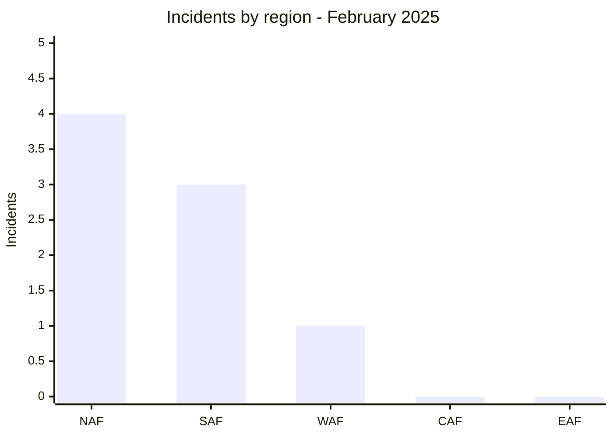
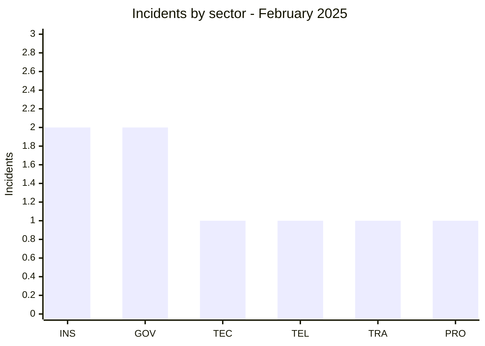
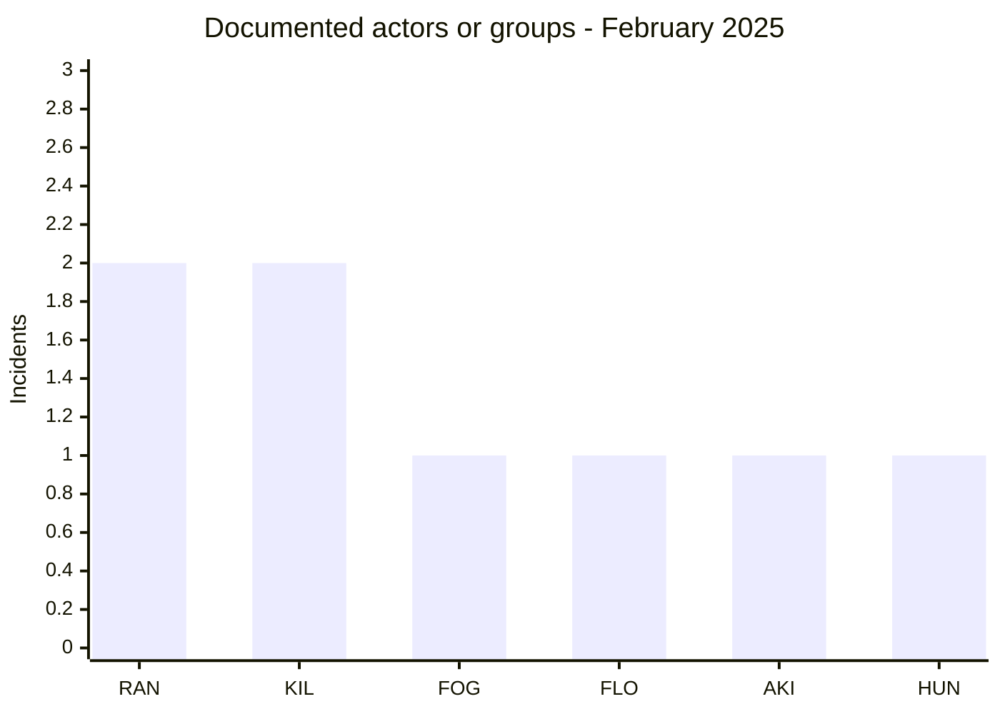

# CTI Report - Cyberattacks in Africa - February 2025

👉🏾 [**French version available here**](./README_FR.md)

## 1. Executive summary

February 2025 contains **8 documented incidents across 6 African countries**. All eight records are classified as **Ransomware** in the structured AFRINTEL taxonomy. No standalone Data Leak, Access Sale, DDoS, Defacement or Operational Fraud is recorded this month.

- **8 incidents**: 8 Ransomware.
- **6 countries**: Egypt (3), Morocco (1), South Africa (1), Zambia (1), Ghana (1), Namibia (1).
- **6 actors / groups**: ransomhub (2), killsec (2), fog (1), flocker (1), akira (1), hunter (1).
- **Leading normalized sectors**: Insurance / Insurtech (2) and Government / Administration (2).
- **Notable volume information**: SPEED Co is associated with a claim of 444.8 GB and 285,891 files; the reviewed material for the Zambian government portal totals approximately 1.6 GB across 44 archive parts, while the actor describes it as a 1.2 GB leak.

### 📋 Victim list

👉🏾 [View the full victim list](./victims.md)

### 1.1 Month-over-month comparison

> Comparison based on the validated bilingual January and February 2025 corpora. The change describes AFRINTEL's documented corpus and does not by itself prove an equivalent change in the real number of compromises.

| Indicator | January 2025 | February 2025 | Observed change |
|---|---:|---:|---:|
| Total incidents | 17 | 8 | **-9 (-52.9%)** |
| Ransomware | 16 | 8 | **-8 (-50.0%)** |
| Data Leak | 1 | 0 | **-1 (-100.0%)** |
| Access Sale | 0 | 0 | **0 (stable)** |
| DDoS | 0 | 0 | **0 (stable)** |
| Defacement | 0 | 0 | **0 (stable)** |
| Operational Fraud | 0 | 0 | **0 (stable)** |

## 2. Methodology

- **Scope**: 54 African countries.
- **Period**: 1-28 February 2025.
- **Sources**: OSINT, leak sites, actor publications, forums and supplied samples when available.
- **Source of truth**: validated bilingual pair [`victims_FR.md`](./victims_FR.md) / [`victims.md`](./victims.md), with editorial review performed first in French.
- **Qualification**: claims, published samples and independent confirmation are kept separate.
- **Counting**: one victim card equals one unique monthly incident.

## 3. Global overview

### 3.1 Incident-type distribution

| Incident type | Count | Share |
|---|---:|---:|
| Ransomware | 8 | 100.0% |
| Data Leak | 0 | 0.0% |
| Access Sale | 0 | 0.0% |
| DDoS | 0 | 0.0% |
| Defacement | 0 | 0.0% |
| Operational Fraud | 0 | 0.0% |
| **Total** | **8** | **100%** |

**Color convention:** 🟧 Ransomware | 🟦 Data Leak | 🟪 Access Sale | 🟥 DDoS | 🟨 Defacement | 🟩 Operational Fraud.

### 3.2 Country distribution

| Country | Ransomware | Data Leak / Access Sale | Total | Distribution |
|---|---:|---:|---:|---|
| 🇪🇬 Egypt | 3 | 0 | 3 | 🟧🟧🟧 |
| 🇲🇦 Morocco | 1 | 0 | 1 | 🟧 |
| 🇿🇦 South Africa | 1 | 0 | 1 | 🟧 |
| 🇿🇲 Zambia | 1 | 0 | 1 | 🟧 |
| 🇬🇭 Ghana | 1 | 0 | 1 | 🟧 |
| 🇳🇦 Namibia | 1 | 0 | 1 | 🟧 |
| **Total** | **8** | **0** | **8** | |

**Legend:** `EG` = Egypt | `MA` = Morocco | `ZA` = South Africa | `ZM` = Zambia | `GH` = Ghana | `NA` = Namibia

### 3.3 Ransomware versus Data Leak / Access Sale by country

All eight records are classified as Ransomware. The Data Leak / Access Sale series is zero for every country.

**Legend:** 🟧 Ransomware | 🟦 Data Leak / Access Sale = 0 across the month.  
**Countries:** `EG` = Egypt | `MA` = Morocco | `ZA` = South Africa | `ZM` = Zambia | `GH` = Ghana | `NA` = Namibia

### 3.4 Geographic distribution by region

| Region | Incidents | Share |
|---|---:|---:|
| North Africa | 4 | 50.0% |
| Southern Africa | 3 | 37.5% |
| West Africa | 1 | 12.5% |
| Central Africa | 0 | 0.0% |
| East Africa | 0 | 0.0% |
| **Total** | **8** | **100%** |

**Legend:** `NAF` = North Africa | `SAF` = Southern Africa | `WAF` = West Africa | `CAF` = Central Africa | `EAF` = East Africa

### 3.5 Sector distribution

| Normalized sector | Incidents | Share | Activity |
|---|---:|---:|---|
| Insurance / Insurtech | 2 | 25.0% | ███████ |
| Government / Administration | 2 | 25.0% | ███████ |
| Technology / IT | 1 | 12.5% | ███ |
| Telecommunications | 1 | 12.5% | ███ |
| Transport / Logistics | 1 | 12.5% | ███ |
| Professional / HR Services | 1 | 12.5% | ███ |
| **Total** | **8** | **100%** | |

**Legend:** `INS` = Insurance / Insurtech | `GOV` = Government / Administration | `TEC` = Technology / IT | `TEL` = Telecommunications | `TRA` = Transport / Logistics | `PRO` = Professional / HR Services

### 3.6 Actors / groups

| Actor / Group | Incidents | Activity |
|---|---:|---|
| ransomhub | 2 | ██████████ |
| killsec | 2 | ██████████ |
| fog | 1 | █████ |
| flocker | 1 | █████ |
| akira | 1 | █████ |
| hunter | 1 | █████ |
| **Total** | **8** | |

**Legend:** `RAN` = ransomhub | `KIL` = killsec | `FOG` = fog | `FLO` = flocker | `AKI` = akira | `HUN` = hunter

## 4. Detailed analysis by incident type

### 4.1 Ransomware - 8 incidents

All eight records are classified as Ransomware: ransomhub and killsec account for two incidents each; fog, flocker, akira and hunter appear once each.

Three cases contain detailed sample analysis in the victim files: the Zambian Government Services Portal, Brolly in Ghana and Shaghalni in Egypt. These analyses add information on the nature of the observed data or artifacts without automatically confirming the full scope claimed by the actors.

## 5. Sectoral impact

**Insurance / Insurtech** and **Government / Administration** each account for **2 of 8 incidents (25.0%)**. Technology / IT, Telecommunications, Transport / Logistics and Professional / HR Services each account for one incident.

This normalized distribution is derived from the organizations' primary activities as described in the victim cards and is used for report statistics.

## 6. Threat actor profile

### 6.1 Profile

ransomhub and killsec are the most visible labels with two records each. The other four actors or groups appear once.

Publication frequency describes only the observed monthly corpus. It is not a direct measure of technical capability or coordination.

### 6.2 Risk assessment

| Country | Risk signal in the corpus |
|---|---|
| Egypt | 3 incidents across digital services, logistics and recruitment |
| Zambia | 1 government incident with system artifacts and administrator-level access described in the reviewed sample |
| South Africa | 1 incident targeting the national weather service |
| Morocco | 1 insurance brokerage incident |
| Ghana | 1 insurtech incident with policy, contract and personal data in the reviewed sample |
| Namibia | 1 telecommunications incident involving a pan-African operator |

## 7. Key trends and intelligence gaps

### 7.1 Observed trends

1. **Egypt leads**: 3 of 8 incidents.
2. **Ransomware-only structured taxonomy**: 8 of 8 records.
3. **Two more frequent labels**: ransomhub and killsec with 2 records each.
4. **Sector diversity**: no normalized sector exceeds 25% of the corpus.

### 7.2 Intelligence gaps

- Initial access remains unknown for several incidents.
- Actor-claimed volumes cannot always be reconciled with the volume actually reviewed.
- A published sample does not, by itself, confirm dataset completeness or operational impact.
- Records without a reviewed sample remain limited to the observed publication or claim.

### 7.3 Monthly evolution

```mermaid
xychart-beta
    title "Documented incidents - January vs February 2025"
    x-axis ["JAN", "FEB"]
    y-axis "Incidents" 0 --> 18
    bar [17, 8]
    bar [16, 8]
```

**Legend:** first series = total incidents | second series = Ransomware.  
`JAN` = January 2025 | `FEB` = February 2025.

The total decreases from **17 to 8**, or **-9 (-52.9%)**. Ransomware decreases from **16 to 8**, or **-8 (-50.0%)**. The single January Data Leak drops from 1 to 0.

## 8. MITRE ATT&CK mapping - contextual

| Phase | Technique | Analytical scope |
|---|---|---|
| Access / Movement | T1021.001 - Remote Desktop Protocol | An RDP artifact is present in the reviewed Zambian portal material; its presence does not prove RDP was the initial-access vector. |
| Credential data | T1555.003 - Credentials from Web Browsers | Browser artifacts in the Zambian case justify defensive monitoring of browser credential stores; no saved-password database was found in the reviewed set. |
| Collection | T1005 - Data from Local System | Defensive context for local exports, documents and artifacts reviewed across several cases. |
| Collection | T1213 - Data from Information Repositories | Relevant to the structured Brolly and Shaghalni data; the collection method is not confirmed. |

> These mappings are contextual and defensive. They do not prove that each actor used the listed techniques.

## 9. Recommendations

- **Insurance / Insurtech**: strengthen access control over policy data, KYC material and customer exports.
- **Government**: monitor administrator accounts, RDP artifacts, certificates, DPAPI material and data movement from privileged endpoints.
- **Telecommunications**: segment networks, protect administrative identities and control remote access.
- **HR and digital platforms**: restrict exports, audit access to verification documents and log administrative operations.

## 10. SOC and tactical recommendations

### Observed

The corpus contains ransomware publications and, for some incidents, reviewed structured samples or system artifacts. The Zambian portal case notably includes material associated with a Windows administrator endpoint, RDP, DPAPI, certificates, browser artifacts and SQL Server.

### Assumptions

Initial access, persistence and complete exfiltration paths are not established across the full corpus.

### Preventive

Monitor administrative authentication, account creation, RDP sessions, data exports, access to certificates and secret stores, and unusual outbound transfers. Maintain MFA, least privilege, segmentation, EDR, tested backups and emergency access-revocation procedures.

## 11. Strategic recommendations

1. Prioritize privileged-identity security and systems holding personal or contractual data.
2. Improve technical evidence collection to distinguish ransomware publication, actual access and operational impact.
3. Strengthen cooperation between CERTs, public administrations and the insurance, telecommunications and digital-services sectors.
4. Keep AFRINTEL statistics tied to the observed corpus rather than presenting them as an exhaustive measure of real cyber activity.

## 12. Conclusion

February 2025 contains **8 documented Ransomware incidents across 6 African countries**. Egypt accounts for 3 records, while ransomhub and killsec are the two most frequent labels with 2 incidents each.

Compared with the harmonized January corpus, the total decreases from **17 to 8 (-52.9%)**. This decrease concerns publications recorded by AFRINTEL and does not by itself establish an equivalent reduction in real cyber activity across Africa.

**AFRINTEL** - Open African CTI Monitoring Initiative
