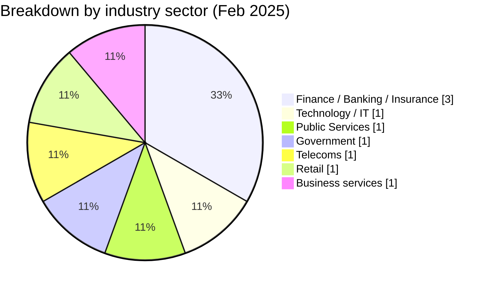
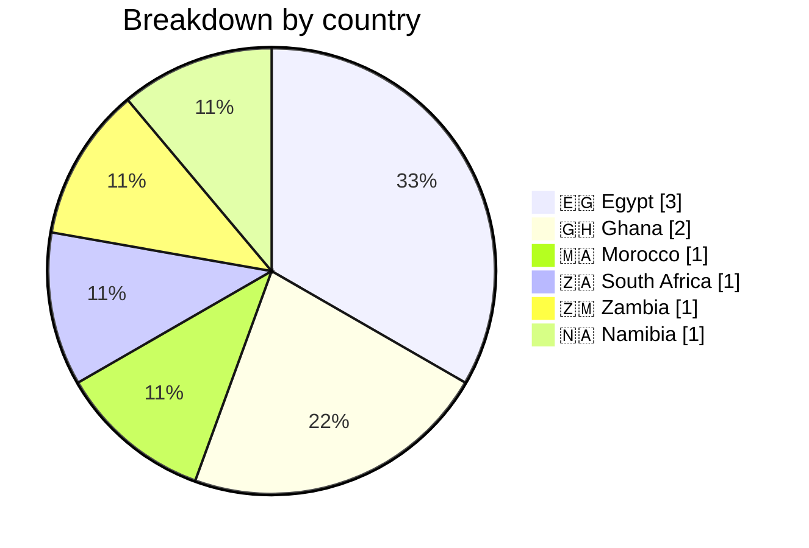
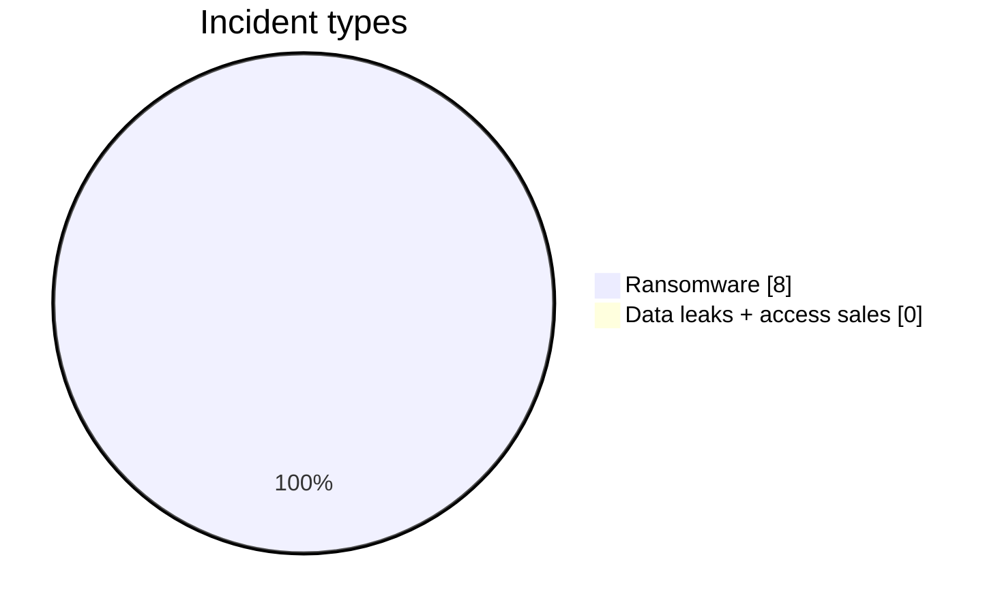
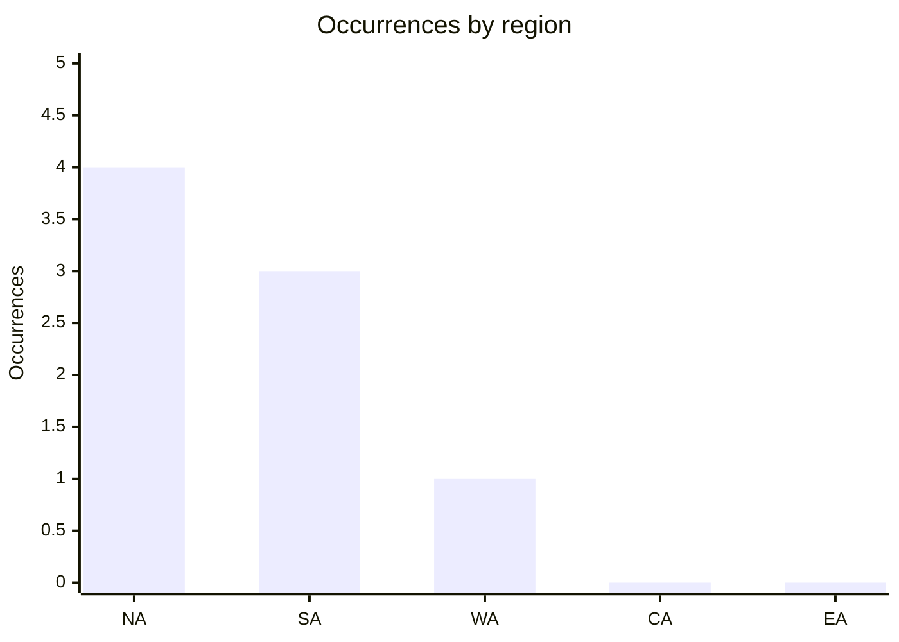
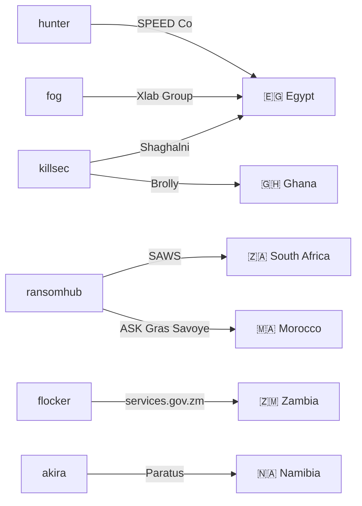
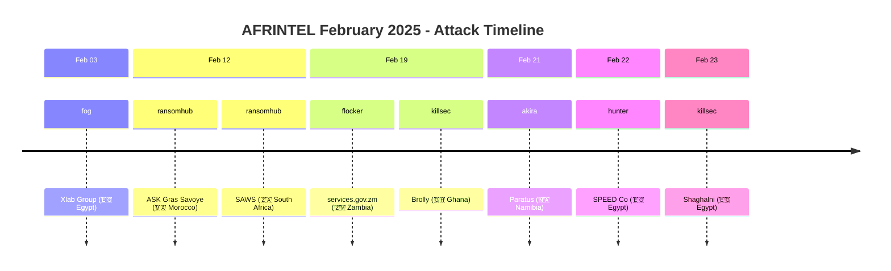

 
# CTI report: Cyber attacks in Africa - February 2025
👉🏾 [**French version available here** ](./README_FR.md)

## 1. Executive summary
- **Total number of recorded attacks:** 08
- **Most active actors:** ransomhub (2 attacks), killsec (2), fog (1), 0x0day (1), flocker (1), akira (1), hunter (1).
- **Most targeted sectors:** Finance / Banking / Insurance (3), Technology / IT services (1), Public Services (1), Government / Public administrations (1), Telecommunications (1), Retail / Distribution (1), Business services / HR (1).
- **Most affected countries:** Egypt (3), Ghana (2), Morocco (1), South Africa (1), Zambia (1), Namibia (1).
- **Exfiltrated data volume:** 444.8 GB for SPEED Co (Egypt), 1.2 GB for the Zambian government portal. Other volumes are not specified.

## 2. Methodology
This Cyber Threat Intelligence (CTI) report provides a detailed analysis of cyber attacks that occurred in Africa during February 2025. The information is derived from OSINT sources and ransomware group leak sites, compiled as part of the AFRINTEL project. The objective is to provide a clear overview of trends, threat actors, targeted sectors, and associated indicators of compromise.

## 3. Global overview

### 3.1 Breakdown by actor
| Actor / Group | Number of attacks |
|-------------------|-------------------|
| ransomhub         | 2                 |
| killsec           | 2                 |
| fog               | 1                 |
| 0x0day *(data leak, under investigation, non-ransomware)* | 1 |
| flocker           | 1                 |
| akira             | 1                 |
| hunter            | 1                 |
| **Total**         | **09**             |

### 3.2 Breakdown by sector
| Sector | Number of Attacks |
|---------|-------------------|
| Finance / Banking / Insurance | 3 |
| Technology / IT services | 1 |
| Public Services (Meteorology) | 1 |
| Government / Public administrations (Portal) | 1 |
| Telecommunications | 1 |
| Retail / Distribution | 1 |
| Business services / HR | 1 |
| **Total** | **09** |

### 3.3 Breakdown by Country
| Country | Number of attacks |
|------|-------------------|
|🇪🇬 Egypt | 3 |
|🇬🇭 Ghana | 2 |
|🇲🇦 Morocco | 1 |
|🇿🇦 South Africa | 1 |
|🇿🇲  Zambia | 1 |
|🇳🇦 Namibia | 1 |
| **Total** | **09** |

<!-- AFRINTEL_CURRENT_MODEL_START -->
### 3.4 Standard global overview

| Country | Ransomware | Data exposure (leaks + access) | Total | Distribution |
| :--- | ---: | ---: | ---: | :--- |
| 🇪🇬 Egypt | 3 | 0 | 3 | 🟧🟧🟧 |
| 🇬🇭 Ghana | 1 | 0 | 1 | 🟧 |
| 🇲🇦 Morocco | 1 | 0 | 1 | 🟧 |
| 🇳🇦 Namibia | 1 | 0 | 1 | 🟧 |
| 🇿🇦 South Africa | 1 | 0 | 1 | 🟧 |
| 🇿🇲 Zambia | 1 | 0 | 1 | 🟧 |

### Monthly aggregate exposure view

The monthly CTI view combines data leaks and access sales as **data exposure**: **0 records** (0.0% of the monthly corpus). The underlying source cards remain authoritative, and an access sale does not by itself prove data exfiltration.

### Geographic distribution by region

| Region | Occurrences | Ransomware | Data exposure (leaks + access) | Distribution |
| :--- | ---: | ---: | ---: | :--- |
| North Africa | 4 | 4 | 0 | 🟧🟧🟧🟧 |
| Southern Africa | 3 | 3 | 0 | 🟧🟧🟧 |
| West Africa | 1 | 1 | 0 | 🟧 |
| Central Africa | 0 | 0 | 0 |  |
| East Africa | 0 | 0 | 0 |  |

Legend: NA = North Africa; SA = Southern Africa; WA = West Africa; CA = Central Africa; EA = East Africa

### Sector distribution

| Sector | Records | Share | Activity |
| :--- | ---: | ---: | :--- |
| Technology / IT | 3 | 37.5% | ██████████ |
| Finance / Banking | 2 | 25.0% | ███████ |
| Government / Administration | 2 | 25.0% | ███████ |
| Transport / Logistics | 1 | 12.5% | ███ |

### Most visible actors

| Actor / Group | Records | Activity |
| :--- | ---: | :--- |
| killsec | 2 | ██████████ |
| ransomhub | 2 | ██████████ |
| akira | 1 | █████ |
| flocker | 1 | █████ |
| fog | 1 | █████ |
| hunter | 1 | █████ |
<!-- AFRINTEL_CURRENT_MODEL_END -->

### Month-on-month comparison

Using the validated incident cards as the counting source, February 2025 recorded **8** incidents versus **16** in the preceding month (a decrease of **-8**; **-50.0%**). This comparison describes recorded publications in AFRINTEL and does not by itself establish changes in attacker activity or confirmed victim impact.

| Metric | Previous month | Current month | Change |
|---|---:|---:|---:|
| Recorded incident cards | 16 | 8 | -8 (-50.0%) |

## 4. Detailed analysis by incident type

### 4.1 ransomhub (2 attacks)
- **12/02/2025:** ASK Gras Savoye (Morocco, insurance)
- **12/02/2025:** South African Weather Service (South Africa, public services)

*Note:* Ransomhub targeted two entities in the service sector, in Morocco and South Africa, on the same day.

### 4.2 killsec (2 attacks)
- **19/02/2025:** Brolly (Ghana, insurtech)
- **23/02/2025:** Shaghalni (Egypt, recruitment)

*Note:* killsec struck a tech startup and a recruitment platform, showing interest in innovative sectors.

### 4.3 fog (1 attack)
- **03/02/2025:** Xlab Group (Egypt, IT services)

### 4.4 flocker (1 attack)
- **19/02/2025:** Government Services Portal (Zambia, government) – 1.2 GB exfiltrated

### 4.5 akira (1 attack)
- **21/02/2025:** Paratus (Namibia, telecommunications) - pan-African operator

### 4.6 hunter (1 attack)
- **22/02/2025:** SPEED Co (Egypt, logistics) - 444.8 GB exfiltrated (285,891 files)

## 5. Sectoral impact
- **Business services:** 2 attacks (Xlab Group, Shaghalni). Groups fog and killsec are involved, targeting digital service and HR providers.
- **Insurance / Insurtech:** 2 attacks (ASK Gras Savoye, Brolly). ransomhub and killsec show interest in the financial sector and startups.
- **Telecommunications:** 1 attack (Paratus) by akira, targeting a major operator in Namibia.
- **Logistics:** 1 major attack (SPEED Co) by hunter, with a very large data volume (444.8 GB).
- **Public services:** 1 attack (SAWS) by ransomhub, affecting the South African national weather service.
- **Government:** 1 attack (Zambian portal) by flocker, exposing sensitive citizen data.

## 6. Threat actor profile
### 6.1 Threat actor profile

Actor and source counts remain those documented in section 3 and in the source victim cards. Attribution is retained only at the level supported by the public record.

### 6.2 Risk assessment

Countries and sectors with repeated records or sensitive public, education, health, financial or critical-service functions should receive priority validation. This is an OSINT prioritization signal, not confirmation of compromise or impact.

- **Egypt:** 3 attacks (Xlab Group, SPEED Co, Shaghalni) - varied sectors (IT, logistics, recruitment). Egypt confirms its position as the most targeted country of the month.
- **South Africa:** 1 attack (SAWS) - national weather service, data potentially used for strategic operations.
- **Morocco:** 1 attack (ASK Gras Savoye) - insurance sector, sensitive customer data.
- **Zambia:** 1 attack (government portal) - 1.2 GB of citizen data exfiltrated.
- **Ghana:** 1 attack (Brolly) - insurtech, personal and financial data.
- **Namibia:** 1 attack (Paratus) - telecommunications, critical infrastructure.

Egypt is the most affected country, with attacks on critical infrastructure (logistics) and digital services.

### 6.1. Actor → victim → country graph

### 6.2. Attack timeline

## 7. Key trends and intelligence gaps
### 7.1 Observed trends

The country, sector, actor and incident-type distributions above are the traceable trends for this month. They describe the monitored corpus and do not establish a broader campaign without independent evidence.

### 7.2 Intelligence gaps

The available reports do not establish the initial access vector, complete exfiltration, victim confirmation, remediation timeline or operational impact for every claim. No public DFIR detail is included in the consulted corpus for this monthly record; this absence is limited to the sources reviewed.

## 8. MITRE ATT&CK mapping (contextual)
| Phase | Technique ID | Name | Incident association |
|---|---|---|---|
| Collection | T1005 | Data from Local System | Contextual mapping for publicly claimed collection or exposure; the method is not confirmed. |
| Collection | T1213 | Data from Information Repositories | Contextual mapping for publicly described records or repositories; the method is not confirmed. |

These ATT&CK mappings are contextual and defensive. They do not prove that a named actor used the technique.

### Contextual observations
Based on the available descriptions, we note:
- **Massive exfiltration:** SPEED Co (444.8 GB) and Zambian portal (1.2 GB) show a willingness to collect as much data as possible before encryption.
- **Targeting of critical infrastructures:** logistics (SPEED Co), telecoms (Paratus), public services (SAWS).
- **Emerging sectors:** insurtech (Brolly) and recruitment platforms (Shaghalni) are also targeted, indicating attackers' adaptation to new niches.
- **Use of leak sites:** groups publish samples to prove their compromises and pressure victims.
- **Double extortion:** likely in all cases, with disclosure of sensitive data.

## 9. Recommendations
- **Egypt:** strengthen cybersecurity in the logistics and digital services sectors, which are highly targeted. Implement proactive threat monitoring.
- **Insurance sector:** raise awareness among brokers and insurtechs about ransomware risks, and implement isolated backups.
- **Telecoms:** pan-African operators like Paratus must protect their critical infrastructures and segment their networks.
- **Governments:** public service portals (Zambia) must be prioritized for security, with multi-factor authentication and regular audits.
- **All sectors:** train employees to detect phishing, a likely initial access vector.

## 10. SOC and tactical recommendations
### Observed

Public records document claims, publications or exposed material. They do not by themselves provide telemetry proving a technique or an active compromise.

### Hypotheses

Credential abuse, exposed storage, weak access controls or excessive export privileges may explain some exposures, but each hypothesis requires validation by the affected organization.

### Preventive

Monitor identity, VPN, cloud, database, email and outbound-transfer telemetry. Enforce phishing-resistant MFA, least privilege, network segmentation, tested backups and rapid token or credential revocation.

## 11. Strategic recommendations
1. **Observed risks:** prioritize validation of the organizations, sectors and data types documented in the monthly corpus.
2. **Hypotheses:** test possible credential, cloud-storage and excessive-export paths without treating them as established facts.
3. **Preventive baseline:** maintain asset inventories, data classification, incident-response exercises, recovery plans and coordinated legal and privacy procedures.

## 12. Conclusion
February 2025 saw concentrated activity in Egypt, with large-scale attacks (SPEED Co) and sectoral diversification. The groups ransomhub and killsec stand out for their versatility, striking both traditional insurance companies and innovative startups. The diversity of targets (insurance, telecoms, logistics, government) shows that attackers are adapting to local specificities and promising sectors. Increased vigilance is necessary, particularly for critical infrastructures and emerging digital services.

### Author
*Adama ASSIONGBON*  
*SOC & Cyber Threat Intelligence Consultant*  
[LinkedIn Profile](https://www.linkedin.com/in/adama-assiongbon-9029893a/)

---
*AFRINTEL - Open CTI Monitoring Initiative on Africa*
