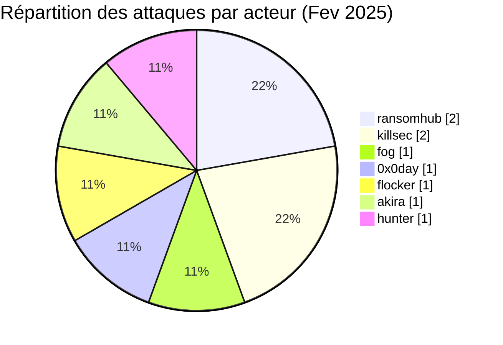
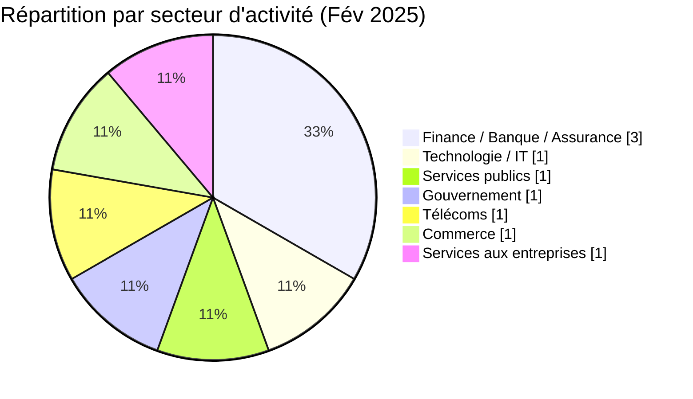
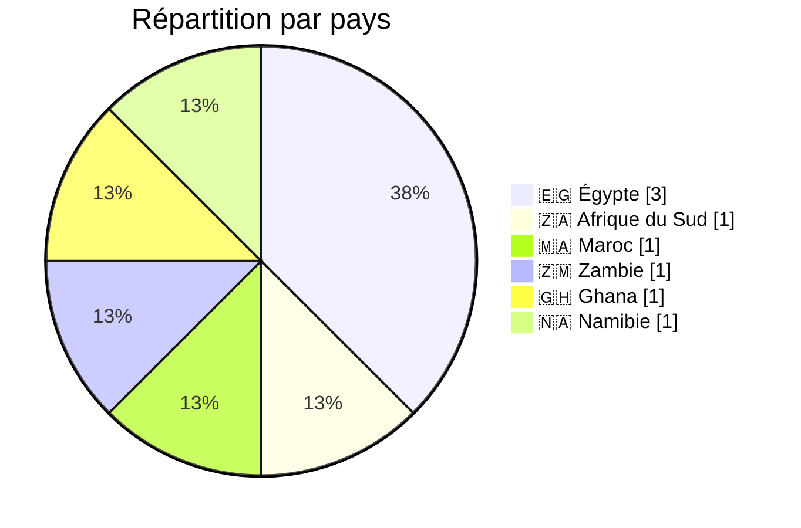
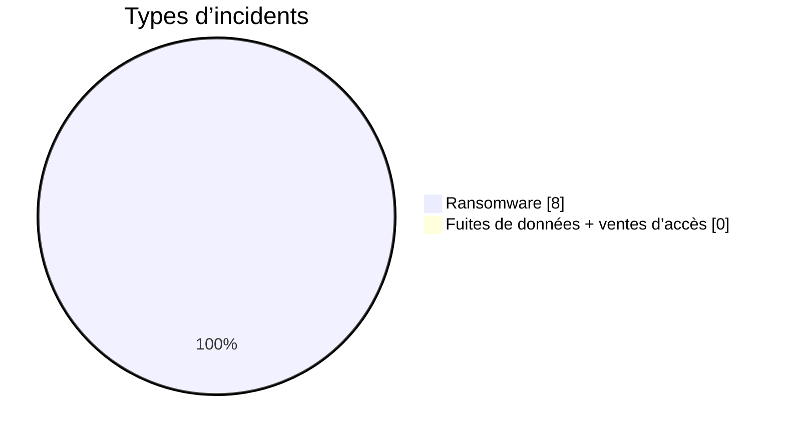
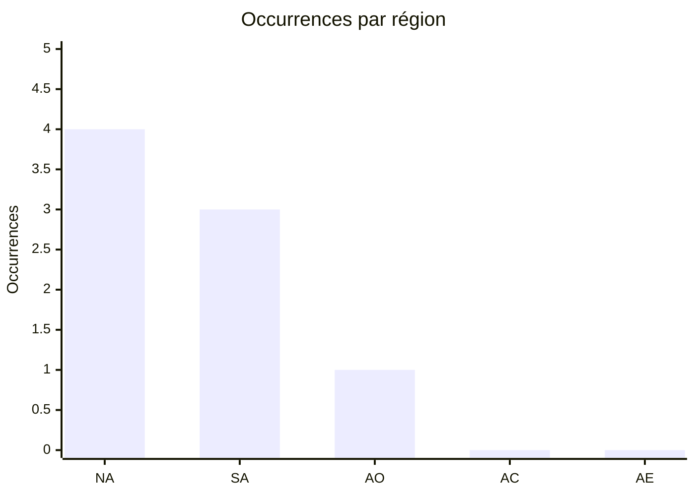
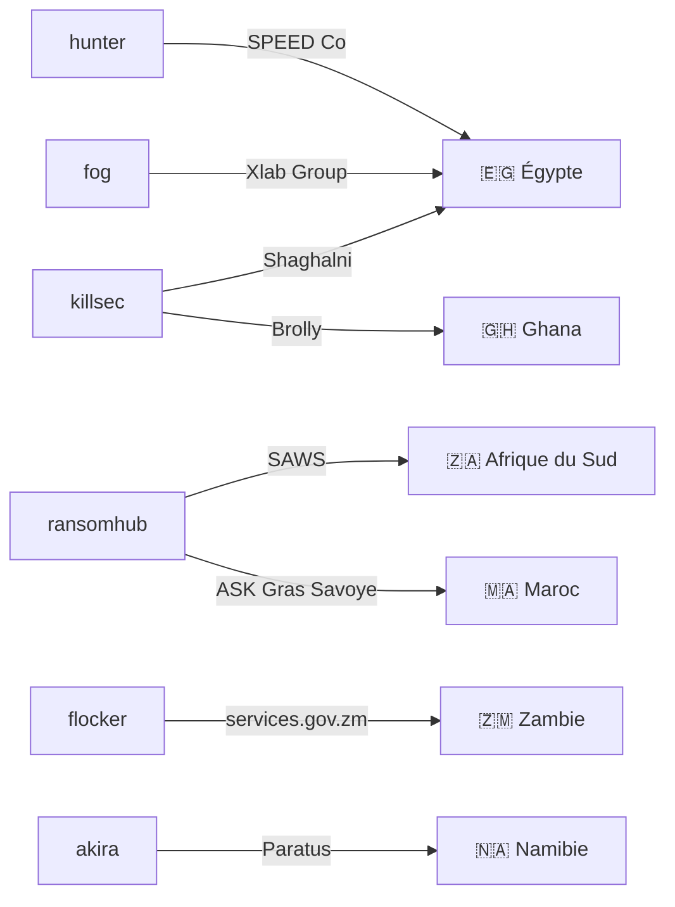
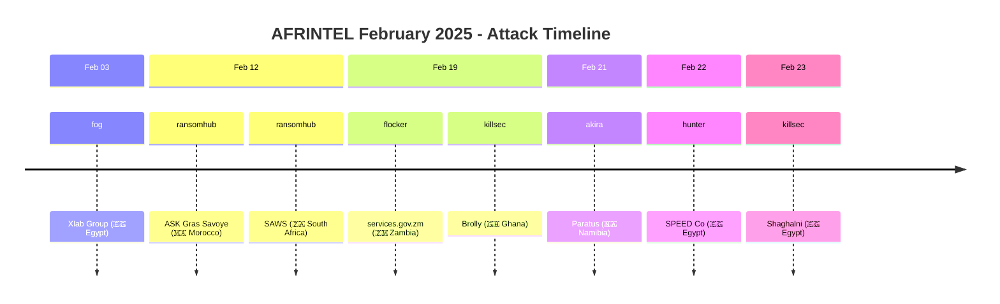

 

# Rapport CTI : Cyberattaques en Afrique - Février 2025
👉🏾 [**English version available here**](README.md)

## 1. Résumé exécutif
- **Nombre total d'attaques recensées** : 08
- **Acteurs les plus actifs** : ransomhub (2 attaques), killsec (2), fog (1), 0x0day (1), flocker (1), akira (1), hunter (1).
- **Secteurs les plus ciblés** : Finance / Banque / Assurance (3), Technologie / Services IT (1), Services publics (1), Gouvernement / Administrations publiques (1), Télécommunications (1), Commerce de détail (1), Services aux entreprises / RH (1).
- **Pays les plus touchés** : Égypte (3), Ghana (2), Maroc (1), Afrique du Sud (1), Zambie (1), Namibie (1).
- **Volume de données exfiltrées** : 444,8 Go pour SPEED Co (Égypte), 1,2 Go pour le portail gouvernemental zambien. Les autres volumes ne sont pas précisés.

## 2. Méthodologie
Ce rapport de Cyber Threat Intelligence (CTI) présente une analyse détaillée des cyberattaques survenues en Afrique durant le mois de février 2025. Les informations sont issues de sources OSINT et de sites de fuites de groupes ransomware, compilées dans le cadre du projet AFRINTEL. L'objectif est de fournir une vision claire des tendances, des acteurs menaçants, des secteurs ciblés et des indicateurs de compromission associés.

## 3. Vue d'ensemble

### 3.1 Répartition par acteur
| Acteur / Groupe | Nombre d'attaques |
|-------------------|-------------------|
| ransomhub         | 2                 |
| killsec           | 2                 |
| fog               | 1                 |
| 0x0day *(fuite de données, sous investigation, non-ransomware)* | 1 |
| flocker           | 1                 |
| akira             | 1                 |
| hunter            | 1                 |
| **Total**         | **09**             |

### 3.2 Répartition par secteur d'activité
| Secteur | Nombre d'attaques |
|---------|-------------------|
| Finance / Banque / Assurance | 3 |
| Technologie / Services IT | 1 |
| Services publics (Météo) | 1 |
| Gouvernement / Administrations publiques (portail) | 1 |
| Télécommunications | 1 |
| Commerce de détail | 1 |
| Services aux entreprises / RH | 1 |
| **Total** | **09** |

### 3.3 Répartition par pays
| Pays | Nombre d'attaques |
|------|-------------------|
| Égypte | 3 |
| Ghana | 2 |
| Maroc | 1 |
| Afrique du Sud | 1 |
| Zambie | 1 |
| Namibie | 1 |
| **Total** | **09** |

<!-- AFRINTEL_CURRENT_MODEL_START -->
### 3.4 Vue globale standardisée

| Pays | Ransomware | Exposition des données (fuites + accès) | Total | Distribution |
| :--- | ---: | ---: | ---: | :--- |
| 🇪🇬 Égypte | 3 | 0 | 3 | 🟧🟧🟧 |
| 🇬🇭 Ghana | 1 | 0 | 1 | 🟧 |
| 🇲🇦 Maroc | 1 | 0 | 1 | 🟧 |
| 🇳🇦 Namibie | 1 | 0 | 1 | 🟧 |
| 🇿🇦 Afrique du Sud | 1 | 0 | 1 | 🟧 |
| 🇿🇲 Zambie | 1 | 0 | 1 | 🟧 |

### Vue agrégée mensuelle de l’exposition

La vue CTI mensuelle regroupe les fuites de données et les ventes d’accès sous **exposition des données** : **0 fiches** (0,0% du corpus mensuel). Les fiches sources restent la référence ; une vente d’accès ne prouve pas à elle seule l’exfiltration de données.

### Répartition géographique par région

| Région | Occurrences | Ransomware | Exposition des données (fuites + accès) | Distribution |
| :--- | ---: | ---: | ---: | :--- |
| Afrique du Nord | 4 | 4 | 0 | 🟧🟧🟧🟧 |
| Afrique australe | 3 | 3 | 0 | 🟧🟧🟧 |
| Afrique de l’Ouest | 1 | 1 | 0 | 🟧 |
| Afrique centrale | 0 | 0 | 0 |  |
| Afrique de l’Est | 0 | 0 | 0 |  |

Légende : NA = Afrique du Nord ; SA = Afrique australe ; AO = Afrique de l’Ouest ; AC = Afrique centrale ; AE = Afrique de l’Est

### Répartition sectorielle

| Secteur | Fiches | Part | Activité |
| :--- | ---: | ---: | :--- |
| Technologies / informatique | 3 | 37,5% | ██████████ |
| Finance / banque | 2 | 25,0% | ███████ |
| Gouvernement / administration | 2 | 25,0% | ███████ |
| Transport / logistique | 1 | 12,5% | ███ |

### Acteurs / groupes les plus présents

| Acteur / Groupe | Fiches | Activité |
| :--- | ---: | :--- |
| killsec | 2 | ██████████ |
| ransomhub | 2 | ██████████ |
| akira | 1 | █████ |
| flocker | 1 | █████ |
| fog | 1 | █████ |
| hunter | 1 | █████ |
<!-- AFRINTEL_CURRENT_MODEL_END -->

### Comparaison avec le mois précédent

À partir des fiches incidents validées comme source de comptage, février 2025 compte **8** incidents contre **16** le mois précédent (une baisse de **-8** ; **-50.0%**). Cette comparaison décrit les publications enregistrées par AFRINTEL et ne prouve pas à elle seule une évolution de l'activité des attaquants ni un impact confirmé sur les victimes.

| Indicateur | Mois précédent | Mois en cours | Variation |
|---|---:|---:|---:|
| Fiches incidents enregistrées | 16 | 8 | -8 (-50.0%) |

## 4. Analyse détaillée par type d'incident

## 5. Impact sectoriel
- **Services aux entreprises** : 2 attaques (Xlab Group, Shaghalni). Les groupes fog et killsec sont impliqués, ciblant des prestataires de services numériques et RH.
- **Assurances / Insurtech** : 2 attaques (ASK Gras Savoye, Brolly). ransomhub et killsec montrent un intérêt pour le secteur financier et les startups.
- **Télécommunications** : 1 attaque (Paratus) par akira, visant un opérateur majeur en Namibie.
- **Logistique** : 1 attaque majeure (SPEED Co) par hunter, avec un volume de données très important (444,8 Go).
- **Services publics** : 1 attaque (SAWS) par ransomhub, touchant le service météo national sud-africain.
- **Gouvernement** : 1 attaque (portail zambien) par flocker, exposant des données sensibles des citoyens.

## 6. Profil des acteurs
### 6.1 Profil des acteurs

Les comptages d'acteurs et de sources restent ceux documentés en section 3 et dans les fiches victimes sources. L'attribution est conservée uniquement au niveau étayé par les éléments publics.

### 6.2 Évaluation du risque

Les pays et secteurs présentant plusieurs fiches ou des fonctions publiques, éducatives, sanitaires, financières ou critiques doivent faire l'objet d'une validation prioritaire. Il s'agit d'un signal de priorisation OSINT, et non d'une confirmation de compromission ou d'impact.

- **Égypte** : 3 attaques (Xlab Group, SPEED Co, Shaghalni) – secteurs variés (IT, logistique, recrutement). L'Égypte confirme sa position de pays le plus ciblé du mois.
- **Afrique du Sud** : 1 attaque (SAWS) – service météo national, données potentiellement utilisées pour des opérations stratégiques.
- **Maroc** : 1 attaque (ASK Gras Savoye) – secteur des assurances, données clients sensibles.
- **Zambie** : 1 attaque (portail gouvernemental) – 1,2 Go de données citoyennes exfiltrées.
- **Ghana** : 1 attaque (Brolly) – insurtech, données personnelles et financières.
- **Namibie** : 1 attaque (Paratus) – télécommunications, infrastructure critique.

L'Égypte est le pays le plus touché, avec des attaques sur des infrastructures critiques (logistique) et des services numériques.

### 6.1. Graphe acteur → victime → pays

### 6.2. Timeline des attaques

## 7. Tendances et lacunes de renseignement
### 7.1 Tendances observées

Les répartitions par pays, secteur, acteur et type d'incident présentées ci-dessus constituent les tendances traçables du mois. Elles décrivent le corpus surveillé et n'établissent pas une campagne plus large sans éléments indépendants.

### 7.2 Lacunes de renseignement

Les rapports disponibles ne permettent pas d'établir pour chaque revendication le vecteur d'accès initial, l'exfiltration complète, la confirmation par la victime, la chronologie de remédiation ou l'impact opérationnel. Aucun détail DFIR public n'est inclus dans le corpus consulté pour cette fiche mensuelle ; cette absence est limitée aux sources examinées.

## 8. Cartographie MITRE ATT&CK (contextuelle)
| Phase | ID technique | Nom | Association à l'incident |
|---|---|---|---|
| Collecte | T1005 | Data from Local System | Correspondance contextuelle pour une collecte ou exposition revendiquée ; la méthode n'est pas confirmée. |
| Collecte | T1213 | Data from Information Repositories | Correspondance contextuelle pour les dossiers ou référentiels décrits publiquement ; la méthode n'est pas confirmée. |

Ces correspondances ATT&CK sont contextuelles et défensives. Elles ne prouvent pas qu'un acteur donné a utilisé la technique.

### Contextual observations
D'après les descriptions disponibles, on note :
- **Exfiltration massive** : SPEED Co (444,8 Go) et portail zambien (1,2 Go) montrent une volonté de collecter un maximum de données avant chiffrement.
- **Ciblage d'infrastructures critiques** : logistique (SPEED Co), télécoms (Paratus), services publics (SAWS).
- **Secteurs émergents** : insurtech (Brolly) et plateformes de recrutement (Shaghalni) sont également visées, indiquant une adaptation des attaquants aux nouvelles niches.
- **Utilisation de sites de fuite** : les groupes publient des échantillons pour prouver leurs compromissions et faire pression sur les victimes.
- **Double extorsion** : probable dans tous les cas, avec divulgation de données sensibles.

## 9. Recommandations
- **Égypte** : renforcer la cybersécurité dans les secteurs de la logistique et des services numériques, très ciblés. Mettre en place une surveillance proactive des menaces.
- **Secteur des assurances** : sensibiliser les courtiers et insurtechs aux risques de ransomware, et mettre en œuvre des sauvegardes isolées.
- **Télécoms** : les opérateurs panafricains comme Paratus doivent protéger leurs infrastructures critiques et segmenter leurs réseaux.
- **Gouvernements** : les portails de services publics (Zambie) doivent être sécurisés en priorité, avec authentification multi-facteurs et audits réguliers.
- **Tous secteurs** : former les employés à la détection des phishing, vecteur d'accès initial probable.

## 10. Recommandations SOC et tactiques
### Observé

Les sources publiques documentent des revendications, des publications ou du matériel exposé. Elles ne fournissent pas à elles seules une télémétrie prouvant une technique ou une compromission active.

### Hypothèses

L'abus d'identifiants, un stockage exposé, des contrôles d'accès faibles ou des privilèges d'export excessifs peuvent expliquer certaines expositions, mais chaque hypothèse doit être vérifiée par l'organisation concernée.

### Préventif

Surveiller les journaux d'identité, VPN, cloud, bases de données, messagerie et transferts sortants. Imposer une MFA résistante au phishing, le moindre privilège, la segmentation, des sauvegardes testées et la révocation rapide des jetons ou identifiants.

## 11. Recommandations stratégiques
1. **Risques observés :** prioriser la validation des organisations, secteurs et types de données documentés dans le corpus mensuel.
2. **Hypothèses :** tester les chemins possibles liés aux identifiants, au stockage cloud et aux exports excessifs sans les présenter comme des faits établis.
3. **Socle préventif :** maintenir l'inventaire des actifs, la classification des données, les exercices de réponse, les plans de reprise et les procédures coordonnées de sécurité, de droit et de protection des données.

## 12. Conclusion
Février 2025 a vu une activité concentrée sur l'Égypte, avec des attaques de grande ampleur (SPEED Co) et une diversification sectorielle. Les groupes ransomhub et killsec se distinguent par leur polyvalence, frappant aussi bien des assurances traditionnelles que des startups innovantes. La diversité des cibles (assurances, télécoms, logistique, gouvernement) montre que les attaquants s'adaptent aux spécificités locales et aux secteurs porteurs. Une vigilance accrue est nécessaire, en particulier pour les infrastructures critiques et les services numériques émergents.

### Auteur
*Adama ASSIONGBON*  
*Consultant SOC & Cyber Threat Intelligence*  
[LinkedIn Profile](https://www.linkedin.com/in/adama-assiongbon-9029893a/)

---
*AFRINTEL - Initiative ouverte de veille CTI sur l’Afrique*
