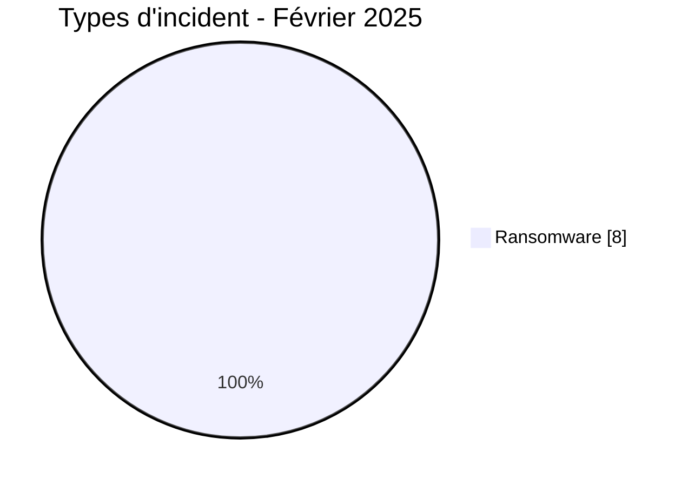
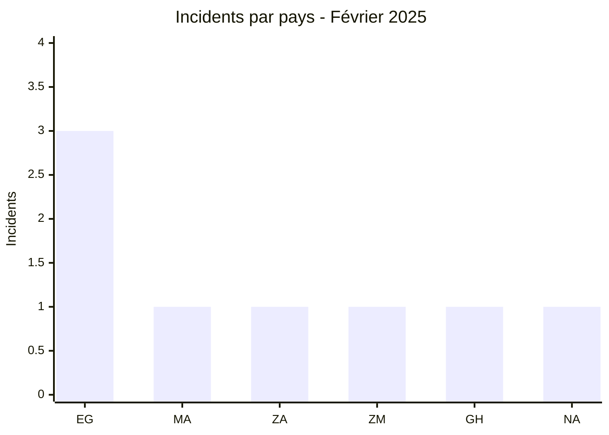
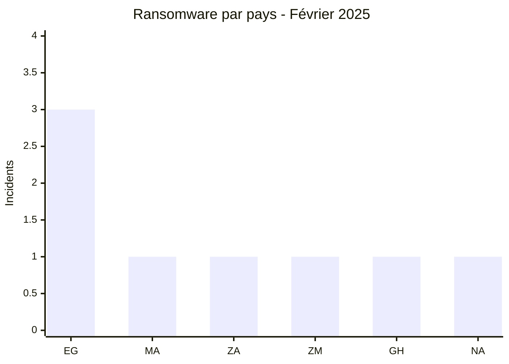
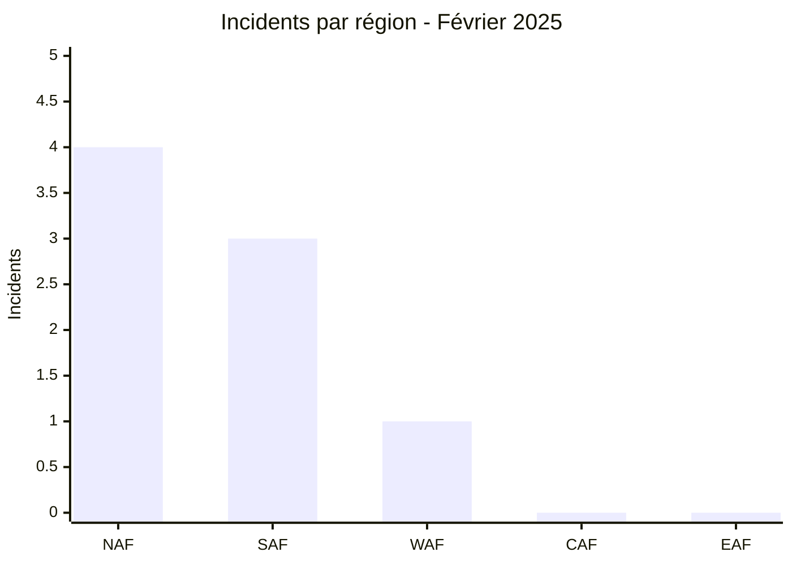
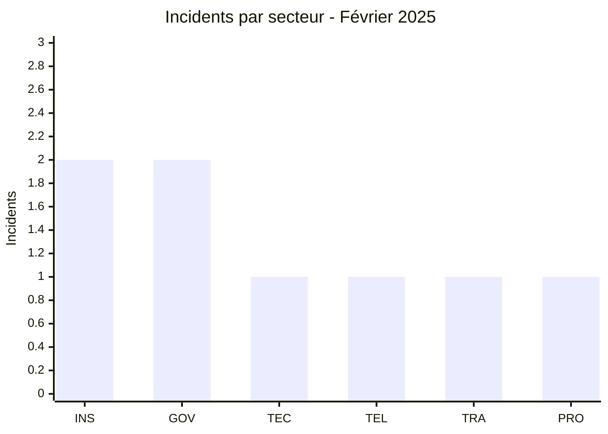
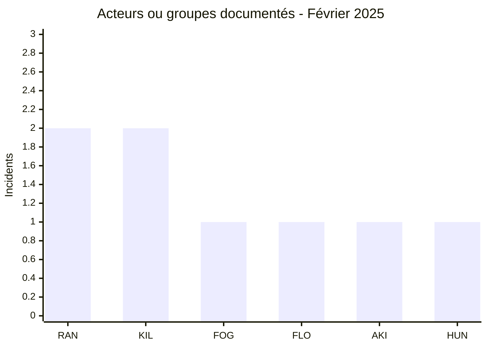

# Rapport CTI - Cyberattaques en Afrique - Février 2025

👉🏾 [**English version available here**](./README.md)

## 1. Synthèse exécutive

Février 2025 compte **8 incidents documentés dans 6 pays africains**. Les huit fiches sont classées **Ransomware** dans la taxonomie structurée AFRINTEL. Aucun Data Leak, Access Sale, DDoS, Defacement ou Operational Fraud autonome n'est enregistré ce mois-ci.

- **8 incidents** : 8 Ransomware.
- **6 pays** : Égypte (3), Maroc (1), Afrique du Sud (1), Zambie (1), Ghana (1), Namibie (1).
- **6 acteurs / groupes** : ransomhub (2), killsec (2), fog (1), flocker (1), akira (1), hunter (1).
- **Principaux secteurs normalisés** : Assurance / Insurtech (2) et Gouvernement / Administration (2).
- **Éléments volumétriques notables** : SPEED Co fait l'objet d'une revendication de 444,8 Go et 285 891 fichiers ; le matériel examiné pour le portail gouvernemental zambien représente environ 1,6 Go réparti dans 44 archives, alors que l'acteur le présente comme une fuite de 1,2 Go.

### 📋 Liste des victimes

👉🏾 [Voir la liste complète des victimes](./victims_FR.md)

### 1.1 Comparaison avec le mois précédent

> Comparaison fondée sur les couples bilingues validés de janvier et février 2025. La variation décrit le corpus documenté par AFRINTEL et ne prouve pas à elle seule une variation équivalente du nombre réel de compromissions.

| Indicateur | Janvier 2025 | Février 2025 | Évolution observée |
|---|---:|---:|---:|
| Total incidents | 17 | 8 | **-9 (-52,9 %)** |
| Ransomware | 16 | 8 | **-8 (-50,0 %)** |
| Data Leak | 1 | 0 | **-1 (-100,0 %)** |
| Access Sale | 0 | 0 | **0 (stable)** |
| DDoS | 0 | 0 | **0 (stable)** |
| Defacement | 0 | 0 | **0 (stable)** |
| Operational Fraud | 0 | 0 | **0 (stable)** |

## 2. Méthodologie

- **Périmètre** : 54 pays africains.
- **Période** : 1er au 28 février 2025.
- **Sources** : OSINT, sites de fuite, publications d'acteurs, forums et échantillons fournis lorsqu'ils sont disponibles.
- **Source de vérité** : couple validé [`victims_FR.md`](./victims_FR.md) / [`victims.md`](./victims.md), avec contrôle éditorial d'abord dans la version française.
- **Qualification** : revendication, publication d'échantillon et confirmation indépendante sont distinguées.
- **Comptage** : une fiche = un incident unique dans le total mensuel.

## 3. Vue d'ensemble

### 3.1 Répartition par type d'incident

| Type d'incident | Nombre | Part |
|---|---:|---:|
| Ransomware | 8 | 100,0 % |
| Data Leak | 0 | 0,0 % |
| Access Sale | 0 | 0,0 % |
| DDoS | 0 | 0,0 % |
| Defacement | 0 | 0,0 % |
| Operational Fraud | 0 | 0,0 % |
| **Total** | **8** | **100 %** |

**Convention couleur :** 🟧 Ransomware | 🟦 Data Leak | 🟪 Access Sale | 🟥 DDoS | 🟨 Defacement | 🟩 Operational Fraud.

### 3.2 Répartition par pays

| Pays | Ransomware | Data Leak / Access Sale | Total | Distribution |
|---|---:|---:|---:|---|
| 🇪🇬 Égypte | 3 | 0 | 3 | 🟧🟧🟧 |
| 🇲🇦 Maroc | 1 | 0 | 1 | 🟧 |
| 🇿🇦 Afrique du Sud | 1 | 0 | 1 | 🟧 |
| 🇿🇲 Zambie | 1 | 0 | 1 | 🟧 |
| 🇬🇭 Ghana | 1 | 0 | 1 | 🟧 |
| 🇳🇦 Namibie | 1 | 0 | 1 | 🟧 |
| **Total** | **8** | **0** | **8** | |

**Légende :** `EG` = Égypte | `MA` = Maroc | `ZA` = Afrique du Sud | `ZM` = Zambie | `GH` = Ghana | `NA` = Namibie

### 3.3 Comparaison Ransomware et fuite / vente d'accès par pays

Les huit fiches sont classées Ransomware. La série Data Leak / Access Sale vaut zéro pour tous les pays.

**Légende :** 🟧 Ransomware | 🟦 Data Leak / Access Sale = 0 sur l'ensemble du mois.  
**Pays :** `EG` = Égypte | `MA` = Maroc | `ZA` = Afrique du Sud | `ZM` = Zambie | `GH` = Ghana | `NA` = Namibie

### 3.4 Répartition géographique par région

| Région | Incidents | Part |
|---|---:|---:|
| Afrique du Nord | 4 | 50,0 % |
| Afrique australe | 3 | 37,5 % |
| Afrique de l'Ouest | 1 | 12,5 % |
| Afrique centrale | 0 | 0,0 % |
| Afrique de l'Est | 0 | 0,0 % |
| **Total** | **8** | **100 %** |

**Légende :** `NAF` = Afrique du Nord | `SAF` = Afrique australe | `WAF` = Afrique de l'Ouest | `CAF` = Afrique centrale | `EAF` = Afrique de l'Est

### 3.5 Répartition sectorielle

| Secteur normalisé | Incidents | Part | Activité |
|---|---:|---:|---|
| Assurance / Insurtech | 2 | 25,0 % | ███████ |
| Gouvernement / Administration | 2 | 25,0 % | ███████ |
| Technologie / IT | 1 | 12,5 % | ███ |
| Télécommunications | 1 | 12,5 % | ███ |
| Transport / Logistique | 1 | 12,5 % | ███ |
| Services professionnels / RH | 1 | 12,5 % | ███ |
| **Total** | **8** | **100 %** | |

**Légende :** `INS` = Assurance / Insurtech | `GOV` = Gouvernement / Administration | `TEC` = Technologie / IT | `TEL` = Télécommunications | `TRA` = Transport / Logistique | `PRO` = Services professionnels / RH

### 3.6 Acteurs / groupes

| Acteur / Groupe | Incidents | Activité |
|---|---:|---|
| ransomhub | 2 | ██████████ |
| killsec | 2 | ██████████ |
| fog | 1 | █████ |
| flocker | 1 | █████ |
| akira | 1 | █████ |
| hunter | 1 | █████ |
| **Total** | **8** | |

**Légende :** `RAN` = ransomhub | `KIL` = killsec | `FOG` = fog | `FLO` = flocker | `AKI` = akira | `HUN` = hunter

## 4. Analyse détaillée par type d'incident

### 4.1 Ransomware - 8 incidents

Les huit fiches sont classées Ransomware : ransomhub et killsec comptent deux incidents chacun ; fog, flocker, akira et hunter apparaissent une fois chacun.

Trois cas disposent d'une analyse d'échantillon détaillée dans les fichiers victimes : le portail gouvernemental zambien, Brolly au Ghana et Shaghalni en Égypte. Ces analyses apportent des éléments supplémentaires sur la nature des données ou artefacts observés sans confirmer automatiquement l'ensemble du périmètre revendiqué par les acteurs.

## 5. Impact sectoriel

Les secteurs **Assurance / Insurtech** et **Gouvernement / Administration** comptent chacun **2 incidents sur 8 (25,0 %)**. Les Technologies / IT, les Télécommunications, le Transport / Logistique et les Services professionnels / RH comptent chacun un incident.

Cette ventilation est normalisée à partir de l'activité principale décrite dans les fiches victimes et sert aux statistiques du rapport.

## 6. Profil des acteurs

### 6.1 Profil

ransomhub et killsec sont les labels les plus présents avec deux fiches chacun. Les quatre autres acteurs ou groupes n'apparaissent qu'une fois.

La fréquence de publication décrit uniquement le corpus mensuel observé. Elle ne constitue pas une mesure directe de capacité technique ou de coordination.

### 6.2 Évaluation du risque

| Pays | Signal de risque dans le corpus |
|---|---|
| Égypte | 3 incidents dans les services numériques, la logistique et le recrutement |
| Zambie | 1 incident gouvernemental avec artefacts système et accès administrateur décrits dans l'échantillon |
| Afrique du Sud | 1 incident visant le service météorologique national |
| Maroc | 1 incident dans le courtage d'assurance |
| Ghana | 1 incident insurtech avec données de police, contrats et informations personnelles dans l'échantillon |
| Namibie | 1 incident télécom visant un opérateur panafricain |

## 7. Tendances et lacunes de renseignement

### 7.1 Tendances observées

1. **Égypte en tête** : 3 des 8 incidents.
2. **Ransomware exclusif dans la taxonomie mensuelle** : 8 fiches sur 8.
3. **Deux labels plus fréquents** : ransomhub et killsec avec 2 fiches chacun.
4. **Diversité sectorielle** : aucun secteur normalisé ne dépasse 25 % du corpus.

### 7.2 Lacunes de renseignement

- Le vecteur d'accès initial reste inconnu pour plusieurs incidents.
- Les volumes revendiqués ne peuvent pas toujours être rapprochés du volume réellement examiné.
- Une publication d'échantillon ne permet pas, à elle seule, de confirmer l'exhaustivité du jeu de données ou l'impact opérationnel.
- Les fiches sans échantillon analysé restent limitées à la publication ou revendication observée.

### 7.3 Évolution mensuelle

```mermaid
xychart-beta
    title "Incidents documentés - Janvier vs Février 2025"
    x-axis ["JAN", "FEB"]
    y-axis "Incidents" 0 --> 18
    bar [17, 8]
    bar [16, 8]
```

**Légende :** première série = total incidents | deuxième série = Ransomware.  
`JAN` = Janvier 2025 | `FEB` = Février 2025.

Le total passe de **17 à 8**, soit **-9 (-52,9 %)**. Le Ransomware passe de **16 à 8**, soit **-8 (-50,0 %)**. La Data Leak présente en janvier passe de 1 à 0.

## 8. Cartographie MITRE ATT&CK contextuelle

| Phase | Technique | Portée analytique |
|---|---|---|
| Accès / Mouvement | T1021.001 - Remote Desktop Protocol | Un artefact RDP est présent dans le matériel examiné du portail zambien ; sa présence ne prouve pas à elle seule l'utilisation de RDP comme vecteur initial. |
| Protection des données / identifiants | T1555.003 - Credentials from Web Browsers | Les artefacts de navigateur du cas zambien justifient une surveillance défensive de l'accès aux magasins de données navigateur ; aucun mot de passe navigateur enregistré n'a été trouvé dans l'ensemble examiné. |
| Collecte | T1005 - Data from Local System | Contexte défensif pour les exports, documents et artefacts locaux examinés dans plusieurs cas. |
| Collecte | T1213 - Data from Information Repositories | Pertinent pour les données structurées de Brolly et Shaghalni ; la méthode de collecte n'est pas confirmée. |

> Les mappings sont contextuels et défensifs. Ils ne prouvent pas que chaque acteur a utilisé les techniques indiquées.

## 9. Recommandations

- **Assurance / Insurtech** : renforcer le contrôle des accès aux données de police, documents KYC et exports clients.
- **Gouvernement** : surveiller les comptes administrateurs, artefacts RDP, certificats, DPAPI et mouvements de données depuis les postes privilégiés.
- **Télécommunications** : segmenter les réseaux, protéger les identités administratives et contrôler les accès distants.
- **Plateformes RH et services numériques** : limiter les exports, auditer les accès aux documents de vérification et journaliser les opérations administratives.

## 10. Recommandations SOC et tactiques

### Observé

Le corpus contient des publications ransomware et, pour certains incidents, des échantillons structurés ou artefacts système examinés. Le portail zambien présente notamment des éléments liés à un poste Windows administrateur, des artefacts RDP, DPAPI, certificats, navigateur et SQL Server.

### Hypothèses

Le mode d'accès initial, la persistance et les chemins d'exfiltration complets ne sont pas établis pour l'ensemble des incidents.

### Préventif

Surveiller les connexions administratives, les créations de comptes, les sessions RDP, les exports de données, les accès aux certificats et magasins de secrets, ainsi que les transferts sortants inhabituels. Maintenir MFA, moindre privilège, segmentation, EDR, sauvegardes testées et procédures de révocation d'urgence.

## 11. Recommandations stratégiques

1. Prioriser la sécurité des identités privilégiées et des systèmes exposant des données personnelles ou contractuelles.
2. Améliorer la collecte de preuves techniques permettant de distinguer publication ransomware, accès réel et impact opérationnel.
3. Renforcer la coopération entre CERT, administrations et secteurs assurance, télécom et services numériques.
4. Conserver les statistiques AFRINTEL comme mesure du corpus observé, et non comme mesure exhaustive des cyberattaques réelles.

## 12. Conclusion

Février 2025 compte **8 incidents Ransomware documentés dans 6 pays africains**. L'Égypte concentre 3 fiches, tandis que ransomhub et killsec sont les deux labels les plus fréquents avec 2 incidents chacun.

Par rapport au corpus harmonisé de janvier, le total diminue de **17 à 8 (-52,9 %)**. Cette baisse concerne les publications enregistrées par AFRINTEL et ne permet pas, à elle seule, de conclure à une diminution équivalente de l'activité cyber réelle en Afrique.

**AFRINTEL** - Initiative ouverte de veille CTI sur l'Afrique
