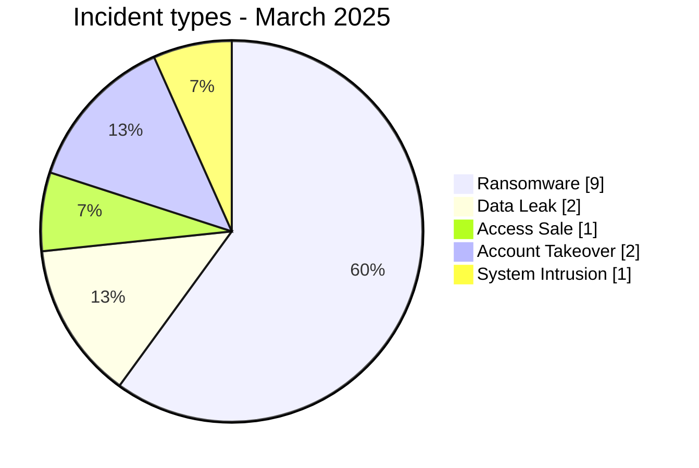
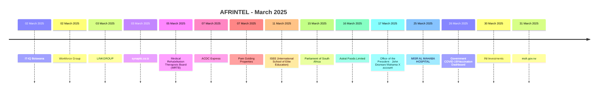

# AFRINTEL CTI Report - Cyber Threats in Africa - March 2025

👉🏾 [Version française](./README_FR.md)

   

## 1. Executive summary

In March 2025, AFRINTEL documents **15 cyber incidents** affecting organizations and digital services across **8 African countries**.

The landscape is dominated by **Ransomware with 9 records (60.0%)**, followed by **Data Leak with 2 (13.3%)**. Other observed types are Account Takeover 2, System Intrusion 1, Access Sale 1.

Geographic concentration is significant: **South Africa (5)**, **Egypt (3)**, **Nigeria (2)** together account for **10 records, or 66.7% of the month**. This concentration reflects AFRINTEL corpus visibility rather than an exhaustive national compromise rate.

At sector level, the most represented categories are **Government / Administration (4)**, **Technology / IT (3)**, **Education / University (2)**. The most frequent actor labels are `Unknown` (4), `arcusmedia` (2), `nightspire` (2). `Unknown`, when present, denotes missing attribution rather than a threat actor.

Evidence maturity remains variable: **11 records** are unverified claims or claims accompanied by samples. AFRINTEL maintains a strict separation between **observed facts, claims, corroboration, official confirmation, and technical unknowns**.

Compared with February, monthly volume **increases by 5 records**. The most visible changes are Data Leak 0->2 (+2), System Intrusion 0->1 (+1), Ransomware 8->9 (+1).

> **Reading note:** AFRINTEL figures describe documented incidents and the visibility of observed threats. They are not an exhaustive measurement of every cyberattack that actually occurred across Africa.

### 1.1 Month-over-month comparison

| Indicator | February 2025 | March 2025 | Change |
|---|---:|---:|---:|
| Total incidents | 10 | 15 | **+5 (+50.0%)** |
| Ransomware | 8 | 9 | **+1 (+12.5%)** |
| Data Leak | 0 | 2 | **+2 (new)** |
| Access Sale | 0 | 1 | **+1 (new)** |
| DDoS | 0 | 0 | **Stable** |
| Defacement | 0 | 0 | **Stable** |
| Account Takeover | 2 | 2 | **Stable** |
| System Intrusion | 0 | 1 | **+1 (new)** |
| Malware | 0 | 0 | **Stable** |
| Operational Fraud | 0 | 0 | **Stable** |

## 2. Methodology

- **Scope:** 54 African countries; reference period: March 2025.
- **Source of truth:** validated `victims_FR.md` / `victims.md` pair.
- **Classification:** Ransomware, Data Leak, Access Sale, DDoS, Defacement, Account Takeover, System Intrusion, Malware, and Operational Fraud.
- **Counting:** one canonical record equals one documented cyber incident; cases under investigation remain outside statistics.
- **Timeline:** `Incident date` and `Initial publication date` remain separate. A later disclosure does not artificially move an incident into another month when chronology is sufficiently supported.
- **Uncertain dates:** when no exact day is known, the evidence-supported month or time window is retained.
- **Sources:** public links are retained for supplementary incidents found through OSINT/web research; they are not retroactively imposed on historical or direct Dark Web observations.
- **Evidence:** incident type, status, confidence, impact, and provenance remain separate dimensions.
- **Sectors:** normalization is calculated once from the structured corpus and used identically in FR and EN.
- **Limitation:** frequencies reflect AFRINTEL visibility rather than every real compromise on the continent.

## 3. Overview and incident types

| Indicator | Value |
|---|---:|
| Documented incidents | **15** |
| Countries represented | **8** |
| Regions represented | **4** |
| Leading country | **South Africa (5)** |
| Leading sector | **Government / Administration (4)** |
| Leading actor label | **Unknown (4)** |

| Incident type | Records | Share |
|---|---:|---:|
| Ransomware | 9 | 60.0% |
| Data Leak | 2 | 13.3% |
| Access Sale | 1 | 6.7% |
| DDoS | 0 | 0.0% |
| Defacement | 0 | 0.0% |
| Account Takeover | 2 | 13.3% |
| System Intrusion | 1 | 6.7% |
| Malware | 0 | 0.0% |
| Operational Fraud | 0 | 0.0% |
| **Total** | **15** | **100%** |

## 4. Geographic distribution

| Country | Total | Ransomware | Data Leak | Access Sale | DDoS | Defacement | Account Takeover | System Intrusion | Malware |
|---|---:|---:|---:|---:|---:|---:|---:|---:|---:|
| South Africa | **5** | 2 | 1 | 0 | 0 | 0 | 1 | 1 | 0 |
| Egypt | **3** | 3 | 0 | 0 | 0 | 0 | 0 | 0 | 0 |
| Nigeria | **2** | 1 | 1 | 0 | 0 | 0 | 0 | 0 | 0 |
| Botswana | **1** | 1 | 0 | 0 | 0 | 0 | 0 | 0 | 0 |
| Tanzania | **1** | 1 | 0 | 0 | 0 | 0 | 0 | 0 | 0 |
| Ghana | **1** | 0 | 0 | 0 | 0 | 0 | 1 | 0 | 0 |
| Burkina Faso | **1** | 0 | 0 | 1 | 0 | 0 | 0 | 0 | 0 |
| Rwanda | **1** | 1 | 0 | 0 | 0 | 0 | 0 | 0 | 0 |
| **Total** | **15** | **9** | **2** | **1** | **0** | **0** | **2** | **1** | **0** |

> `Operational Fraud = 0` this month; the column is omitted for readability.

## 5. Regional distribution

| Region | Records | Share |
|---|---:|---:|
| Southern Africa | 6 | 40.0% |
| West Africa | 4 | 26.7% |
| North Africa | 3 | 20.0% |
| East Africa | 2 | 13.3% |
| **Total** | **15** | **100%** |

The leading region is **Southern Africa with 6 records (40.0%)**.

## 6. Sector impact

| Sector | Records | Share | Activity |
|---|---:|---:|---|
| Government / Administration | 4 | 26.7% | ████ |
| Technology / IT | 3 | 20.0% | ███ |
| Education / University | 2 | 13.3% | ██ |
| Healthcare / Medical | 2 | 13.3% | ██ |
| Retail / E-commerce | 1 | 6.7% | █ |
| Construction / Real Estate | 1 | 6.7% | █ |
| Agriculture / Agribusiness | 1 | 6.7% | █ |
| Finance / Banking | 1 | 6.7% | █ |
| **Total** | **15** | **100%** | |

## 7. Actors / groups

`Unknown` denotes missing attribution, not a threat actor.

| Actor / Group | Records | Activity |
|---|---:|---|
| Unknown | 4 | ████ |
| arcusmedia | 2 | ██ |
| nightspire | 2 | ██ |
| play | 1 | █ |
| killsec | 1 | █ |
| MisterSam | 1 | █ |
| lynx | 1 | █ |
| funksec | 1 | █ |
| Ghudra | 1 | █ |
| babuk2 | 1 | █ |

## 8. Evidence maturity

| Evidence maturity | Records | Share |
|---|---:|---:|
| Claim - Unverified | 7 | 46.7% |
| Claim - Data Sample Published | 4 | 26.7% |
| Victim/Government/Authority Confirmed | 4 | 26.7% |
| **Total** | **15** | **100%** |

Evidence statuses describe the available validation level; they do not change the technical incident type.

## 9. Timeline

## 10. Monthly CTI analysis

### Ransomware

**9 records** are classified as Ransomware. Leading countries: Egypt (3), South Africa (2), Botswana (1). A leak-site listing does not itself prove encryption or complete exfiltration.

### Data Leak

**2 records** are classified as Data Leak. Leading countries: Nigeria (1), South Africa (1). AFRINTEL distinguishes actually observed data from aggregate volumes claimed by actors.

### Access Sale

**1 record(s)** fall under Access Sale. Distribution: Burkina Faso (1). An access offer does not automatically prove exfiltration or compromise of the entire internal environment.

### Account Takeover

**2 Account Takeover records** are documented. Distribution: South Africa (1), Ghana (1). This category keeps institutional-account compromise distinct.

### System Intrusion

**1 System Intrusion records** are documented. Distribution: South Africa (1). The type is used where system access or attempted access is established without enough evidence for a more specific category.

## 11. Notable incidents

| Country | Organization | Type | Status | Impact | Confidence |
|---|---|---|---|---|---|
| South Africa | Parliament of South Africa | Account Takeover | Victim Confirmed | Level 4 | Very High |
| Rwanda | moh.gov.rw | Ransomware | Claim - Data Sample Published | Level 4 | Very High |
| Nigeria | Workforce Group | Ransomware | Claim - Data Sample Published | Level 4 | High |
| South Africa | Pam Golding Properties | Data Leak | Victim Confirmed | Level 3 | Very High |
| South Africa | Astral Foods Limited | System Intrusion | Victim Confirmed | Level 3 | Very High |

> This table highlights up to five records using structured impact, confirmation, and confidence fields. It is not an absolute severity ranking.

## 12. Key findings and intelligence gaps

- **Geographic concentration:** South Africa accounts for 5 records (33.3%), followed by Egypt (3) and Nigeria (2).
- **Threat structure:** Ransomware is the leading type with 9 records, followed by Data Leak (2).
- **Sectors:** Government / Administration (4) and Technology / IT (3) have the highest visibility.
- **Actors:** the most frequent labels are Unknown (4), arcusmedia (2), and nightspire (2).
- **Evidence:** 11 records rely on unverified claims or claims with a published sample; these statuses do not equal complete technical confirmation.

### Intelligence gaps

- initial-access vector often not public;
- exact technical compromise date sometimes unknown;
- claimed volumes rarely fully verifiable;
- technical attribution often limited to a publication handle or label;
- public remediation, root-cause, and DFIR conclusions remain limited.

These gaps should guide collection rather than be replaced with assumptions.

## 13. Recommendations

### Organizations

- enforce phishing-resistant MFA on privileged accounts, VPN, email, social media, and administration consoles;
- apply PAM, least privilege, segmentation, and secret rotation;
- maintain immutable backups and test restoration;
- strengthen public applications, APIs, and administration interfaces;
- formalize incident response and data-breach notification.

### SOC and detection

- monitor abnormal authentication, MFA changes, privileged-account creation, and role elevation;
- detect mass database reads, unusual exports, archive creation, and large outbound transfers;
- correlate EDR, IAM, VPN, WAF, proxy, DNS, cloud, and application logs;
- distinguish DDoS, internal intrusion, account compromise, and data exposure to avoid unsupported conclusions.

### CTI

- keep incident date, initial publication, first observation, sample, disclosure, and confirmation separate;
- track republication and resale without automatically counting them as new compromise;
- preserve the evidence hierarchy between claim, corroboration, and confirmation;
- validate FR/EN parity before generating statistics.

## 14. Conclusion

**March 2025** contains **15 documented cyber incidents** across **8 African countries**. The monthly CTI value lies not only in volume but in separating **incident type, timeline, evidence level, geography, sector, and actor**.

The report therefore preserves a structured picture of the observable threat environment while keeping claims, corroboration, confirmations, and unknowns at their actual evidence level.

👉🏾 [See monthly victims](./victims.md)

**AFRINTEL** - TLP:CLEAR
