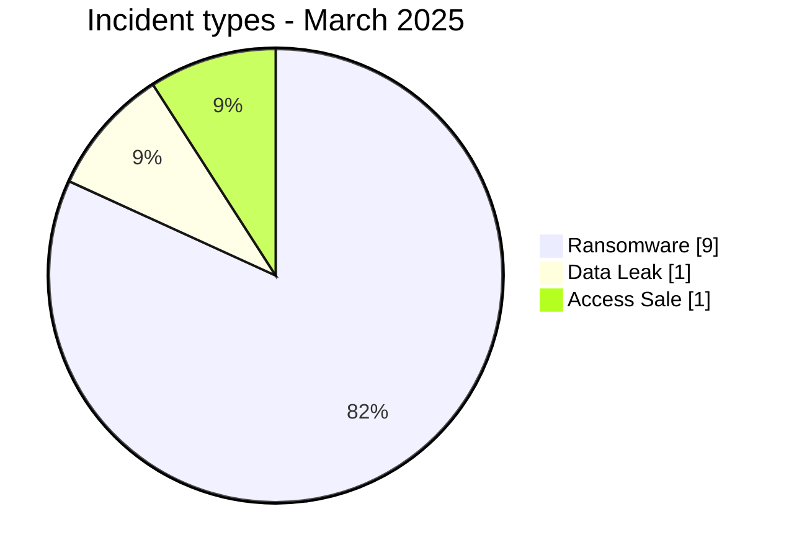
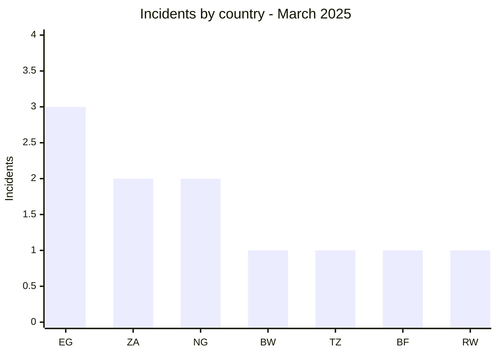
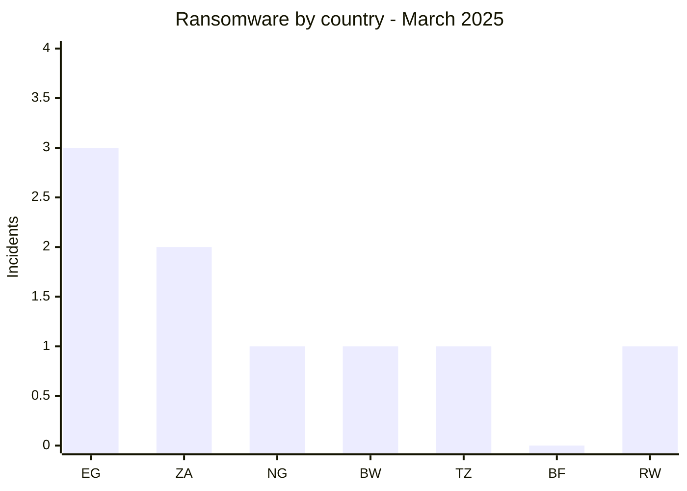
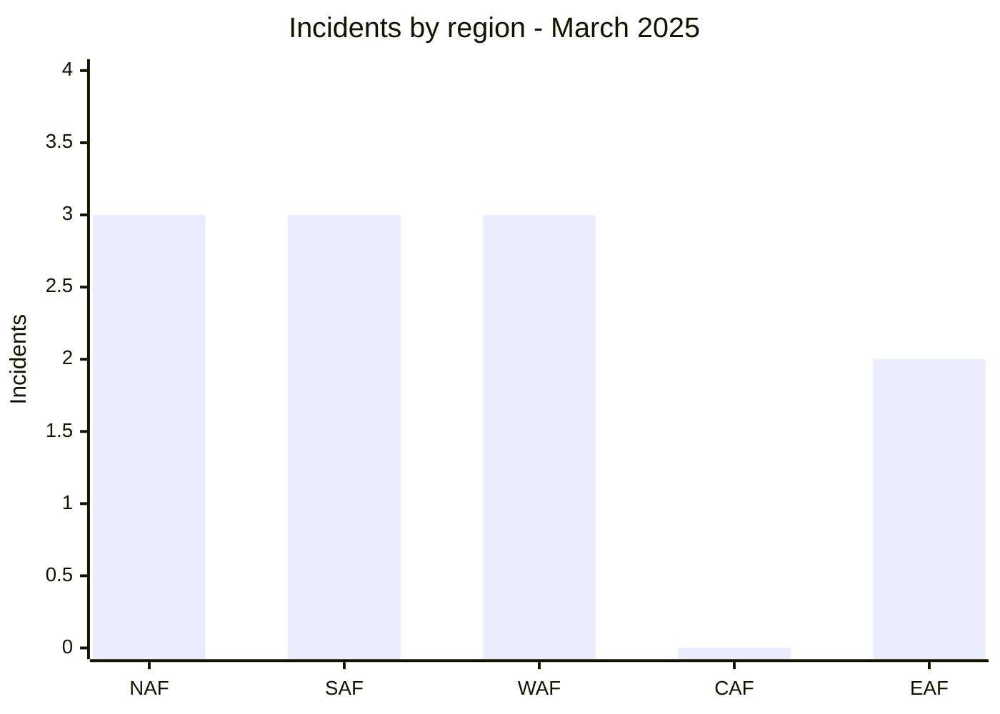
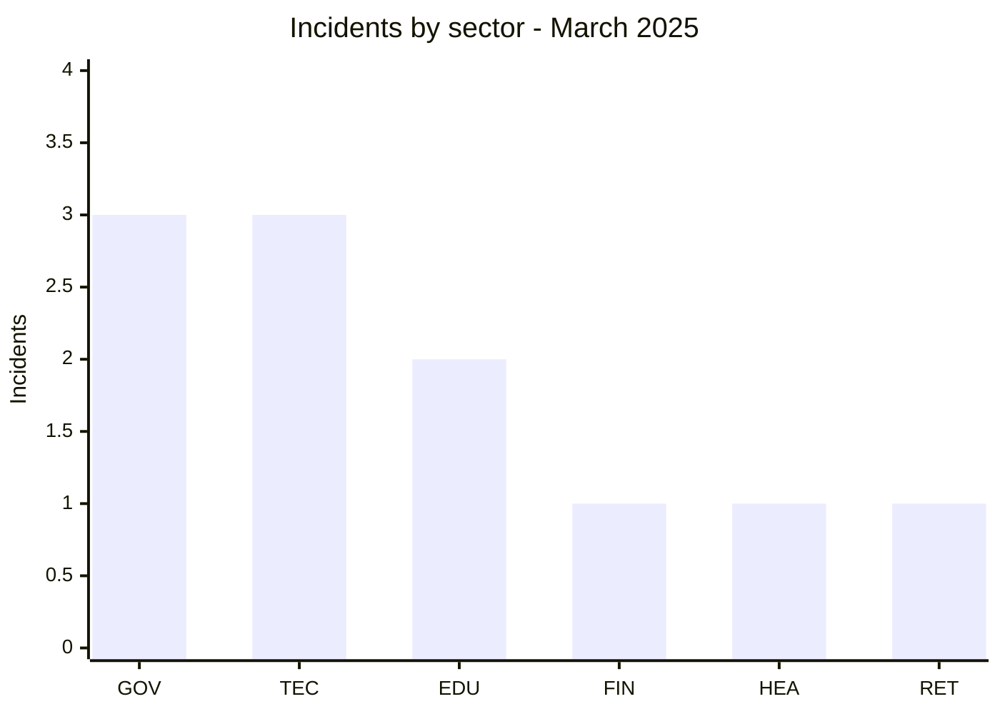
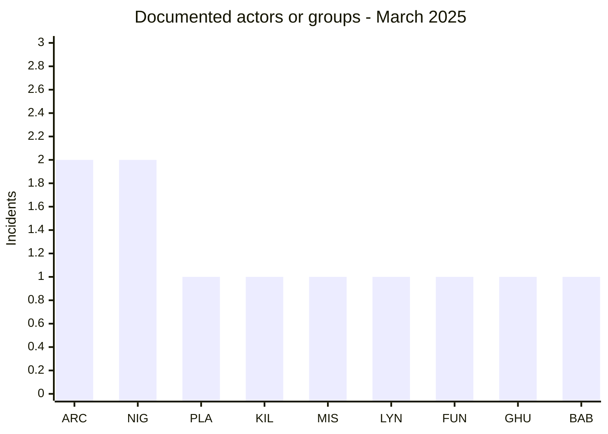

# CTI Report - Cyberattacks in Africa - March 2025

👉🏾 [**French version available here**](./README_FR.md)

## 1. Executive summary

March 2025 contains **11 documented incidents across 7 African countries**: **9 Ransomware, 1 Data Leak and 1 Access Sale**.

- **Egypt** leads with 3 incidents.
- **South Africa** and **Nigeria** record 2 incidents each.
- **arcusmedia** and **nightspire** are the two most visible labels with 2 records each.
- **Government / Administration** and **Technology / IT** each account for 3 incidents.
- **INI Investments** is associated with a claim of 400 GB.
- **MRTB Nigeria** is classified as Data Leak, while the Burkina Faso COVID-19/vaccination dashboard is classified as Access Sale.

### 📋 Victim list

👉🏾 [View the full victim list](./victims.md)

### 1.1 Month-over-month comparison

> Comparison based on validated AFRINTEL bilingual corpora. A change in documented records does not, by itself, prove a change in the real number of compromises.

| Indicator | February 2025 | March 2025 | Observed change |
|---|---:|---:|---:|
| Total incidents | 8 | 11 | **+3 (+37.5%)** |
| Ransomware | 8 | 9 | **+1 (+12.5%)** |
| Data Leak | 0 | 1 | **+1 (new)** |
| Access Sale | 0 | 1 | **+1 (new)** |
| DDoS | 0 | 0 | **0 (stable)** |
| Defacement | 0 | 0 | **0 (stable)** |
| Operational Fraud | 0 | 0 | **0 (stable)** |

## 2. Methodology

- **Scope**: 54 African countries.
- **Period**: 1-31 March 2025.
- **Sources**: OSINT, leak sites, underground forums, actor publications and samples when available.
- **Source of truth**: validated bilingual pair [`victims_FR.md`](./victims_FR.md) / [`victims.md`](./victims.md), with French editorial review before English synchronization.
- **Counting**: one card equals one unique monthly incident.
- **Qualification**: claim, published sample, access sale and independent confirmation remain separate evidence dimensions.

## 3. Global overview

### 3.1 Incident-type distribution

| Incident type | Count | Share |
|---|---:|---:|
| Ransomware | 9 | 81.8% |
| Data Leak | 1 | 9.1% |
| Access Sale | 1 | 9.1% |
| DDoS | 0 | 0.0% |
| Defacement | 0 | 0.0% |
| Operational Fraud | 0 | 0.0% |
| **Total** | **11** | **100%** |

**Color convention:** 🟧 Ransomware | 🟦 Data Leak | 🟪 Access Sale | 🟥 DDoS | 🟨 Defacement | 🟩 Operational Fraud.

### 3.2 Country distribution

| Country | Ransomware | Data Leak | Access Sale | Total | Distribution |
|---|---:|---:|---:|---:|---|
| 🇪🇬 Egypt | 3 | 0 | 0 | 3 | 🟧🟧🟧 |
| 🇿🇦 South Africa | 2 | 0 | 0 | 2 | 🟧🟧 |
| 🇳🇬 Nigeria | 1 | 1 | 0 | 2 | 🟧🟦 |
| 🇧🇼 Botswana | 1 | 0 | 0 | 1 | 🟧 |
| 🇹🇿 Tanzania | 1 | 0 | 0 | 1 | 🟧 |
| 🇧🇫 Burkina Faso | 0 | 0 | 1 | 1 | 🟪 |
| 🇷🇼 Rwanda | 1 | 0 | 0 | 1 | 🟧 |
| **Total** | **9** | **1** | **1** | **11** | |

**Legend:** `EG` = Egypt | `ZA` = South Africa | `NG` = Nigeria | `BW` = Botswana | `TZ` = Tanzania | `BF` = Burkina Faso | `RW` = Rwanda

### 3.3 Comparison by type and country

**Additional reading:** 🟦 Data Leak = Nigeria 1 | 🟪 Access Sale = Burkina Faso 1.  
**Countries:** `EG` = Egypt | `ZA` = South Africa | `NG` = Nigeria | `BW` = Botswana | `TZ` = Tanzania | `BF` = Burkina Faso | `RW` = Rwanda

### 3.4 Geographic distribution by region

| Region | Incidents | Share |
|---|---:|---:|
| North Africa | 3 | 27.3% |
| Southern Africa | 3 | 27.3% |
| West Africa | 3 | 27.3% |
| Central Africa | 0 | 0.0% |
| East Africa | 2 | 18.2% |
| **Total** | **11** | **100%** |

**Legend:** `NAF` = North Africa | `SAF` = Southern Africa | `WAF` = West Africa | `CAF` = Central Africa | `EAF` = East Africa

### 3.5 Sector distribution

| Normalized sector | Incidents | Share | Activity |
|---|---:|---:|---|
| Government / Administration | 3 | 27.3% | ██████████ |
| Technology / IT | 3 | 27.3% | ██████████ |
| Education / University | 2 | 18.2% | ███████ |
| Finance / Banking | 1 | 9.1% | ███ |
| Healthcare / Medical | 1 | 9.1% | ███ |
| Retail / Distribution | 1 | 9.1% | ███ |
| **Total** | **11** | **100%** | |

**Legend:** `GOV` = Government / Administration | `TEC` = Technology / IT | `EDU` = Education / University | `FIN` = Finance / Banking | `HEA` = Healthcare / Medical | `RET` = Retail / Distribution

### 3.6 Actors / groups

| Actor / Group | Incidents | Activity |
|---|---:|---|
| arcusmedia | 2 | ██████████ |
| nightspire | 2 | ██████████ |
| play | 1 | █████ |
| killsec | 1 | █████ |
| MisterSam | 1 | █████ |
| lynx | 1 | █████ |
| funksec | 1 | █████ |
| Ghudra | 1 | █████ |
| babuk2 | 1 | █████ |
| **Total** | **11** | |

**Legend:** `ARC` = arcusmedia | `NIG` = nightspire | `PLA` = play | `KIL` = killsec | `MIS` = MisterSam | `LYN` = lynx | `FUN` = funksec | `GHU` = Ghudra | `BAB` = babuk2

## 4. Detailed analysis by incident type

### 4.1 Ransomware - 9 incidents

The nine Ransomware records are distributed across arcusmedia (2), nightspire (2), play (1), killsec (1), lynx (1), funksec (1) and babuk2 (1).

Several incidents contain reviewed material beyond a simple listing. Workforce Group includes HR data and documents linked to Nigeria's banking ecosystem. ACDC Express has a Lynx publication referencing Encrypted, Proof and AD Dump. Misr Al Mahaba Hospital includes medical and billing documents consistent with the victim. Rwanda's Ministry of Health has the strongest evidence level of the month, with an active web shell, phpMyAdmin access and authentication data described in the sample.

### 4.2 Data Leak - 1 incident

**Medical Rehabilitation Therapists Board of Nigeria (MRTB)** is classified as Data Leak. A forum publication claims that CMS backups contain database access and other credentials. The hidden content, domain and a verifiable sample are not available in the supplied material, so the status remains **Claim - Unverified**.

### 4.3 Access Sale - 1 incident

**Burkina Faso - Government COVID-19/vaccination dashboard** is classified as Access Sale. Ghudra advertises administrator access for **$300**. The domain, access validity, provenance and any relationship with earlier claims remain unknown.

## 5. Sectoral impact

**Government / Administration** and **Technology / IT** each account for **3 of 11 incidents (27.3%)**. **Education / University** accounts for 2. Finance, Healthcare and Retail / Distribution account for one incident each.

This normalization avoids residual categories and reflects the primary activity of documented organizations.

## 6. Threat actor profile

### 6.1 Profile

arcusmedia and nightspire are the two most frequent labels with 2 incidents each. The other seven labels appear once.

### 6.2 Risk assessment

| Country | Risk signal in the corpus |
|---|---|
| Egypt | 3 incidents across education, healthcare and finance |
| Nigeria | 2 incidents, including ransomware with HR/banking data and a claimed data leak against a health regulator |
| South Africa | 2 incidents across IT services and distribution |
| Rwanda | 1 incident with active web shell, database access and authentication data observed |
| Burkina Faso | 1 claimed administrator-access sale |
| Botswana | 1 technology-consulting incident |
| Tanzania | 1 technology-consulting incident |

## 7. Key trends and intelligence gaps

### 7.1 Observed trends

1. **Monthly corpus increase**: 8 incidents in February versus 11 in March.
2. **Incident-type diversification**: March adds 1 Data Leak and 1 Access Sale, while February contained only Ransomware.
3. **Sector concentration**: Government / Administration and Technology / IT together account for 6 of 11 records.
4. **Egypt leads**: 3 incidents.
5. **Uneven evidence depth**: cases range from unverified claims to deep backend access observed in the Rwanda case.

### 7.2 Intelligence gaps

- The domain and credentials associated with the MRTB claim are not visible in the supplied material.
- The real validity of the Burkina Faso access sale is not confirmed.
- Initial access remains unknown for several ransomware incidents.
- Claimed volumes, including 400 GB for INI Investments and 800 GB for ACDC Express, remain actor claims when a complete dataset has not been measured.

### 7.3 Monthly evolution

```mermaid
xychart-beta
    title "Documented incidents - February vs March 2025"
    x-axis ["FEB", "MAR"]
    y-axis "Incidents" 0 --> 12
    bar [8, 11]
    bar [8, 9]
```

**Legend:** first series = total incidents | second series = Ransomware.  
`FEB` = February 2025 | `MAR` = March 2025.

The total increases from **8 to 11 (+37.5%)**. Ransomware increases from **8 to 9 (+12.5%)**. Data Leak and Access Sale each rise from 0 to 1 and are therefore marked as new incident types in the monthly corpus.

## 8. MITRE ATT&CK mapping - contextual

| Phase | Technique | Analytical scope |
|---|---|---|
| Initial access | T1190 - Exploit Public-Facing Application | Relevant as a defensive hypothesis where exposed web applications are involved, but not confirmed across the full corpus. |
| Persistence / Execution | T1505.003 - Web Shell | Directly relevant to Rwanda's Ministry of Health case, where an active PHP web shell is observed. |
| Collection | T1005 - Data from Local System | Context for local files, exports and artifacts observed. |
| Collection | T1213 - Data from Information Repositories | Relevant to structured databases and repositories reviewed in several cases. |

> The mappings are contextual. Only T1505.003 is directly supported by an explicit technical artifact in the monthly corpus.

## 9. Recommendations

- **Public sector**: strengthen exposed-application security, administrator-account monitoring and portal integrity.
- **IT providers**: segment client environments, strengthen MFA and PAM, and monitor exports and remote access.
- **Healthcare**: protect patient databases, professional identities and HR systems with enhanced logging.
- **HR / Banking**: restrict employee-data exports, encrypt sensitive data and monitor access to BVN and onboarding records.

## 10. SOC and tactical recommendations

### Observed

The corpus includes claims, documentary samples, claimed administrator access and, for Rwanda, technical evidence of deep backend access.

### Assumptions

Initial vectors and complete exfiltration paths remain unknown for several cases. Generic assumptions about phishing or credential theft should not be presented as established facts.

### Preventive

Monitor administrator access, web shells, database connections, account creation, large exports, unusual authentication and outbound transfers. Maintain MFA, segmentation, EDR, tested backups, secret rotation and rapid response to suspicious access.

## 11. Strategic recommendations

1. Prioritize security across public administrations, IT providers and healthcare systems.
2. Preserve incident-level evidence grading to avoid turning actor claims into established facts.
3. Keep Data Leak, Access Sale and Ransomware separate in statistics.
4. Strengthen regional information sharing between CERTs, ministries, universities and private operators.

## 12. Conclusion

March 2025 contains **11 incidents across 7 countries**, split into **9 Ransomware, 1 Data Leak and 1 Access Sale**. The total increases by **37.5%** compared with February.

Egypt remains the most represented country with 3 records. Workforce Group, Misr Al Mahaba Hospital and Rwanda's Ministry of Health also show how evidence depth varies significantly from one incident to another, supporting incident-specific CTI qualification.

**AFRINTEL** - Open African CTI Monitoring Initiative
