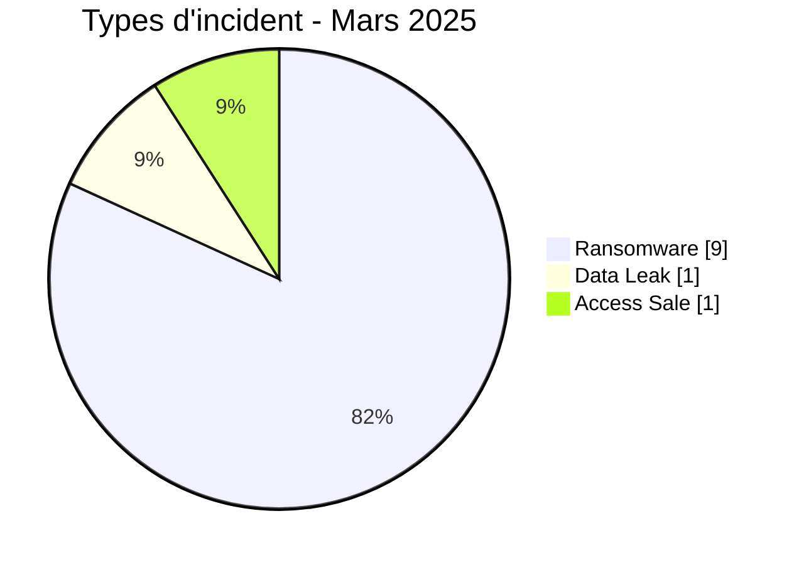
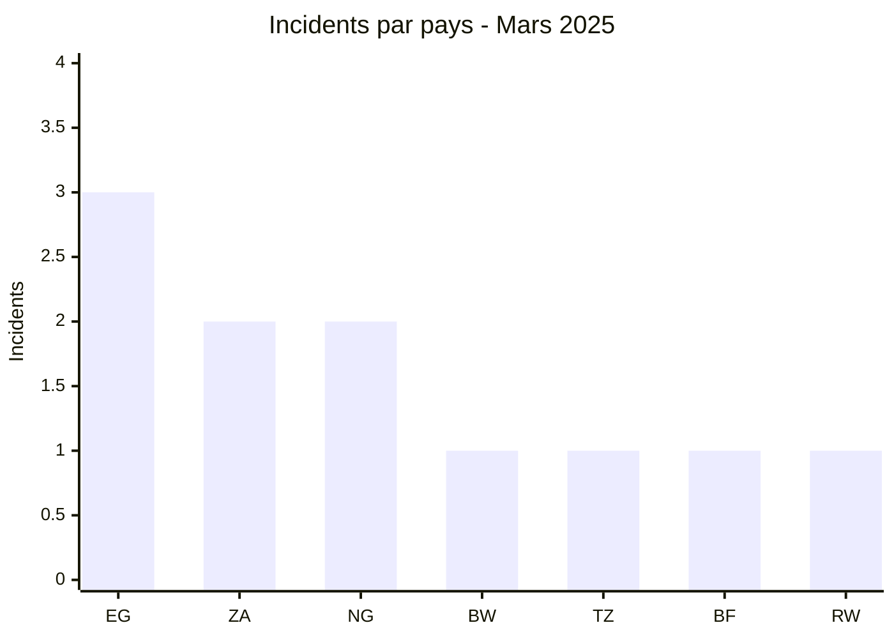
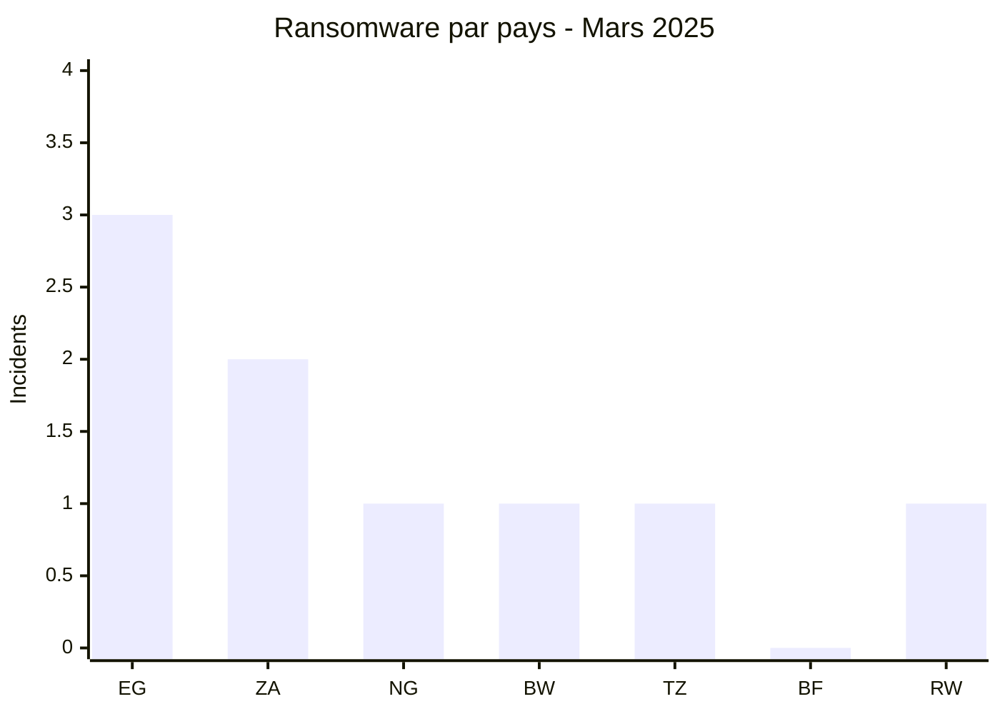
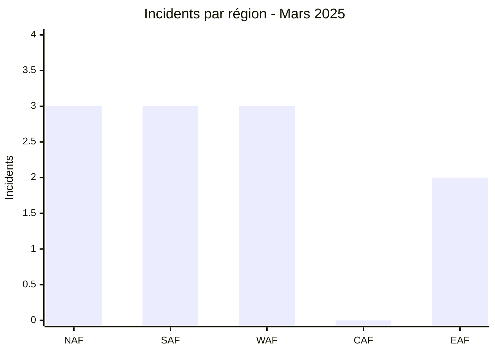
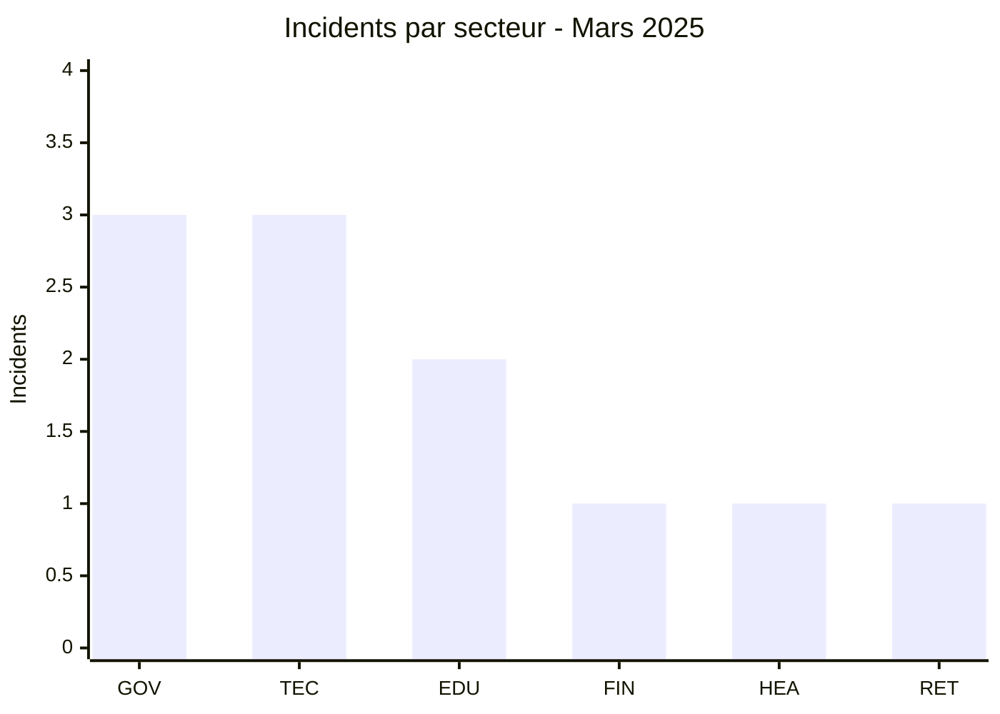
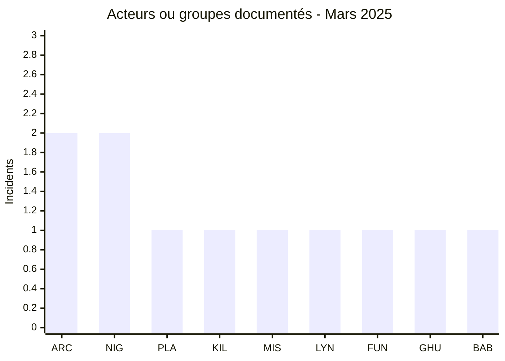

# Rapport CTI - Cyberattaques en Afrique - Mars 2025

👉🏾 [**English version available here**](./README.md)

## 1. Synthèse exécutive

Mars 2025 compte **11 incidents documentés dans 7 pays africains** : **9 Ransomware, 1 Data Leak et 1 Access Sale**.

- **Égypte** arrive en tête avec 3 incidents.
- **Afrique du Sud** et **Nigeria** comptent 2 incidents chacun.
- **arcusmedia** et **nightspire** sont les deux labels les plus présents avec 2 fiches chacun.
- **Gouvernement / Administration** et **Technologie / IT** représentent chacun 3 incidents.
- **INI Investments** fait l'objet d'une revendication de 400 Go.
- Le cas **MRTB Nigeria** est classé Data Leak, tandis que le tableau de bord COVID-19/vaccination du Burkina Faso est classé Access Sale.

### 📋 Liste des victimes

👉🏾 [Voir la liste complète des victimes](./victims_FR.md)

### 1.1 Comparaison avec le mois précédent

> Comparaison fondée sur les couples bilingues AFRINTEL validés. Une variation du nombre de fiches documentées ne prouve pas, à elle seule, une variation du nombre réel de compromissions.

| Indicateur | Février 2025 | Mars 2025 | Évolution observée |
|---|---:|---:|---:|
| Total incidents | 8 | 11 | **+3 (+37,5 %)** |
| Ransomware | 8 | 9 | **+1 (+12,5 %)** |
| Data Leak | 0 | 1 | **+1 (nouveau)** |
| Access Sale | 0 | 1 | **+1 (nouveau)** |
| DDoS | 0 | 0 | **0 (stable)** |
| Defacement | 0 | 0 | **0 (stable)** |
| Operational Fraud | 0 | 0 | **0 (stable)** |

## 2. Méthodologie

- **Périmètre** : 54 pays africains.
- **Période** : 1er au 31 mars 2025.
- **Sources** : OSINT, leak sites, forums underground, publications d'acteurs et échantillons lorsqu'ils sont disponibles.
- **Source de vérité** : couple validé [`victims_FR.md`](./victims_FR.md) / [`victims.md`](./victims.md), avec contrôle éditorial en français avant synchronisation anglaise.
- **Comptage** : une fiche correspond à un incident unique dans le corpus mensuel.
- **Qualification** : revendication, échantillon publié, accès vendu et confirmation indépendante restent des dimensions distinctes.

## 3. Vue d'ensemble

### 3.1 Répartition par type d'incident

| Type d'incident | Nombre | Part |
|---|---:|---:|
| Ransomware | 9 | 81,8 % |
| Data Leak | 1 | 9,1 % |
| Access Sale | 1 | 9,1 % |
| DDoS | 0 | 0,0 % |
| Defacement | 0 | 0,0 % |
| Operational Fraud | 0 | 0,0 % |
| **Total** | **11** | **100 %** |

**Convention couleur :** 🟧 Ransomware | 🟦 Data Leak | 🟪 Access Sale | 🟥 DDoS | 🟨 Defacement | 🟩 Operational Fraud.

### 3.2 Répartition par pays

| Pays | Ransomware | Data Leak | Access Sale | Total | Distribution |
|---|---:|---:|---:|---:|---|
| 🇪🇬 Égypte | 3 | 0 | 0 | 3 | 🟧🟧🟧 |
| 🇿🇦 Afrique du Sud | 2 | 0 | 0 | 2 | 🟧🟧 |
| 🇳🇬 Nigeria | 1 | 1 | 0 | 2 | 🟧🟦 |
| 🇧🇼 Botswana | 1 | 0 | 0 | 1 | 🟧 |
| 🇹🇿 Tanzanie | 1 | 0 | 0 | 1 | 🟧 |
| 🇧🇫 Burkina Faso | 0 | 0 | 1 | 1 | 🟪 |
| 🇷🇼 Rwanda | 1 | 0 | 0 | 1 | 🟧 |
| **Total** | **9** | **1** | **1** | **11** | |

**Légende :** `EG` = Égypte | `ZA` = Afrique du Sud | `NG` = Nigeria | `BW` = Botswana | `TZ` = Tanzanie | `BF` = Burkina Faso | `RW` = Rwanda

### 3.3 Comparaison par type et pays

**Lecture complémentaire :** 🟦 Data Leak = Nigeria 1 | 🟪 Access Sale = Burkina Faso 1.  
**Pays :** `EG` = Égypte | `ZA` = Afrique du Sud | `NG` = Nigeria | `BW` = Botswana | `TZ` = Tanzanie | `BF` = Burkina Faso | `RW` = Rwanda

### 3.4 Répartition géographique par région

| Région | Incidents | Part |
|---|---:|---:|
| Afrique du Nord | 3 | 27,3 % |
| Afrique australe | 3 | 27,3 % |
| Afrique de l'Ouest | 3 | 27,3 % |
| Afrique centrale | 0 | 0,0 % |
| Afrique de l'Est | 2 | 18,2 % |
| **Total** | **11** | **100 %** |

**Légende :** `NAF` = Afrique du Nord | `SAF` = Afrique australe | `WAF` = Afrique de l'Ouest | `CAF` = Afrique centrale | `EAF` = Afrique de l'Est

### 3.5 Répartition sectorielle

| Secteur normalisé | Incidents | Part | Activité |
|---|---:|---:|---|
| Gouvernement / Administration | 3 | 27,3 % | ██████████ |
| Technologie / IT | 3 | 27,3 % | ██████████ |
| Éducation / Université | 2 | 18,2 % | ███████ |
| Finance / Banque | 1 | 9,1 % | ███ |
| Santé / Médical | 1 | 9,1 % | ███ |
| Commerce / Distribution | 1 | 9,1 % | ███ |
| **Total** | **11** | **100 %** | |

**Légende :** `GOV` = Gouvernement / Administration | `TEC` = Technologie / IT | `EDU` = Éducation / Université | `FIN` = Finance / Banque | `HEA` = Santé / Médical | `RET` = Commerce / Distribution

### 3.6 Acteurs / groupes

| Acteur / Groupe | Incidents | Activité |
|---|---:|---|
| arcusmedia | 2 | ██████████ |
| nightspire | 2 | ██████████ |
| play | 1 | █████ |
| killsec | 1 | █████ |
| MisterSam | 1 | █████ |
| lynx | 1 | █████ |
| funksec | 1 | █████ |
| Ghudra | 1 | █████ |
| babuk2 | 1 | █████ |
| **Total** | **11** | |

**Légende :** `ARC` = arcusmedia | `NIG` = nightspire | `PLA` = play | `KIL` = killsec | `MIS` = MisterSam | `LYN` = lynx | `FUN` = funksec | `GHU` = Ghudra | `BAB` = babuk2

## 4. Analyse détaillée par type d'incident

### 4.1 Ransomware - 9 incidents

Les neuf fiches Ransomware sont réparties entre arcusmedia (2), nightspire (2), play (1), killsec (1), lynx (1), funksec (1) et babuk2 (1).

Plusieurs incidents disposent d'éléments examinés allant au-delà d'une simple publication. Workforce Group contient des données RH et des documents liés à l'écosystème bancaire nigérian. ACDC Express comporte une publication Lynx mentionnant Encrypted, Proof et AD Dump. Misr Al Mahaba Hospital inclut des documents médicaux et de facturation cohérents avec la victime. Le cas du ministère rwandais de la Santé présente le niveau de preuve le plus élevé du mois, avec un webshell actif, un accès phpMyAdmin et des données d'authentification décrites dans l'échantillon.

### 4.2 Data Leak - 1 incident

**Medical Rehabilitation Therapists Board of Nigeria (MRTB)** est classé Data Leak. Une publication de forum affirme que des sauvegardes CMS contiennent des accès base de données et d'autres identifiants. Le contenu caché, le domaine et un échantillon vérifiable ne sont toutefois pas disponibles dans les éléments fournis. Le statut reste donc **Claim - Unverified**.

### 4.3 Access Sale - 1 incident

**Burkina Faso - Tableau de bord gouvernemental COVID-19/vaccination** est classé Access Sale. Ghudra propose un accès administrateur pour **300 $**. Le domaine, la validité de l'accès, sa provenance et son lien éventuel avec des revendications antérieures restent inconnus.

## 5. Impact sectoriel

Les secteurs **Gouvernement / Administration** et **Technologie / IT** comptent chacun **3 incidents sur 11 (27,3 %)**. L'**Éducation / Université** représente 2 incidents. Finance, Santé et Commerce / Distribution comptent un incident chacun.

Cette normalisation évite les catégories résiduelles et reflète l'activité principale des organisations documentées.

## 6. Profil des acteurs

### 6.1 Profil

arcusmedia et nightspire sont les deux labels les plus fréquents avec 2 incidents chacun. Les sept autres labels apparaissent une seule fois.

### 6.2 Évaluation du risque

| Pays | Signal de risque dans le corpus |
|---|---|
| Égypte | 3 incidents dans l'éducation, la santé et la finance |
| Nigeria | 2 incidents, dont un ransomware avec données RH/bancaires et une fuite de données revendiquée visant un régulateur de santé |
| Afrique du Sud | 2 incidents dans les services IT et la distribution |
| Rwanda | 1 incident avec webshell actif, accès base de données et données d'authentification observées |
| Burkina Faso | 1 vente d'accès administrateur revendiquée |
| Botswana | 1 incident dans le conseil technologique |
| Tanzanie | 1 incident dans le conseil technologique |

## 7. Tendances et lacunes de renseignement

### 7.1 Tendances observées

1. **Hausse du corpus mensuel** : 8 incidents en février contre 11 en mars.
2. **Diversification des types** : mars introduit 1 Data Leak et 1 Access Sale, alors que février ne contenait que du Ransomware.
3. **Concentration sectorielle** : Gouvernement / Administration et Technologie / IT totalisent ensemble 6 fiches sur 11.
4. **Égypte en tête** : 3 incidents.
5. **Preuves techniques hétérogènes** : les niveaux vont d'une simple revendication non vérifiée à un accès backend profond observé pour le cas rwandais.

### 7.2 Lacunes de renseignement

- Le domaine et les identifiants associés au cas MRTB ne sont pas visibles dans les éléments fournis.
- La validité réelle de l'accès vendu au Burkina Faso n'est pas confirmée.
- Le vecteur d'accès initial reste inconnu pour plusieurs ransomwares.
- Les volumes annoncés, notamment 400 Go pour INI Investments et 800 Go pour ACDC Express, restent des revendications lorsqu'ils ne sont pas mesurés dans un jeu complet.

### 7.3 Évolution mensuelle

```mermaid
xychart-beta
    title "Incidents documentés - Février vs Mars 2025"
    x-axis ["FEB", "MAR"]
    y-axis "Incidents" 0 --> 12
    bar [8, 11]
    bar [8, 9]
```

**Légende :** première série = total incidents | deuxième série = Ransomware.  
`FEB` = Février 2025 | `MAR` = Mars 2025.

Le total passe de **8 à 11 (+37,5 %)**. Le Ransomware passe de **8 à 9 (+12,5 %)**. Data Leak et Access Sale passent chacun de 0 à 1 et sont donc signalés comme nouveaux types dans le corpus mensuel.

## 8. Cartographie MITRE ATT&CK contextuelle

| Phase | Technique | Portée analytique |
|---|---|---|
| Accès initial | T1190 - Exploit Public-Facing Application | Pertinent comme hypothèse défensive lorsque des applications web exposées sont impliquées, mais non confirmé pour l'ensemble du corpus. |
| Persistance / Exécution | T1505.003 - Web Shell | Directement pertinent pour le cas du ministère rwandais de la Santé où un webshell PHP actif est observé. |
| Collecte | T1005 - Data from Local System | Contexte pour les fichiers, exports et artefacts locaux observés. |
| Collecte | T1213 - Data from Information Repositories | Pertinent pour les bases et référentiels structurés examinés dans plusieurs cas. |

> Les mappings sont contextuels. Seul T1505.003 est directement soutenu par un artefact technique explicite dans le corpus du mois.

## 9. Recommandations

- **Secteur public** : renforcer la sécurité des applications exposées, la supervision des comptes administrateurs et l'intégrité des portails.
- **Prestataires IT** : segmenter les environnements clients, renforcer MFA et PAM, surveiller les exports et accès distants.
- **Santé** : protéger les bases de patients, les identités des professionnels et les systèmes RH avec journalisation renforcée.
- **RH / Banque** : limiter les exports de données employés, chiffrer les données sensibles et surveiller les accès aux dossiers BVN et onboarding.

## 10. Recommandations SOC et tactiques

### Observé

Le corpus comprend des revendications, des échantillons documentaires, des accès administrateurs revendiqués et, pour le Rwanda, des preuves techniques d'accès profond au backend.

### Hypothèses

Les vecteurs initiaux et les chemins complets d'exfiltration restent inconnus pour plusieurs cas. Aucune hypothèse générique de phishing ou de vol d'identifiants ne doit être présentée comme établie.

### Préventif

Surveiller les accès administrateurs, webshells, connexions aux bases de données, créations de comptes, exports volumineux, authentifications inhabituelles et transferts sortants. Maintenir MFA, segmentation, EDR, sauvegardes testées, rotation de secrets et réponse rapide aux accès suspects.

## 11. Recommandations stratégiques

1. Prioriser la sécurisation des administrations, prestataires IT et systèmes de santé.
2. Conserver les niveaux de preuve au niveau incident pour éviter de transformer une revendication en fait établi.
3. Distinguer systématiquement fuite de données, vente d'accès et ransomware dans les statistiques.
4. Renforcer le partage régional d'information entre CERT, ministères, universités et opérateurs privés.

## 12. Conclusion

Mars 2025 compte **11 incidents dans 7 pays**, répartis entre **9 Ransomware, 1 Data Leak et 1 Access Sale**. Le total augmente de **37,5 %** par rapport à février.

L'Égypte reste le pays le plus représenté avec 3 fiches. Les cas de Workforce Group, Misr Al Mahaba Hospital et du ministère rwandais de la Santé montrent également que la profondeur des preuves varie fortement d'un incident à l'autre, ce qui justifie de conserver une qualification CTI spécifique à chaque fiche.

**AFRINTEL** - Initiative ouverte de veille CTI sur l'Afrique
