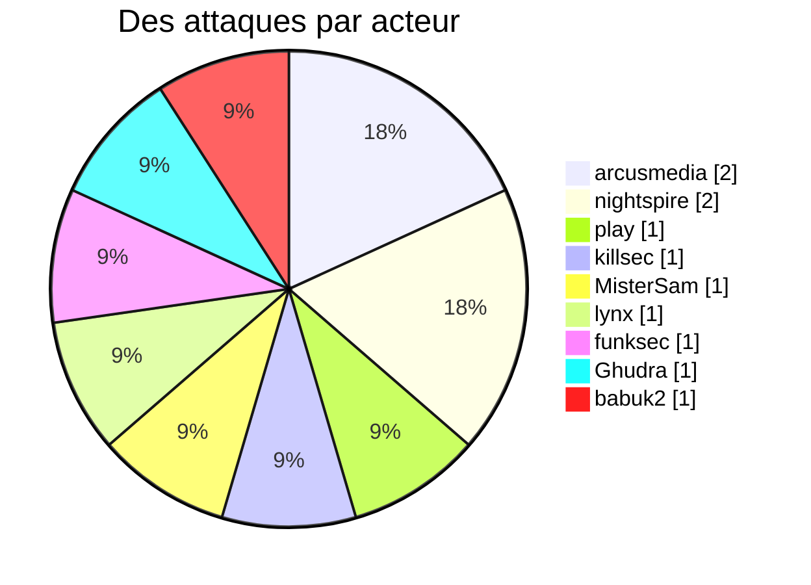
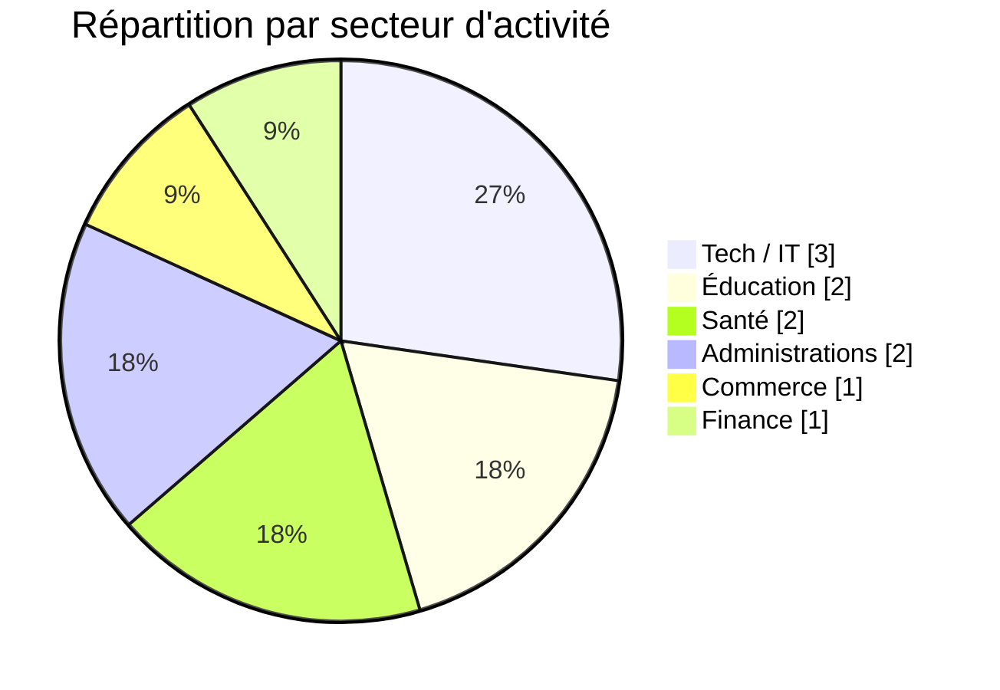
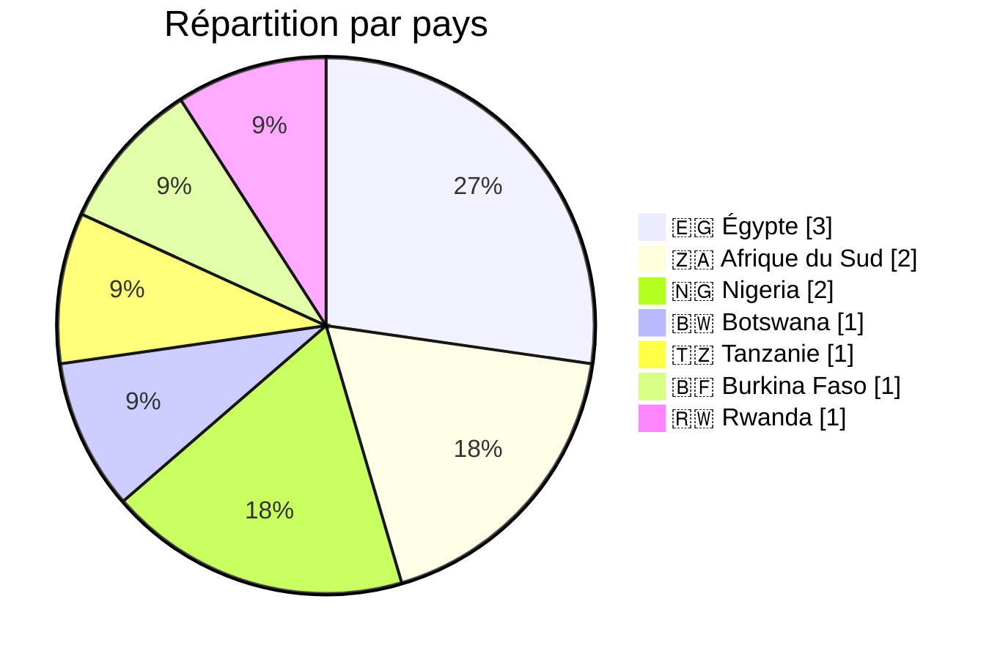
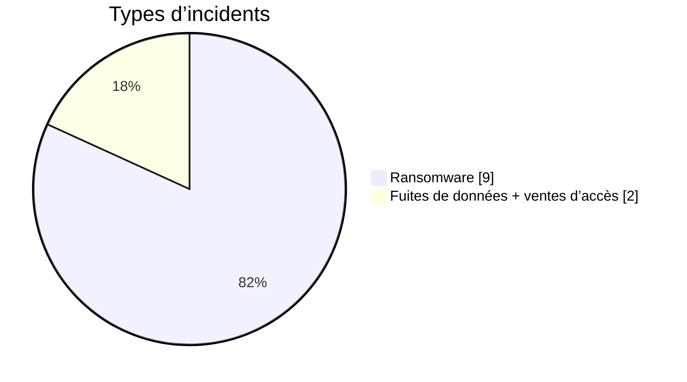
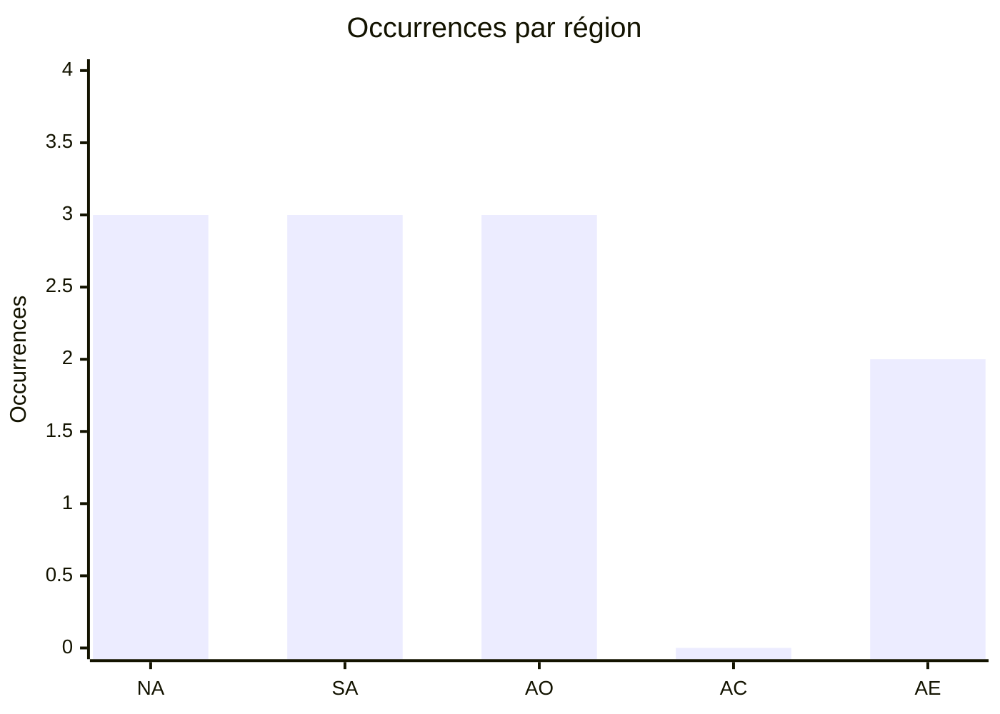
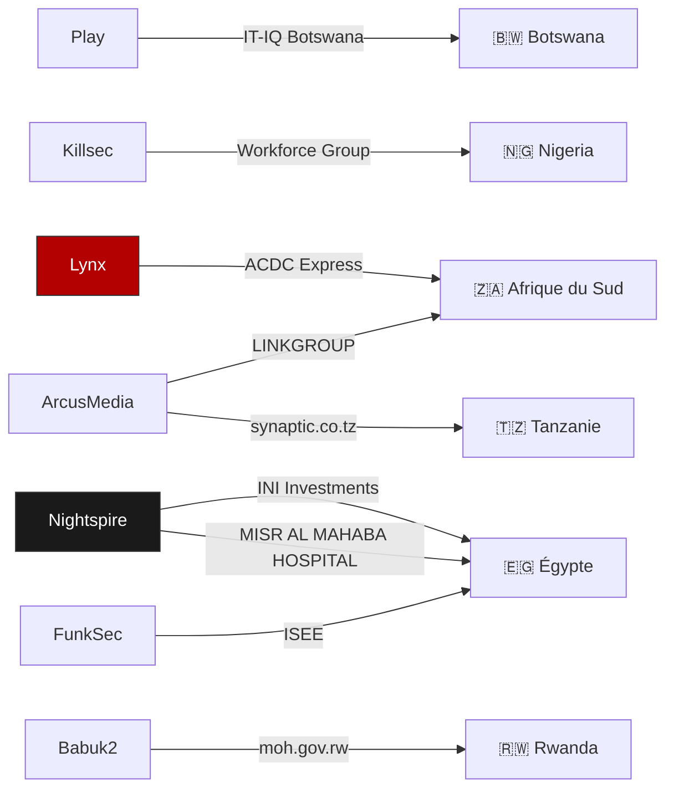
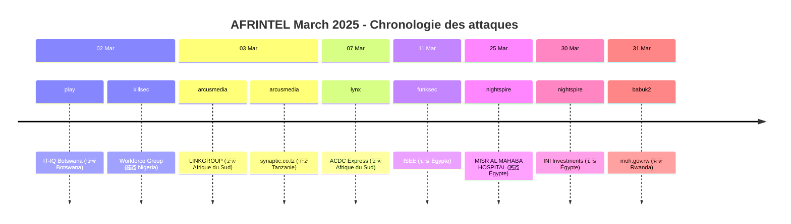

 
# Rapport CTI : Cyberattaques en Afrique - Mars 2025
👉🏾 [**English version available here** ](./README.md)

## 1. Résumé exécutif
- **Nombre total d'attaques recensées** : 11
- **Acteurs les plus actifs** : arcusmedia (2 attaques), nightspire (2), play (1), killsec (1), MisterSam (1), lynx (1), funksec (1), Ghudra (1), babuk2 (1).
- **Secteurs les plus ciblés** : Technologie / Services IT (3), Éducation (2), Santé (2), Gouvernement / Administrations publiques (2), Commerce de détail (1), Finance / Banque / Assurance (1).
- **Pays les plus touchés** : Égypte (3), Afrique du Sud (2), Nigeria (2), Botswana (1), Tanzanie (1), Burkina Faso (1), Rwanda (1).
- **Volume de données exfiltrées** : 400 Go pour INI Investments (Égypte). Les autres volumes ne sont pas précisés.

## 2. Méthodologie
Ce rapport de Cyber Threat Intelligence (CTI) présente une analyse détaillée des cyberattaques survenues en Afrique durant le mois de mars 2025. Les informations sont issues de sources OSINT et de sites de fuites de groupes ransomware, compilées dans le cadre du projet AFRINTEL. L'objectif est de fournir une vision claire des tendances, des acteurs menaçants, des secteurs ciblés et des indicateurs de compromission associés.

## 3. Vue d'ensemble

### 3.1 Répartition par acteur
| Acteur / Groupe | Nombre d'attaques |
|-------------------|-------------------|
| arcusmedia        | 2                 |
| nightspire        | 2                 |
| play              | 1                 |
| killsec           | 1                 |
| MisterSam         | 1                 |
| lynx              | 1                 |
| funksec           | 1                 |
| Ghudra *(vente d'accès, non-ransomware)* | 1 |
| babuk2            | 1                 |
| **Total**         | **11**            |

### 3.2 Répartition par secteur d'activité
| Secteur | Nombre d'attaques |
|---------|-------------------|
| Technologie / Services IT | 3 |
| Éducation | 2 |
| Santé | 2 |
| Gouvernement / Administrations publiques | 2 |
| Commerce de détail | 1 |
| Finance / Banque / Assurance | 1 |
| **Total** | **11** |

### 3.3 Répartition par pays
| Pays | Nombre d'attaques |
|------|-------------------|
| 🇪🇬 Égypte | 3 |
| 🇿🇦 Afrique du Sud | 2 |
| 🇳🇬 Nigeria | 2 |
| 🇧🇼  Botswana | 1 |
| 🇹🇿  Tanzanie | 1 |
| 🇧🇫 Burkina Faso | 1 |
| 🇷🇼 Rwanda | 1 |
| **Total** | **11** |

<!-- AFRINTEL_CURRENT_MODEL_START -->
### 3.4 Vue globale standardisée

| Pays | Ransomware | Exposition des données (fuites + accès) | Total | Distribution |
| :--- | ---: | ---: | ---: | :--- |
| 🇪🇬 Égypte | 3 | 0 | 3 | 🟧🟧🟧 |
| 🇳🇬 Nigeria | 1 | 1 | 2 | 🟧 🟦 |
| 🇿🇦 Afrique du Sud | 2 | 0 | 2 | 🟧🟧 |
| 🇧🇼 Botswana | 1 | 0 | 1 | 🟧 |
| 🇧🇫 Burkina Faso | 0 | 1 | 1 |  🟦 |
| 🇷🇼 Rwanda | 1 | 0 | 1 | 🟧 |
| 🇹🇿 Tanzanie | 1 | 0 | 1 | 🟧 |

### Vue agrégée mensuelle de l’exposition

La vue CTI mensuelle regroupe les fuites de données et les ventes d’accès sous **exposition des données** : **2 fiches** (18,2% du corpus mensuel). Les fiches sources restent la référence ; une vente d’accès ne prouve pas à elle seule l’exfiltration de données.

### Répartition géographique par région

| Région | Occurrences | Ransomware | Exposition des données (fuites + accès) | Distribution |
| :--- | ---: | ---: | ---: | :--- |
| Afrique du Nord | 3 | 3 | 0 | 🟧🟧🟧 |
| Afrique australe | 3 | 3 | 0 | 🟧🟧🟧 |
| Afrique de l’Ouest | 3 | 1 | 2 | 🟧 🟦🟦 |
| Afrique centrale | 0 | 0 | 0 |  |
| Afrique de l’Est | 2 | 2 | 0 | 🟧🟧 |

Légende : NA = Afrique du Nord ; SA = Afrique australe ; AO = Afrique de l’Ouest ; AC = Afrique centrale ; AE = Afrique de l’Est

### Répartition sectorielle

| Secteur | Fiches | Part | Activité |
| :--- | ---: | ---: | :--- |
| Gouvernement / administration | 3 | 27,3% | ██████████ |
| Technologies / informatique | 3 | 27,3% | ██████████ |
| Éducation / universités | 2 | 18,2% | ███████ |
| Finance / banque | 1 | 9,1% | ███ |
| Santé / médical | 1 | 9,1% | ███ |
| Commerce / e-commerce | 1 | 9,1% | ███ |

### Acteurs / groupes les plus présents

| Acteur / Groupe | Fiches | Activité |
| :--- | ---: | :--- |
| arcusmedia | 2 | ██████████ |
| nightspire | 2 | ██████████ |
| Ghudra | 1 | █████ |
| MisterSam | 1 | █████ |
| babuk2 | 1 | █████ |
| funksec | 1 | █████ |
| killsec | 1 | █████ |
| lynx | 1 | █████ |
| play | 1 | █████ |
<!-- AFRINTEL_CURRENT_MODEL_END -->

### Comparaison avec le mois précédent

À partir des fiches incidents validées comme source de comptage, mars 2025 compte **11** incidents contre **8** le mois précédent (une hausse de **+3** ; **+37.5%**). Cette comparaison décrit les publications enregistrées par AFRINTEL et ne prouve pas à elle seule une évolution de l'activité des attaquants ni un impact confirmé sur les victimes.

| Indicateur | Mois précédent | Mois en cours | Variation |
|---|---:|---:|---:|
| Fiches incidents enregistrées | 8 | 11 | +3 (+37.5%) |

## 4. Analyse détaillée par type d'incident

## 5. Impact sectoriel
- **Conseil en technologies** : 3 attaques (IT-IQ Botswana, LINKGROUP, synaptic.co.tz). Les groupes play et arcusmedia sont les principaux acteurs, ciblant des prestataires de services IT dans trois pays différents.
- **Éducation** : 2 attaques (Workforce Group, ISEE). killsec et funksec ont visé une entreprise de services éducatifs et une école privée.
- **Santé** : 1 attaque (MISR AL MAHABA HOSPITAL) par nightspire, touchant un hôpital privé au Caire.
- **Commerce de détail** : 1 attaque (ACDC Express) par lynx, visant un distributeur majeur en Afrique du Sud.
- **Finance** : 1 attaque (INI Investments) par nightspire, avec exfiltration massive de 400 Go.
- **Administrations publiques** : 1 attaque (Ministère de la Santé du Rwanda) par babuk2.

## 6. Profil des acteurs
### 6.1 Profil des acteurs

Les comptages d'acteurs et de sources restent ceux documentés en section 3 et dans les fiches victimes sources. L'attribution est conservée uniquement au niveau étayé par les éléments publics.

### 6.2 Évaluation du risque

Les pays et secteurs présentant plusieurs fiches ou des fonctions publiques, éducatives, sanitaires, financières ou critiques doivent faire l'objet d'une validation prioritaire. Il s'agit d'un signal de priorisation OSINT, et non d'une confirmation de compromission ou d'impact.

- **Égypte** : 3 attaques (ISEE, MISR AL MAHABA HOSPITAL, INI Investments) - éducation, santé et finance. L'Égypte reste le pays le plus ciblé du mois.
- **Afrique du Sud** : 2 attaques (LINKGROUP, ACDC Express) - technologies et commerce de détail.
- **Botswana** : 1 attaque (IT-IQ Botswana) - technologies.
- **Nigeria** : 1 attaque (Workforce Group) - éducation/RH.
- **Tanzanie** : 1 attaque (synaptic.co.tz) - technologies.
- **Rwanda** : 1 attaque (Ministère de la Santé) - administration publique.
### 6.1. Graphe acteur → victime → pays

L'Afrique du Nord (Égypte) et l'Afrique australe (Afrique du Sud, Botswana) concentrent la majorité des attaques, avec une présence en Afrique de l'Est (Tanzanie, Rwanda) et de l'Ouest (Nigeria).

### 6.2. Timeline des attaques

## 7. Tendances et lacunes de renseignement
### 7.1 Tendances observées

Les répartitions par pays, secteur, acteur et type d'incident présentées ci-dessus constituent les tendances traçables du mois. Elles décrivent le corpus surveillé et n'établissent pas une campagne plus large sans éléments indépendants.

### 7.2 Lacunes de renseignement

Les rapports disponibles ne permettent pas d'établir pour chaque revendication le vecteur d'accès initial, l'exfiltration complète, la confirmation par la victime, la chronologie de remédiation ou l'impact opérationnel. Aucun détail DFIR public n'est inclus dans le corpus consulté pour cette fiche mensuelle ; cette absence est limitée aux sources examinées.

## 8. Cartographie MITRE ATT&CK (contextuelle)
| Phase | ID technique | Nom | Association à l'incident |
|---|---|---|---|
| Collecte | T1005 | Data from Local System | Correspondance contextuelle pour une collecte ou exposition revendiquée ; la méthode n'est pas confirmée. |
| Collecte | T1213 | Data from Information Repositories | Correspondance contextuelle pour les dossiers ou référentiels décrits publiquement ; la méthode n'est pas confirmée. |

Ces correspondances ATT&CK sont contextuelles et défensives. Elles ne prouvent pas qu'un acteur donné a utilisé la technique.

### Contextual observations
D'après les descriptions disponibles, on note :
- **Exfiltration massive** : INI Investments (400 Go) démontre une capacité à collecter de grands volumes de données sensibles.
- **Ciblage de secteurs stratégiques** : finance, santé, administrations publiques.
- **Diversité géographique** : les attaques couvrent six pays, montrant une expansion des groupes ransomware sur le continent.
- **Double extorsion probable** : revendications accompagnées de menaces de divulgation.
- **Ciblage des prestataires IT** : 3 attaques sur des sociétés de conseil en technologies, potentiellement utilisées comme tremplin vers leurs clients.

## 9. Recommandations
- **Égypte** : renforcer la cybersécurité dans les secteurs de la finance et de la santé, particulièrement ciblés par nightspire.
- **Sociétés de conseil IT** : mettre en place une segmentation réseau stricte et une surveillance renforcée, car elles sont des cibles privilégiées.
- **Secteur éducatif** : sensibiliser les établissements privés et publics aux risques de ransomware.
- **Administrations publiques** : le ministère rwandais de la Santé doit revoir ses protocoles de sécurité et ses sauvegardes.
- **Tous secteurs** : former les employés à la détection des phishing et mettre en œuvre l'authentification multi-facteurs.

## 10. Recommandations SOC et tactiques
### Observé

Les sources publiques documentent des revendications, des publications ou du matériel exposé. Elles ne fournissent pas à elles seules une télémétrie prouvant une technique ou une compromission active.

### Hypothèses

L'abus d'identifiants, un stockage exposé, des contrôles d'accès faibles ou des privilèges d'export excessifs peuvent expliquer certaines expositions, mais chaque hypothèse doit être vérifiée par l'organisation concernée.

### Préventif

Surveiller les journaux d'identité, VPN, cloud, bases de données, messagerie et transferts sortants. Imposer une MFA résistante au phishing, le moindre privilège, la segmentation, des sauvegardes testées et la révocation rapide des jetons ou identifiants.

## 11. Recommandations stratégiques
1. **Risques observés :** prioriser la validation des organisations, secteurs et types de données documentés dans le corpus mensuel.
2. **Hypothèses :** tester les chemins possibles liés aux identifiants, au stockage cloud et aux exports excessifs sans les présenter comme des faits établis.
3. **Socle préventif :** maintenir l'inventaire des actifs, la classification des données, les exercices de réponse, les plans de reprise et les procédures coordonnées de sécurité, de droit et de protection des données.

## 12. Conclusion
Mars 2025 a été marqué par une activité soutenue des groupes ransomware en Afrique, avec une diversification géographique et sectorielle. L'Égypte reste le pays le plus touché, notamment par nightspire qui a réalisé l'attaque la plus volumineuse du mois (INI Investments, 400 Go). Le secteur du conseil en technologies est particulièrement visé, avec 3 attaques. La présence de groupes comme play, arcusmedia ou babuk2 sur plusieurs pays montre une professionnalisation et une expansion des menaces sur le continent.

### Auteur
*Adama ASSIONGBON*  
*Consultant SOC & Cyber Threat Intelligence*  
[LinkedIn Profile](https://www.linkedin.com/in/adama-assiongbon-9029893a/)

---
*AFRINTEL - Initiative ouverte de veille CTI sur l’Afrique*
