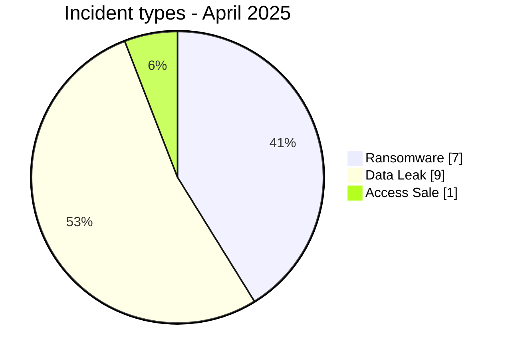
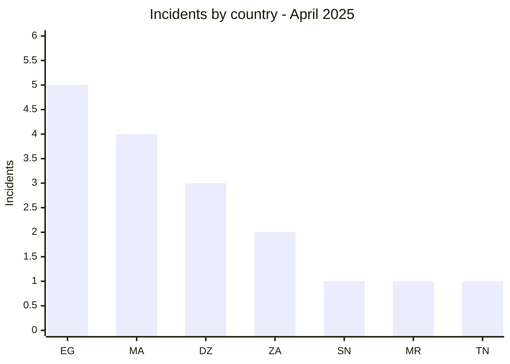
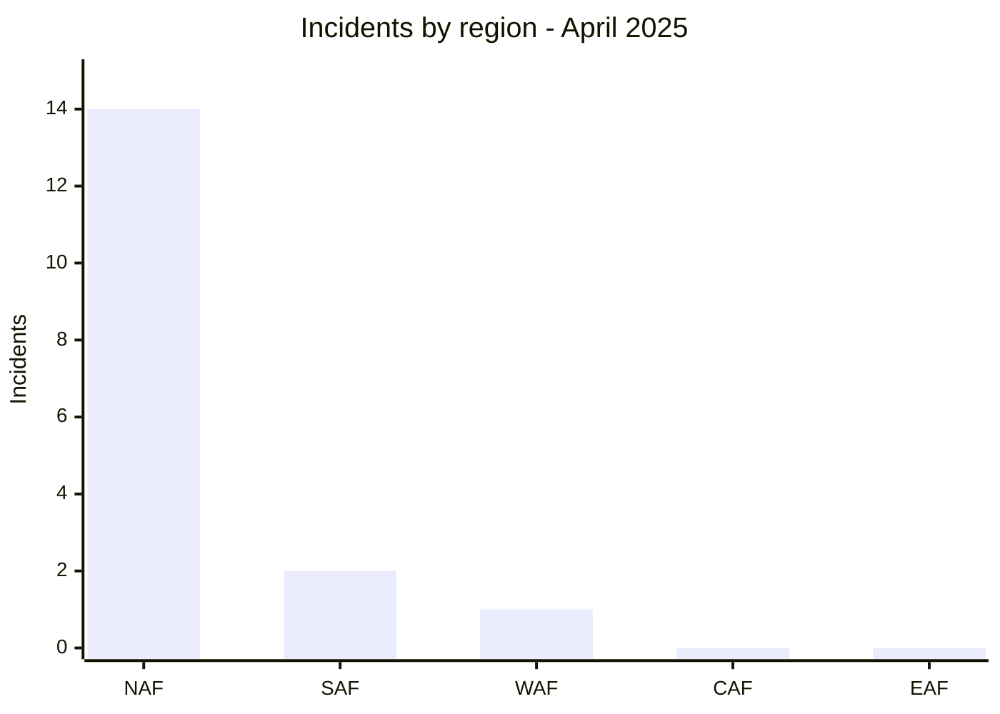
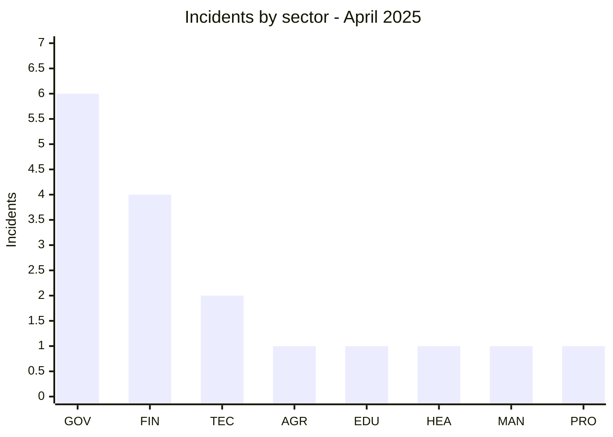
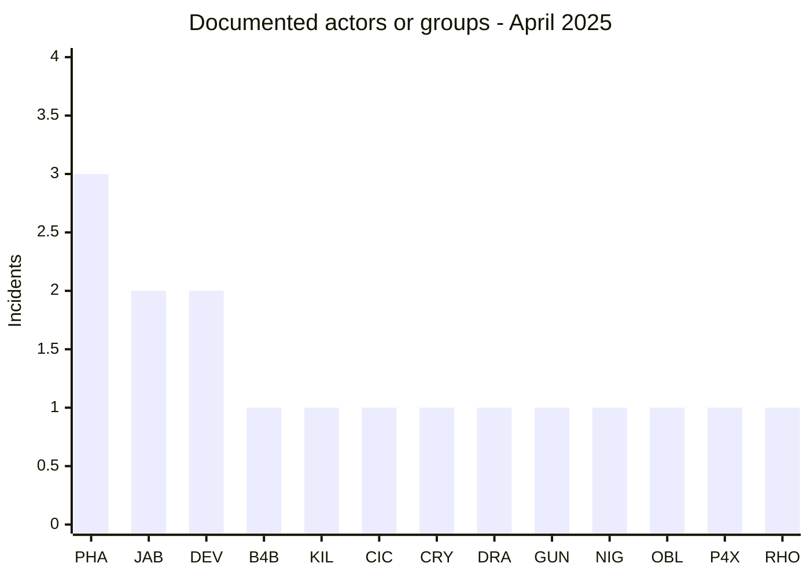

# CTI Report - Cyberattacks in Africa - April 2025

👉🏾 [**French version available here**](./README_FR.md)

## 1. Executive summary

April 2025 contains **17 documented incidents across 7 African countries**: **7 Ransomware, 9 Data Leak and 1 Access Sale**.

- **Egypt** leads with **5 incidents**, not 4.
- **Morocco** records 4 incidents, **Algeria** 3 and **South Africa** 2.
- **Phantom Atlas** is the most visible label with 3 records, followed by Jabaroot DZ and devman with 2 each.
- **Government / Administration** accounts for 6 incidents, followed by Finance / Banking with 4.
- Data exposure dominates the month: **9 Data Leak + 1 Access Sale = 10 of 17 incidents**.
- Significant evidence includes CNSS exports, CNAS and MGPTT documents, ISMAC student data, INI Investments financial material and Dar Al Teb reproductive-health data.

### 📋 Victim list

👉🏾 [View the full victim list](./victims.md)

### 1.1 Month-over-month comparison

> Comparison based on validated AFRINTEL monthly corpora. A change in documented records does not, by itself, prove a change in the real number of compromises.

| Indicator | March 2025 | April 2025 | Observed change |
|---|---:|---:|---:|
| Total incidents | 11 | 17 | **+6 (+54.5%)** |
| Ransomware | 9 | 7 | **-2 (-22.2%)** |
| Data Leak | 1 | 9 | **+8 (+800.0%)** |
| Access Sale | 1 | 1 | **0 (+0.0%)** |
| DDoS | 0 | 0 | **0 (stable)** |
| Defacement | 0 | 0 | **0 (stable)** |
| Operational Fraud | 0 | 0 | **0 (stable)** |

## 2. Methodology

- **Scope**: 54 African countries.
- **Period**: 1-30 April 2025.
- **Sources**: OSINT, leak sites, underground forums, actor publications and samples when available.
- **Source of truth**: validated bilingual pair [`victims_FR.md`](./victims_FR.md) / [`victims.md`](./victims.md), with French editorial review before English synchronization.
- **Counting**: one card equals one unique incident in the monthly corpus.
- **Qualification**: claims, samples, access sales and technical confirmation remain separate evidence dimensions.

## 3. Global overview

### 3.1 Incident-type distribution

| Incident type | Count | Share |
|---|---:|---:|
| Ransomware | 7 | 41.2% |
| Data Leak | 9 | 52.9% |
| Access Sale | 1 | 5.9% |
| DDoS | 0 | 0.0% |
| Defacement | 0 | 0.0% |
| Operational Fraud | 0 | 0.0% |
| **Total** | **17** | **100%** |

**Color convention:** 🟧 Ransomware | 🟦 Data Leak | 🟪 Access Sale | 🟥 DDoS | 🟨 Defacement | 🟩 Operational Fraud.

### 3.2 Country distribution

| Country | Ransomware | Data Leak | Access Sale | Total | Distribution |
|---|---:|---:|---:|---:|---|
| 🇪🇬 Egypt | 4 | 1 | 0 | 5 | 🟧🟧🟧🟧🟦 |
| 🇲🇦 Morocco | 0 | 4 | 0 | 4 | 🟦🟦🟦🟦 |
| 🇩🇿 Algeria | 0 | 3 | 0 | 3 | 🟦🟦🟦 |
| 🇿🇦 South Africa | 2 | 0 | 0 | 2 | 🟧🟧 |
| 🇸🇳 Senegal | 0 | 0 | 1 | 1 | 🟪 |
| 🇲🇷 Mauritania | 0 | 1 | 0 | 1 | 🟦 |
| 🇹🇳 Tunisia | 1 | 0 | 0 | 1 | 🟧 |
| **Total** | **7** | **9** | **1** | **17** | |

**Legend:** `EG` = Egypt | `MA` = Morocco | `DZ` = Algeria | `ZA` = South Africa | `SN` = Senegal | `MR` = Mauritania | `TN` = Tunisia

### 3.3 Comparison by type and country

```mermaid
xychart-beta
    title "Ransomware vs Data Leak by country - April 2025"
    x-axis ["EG", "MA", "DZ", "ZA", "SN", "MR", "TN"]
    y-axis "Incidents" 0 --> 5
    bar [4, 0, 0, 2, 0, 0, 1]
    bar [1, 4, 3, 0, 0, 1, 0]
```

**Series legend:** first series = 🟧 Ransomware | second series = 🟦 Data Leak.  
**Access Sale:** 🟪 Senegal = 1.  
**Countries:** `EG` = Egypt | `MA` = Morocco | `DZ` = Algeria | `ZA` = South Africa | `SN` = Senegal | `MR` = Mauritania | `TN` = Tunisia

### 3.4 Geographic distribution by region

| Region | Incidents | Share |
|---|---:|---:|
| North Africa | 14 | 82.4% |
| Southern Africa | 2 | 11.8% |
| West Africa | 1 | 5.9% |
| Central Africa | 0 | 0.0% |
| East Africa | 0 | 0.0% |
| **Total** | **17** | **100%** |

**Legend:** `NAF` = North Africa | `SAF` = Southern Africa | `WAF` = West Africa | `CAF` = Central Africa | `EAF` = East Africa

### 3.5 Sector distribution

| Normalized sector | Incidents | Share | Activity |
|---|---:|---:|---|
| Government / Administration | 6 | 35.3% | ██████████ |
| Finance / Banking | 4 | 23.5% | ███████ |
| Technology / IT | 2 | 11.8% | ███ |
| Agriculture / Agribusiness | 1 | 5.9% | ██ |
| Education / University | 1 | 5.9% | ██ |
| Healthcare / Medical | 1 | 5.9% | ██ |
| Manufacturing / Industry | 1 | 5.9% | ██ |
| Professional / Business Services | 1 | 5.9% | ██ |
| **Total** | **17** | **100%** | |

**Legend:** `GOV` = Government / Administration | `FIN` = Finance / Banking | `TEC` = Technology / IT | `AGR` = Agriculture / Agribusiness | `EDU` = Education / University | `HEA` = Healthcare / Medical | `MAN` = Manufacturing / Industry | `PRO` = Professional / Business Services

### 3.6 Actors / groups

| Actor / Group | Incidents | Activity |
|---|---:|---|
| Phantom Atlas | 3 | ██████████ |
| Jabaroot DZ | 2 | ███████ |
| devman | 2 | ███████ |
| B4baYega | 1 | ███ |
| Killer_Bee | 1 | ███ |
| cicada3301 | 1 | ███ |
| crypto24 | 1 | ███ |
| dragonforce | 1 | ███ |
| gunra | 1 | ███ |
| nightspire | 1 | ███ |
| oblivion666 | 1 | ███ |
| p4xar | 1 | ███ |
| ransomhouse | 1 | ███ |
| **Total** | **17** | |

**Legend:** `PHA` = Phantom Atlas | `JAB` = Jabaroot DZ | `DEV` = devman | `B4B` = B4baYega | `KIL` = Killer_Bee | `CIC` = cicada3301 | `CRY` = crypto24 | `DRA` = dragonforce | `GUN` = gunra | `NIG` = nightspire | `OBL` = oblivion666 | `P4X` = p4xar | `RHO` = ransomhouse

## 4. Detailed analysis by incident type

### 4.1 Ransomware - 7 incidents

The seven Ransomware records involve dragonforce, ransomhouse, crypto24, devman twice, cicada3301 and gunra.

Evidence depth varies significantly. Cell C includes 20 screenshots showing customer and employee data, passports, calls, SMS, contracts and internal documents. Natilait contains a limited operational sample. Dar Al Teb has the strongest ransomware evidence set of the month, including several thousand patient rows, clinical records and internal infrastructure artifacts.

### 4.2 Data Leak - 9 incidents

The nine Data Leak records concern CNSS, Morocco's Ministry of Industry and Commerce, CNAS, MGPTT, Algeria's Ministry of Labor, BMI / SEDAD, ISMAC, Morocco's Ministry of Housing and INI Investments.

**CNSS Morocco** is especially significant: two structured exports contain approximately 1.094 million employer records and 1.996 million insured-person records. **CNAS Algeria** includes 214 reviewed documents, far below the claimed 860,200. **MGPTT** includes four images, with an important provenance caveat for at least part of the sample. **INI Investments** includes coherent internal financial documents supporting high confidence in the authenticity of the exposure.

### 4.3 Access Sale - 1 incident

The **Senegalese Armed Forces** are the month's only Access Sale record. oblivion666 claims administrator access to several subdomains, servers and a firewall. No credentials or technical sample are provided, so the status remains **Claim - Unverified**.

## 5. Sectoral impact

**Government / Administration** accounts for **6 of 17 incidents (35.3%)**. **Finance / Banking** follows with 4 incidents. Technology / IT accounts for 2. Agriculture / Agribusiness, Education, Healthcare, Manufacturing / Industry and Professional / Business Services each account for 1.

## 6. Threat actor profile

### 6.1 Profile

Phantom Atlas is the most visible label with **3 records**, all in Algeria. Jabaroot DZ and devman each account for **2 records**. The remaining ten labels appear once.

### 6.2 Risk assessment

| Country | Risk signal in the corpus |
|---|---|
| Egypt | 5 incidents across finance, BPO, IT and healthcare |
| Morocco | 4 incidents, including a very large CNSS exposure and an ISMAC student SQL sample |
| Algeria | 3 Data Leak records involving public or social organizations |
| South Africa | 2 Ransomware records in telecommunications and agribusiness |
| Mauritania | 1 Data Leak involving a mobile-payment service |
| Senegal | 1 claimed Access Sale targeting defense infrastructure |
| Tunisia | 1 Ransomware incident in the food industry |

## 7. Key trends and intelligence gaps

### 7.1 Observed trends

1. **Monthly corpus increase**: 11 incidents in March versus 17 in April.
2. **Shift toward Data Leak**: 9 of 17 incidents, compared with 1 of 11 in March.
3. **Ransomware decline**: 9 in March versus 7 in April.
4. **Strong North African concentration**: 14 of 17 records under the regional grouping used by the report.
5. **Public-sector concentration**: 6 normalized Government / Administration records.
6. **Claim-to-evidence gap**: several claimed volumes are far larger than the samples actually reviewed.

### 7.2 Intelligence gaps

- Algeria's Ministry of Labor has no ministry-specific sample in the supplied material.
- Morocco's Ministry of Housing archive remains password-protected and unverifiable.
- Claimed access to the Senegalese Armed Forces is not technically confirmed.
- The 860,200 documents claimed for CNAS and 13 GB claimed for MGPTT are not validated by the observed samples.
- The apparent INI Investments March/April duplicate is deliberately retained as two records pending clarification.

### 7.3 Monthly evolution

```mermaid
xychart-beta
    title "Documented incidents - March vs April 2025"
    x-axis ["MAR", "APR"]
    y-axis "Incidents" 0 --> 18
    bar [11, 17]
    bar [9, 7]
    bar [1, 9]
```

**Legend:** first series = total incidents | second series = Ransomware | third series = Data Leak.  
`MAR` = March 2025 | `APR` = April 2025.

The total increases from **11 to 17 (+54.5%)**. Ransomware decreases from **9 to 7 (-22.2%)**, while Data Leak rises from **1 to 9 (+800.0%)**. Access Sale remains stable at 1.

## 8. MITRE ATT&CK mapping - contextual

| Phase | Technique | Analytical scope |
|---|---|---|
| Access / Movement | T1021.001 - Remote Desktop Protocol | Relevant to Dar Al Teb, where an internal RDP file is observed; this does not establish the initial-access vector. |
| Credential Access | T1552.001 - Credentials In Files | Relevant to Dar Al Teb, where a cleartext Wi-Fi key is observed in a WLAN profile. |
| Collection | T1005 - Data from Local System | Context for reviewed exports, documents and workbooks. |
| Collection | T1213 - Data from Information Repositories | Relevant to structured CNSS, ISMAC and other documented database exports. |

> These mappings are contextual and defensive and should not be generalized to all actors without incident-specific evidence.

## 9. Recommendations

- **Public and social institutions**: monitor large exports, enforce least privilege and strengthen auditability of access to national registries.
- **Finance and mobile payments**: monitor administrative actions, strengthen MFA and API logging, and control customer-data exports.
- **Healthcare**: protect clinical data with segmentation, encryption, EDR and remote-access monitoring.
- **Education**: restrict SQL exports, control administrator accounts and monitor exposed student platforms.

## 10. SOC and tactical recommendations

### Observed

The corpus contains structured databases, administrative documents, healthcare data, internal financial information, network artifacts and one claimed access sale.

### Assumptions

Initial vectors and complete exfiltration paths remain unknown for many cases. The observed evidence does not justify a single generic initial-access hypothesis.

### Preventive

Monitor database exports, administrator access, RDP connections, secrets present in files, large outbound transfers and unusual downloads. Strengthen MFA, PAM, segmentation, EDR, tested backups and exposed-secret rotation.

## 11. Strategic recommendations

1. Prioritize national public, social, financial and medical registries holding high concentrations of personal data.
2. Maintain a strict distinction between claimed and actually observed volumes.
3. Keep Ransomware, Data Leak and Access Sale separate in monthly statistics.
4. Preserve incident-specific qualification based on the evidence available.

## 12. Conclusion

April 2025 contains **17 incidents across 7 countries**, split into **7 Ransomware, 9 Data Leak and 1 Access Sale**. The total rises by **54.5%** compared with March, driven primarily by the increase in documented data leaks.

Egypt is the most represented country with **5 incidents**, followed by Morocco with 4 and Algeria with 3. Phantom Atlas is the most frequent label with 3 records.

**AFRINTEL** - Open African CTI Monitoring Initiative
