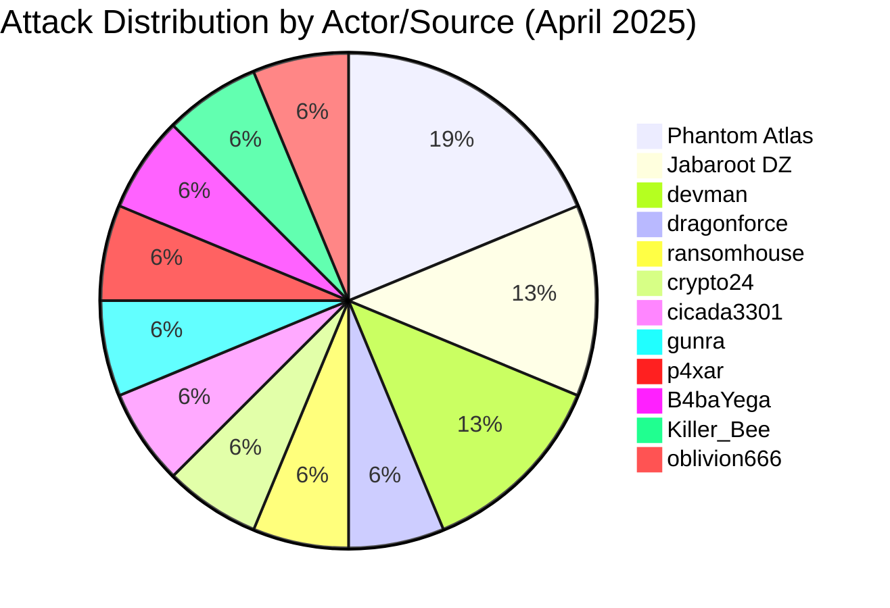
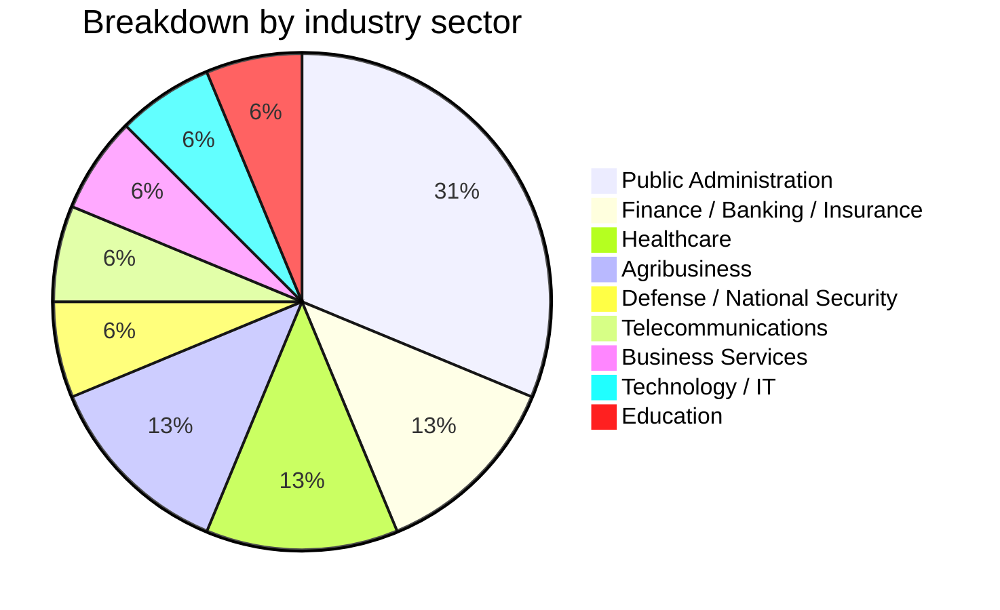
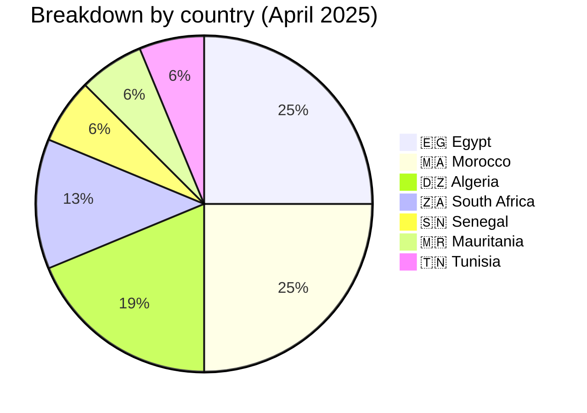
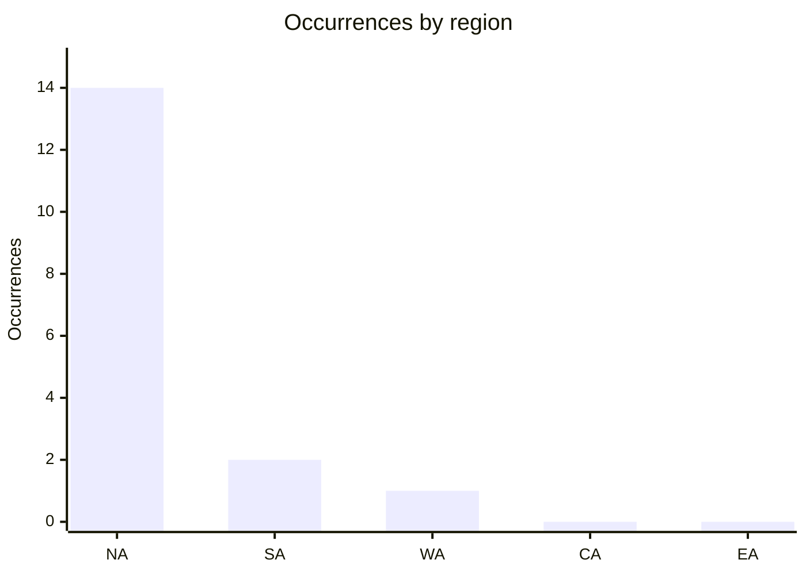
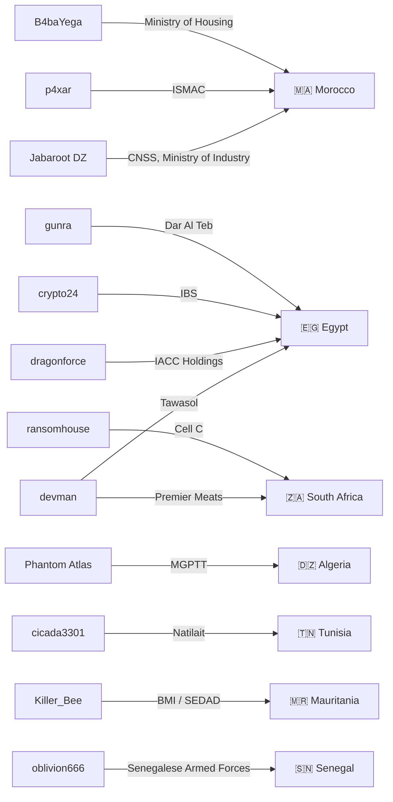
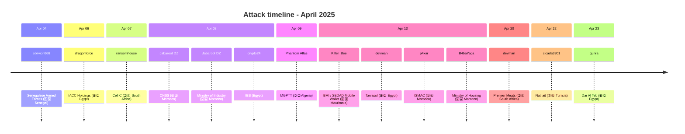

[](https://github.com/Hatchepsoute/AFRINTEL)


 

# CTI Report: Cyber attacks in Africa - April 2025
👉🏾 [**French version available here**](README_FR.md)
## 1. Introduction
This Cyber Threat Intelligence (CTI) report provides a detailed analysis of cyber attacks that occurred in Africa during April 2025. The information is derived from OSINT sources and ransomware group leak sites, compiled as part of the AFRINTEL project. The objective is to provide a clear overview of trends, threat actors, targeted sectors, and associated indicators of compromise.

## 2. Executive Summary
- **Total number of recorded attacks:** 17
- **Most active actors/sources:** Phantom Atlas (3 attacks), Jabaroot DZ (2), devman (2), dragonforce (1), ransomhouse (1), crypto24 (1), cicada3301 (1), gunra (1), p4xar (1), B4baYega (1), Killer_Bee (1), oblivion666 (1).
- **Most targeted sectors:** Government / Public administrations (5), Finance / Banking / Insurance (2), Healthcare (2), Agribusiness / Food (2), Defense / National Security (1), Telecommunications (1), Business Services / HR (1), Technology / IT services (1), Education (1).
- **Most affected countries:** Egypt (4), Morocco (4), Algeria (3), South Africa (2), Senegal (1), Mauritania (1), Tunisia (1).
- **Exfiltrated data volume:** 27.75 GB for IACC Holdings. Other volumes are not specified.

## 3. Key statistics

### 3.1 Breakdown by actor/source
| Actor / Group | Number of Attacks |
|-------------------|-------------------|
| Phantom Atlas     | 3                 |
| Jabaroot DZ       | 2                 |
| devman            | 2                 |
| dragonforce       | 1                 |
| ransomhouse       | 1                 |
| crypto24          | 1                 |
| cicada3301        | 1                 |
| gunra             | 1                 |
| p4xar             | 1                 |
| B4baYega          | 1                 |
| Killer_Bee        | 1                 |
| oblivion666       | 1                 |
| **Total**         | **16**            |



### 3.2 Breakdown by sector
| Sector | Number of Attacks |
|---------|-------------------|
| Government / Public administrations | 5 |
| Finance / Banking / Insurance | 2 |
| Healthcare | 2 |
| Agribusiness / Food | 2 |
| Defense / National Security | 1 |
| Telecommunications | 1 |
| Business Services / HR | 1 |
| Technology / IT services | 1 |
| Education | 1 |
| **Total** | **16** |



### 3.3 Breakdown by country
| Country | Number of attacks |
|------|-------------------|
|🇪🇬 Egypt | 4 |
|🇲🇦 Morocco | 4 |
|🇩🇿 Algeria | 3 |
|🇿🇦 South Africa | 2 |
|🇸🇳 Senegal | 1 |
|🇲🇷 Mauritania | 1 |
|🇹🇳 Tunisia | 1 |
| **Total** | **16** |



<!-- AFRINTEL_CURRENT_MODEL_START -->
### 3.4 Standard global overview

| Country | Ransomware | Data exposure (leaks + access) | Total | Distribution |
| :--- | ---: | ---: | ---: | :--- |
| 🇪🇬 Egypt | 4 | 1 | 5 | 🟧🟧🟧🟧 🟦 |
| 🇲🇦 Morocco | 0 | 4 | 4 |  🟦🟦🟦🟦 |
| 🇩🇿 Algeria | 0 | 3 | 3 |  🟦🟦🟦 |
| 🇿🇦 South Africa | 2 | 0 | 2 | 🟧🟧 |
| 🇲🇷 Mauritania | 0 | 1 | 1 |  🟦 |
| 🇸🇳 Senegal | 0 | 1 | 1 |  🟦 |
| 🇹🇳 Tunisia | 1 | 0 | 1 | 🟧 |

```pie
    title Incident types
    "Ransomware" : 7
    "Data leaks + access sales" : 10
```

### Monthly aggregate exposure view

The monthly CTI view combines data leaks and access sales as **data exposure**: **10 records** (58.8% of the monthly corpus). The underlying source cards remain authoritative, and an access sale does not by itself prove data exfiltration.


### Geographic distribution by region

| Region | Occurrences | Ransomware | Data exposure (leaks + access) | Distribution |
| :--- | ---: | ---: | ---: | :--- |
| North Africa | 14 | 5 | 9 | 🟧🟧🟧🟧🟧 🟦🟦🟦🟦🟦🟦🟦🟦🟦 |
| Southern Africa | 2 | 2 | 0 | 🟧🟧 |
| West Africa | 1 | 0 | 1 |  🟦 |
| Central Africa | 0 | 0 | 0 |  |
| East Africa | 0 | 0 | 0 |  |


Legend: NA = North Africa; SA = Southern Africa; WA = West Africa; CA = Central Africa; EA = East Africa

### Sector distribution

| Sector | Records | Share | Activity |
| :--- | ---: | ---: | :--- |
| Government / Administration | 6 | 35.3% | ██████████ |
| Finance / Banking | 4 | 23.5% | ███████ |
| Technology / IT | 2 | 11.8% | ███ |
| Agriculture / Agribusiness | 1 | 5.9% | ██ |
| Education / University | 1 | 5.9% | ██ |
| Healthcare / Medical | 1 | 5.9% | ██ |
| Manufacturing / Industry | 1 | 5.9% | ██ |
| Professional / Business Services | 1 | 5.9% | ██ |

### Most visible actors

| Actor / Group | Records | Activity |
| :--- | ---: | :--- |
| Phantom Atlas | 3 | ██████████ |
| Jabaroot DZ | 2 | ███████ |
| devman | 2 | ███████ |
| B4baYega | 1 | ███ |
| Killer_Bee | 1 | ███ |
| cicada3301 | 1 | ███ |
| crypto24 | 1 | ███ |
| dragonforce | 1 | ███ |
| gunra | 1 | ███ |
| nightspire | 1 | ███ |
<!-- AFRINTEL_CURRENT_MODEL_END -->
## 4. Detailed attacks by ransomware group

### 4.1 Jabaroot DZ (2 attacks)
- **08/04/2025:** CNSS (Morocco, public administrations)
- **08/04/2025:** Ministry of Industry and Commerce (Morocco, government)

*Note:* Jabaroot DZ targeted two Moroccan public institutions on the same day, demonstrating the ability to strike critical infrastructures.

### 4.2 Devman (2 attacks)
- **13/04/2025:** Tawasol (Egypt, technology)
- **20/04/2025:** Premier Meats (South Africa, agribusiness)

*Note:* Devman operated in two different countries and sectors, showing geographic diversification.

### 4.3 Dragonforce (1 attack)
- **06/04/2025:** IACC Holdings (Egypt, finance/logistics) - 27.75 GB exfiltrated

### 4.4 Ransomhouse (1 attack)
- **07/04/2025:** Cell C (South Africa, telecommunications)

### 4.5 Crypto24 (1 attack)
- **08/04/2025:** International Business Service (Egypt, business services)

### 4.6 Phantom Atlas (1 attack)
- **09/04/2025:** MGPTT (Algeria, health insurance fund)

### 4.7 Cicada3301 (1 attack)
- **22/04/2025:** Natilait (Tunisia, agribusiness)

### 4.8 Gunra (1 attack)
- **23/04/2025:** Dar Al Teb (Egypt, healthcare)

### 4.9 p4xar (1 attack)
- **13/04/2025:** ISMAC (Morocco, education) - substantial SQL sample containing sensitive student data; the claimed full database publication could not be verified.

### 4.10 B4baYega (1 attack)
- **13/04/2025:** Ministry of Housing and Urban Policy (Morocco, government) - claim only; the underlying archive was password-protected and could not be independently verified.

### 4.11 Killer_Bee (1 claim)
- **13/04/2025:** BMI / SEDAD Mobile Wallet (Mauritania, finance / mobile payment) - anonymized sample; claimed 90,000+ records not independently verified.

### 4.12 oblivion666 (1 claim)
- **04/04/2025:** Senegalese Armed Forces / armee.sn (Senegal, defense) - access-sale listing (domains and admin/server/firewall access); no sample or technical evidence provided, unverified.

### 4.13 Threat actor → victim → country mapping

## 5. Sectoral analysis
- **Public Administrations:** 4 attacks (CNSS, Ministry of Industry, Ministry of Housing, MGPTT). Groups Jabaroot DZ, B4baYega and Phantom Atlas targeted key institutions in Morocco and Algeria, with sensitive data (beneficiaries, administrative documents).
- **Agribusiness:** 2 attacks (Premier Meats, Natilait) by devman and cicada3301, targeting food processing companies in South Africa and Tunisia.
- **Finance/Logistics:** 1 attack (IACC Holdings) by dragonforce, with 27.75 GB exfiltrated.
- **Telecommunications:** 1 attack (Cell C) by ransomhouse, hitting a major South African operator.
- **Business Services:** 1 attack (IBS) by crypto24, targeting an Egyptian BPO provider.
- **Technology:** 1 attack (Tawasol) by devman, targeting an IT solutions integrator.
- **Healthcare:** 1 attack (Dar Al Teb) by gunra, striking a specialized medical center.
- **Education:** 1 data-leak claim (ISMAC) attributed to p4xar, supported by a substantial SQL sample containing sensitive student information.
- **Defense / National Security:** 1 access-sale claim (Senegalese Armed Forces / armee.sn) by oblivion666, offering domains and admin-level server/firewall access without an accessible sample.
### 5.1 Attack timeline


## 6. Geographic analysis
- **Morocco:** 4 attacks (CNSS, Ministry of Industry, Ministry of Housing, ISMAC) - public administration and education. Two claims were posted by Jabaroot DZ on the same day; the ISMAC claim is supported by a substantial SQL sample, and the Ministry of Housing claim remains unverified due to a password-protected archive.
- **Egypt:** 4 attacks (IACC, IBS, Tawasol, Dar Al Teb) - finance, BPO, IT, healthcare. Egypt remains among the most targeted countries on the continent.
- **South Africa:** 2 attacks (Cell C, Premier Meats) - telecoms and agribusiness.
- **Algeria:** 1 attack (MGPTT) - health insurance fund, with publication of personal data.
- **Tunisia:** 1 attack (Natilait) - agribusiness.
- **Mauritania:** 1 data-leak claim (BMI / SEDAD Mobile Wallet) - finance / mobile payment.
- **Senegal:** 1 access-sale claim (Senegalese Armed Forces / armee.sn) - defense, unverified.

North Africa (Egypt, Morocco, Algeria, Tunisia) concentrates 10 out of 14 attacks, confirming high pressure on the region.

## 7. Observed TTPs
- **Data Exfiltration:** IACC Holdings (27.75 GB), MGPTT (beneficiary lists) and the ISMAC SQL sample illustrate the collection and exposure of sensitive data.
- **Targeting of Public Institutions:** 4 attacks on government bodies, with potentially political motivations ("retaliation" claim for MGPTT).
- **Access Sale:** oblivion666 advertised domains and administrator-level access to Senegalese armed forces infrastructure, illustrating the access-broker segment of the ecosystem alongside ransomware and data-leak claims.
- **Diversity of Actors:** 12 different groups active, including hacktivists (Jabaroot DZ, Phantom Atlas) and traditional ransomware groups.
- **Double Extortion:** Claims accompanied by data leaks to pressure victims.
- **Web Exploitation:** Likely for government websites.

## 8. Recommendations
- **Public and Education Sectors:** Strengthen administrative and student portals, enforce MFA for privileged access, restrict database exports, and monitor anomalous SQL dump creation, especially in Morocco and Algeria.
- **Egypt:** Increase vigilance in finance, BPO, and healthcare sectors, which are heavily targeted.
- **Agribusiness:** Companies like Premier Meats and Natilait must secure their digital supply chains.
- **Telecoms:** Operators like Cell C should protect subscriber data.
- **All Sectors:** Implement multi-factor authentication and offline backups.

## 9. Conclusion
April 2025 was marked by sustained activity in north Africa, with a high proportion of attacks against public administrations. Groups Jabaroot DZ and devman stand out for their versatility. The diversity of actors (hacktivists, ransomware) underscores the complexity of the threat. Enhanced regional cooperation is needed to counter these cyber attacks.

## ✍🏿 Author
*Adama ASSIONGBON*  
*SOC & Cyber Threat Intelligence Consultant*  
[LinkedIn profile](https://www.linkedin.com/in/adama-assiongbon-9029893a/)

---
*AFRINTEL - Open CTI Monitoring Initiative on Africa*
