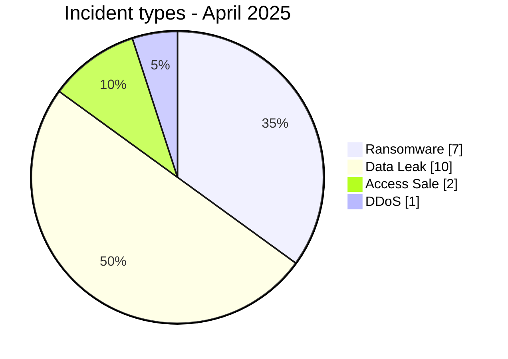
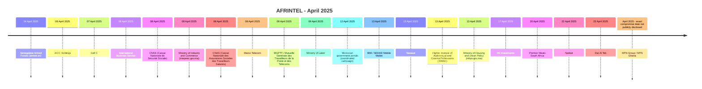

# AFRINTEL CTI Report - Cyber Threats in Africa - April 2025

👉🏾 [Version française](./README_FR.md)

   

## 1. Executive summary

In April 2025, AFRINTEL documents **20 cyber incidents** affecting organizations and digital services across **8 African countries**.

The landscape is dominated by **Data Leak with 10 records (50.0%)**, followed by **Ransomware with 7 (35.0%)**. Other observed types are Access Sale 2, DDoS 1.

Geographic concentration is significant: **Morocco (6)**, **Egypt (5)**, **Algeria (3)** together account for **14 records, or 70.0% of the month**. This concentration reflects AFRINTEL corpus visibility rather than an exhaustive national compromise rate.

At sector level, the most represented categories are **Government / Administration (6)**, **Finance / Banking (4)**, **Technology / IT (2)**. The most frequent actor labels are `Phantom Atlas` (3), `Jabaroot DZ` (2), `Unknown` (2). `Unknown`, when present, denotes missing attribution rather than a threat actor.

Evidence maturity remains variable: **18 records** are unverified claims or claims accompanied by samples. AFRINTEL maintains a strict separation between **observed facts, claims, corroboration, official confirmation, and technical unknowns**.

Compared with March, monthly volume **increases by 5 records**. The most visible changes are Data Leak 2->10 (+8), Ransomware 9->7 (-2), Account Takeover 2->0 (-2).

> **Reading note:** AFRINTEL figures describe documented incidents and the visibility of observed threats. They are not an exhaustive measurement of every cyberattack that actually occurred across Africa.

### 1.1 Month-over-month comparison

| Indicator | March 2025 | April 2025 | Change |
|---|---:|---:|---:|
| Total incidents | 15 | 20 | **+5 (+33.3%)** |
| Ransomware | 9 | 7 | **-2 (-22.2%)** |
| Data Leak | 2 | 10 | **+8 (+400.0%)** |
| Access Sale | 1 | 2 | **+1 (+100.0%)** |
| DDoS | 0 | 1 | **+1 (new)** |
| Defacement | 0 | 0 | **Stable** |
| Account Takeover | 2 | 0 | **-2 (-100.0%)** |
| System Intrusion | 1 | 0 | **-1 (-100.0%)** |
| Malware | 0 | 0 | **Stable** |
| Operational Fraud | 0 | 0 | **Stable** |

## 2. Methodology

- **Scope:** 54 African countries; reference period: April 2025.
- **Source of truth:** validated `victims_FR.md` / `victims.md` pair.
- **Classification:** Ransomware, Data Leak, Access Sale, DDoS, Defacement, Account Takeover, System Intrusion, Malware, and Operational Fraud.
- **Counting:** one canonical record equals one documented cyber incident; cases under investigation remain outside statistics.
- **Timeline:** `Incident date` and `Initial publication date` remain separate. A later disclosure does not artificially move an incident into another month when chronology is sufficiently supported.
- **Uncertain dates:** when no exact day is known, the evidence-supported month or time window is retained.
- **Sources:** public links are retained for supplementary incidents found through OSINT/web research; they are not retroactively imposed on historical or direct Dark Web observations.
- **Evidence:** incident type, status, confidence, impact, and provenance remain separate dimensions.
- **Sectors:** normalization is calculated once from the structured corpus and used identically in FR and EN.
- **Limitation:** frequencies reflect AFRINTEL visibility rather than every real compromise on the continent.

## 3. Overview and incident types

| Indicator | Value |
|---|---:|
| Documented incidents | **20** |
| Countries represented | **8** |
| Regions represented | **3** |
| Leading country | **Morocco (6)** |
| Leading sector | **Government / Administration (6)** |
| Leading actor label | **Phantom Atlas (3)** |

| Incident type | Records | Share |
|---|---:|---:|
| Ransomware | 7 | 35.0% |
| Data Leak | 10 | 50.0% |
| Access Sale | 2 | 10.0% |
| DDoS | 1 | 5.0% |
| Defacement | 0 | 0.0% |
| Account Takeover | 0 | 0.0% |
| System Intrusion | 0 | 0.0% |
| Malware | 0 | 0.0% |
| Operational Fraud | 0 | 0.0% |
| **Total** | **20** | **100%** |

## 4. Geographic distribution

| Country | Total | Ransomware | Data Leak | Access Sale | DDoS | Defacement | Account Takeover | System Intrusion | Malware |
|---|---:|---:|---:|---:|---:|---:|---:|---:|---:|
| Morocco | **6** | 0 | 4 | 1 | 1 | 0 | 0 | 0 | 0 |
| Egypt | **5** | 4 | 1 | 0 | 0 | 0 | 0 | 0 | 0 |
| Algeria | **3** | 0 | 3 | 0 | 0 | 0 | 0 | 0 | 0 |
| South Africa | **2** | 2 | 0 | 0 | 0 | 0 | 0 | 0 | 0 |
| Senegal | **1** | 0 | 0 | 1 | 0 | 0 | 0 | 0 | 0 |
| Mauritania | **1** | 0 | 1 | 0 | 0 | 0 | 0 | 0 | 0 |
| Tunisia | **1** | 1 | 0 | 0 | 0 | 0 | 0 | 0 | 0 |
| Ghana | **1** | 0 | 1 | 0 | 0 | 0 | 0 | 0 | 0 |
| **Total** | **20** | **7** | **10** | **2** | **1** | **0** | **0** | **0** | **0** |

> `Operational Fraud = 0` this month; the column is omitted for readability.

## 5. Regional distribution

| Region | Records | Share |
|---|---:|---:|
| North Africa | 15 | 75.0% |
| West Africa | 3 | 15.0% |
| Southern Africa | 2 | 10.0% |
| **Total** | **20** | **100%** |

The leading region is **North Africa with 15 records (75.0%)**.

## 6. Sector impact

| Sector | Records | Share | Activity |
|---|---:|---:|---|
| Government / Administration | 6 | 30.0% | ██████ |
| Finance / Banking | 4 | 20.0% | ████ |
| Technology / IT | 2 | 10.0% | ██ |
| Telecommunications | 2 | 10.0% | ██ |
| Defense / Security | 1 | 5.0% | █ |
| Professional / Business Services | 1 | 5.0% | █ |
| Education / University | 1 | 5.0% | █ |
| Agriculture / Agribusiness | 1 | 5.0% | █ |
| Manufacturing / Industry | 1 | 5.0% | █ |
| Healthcare / Medical | 1 | 5.0% | █ |
| **Total** | **20** | **100%** | |

## 7. Actors / groups

`Unknown` denotes missing attribution, not a threat actor.

| Actor / Group | Records | Activity |
|---|---:|---|
| Phantom Atlas | 3 | ███ |
| Jabaroot DZ | 2 | ██ |
| Unknown | 2 | ██ |
| devman | 2 | ██ |
| oblivion666 | 1 | █ |
| dragonforce | 1 | █ |
| ransomhouse | 1 | █ |
| crypto24 | 1 | █ |
| yn0x1 | 1 | █ |
| Killer_Bee | 1 | █ |
| p4xar | 1 | █ |
| B4baYega | 1 | █ |
| nightspire | 1 | █ |
| cicada3301 | 1 | █ |
| gunra | 1 | █ |

## 8. Evidence maturity

| Evidence maturity | Records | Share |
|---|---:|---:|
| Claim - Unverified | 9 | 45.0% |
| Claim - Data Sample Published | 9 | 45.0% |
| Victim/Government/Authority Confirmed | 1 | 5.0% |
| Corroborated / Secondary evidence | 1 | 5.0% |
| **Total** | **20** | **100%** |

Evidence statuses describe the available validation level; they do not change the technical incident type.

## 9. Timeline

## 10. Monthly CTI analysis

### Ransomware

**7 records** are classified as Ransomware. Leading countries: Egypt (4), South Africa (2), Tunisia (1). A leak-site listing does not itself prove encryption or complete exfiltration.

### Data Leak

**10 records** are classified as Data Leak. Leading countries: Morocco (4), Algeria (3), Mauritania (1). AFRINTEL distinguishes actually observed data from aggregate volumes claimed by actors.

### Access Sale

**2 record(s)** fall under Access Sale. Distribution: Senegal (1), Morocco (1). An access offer does not automatically prove exfiltration or compromise of the entire internal environment.

### DDoS

**1 DDoS campaign(s)** are documented. Distribution: Morocco (1). Counts refer to campaigns, not necessarily every individual targeted domain.

## 11. Notable incidents

| Country | Organization | Type | Status | Impact | Confidence |
|---|---|---|---|---|---|
| Ghana | MTN Group / MTN Ghana | Data Leak | Victim Confirmed | Level 4 | Very High |
| Morocco | Moroccan government portals (coordinated campaign) | DDoS | Incident Corroborated - Attribution Unconfirmed | Level 4 | High |
| South Africa | Cell C | Ransomware | Claim - Data Sample Published | Level 4 | High |
| Egypt | Dar Al Teb | Ransomware | Claim - Data Sample Published | Level 4 | High |
| Morocco | Maroc Telecom | Access Sale | Claim - Unverified | Level 3 | Medium |

> This table highlights up to five records using structured impact, confirmation, and confidence fields. It is not an absolute severity ranking.

## 12. Key findings and intelligence gaps

- **Geographic concentration:** Morocco accounts for 6 records (30.0%), followed by Egypt (5) and Algeria (3).
- **Threat structure:** Data Leak is the leading type with 10 records, followed by Ransomware (7).
- **Sectors:** Government / Administration (6) and Finance / Banking (4) have the highest visibility.
- **Actors:** the most frequent labels are Phantom Atlas (3), Jabaroot DZ (2), and Unknown (2).
- **Evidence:** 18 records rely on unverified claims or claims with a published sample; these statuses do not equal complete technical confirmation.

### Intelligence gaps

- initial-access vector often not public;
- exact technical compromise date sometimes unknown;
- claimed volumes rarely fully verifiable;
- technical attribution often limited to a publication handle or label;
- public remediation, root-cause, and DFIR conclusions remain limited.

These gaps should guide collection rather than be replaced with assumptions.

## 13. Recommendations

### Organizations

- enforce phishing-resistant MFA on privileged accounts, VPN, email, social media, and administration consoles;
- apply PAM, least privilege, segmentation, and secret rotation;
- maintain immutable backups and test restoration;
- strengthen public applications, APIs, and administration interfaces;
- formalize incident response and data-breach notification.

### SOC and detection

- monitor abnormal authentication, MFA changes, privileged-account creation, and role elevation;
- detect mass database reads, unusual exports, archive creation, and large outbound transfers;
- correlate EDR, IAM, VPN, WAF, proxy, DNS, cloud, and application logs;
- distinguish DDoS, internal intrusion, account compromise, and data exposure to avoid unsupported conclusions.

### CTI

- keep incident date, initial publication, first observation, sample, disclosure, and confirmation separate;
- track republication and resale without automatically counting them as new compromise;
- preserve the evidence hierarchy between claim, corroboration, and confirmation;
- validate FR/EN parity before generating statistics.

## 14. Conclusion

**April 2025** contains **20 documented cyber incidents** across **8 African countries**. The monthly CTI value lies not only in volume but in separating **incident type, timeline, evidence level, geography, sector, and actor**.

The report therefore preserves a structured picture of the observable threat environment while keeping claims, corroboration, confirmations, and unknowns at their actual evidence level.

👉🏾 [See monthly victims](./victims.md)

**AFRINTEL** - TLP:CLEAR
