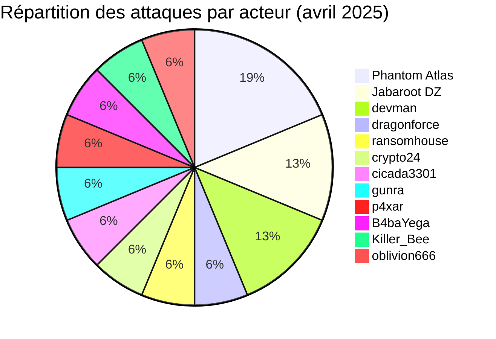
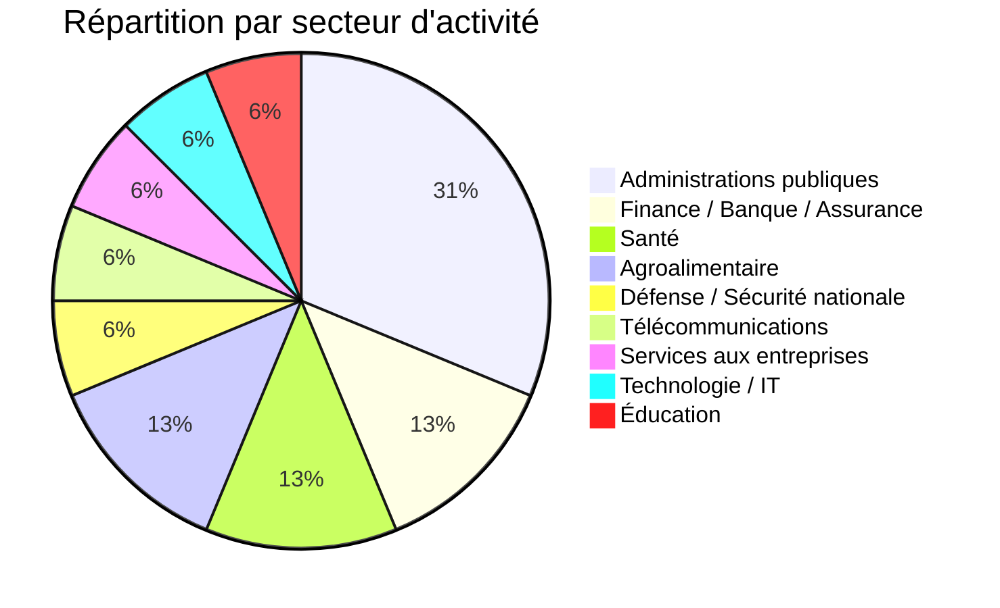
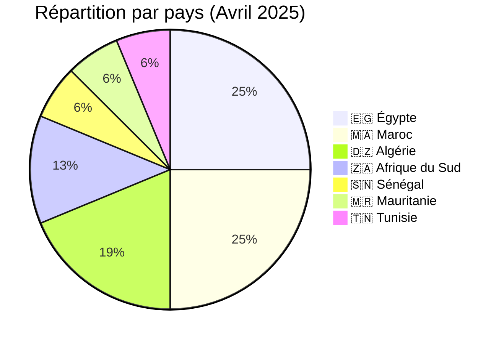
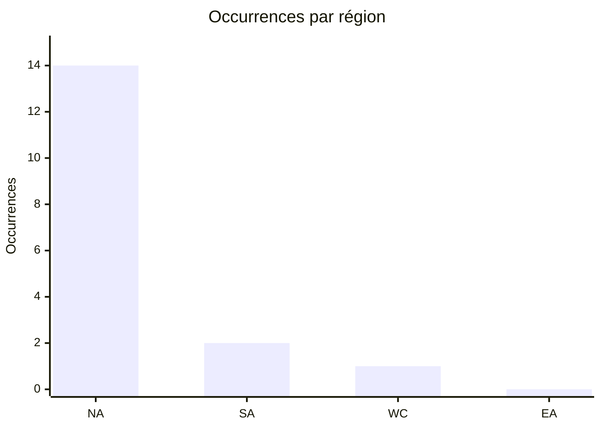
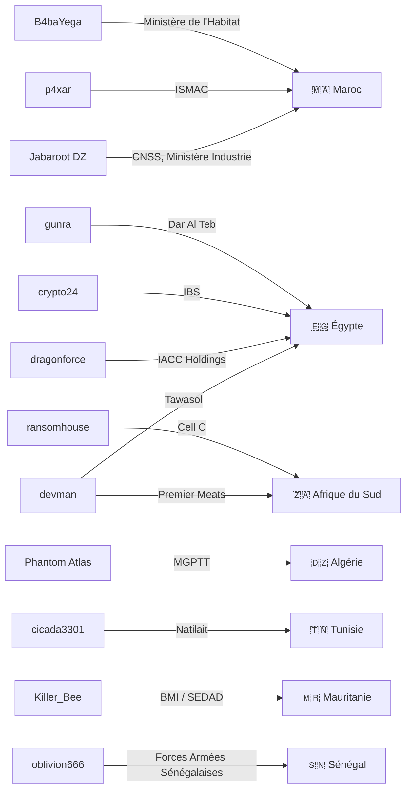
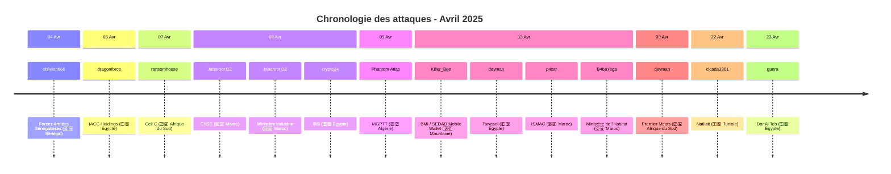

[](https://github.com/Hatchepsoute/AFRINTEL)


 

# Rapport CTI : Cyberattaques en Afrique - Avril 2025
👉🏾 [**English version available here**](./README.md)
## 1. Introduction
Ce rapport de Cyber Threat Intelligence (CTI) présente une analyse détaillée des cyberattaques survenues en Afrique durant le mois d'avril 2025. Les informations sont issues de sources OSINT et de sites de fuites de groupes ransomware, compilées dans le cadre du projet AFRINTEL. L'objectif est de fournir une vision claire des tendances, des acteurs menaçants, des secteurs ciblés et des indicateurs de compromission associés.

## 2. Résumé exécutif
- **Nombre total d'attaques recensées** : 17
- **Acteurs les plus actifs** : Phantom Atlas (3 attaques), Jabaroot DZ (2), devman (2), dragonforce (1), ransomhouse (1), crypto24 (1), cicada3301 (1), gunra (1), p4xar (1), B4baYega (1), Killer_Bee (1), oblivion666 (1).
- **Secteurs les plus ciblés** : Gouvernement / Administrations publiques (5), Finance / Banque / Assurance (2), Santé (2), Agroalimentaire (2), Défense / Sécurité nationale (1), Télécommunications (1), Services aux entreprises / RH (1), Technologie / Services IT (1), Éducation (1).
- **Pays les plus touchés** : Égypte (4), Maroc (4), Algérie (3), Afrique du Sud (2), Sénégal (1), Mauritanie (1), Tunisie (1).
- **Volume de données exfiltrées** : 27,75 Go pour IACC Holdings. Les autres volumes ne sont pas précisés.

## 3. Statistiques clés

### 3.1 Répartition par acteur/source
| Acteur / Groupe | Nombre d'attaques |
|-------------------|-------------------|
| Phantom Atlas     | 3                 |
| Jabaroot DZ       | 2                 |
| devman            | 2                 |
| dragonforce       | 1                 |
| ransomhouse       | 1                 |
| crypto24          | 1                 |
| cicada3301        | 1                 |
| gunra             | 1                 |
| p4xar             | 1                 |
| B4baYega          | 1                 |
| Killer_Bee        | 1                 |
| oblivion666       | 1                 |
| **Total**         | **16**            |


### 3.2 Répartition par secteur d'activité
| Secteur | Nombre d'attaques |
|---------|-------------------|
| Gouvernement / Administrations publiques | 5 |
| Finance / Banque / Assurance | 2 |
| Santé | 2 |
| Agroalimentaire | 2 |
| Défense / Sécurité nationale | 1 |
| Télécommunications | 1 |
| Services aux entreprises / RH | 1 |
| Technologie / Services IT | 1 |
| Éducation | 1 |
| **Total** | **16** |



### 3.3 Répartition par pays
| Pays | Nombre d'attaques |
|------|-------------------|
|🇪🇬 Égypte | 4 |
|🇲🇦 Maroc | 4 |
|🇩🇿 Algérie | 3 |
|🇿🇦 Afrique du Sud | 2 |
|🇸🇳 Sénégal | 1 |
|🇲🇷 Mauritanie | 1 |
|🇹🇳 Tunisie | 1 |
| **Total** | **16** |




<!-- AFRINTEL_CURRENT_MODEL_START -->
### 3.4 Vue globale standardisée

| Pays | Ransomware | Exposition des données (fuites + accès) | Total | Distribution |
| :--- | ---: | ---: | ---: | :--- |
| 🇪🇬 Égypte | 4 | 1 | 5 | 🟧🟧🟧🟧 🟦 |
| 🇲🇦 Maroc | 0 | 4 | 4 |  🟦🟦🟦🟦 |
| 🇩🇿 Algérie | 0 | 3 | 3 |  🟦🟦🟦 |
| 🇿🇦 Afrique du Sud | 2 | 0 | 2 | 🟧🟧 |
| 🇲🇷 Mauritanie | 0 | 1 | 1 |  🟦 |
| 🇸🇳 Sénégal | 0 | 1 | 1 |  🟦 |
| 🇹🇳 Tunisie | 1 | 0 | 1 | 🟧 |

```pie
    title Types d’incidents
    "Ransomware" : 7
    "Fuites de données + ventes d’accès" : 10
```

### Vue agrégée mensuelle de l’exposition

La vue CTI mensuelle regroupe les fuites de données et les ventes d’accès sous **exposition des données** : **10 fiches** (58,8% du corpus mensuel). Les fiches sources restent la référence ; une vente d’accès ne prouve pas à elle seule l’exfiltration de données.


### Répartition géographique par région

| Région | Occurrences | Ransomware | Exposition des données (fuites + accès) | Distribution |
| :--- | ---: | ---: | ---: | :--- |
| Afrique du Nord | 14 | 5 | 9 | 🟧🟧🟧🟧🟧 🟦🟦🟦🟦🟦🟦🟦🟦🟦 |
| Afrique australe | 2 | 2 | 0 | 🟧🟧 |
| Afrique de l’Ouest et centrale | 1 | 0 | 1 |  🟦 |
| Afrique de l’Est | 0 | 0 | 0 |  |


Légende : NA = Afrique du Nord ; SA = Afrique australe ; WC = Afrique de l’Ouest et centrale ; EA = Afrique de l’Est

### Répartition sectorielle

| Secteur | Fiches | Part | Activité |
| :--- | ---: | ---: | :--- |
| Gouvernement / administration | 6 | 35,3% | ██████████ |
| Finance / banque | 4 | 23,5% | ███████ |
| Technologies / informatique | 2 | 11,8% | ███ |
| Agriculture / agro-industrie | 1 | 5,9% | ██ |
| Éducation / universités | 1 | 5,9% | ██ |
| Santé / médical | 1 | 5,9% | ██ |
| Industrie / fabrication | 1 | 5,9% | ██ |
| Services professionnels | 1 | 5,9% | ██ |

### Acteurs / groupes les plus présents

| Acteur / Groupe | Fiches | Activité |
| :--- | ---: | :--- |
| Phantom Atlas | 3 | ██████████ |
| Jabaroot DZ | 2 | ███████ |
| devman | 2 | ███████ |
| B4baYega | 1 | ███ |
| Killer_Bee | 1 | ███ |
| cicada3301 | 1 | ███ |
| crypto24 | 1 | ███ |
| dragonforce | 1 | ███ |
| gunra | 1 | ███ |
| nightspire | 1 | ███ |
<!-- AFRINTEL_CURRENT_MODEL_END -->
## 4. Détail des attaques par groupe ransomware

### 4.1 Jabaroot DZ (2 attaques)
- **08/04/2025** : CNSS (Maroc, administrations publiques)
- **08/04/2025** : Ministère de l'Industrie et du Commerce (Maroc, gouvernement)

*Remarque* : Jabaroot DZ a ciblé deux institutions publiques marocaines le même jour, démontrant une capacité à frapper des infrastructures critiques.

### 4.2 devman (2 attaques)
- **13/04/2025** : Tawasol (Égypte, technologies)
- **20/04/2025** : Premier Meats (Afrique du Sud, agroalimentaire)

*Remarque* : devman a opéré sur deux pays et secteurs différents, montrant une diversification géographique.

### 4.3 dragonforce (1 attaque)
- **06/04/2025** : IACC Holdings (Égypte, finance/logistique) - 27,75 Go exfiltrés

### 4.4 ransomhouse (1 attaque)
- **07/04/2025** : Cell C (Afrique du Sud, télécommunications)

### 4.5 crypto24 (1 attaque)
- **08/04/2025** : International Business Service (Égypte, services aux entreprises)

### 4.6 Phantom Atlas (1 attaque)
- **09/04/2025** : MGPTT (Algérie, mutuelle de santé)

### 4.7 cicada3301 (1 attaque)
- **22/04/2025** : Natilait (Tunisie, agroalimentaire)

### 4.8 gunra (1 attaque)
- **23/04/2025** : Dar Al Teb (Égypte, santé)

### 4.9 p4xar (1 attaque)
- **13/04/2025** : ISMAC (Maroc, éducation) - échantillon SQL substantiel contenant des données sensibles d’étudiants ; la publication revendiquée de la base complète n’a pas pu être vérifiée.

### 4.10 B4baYega (1 attaque)
- **13/04/2025** : Ministère de l'Habitat et de la Politique de la Ville (Maroc, gouvernement) - simple revendication ; l'archive sous-jacente était protégée par mot de passe et n'a pas pu être vérifiée de manière indépendante.

### 4.11 Killer_Bee (1 revendication)
- **13/04/2025:** BMI / SEDAD Mobile Wallet (Mauritanie, finance / paiement mobile) - échantillon anonymisé ; plus de 90 000 enregistrements revendiqués non vérifiés.

### 4.12 oblivion666 (1 revendication)
- **04/04/2025 :** Forces Armées Sénégalaises / armee.sn (Sénégal, défense) - annonce de vente d'accès (domaines et accès administrateur serveurs/pare-feu) ; aucun échantillon ni preuve technique fournie, non vérifié.

### 4.13 Graphe acteur → victime → pays

## 5. Analyse sectorielle
- **Administrations publiques** : 4 attaques (CNSS, Ministère de l'Industrie, Ministère de l'Habitat, MGPTT). Les groupes Jabaroot DZ, B4baYega et Phantom Atlas ont ciblé des institutions clés au Maroc et en Algérie, avec des données sensibles (bénéficiaires, documents administratifs).
- **Agroalimentaire** : 2 attaques (Premier Meats, Natilait) par devman et cicada3301, visant des entreprises de transformation alimentaire en Afrique du Sud et Tunisie.
- **Finance/Logistique** : 1 attaque (IACC Holdings) par dragonforce, avec exfiltration de 27,75 Go.
- **Télécommunications** : 1 attaque (Cell C) par ransomhouse, touchant un opérateur majeur sud-africain.
- **Services aux entreprises** : 1 attaque (IBS) par crypto24, ciblant un prestataire BPO égyptien.
- **Technologies** : 1 attaque (Tawasol) par devman, visant un intégrateur de solutions IT.
- **Santé** : 1 attaque (Dar Al Teb) par gunra, frappant un centre médical spécialisé.
- **Éducation** : 1 revendication de fuite (ISMAC) attribuée à p4xar, étayée par un échantillon SQL substantiel contenant des données sensibles d’étudiants.
- **Défense / Sécurité nationale** : 1 revendication de vente d'accès (Forces Armées Sénégalaises / armee.sn) par oblivion666, proposant des domaines et un accès administrateur serveurs/pare-feu, sans échantillon accessible.

### 5.1 Timeline des attaques

## 6. Analyse géographique
- **Maroc** : 4 attaques (CNSS, Ministère de l'Industrie, Ministère de l'Habitat, ISMAC) - administration publique et éducation. Deux revendications ont été publiées par Jabaroot DZ le même jour ; celle visant l'ISMAC est étayée par un échantillon SQL substantiel, et celle visant le Ministère de l'Habitat reste non vérifiée en raison d'une archive protégée par mot de passe.
- **Égypte** : 4 attaques (IACC, IBS, Tawasol, Dar Al Teb) - finance, BPO, IT, santé. L'Égypte reste parmi les pays les plus ciblés du continent.
- **Afrique du Sud** : 2 attaques (Cell C, Premier Meats) - télécoms et agroalimentaire.
- **Algérie** : 1 attaque (MGPTT) - mutuelle de santé, avec publication de données personnelles.
- **Tunisie** : 1 attaque (Natilait) - agroalimentaire.
- **Mauritanie** : 1 revendication de fuite (BMI / SEDAD Mobile Wallet) - finance / paiement mobile.
- **Sénégal** : 1 revendication de vente d'accès (Forces Armées Sénégalaises / armee.sn) - défense, non vérifiée.

L'Afrique du Nord (Égypte, Maroc, Algérie, Tunisie) concentre 10 attaques sur 14, confirmant une forte pression sur la région.

## 7. TTPs observées
- **Exfiltration de données** : IACC Holdings (27,75 Go), MGPTT (listes de bénéficiaires) et l’échantillon SQL de l’ISMAC illustrent la collecte et l’exposition de données sensibles.
- **Ciblage d'institutions publiques** : 4 attaques sur des organismes gouvernementaux, avec des motivations potentiellement politiques (revendication "représailles" pour MGPTT).
- **Vente d'accès** : oblivion666 a proposé à la vente des domaines et un accès administrateur à l'infrastructure des forces armées sénégalaises, illustrant le segment courtier d'accès de l'écosystème aux côtés des revendications de ransomware et de fuite de données.
- **Diversité des acteurs** : 12 groupes différents actifs, dont des acteurs hacktivistes (Jabaroot DZ, Phantom Atlas) et des ransomwares traditionnels.
- **Double extorsion** : Revendications accompagnées de fuites de données pour pression.
- **Exploitation de failles web** : Probable pour les sites gouvernementaux.

## 8. Recommandations
- **Secteurs public et éducatif** : Renforcer les portails administratifs et étudiants, imposer la MFA aux accès privilégiés, limiter les exports de bases et surveiller la création anormale de dumps SQL, particulièrement au Maroc et en Algérie.
- **Égypte** : Accroître la vigilance dans les secteurs financier, BPO et santé, très ciblés.
- **Agroalimentaire** : Les entreprises comme Premier Meats et Natilait doivent sécuriser leurs chaînes d'approvisionnement numériques.
- **Télécoms** : Opérateurs comme Cell C doivent protéger les données des abonnés.
- **Tous secteurs** : Mettre en place une authentification multi-facteurs et des sauvegardes hors ligne.

## 9. Conclusion
Avril 2025 a été marqué par une activité soutenue en Afrique du Nord, avec une forte proportion d'attaques contre les administrations publiques. Les groupes Jabaroot DZ et devman se distinguent par leur polyvalence. La diversité des acteurs (hacktivistes, ransomwares) souligne la complexité de la menace. Une coopération régionale renforcée est nécessaire pour faire face à ces cyberattaques.

## ✍🏿 Auteur
*Adama ASSIONGBON*  
*Consultant SOC & Cyber Threat Intelligence*  
[LinkedIn Profile](https://www.linkedin.com/in/adama-assiongbon-9029893a/)

---
*AFRINTEL - Initiative ouverte de veille CTI sur l’Afrique*

---
