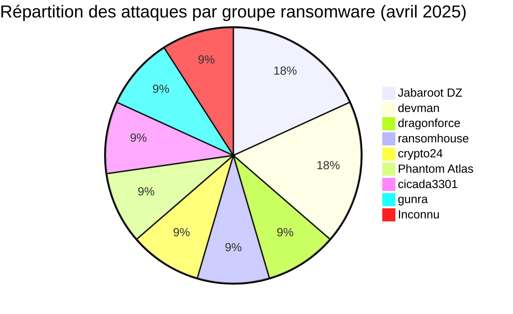
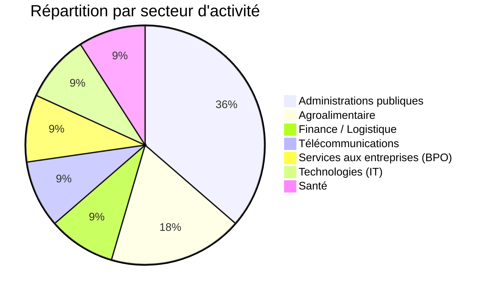
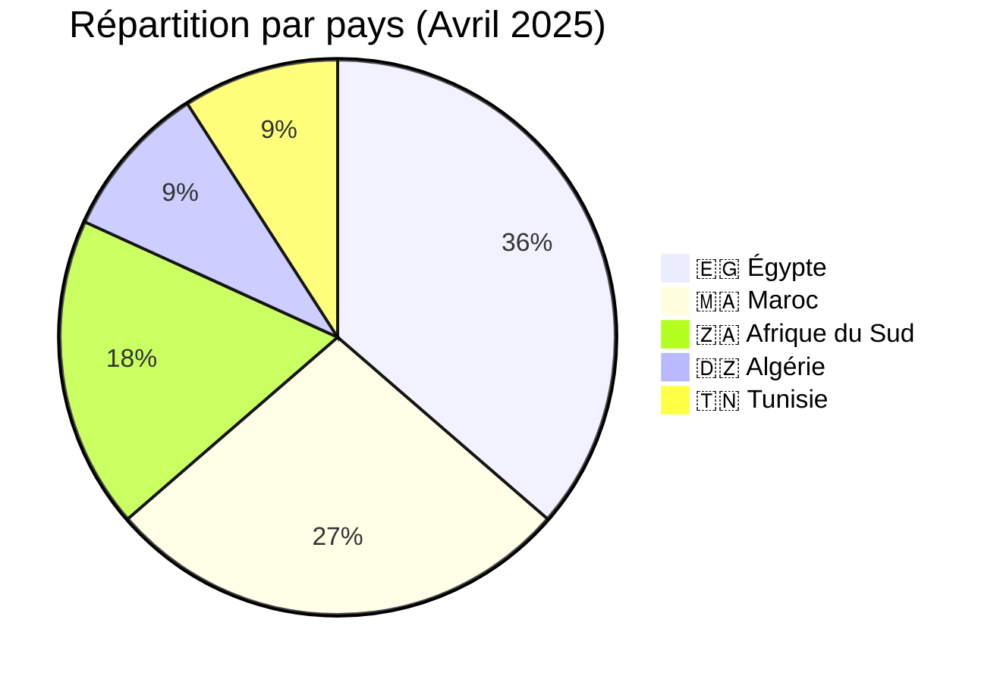
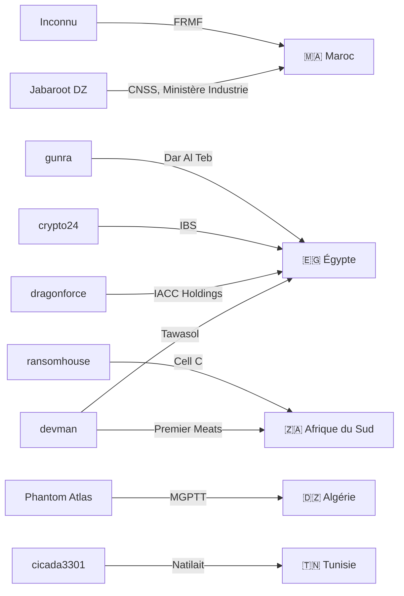
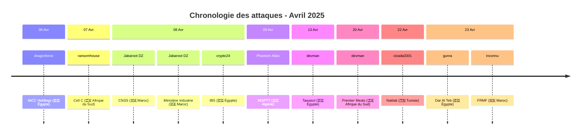

# Rapport CTI : Cyberattaques en Afrique - Avril 2025
👉🏾 [**English version available here**](./README.md)
## 1. Introduction
Ce rapport de Cyber Threat Intelligence (CTI) présente une analyse détaillée des cyberattaques survenues en Afrique durant le mois d'avril 2025. Les informations sont issues de sources OSINT et de sites de fuites de groupes ransomware, compilées dans le cadre du projet AFRINTEL. L'objectif est de fournir une vision claire des tendances, des acteurs menaçants, des secteurs ciblés et des indicateurs de compromission associés.

## 2. Résumé exécutif
- **Nombre total d'attaques recensées** : 11
- **Groupes ransomware les plus actifs** : Jabaroot DZ (2 attaques), devman (2), dragonforce (1), ransomhouse (1), crypto24 (1), Phantom Atlas (1), cicada3301 (1), gunra (1), inconnu (1).
- **Secteurs les plus ciblés** : Administrations publiques (4), Agroalimentaire (2), Finance/Logistique (1), Télécommunications (1), Services aux entreprises (1), Technologies (1), Santé (1).
- **Pays les plus touchés** : Égypte (4), Maroc (3), Afrique du Sud (2), Algérie (1), Tunisie (1).
- **Volume de données exfiltrées** : 27,75 Go pour IACC Holdings. Les autres volumes ne sont pas précisés.

## 3. Statistiques clés

### 3.1 Répartition par groupe ransomware
| Groupe ransomware | Nombre d'attaques |
|-------------------|-------------------|
| Jabaroot DZ       | 2                 |
| devman            | 2                 |
| dragonforce       | 1                 |
| ransomhouse       | 1                 |
| crypto24          | 1                 |
| Phantom Atlas     | 1                 |
| cicada3301        | 1                 |
| gunra             | 1                 |
| Inconnu           | 1                 |
| **Total**         | **11**            |

### 3.2 Répartition par secteur d'activité
| Secteur | Nombre d'attaques |
|---------|-------------------|
| Administrations publiques | 4 |
| Agroalimentaire | 2 |
| Finance / Logistique | 1 |
| Télécommunications | 1 |
| Services aux entreprises (BPO) | 1 |
| Technologies (IT) | 1 |
| Santé | 1 |
| **Total** | **11** |

### 3.3 Répartition par pays
| Pays | Nombre d'attaques |
|------|-------------------|
|🇪🇬 Égypte | 4 |
|🇲🇦 Maroc | 3 |
|🇿🇦 Afrique du Sud | 2 |
|🇩🇿 Algérie | 1 |
|🇹🇳 Tunisie | 1 |
| **Total** | **11** |

## 4. Détail des attaques par groupe ransomware

### 4.1 Jabaroot DZ (2 attaques)
- **08/04/2025** : CNSS (Maroc, administrations publiques)
- **08/04/2025** : Ministère de l'Industrie et du Commerce (Maroc, gouvernement)

*Remarque* : Jabaroot DZ a ciblé deux institutions publiques marocaines le même jour, démontrant une capacité à frapper des infrastructures critiques.

### 4.2 devman (2 attaques)
- **13/04/2025** : Tawasol (Égypte, technologies)
- **20/04/2025** : Premier Meats (Afrique du Sud, agroalimentaire)

*Remarque* : devman a opéré sur deux pays et secteurs différents, montrant une diversification géographique.

### 4.3 dragonforce (1 attaque)
- **06/04/2025** : IACC Holdings (Égypte, finance/logistique) - 27,75 Go exfiltrés

### 4.4 ransomhouse (1 attaque)
- **07/04/2025** : Cell C (Afrique du Sud, télécommunications)

### 4.5 crypto24 (1 attaque)
- **08/04/2025** : International Business Service (Égypte, services aux entreprises)

### 4.6 Phantom Atlas (1 attaque)
- **09/04/2025** : MGPTT (Algérie, mutuelle de santé)

### 4.7 cicada3301 (1 attaque)
- **22/04/2025** : Natilait (Tunisie, agroalimentaire)

### 4.8 gunra (1 attaque)
- **23/04/2025** : Dar Al Teb (Égypte, santé)

### 4.9 Inconnu (1 attaque)
- **23/04/2025** : FRMF (Maroc, sport/administration)

### 4.10 Graphe acteur → victime → pays

## 5. Analyse sectorielle
- **Administrations publiques** : 4 attaques (CNSS, Ministère de l'Industrie, MGPTT, FRMF). Les groupes Jabaroot DZ et Phantom Atlas ont ciblé des institutions clés au Maroc et en Algérie, avec des données sensibles (bénéficiaires, documents administratifs).
- **Agroalimentaire** : 2 attaques (Premier Meats, Natilait) par devman et cicada3301, visant des entreprises de transformation alimentaire en Afrique du Sud et Tunisie.
- **Finance/Logistique** : 1 attaque (IACC Holdings) par dragonforce, avec exfiltration de 27,75 Go.
- **Télécommunications** : 1 attaque (Cell C) par ransomhouse, touchant un opérateur majeur sud-africain.
- **Services aux entreprises** : 1 attaque (IBS) par crypto24, ciblant un prestataire BPO égyptien.
- **Technologies** : 1 attaque (Tawasol) par devman, visant un intégrateur de solutions IT.
- **Santé** : 1 attaque (Dar Al Teb) par gunra, frappant un centre médical spécialisé.

### 5.1 Timeline des attaques

## 6. Analyse géographique
- **Égypte** : 4 attaques (IACC, IBS, Tawasol, Dar Al Teb) - finance, BPO, IT, santé. L'Égypte reste le pays le plus ciblé du continent.
- **Maroc** : 3 attaques (CNSS, Ministère, FRMF) - administrations publiques et sport. Deux attaques coordonnées par Jabaroot DZ le même jour.
- **Afrique du Sud** : 2 attaques (Cell C, Premier Meats) - télécoms et agroalimentaire.
- **Algérie** : 1 attaque (MGPTT) - mutuelle de santé, avec publication de données personnelles.
- **Tunisie** : 1 attaque (Natilait) - agroalimentaire.

L'Afrique du Nord (Égypte, Maroc, Algérie, Tunisie) concentre 9 attaques sur 11, confirmant une forte pression sur la région.

## 7. TTPs observées
- **Exfiltration de données** : IACC Holdings (27,75 Go) et MGPTT (listes de bénéficiaires) illustrent la collecte de données sensibles.
- **Ciblage d'institutions publiques** : 4 attaques sur des organismes gouvernementaux, avec des motivations potentiellement politiques (revendication "représailles" pour MGPTT).
- **Diversité des acteurs** : 9 groupes différents actifs, dont des acteurs hacktivistes (Jabaroot DZ, Phantom Atlas) et des ransomwares traditionnels.
- **Double extorsion** : Revendications accompagnées de fuites de données pour pression.
- **Exploitation de failles web** : Probable pour les sites gouvernementaux.

## 8. Recommandations
- **Secteur public** : Renforcer la sécurité des portails administratifs et des bases de données citoyennes, particulièrement au Maroc et en Algérie.
- **Égypte** : Accroître la vigilance dans les secteurs financier, BPO et santé, très ciblés.
- **Agroalimentaire** : Les entreprises comme Premier Meats et Natilait doivent sécuriser leurs chaînes d'approvisionnement numériques.
- **Télécoms** : Opérateurs comme Cell C doivent protéger les données des abonnés.
- **Tous secteurs** : Mettre en place une authentification multi-facteurs et des sauvegardes hors ligne.

## 9. Conclusion
Avril 2025 a été marqué par une activité soutenue en Afrique du Nord, avec une forte proportion d'attaques contre les administrations publiques. Les groupes Jabaroot DZ et devman se distinguent par leur polyvalence. La diversité des acteurs (hacktivistes, ransomwares) souligne la complexité de la menace. Une coopération régionale renforcée est nécessaire pour faire face à ces cyberattaques.

## ✍🏿 Auteur
*Adama ASSIONGBON*  
*Consultant SOC & Cyber Threat Intelligence*  
[LinkedIn Profile](https://www.linkedin.com/in/adama-assiongbon-9029893a/)

---
*AFRINTEL - Initiative ouverte de veille CTI sur l’Afrique*

---
