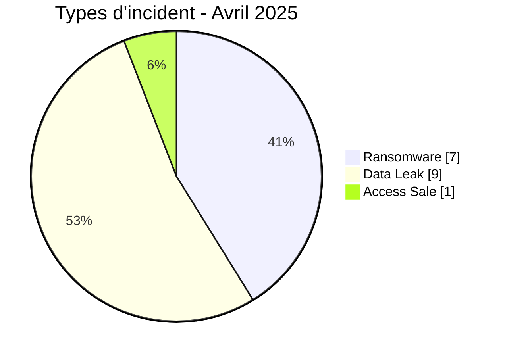
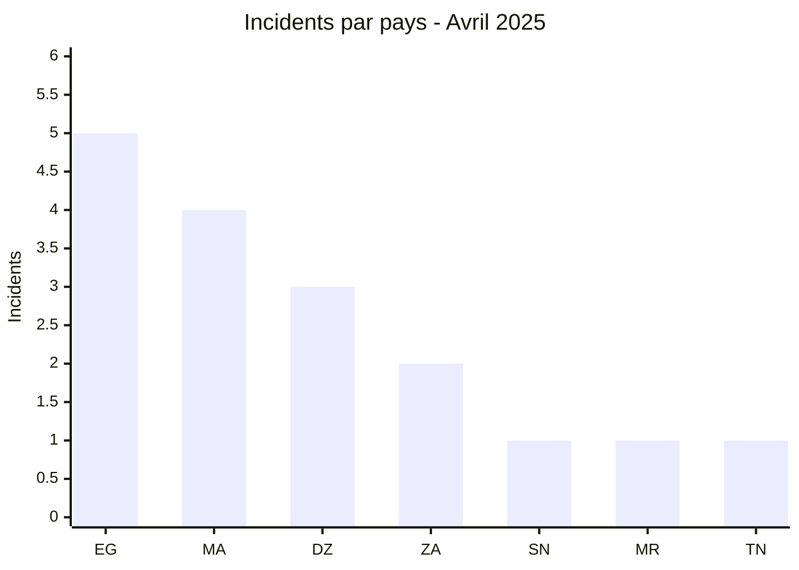
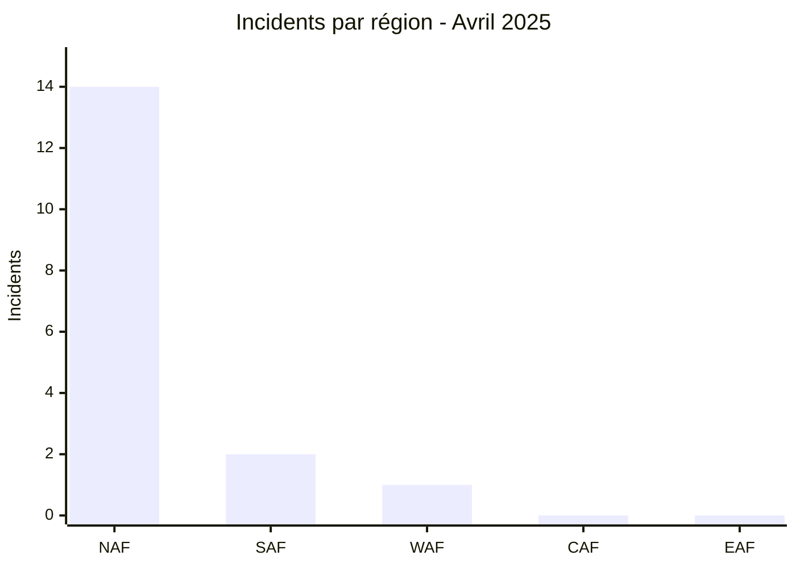
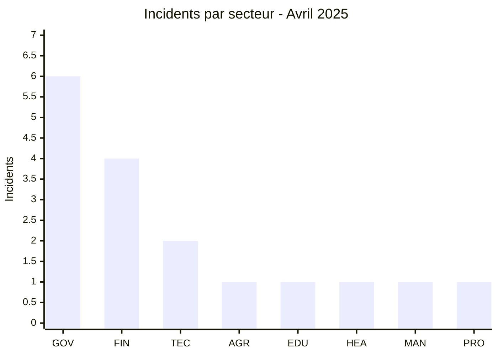
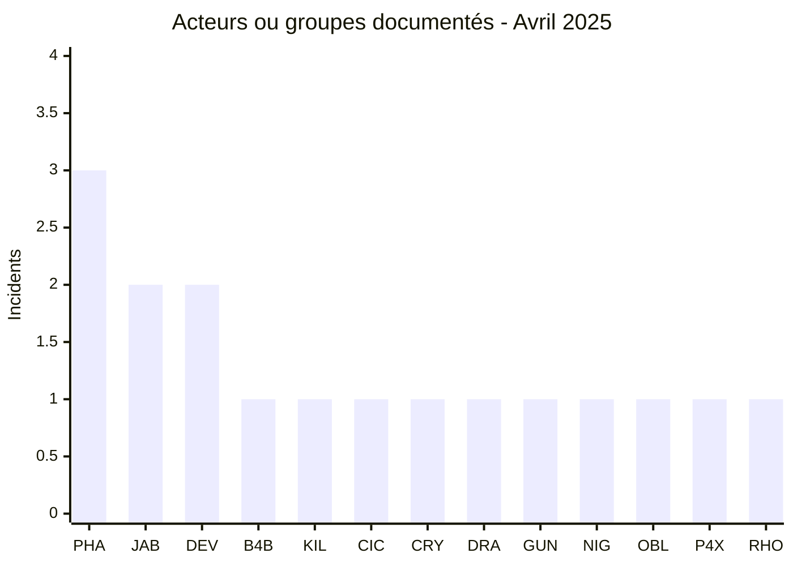

# Rapport CTI - Cyberattaques en Afrique - Avril 2025

👉🏾 [**English version available here**](./README.md)

## 1. Synthèse exécutive

Avril 2025 compte **17 incidents documentés dans 7 pays africains** : **7 Ransomware, 9 Data Leak et 1 Access Sale**.

- **Égypte** arrive en tête avec **5 incidents**, et non 4.
- **Maroc** compte 4 incidents, **Algérie** 3 et **Afrique du Sud** 2.
- **Phantom Atlas** est le label le plus présent avec 3 fiches, devant Jabaroot DZ et devman avec 2 chacune.
- **Gouvernement / Administration** représente 6 incidents, suivi de Finance / Banque avec 4.
- Les expositions de données dominent le mois : **9 Data Leak + 1 Access Sale = 10 incidents sur 17**.
- Parmi les éléments les plus significatifs figurent les exports CNSS, les documents CNAS et MGPTT, les données étudiantes ISMAC, les documents financiers d'INI Investments et les données de santé reproductive de Dar Al Teb.

### 📋 Liste des victimes

👉🏾 [Voir la liste complète des victimes](./victims_FR.md)

### 1.1 Comparaison avec le mois précédent

> Comparaison fondée sur les corpus mensuels AFRINTEL validés. Une variation du nombre de fiches documentées ne prouve pas, à elle seule, une variation du nombre réel de compromissions.

| Indicateur | Mars 2025 | Avril 2025 | Évolution observée |
|---|---:|---:|---:|
| Total incidents | 11 | 17 | **+6 (+54,5 %)** |
| Ransomware | 9 | 7 | **-2 (-22,2 %)** |
| Data Leak | 1 | 9 | **+8 (+800,0 %)** |
| Access Sale | 1 | 1 | **0 (+0,0 %)** |
| DDoS | 0 | 0 | **0 (stable)** |
| Defacement | 0 | 0 | **0 (stable)** |
| Operational Fraud | 0 | 0 | **0 (stable)** |

## 2. Méthodologie

- **Périmètre** : 54 pays africains.
- **Période** : 1er au 30 avril 2025.
- **Sources** : OSINT, leak sites, forums underground, publications d'acteurs et échantillons lorsqu'ils sont disponibles.
- **Source de vérité** : couple validé [`victims_FR.md`](./victims_FR.md) / [`victims.md`](./victims.md), avec contrôle éditorial en français avant synchronisation anglaise.
- **Comptage** : une fiche correspond à un incident unique dans le corpus mensuel.
- **Qualification** : revendication, échantillon, vente d'accès et confirmation technique restent des niveaux distincts.

## 3. Vue d'ensemble

### 3.1 Répartition par type d'incident

| Type d'incident | Nombre | Part |
|---|---:|---:|
| Ransomware | 7 | 41,2 % |
| Data Leak | 9 | 52,9 % |
| Access Sale | 1 | 5,9 % |
| DDoS | 0 | 0,0 % |
| Defacement | 0 | 0,0 % |
| Operational Fraud | 0 | 0,0 % |
| **Total** | **17** | **100 %** |

**Convention couleur :** 🟧 Ransomware | 🟦 Data Leak | 🟪 Access Sale | 🟥 DDoS | 🟨 Defacement | 🟩 Operational Fraud.

### 3.2 Répartition par pays

| Pays | Ransomware | Data Leak | Access Sale | Total | Distribution |
|---|---:|---:|---:|---:|---|
| 🇪🇬 Égypte | 4 | 1 | 0 | 5 | 🟧🟧🟧🟧🟦 |
| 🇲🇦 Maroc | 0 | 4 | 0 | 4 | 🟦🟦🟦🟦 |
| 🇩🇿 Algérie | 0 | 3 | 0 | 3 | 🟦🟦🟦 |
| 🇿🇦 Afrique du Sud | 2 | 0 | 0 | 2 | 🟧🟧 |
| 🇸🇳 Sénégal | 0 | 0 | 1 | 1 | 🟪 |
| 🇲🇷 Mauritanie | 0 | 1 | 0 | 1 | 🟦 |
| 🇹🇳 Tunisie | 1 | 0 | 0 | 1 | 🟧 |
| **Total** | **7** | **9** | **1** | **17** | |

**Légende :** `EG` = Égypte | `MA` = Maroc | `DZ` = Algérie | `ZA` = Afrique du Sud | `SN` = Sénégal | `MR` = Mauritanie | `TN` = Tunisie

### 3.3 Comparaison par type et pays

```mermaid
xychart-beta
    title "Ransomware vs Data Leak par pays - Avril 2025"
    x-axis ["EG", "MA", "DZ", "ZA", "SN", "MR", "TN"]
    y-axis "Incidents" 0 --> 5
    bar [4, 0, 0, 2, 0, 0, 1]
    bar [1, 4, 3, 0, 0, 1, 0]
```

**Légende des séries :** première série = 🟧 Ransomware | deuxième série = 🟦 Data Leak.  
**Access Sale :** 🟪 Sénégal = 1.  
**Pays :** `EG` = Égypte | `MA` = Maroc | `DZ` = Algérie | `ZA` = Afrique du Sud | `SN` = Sénégal | `MR` = Mauritanie | `TN` = Tunisie

### 3.4 Répartition géographique par région

| Région | Incidents | Part |
|---|---:|---:|
| Afrique du Nord | 14 | 82,4 % |
| Afrique australe | 2 | 11,8 % |
| Afrique de l'Ouest | 1 | 5,9 % |
| Afrique centrale | 0 | 0,0 % |
| Afrique de l'Est | 0 | 0,0 % |
| **Total** | **17** | **100 %** |

**Légende :** `NAF` = Afrique du Nord | `SAF` = Afrique australe | `WAF` = Afrique de l'Ouest | `CAF` = Afrique centrale | `EAF` = Afrique de l'Est

### 3.5 Répartition sectorielle

| Secteur normalisé | Incidents | Part | Activité |
|---|---:|---:|---|
| Gouvernement / Administration | 6 | 35,3 % | ██████████ |
| Finance / Banque | 4 | 23,5 % | ███████ |
| Technologie / IT | 2 | 11,8 % | ███ |
| Agriculture / Agro-industrie | 1 | 5,9 % | ██ |
| Éducation / Université | 1 | 5,9 % | ██ |
| Santé / Médical | 1 | 5,9 % | ██ |
| Industrie / Fabrication | 1 | 5,9 % | ██ |
| Services professionnels | 1 | 5,9 % | ██ |
| **Total** | **17** | **100 %** | |

**Légende :** `GOV` = Gouvernement / Administration | `FIN` = Finance / Banque | `TEC` = Technologie / IT | `AGR` = Agriculture / Agro-industrie | `EDU` = Éducation / Université | `HEA` = Santé / Médical | `MAN` = Industrie / Fabrication | `PRO` = Services professionnels

### 3.6 Acteurs / groupes

| Acteur / Groupe | Incidents | Activité |
|---|---:|---|
| Phantom Atlas | 3 | ██████████ |
| Jabaroot DZ | 2 | ███████ |
| devman | 2 | ███████ |
| B4baYega | 1 | ███ |
| Killer_Bee | 1 | ███ |
| cicada3301 | 1 | ███ |
| crypto24 | 1 | ███ |
| dragonforce | 1 | ███ |
| gunra | 1 | ███ |
| nightspire | 1 | ███ |
| oblivion666 | 1 | ███ |
| p4xar | 1 | ███ |
| ransomhouse | 1 | ███ |
| **Total** | **17** | |

**Légende :** `PHA` = Phantom Atlas | `JAB` = Jabaroot DZ | `DEV` = devman | `B4B` = B4baYega | `KIL` = Killer_Bee | `CIC` = cicada3301 | `CRY` = crypto24 | `DRA` = dragonforce | `GUN` = gunra | `NIG` = nightspire | `OBL` = oblivion666 | `P4X` = p4xar | `RHO` = ransomhouse

## 4. Analyse détaillée par type d'incident

### 4.1 Ransomware - 7 incidents

Les sept fiches Ransomware concernent dragonforce, ransomhouse, crypto24, devman à deux reprises, cicada3301 et gunra.

Les niveaux de preuve varient fortement. Cell C dispose de 20 captures montrant des données clients, employés, passeports, appels, SMS, contrats et documents internes. Natilait dispose d'un échantillon opérationnel limité. Dar Al Teb présente le niveau de preuve le plus élevé parmi les cas ransomware du mois, avec plusieurs milliers de lignes de données patients, des documents cliniques et des artefacts d'infrastructure interne.

### 4.2 Data Leak - 9 incidents

Les neuf Data Leak concernent CNSS, Ministère marocain de l'Industrie et du Commerce, CNAS, MGPTT, Ministère algérien du Travail, BMI / SEDAD, ISMAC, Ministère marocain de l'Habitat et INI Investments.

Le cas **CNSS Maroc** est particulièrement important : deux exports structurés contiennent environ 1,094 million de fiches employeurs et 1,996 million de fiches assurés. Le cas **CNAS Algérie** comporte 214 documents examinés, très en dessous des 860 200 revendiqués. Le cas **MGPTT** comprend quatre images, avec une réserve importante sur l'origine d'au moins une partie de l'échantillon. **INI Investments** dispose de documents financiers internes cohérents qui soutiennent une confiance élevée dans l'authenticité de l'exposition.

### 4.3 Access Sale - 1 incident

Les **Forces Armées Sénégalaises** constituent l'unique Access Sale du mois. oblivion666 propose un accès administrateur revendiqué à plusieurs sous-domaines, serveurs et à un pare-feu. Aucun identifiant ni échantillon technique n'est fourni, le statut reste donc **Claim - Unverified**.

## 5. Impact sectoriel

Le secteur **Gouvernement / Administration** concentre **6 incidents sur 17 (35,3 %)**. **Finance / Banque** suit avec 4 incidents. Technologie / IT compte 2 incidents. Agriculture / Agro-industrie, Éducation, Santé, Industrie / Fabrication et Services professionnels comptent chacun 1 incident.

## 6. Profil des acteurs

### 6.1 Profil

Phantom Atlas est le label le plus visible avec **3 fiches**, toutes en Algérie. Jabaroot DZ et devman comptent chacun **2 fiches**. Les dix autres labels apparaissent une seule fois.

### 6.2 Évaluation du risque

| Pays | Signal de risque dans le corpus |
|---|---|
| Égypte | 5 incidents, incluant finance, BPO, IT et santé |
| Maroc | 4 incidents, dont une exposition CNSS de très grande ampleur et un échantillon SQL étudiant ISMAC |
| Algérie | 3 Data Leak liés à des organismes publics ou sociaux |
| Afrique du Sud | 2 Ransomware dans les télécoms et l'agroalimentaire |
| Mauritanie | 1 Data Leak portant sur un service de paiement mobile |
| Sénégal | 1 Access Sale revendiqué visant une infrastructure de défense |
| Tunisie | 1 Ransomware dans l'industrie agroalimentaire |

## 7. Tendances et lacunes de renseignement

### 7.1 Tendances observées

1. **Hausse du corpus** : 11 incidents en mars contre 17 en avril.
2. **Basculement vers les Data Leak** : 9 incidents sur 17, contre 1 sur 11 en mars.
3. **Baisse du Ransomware** : 9 en mars contre 7 en avril.
4. **Forte concentration nord-africaine** : 14 des 17 fiches selon le regroupement régional utilisé par le rapport.
5. **Secteur public très représenté** : 6 incidents normalisés Gouvernement / Administration.
6. **Écart entre revendication et preuve** : plusieurs volumes annoncés sont très supérieurs aux échantillons réellement examinés.

### 7.2 Lacunes de renseignement

- Le Ministère algérien du Travail ne dispose pas d'un échantillon propre dans les éléments fournis.
- L'archive du Ministère marocain de l'Habitat reste protégée par mot de passe et non vérifiable.
- L'accès revendiqué aux Forces Armées Sénégalaises n'est pas confirmé techniquement.
- Les 860 200 documents annoncés pour CNAS et les 13 Go annoncés pour MGPTT ne sont pas confirmés par les échantillons observés.
- Le doublon apparent INI Investments entre mars et avril reste volontairement conservé comme deux fiches en attente de clarification.

### 7.3 Évolution mensuelle

```mermaid
xychart-beta
    title "Incidents documentés - Mars vs Avril 2025"
    x-axis ["MAR", "APR"]
    y-axis "Incidents" 0 --> 18
    bar [11, 17]
    bar [9, 7]
    bar [1, 9]
```

**Légende :** première série = total incidents | deuxième série = Ransomware | troisième série = Data Leak.  
`MAR` = Mars 2025 | `APR` = Avril 2025.

Le total augmente de **11 à 17 (+54,5 %)**. Le Ransomware diminue de **9 à 7 (-22,2 %)**, tandis que les Data Leak passent de **1 à 9 (+800,0 %)**. L'Access Sale reste stable à 1.

## 8. Cartographie MITRE ATT&CK contextuelle

| Phase | Technique | Portée analytique |
|---|---|---|
| Accès / Mouvement | T1021.001 - Remote Desktop Protocol | Pertinent pour Dar Al Teb, où un fichier RDP interne est observé ; cela ne prouve pas le vecteur initial. |
| Accès aux identifiants | T1552.001 - Credentials In Files | Pertinent pour Dar Al Teb, où une clé Wi-Fi en clair est observée dans un profil WLAN. |
| Collecte | T1005 - Data from Local System | Contexte pour les exports, documents et classeurs examinés. |
| Collecte | T1213 - Data from Information Repositories | Pertinent pour les exports structurés CNSS, ISMAC et autres bases documentées. |

> Les mappings sont contextuels et défensifs. Ils ne doivent pas être généralisés à l'ensemble des acteurs sans preuve spécifique.

## 9. Recommandations

- **Administrations et organismes sociaux** : surveiller les exports massifs, appliquer le moindre privilège et renforcer la traçabilité des accès aux registres nationaux.
- **Finance et paiement mobile** : surveiller les opérations administratives, renforcer MFA et journalisation API, et contrôler les exports de données clients.
- **Santé** : protéger les données cliniques avec segmentation, chiffrement, EDR et surveillance des accès distants.
- **Éducation** : limiter les exports SQL, contrôler les comptes administrateurs et surveiller les plateformes étudiantes exposées.

## 10. Recommandations SOC et tactiques

### Observé

Le corpus comprend des bases structurées, des documents administratifs, des données de santé, des informations financières internes, des artefacts réseau et une vente d'accès revendiquée.

### Hypothèses

Les vecteurs initiaux et les chemins d'exfiltration complets restent inconnus pour de nombreux cas. Les données observées ne justifient pas une hypothèse générique unique d'accès initial.

### Préventif

Surveiller les exports de bases, accès administrateurs, connexions RDP, secrets présents dans les fichiers, transferts sortants volumineux et téléchargements anormaux. Renforcer MFA, PAM, segmentation, EDR, sauvegardes testées et rotation des secrets exposés.

## 11. Recommandations stratégiques

1. Prioriser la protection des registres publics, sociaux, financiers et médicaux à forte concentration de données personnelles.
2. Maintenir une distinction stricte entre volumes revendiqués et volumes réellement observés.
3. Séparer Ransomware, Data Leak et Access Sale dans les statistiques mensuelles.
4. Conserver une qualification spécifique à chaque incident selon le niveau de preuve disponible.

## 12. Conclusion

Avril 2025 compte **17 incidents dans 7 pays**, répartis entre **7 Ransomware, 9 Data Leak et 1 Access Sale**. Le total progresse de **54,5 %** par rapport à mars, principalement sous l'effet de l'augmentation des fuites de données documentées.

L'Égypte est le pays le plus représenté avec **5 incidents**, suivie du Maroc avec 4 et de l'Algérie avec 3. Phantom Atlas est le label le plus fréquent avec 3 fiches.

**AFRINTEL** - Initiative ouverte de veille CTI sur l'Afrique
