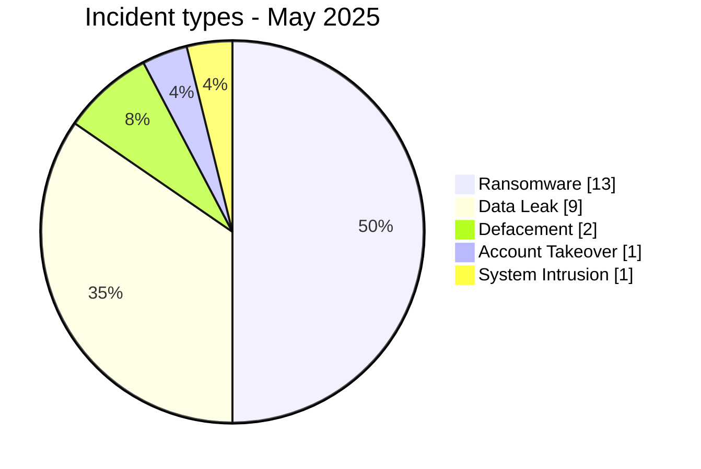

# AFRINTEL CTI Report - Cyber Threats in Africa - May 2025

👉🏾 [Version française](./README_FR.md)

   

## 1. Executive summary

In May 2025, AFRINTEL documents **26 cyber incidents** affecting organizations and digital services across **11 African countries**.

The landscape is dominated by **Ransomware with 13 records (50.0%)**, followed by **Data Leak with 9 (34.6%)**. Other observed types are Defacement 2, Account Takeover 1, System Intrusion 1.

Geographic concentration is significant: **South Africa (11)**, **Mauritania (6)**, **Egypt (1)** together account for **18 records, or 69.2% of the month**. This concentration reflects AFRINTEL corpus visibility rather than an exhaustive national compromise rate.

At sector level, the most represented categories are **Finance / Banking (9)**, **Technology / IT (5)**, **Government / Administration (2)**. The most frequent actor labels are `devman` (6), `kill9` (6), `Unknown` (3). `Unknown`, when present, denotes missing attribution rather than a threat actor.

Evidence maturity remains variable: **20 records** are unverified claims or claims accompanied by samples. AFRINTEL maintains a strict separation between **observed facts, claims, corroboration, official confirmation, and technical unknowns**.

Compared with April, monthly volume **increases by 6 records**. The most visible changes are Ransomware 7->13 (+6), Defacement 0->2 (+2), Access Sale 2->0 (-2).

> **Reading note:** AFRINTEL figures describe documented incidents and the visibility of observed threats. They are not an exhaustive measurement of every cyberattack that actually occurred across Africa.

### 1.1 Month-over-month comparison

| Indicator | April 2025 | May 2025 | Change |
|---|---:|---:|---:|
| Total incidents | 20 | 26 | **+6 (+30.0%)** |
| Ransomware | 7 | 13 | **+6 (+85.7%)** |
| Data Leak | 10 | 9 | **-1 (-10.0%)** |
| Access Sale | 2 | 0 | **-2 (-100.0%)** |
| DDoS | 1 | 0 | **-1 (-100.0%)** |
| Defacement | 0 | 2 | **+2 (new)** |
| Account Takeover | 0 | 1 | **+1 (new)** |
| System Intrusion | 0 | 1 | **+1 (new)** |
| Malware | 0 | 0 | **Stable** |
| Operational Fraud | 0 | 0 | **Stable** |

## 2. Methodology

- **Scope:** 54 African countries; reference period: May 2025.
- **Source of truth:** validated `victims_FR.md` / `victims.md` pair.
- **Classification:** Ransomware, Data Leak, Access Sale, DDoS, Defacement, Account Takeover, System Intrusion, Malware, and Operational Fraud.
- **Counting:** one canonical record equals one documented cyber incident; cases under investigation remain outside statistics.
- **Timeline:** `Incident date` and `Initial publication date` remain separate. A later disclosure does not artificially move an incident into another month when chronology is sufficiently supported.
- **Uncertain dates:** when no exact day is known, the evidence-supported month or time window is retained.
- **Sources:** public links are retained for supplementary incidents found through OSINT/web research; they are not retroactively imposed on historical or direct Dark Web observations.
- **Evidence:** incident type, status, confidence, impact, and provenance remain separate dimensions.
- **Sectors:** normalization is calculated once from the structured corpus and used identically in FR and EN.
- **Limitation:** frequencies reflect AFRINTEL visibility rather than every real compromise on the continent.

## 3. Overview and incident types

| Indicator | Value |
|---|---:|
| Documented incidents | **26** |
| Countries represented | **11** |
| Regions represented | **5** |
| Leading country | **South Africa (11)** |
| Leading sector | **Finance / Banking (9)** |
| Leading actor label | **devman (6)** |

| Incident type | Records | Share |
|---|---:|---:|
| Ransomware | 13 | 50.0% |
| Data Leak | 9 | 34.6% |
| Access Sale | 0 | 0.0% |
| DDoS | 0 | 0.0% |
| Defacement | 2 | 7.7% |
| Account Takeover | 1 | 3.8% |
| System Intrusion | 1 | 3.8% |
| Malware | 0 | 0.0% |
| Operational Fraud | 0 | 0.0% |
| **Total** | **26** | **100%** |

## 4. Geographic distribution

| Country | Total | Ransomware | Data Leak | Access Sale | DDoS | Defacement | Account Takeover | System Intrusion | Malware |
|---|---:|---:|---:|---:|---:|---:|---:|---:|---:|
| South Africa | **11** | 9 | 1 | 0 | 0 | 1 | 0 | 0 | 0 |
| Mauritania | **6** | 0 | 6 | 0 | 0 | 0 | 0 | 0 | 0 |
| Egypt | **1** | 1 | 0 | 0 | 0 | 0 | 0 | 0 | 0 |
| Kenya | **1** | 1 | 0 | 0 | 0 | 0 | 0 | 0 | 0 |
| Ivory Coast | **1** | 0 | 0 | 0 | 0 | 1 | 0 | 0 | 0 |
| Botswana | **1** | 1 | 0 | 0 | 0 | 0 | 0 | 0 | 0 |
| Algeria | **1** | 0 | 1 | 0 | 0 | 0 | 0 | 0 | 0 |
| Tanzania | **1** | 0 | 0 | 0 | 0 | 0 | 1 | 0 | 0 |
| Cameroon | **1** | 1 | 0 | 0 | 0 | 0 | 0 | 0 | 0 |
| Togo | **1** | 0 | 1 | 0 | 0 | 0 | 0 | 0 | 0 |
| Nigeria | **1** | 0 | 0 | 0 | 0 | 0 | 0 | 1 | 0 |
| **Total** | **26** | **13** | **9** | **0** | **0** | **2** | **1** | **1** | **0** |

> `Operational Fraud = 0` this month; the column is omitted for readability.

## 5. Regional distribution

| Region | Records | Share |
|---|---:|---:|
| Southern Africa | 12 | 46.2% |
| West Africa | 9 | 34.6% |
| North Africa | 2 | 7.7% |
| East Africa | 2 | 7.7% |
| Central Africa | 1 | 3.8% |
| **Total** | **26** | **100%** |

The leading region is **Southern Africa with 12 records (46.2%)**.

## 6. Sector impact

| Sector | Records | Share | Activity |
|---|---:|---:|---|
| Finance / Banking | 9 | 34.6% | █████████ |
| Technology / IT | 5 | 19.2% | █████ |
| Government / Administration | 2 | 7.7% | ██ |
| Healthcare / Medical | 2 | 7.7% | ██ |
| Mining | 2 | 7.7% | ██ |
| Professional / Business Services | 1 | 3.8% | █ |
| Manufacturing / Industry | 1 | 3.8% | █ |
| Transport / Logistics | 1 | 3.8% | █ |
| Not specified | 1 | 3.8% | █ |
| Education / University | 1 | 3.8% | █ |
| Retail / E-commerce | 1 | 3.8% | █ |
| **Total** | **26** | **100%** | |

## 7. Actors / groups

`Unknown` denotes missing attribution, not a threat actor.

| Actor / Group | Records | Activity |
|---|---:|---|
| devman | 6 | ██████ |
| kill9 | 6 | ██████ |
| Unknown | 3 | ███ |
| nightspire | 1 | █ |
| incransom | 1 | █ |
| Team 1722 (claim) | 1 | █ |
| killsec | 1 | █ |
| Phantom Atlas | 1 | █ |
| arkana | 1 | █ |
| everest | 1 | █ |
| Datacarry | 1 | █ |
| worldleaks | 1 | █ |
| cache | 1 | █ |
| Criminal syndicate - identities not attributed | 1 | █ |

## 8. Evidence maturity

| Evidence maturity | Records | Share |
|---|---:|---:|
| Claim - Unverified | 8 | 30.8% |
| Claim - Data Sample Published | 12 | 46.2% |
| Data Fully Published | 1 | 3.8% |
| Victim/Government/Authority Confirmed | 2 | 7.7% |
| Corroborated / Secondary evidence | 2 | 7.7% |
| Attempted | 1 | 3.8% |
| **Total** | **26** | **100%** |

Evidence statuses describe the available validation level; they do not change the technical incident type.

## 9. Timeline

```mermaid
timeline
    title AFRINTEL - May 2025
    01 May 2025 : South African IT firm - iOCO (Subsidiary of EOH)
    01 May 2025 : DovesIT
    01 May 2025 : South African HR company
    05 May 2025 : Future Association for Microfinance
    10 May 2025 : Pienaar Brothers
    15 May 2025 : Banque Al-Wava Mauritanienne Islamique (BAMIS)
    15 May 2025 : Banque Mauritanienne pour le Commerce International
    15 May 2025 : Banque pour le Commerce et l'Industrie (BCI)
    15 May 2025 : Orabank Mauritanie-SA
    15 May 2025 : Banque Islamique de Mauritanie (BIM Bank)
    15 May 2025 : General Bank of Mauritania (GBM)
    16 May 2025 : south african airways (SAA)
    17 May 2025 : vOffice.co.za
    19 May 2025 : NSSF (National Social Security Fund) KENYA
    19 May 2025 : igp.ci
    20 May 2025 : Medswana
    20 May 2025 : University Setif 1 - Ferhat Abbas (univ-setif.dz)
    20 May 2025 : Tanzania Police Force / Tanzania Revenue Authority official social-media accounts
    21 May 2025 : Anglo American plc
    23 May 2025 : netstar
    26 May 2025 : Mediclinic Group
    26 May 2025 : FrontierCo
    27 May 2025 : Eastern Platinum Limited (Eastplats)
    31 May 2025 : ASCOMA Cameroon
    31 May 2025 : Netmaster (netmaster.tg)
    May 2025 - exact attempt date not publicly disclosed : PremiumTrust Bank
```

## 10. Monthly CTI analysis

### Ransomware

**13 records** are classified as Ransomware. Leading countries: South Africa (9), Egypt (1), Kenya (1). A leak-site listing does not itself prove encryption or complete exfiltration.

### Data Leak

**9 records** are classified as Data Leak. Leading countries: Mauritania (6), Algeria (1), South Africa (1). AFRINTEL distinguishes actually observed data from aggregate volumes claimed by actors.

### Defacement

**2 Defacement records** are documented. Distribution: South Africa (1), Ivory Coast (1). Defacement is not reclassified as Data Leak without separate evidence.

### Account Takeover

**1 Account Takeover records** are documented. Distribution: Tanzania (1). This category keeps institutional-account compromise distinct.

### System Intrusion

**1 System Intrusion records** are documented. Distribution: Nigeria (1). The type is used where system access or attempted access is established without enough evidence for a more specific category.

## 11. Notable incidents

| Country | Organization | Type | Status | Impact | Confidence |
|---|---|---|---|---|---|
| Egypt | Future Association for Microfinance | Ransomware | Claim - Data Sample Published | Level 4 | Very High |
| Kenya | NSSF (National Social Security Fund) KENYA | Ransomware | Claim - Data Sample Published | Level 4 | Very High |
| South Africa | FrontierCo | Ransomware | Claim - Data Sample Published | Level 4 | Very High |
| Tanzania | Tanzania Police Force / Tanzania Revenue Authority official social-media accounts | Account Takeover | Government / Institution Confirmed | Level 3 | Very High |
| South Africa | Eastern Platinum Limited (Eastplats) | Data Leak | Victim Confirmed | Level 3 | Very High |

> This table highlights up to five records using structured impact, confirmation, and confidence fields. It is not an absolute severity ranking.

## 12. Key findings and intelligence gaps

- **Geographic concentration:** South Africa accounts for 11 records (42.3%), followed by Mauritania (6) and Egypt (1).
- **Threat structure:** Ransomware is the leading type with 13 records, followed by Data Leak (9).
- **Sectors:** Finance / Banking (9) and Technology / IT (5) have the highest visibility.
- **Actors:** the most frequent labels are devman (6), kill9 (6), and Unknown (3).
- **Evidence:** 20 records rely on unverified claims or claims with a published sample; these statuses do not equal complete technical confirmation.

### Intelligence gaps

- initial-access vector often not public;
- exact technical compromise date sometimes unknown;
- claimed volumes rarely fully verifiable;
- technical attribution often limited to a publication handle or label;
- public remediation, root-cause, and DFIR conclusions remain limited.

These gaps should guide collection rather than be replaced with assumptions.

## 13. Recommendations

### Organizations

- enforce phishing-resistant MFA on privileged accounts, VPN, email, social media, and administration consoles;
- apply PAM, least privilege, segmentation, and secret rotation;
- maintain immutable backups and test restoration;
- strengthen public applications, APIs, and administration interfaces;
- formalize incident response and data-breach notification.

### SOC and detection

- monitor abnormal authentication, MFA changes, privileged-account creation, and role elevation;
- detect mass database reads, unusual exports, archive creation, and large outbound transfers;
- correlate EDR, IAM, VPN, WAF, proxy, DNS, cloud, and application logs;
- distinguish DDoS, internal intrusion, account compromise, and data exposure to avoid unsupported conclusions.

### CTI

- keep incident date, initial publication, first observation, sample, disclosure, and confirmation separate;
- track republication and resale without automatically counting them as new compromise;
- preserve the evidence hierarchy between claim, corroboration, and confirmation;
- validate FR/EN parity before generating statistics.

## 14. Conclusion

**May 2025** contains **26 documented cyber incidents** across **11 African countries**. The monthly CTI value lies not only in volume but in separating **incident type, timeline, evidence level, geography, sector, and actor**.

The report therefore preserves a structured picture of the observable threat environment while keeping claims, corroboration, confirmations, and unknowns at their actual evidence level.

👉🏾 [See monthly victims](./victims.md)

**AFRINTEL** - TLP:CLEAR
