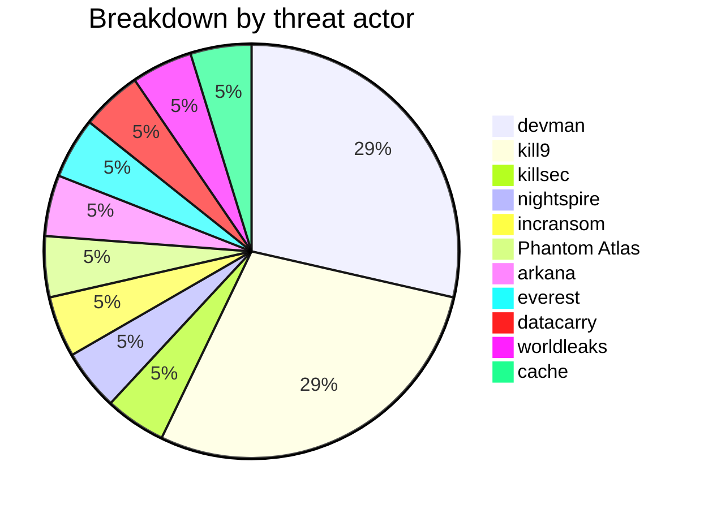
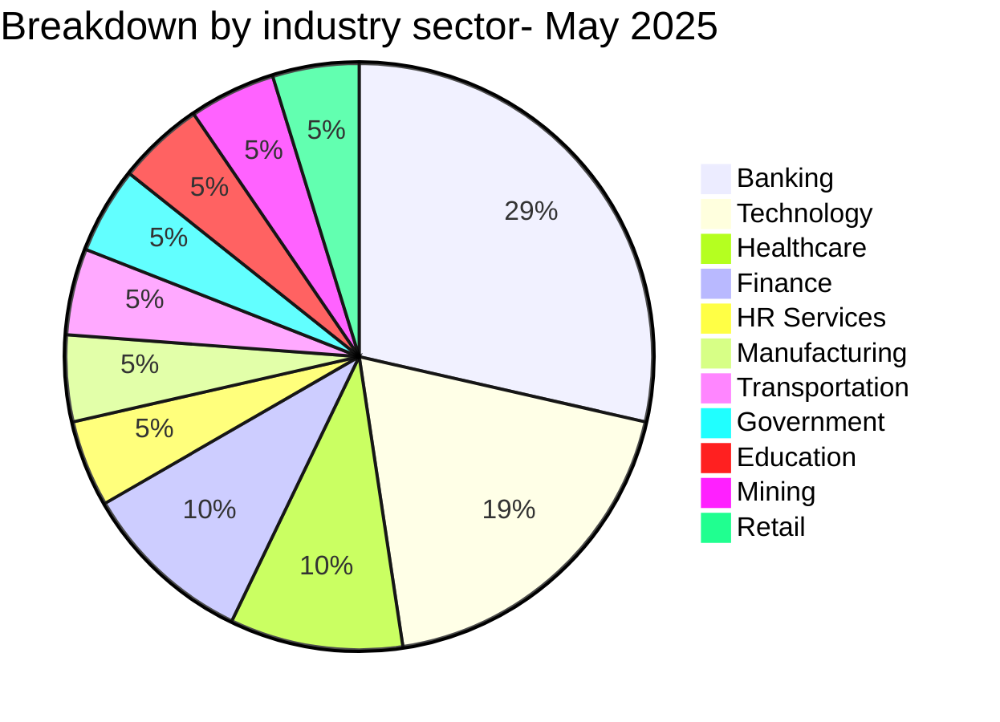
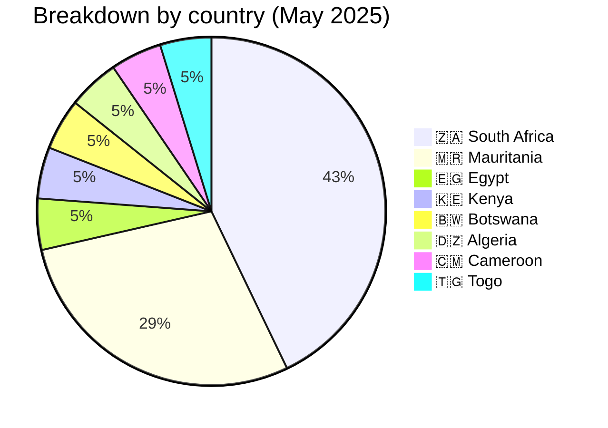
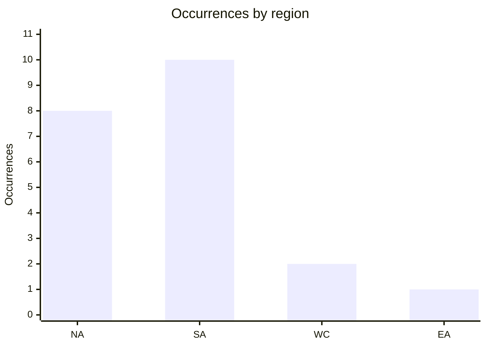
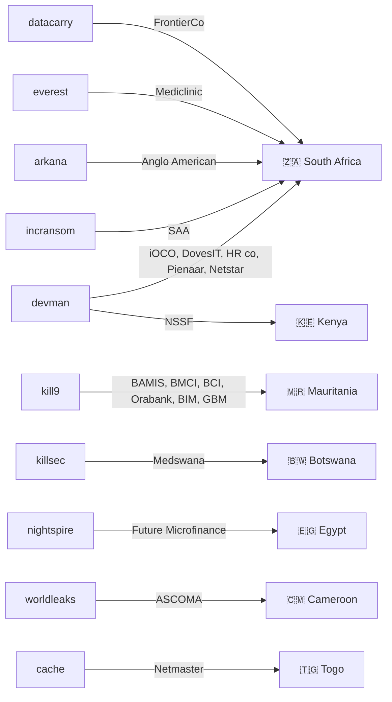

[](https://github.com/Hatchepsoute/AFRINTEL)


# CTI Report: Cyber Attacks in Africa - May 2025
👉🏾 [**French version available here**](./README_FR.md)

## 1. Introduction
This Cyber Threat Intelligence (CTI) report provides a detailed analysis of cyber attacks that occurred in Africa during May 2025. The information is derived from OSINT sources and ransomware group leak sites, compiled as part of the AFRINTEL project. The objective is to provide a clear overview of trends, threat actors, targeted sectors, and associated indicators of compromise.

## 2. Executive Summary
- **Total number of recorded attacks:** 21
- **Most active actors:** devman (6 attacks), kill9 (6), killsec (1), nightspire (1), incransom (1), Phantom Atlas (1), arkana (1), everest (1), datacarry (1), worldleaks (1), cache (1).
- **Most targeted sectors:** Banking / Financial Services (6), Technology (4), Healthcare (2), Finance / Insurance (2), Business Services (1), Industry (1), Transport (1), Government (1), Education (1), Mining (1), Retail (1).
- **Most affected countries:** South Africa (9), Mauritania (6), Egypt (1), Kenya (1), Botswana (1), Algeria (1), Cameroon (1), Togo (1).
- **Exfiltrated data volume:** 2.5 TB for NSSF Kenya, 1 GB for Netmaster Togo. The Mauritania banking claim (kill9) published customer and payment-card samples without a stated total volume; other volumes are not specified.

## 3. Key Statistics

### 3.1 Breakdown by threat actor
| Actor | Number of Attacks |
|-------------------|-------------------|
| devman            | 6                 |
| kill9             | 6                 |
| killsec           | 1                 |
| nightspire        | 1                 |
| incransom         | 1                 |
| Phantom Atlas     | 1                 |
| arkana            | 1                 |
| everest           | 1                 |
| datacarry         | 1                 |
| worldleaks        | 1                 |
| cache             | 1                 |
| **Total**         | **21**            |



### 3.2 Breakdown by sector
| Sector | Number of Attacks |
|---------|-------------------|
| Banking / Financial Services | 6 |
| Technology | 4 |
| Healthcare / Pharmacy | 2 |
| Finance / Insurance | 2 |
| Business Services (HR) | 1 |
| Industry (PPE) | 1 |
| Air Transport | 1 |
| Government / Social | 1 |
| Education | 1 |
| Mining | 1 |
| Retail / Distribution | 1 |
| **Total** | **21** |



### 3.3 Breakdown by country
| Country | Number of Attacks |
|------|-------------------|
| 🇿🇦 South Africa | 9 |
| 🇲🇷 Mauritania | 6 |
| 🇪🇬 Egypt | 1 |
| 🇰🇪 Kenya | 1 |
| 🇧🇼 Botswana | 1 |
| 🇩🇿 Algeria | 1 |
| 🇨🇲 Cameroon | 1 |
| 🇹🇬 Togo | 1 |
| **Total** | **21** |



<!-- AFRINTEL_CURRENT_MODEL_START -->
### 3.4 Standard global overview

| Country | Ransomware | Data exposure (leaks + access) | Total | Distribution |
| :--- | ---: | ---: | ---: | :--- |
| 🇿🇦 South Africa | 9 | 0 | 9 | 🟧🟧🟧🟧🟧🟧🟧🟧🟧 |
| 🇲🇷 Mauritania | 0 | 6 | 6 |  🟦🟦🟦🟦🟦🟦 |
| 🇩🇿 Algeria | 0 | 1 | 1 |  🟦 |
| 🇧🇼 Botswana | 1 | 0 | 1 | 🟧 |
| 🇨🇲 Cameroon | 1 | 0 | 1 | 🟧 |
| 🇪🇬 Egypt | 1 | 0 | 1 | 🟧 |
| 🇰🇪 Kenya | 1 | 0 | 1 | 🟧 |
| 🇹🇬 Togo | 0 | 1 | 1 |  🟦 |

```pie
    title Incident types
    "Ransomware" : 13
    "Data leaks + access sales" : 8
```

### Monthly aggregate exposure view

The monthly CTI view combines data leaks and access sales as **data exposure**: **8 records** (38.1% of the monthly corpus). The underlying source cards remain authoritative, and an access sale does not by itself prove data exfiltration.


### Geographic distribution by region

| Region | Occurrences | Ransomware | Data exposure (leaks + access) | Distribution |
| :--- | ---: | ---: | ---: | :--- |
| North Africa | 8 | 1 | 7 | 🟧 🟦🟦🟦🟦🟦🟦🟦 |
| Southern Africa | 10 | 10 | 0 | 🟧🟧🟧🟧🟧🟧🟧🟧🟧🟧 |
| West and Central Africa | 2 | 1 | 1 | 🟧 🟦 |
| East Africa | 1 | 1 | 0 | 🟧 |


Legend: NA = North Africa; SA = Southern Africa; WC = West and Central Africa; EA = East Africa

### Sector distribution

| Sector | Records | Share | Activity |
| :--- | ---: | ---: | :--- |
| Finance / Banking | 8 | 38.1% | ██████████ |
| Technology / IT | 4 | 19.0% | █████ |
| Healthcare / Medical | 2 | 9.5% | ██ |
| Education / University | 1 | 4.8% | █ |
| Energy / Utilities | 1 | 4.8% | █ |
| Government / Administration | 1 | 4.8% | █ |
| Manufacturing / Industry | 1 | 4.8% | █ |
| Professional / Business Services | 1 | 4.8% | █ |
| Retail / E-commerce | 1 | 4.8% | █ |
| Transport / Logistics | 1 | 4.8% | █ |

### Most visible actors

| Actor / Group | Records | Activity |
| :--- | ---: | :--- |
| devman | 6 | ██████████ |
| kill9 | 6 | ██████████ |
| Datacarry | 1 | ██ |
| Phantom Atlas | 1 | ██ |
| arkana | 1 | ██ |
| cache | 1 | ██ |
| everest | 1 | ██ |
| incransom | 1 | ██ |
| killsec | 1 | ██ |
| nightspire | 1 | ██ |
<!-- AFRINTEL_CURRENT_MODEL_END -->
## 4. Detailed Attacks by Threat Actor

### 4.1 devman (6 attacks)
- **01/05/2025:** iOCO (South Africa, technology)
- **01/05/2025:** DovesIT (South Africa, technology)
- **01/05/2025:** South African HR company (South Africa, business services)
- **10/05/2025:** Pienaar Brothers (South Africa, industry PPE)
- **19/05/2025:** NSSF Kenya (Kenya, government) – 2.5 TB exfiltrated, ransom $4.5M
- **23/05/2025:** Netstar (South Africa, technology)

*Note:* devman concentrated its attacks on South Africa (5) and Kenya (1), with sectoral diversification (technology, HR, industry, government). The attack against Kenya's NSSF was the largest of the month.

### 4.2 kill9 (6 attacks)
- **15/05/2025:** Banque Al-Wava Mauritanienne Islamique - BAMIS (Mauritania, banking) – card sample published
- **15/05/2025:** Banque Mauritanienne pour le Commerce International (Mauritania, banking) – card sample published
- **15/05/2025:** Banque pour le Commerce et l'Industrie - BCI (Mauritania, banking) – card sample published
- **15/05/2025:** Orabank Mauritanie-SA (Mauritania, banking) – card sample published
- **15/05/2025:** Banque Islamique de Mauritanie - BIM Bank (Mauritania, banking) – named in claim, no bank-specific sample
- **15/05/2025:** General Bank of Mauritania - GBM (Mauritania, banking) – named in claim, no bank-specific sample

*Note:* kill9 published a single DarkForums post claiming a coordinated intrusion into six Mauritanian banks, with a 48-hour sale window announced for the full dataset via Telegram. Four of the six institutions (BAMIS, Banque Mauritanienne pour le Commerce International, BCI, Orabank) are tied to bank-specific payment-card samples in the post; the remaining two (BIM Bank, GBM) are named only in the actor's target list without a dedicated sample, and are recorded with lower confidence accordingly. The post also displayed a card sample attributed to a seventh, unlisted institution (Banque El Amana), which AFRINTEL cannot reconcile with the stated six-bank scope.

### 4.3 killsec (1 attack)
- **20/05/2025:** Medswana (Botswana, pharmacy/healthcare)

### 4.4 nightspire (1 attack)
- **05/05/2025:** Future Association for Microfinance (Egypt, finance)

### 4.5 incransom (1 attack)
- **16/05/2025:** South African Airways (South Africa, air transport)

### 4.6 arkana (1 attack)
- **21/05/2025:** Anglo American plc (South Africa, mining)

### 4.7 everest (1 attack)
- **26/05/2025:** Mediclinic Group (South Africa, healthcare)

### 4.8 datacarry (1 attack)
- **26/05/2025:** FrontierCo (South Africa, retail/distribution)

### 4.9 worldleaks (1 attack)
- **31/05/2025:** ASCOMA Cameroon (Cameroon, insurance)

### 4.10 cache (1 attack)
- **31/05/2025:** Netmaster (Togo, technology/hosting) – 1 GB exfiltrated (data leak)
### 4.11 Actor →victim → country graph

## 5. Sectoral Analysis
- **Banking / Financial Services:** 6 attacks, all claimed by kill9 against Mauritanian banks (BAMIS, Banque Mauritanienne pour le Commerce International, BCI, Orabank Mauritanie-SA, BIM Bank, GBM) in a single coordinated post. Bank-specific card samples support four of the six claims with medium confidence; the remaining two are unverified.
- **Technology:** 4 attacks (iOCO, DovesIT, Netstar, Netmaster). devman dominates, with a data leak affecting a Togolese registrar claimed by the threat actor cache.
- **Healthcare/Pharmacy:** 2 attacks (Medswana, Mediclinic). killsec and everest target healthcare players in Botswana and South Africa.
- **Finance/Insurance:** 2 attacks (Future Microfinance, ASCOMA). nightspire and worldleaks target an Egyptian NGO and a Cameroonian broker.
- **Business Services (HR):** 1 attack (South African HR company) by devman, showing interest in personal data.
- **Industry (PPE):** 1 attack (Pienaar Brothers) by devman, in the mining sector.
- **Air Transport:** 1 attack (SAA) by incransom, hitting the South African national airline.
- **Government/Social:** 1 attack (NSSF Kenya) by devman, with massive exfiltration.
- **Mining:** 1 attack (Anglo American) by arkana, targeting a mining giant.
- **Retail/Distribution:** 1 attack (FrontierCo) by datacarry.

## 6. Geographic Analysis
- **South Africa:** 9 attacks, including 6 by devman. All sectors are represented, with a strong focus on technology and critical infrastructures.
- **Mauritania:** 6 attacks, all claimed by kill9 in a single post targeting the country's banking sector; the largest single-actor, single-country claim of the month after devman's South Africa campaign.
- **Egypt:** 1 attack (microfinance) by nightspire.
- **Kenya:** 1 major attack (NSSF) by devman, with 2.5 TB of data exfiltrated.
- **Botswana:** 1 attack (pharmacy) by killsec.
- **Cameroon:** 1 attack (insurance) by worldleaks.
- **Togo:** 1 attack (web hosting) claimed by the threat actor cache.

South Africa remains the most affected country, confirming its position as a regional economic hub and prime target, but Mauritania's banking sector was the target of the month's second-largest claimed campaign.

## 7. Observed TTPs
- **Massive exfiltration:** NSSF Kenya (2.5 TB) and Netmaster (1 GB) illustrate the collection of large data volumes.
- **Coordinated multi-institution targeting:** kill9 claimed six Mauritanian banks in a single post, with payment-card samples used to substantiate four of the six claims.
- **Targeting critical infrastructures:** air transport (SAA), mining (Anglo American), healthcare (Mediclinic), government (NSSF), banking (Mauritania).
- **Dominance of two actors:** devman and kill9 are each responsible for 6 of the 20 recorded incidents (30% each), showing two parallel active campaigns.
- **Diversity of victims:** large groups (Anglo, SAA, Mediclinic) and SMEs (DovesIT, Pienaar) are equally targeted.
- **Double extortion / sale model:** claims with published data samples, including a 48-hour sale countdown in the Mauritania case.

## 8. Recommendations
- **South Africa:** strengthen cybersecurity across all sectors, especially technology and critical infrastructures.
- **Mauritanian banking sector:** affected and named institutions should urgently review network segmentation, rotate credentials, and monitor for fraudulent card-present/card-not-present transactions on the BIN ranges referenced in the claim.
- **Public sector:** organizations like NSSF should implement offline backups and network segmentation.
- **Technology companies:** MSPs (iOCO, DovesIT, Netstar) are prime targets; they must secure access and monitor anomalous activities.
- **Mining sector:** Anglo American must protect sensitive data and industrial systems.
- **All sectors:** train employees on phishing detection, multi-factor authentication, and regular audits.

## 9. Conclusion
May 2025 was marked by two parallel campaigns of equal scale: devman's sustained activity against South Africa and Kenya, including a massive attack on NSSF (2.5 TB), and kill9's coordinated claim against six Mauritanian banks, published as a single sale listing with a 48-hour countdown. The sectoral diversity (technology, healthcare, mining, transport, banking) shows that attackers target both critical infrastructures and service companies. South Africa remains the most affected country by volume, but the Mauritania banking claim illustrates a shift toward coordinated, sector-wide targeting. Regional cooperation and information sharing are more necessary than ever.

## ✍🏿 Author
*Adama ASSIONGBON*  
*SOC & Cyber Threat Intelligence Consultant*  
[LinkedIn Profile](https://www.linkedin.com/in/adama-assiongbon-9029893a/)

---
*AFRINTEL - Open CTI Monitoring Initiative on Africa*
